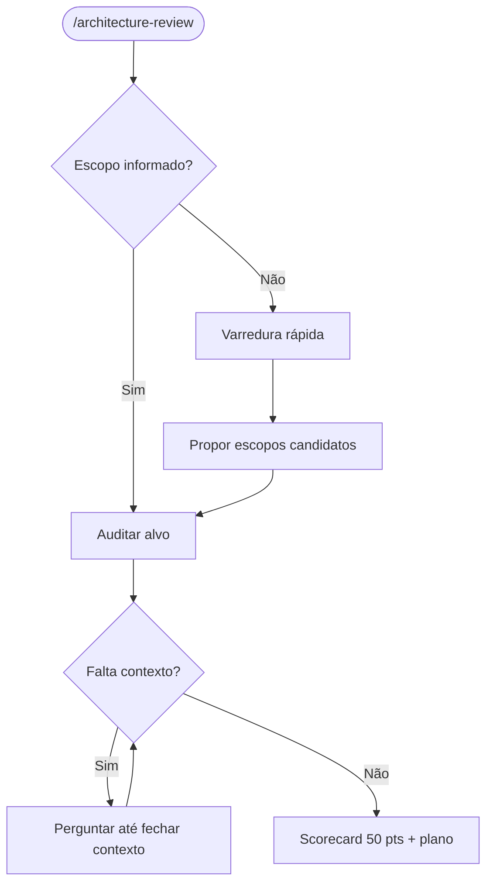

# 🏛️ Architecture Review (`/architecture-review`)

<div align="center">

[](../../../README.md)
[](../../../guides/architecture/README.md)

<p align="center">
  <b>Skill orquestradora para auditoria de arquitetura de software, Clean Code, SOLID, system design, escalabilidade, persistência, observabilidade e governança evolutiva.</b>
</p>

</div>

---

## 🎯 Objetivo

`/architecture-review` analisa um sistema, diretório, serviço, RFC ou repositório e avalia conformidade com:

- [`guides/architecture/guia-arquitetura-software-design-clean-code.md`](../../../guides/architecture/guia-arquitetura-software-design-clean-code.md)
- [`guides/architecture/guia-system-design-sistemas-distribuidos.md`](../../../guides/architecture/guia-system-design-sistemas-distribuidos.md)

A skill usa sabatina interna estilo `grill-me`: se faltar contexto para avaliar SLOs, volume, consistência, topologia ou decisões irreversíveis, ela pergunta antes de concluir.

---

## 🧭 Fluxo



---

## 🔍 As 5 Lentes

1. **Fronteiras, Domínio & Dependências** — Clean/Hexagonal, domínio puro, mappers, bounded contexts.
2. **Design Interno, SOLID & Clean Code** — SRP, DIP, SLAP, Value Objects, God Objects, YAGNI.
3. **Dados, Consistência & Persistência** — CAP/PACELC, CQRS, sharding, replicação, monolithic persistence.
4. **Escala, Resiliência & Comunicação** — p99, QPS, timeouts, retries com jitter, cache, filas, DLQ, idempotência.
5. **Governança, Observabilidade & Evolução** — ADRs, C4/arc42, fitness functions, RED/USE, tracing, Strangler Fig.

---

## 🚀 Como Executar

```text
> /architecture-review
> /architecture-review src/domain
> /architecture-review apps/api
> /architecture-review docs/rfcs/new-billing-architecture.md
```

Sem escopo explícito, a skill faz uma varredura rápida e pergunta qual alvo deve ser auditado.

---

## 📦 Instalação Local

```bash
mkdir -p ~/.claude/skills/architecture-review
cp skills/software-engineering/architecture-review/SKILL.md ~/.claude/skills/architecture-review/
```
