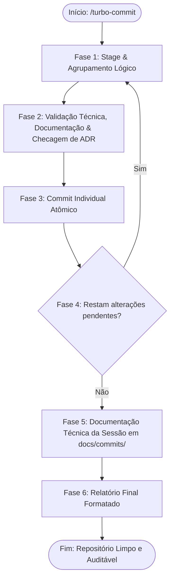
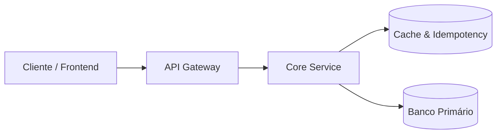

# Universal Commit, Doc & ADR Orchestrator (`commit-e-documentar`)

Esta skill orquestra a execução de um fluxo de engenharia rigoroso, determinístico e multi-stack para organizar, validar, documentar, avaliar necessidades de **Architecture Decision Records (ADRs)** e comitar alterações no repositório de forma incremental e atômica (*micro-commits*).

---

## 🔁 As 6 Fases do Fluxo Determinístico

O ciclo é executado em loop contínuo até que todas as alterações da árvore de trabalho sejam comitadas, seguido da gravação do relatório técnico consolidado da sessão e da exibição do sumário executivo.



---

### Fase 1: Stage & Agrupamento Lógico (Stage)

1. **Identificar Alterações Pendentes:**
   Execute `git status --porcelain` para inspecionar com precisão o estado de cada arquivo modificado, adicionado ou deletado.
2. **Agrupamento por Afinidade Funcional e Camadas:**
   Isole as modificações em conjuntos coesos e desacoplados:
   - **Camada de Dados:** Schemas de banco de dados, migrations DDL e seeds.
   - **Camada de Domínio & Aplicação:** Entidades, use cases, services de backend e seus testes unitários correspondentes.
   - **Camada de Apresentação / UI:** Componentes de interface, páginas, estilos e testes de componentes.
   - **Infraestrutura & Configuração:** Pipelines de CI/CD, Dockerfiles, variáveis de ambiente ou dependências do projeto.
3. **Adicionar ao Staging com Isolamento:**
   Adicione estritamente os arquivos do grupo selecionado via `git add <arquivos>`. Mantenha os demais arquivos em estado *unstaged*.

---

### Fase 2: Validação Técnica, Documentação & ADR Check

Para cada grupo isolado no staging, execute **obrigatoriamente** as três verificações abaixo:

#### 1. Documentação de Código (Inline e Externa)

- **Documentação Inline (Clean Code e Marcadores de Seção):**
  - Inserir divisores lógicos `MARK: - [Seção]` na sintaxe correspondente da linguagem (ex: `// MARK: - Handlers`, `# MARK: - Services`, `// MARK: - Interfaces`).
  - Documentar contratos de métodos, funções e tipos com docstrings padronizadas:
    - **TypeScript / JavaScript:** TSDoc / JSDoc (`/** ... */`) com `@param`, `@returns`, `@throws`.
    - **Python:** Google Style Docstrings (`Args:`, `Returns:`, `Raises:`).
    - **PHP:** PHPDoc (`/** ... */`) com declarações de tipos estritos e `@throws`.
    - **Go:** Comentários idiomáticos no padrão Godoc.
    - **Rust:** Documentação nativa Rustdoc (`///`).
    - **Java:** Javadoc (`/** ... */`).
    - **.NET / C#:** Comentários estruturados XML (`/// <summary>`).
  - Justificar o *porquê* de regras de negócio complexas e tratamentos de exceção.
- **Documentação Externa (`guides/` ou `docs/specs/`):**
  - Se a alteração introduzir novos contratos de API, especificações ou guias operacionais, crie ou atualize o respectivo documento Markdown com o log de manutenção no topo.

#### 2. Avaliação dos 6 Gatilhos Arquiteturais Canônicos de ADR

Avalie se as alterações do grupo enquadram-se em um ou mais dos 6 gatilhos normativos definidos em `guides/essentials/guia-padrao-criacao-adrs.md`:

| Gatilho Arquitetural | Exemplos de Mudanças que Exigem ADR Obrigatória |
| :--- | :--- |
| **1. Comunicação / Protocolos** | Introdução ou alteração de API Gateways, mensageria assíncrona (Kafka, RabbitMQ, SQS), WebSockets, gRPC, REST, GraphQL ou BFF. |
| **2. Modelagem & Persistência** | Criação ou alteração estrutural de tabelas SQL/NoSQL, migrations DDL críticas, padrão *Append-Only*, particionamento ou sharding. |
| **3. Segurança, Auth & Zero-Trust** | Políticas de autenticação corporativa, RBAC, tokens/cookies httpOnly, criptografia, resolução server-side de identidade (Anti-IDOR). |
| **4. Regulação & Privacidade** | Adequação à LGPD/GDPR, normas trabalhistas, fiscais, assinaturas eletrônicas avançadas, custódia probatória ou trilhas de auditoria. |
| **5. Resiliência Distribuída** | Implementação de *Circuit Breakers*, *Idempotency Keys*, retentativas com *Jitter*, filas de mensagens mortas (*DLQ*) ou *Storage Lock*. |
| **6. Adoção/Descontinuação Tech** | Seleção de novos frameworks, substituição de bibliotecas centrais de infraestrutura, mudança de paradigmas de gerenciamento de estado. |

> [!IMPORTANT]
> - Mudanças triviais ou cosméticas (ex: renomear variável local, refatorar função utilitária pura) **NÃO** exigem ADR.
> - Mudanças estruturais enquadradas nos 6 gatilhos tornam a criação de ADR **MANDATÓRIA**.

##### Procedimento para Geração da ADR

1. **Identificar Número Sequencial:** Consulte os arquivos em `docs/adr/` e determine o próximo número sequencial de 4 dígitos (`0001`, `0002`, etc.).
2. **Nomenclatura Padrão:** `docs/adr/[NUMERO_4_DIGITOS]-[slug-em-kebab-case].md`.
3. **Anatomia em 8 Seções Canônicas:**
   - Cabeçalho de Log de Manutenção (`Data | Autor | Descrição`).
   - Título: `# ADR [NUMERO_4_DIGITOS]: [Título Declarativo]`.
   - `## Status`: `**Proposta** (YYYY-MM-DD)` ou `**Aprovada** (YYYY-MM-DD)` ou `**Implementada** (YYYY-MM-DD)`.
   - `## Contexto` com `### Riscos Identificados e Problemas a Resolver`.
   - `## 1. Fundamentação Jurídica & Fontes Normativas Diretas` (se aplicável).
   - `## 2. Decisão de Arquitetura` (com diagramas em Mermaid).
   - `## 3. Matriz de Implementação Técnica (*IN-CODE*)` (Backend, Frontend e Banco de Dados com DDL executável).
   - `## 4. Matriz de Ações de Governança & Jurídicas (*OFF-CODE*)` (se aplicável).
   - `## 5. Prazos Legais de Guarda e Políticas de Retenção` (se aplicável).
   - `## 6. Matriz de Conformidade e Mitigação de Riscos`.
   - `## 7. Consequências e Resultados` (`### Positivas` e `### Mitigações e Desafios Gerenciados`).
4. **Adicionar ao Staging:** Execute `git add docs/adr/[NUMERO_4_DIGITOS]-[slug-em-kebab-case].md`.

#### 3. Validação Técnica Agnóstica (Matriz por Ecossistema)

Execute as suítes de teste, linter e formatação correspondentes à stack do repositório antes de prosseguir:

| Ecossistema / Stack | Testes Unitários e Integração | Linter e Análise Estática | Formatação / Checagem de Tipos |
| :--- | :--- | :--- | :--- |
| **Python** | `pytest` | `ruff check .` ou `flake8` | `ruff format --check .`, `mypy .` |
| **PHP** | `vendor/bin/pest` ou `vendor/bin/phpunit` | `vendor/bin/phpstan analyse` | `vendor/bin/pint --test` |
| **Node.js / TypeScript** | `npm test` / `pnpm test` / `yarn test` | `npx eslint .` | `npx tsc --noEmit`, `npx prettier --check .` |
| **Go** | `go test ./...` | `golangci-lint run` | `gofmt -l .` |
| **Rust** | `cargo test` | `cargo clippy -- -D warnings` | `cargo fmt --check` |
| **Java** | `mvn test` ou `./gradlew test` | `mvn checkstyle:check` | `mvn spotless:check` |
| **.NET / C#** | `dotnet test` | `dotnet format --verify-no-changes` | `dotnet build --warnaserror` |

> [!CAUTION]
> **Bloqueio de Qualidade:** Se qualquer teste automatizado ou checagem estática falhar, interrompa o fluxo imediatamente. Corrija o código e revalide antes de gerar o commit.

---

### Fase 3: Commit Individual Atômico (Commit)

1. **Formatação Conventional Commits:**
   - Estrutura: `<tipo>(<escopo>): <descrição concisa no imperativo>`
   - Tipos válidos: `feat`, `fix`, `docs`, `style`, `refactor`, `test`, `chore`, `perf`, `ci`, `build`.
2. **Exemplo Real com Heredoc:**
   Execute via Heredoc no terminal para garantir a correta preservação de quebras de linha na mensagem:
   ```bash
   git commit -m "$(cat <<'EOF'
   feat(billing): implementar middleware de idempotencia com redis

   - Adiciona validacao obrigatoria do cabecalho Idempotency-Key em rotas POST
   - Configura lock atomico no Redis com TTL de 24 horas
   - Vincula a implementacao a ADR 0005
   EOF
   )"
   ```

---

### Fase 4: Repetição Controlada (Repeat)

1. **Verificar Estado da Árvore:**
   Execute `git status --porcelain`.
2. **Controle de Fluxo:**
   - **Se restarem arquivos pendentes:** Retorne para a **Fase 1** e isole o próximo grupo lógico.
   - **Se a árvore de trabalho estiver totalmente limpa:** Avance para a **Fase 5**.

---

### Fase 5: Documentação Técnica da Sessão em `docs/commits/`

Com todos os micro-commits concluídos, gere o arquivo consolidado de auditoria em `docs/commits/YYYY-MM-DD_<escopo-principal>.md`.

#### Estrutura Obrigatória do Documento
 
````markdown
<!--
================================================================================
LOG DE MANUTENÇÃO DE DOCUMENTAÇÃO
--------------------------------------------------------------------------------
Data       | Autor          | Descrição
--------------------------------------------------------------------------------
YYYY-MM-DD | Nome do Autor  | Registro consolidado de desenvolvimento da sessão.
================================================================================
-->

# Registro de Desenvolvimento — YYYY-MM-DD

| Metadado | Detalhe |
| :--- | :--- |
| **Escopo Principal** | `<módulo / feature principal>` |
| **Commits Gerados** | `<quantidade total de commits>` |
| **Arquivos Modificados** | `<quantidade de arquivos alterados>` |
| **ADRs Vinculadas / Geradas** | `docs/adr/XXXX-slug.md` (ou "Nenhuma") |

---

## 1. Visão Geral das Alterações
> Resumo executivo em 2 a 4 frases explicando as entregas da sessão e os benefícios técnicos alcançados.

---

## 2. Arquitetura Afetada & Decisões (ADRs)
- **Decisões Registradas:**
  - `docs/adr/XXXX-slug.md`: [Resumo da decisão tomada e seus impactos].
- **Diagrama de Relações e Fluxos:**



---

## 3. Mapa de Arquivos Modificados

| Arquivo | Camada Técnica | Resumo da Modificação |
| :--- | :--- | :--- |
| `src/modules/billing/service.ts` | Service / Core | Implementação do fluxo de idempotência |
| `docs/adr/0005-idempotencia.md` | Governança | Nova ADR documentando lock no Redis |

---

## 4. Detalhamento por Commit

### `<tipo>(<escopo>): <título>`

- **Razão da alteração:** Motivação técnica ou de negócio.
- **Comportamento atual:** Como o sistema opera pós-implementação.
- **Decisões técnicas & ADRs:** Relação com decisões estruturais.
- **Arquivos envolvidos:**
  - `caminho/do/arquivo`: descrição sucinta da alteração.

---

## 5. Dívida Técnica & Próximos Passos

- [ ] Oportunidade de melhoria futura identificada na sessão.
- [ ] Próxima etapa prioritária de desenvolvimento.
````

#### Commit da Documentação de Sessão
```bash
git add docs/commits/YYYY-MM-DD_<escopo-principal>.md
git commit -m "docs(commits): registrar sessao de desenvolvimento de YYYY-MM-DD"
```

---

### Fase 6: Relatório Final Formatado no Chat

Após finalizar todos os commits e a documentação, exiba o sumário executivo no chat:

````markdown
# 🚀 Fluxo Determinístico Concluído com Sucesso

> [!NOTE]
> **Data da Sessão:** 2026-09-08<br>
> **Status da Árvore de Trabalho:** 🟢 Limpa (Zero alterações pendentes)

---

### 📦 Commits Atômicos Gerados

| Hash | Tipo e Escopo | Descrição das Modificações |
| :---: | :--- | :--- |
| `a1b2c3d` | `feat(billing)` | Implementar middleware de idempotência com Redis |
| `e4f5a6b` | `test(billing)` | Adicionar suíte de testes unitários para verificação de chaves |
| `c7d8e9f` | `docs(commits)` | Registrar sessão de desenvolvimento de 2026-09-08 |

---

### 🏛️ Decisões Arquiteturais Registradas (ADRs)
- 🟢 `docs/adr/0005-idempotencia-com-redis.md` — Padronização de lock atômico para rotas financeiras.

---

### 📄 Documentação Técnica Consolidada
- 📝 `docs/commits/2026-09-08_billing-idempotencia.md`

---

## ⚡ Próximos Passos Sugeridos

- [ ] Executar `/architecture-review` para reavaliar o scorecard de resiliência e concorrência do módulo atualizado.
- [ ] Conectar as novas rotas à documentação interativa OpenAPI/Scalar através da skill `/code-documentar`.
````
