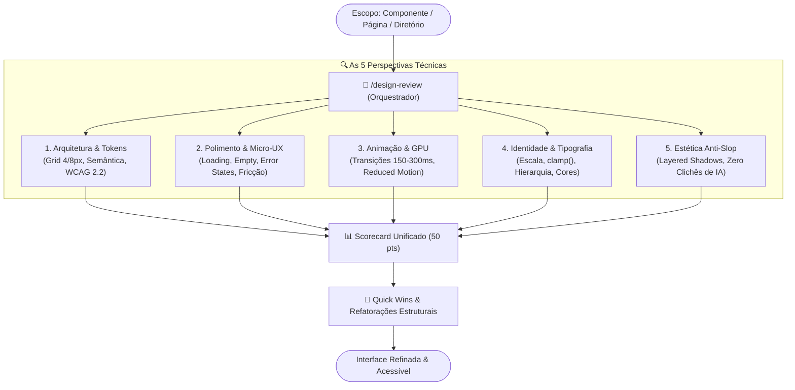

# 🎨 Design Review Orchestrator (`/design-review`)

<div align="center">

[](../../../README.md)
[](../README.md)
[](../../../guides/design-ui-ux/guia-universal-design-ui-ux-acessibilidade.md)

<p align="center">
  <b>Skill orquestradora para auditoria profunda de UI/UX, Frontend, Acessibilidade (WCAG 2.2 AAA), Design Tokens e Padrão Visual Anti-Slop.</b>
</p>

</div>

---

## 📌 Visão Geral & Papel de Orquestrador

A skill `/design-review` opera como um **Orquestrador Central** para inspeção e auditoria de qualidade de interfaces modernas. Ela unifica **5 perspectivas especializadas** em um scorecard integrado de 50 pontos, agnóstica de framework (React, Angular Standalone/Signals, Vue 3, Svelte 5, Tailwind CSS, CSS canônico, Radix UI, shadcn/ui).



---

## 📦 Empacotamento em Plugin & Instalação Automática (Opção A)

Para que você **não precise baixar as skills individualmente**, a `/design-review` e toda a suíte de engenharia de software são distribuídas no formato canônico de **Claude Plugin / OpenClaude Plugin** através do arquivo [`.claude-plugin/plugin.json`](../../../.claude-plugin/plugin.json).

### 🚀 Instalação Única (Traz Todas as Skills)

Ao instalar o plugin do repositório, o Claude Code / OpenClaude registra automaticamente **todas as skills do ecossistema** de uma só vez:

```bash
# Registrar marketplace oficial e instalar a biblioteca no projeto
openclaude plugin marketplace add Casa-Publicadora-Brasileira/ai-guides
openclaude plugin install ai-engineering-skills-library@ai-guides --scope project
```

### 🧩 Como a Orquestração Funciona por Trás dos Panos

1. **Execução Nativa Autocontida:** O arquivo [`SKILL.md`](SKILL.md) contém toda a inteligência analítica necessária para auditar as 5 lentes de forma autônoma, sem exigir ferramentas externas obrigatórias.
2. **Integração com o Guia Canônico:** Consome automaticamente as diretrizes de referência de [`guides/design-ui-ux/guia-universal-design-ui-ux-acessibilidade.md`](../../../guides/design-ui-ux/guia-universal-design-ui-ux-acessibilidade.md).
3. **Sinergia com Skills Complementares:** Quando instaladas no mesmo ambiente (como `taste-skill`, `ui-ux-pro-max-skill` ou `frontend-design`), o orquestrador combina os insights dessas ferramentas especializadas para aprofundar a avaliação de estética e micro-interações.

---

## ⚡ Como Utilizar

No terminal interativo do seu assistente:

```text
# Auditoria no contexto atual ou diretório aberto
> /design-review

# Auditoria em componente ou pasta específica
> /design-review src/components/Button
> /design-review src/app/pages/dashboard
```

---

## 📊 Matriz do Scorecard de Avaliação (50 Pontos)

| Lente de Auditoria | Foco Técnico Principal | Peso |
| :--- | :--- | :---: |
| **1. Arquitetura de UI/UX & Tokens** | Grid 4/8px, estrutura semântica HTML5, anéis de foco e conformidade WCAG 2.2 AA/AAA. | `10 pts` |
| **2. Polimento Fino & Micro-UX** | Estados completos (loading skeletons, empty, error) e prevenção de fricção em formulários. | `10 pts` |
| **3. Animação & Interatividade** | Micro-interações, curvas de easing, aceleração por GPU (`transform`, `opacity`) e `prefers-reduced-motion`. | `10 pts` |
| **4. Identidade Visual & Tipografia** | Escala tipográfica fluida (`clamp()`), contraste cromático e paleta de cores funcional/semântica. | `10 pts` |
| **5. Estética & Filtro Anti-Slop** | Sombras em camadas (*layered shadows*), superfícies refinadas e eliminação de gradientes genéricos de IA. | `10 pts` |
