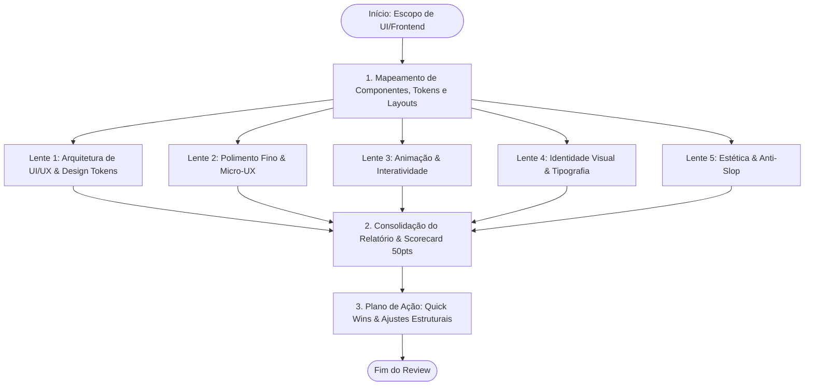

# Orchestrated UI/UX & Frontend Design Review (5-Perspective Audit)

Esta skill orquestra uma análise completa, aprofundada e integrada de UI, UX, Frontend e Design System em qualquer projeto ou conjunto de componentes. A auditoria opera de forma totalmente agnóstica a frameworks (React, Angular Standalone/Signals, Vue 3, Svelte 5, Tailwind CSS, CSS canônico, Radix UI, shadcn/ui) e combina 5 perspectivas técnicas especializadas em um scorecard unificado e plano de ação estruturado.



---

## As 5 Perspectivas da Auditoria Integrada

Ao analisar código de interface (HTML, CSS/SCSS, Tailwind utility classes, JSX/TSX, templates de frameworks, tokens de design e bibliotecas de componentes), a auditoria avalia rigorosamente cinco dimensões complementares:

### 1. Arquitetura de UI/UX & Design Tokens
* **Sistema de Grid & Espaçamento Modular:** Aderência estrita à escala de espaçamento harmônica (múltiplos de 4px / 8px). Coerência em margens, paddings, gaps de flexbox/grid e layout containers.
* **Hierarquia de Informação & Fluxo:** Clareza escaneável da página, posicionamento estratégico de chamadas de ação (CTAs primários e secundários), agrupamento lógico de blocos de informação via proximidade visual.
* **Acessibilidade Digital (WCAG 2.2 Níveis AA e AAA):**
  - Contraste cromático mínimo de 4.5:1 para texto normal, 3:1 para texto grande/elementos gráficos interativos, e 7:1 para modo alto contraste.
  - Estrutura semântica canônica (`<main>`, `<header>`, `<nav>`, `<aside>`, `<footer>`, `<section>`).
  - Navegação fluida por teclado (`tabindex` intencional, sem *keyboard traps*) e anéis de foco visíveis (`:focus-visible` / `focus:ring-2`).
  - Rotulagem e atributos ARIA (`aria-label`, `aria-expanded`, `aria-live`, `aria-describedby`) em elementos dinâmicos e botões de ícone.
* **Responsividade & Adaptação de Viewports:** Comportamento fluido entre breakpoints (mobile 320px+, tablet 768px+, desktop 1024px+, ultra-wide), prevenção de overflow horizontal indesejado e ergonomia para áreas de toque móvel (mínimo 44x44px ou 48x48px).

### 2. Polimento Fino & Micro-UX
* **Tratamento Integral de Estados (Edge Cases):**
  - **Loading States:** Skeletons com shimmer suave proporcionais à tipografia e cartões, sem flash de layout ou layout shifts (CLS zero).
  - **Empty States:** Mensagens contextualizadas, ilustrações/ícones informativos sem ruído visual e ação primária de recuperação clara (ex.: "Criar primeiro item").
  - **Error States:** Feedback de erro acionável próximo ao ponto de falha, mensagens humanas sem códigos de exceção crus, opções de retry e recuperação graciosa.
  - **Success & Progress Feedback:** Toasts não obstrutivos, badges de status e barras de progresso determinísticas.
* **Geometria & Alinhamentos Micro-Visuais:** Consistência nos raios de borda (`border-radius`), alinhamento óptico e vertical entre ícones e rótulos de texto, proporções harmoniosas de badges e chips.
* **Prevenção de Fricção e Erros:** Validação de formulários em tempo hábil (inline on blur ou submit, nunca agressivo on input inicial), suporte a preenchimento automático (`autocomplete`), formatação de máscaras sem travar digitação.

### 3. Animação, Fluidez & Interatividade
* **Micro-interações Táteis:** Estados interativos claros e refinados para `:hover`, `:active`, `:focus-visible`, `:disabled` e estados de loading em botões/controles. Feedback instantâneo no `pointer-down`, não no `click`/`touch-up`.
* **Transições & Curvas de Aceleração:**
  - Durações otimizadas para percepção humana (150ms a 300ms para micro-interações de UI; até 400ms para modais e painéis expansíveis).
  - Curvas de easing naturais (ex.: `cubic-bezier(0.16, 1, 0.3, 1)` ou classes `ease-out` / `ease-in-out`), evitando lineares estáticas.
* **Interruptibilidade & Springs (Apple Fluid Interfaces):**
  - Toda animação gestual deve ser **interrompida e redirecionada a qualquer instante** — nunca bloquear input durante transição. O elemento deve seguir o dedo ao ser reagarrado no meio do movimento, não concluir a animação primeiro.
  - Animar sempre a partir do valor **apresentado** (live on-screen), nunca do valor lógico/target — evitando saltos visuais ao ler a propriedade correta.
  - Para interações gestuais, preferir **springs** sobre CSS transitions/@keyframes — springs são naturalmente interruptíveis e sensíveis à velocidade. Parâmetros: `damping 1.0` (critically damped, sem overshoot) para UI padrão; `damping ~0.8` (leve bounce) apenas quando o gesto carregou momentum (flick, throw).
  - Decompor movimento 2D em springs **X e Y independentes** — um spring único em distância 2D dessincroniza quando os eixos têm velocidades diferentes.
  - Na reversão de gesto, **blendar velocidade** em vez de cortar abruptamente — a descontinuidade de velocidade quebra a ilusão de continuidade física.
* **Momentum & Velocity Handoff:**
  - Ao final de um gesto, a animação deve **continuar exatamente na velocidade do dedo**, sem costura visível entre arrasto e animação.
  - `pointerdown` deve registrar o **grab offset** (distância do dedo ao topo do elemento) e manter histórico de posição/tempo para calcular velocidade no release.
* **Rubber-Banding & Limites Suaves:**
  - Em bordas/limites, resistir progressivamente em vez de parar abruptamente — resistência crescente conforme o overshoot aumenta.
  - Aplicar `backdrop-filter` em toolbars/sheets como camadas translúcidas por sobre as quais o conteúdo rola, não barras opacas que consomem faixa fixa.
* **Performance Visual & Aceleração por GPU:**
  - Animações restritas a propriedades de composição GPU (`transform` e `opacity`), evitando alterações de geometria (`width`, `height`, `top`, `margin`) que provocam repaints e reflows custosos.
  - Suporte a acessibilidade de movimento via media query `@media (prefers-reduced-motion: reduce)` — substituir slides/springs por cross-fades curtos, nunca remover feedback.

### 4. Identidade Visual Autêntica & Tipografia
* **Autenticidade Visual (Anti-Slop):** Interface com caráter, identidade e maturidade estética corporativa, evitando aparências genéricas de templates pré-fabricados de IA.
* **Hierarquia Tipográfica Escalável:**
  - Escala proporcional consistente (Display, Heading 1-4, Body, Small, Caption/Overline).
  - Controle de entrelinha (`line-height` proporcional: 1.1-1.2x para títulos, 1.5-1.6x para corpo) e espaçamento entre letras (`letter-spacing` negativo para títulos grandes, ligeiramente positivo para captions).
  - Famílias tipográficas legíveis e neutras (ex.: Inter, Geist, Roboto, SF Pro, Outfit).
* **Tipografia Apple — Regras Adicionais:**
  - **Tracking (letter-spacing) é size-specific** — texto display grande quer tracking negativo (`-0.02em`); texto pequeno quer tracking positivo para legibilidade.
  - **Leading (line-height) acompanha o tamanho inversamente** — apertado em headings grandes, mais solto em corpo de texto.
  - **Hierarquia a partir do conjunto weight + size + leading**, não size sozinho. Enfatizar com weight adiciona presença sem ocupar mais espaço de tela.
  - **Respeitar o tamanho de fonte do usuário (Dynamic Type):** Escalar layout com `rem`/`em`, não px fixo, para não quebrar a tela quando o usuário aumentar o texto no sistema.
* **Uso Funcional de Cores:**
  - Estrutura clara de cores de marca (primária, secundária), tons neutros graduados e semântica de estado (sucesso, aviso, perigo, informação).
  - Arquitetura tokenizada preparada para Light Mode e Dark Mode sem inversões artificiais.

### 5. Estética & Filtro Anti-Slop
* **Eliminação de Clichês de Design:**
  - Remoção de gradientes neon genéricos, sombras borradas pretas puras (`box-shadow: 0 0 10px #000`), cartões flutuantes repetitivos sem hierarquia e bordas excessivamente contrastadas.
* **Profundidade Tátil e Acabamento:**
  - Sombreamento estratificado em camadas (*layered shadows* com difusão natural usando alpha suave: `rgba(0, 0, 0, 0.04)` / `rgba(0, 0, 0, 0.08)`).
  - Bordas de superfície sutis com `rgba` para demarcação elegante de cards e modais.
  - Superfícies com acabamento de elevação tátil (`surface-secondary`, glassmorphism dosado com `backdrop-blur` apenas quando semanticamente justificado).
* **Materiais Translúcidos & Profundidade (Apple Design):**
  - Construir nav/toolbars/sheets como camadas translúcidas (`backdrop-filter: blur() + bg semi-transparente`) com conteúdo rolando por baixo.
  - **Peso do material codifica hierarquia:** materiais mais pesados separam regiões estruturais (sidebars); mais leves destacam elementos interativos. **Nunca empilhar superfície translúcida leve sobre outra**.
  - **Dim para focus, separate para manter flow:** Modal task usa superfície + scrim; painel paralelo usa translucência sem scrim para não quebrar o fluxo.

---

## Metodologia de Execução

### Passo 1: Identificação do Escopo
1. Identifique os arquivos principais da UI (componentes, estilos, temas, layouts, rotas de página) especificados pelo usuário ou faça uma busca no repositório.
2. Se nenhum escopo for fornecido, consulte o usuário ou examine os diretórios canônicos de frontend (`src/components`, `src/app`, `src/views`, `components/`, `ui/`).

### Passo 2: Análise Crítica Multi-Perspectiva
Examine o código-fonte, aplicando rigorosamente as 5 lentes. Mapeie:
- Pontos fortes da implementação atual.
- Desvios de design tokens, usabilidade ou acessibilidade.
- Linhas exatas de código com oportunidades de melhoria.

### Passo 3: Geração do Relatório Unificado
Estruture a resposta no formato de relatório padronizado com Scorecard (0 a 10 por dimensão, totalizando até 50 pontos), detalhamento analítico e plano de ação em código.

---

## 📊 Formato do Relatório de Saída no Chat

Apresente o resultado da auditoria conforme o template executivo enriquecido:

````markdown
# 🎨 Relatório de Design Review (UI/UX, Frontend & Acessibilidade)

> [!NOTE]
> **Alvo Analisado:** `[caminho_ou_componente]`  
> **Framework / Stack:** `[React / Angular / Vue / Svelte / Tailwind / CSS]`  
> **Status Geral:** 🟢 Aprovado / 🟡 Requer Ajustes / 🔴 Bloqueadores de Acessibilidade  
> **Pontuação Global:** `XX / 50 Pontos`

---

## 📊 Scorecard Geral de Design & Frontend

| Dimensão Avaliada | Nota | Status | Foco Principal da Lente |
| :--- | :---: | :---: | :--- |
| **1. Arquitetura de UI/UX & Tokens** | `X/10` | 🟢 OK | Grid 4/8px, fluxo, responsividade e WCAG 2.2 AA/AAA |
| **2. Polimento Fino & Micro-UX** | `X/10` | 🟡 WARN | Edge cases (loading, empty, error) e alinhamentos |
| **3. Animação & Interatividade** | `X/10` | 🟢 OK | Micro-interações, transições 150-300ms e GPU springs |
| **4. Identidade Visual & Tipografia** | `X/10` | 🟢 OK | Escala tipográfica, legibilidade e paleta funcional |
| **5. Estética & Filtro Anti-Slop** | `X/10` | 🟢 OK | Layered shadows, profundidade tátil e acabamento |

---

## 🔍 Achados Detalhados por Dimensão

### 1. Arquitetura de UI/UX & Design Tokens
* **Pontos Fortes:** [Destaques positivos da arquitetura e estrutura]
* **Pontos de Atenção:** [Oportunidades de melhoria com indicação de arquivo e linha]

### 2. Polimento Fino & Micro-UX
* **Pontos Fortes:** [Tratamento de fluxos e consistência visual]
* **Pontos de Atenção:** [Edge cases ausentes, loading states faltantes, inconsistências]

### 3. Animação & Interatividade
* **Pontos Fortes:** [Fluidez, estados visuais e performance]
* **Pontos de Atenção:** [Transições abruptas, ausência de feedback ou repaints desnecessários]

### 4. Identidade Visual & Tipografia
* **Pontos Fortes:** [Harmonia tipográfica e clareza da identidade]
* **Pontos de Atenção:** [Inconsistências de pesos/tamanhos, problemas de contraste]

### 5. Estética & Filtro Anti-Slop
* **Pontos Fortes:** [Elegância visual, sofisticação e sobriedade]
* **Pontos de Atenção:** [Clichês de design, sombras pesadas ou bordas sem refinamento]

> [!CAUTION]
> **Barreiras de Acessibilidade (se houver):** [Destaque claro de violações de contraste WCAG, falta de `:focus-visible` ou ausência de rotulagem ARIA em botões de ícone].

---

## 🛠️ Plano de Ação & Sugestões de Código

### 1. Quick Wins (Melhorias Imediatas)
```diff
- <button class="bg-blue-600 p-2 text-white">
+ <button class="bg-blue-600 px-4 py-2 text-white rounded-lg focus-visible:ring-2 focus-visible:ring-offset-2 transition-colors duration-150">
```

### 2. Ajustes Estruturais (Design Tokens, Acessibilidade & Edge Cases)
[Exemplo de componente com tratamento completo de Loading Skeleton e Empty State]

---

## ⚡ Próximos Passos Sugeridos

- [ ] Aplicar as correções de Quick Wins nos componentes apontados.
- [ ] Executar `/ux-reviewer` para auditar a psicologia de decisão e atrito do fluxo completo.
- [ ] Validar conformidade de tabelas com `/table-review` caso a tela contenha grids analíticos.
````

---

## 🚫 Diretrizes Estritas

> [!CAUTION]
> - **Zero LaTeX:** Nunca utilize `$X$` ou sintaxe matemática LaTeX. Utilize texto direto (`>=`, `<=`, `%`).
> - **Proibido Dump de Telas Cruas:** O objetivo é a análise crítica precisa do código e design, não a reprodução redundante de código sem melhorias.
