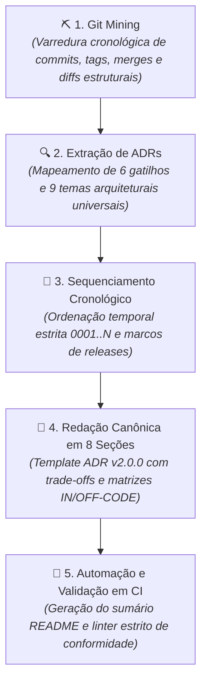

# 🔍 Forensic ADR Recovery (`/forensic-adr-recovery`)

<div align="center">

[](../../../README.md)
[](../../../guides/essentials/guia-padrao-criacao-adrs.md)
[](../../../README.md)

<p align="center">
  <b>Método formal de arqueologia de software no histórico do Git para extrair, reconstruir e documentar retroativamente o catálogo canônico de Architecture Decision Records (ADRs).</b>
</p>

</div>

---

## 🎯 Objetivo & Princípio Fundamental

O **Forensic ADR Recovery** audita o histórico do Git de qualquer repositório — independente de stack tecnológica, linguagem ou framework — para sanar o débito documental e resgatar o **PORQUÊ** das decisões de engenharia que moldaram o sistema ao longo do tempo.

> **Princípio Fundamental:**  
> _"Código-fonte responde ao COMO; testes garantem o O QUE; mas apenas as ADRs documentam o PORQUÊ. Toda decisão estrutural não formalizada torna-se dívida técnica invisível que induz refatorações regressivas e quebras em produção."_

---

## 🧭 O Protocolo Forense Universal em 5 Fases



1. **Fase 1: Git Mining (Arqueologia):** Mineração de volume, amplitude temporal, tags, picos de atividade e evolução de dependências/migrações.
2. **Fase 2: Extração de ADRs:** Identificação determinística de pontos de inflexão estrutural com base nos 6 gatilhos canônicos.
3. **Fase 3: Sequenciamento Cronológico:** Atribuição sequencial ininterrupta (`0001-*.md` a `NNNN-*.md`) vinculada à data do commit original.
4. **Fase 4: Redação Canônica (ADR v2.0.0):** Elaboração das ADRs cobrindo as 8 seções obrigatórias (Contexto, Fundamentação, Decisão, Trade-offs, Matriz IN-CODE, Matriz OFF-CODE, Riscos e Consequências).
5. **Fase 5: Automação e Validação:** Execução dos scripts utilitários incluídos para indexação e validação contínua.

---

## 🛠️ Scripts Utilitários Incluídos

A skill disponibiliza dois scripts autônomos em Python (zero dependências externas) na pasta `scripts/`:

### 1. `generate_adr_index.py`
Gera e mantém atualizado o sumário do repositório em `docs/adr/README.md`, ordenado cronologicamente com metadados, status e histórico de revisões:

```bash
python3 skills/software-engineering/forensic-adr-recovery/scripts/generate_adr_index.py [caminho_docs_adr]
```

### 2. `validate_adrs.py`
Linter de conformidade arquitetural para esteiras de CI/CD (GitHub Actions, GitLab CI, etc.):
- Valida padrão de nomenclatura `docs/adr/[0001-9999]-[kebab-case].md`.
- Garante ausência de lacunas numéricas na sequência histórica.
- Verifica presença de cabeçalhos HTML obrigatórios e seções essenciais.

```bash
python3 skills/software-engineering/forensic-adr-recovery/scripts/validate_adrs.py [caminho_docs_adr]
```

---

## 🚀 Como Executar no Dia a Dia

No seu terminal ou assistente de código (**Claude Code**, **OpenClaude** ou **Antigravity**):

### 1. Auditoria e Recuperação Completa de ADRs
```text
> /forensic-adr-recovery
```
*O assistente iniciará a arqueologia pelo histórico do Git, apresentará a tabela de decisões detectadas e redigirá o catálogo em `docs/adr/`.*

### 2. Resgate de Domínio Específico
```text
> /forensic-adr-recovery com foco nas decisões de migração de banco e autenticação
```

---

## 📚 Guias de Referência Normativa

- [`guides/essentials/guia-padrao-criacao-adrs.md`](../../../guides/essentials/guia-padrao-criacao-adrs.md) — Padrão normativo de criação e anatomia de ADRs.
- [`guides/essentials/guia-completo-harness-commit-memoria.md`](../../../guides/essentials/guia-completo-harness-commit-memoria.md) — Governança operacional e micro-commits.
- [`guides/architecture/guia-arquitetura-software-design-clean-code.md`](../../../guides/architecture/guia-arquitetura-software-design-clean-code.md) — Padrões e princípios arquiteturais.
- [`guides/architecture/guia-system-design-sistemas-distribuidos.md`](../../../guides/architecture/guia-system-design-sistemas-distribuidos.md) — System design e concorrência.
