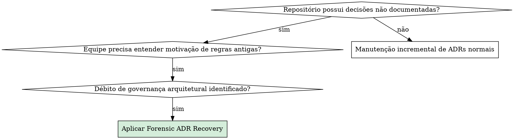
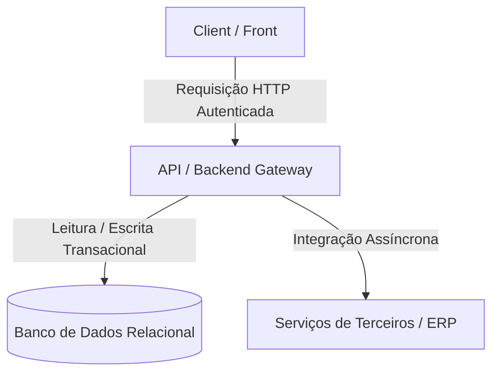

# Forensic ADR Recovery

## Overview

**Forensic ADR Recovery** é o método formal de arqueologia de software para auditar o histórico de controle de versão (Git) de qualquer repositório — independente de linguagem, framework ou stack tecnológica — e extrair, reconstruir e documentar retroativamente o catálogo de **Architecture Decision Records (ADRs)** que regem o sistema, preservando com rigor científico o "PORQUÊ" de cada decisão, suas origens históricas, seus trade-offs e sua evolução contínua ao longo do tempo.

> **Princípio Fundamental:** Código-fonte responde ao *COMO*; testes garantem o *O QUE*; mas apenas as ADRs documentam o *PORQUÊ*. Toda decisão não formalizada torna-se dívida técnica invisível que induz refatorações regressivas e quebras em produção.

---

## When to Use



### Sintomas e Casos de Uso:
- Repositório com meses ou anos de desenvolvimento ativo e zero (ou pouquíssimas) ADRs registradas.
- Decisões cruciais (troca de banco, autenticação, integradores, concorrência, otimizações de performance) dispersas em mensagens de commit ou PRs fechados.
- Risco de refatoração regressiva por desconhecimento das restrições de negócio ou contábeis que moldaram o código.
- Necessidade de instituir um catálogo canônico de ADRs ordenado cronologicamente com rastreabilidade formal.

### Quando NÃO usar:
- Repositórios recém-criados (greenfield) com menos de 10 commits (crie ADRs preventivamente via fluxo normal).
- Decisões pontuais e efêmeras de código (renomear variável, ajustar cor de CSS, trocar dependência trivial).

---

## The 5-Phase Universal Forensic Protocol

O protocolo é agnóstico a linguagens (Python, TypeScript, Go, Rust, Java, C#, PHP, Elixir, Ruby, etc.) e bancos de dados (SQL, NoSQL, Vetoriais).

```text
+-------------------+     +---------------------+     +----------------------+
|  1. Git Mining    | --> |  2. ADR Extraction  | --> |  3. Chrono Sequencing |
|  (Arqueologia)    |     |  (Gatilhos & Temas) |     |  (Datas & Changelog) |
+-------------------+     +---------------------+     +----------------------+
                                                                 |
                                                                 v
+-------------------+     +---------------------+     +----------------------+
|  Relatório Final  | <-- |  5. CI Automation   | <-- |  4. Canonical Author |
|  & Homologação    |     |  (Scripts & Lint)   |     |  (8 Seções v2.0.0)   |
+-------------------+     +---------------------+     +----------------------+
```

---

### Fase 1: Mineração Forense do Git (Git Mining)

Execute a inspeção em camadas no repositório alvo para mapear a cronologia e os pontos de inflexão:

1. **Volume e Amplitude Temporal:**
   ```bash
   # Quantidade total de commits e intervalo de datas
   git log --oneline | wc -l
   git log --reverse --format="%ad (%h): %s" --date=short | head -n 5
   git log -1 --format="%ad (%h): %s" --date=short
   ```

2. **Detecção de Tags e Releases:**
   ```bash
   git tag -n --sort=v:refname
   ```

3. **Mapeamento de Picos e Marcos Estruturais:**
   ```bash
   # Histórico condensado por mês
   git log --date=format:'%Y-%m' --format='%ad' | sort | uniq -c
   ```

4. **Busca por Termos-Chave Arquiteturais:**
   ```bash
   # Investigar commits com termos de impacto arquitetural
   git log --all --grep="refactor\|breaking\|migrate\|security\|auth\|database\|perf\|optimi" --oneline
   ```

5. **Inspeção de Evolução de Esquemas e Dependências:**
   - **Banco de Dados / Migrações:** Inspecione pastas como `alembic/versions`, `prisma/migrations`, `db/migrate`, `migrations/`, `flyway/sql`.
   - **Gerenciamento de Dependências:** `package.json`, `pyproject.toml`, `Cargo.toml`, `go.mod`, `pom.xml`, `composer.json`.
   - **Contêineres e Infra:** `Dockerfile`, `docker-compose.yml`, Helm charts, CloudBuild, GitHub Actions workflows.

---

### Fase 2: Extração e Identificação de Decisões Arquiteturais

Uma decisão exige registro como ADR quando atinge um dos **Gatilhos Arquiteturais Canônicos**:

| Gatilho Arquitetural | O que procurar no histórico Git | Exemplo em Código |
| :--- | :--- | :--- |
| **Comunicação / Protocolos** | Troca de versão de API, gRPC, WebSocket, GraphQL, Message Brokers. | `v1` $\to$ `v2`, RabbitMQ, Kafka. |
| **Persistência & Dados** | Introdução de ORM, migrações DDL, particionamento, views, índices complexos. | Alembic, Prisma, Hibernate, DDL manual. |
| **Segurança & Identidade** | LDAP, OAuth2, JWT, Dual-Scheme, RBAC, ABAC, segregação de rascunhos. | `core/security`, Guards, Middlewares. |
| **Integração com Terceiros** | ERPs legados, gateways de pagamento, APIs bancárias, CRM. | TOTVS Datasul, SAP, Stripe, Salesforce. |
| **Máquina de Estados & Workflow** | Transições de status, aprovações multinível, indivisibilidade de lotes. | Enum de status, serviços de transição. |
| **Mensageria & Comunicação** | E-mails transacionais, Push notifications, SMS, Webhooks, auditoria de envios. | SES, OneSignal, Sendgrid, `EmailLog`. |
| **Performance Crítica** | Deferred Join, desacoplamento de banco, eliminação de queries cross-db, caching. | Subqueries ID scan, Redis, in-memory cache. |
| **Resiliência & Concorrência** | Circuit Breaker, Idempotência, blindagem de greenlet/goroutines/threads. | Lock distribuído, `@validates`, inspection. |
| **Qualidade & CI/CD** | Quality Gate de cobertura, linting unificado, automação de build multi-stage. | Ruff, Biome, Pytest 80%, Dockerfile multi-stage. |

---

### Fase 3: Sequenciamento Cronológico e Mapeamento de Changelogs

A ordenação das ADRs **NÃO DEVE** ser feita por tópico ou prioridade, mas sim **estritamente pela data de nascimento da decisão no Git**:

1. **Atribuição do Número Sequencial (`0001` a `NNNN`):**
   - Ordene todas as decisões detectadas em ordem ascendente pela data do commit que primeiro introduziu a técnica/decisão.
2. **Rastreamento de Atualizações Subsequentes (Decision Changelog):**
   - Uma decisão raramente é estática. Acompanhe os commits posteriores no mesmo arquivo/módulo para identificar:
     - Adaptações de regras contábeis ou de negócio.
     - Refinamentos de performance ou segurança.
     - Extensões de perfis de usuário ou campos de payload.
   - Compile para cada ADR uma tabela cronológica:
     ```markdown
     | Data | Commit | Autor | Descrição da Evolução / Atualização Estratégica |
     | :--- | :--- | :--- | :--- |
     | YYYY-MM-DD | `hash` | Nome do Autor | Criação / introdução inicial da decisão. |
     | YYYY-MM-DD | `hash` | Nome do Autor | Refinamento ou extensão da regra. |
     ```

---

### Fase 4: Redação da ADR Canônica em 8 Seções

Toda ADR gerada deve seguir o padrão canônico v2.0.0 (`[NUMERO_4_DIGITOS]-[slug-em-kebab-case].md`):

1. **Comentário HTML de Log de Manutenção:**
   ```html
   <!--
   ================================================================================
   LOG DE MANUTENÇÃO DE DOCUMENTAÇÃO
   --------------------------------------------------------------------------------
   Data       | Autor          | Descrição
   --------------------------------------------------------------------------------
   YYYY-MM-DD | Autor Original | Criação da ADR XXXX detalhando [decisão].
   YYYY-MM-DD | Autor Revisor  | Atualização: [descrição da evolução].
   ================================================================================
   -->
   ```
2. **Metadados Estruturados:**
   `# ADR XXXX: [Título Formal]`  
   Tabela contendo: `Status` (Proposta / Aprovada / Implementada / Substituída), `Decisores`, `Tags`, `Impacto Sistêmico`, `ADRs Relacionadas`.
3. **Contexto e Riscos Mapeados:** Problema prático e lista de riscos caso nada fosse feito.
4. **Seção 1: Fundamentação Jurídica / Normativa (Se aplicável):** Leis (LGPD, Marco Civil, Normas fiscais/trabalhistas).
5. **Seção 2: Decisão de Arquitetura & Matriz de Trade-offs:**
   - Explicação declarativa da solução eleita.
   - **Matriz de Trade-offs** comparando Opção A, Opção B (Eleita) e Opção C.
   - **Diagramas Exclusivamente em Mermaid (`mermaid`):** Todo diagrama de arquitetura, fluxo de dados, máquina de estados ou fronteira de confiança DEVE ser modelado usando blocos Mermaid (````mermaid ... ````). O uso de ASCII Art puro é estritamente proibido.
6. **Seção 3: Matriz Técnica IN-CODE:**
   - Camada de Backend / API / Serviços.
   - Camada de Frontend / Consumidores.
   - Camada de Persistência / Banco de Dados com **DDL ANSI SQL executável**.
7. **Seção 4: Matriz Institucional OFF-CODE:** Ações institucionais, jurídicas ou de infraestrutura (políticas de storage, termos de uso).
8. **Seção 5: Prazos de Guarda e Políticas de Retenção:** Prazos prescricionais de dados.
9. **Seção 6: Matriz de Conformidade e Mitigação de Riscos:** Mapeamento Risco $\to$ Mitigação Técnica.
10. **Seção 7: Consequências e Resultados:** Ganhos positivos e trade-offs assumidos.

---

### Fase 5: Ferramental de Automação e Validação em CI

Inclua no repositório utilitários para manter o acervo de ADRs íntegro e autogerenciado:

1. **Gerador de Índice (`scripts/generate_adr_index.py`):**
   Gera dinamicamente o sumário no arquivo `docs/adr/README.md`, extraindo número, título, status, data de origem e número de eventos no changelog.
2. **Linter de Validação de ADRs (`scripts/validate_adrs.py`):**
   Executa na pipeline de CI (`.github/workflows/ci.yml`, GitLab CI, CloudBuild) garantindo:
   - Formato estrito: `docs/adr/[0001-9999]-[kebab-case].md`.
   - Sequenciamento ininterrupto (detecta lacunas como `0001` seguido de `0003`).
   - Presença obrigatória do cabeçalho HTML de log de manutenção.
   - Presença da tabela de metadados e da Seção 2 (Decisão de Arquitetura).

---

## Quick Reference: Comandos Forenses Essenciais

| Objetivo Forense | Comando Shell Recomendado |
| :--- | :--- |
| **Achar primeiro commit do repo** | `git log --reverse --format="%h %ad %s" --date=short \| head -n 1` |
| **Listar autores e volume de commits** | `git shortlog -sn --all` |
| **Linha do tempo de um arquivo específico** | `git log --follow --format="%h %ad %an: %s" --date=short -- path/to/file` |
| **Verificar diff exato de um commit** | `git show <hash> --stat` |
| **Localizar criação de tabela/classe** | `git log -S "class MyEntity" --oneline` |
| **Buscar por alterações em migrações** | `git log --oneline -- "**/migrations/*"` ou `"**/alembic/*"` |
| **Extrair datas de nascimento de tags** | `git tag --sort=creatordate --format="%(refname:short) %(creatordate:short)"` |

---

## Template Canônico Raw (Copiar e Adaptar)

```markdown
<!--
================================================================================
LOG DE MANUTENÇÃO DE DOCUMENTAÇÃO
--------------------------------------------------------------------------------
Data       | Autor          | Descrição
--------------------------------------------------------------------------------
YYYY-MM-DD | Nome do Autor  | Criação da ADR XXXX detalhando [assunto principal].
YYYY-MM-DD | Nome do Autor  | Atualização: [descrição da evolução da decisão].
================================================================================
-->

# ADR [NUMERO_4_DIGITOS]: [Título Formal e Declarativo da Decisão]

| Metadado | Detalhe |
| :--- | :--- |
| **Status** | **[Proposta | Aprovada | Implementada | Substituída por ADR-XXXX]** (YYYY-MM-DD) |
| **Decisores** | [Nome dos Decisores, Tech Lead, SecOps] |
| **Tags** | `[architecture]`, `[database]`, `[security]`, `[integration]` |
| **Impacto Sistêmico** | [Alto / Médio / Baixo] ([Módulos Impactados]) |
| **ADRs Relacionadas** | [Supersedes ADR-XXXX / Extends ADR-YYYY / N/A] |

## Contexto
[Descrição detalhada do problema técnico ou de negócio que motivou a decisão.]

### Riscos Mapeados:
1. **[Risco 1]**: [Impacto no sistema].
2. **[Risco 2]**: [Impacto no negócio/segurança].

---

## Histórico Evolutivo e Atualizações da Decisão (Changelog)

| Data | Commit | Autor | Descrição da Evolução / Atualização Estratégica |
| :--- | :--- | :--- | :--- |
| **YYYY-MM-DD** | `hash1` | Autor | Introdução inicial da decisão no repositório. |
| **YYYY-MM-DD** | `hash2` | Autor | Adaptação ou refinamento estratégico da regra. |

---

## 1. Fundamentação Jurídica & Normativa (Se aplicável)
| Norma / Legislação | Dispositivo | Aplicação no Sistema |
| :--- | :--- | :--- |
| [Lei / Norma] | [Artigo] | [Comportamento Exigido] |

---

## 2. Decisão de Arquitetura

[Detalhamento da solução eleita e princípios norteadores.]

### Matriz de Trade-offs (Avaliação de Alternativas)

| Critério | Opção A: [Solução A] | Opção B: [Solução B (Eleita)] | Opção C: [Solução C] |
| :--- | :--- | :--- | :--- |
| **Custo / Complexidade** | [Alto/Médio/Baixo] | [Alto/Médio/Baixo] | [Alto/Médio/Baixo] |
| **Performance / Latência** | [Alto/Médio/Baixo] | [Alto/Médio/Baixo] | [Alto/Médio/Baixo] |
| **Segurança & Controle** | [Alto/Médio/Baixo] | [Alto/Médio/Baixo] | [Alto/Médio/Baixo] |



---

## 3. Matriz de Implementação Técnica (*IN-CODE*)

### 3.1 Camada de Backend / API
- Especificação de contratos, middlewares, injeção de dependências e validação.

### 3.2 Camada de Frontend / Consumidores
- Comportamento de interface, interceptors, feedback visual e chamadas HTTP.

### 3.3 Camada de Persistência e Banco de Dados (ANSI SQL)
```sql
CREATE TABLE ExemploDecisao (
    id BIGINT NOT NULL,
    codigo VARCHAR(64) NOT NULL,
    data_criacao DATETIME NOT NULL,
    CONSTRAINT PK_Exemplo PRIMARY KEY (id)
);
```

---

## 4. Matriz de Governança & Ações Institucionais (*OFF-CODE*) (Se aplicável)
| Ref | Ação Mandatória | Área Responsável | Entregável / Evidência |
| :--- | :--- | :--- | :--- |
| **OFF-01** | [Ação fora do código] | [TI / Jurídico / RH] | [Documento / Configuração] |

---

## 5. Prazos Legais de Guarda e Retenção (Se aplicável)
| Categoria de Dado | Prazo | Base Legal | Política no Storage / Banco |
| :--- | :--- | :--- | :--- |
| [Dado X] | [X anos] | [Artigo de Lei] | [WORM / Expurgo automático] |

---

## 6. Matriz de Conformidade e Mitigação de Riscos
| Risco Mapeado | Impacto | Mitigação Arquitetural Adotada |
| :--- | :--- | :--- |
| [Risco 1] | [Alto/Médio/Baixo] | [Contramedida técnica implementada] |

---

## 7. Consequências e Resultados
### Positivas
- [Benefício 1]
- [Benefício 2]

### Mitigações e Desafios Gerenciados
- [Compromisso / Trade-off aceito e forma de monitoramento]
```

---

## Rationalization Table: Erros Comuns e Justificativas Falaciosas

| Desculpa / Racionalização | Realidade e Contramedida Obrigatória |
| :--- | :--- |
| *"Um `git log -n 10` já é suficiente para entender o projeto."* | **Falso.** Commits recentes cobrem apenas ajustes superficiais. A arquitetura fundacional reside nos commits dos primeiros meses e nos grandes marcos de refatoração. |
| *"Posso ordenar as ADRs por assunto ou prioridade em vez de data."* | **Falso.** Agrupar por prioridade destrói a cronologia do sistema. A numeração DEVE ser estritamente cronológica por data de nascimento (`0001` a `NNNN`). A prioridade é um metadado interno. |
| *"ADRs são retratos estáticos; não preciso documentar commits posteriores."* | **Falso.** Decisões evoluem. Toda ADR forense DEVE conter a tabela de changelog citando os commits posteriores que adaptaram ou refinaram a regra. |
| *"Não preciso citar hashes nem autores, apenas explicar o conceito."* | **Falso.** Sem fontes primárias comprovadas, a ADR é ficção teórica. Citar hash, autor, data e arquivos inspecionados é requisito de autenticidade científica. |
| *"Esta stack não usa banco relacional, então posso omitir a Seção IN-CODE de banco."* | **Falso.** Se o sistema usa NoSQL, Graph, KV ou Cache, modele o documento JSON, schema protobuf ou política de chave-valor correspondente. |
| *"Posso salvar as ADRs de um serviço na raiz do monorepo em vez de na pasta do próprio serviço."* | **Falso.** As ADRs de uma API ou serviço devem residir preferencialmente no diretório `docs/adr/` da própria aplicação, garantindo que a documentação viaje junto ao código. |
| *"Posso agrupar várias decisões não correlatas numa única ADR genérica."* | **Falso.** Princípio de coesão arquitetural: cada ADR formaliza exatamente uma decisão coesa. Decisões ortogonais exigem ADRs distintas. |
| *"Posso usar a data de hoje como data de origem da ADR, mesmo para decisões tomadas no passado."* | **Falso.** A data de origem da ADR DEVE corresponder à data do commit no Git que introduziu a decisão. A data de formalização entra como revisão no cabeçalho HTML. |
| *"Posso desenhar diagramas em ASCII Art ou texto simples."* | **Falso.** Todos os diagramas arquiteturais e de fluxo DEVEM ser escritos obrigatoriamente usando sintaxe Mermaid (```mermaid) para renderização nativa de alta legibilidade. |

---

## Red Flags: Pare Imediatamente se Detectar

- Títulos de ADR sem o formato `# ADR [0001-9999]: [Título]`.
- Nomes de arquivo fora do padrão `docs/adr/0000-kebab-case.md`.
- Ausência do comentário HTML `LOG DE MANUTENÇÃO DE DOCUMENTAÇÃO` no topo do arquivo.
- Pulos na numeração (ex.: existir a ADR `0004` e a próxima ser `0007`).
- Afirmações sobre o código sem citações a commits específicos ou arquivos reais.
- ADRs redigidas sem Matriz de Trade-offs comparando alternativas descartadas.
- Diagramas desenhados em ASCII Art ou texto puro em vez de blocos Mermaid (`mermaid`).

**Todas essas ocorrências violam o padrão de governança e devem ser corrigidas antes da homologação.**
