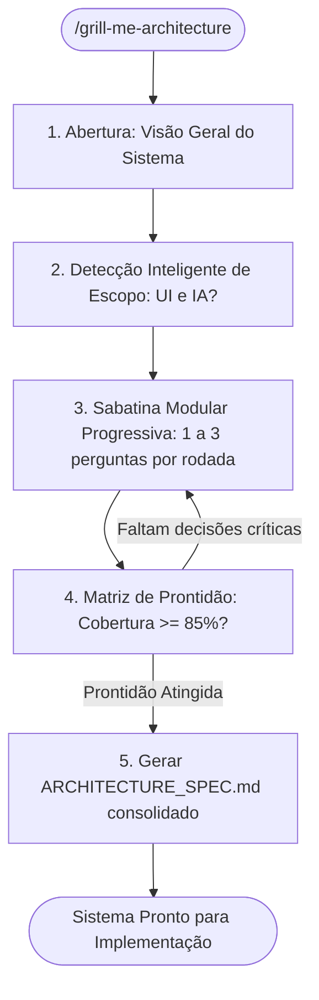

# 🔥 Architecture Grill Orchestrator (`/grill-me-architecture`)

<div align="center">

[](../../../README.md)
[](../../../guides/README.md)
[](../../../README.md)

<p align="center">
  <b>Sabatina arquitetural exaustiva e progressiva para concepção e validação técnica de novos sistemas antes de escrever a primeira linha de código.</b>
</p>

</div>

---

## 🎯 Objetivo

`/grill-me-architecture` orquestra uma sabatina estruturada em fases progressivas para conceber, blindar e documentar a arquitetura completa de um sistema, microsserviço ou módulo crítico.

Ao invés de questionários estáticos e genéricos, a skill:
1. Recebe o **pitch / visão inicial** do usuário.
2. Faz **detecção inteligente de escopo** (desativando fases de UI ou IA quando não aplicáveis).
3. Conduz **perguntas focadas (1 a 3 por turno)** com recomendações técnicas fundamentadas.
4. Avalia a prontidão técnica através de uma **Matriz de Prontidão Arquitetural (0 a 100%)**.
5. Compila o documento oficial consolidado: `ARCHITECTURE_SPEC.md` (ou `docs/architecture/ARCHITECTURE_SPEC.md`).

---

## 📚 Conformidade Normativa com os 7 Guias

A sabatina avalia cada decisão técnica diretamente contra os padrões estabelecidos nos guias oficiais do repositório:

| # | Dimensão Arquitetural | Guia Normativo de Referência |
| :---: | :--- | :--- |
| **1** | **Harness, Memória & Commits** | [`guides/essentials/guia-completo-harness-commit-memoria.md`](../../../guides/essentials/guia-completo-harness-commit-memoria.md) |
| **2** | **Segurança Zero-Trust & Governança** | [`guides/architecture/guia-seguranca-defensiva-zero-trust.md`](../../../guides/architecture/guia-seguranca-defensiva-zero-trust.md) |
| **3** | **Decisões Arquiteturais (ADRs)** | [`guides/essentials/guia-padrao-criacao-adrs.md`](../../../guides/essentials/guia-padrao-criacao-adrs.md) |
| **4** | **Estratégia & Pirâmide de Testes** | [`guides/testing/`](../../../guides/testing/README.md) |
| **5** | **Design UI/UX, Acessibilidade & Cognição** | [`guides/design-ui-ux/`](../../../guides/design-ui-ux/README.md) |
| **6** | **Clean Architecture & System Design** | [`guides/architecture/`](../../../guides/architecture/README.md) |
| **7** | **Engenharia de IA & Sandboxing** | [`guides/ai-engineering/`](../../../guides/ai-engineering/README.md) |

---

## 🧭 Fluxo da Sabatina



---

## 🚀 Como Executar

No terminal do seu agente (**Claude Code**, **OpenClaude** ou **Antigravity**):

```text
# Para iniciar a sabatina para um novo sistema:
> /grill-me-architecture

# Para sabatinar uma proposta ou RFC existente:
> /grill-me-architecture docs/proposals/novo-sistema-faturamento.md
```

Ao rodar a skill, o agente iniciará solicitando uma breve descrição do que você quer construir e conduzirá a sabatina bloco a bloco.
