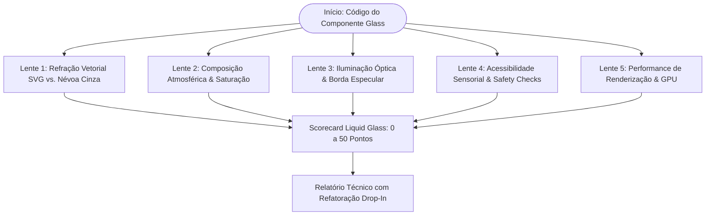

# Liquid Glass & Optical Refraction Code Reviewer (`liquid-glass-review`)

Esta skill audita, projeta e refatora componentes de interface que utilizam efeitos de **Vidro Líquido (Liquid Glass)** e materiais translúcidos. Ela assegura que camadas translúcidas deixem de ser retângulos cinzas sem vida e passem a se comportar como **objetos físicos reais** com refração de luz, preservando performance estável a 60fps e conformidade estrita com acessibilidade (WCAG AA/AAA).



---

## O Diagnóstico: Por Que Borrão Simples (`blur`) Não É Vidro

Vidro real possui curvaturas e espessura que entortam os raios luminosos pela **Lei de Snell-Descartes**.  
O filtro CSS isolado `backdrop-filter: blur(16px)` apenas calcula a média aritmética dos pixels vizinhos:

- ❌ **Borrão isolado:** Gera uma névoa leitosa homogênea, um "retângulo cinza lavado" sem volume ou vida.
- ✅ **Liquid Glass:** Desloca os pixels do fundo através de um **mapa de ruído procedural SVG** (`feTurbulence` + `feDisplacementMap`), adiciona desfoque sutil (`2px–4px`), devolve riqueza cromática (`saturate(180%)`) e projeta reflexo especular na borda (`inset 0 1px 0 rgba`).

---

## As 5 Lentes da Auditoria de Liquid Glass

### 1. Refração Vetorial SVG (`feTurbulence` & `feDisplacementMap`)
- **Filtro Procedural Oculto:** Presença de `<svg>` oculto definindo o filtro de deslocamento óptico.
- **Parâmetros de `<feTurbulence>`:**
  - `type="fractalNoise"` (obrigatório para gradientes orgânicos suaves; evite `turbulence` puro que gera pontas agudas).
  - `baseFrequency` calibrado entre `0.03` e `0.08` (ideal `0.05` para textura líquida suave).
  - `numOctaves` limitado a `1` ou `2` (valores maiores duplicam o custo de amostragem na GPU).
- **Parâmetros de `<feDisplacementMap>`:**
  - `in="SourceGraphic"` e `in2="noiseMap"`.
  - `scale` calibrado entre `8` e `20` (padrão de referência: `14` a `16`). Valores acima de 25 deformam o texto excessivamente.
  - `xChannelSelector="R"` e `yChannelSelector="G"`.

### 2. Composição Atmosférica no CSS (`backdrop-filter`)
- **Ligação com o Filtro SVG:** O CSS deve declarar `backdrop-filter: url(#id-do-filtro) blur(...) saturate(...)`.
- **Desfoque Suave de 2px a 4px:** Valores acima de `6px` apagam a refração e reintroduzem o aspecto leitoso.
- **Compensação Cromática com `saturate()`:** O filtro deve incluir `saturate(160% a 200%)` (padrão `180%`) para compensar a perda de intensidade luminosa decorrente da difração.
- **Cor de Fundo Base Semitranslúcida:** `background: rgba(255, 255, 255, 0.15 a 0.25)` no tema claro; `rgba(15, 23, 42, 0.30 a 0.45)` no tema escuro.

### 3. Iluminação Óptica & Borda Especular Zenital
- **Reflexo Zenital Lapidado:** Uma linha interna branca de 1px simulando a luz incidente no bisel superior:
  - `box-shadow: inset 0 1px 0 rgba(255, 255, 255, 0.45)` (ou Tailwind `shadow-[inset_0_1px_0_rgba(255,255,255,0.45)]`).
- **Borda Translúcida:** `border: 1px solid rgba(255, 255, 255, 0.35 a 0.45)` no tema claro; `border: 1px solid rgba(255, 255, 255, 0.12 a 0.20)` no tema escuro.
- **Proibição de Empilhamento Claro:** *Nunca empilhe uma superfície translúcida clara sobre outra translúcida clara*, pois o contraste visual colapsa.

### 4. Acessibilidade Sensorial & Safety Checks
- **Suporte Obrigatório a `prefers-reduced-transparency: reduce`:**
  - O componente **deve** ter fallback que desativa `backdrop-filter: none` e aplica fundo sólido (`background-color: var(--surface-card)` ou `#ffffff` / `#0f172a`).
- **Suporte a `prefers-contrast: more` & `forced-colors: active`:**
  - Desativação de refração e aplicação de borda sólida de alto contraste (`border: 2px solid ButtonText`).
- **Contraste Tipográfico sobre Vidro:**
  - Todo texto sobre Liquid Glass deve ter peso firme (`font-medium` ou `font-semibold`) e contraste >= 4.5:1 (WCAG AA).

### 5. Performance & Aceleração por GPU
- **Delimitação de Área:** Aplicado em cartões, headers, toolbars ou modais. Proibido em containers de rolagem infinita de viewport total (`100vw x 100vh`).
- **Fallback Progressivo (`@supports`):** Fallback com degradação graciosa para navegadores sem suporte a filtros SVG no backdrop-filter.

---

## 📦 Snippet Canônico Drop-In (Referência Pronta para Uso)

```html
<!-- 1. Filtro SVG Procedural Oculto (inserir no index.html ou topo da página) -->
<svg class="sr-only" aria-hidden="true" width="0" height="0">
  <filter id="liquid-glass-refraction" x="0%" y="0%" width="100%" height="100%">
    <feTurbulence type="fractalNoise" baseFrequency="0.05" numOctaves="1" result="noise" />
    <feDisplacementMap in="SourceGraphic" in2="noise" scale="14" xChannelSelector="R" yChannelSelector="G" />
  </filter>
</svg>

<!-- 2. Classe CSS Canônica com Safety Checks -->
<style>
.liquid-glass-surface {
  background: rgba(255, 255, 255, 0.18);
  backdrop-filter: url(#liquid-glass-refraction) blur(3px) saturate(180%);
  -webkit-backdrop-filter: blur(8px) saturate(180%); /* Fallback Safari */
  border: 1px solid rgba(255, 255, 255, 0.4);
  box-shadow: inset 0 1px 0 rgba(255, 255, 255, 0.5), 0 8px 32px rgba(0, 0, 0, 0.08);
}

/* Safety Check: Acessibilidade Sensorial */
@media (prefers-reduced-transparency: reduce) {
  .liquid-glass-surface {
    background: #ffffff;
    backdrop-filter: none;
    -webkit-backdrop-filter: none;
    border-color: #cbd5e1;
  }
}
</style>
```

---

## 📊 Formato do Relatório de Saída no Chat

Apresente o resultado da auditoria conforme o template executivo enriquecido:

````markdown
# 🧪 Relatório de Auditoria: Liquid Glass & Refração Óptica

> [!NOTE]
> **Componente Alvo:** `[Nome do componente ou arquivo CSS/TSX]`  
> **Status Óptico:** 🟢 Vidro Físico Real / 🟡 Ajustes Recomendados / 🔴 Névoa Cinza sem Refração  
> **Pontuação Geral:** `XX / 50 Pontos`

---

### 📊 Scorecard das 5 Lentes Ópticas

| Lente de Auditoria | Nota | Status | Diagnóstico Técnico |
| :--- | :---: | :---: | :--- |
| **1. Refração Vetorial SVG** | `X/10` | 🟢 OK | Filtro fractalNoise com displacement calibrado |
| **2. Composição Atmosférica** | `X/10` | 🟢 OK | Blur sutil (3px) e compensação saturate(180%) |
| **3. Iluminação Especular** | `X/10` | 🟡 WARN | Borda zenital ausente (falta inset 0 1px 0) |
| **4. Acessibilidade Sensorial** | `X/10` | 🟢 OK | Fallback prefers-reduced-transparency implementado |
| **5. Performance & GPU** | `X/10` | 🟢 OK | Área delimitada, numOctaves=1 e sem jank no scroll |

---

### 🔍 Diagnóstico & Oportunidades de Polimento

- **Refração de Luz:** [Análise do deslocamento óptico e textura]
- **Legibilidade Tipográfica:** [Avaliação do contraste do texto contra o fundo dinâmico]
- **Safety Checks Sensoriais:** [Validação de redução de transparência e modo alto contraste]

---

## 🛠️ Refatoração Drop-In Recomendada

```diff
- .card-glass {
-   background: rgba(255, 255, 255, 0.8);
-   backdrop-filter: blur(16px);
- }
+ .card-glass {
+   background: rgba(255, 255, 255, 0.2);
+   backdrop-filter: url(#liquid-glass-refraction) blur(3px) saturate(180%);
+   box-shadow: inset 0 1px 0 rgba(255, 255, 255, 0.45), 0 8px 32px rgba(0, 0, 0, 0.06);
+   border: 1px solid rgba(255, 255, 255, 0.35);
+ }
```

---

## ⚡ Próximos Passos Sugeridos

- [ ] Incluir o elemento `<svg>` de refração no template raiz da aplicação.
- [ ] Testar a interface com o modo `prefers-reduced-transparency` ativado nas preferências do sistema operacional.
- [ ] Executar `/design-review` para certificar harmonia com os demais tokens do Design System.
````
