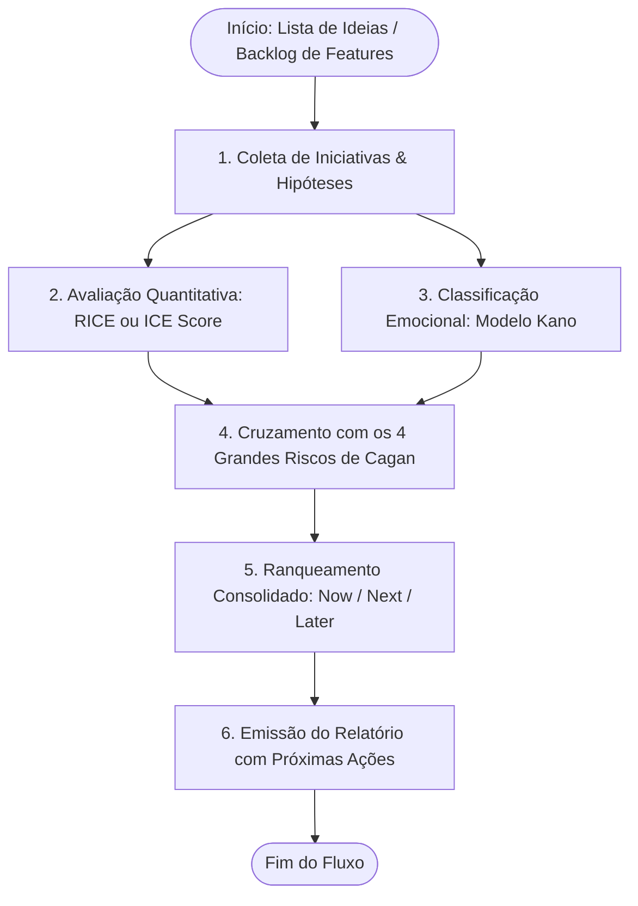

# Product Prioritization & Risk Assessment Engine (`pm-prioritize`)

Esta skill orquestra uma avaliação rigorosa e determinística de **Priorização de Backlog e Gestão de Riscos**, eliminando decisões baseadas no "achismo" ou na opinião da pessoa mais bem paga da sala (efeito HiPPO). Ela combina o rigor quantitativo do **RICE Score** (ou **ICE Score** rápido) e **Modelo Kano** com a análise qualitativa dos **4 Grandes Riscos de Produto de Marty Cagan**.



---

## 🧭 Quando usar RICE vs ICE

| Critério        | Framework RICE (Padrão)                                                                                 | Framework ICE (Modo Rápido)                                              |
| :-------------- | :------------------------------------------------------------------------------------------------------ | :----------------------------------------------------------------------- |
| **Fórmula**     | `(Reach × Impact × Confidence) / Effort`                                                                | `(Impact × Confidence × Ease) / 3`                                       |
| **Melhor para** | Backlogs consolidados com métricas históricas de tráfego/usuários                                       | Brainstorms, etapas iniciais de discovery ou falta de dados de audiência |
| **Escala**      | Alcance absoluto (ex: 5.000 usuários), Impacto (0.25 a 3), Confiança (50% a 100%), Esforço (meses/devs) | Cada dimensão pontuada de 1 a 10                                         |

---

## Os 3 Pilares Metodológicos da Priorização

### 1. Detalhamento dos Componentes do RICE Score

```text
Fórmula RICE:
                Reach  ×  Impact  ×  Confidence (%)
RICE Score  =  ─────────────────────────────────────
                               Effort
```

- **Reach (Alcance):** Quantos usuários únicos serão diretamente impactados no período avaliado (ex.: 8.000 usuários/mês).
- **Impact (Impacto no Usuário):**
  - `3.0` = Impacto Massivo
  - `2.0` = Alto Impacto
  - `1.0` = Médio Impacto
  - `0.5` = Baixo Impacto
  - `0.25` = Impacto Mínimo
- **Confidence (Confiança nas Premissas):**
  - `100% (1.0)` = Alta Confiança (validado com métricas de produto em produção ou protótipo funcional testado).
  - `80% (0.8)` = Média Confiança (dados qualitativos de suporte, entrevistas ou dados de concorrência).
  - `50% (0.5)` = Baixa Confiança / Aposta (baseado apenas em intuição ou solicitação isolada).
- **Effort (Esforço de Engenharia/Design):** Estimativa em pessoas-mês ou semanas de sprint (`0.5` a `5.0+`).

### 2. Classificação pelo Modelo Kano

Identifica como a entrega ou ausência da feature impacta a percepção emocional do usuário:

- **Must-be / Básicas:** Se ausente, causa insatisfação imediata; se presente, é imperceptível (ex.: segurança, recuperação de senha). Deve ser feita com o menor custo técnico aceitável.
- **Performance / Lineares:** A satisfação cresce proporcionalmente à eficiência (ex.: velocidade da busca, capacidade de exportação).
- **Delighters / Encantadoras:** Inesperadas e diferenciais; ausência não frustra, mas presença gera efeito "uau" e retenção viral.

### 3. Mitigação dos 4 Grandes Riscos de Marty Cagan

Iniciativas com alta pontuação quantitativa mas riscos não mitigados devem ir para Discovery antes da Engenharia:

| Tipo de Risco              | Pergunta de Validação                            | Sinal de Alerta / Incerteza Crítica                             | Ação Mitigatória                            |
| :------------------------- | :----------------------------------------------- | :-------------------------------------------------------------- | :------------------------------------------ |
| **Risco de Valor**         | O cliente realmente escolherá/usará isso?        | Pedido de um único stakeholder sem dores recorrentes.           | Entrevistas com 5 clientes reais.           |
| **Risco de Usabilidade**   | O usuário conseguirá usar sem treinamento?       | Interface com múltiplos passos e termos técnicos.               | Teste de usabilidade no Figma (Maze).       |
| **Risco de Factibilidade** | Conseguimos construir com estabilidade no prazo? | Dependência de serviço externo não homologado ou legado frágil. | Spike técnico de 48h.                       |
| **Risco de Viabilidade**   | Funciona para as restrições do negócio?          | Pode violar LGPD, contratos ou comprometer vendas.              | Alinhamento prévio com Jurídico/Compliance. |

> [!TIP]
> **Critério de Desempate (Tie-breaking):** Se duas iniciativas tiverem pontuação RICE semelhante, priorize aquela com:
>
> 1. Maior nível de **Confiança** (menor risco de aposta cega).
> 2. Menor **Esforço** (time-to-value mais rápido).
> 3. Enquadramento no modelo Kano como **Must-be** antes de Delighters.

---

## 🎨 Padrão de Apresentação e Saída no Chat

Ao acionar `/pm-prioritize`, apresente uma tabela comparativa com badges de classificação, notas de risco e plano executivo:

```markdown
# ⚖️ Relatório Executivo de Priorização de Backlog

> [!NOTE]
> **Total de Iniciativas Avaliadas:** [Número]
> **Horizonte de Planejamento:** [Ex.: Ciclo Q3 2026]
> **Método Aplicado:** RICE Score normalizado + Modelo Kano + Matriz Cagan

---

## 1. Tabela Comparativa de Priorização

| Iniciativa         | Reach  | Impact | Conf. | Effort | RICE Score | Kano      | Classificação           | Próxima Ação                     |
| :----------------- | :----: | :----: | :---: | :----: | :--------: | :-------- | :---------------------- | :------------------------------- |
| **[Iniciativa 1]** | 10.000 |  2.0   |  80%  |  1.0   | **16.000** | Linear    | 🟢 **NOW (Sprint)**     | Escrever PRD via `/product-spec` |
| **[Iniciativa 2]** | 4.000  |  3.0   |  50%  |  1.5   | **4.000**  | Delighter | 🟡 **NEXT (Discovery)** | Testar hipótese com protótipo    |
| **[Iniciativa 3]** |  800   |  1.0   |  50%  |  3.0   |  **133**   | Delighter | 🔴 **LATER (Backlog)**  | Congelar; reavaliar no Q4        |

---

## 2. Alertas Críticos de Risco (Matriz Cagan)

> [!WARNING]
> **Risco de Confiança Baixa em Iniciativa com Alto Esforço:**
> A iniciativa `[Nome]` possui esforço estimado de `[X]`, porém confiança de apenas `50%`.
> **Recomendação:** Não alocar a equipe de engenharia antes de mitigar o risco de valor com um teste rápido de interesse.

---

## 3. Recomendações Estratégicas por Horizonte

- 🟢 **NOW (Execução Imediata):**
  - `[Iniciativa 1]`: Alto alcance, esforço enxuto e baixo risco técnico. Iniciar especificação funcional.
- 🟡 **NEXT (Validação em Discovery):**
  - `[Iniciativa 2]`: Potencial de alto impacto, mas demanda validação do protótipo para elevar a confiança a 80%+.
- 🔴 **LATER (Despriorizado ou Congelado):**
  - `[Iniciativa 3]`: Retorno desproporcional ao custo de implementação no momento.

---

## ⚡ Próximos Passos Sugeridos

- [ ] Detalhar os requisitos da iniciativa vencedora no padrão BDD usando `/product-spec`.
- [ ] Mapear as métricas de sucesso e plano de telemetria com `/product-metrics`.
```

---

## 🚫 Diretrizes Estritas de Apresentação

> [!CAUTION]
> **Zero LaTeX:** Nunca utilize sintaxe LaTeX (`$...$`). Utilize sempre símbolos e operadores diretos (`>=`, `<=`, `%`).
> **Zero Arte ASCII Frágil:** Tabelas comparativas devem usar markdown nativo alinhado. Nunca tente desenhar caixas com caracteres Unicode (`┌───┐`, `│`).
