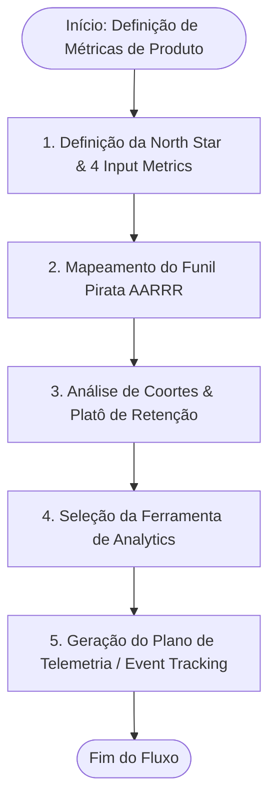
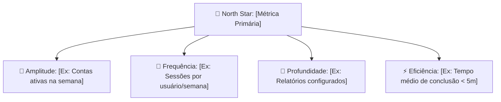

# North Star, Pirate Metrics & Telemetry Plan Architect (`product-metrics`)

Esta skill orienta a definição estratégica e a auditoria técnica de **Métricas de Produto**, prevenindo o uso de _métricas de vaidade_ e garantindo que cada evento registrado no produto tenha um propósito causal claro. Ela fundamenta-se nos conceitos de **North Star Metric (Sean Ellis / Lenny Rachitsky)**, no **Funil Pirata AARRR (Dave McClure)**, na modelagem de **Retenção em Coortes (Brian Balfour)** e na especificação de **Planos de Telemetria de Eventos**.



---

## 🧭 Guia Rápido: Seleção da Stack de Analytics

| Plataforma                   | Melhor Cenário                                                             | Prós                                                                        | Contras                                                                      |
| :--------------------------- | :------------------------------------------------------------------------- | :-------------------------------------------------------------------------- | :--------------------------------------------------------------------------- |
| **PostHog**                  | Startups, SaaS dev-first, equipes que querem produto completo              | Open-source/self-hostable, session replay e feature flags nativos           | Interface analítica menos flexível que Amplitude para coortes hipercomplexas |
| **Amplitude**                | SaaS B2B/B2C maduros focados em retenção e análise profunda de coortes     | Análise preditiva e correlação comportamental de retenção de classe mundial | Custo escala rápido em planos avançados                                      |
| **Mixpanel**                 | Equipes orientadas a funis de conversão rápidos e facilidade de relatórios | Rápido setup, excelente interface de relatórios ad-hoc                      | Replay de sessão depende de parceiros                                        |
| **Google Analytics 4 (GA4)** | Marketing institucional, SEO e conversões de mídia paga                    | Gratuito, integrado ao Google Ads                                           | Fraco para modelagem comportamental profunda de produto logado               |

---

## 🚫 Alerta: Métricas de Vaidade vs Métricas Acionáveis

> [!WARNING]
> **Nunca utilize métricas de vaidade como North Star ou metas de time:**
>
> - ❌ **Métricas de Vaidade:** Cadastros totais acumulados, visualizações de página (Pageviews), downloads brutos do app. (Elas sempre sobem mesmo se o produto estiver morrendo).
> - ✅ **Métricas Acionáveis:** Contas que completaram a ação principal na primeira semana, clientes ativos gerando receita líquida (NDR), taxa de conclusão da tarefa central com sucesso.

---

## Os 4 Blocos da Arquitetura de Métricas

### 1. North Star Metric & Input Metrics

- **A North Star (Bússola Estratégica):** Deve capturar o momento exato em que o cliente extrai valor real do produto e que prediz receita futura sustentável.
- **As 4 Métricas de Entrada (Inputs de Controle):**
  1. **Amplitude (Breadth):** Quantos usuários iniciam o uso qualificado?
  2. **Frequência (Frequency):** Com que periodicidade o usuário retorna para extrair valor?
  3. **Profundidade (Depth):** Quão profunda é a utilização das capacidades centrais do sistema?
  4. **Eficiência (Efficiency):** Quão rápido o usuário completa sua intenção (_Time to Value - TTV_)?

### 2. O Funil Pirata AARRR

A skill mapeia a saúde do ciclo do cliente em 5 níveis sequenciais:

- **Aquisição (Acquisition):** Taxa de conversão por canal de entrada (Orgânico, Ads, Indicações).
- **Ativação (Activation):** A conclusão do primeiro fluxo crítico onde ocorre o _Momento "Aha!"_.
- **Retenção (Retention):** O percentual de clientes que continuam ativos após 1, 7, 30 e 90 dias.
- **Indicação (Referral):** Coeficiente de viralidade (_K-Factor_ ou Net Promoter Score transacional).
- **Receita (Revenue):** ARPU, LTV, MRR e Net Dollar Retention (NDR).

### 3. Modelagem de Retenção & Churn

- **Identificação do Platô de Retenção:** A curva de retenção de coorte precisa estabilizar horizontalmente (paralela ao eixo do tempo). Curvas que tocam o zero indicam ausência de Product-Market Fit.
- **Net Dollar Retention (NDR):**
  - Alvo SaaS B2B Saudável: **NDR ≥ 110% a 130%** (_Negative Net Churn_ — a expansão da base existente supera os cancelamentos).

### 4. Padrão de Nomenclatura para Telemetria de Eventos

Recomenda-se o padrão canônico **Objeto + Verbo no Passado (Snake Case)**:

- `account_created` (não `user_signup` ou `NewAccount`)
- `invoice_exported` (não `click_export`)
- `workspace_invited` (não `invite_send`)

---

## 🎨 Padrão de Apresentação e Saída no Chat

Ao acionar `/product-metrics`, a resposta deve conter a decomposição matemática, o funil completo e o dicionário de eventos pronto para engenharia:

````markdown
# 📊 Arquitetura de Métricas & Plano de Telemetria: [Nome do Produto]

> [!NOTE]
> **North Star Metric:** [Nome da Métrica Principal]
> **Objetivo de Negócio:** [Impacto esperado em retenção e receita]
> **Ferramenta Recomendada:** [PostHog / Amplitude / Mixpanel]

---

## 1. Decomposição da North Star Metric



---

## 2. Mapa do Funil Pirata AARRR

| Etapa         | Pergunta Central                        | Métrica Alvo (KPI)                          | Meta Sugerida |
| :------------ | :-------------------------------------- | :------------------------------------------ | :------------ |
| **Aquisição** | De onde vêm os visitantes qualificados? | Taxa de conversão Landing Page → Sign up    | > 8%          |
| **Ativação**  | Quantos atingem o momento "Aha!"?       | Usuários que completam onboarding e 1ª ação | > 40% em 24h  |
| **Retenção**  | Eles retornam com frequência?           | Retenção D30 (Coorte)                       | Platô > 25%   |
| **Receita**   | Quanto eles geram sustentavelmente?     | Net Dollar Retention (NDR) / ARPU           | NDR > 110%    |
| **Indicação** | Eles convidam outros usuários?          | K-Factor / Taxa de convites aceitos         | K > 0.4       |

---

## 3. Especificação do Plano de Telemetria (Event Tracking Plan)

| Event Name              |    Tipo    | Gatilho / Momento de Disparo        | Propriedades Críticas (Payload)          | Chamada de SDK (Exemplo)                          |
| :---------------------- | :--------: | :---------------------------------- | :--------------------------------------- | :------------------------------------------------ |
| `user_signed_up`        | `identify` | Sucesso no cadastro de conta        | `auth_provider`, `plan_type`, `referrer` | `analytics.identify(id, traits)`                  |
| `onboarding_completed`  |  `track`   | Conclusão do último passo do wizard | `duration_sec`, `steps_skipped`          | `analytics.track('onboarding_completed', {...})`  |
| `core_action_completed` |  `track`   | Sucesso na ação principal de valor  | `category`, `item_count`, `duration_ms`  | `analytics.track('core_action_completed', {...})` |

---

## ⚡ Próximos Passos Sugeridos

- [ ] Incluir os eventos de ativação diretamente nos critérios de aceitação do PRD via `/product-spec`.
- [ ] Validar com a equipe de engenharia o momento exato do disparo (frontend vs backend para eventos de receita).
````

---

## 🚫 Diretrizes Estritas de Apresentação

> [!CAUTION]
> **Zero LaTeX:** Nunca utilize sintaxe LaTeX (`$...$`). Escreva sempre operadores normais legíveis em qualquer terminal ou chat (`>= 98%`, `<= 48h`, `< 2%`).
> **Proibição de Arte ASCII Frágil:** Não tente desenhar caixas com caracteres Unicode (`┌─┐`); use tabelas markdown limpas ou diagramas Mermaid.
