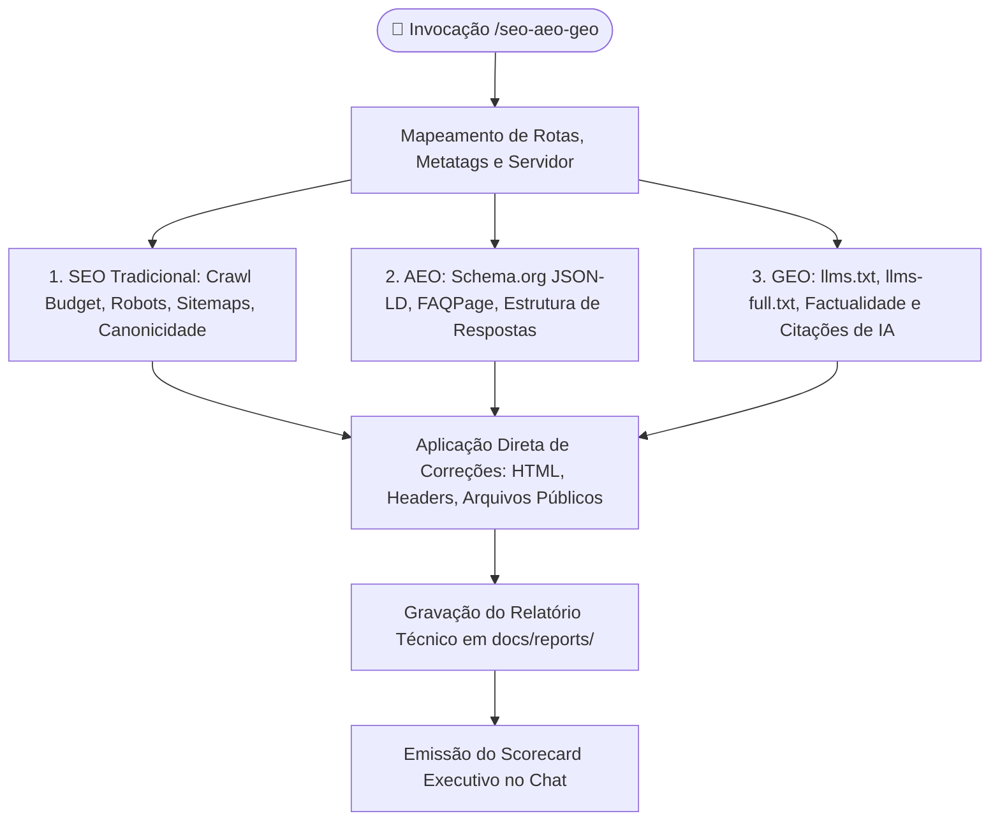

# Universal SEO, AEO & GEO Orchestrator (`seo-aeo-geo`)

Esta skill executa uma auditoria universal, profunda e técnica em qualquer projeto de software (Next.js, Angular, React, Vue, Astro, Python, PHP, Node.js, etc.) para garantir visibilidade máxima em motores de busca tradicionais (**Google Search, Bing**) e plataformas de resposta generativa por IA (**Perplexity, Google Gemini, Claude Search, ChatGPT Search, Microsoft Copilot**), totalmente alinhada às **diretrizes oficiais dos Fundamentos da Pesquisa Google** e à especificação aberta **`llmstxt.org`**.



---

## 🧭 Os 3 Estágios Oficiais de Otimização

1. **Rastreamento (Crawling):** Garantir que o Googlebot e os agentes de IA encontrem as páginas certas, não fiquem bloqueados em recursos essenciais (CSS/JS/Imagens), não desperdicem cota de rastreamento (*Crawl Budget*) e consigam renderizar o DOM executando JavaScript.
2. **Indexação (Indexing):** Garantir canonicidade estrita (tags `<link rel="canonical">` absolutas HTTPS), eliminar conteúdo duplicado, evitar Soft 404s, configurar tags de controle de snippet (`max-image-preview:large`) e estruturar dados com Schema.org JSON-LD.
3. **Exibição & Ranqueamento (Serving):** Garantir HTTPS, usabilidade mobile-first, Core Web Vitals otimizados e a presença de `llms.txt` / `llms-full.txt` para inclusão ativa nas respostas resumidas das IAs.

---

## 🛠️ Os 8 Módulos de Auditoria e Otimização

### Módulo 1: Descoberta por IA & Especificação `llmstxt.org` (GEO)
- **Arquivo `public/llms.txt`**: Criação ou validação de arquivo padronizado contendo sumário executivo em citação markdown (`> `), links prioritários e seção `## Optional`.
- **Arquivo `public/llms-full.txt`**: Documentação técnica consolidada para LLMs contendo rotas públicas de API (`/api/`), descrição de dados e regras de negócio.
- **Tag de Descoberta no HTML**: `<link rel="describedby" href="/llms.txt" />` presente no `<head>`.
- **Template Canônico de Referência (`public/llms.txt`):**

```markdown
# Nome do Produto ou Plataforma

> Plataforma inteligente de [descrição concisa em 1-2 linhas sobre o valor central do produto].

## Recursos Principais
- [Documentação da API](/docs/api): Especificações de integração REST e SDKs.
- [Preços e Planos](/pricing): Tabela comparativa de planos e cotas.
- [Guia Rápido](/getting-started): Tutorial passo a passo para começar em 5 minutos.

## Opcional
- [Changelog](/changelog): Histórico de releases e novidades da versão atual.
```

### Módulo 2: Diretrizes de Rastreamento & Crawl Budget (Googlebot & Agentes de IA)
- **Arquivo `robots.txt`**:
  - Permissão explícita (`Allow: /`) para agentes de busca generativa: `GPTBot`, `ClaudeBot`, `PerplexityBot`, `Bytespider`, `ChatGPT-User`.
  - Localização absoluta do sitemap: `Sitemap: https://dominio.com/sitemap.xml`.
  - Bloqueio de rotas sem valor de indexação (carrinhos temporários, callbacks de auth, admin privado).
- **Recursos Desbloqueados:** Garantir que CSS, JS e fontes **NÃO** estejam bloqueados no `robots.txt`, permitindo a renderização completa do DOM.

### Módulo 3: Canonicidade, Prevenção de Soft 404 & Controle de Snippets
- **Canonicidade Estrita:** Tag `<link rel="canonical" href="https://dominio.com/rota" />` com URL absoluta e HTTPS em todas as páginas públicas.
- **Prevenção de Soft 404:** Garantir que rotas inexistentes retornem status **HTTP 404 real** no servidor, evitando páginas de erro com status 200 OK.
- **Controle de Trecho / Snippets:** Meta tag obrigatória:
  ```html
  <meta name="robots" content="index, follow, max-image-preview:large, max-snippet:-1, max-video-preview:-1" />
  ```

### Módulo 4: Links Rastreáveis & Navegação Semântica
- **Navegação Semântica:** Utilização de elementos HTML `<a href="...">` reais e válidos. Evitar navegação baseada exclusivamente em manipuladores JS `onClick` sem atributo `href`.
- **Atributos de Relação:** Uso correto de `rel="nofollow"`, `rel="sponsored"` ou `rel="ugc"` em links externos ou gerados por terceiros.

### Módulo 5: Elegibilidade para Google Notícias & Discover (Diretrizes 2025+)
- **Identidade Visual e Nome:**
  - Favicons de alta resolução configurados (`favicon.ico`, `favicon.svg`, `apple-touch-icon`).
  - Declaração explícita do Nome do Site via JSON-LD (`WebSite.name`, `Organization.name`) e Open Graph (`og:site_name`).
- **Verificação Editorial:** Presença de páginas de transparência (`/about`, `/contact`, política editorial ou de privacidade).

### Módulo 6: Dados Estruturados Schema.org JSON-LD (AEO)
- **Injeção do Bloco `@graph` Validado:**

```html
<script type="application/ld+json">
{
  "@context": "https://schema.org",
  "@graph": [
    {
      "@type": "Organization",
      "@id": "https://dominio.com/#organization",
      "name": "Nome da Empresa",
      "url": "https://dominio.com",
      "logo": "https://dominio.com/logo.png",
      "sameAs": ["https://twitter.com/empresa", "https://linkedin.com/company/empresa"]
    },
    {
      "@type": "WebSite",
      "@id": "https://dominio.com/#website",
      "url": "https://dominio.com",
      "name": "Nome do Produto",
      "publisher": { "@id": "https://dominio.com/#organization" }
    },
    {
      "@type": "SoftwareApplication",
      "name": "Nome do Software",
      "operatingSystem": "Web, iOS, Android",
      "applicationCategory": "BusinessApplication",
      "offers": {
        "@type": "Offer",
        "price": "0",
        "priceCurrency": "USD"
      }
    }
  ]
}
</script>
```

### Módulo 7: Core Web Vitals, Performance & Mobile-First
- **Otimização de Imagens:** Atributo `loading="lazy"` para imagens fora do viewport inicial, dimensões explícitas (`width` e `height`) para eliminar Layout Shift (CLS) e formatos modernos (`.webp`, `.avif`, `.svg`).
- **Fontes & Estilos:** Pré-conexão (`<link rel="preconnect">`) para CDNs de fontes e propriedade `font-display: swap` no CSS para mitigar FOUT e acelerar LCP.
- **Mobile-First:** Tag `<meta name="viewport" content="width=device-width, initial-scale=1" />` e design responsivo.

### Módulo 8: Configuração de Servidor & Headers HTTP
- **Configuração de Headers (`firebase.json`, `vercel.json`, `nginx.conf`, etc.):**
  - `Content-Type: application/xml; charset=utf-8` para `sitemap.xml` (evitando fallback para HTML em SPAs).
  - `Content-Type: text/plain; charset=utf-8` e `Access-Control-Allow-Origin: *` para `llms.txt`, `llms-full.txt` e `robots.txt`.

---

## 📊 Formato de Resposta no Chat (Scorecard Executivo)

Após a execução da auditoria e aplicação das correções necessárias no código, apresente o sumário executivo abaixo:

````markdown
# 🚀 Relatório de Auditoria SEO, AEO & GEO

> [!NOTE]
> **Status Consolidado:** 🟢 Otimizado / 🟡 Requer Ajustes / 🔴 Bloqueadores de Indexação Detectados  
> **Relatório Detalhado:** Salvo em [`docs/reports/YYYY-MM-DD_auditoria-seo-aeo-geo.md`](docs/reports/)  
> **Motores Cobertos:** Google Search, Bing, Perplexity, Google Gemini, Claude Search, ChatGPT Search

---

### 📊 Scorecard de Desempenho dos 8 Módulos

| Módulo de Otimização | Status | Resumo da Auditoria & Ações Aplicadas |
| :--- | :---: | :--- |
| **1. Descoberta por IA (GEO)** | 🟢 OK | `public/llms.txt` criado e referenciado via `<link rel="describedby">` |
| **2. Rastreamento & Crawl Budget** | 🟢 OK | `robots.txt` atualizado com permissão para GPTBot, ClaudeBot e Perplexity |
| **3. Canonicidade & Snippets** | 🟢 OK | Tags canônicas absolutas e `max-image-preview:large` configuradas |
| **4. Links Rastreáveis & Grafo** | 🟢 OK | Todos os links utilizam tags `<a href>` sem bloqueio por eventos JS |
| **5. Google Notícias & Discover** | 🟢 OK | Favicons em alta resolução e declaração de Site Name configurados |
| **6. Dados Estruturados (AEO)** | 🟢 OK | Bloco Schema.org JSON-LD `@graph` validado e injetado no `<head>` |
| **7. Core Web Vitals & Mobile** | 🟡 WARN | 3 imagens sem dimensões explícitas `width/height` (risco de CLS) |
| **8. Headers HTTP do Servidor** | 🟢 OK | Headers MIME text/plain e CORS configurados para `llms.txt` e `sitemap.xml` |

---

### 🛠️ Arquivos Criados ou Atualizados

- `public/llms.txt` — Arquivo de contexto factual para motores de IA generativa.
- `public/robots.txt` — Regras de liberação de bots de IA e apontamento de sitemap.
- `index.html` (ou layout principal) — Injeção de metatags canônicas e Schema.org JSON-LD.

---

## ⚡ Próximos Passos Sugeridos

- [ ] Adicionar dimensões explícitas `width` e `height` nas imagens indicadas para zerar CLS.
- [ ] Submeter a URL do sitemap atualizado no Google Search Console e Bing Webmaster Tools.
- [ ] Conectar os KPIs de aquisição orgânica à skill `/product-metrics`.
````
