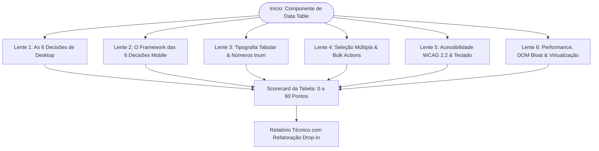

# Data Table & Responsive Grid Code Reviewer (`table-review`)

Esta skill executa uma auditoria rigorosa e profunda em componentes de **Tabela de Dados (Data Table)** e grids analíticos. Ela combate o vício clássico de transformar a interface em uma "planilha crua disfarçada" ou "espremer colunas em telas móveis", aplicando dois frameworks arquiteturais canônicos: as **6 Decisões de Desktop** e as **6 Decisões de Mobile com Container Queries**.



---

## O Diagnóstico: Por Que Tabelas Falham

1. **No Desktop:** Tabelas são tratadas como planilhas do Excel. Números centralizados sem alinhamento à direita, zebra stripes berrantes que competem com o conteúdo, perda de cabeçalho ao rolar e ausência de densidade configurável.
2. **No Mobile:** Desenvolvedores tentam "encolher" a tabela diminuindo fontes ou forçando um scroll horizontal labiríntico. A solução canônica é: **Não encolha. Reestruture em cards ergonômicos.**

---

## As 6 Lentes da Auditoria de Tabelas

### Lente 1: O Framework das 6 Decisões de Desktop
- **01. Align (Alinhamento Rigoroso):**
  - Textos e identificadores alinhados à esquerda (`text-left`).
  - Valores numéricos, métricas financeiras e quantidades alinhados estritamente à direita (`text-right`), permitindo comparação vertical instantânea como em um recibo.
  - Status e datas alinhados à esquerda ou centralizados apenas quando possuem largura estritamente fixa.
- **02. Rows (Estrutura Visual das Linhas):**
  - Hairlines sutis de 1px entre linhas (`border-b border-slate-200 dark:border-slate-800`).
  - *Zebra striping* proibido em tabelas padrão — reservado para tabelas extra-largas (10+ colunas) sem divisores verticais.
  - Hover ativo que destaca a linha em foco (`hover:bg-slate-50 dark:hover:bg-slate-800/50`).
- **03. Density (Densidade de Dados Configurável):**
  - Suporte aos 3 modos canônicos via toggle: **Compact** (40px, `py-2`), **Default** (48px, `py-3`) e **Comfortable** (56px, `py-4`).
- **04. Sticky (Persistência de Contexto):**
  - Cabeçalho fixo no topo (`sticky top-0 z-10 backdrop-blur-sm`).
  - Primeira coluna (identidade do registro) fixada à esquerda em rolagem horizontal (`sticky left-0`).
- **05. Cells (Anatomia Segura de Células):**
  - Células vazias tratadas com travessão semântico (`—` com `aria-label="Não informado"`), nunca brancos misteriosos.
  - Textos longos com largura máxima e reticências (`truncate max-w-xs`) acompanhados de tooltip ou revelação.
- **06. Actions (Economia Cognitiva de Ações):**
  - Revelar ações no hover da linha ou consolidar em menu contextual (`...`) para evitar 50 ícones visíveis competindo por atenção.

### Lente 2: O Framework das 6 Decisões Mobile
- **01. Rank (Priorização por Uso):**
  - Apenas 2 a 3 informações cabem confortavelmente no mobile. Selecione pela tríade: **Identity**, **Value** e **State**.
- **02. Stack (Empilhamento Vertical):**
  - A linha vira uma unidade empilhada em duas linhas ergonômicas (~56px–68px):
    - *Linha 1:* Nome à esquerda, Valor no canto superior direito.
    - *Linha 2:* Status à esquerda, Data de vencimento à direita.
- **03. Slot (Slot Fixo de Métrica Numérica):**
  - Slot fixo no canto superior direito (`top-right`) com `shrink-0`, alinhamento à direita e `tabular-nums`. A lista de cards ainda se comporta como uma coluna de números comparáveis.
- **04. Label (Rotulagem Contextual do Ambíguo):**
  - Como não há cabeçalho no card, rotule dados ambíguos (*"Vencimento em 04 de Março"*). Valores monetários dispensam rótulo (*"R$ 1.250,00"* já se autoidentifica).
- **05. Reveal (Revelação sem Perda de Contexto):**
  - Toque no card expande gaveta in-place para 2 campos ou abre **Bottom Sheet nativo** para o registro completo. Nunca redirecione para uma nova página apenas para uma visualização rápida.
- **06. Breakpoint (Container Queries):**
  - O breakpoint pertence à **tabela**, não à tela do dispositivo. 6 colunas exigem ~700px.
  - Uso de Container Queries CSS (`@container data-table-container (max-width: 699px)`) para alternar automaticamente entre tabela e cards.

### Lente 3: Tipografia Tabular & Números (`tnum`)
- **Uso Obrigatório de `tabular-nums`:** Ativação de `font-variant-numeric: tabular-nums` em todas as colunas numéricas, financeiras, percentuais e datas para alinhamento vertical exato dos dígitos.

### Lente 4: Seleção Múltipla & Bulk Actions
- **Checkboxes com Estado Indeterminado:** Suporte a seleção parcial no cabeçalho com `indeterminate = true` e `aria-checked="mixed"`.
- **Atalho Shift + Click:** Permite selecionar intervalos contínuos de linhas em um único movimento.
- **Barra de Ações em Lote (Bulk Action Bar):** Barra flutuante contextual que emerge com o total selecionado (`role="toolbar"`) e atalhos rápidos.

### Lente 5: Acessibilidade Universal (WCAG 2.2 AAA) & Teclado
- **Semântica HTML Estrita:** `<table>`, `<thead>`, `<tbody>`, `<th scope="col">`, `<th scope="row">`, `<td>`.
- **Navegação por Teclado:** Setas direcionais, Tab entre células e Enter/Espaço para seleção ou abertura de detalhes.
- **Leitores de Tela:** `aria-sort="ascending|descending"` nos cabeçalhos ordenáveis e anúncios de filtro via `aria-live="polite"`.

### Lente 6: Performance, DOM Bloat & Virtualização
- Até 50 itens: Paginação tradicional ou client-side.
- Mais de 100 itens: Virtualização obrigatória (TanStack Virtual, react-window) para manter o DOM abaixo de 1.500 nós.

---

## 📦 Snippet Canônico: Tabela Responsiva com Container Queries

```css
/* Container de contexto independente do viewport */
.table-wrapper {
  container-type: inline-size;
  container-name: data-table-container;
}

/* Modo Desktop (Padrão) */
.data-table { display: table; width: 100%; }
.mobile-card-list { display: none; }

/* Transição Automática para Cards Mobile sem JavaScript */
@container data-table-container (max-width: 699px) {
  .data-table { display: none; }
  .mobile-card-list {
    display: flex;
    flex-direction: column;
    gap: 0.75rem;
  }
}
```

---

## 📊 Formato do Relatório de Saída no Chat

Apresente o resultado da auditoria conforme o template executivo enriquecido:

````markdown
# 📋 Relatório de Auditoria: Data Table & Responsive Grid

> [!NOTE]
> **Componente Alvo:** `[Nome do componente ou tela, ex: OrdersTable.tsx]`  
> **Status de Engenharia:** 🟢 Padrão Canônico / 🟡 Ajustes Recomendados / 🔴 Planilha Desestruturada  
> **Pontuação Geral:** `XX / 60 Pontos`

---

### 📊 Scorecard das 6 Lentes de Tabela

| Lente de Auditoria | Nota | Status | Diagnóstico Técnico |
| :--- | :---: | :---: | :--- |
| **1. As 6 Decisões Desktop** | `X/10` | 🟢 OK | Alinhamento à direita em números; sticky header ativo |
| **2. As 6 Decisões Mobile** | `X/10` | 🟡 WARN | Tabela estourando no mobile; falta Container Query |
| **3. Tipografia Tabular (tnum)** | `X/10` | 🟢 OK | tabular-nums aplicado em valores e datas |
| **4. Seleção Múltipla & Bulk** | `X/10` | 🟢 OK | Checkbox com indeterminate e Shift+Click suportado |
| **5. Acessibilidade WCAG 2.2** | `X/10` | 🟢 OK | Semântica table/th/td e navegação por teclado |
| **6. Performance & Virtualização** | `X/10` | 🟢 OK | DOM enxuto com paginação de 25 itens |

---

### 🔍 Diagnóstico Detalhado & Oportunidades

- **Alinhamento Numérico:** [Verificação de text-right em moedas e métricas]
- **Responsividade Mobile:** [Avaliação do comportamento em telas < 700px]
- **Acessibilidade por Teclado:** [Status de foco nas células e linhas]

---

## 🛠️ Refatoração Recomendada

```diff
- <td class="text-center font-normal">{order.total}</td>
+ <td class="text-right font-medium tabular-nums">{formatCurrency(order.total)}</td>
```

---

## ⚡ Próximos Passos Sugeridos

- [ ] Implementar a Container Query de transição para cards mobile (< 700px).
- [ ] Aplicar a classe `tabular-nums` em todas as colunas de valores monetários e datas.
- [ ] Executar `/design-review` para certificar harmonia com o Design System geral.
````
