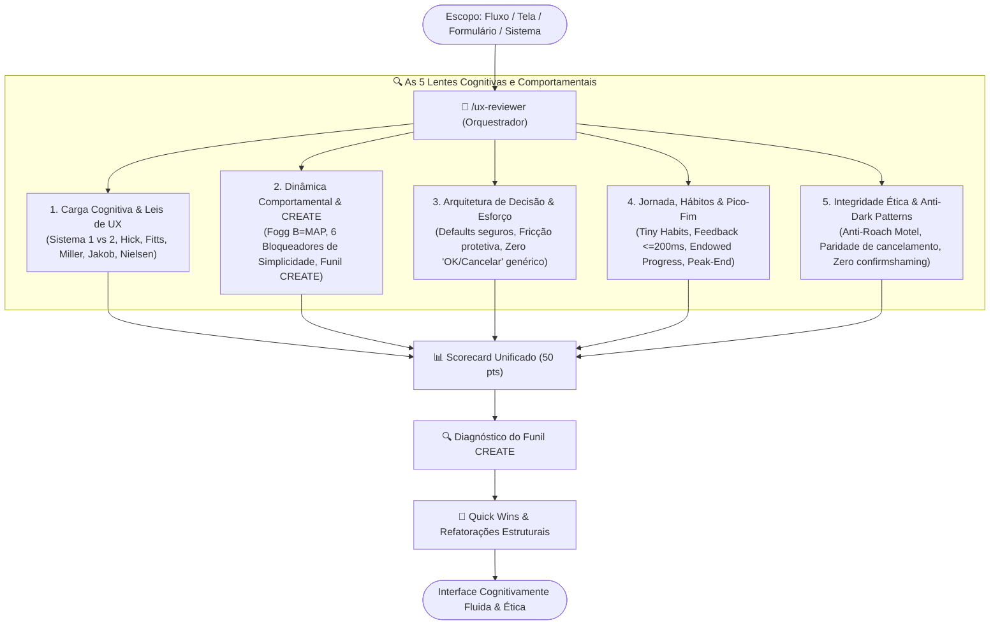

# 🧠 UX, Cognitive Psychology & Behavioral Reviewer (`/ux-reviewer`)

<div align="center">

[](../../../README.md)
[](../README.md)
[](../../../guides/design-ui-ux/guia-regras-ux-design-cognicao-comportamental.md)

<p align="center">
  <b>Skill orquestradora para auditoria profunda de Experiência do Usuário (UX), Psicologia Cognitiva, Funil CREATE, Arquitetura de Decisão, Prevenção de Fricção e Filtro Anti-Dark Patterns.</b>
</p>

</div>

---

## 📌 Visão Geral & Papel de Orquestrador

A skill `/ux-reviewer` opera como um **Orquestrador Central de UX Comportamental e Cognição** para sistemas web e mobile. Enquanto a `/design-review` avalia os aspectos visuais, design tokens, tipografia e acessibilidade técnica (WCAG 2.2 AAA), a `/ux-reviewer` audita a **mecânica mental, a facilidade de decisão e a integridade comportamental** das interfaces com base no [Guia Oficial de Regras de UX Design, Psicologia Cognitiva e Arquitetura Comportamental](../../../guides/design-ui-ux/guia-regras-ux-design-cognicao-comportamental.md).



---

## ⚡ Como Utilizar

No terminal interativo do seu assistente (**Claude Code**, **OpenClaude** ou **Google Antigravity**):

```text
# Auditoria no contexto atual ou repositório completo
> /ux-reviewer

# Auditoria em fluxo, formulário ou componente específico
> /ux-reviewer src/features/checkout
> /ux-reviewer src/app/onboarding
> /ux-reviewer src/components/DeleteAccountModal.tsx
```

---

## 📊 Matriz do Scorecard de Avaliação (50 Pontos)

| Lente Cognitiva & Comportamental | Foco Técnico Principal | Peso |
| :--- | :--- | :---: |
| **1. Carga Cognitiva & Leis de UX** | Preservação do Sistema 1, Lei de Hick (3-5 opções), Fitts (>= 48px), Miller (7 ± 2), Jakob e 10 Heurísticas de Nielsen. | `10 pts` |
| **2. Dinâmica Comportamental & CREATE** | 6 Fatores de facilidade de Fogg (B = MAP) e auditoria do funil CREATE de 6 elos (Cue, Reaction, Evaluation, Ability, Timing, Execution). | `10 pts` |
| **3. Arquitetura de Decisão & Esforço** | Defaults estruturais éticos, ações incidentais, fricção defensiva em ações irreversíveis (digitação exata do identificador, CTA descritivo). | `10 pts` |
| **4. Jornada, Hábitos & Efeito Pico-Fim** | Tiny Habits, Habit Stacking, resposta <= 200ms, prevenção de duplo clique, Endowed Progress e Peak-End Rule. | `10 pts` |
| **5. Integridade Ética & Anti-Dark Patterns** | Paridade estrita de cancelamento (anti-Roach Motel), comunicação neutra de opt-out (anti-confirmshaming), ausência de cobranças surpresa e sludge. | `10 pts` |

---

## 📦 Distribuição e Instalação

Esta skill faz parte do ecossistema unificado de engenharia do repositório `ai-guides` e é instalada automaticamente através do manifesto [`.claude-plugin/plugin.json`](../../../.claude-plugin/plugin.json):

```bash
# Registrar marketplace oficial e instalar a biblioteca no projeto
openclaude plugin marketplace add Casa-Publicadora-Brasileira/ai-guides
openclaude plugin install ai-engineering-skills-library@ai-guides --scope project
```

Para instalação manual no seu runtime:

```bash
mkdir -p ~/.claude/skills/ux-reviewer
cp skills/design-ui-ux/ux-reviewer/SKILL.md ~/.claude/skills/ux-reviewer/
```

---

## 🔗 Referência Canônica

Para o referencial teórico detalhado, modelos matemáticos e bases bibliográficas (Kahneman, Fogg, Wendel, Eyal, Duhigg, Norman, Nielsen), consulte:
[`guides/design-ui-ux/guia-regras-ux-design-cognicao-comportamental.md`](../../../guides/design-ui-ux/guia-regras-ux-design-cognicao-comportamental.md).
