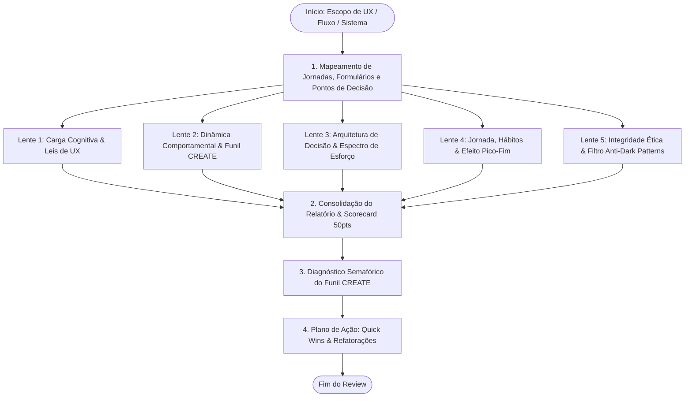

# Orchestrated UX, Cognitive Psychology & Behavioral Review (`ux-reviewer`)

Esta skill orquestra uma auditoria aprofundada de **Experiência do Usuário (UX)**, **Psicologia Cognitiva** e **Design Comportamental** em sistemas web e mobile. A análise fundamenta-se nas ciências cognitivas (Teoria do Processo Dual de Kahneman, Modelo de Fogg B = MAP, Funil CREATE de Steve Wendel, Loops de Hábito, Laws of UX e Heurísticas de Nielsen), identificando pontos de atrito mental, quebras de conversão e violações éticas (Dark Patterns / Sludge).



---

## As 5 Lentes da Auditoria Cognitiva & Comportamental

Ao inspecionar o código de interface (páginas, fluxos, formulários, modais, componentes de checkout e configurações), a auditoria avalia rigorosamente cinco dimensões complementares:

### 1. Carga Cognitiva & Leis Fundamentais de UX
* **Teoria do Processo Dual (Sistema 1 vs. Sistema 2):**
  - Rotinas cotidianas e fluxos frequentes devem rodar 100% no Sistema 1 (intuitivo, sem hesitação, milissegundos).
  - O Sistema 2 (analítico, custoso) só deve ser convocado quando o erro acarretar prejuízo ou dano irreversível.
* **Lei de Hick (Sobrecarga de Escolha):**
  - Limite de 3 a 5 opções primárias visíveis por tela sem categorização ou revelação progressiva (*progressive disclosure*).
* **Lei de Fitts & Ergonomia:**
  - Alvos de toque com área interativa mínima de **48 x 48 px** (44 x 44 pt no iOS) e espaçamento adequado para prevenir toques acidentais.
  - Alinhamento de CTAs críticos com a zona ergonômica natural (*thumb zone* no mobile).
* **Lei de Miller & Chunking:**
  - Informações complexas segmentadas em blocos de no máximo **7 ± 2 itens**.
  - Números longos formatados com máscaras (telefone, CPF, cartão de crédito em blocos de 4 dígitos).
* **Lei de Jakob & Padrões Mentais Consolidados:**
  - Aderência às convenções universais da web/mobile (carrinho no topo direito, logo à esquerda redirecionando à Home, lupa para busca, engrenagem para configurações).
* **10 Heurísticas de Usabilidade de Nielsen:**
  - Feedback em tempo real para operações assíncronas (<= 100ms para resposta inicial).
  - Linguagem orientada ao domínio do usuário, sem jargões de infraestrutura ou códigos crus de exceção.
  - Saídas de emergência e suporte universal à tecla `Escape` e ação `Desfazer (Undo)`.
  - Validação em tempo hábil (*inline feedback*) e mensagens com rotas construtivas de recuperação.

### 2. Dinâmica Comportamental & Funil CREATE
* **Modelo de Comportamento de Fogg (B = MAP):**
  - Avaliação dos 6 fatores de facilidade/simplicidade: **Tempo**, **Dinheiro**, **Esforço Físico**, **Ciclos Mentais**, **Desvio de Rotina** e **Aceitabilidade Social**.
  - Diagnóstico de Prompts: Facilitador (quando motivação é alta e habilidade é baixa), Faísca (quando habilidade é alta e motivação é baixa) e Sinal (quando ambos são altos).
* **Auditoria dos 6 Elos do Funil CREATE (Steve Wendel):**
  1. **Cue (Gatilho):** O estímulo ou CTA é imediatamente percebido pelo usuário no momento relevante?
  2. **Reaction (Reação Intuitiva):** A primeira impressão gera segurança, credibilidade e relevância visual imediata (*priming* positivo)?
  3. **Evaluation (Avaliação Racional):** Os custos cognitivos e financeiros são claros e compensados pelo benefício evidente?
  4. **Ability (Habilidade Percebida):** O usuário sente que tem a capacidade e facilidade para executar a ação sem esforço excessivo?
  5. **Timing (Urgência Real):** O estímulo induz a ação no presente ou incentiva a procrastinação ("faço depois")?
  6. **Execution (Execução sem Fricção):** A conclusão do fluxo ocorre sem barreiras técnicas, com fechamento inequívoco e prevenção de erros.

### 3. Arquitetura de Decisão & Espectro de Esforço
* **Intervenções de Baixo Esforço (Nudges Protetivos):**
  - **Defaults Estruturais:** A opção padrão pré-selecionada protege a segurança, a integridade dos dados e a privacidade do usuário.
  - **Ações Incidentais:** Ações benéficas ocorrem como subproduto natural de uma tarefa voluntária (ex.: arredondamento financeiro, salvamento automático).
  - **Automação de Repetições:** Uma única decisão pontual autoriza automação contínua (substituindo dezenas de tarefas repetitivas).
* **Intervenções de Alto Esforço (Fricção Propositiva & Defensiva):**
  - **Ações Destrutivas ou Irreversíveis:** Proibição de popups genéricos com botões "OK / Cancelar".
  - **Declaração Explícita de Impacto:** O botão primário declara o verbo e o objeto exato da destruição (ex.: `[Excluir Permanentemente 1.200 Registros]`).
  - **Barreira Ativa de Digitação:** Exigência de digitação do identificador ou nome do recurso antes de liberar ações críticas.
  - **Períodos de Resfriamento (Cooling-off / Grace Period):** Janela de carência com possibilidade de cancelamento antes da efetivação final de transações críticas.

### 4. Engenharia de Hábitos, Jornada & Efeito Pico-Fim
* **Instalação de Novos Hábitos:**
  - Aplicação de **Tiny Habits**: Passos iniciais minúsculos e sem fricção para onboarding progressivo.
  - Aplicação de **Habit Stacking**: Ancoragem de novas funcionalidades em ações já consolidadas na rotina do usuário.
* **Recompensa Imediata e Fechamento:**
  - Feedback sensorial/visual de sucesso disparado nos primeiros **<= 200ms** pós-ação.
  - Desativação imediata do botão no clique (*disabled state*) para prevenir duplo envio acidental.
* **Efeito Zeigarnik & Endowed Progress:**
  - Em fluxos de múltiplos passos (steppers), exibir progresso inicial já concedido (ex.: *"Passo 2 de 5: Cadastro básico concluído"*).
* **Regra Pico-Fim (Peak-End Rule):**
  - Identificação e eliminação de vales emocionais ao longo da jornada (momentos de frustração, dúvida ou lentidão).
  - Garantia de um encerramento triunfante, informativo e inequívoco (tela de confirmação com protocolo, resumo e próximas etapas).

### 5. Integridade Ética & Filtro Anti-Dark Patterns
* **Paridade de Cancelamento (Anti-Roach Motel):**
  - Cancelar, suspender ou reverter uma assinatura/serviço deve exigir exatamente o mesmo número de passos (ou menos) do que o fluxo de adesão inicial.
* **Comunicação Neutra de Opt-out (Anti-Confirmshaming):**
  - Proibição de textos apelativos, culpabilizantes ou humilhantes em botões de recusa (ex.: *"Não, eu prefiro continuar desprotegido"*). O texto de recusa deve ser neutro: *"Agora não"* ou *"Recusar oferta"*.
* **Consentimento Explícito (Anti-Sneak into Basket):**
  - Proibição de caixas de seleção pré-marcadas para produtos, doações ou serviços adicionais no checkout. Todo adicional exige opt-in consciente e voluntário.
* **Integridade de Ação (Anti-Bait and Switch):**
  - Controles visuais devem executar estritamente a ação prometida por seu rótulo e metáfora convencional.
* **Aviso Prévio de Renovação (Anti-Forced Continuity):**
  - Transparência absoluta sobre datas de cobrança e lembretes prévios antes de cobranças automáticas recorrentes.

---

## 📊 Formato do Relatório de Saída no Chat

Apresente o resultado da auditoria conforme o template executivo enriquecido:

````markdown
# 🧠 Relatório de Auditoria de UX, Cognição & Comportamento

> [!NOTE]
> **Fluxo / Tela Analisada:** `[Nome do fluxo ou rota, ex: Onboarding / Checkout]`  
> **Status de Usabilidade:** 🟢 Fluido / 🟡 Fricção Detectada / 🔴 Bloqueador Cognitivo / Dark Pattern  
> **Pontuação Global:** `XX / 50 Pontos`

---

## 📊 Scorecard Geral de UX & Cognição

| Lente Cognitiva / Comportamental | Nota | Status | Foco Principal da Avaliação |
| :--- | :---: | :---: | :--- |
| **1. Carga Cognitiva & Leis de UX** | `X/10` | 🟢 OK | Sistema 1, Hick, Fitts (alvos 48px), Miller (7±2) e Nielsen |
| **2. Dinâmica B=MAP & Funil CREATE** | `X/10` | 🟡 WARN | Gatilhos perceptíveis, habilidade e fechamento de ação |
| **3. Arquitetura de Decisão & Fricção** | `X/10` | 🟢 OK | Defaults protetivos e fricção propositiva em ações destrutivas |
| **4. Hábitos & Efeito Pico-Fim** | `X/10` | 🟢 OK | Tiny habits, feedback <= 200ms e encerramento triunfante |
| **5. Integridade Ética Anti-Dark Patterns** | `X/10` | 🟢 OK | Paridade de cancelamento, opt-ins limpos e sem confirmshaming |

---

## 🔍 Diagnóstico do Funil de Ação CREATE (Steve Wendel)

| Elo do Funil | Status | Diagnóstico Técnico no Código |
| :--- | :---: | :--- |
| **1. Cue (Gatilho)** | 🟢 Forte | CTA primário destacado na zona visual primária |
| **2. Reaction (Intuição)** | 🟢 Positiva | Layout passa credibilidade imediata sem poluição |
| **3. Evaluation (Racional)** | 🟡 Neutro | Custo/benefício do upgrade poderia ser mais explícito |
| **4. Ability (Habilidade)** | 🟢 Alta | Formulário dividido em 3 etapas com chunking |
| **5. Timing (Urgência)** | 🟡 Médio | Falta estímulo claro para conclusão na sessão atual |
| **6. Execution (Execução)** | 🟢 Fluida | Validação inline sem travas no submit |

> [!CAUTION]
> **Alertas Éticos / Dark Patterns (se houver):** [Destaque imediato caso exista qualquer caixa pré-marcada, botão de confirmshaming ou fluxo assimétrico de cancelamento].

---

## 🛠️ Plano de Remediação & Refatorações de UX

### 1. Eliminação de Fricção Imediata (Quick Wins)
- Substituir texto do botão de cancelamento `"Não, prefiro perder meus descontos"` por `"Manter plano atual"`.
- Adicionar máscara automática no campo de telefone para reduzir carga de trabalho no Sistema 2.

### 2. Refatoração Estrutural de Fluxo
[Exemplo em código de modal de confirmação destrutiva com digitação explícita ou stepper com endowed progress]

---

## ⚡ Próximos Passos Sugeridos

- [ ] Implementar as correções de micro-cópia e defaults recomendados.
- [ ] Executar `/design-review` para validar acessibilidade técnica WCAG 2.2 e tokens visuais.
- [ ] Acompanhar a taxa de conversão do fluxo refatorado via `/product-metrics`.
````

---

## 🚫 Diretrizes Estritas

> [!CAUTION]
> - **Zero LaTeX:** Proibido utilizar sintaxe LaTeX (`$...$`). Escreva sempre `B = MAP`, `48 x 48 px`, `<= 200ms`.
> - **Ética Inegociável:** Esta skill condena e rejeita qualquer sugestão de Dark Patterns ou Sludge que manipule a decisão do usuário em benefício exclusivo da plataforma.
