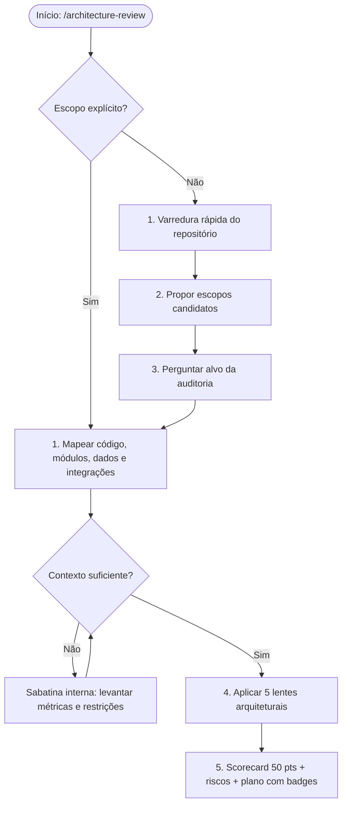

# Orchestrated Architecture Review (`architecture-review`)

Esta skill orquestra uma auditoria arquitetural adaptativa e profunda de sistemas, repositórios, serviços, RFCs ou escopos técnicos. A análise fundamenta-se estritamente em dois guias normativos centrais:

- `guides/architecture/guia-arquitetura-software-design-clean-code.md`
- `guides/architecture/guia-system-design-sistemas-distribuidos.md`

O objetivo é mensurar a maturidade técnica, identificar riscos de engenharia, violações estruturais e oportunidades de refatoração, sem jamais assumir premissas infundadas.



---

## 🧐 Regra de Sabatina Interna

A sabatina é uma verificação rigorosa de contexto prévio. A skill **não deve inventar** arquitetura, escala, SLOs, requisitos de consistência, volume, topologia ou restrições de negócio.

Se uma conclusão depender de informação ausente, investigue o código e arquivos de configuração primeiro; caso persista a dúvida, questione o usuário antes de emitir um julgamento final:

- **SLO/SLA Alvo:** Qual é o objetivo de disponibilidade e limite p95/p99 aceitável?
- **Volume & Throughput:** Qual o volume estimado de leitura vs escrita (QPS/RPS)?
- **Consistência:** O domínio exige consistência forte (ACID), read-your-writes ou tolera consistência eventual (BASE)?
- **Topologia do Sistema:** Monólito, monólito modular, microsserviços, worker assíncrono, serverless ou biblioteca?
- **Persistência Compartilhada:** Existe banco de dados compartilhado entre serviços distintos?
- **Decisões Registradas:** Existem ADRs, diagramas C4, arc42 ou RFCs vigentes?
- **Telemetria Atual:** Há métricas conhecidas de saturação, filas, consumer lag ou latência?

> [!NOTE]
> Quando o usuário não souber ou não possuir a informação solicitada, registre explicitamente a lacuna como **Limitação de Contexto** e recomende a ação investigativa mínima: benchmark de carga, spike técnico, instrumento de métrica ou emissão de ADR exploratória.

---

## 🔬 Metodologia de Execução

### Passo 1: Identificação de Escopo
1. Se o usuário forneceu caminho, serviço, diretório, RFC ou arquivo, foque estritamente nesse alvo.
2. Se não forneceu alvo específico, faça varredura preliminar com comandos de exploração (`Glob`, `Grep`, listagem de diretórios).
3. Proponha escopos candidatos claros antes de prosseguir: API, domínio central, frontend, persistência/migrations, workers assíncronos, infraestrutura ou integrações externas.

### Passo 2: Mapeamento Arquitetural
Mapeie somente o que for diretamente observável no código-fonte e configurações:
- Camadas lógicas, módulos e fronteiras de isolamento.
- Entidades, Value Objects, Use Cases, Services, Controllers/Handlers, Repositories e Adapters.
- Bancos de dados, schemas, migrations, ORMs e padrões de consulta.
- Chamadas síncronas (HTTP/gRPC/GraphQL), filas, mensageria (Kafka/RabbitMQ/SQS) e consumers.
- Padrões defensivos: cache, rate limit, timeout explícito, retry com backoff/jitter, circuit breaker e outbox.
- Documentação viva existente: ADRs (`docs/adr/`), diagramas e pipelines de CI/CD.

### Passo 3: Auditoria em 5 Lentes

#### 1. Fronteiras, Domínio & Dependências
- Domínio puro livre de frameworks, drivers de banco, SDKs de nuvem ou transporte (HTTP/gRPC).
- Regra de dependência estrita (camadas internas desconhecem detalhes das camadas externas).
- Mappers explícitos entre DTOs de transporte, entidades de domínio e modelos de persistência (ActiveRecord/ORM).
- Bounded Contexts bem isolados; ausência de acoplamento temporal e estrutural indevido.
- Detecção precoce do risco de *Distributed Monolith*.

#### 2. Design Interno, SOLID & Clean Code
- Aplicação de SRP, OCP e DIP em use cases, services e entidades.
- Ausência de *God Objects*, *God Services* e *God Classes*.
- Eliminação de *flag arguments* booleanos em métodos internos complexos.
- Uso de *Value Objects* para combater *Primitive Obsession*.
- Funções com nível único de abstração (*Single Level of Abstraction Principle - SLAP*).
- Tratamento semântico de erros de domínio; proibição estrita de blocos `catch` vazios ou silenciosos.
- Conformidade com *YAGNI* e ausência de abstração especulativa prematura (*Speculative Generality*).

#### 3. Dados, Consistência & Persistência
- Adequação do modelo de consistência (ACID vs Eventual) às regras reais de negócio.
- Separação consciente entre modelos de escrita e leitura quando pertinente.
- Riscos de *cross-partition queries*, joins distribuídos ou chaves de partição com risco de *hot partition*.
- Avaliação de persistência compartilhada (*Monolithic Persistence*) entre múltiplos serviços.
- Aderência justificada caso sejam empregados CQRS ou Event Sourcing (evitar complexidade acidental).

#### 4. Escala, Resiliência & Comunicação
- Presença de timeouts rígidos e explícitos em todas as conexões de rede e banco.
- Retentativas (*Retries*) limitadas, empregando Exponential Backoff acompanhado de Jitter.
- Mecanismos de contenção de falhas em cascata: *Circuit Breakers* e *Bulkheads*.
- Prevenção ativa contra *Synchronous Chain of Death* e *Chatty I/O* (N+1 queries ou chamadas distribuídas).
- Proibição de consultas irrestritas ao banco de dados (*Unbounded Queries* sem limites paginados estritos).
- Mitigação de vulnerabilidades de cache: *Cache Stampede*, *Cache Avalanche* e *Cache Penetration*.
- Idempotência garantida em operações mutáveis de escrita via deduplicação atômica.

#### 5. Governança, Observabilidade & Evolução
- Existência e atualização de *Architecture Decision Records* (ADRs) para decisões de Tipo 1 (alto custo de reversão).
- Prontidão para observabilidade estruturada: logs em formato JSON/OpenTelemetry, métricas RED (Rate, Errors, Duration) e USE (Utilization, Saturation, Errors).
- Tracing distribuído com correlação de `trace_id` e `span_id` em ecossistemas de microsserviços.
- Prevenção do risco de *Big Bang Rewrite*, priorizando refatorações graduais com *Strangler Fig*.

---

## 🚫 Anti-Padrões Obrigatórios Monitorados

### Arquitetura e Clean Code
* ⚠️ **God Class / God Service:** Classes ou serviços acumulando dezenas de responsabilidades descorrelacionadas.
* ⚠️ **Big Ball of Mud:** Ausência de fronteiras lógicas, onde qualquer componente acessa diretamente qualquer parte do sistema.
* ⚠️ **Spatula / Arquitetura Lasanha:** Camadas intermediárias inúteis que apenas repassam parâmetros sem aplicar lógica ou valor.
* ⚠️ **Golden Hammer:** Forçar o mesmo paradigma, banco ou biblioteca para problemas de natureza totalmente divergente.
* ⚠️ **Anemic Domain Model:** Entidades reduzidas a simples bolsas de dados (*getters/setters*), enquanto a lógica de negócio vaza para controllers e services externos.
* ⚠️ **Distributed Monolith:** Microsserviços com dependências síncronas bloqueantes, deploy acoplado e banco de dados unificado.

### System Design e Engenharia Distribuída
* ⚠️ **Synchronous Chain of Death:** Cadeias de chamadas síncronas A → B → C → D onde a falha ou lentidão de um nó paralisa todos os anteriores.
* ⚠️ **Chatty I/O / N+1 Distribuído:** Loops efetuando chamadas sequenciais remotas para carregar dados que poderiam ser consultados em lote (*batch*).
* ⚠️ **Monolithic Persistence:** Múltiplos serviços autônomos gravando e lendo diretamente das mesmas tabelas no banco de dados.
* ⚠️ **Unbounded Queries:** Consultas `SELECT * FROM table` sem cláusula `LIMIT`, paginação por cursor ou paginação por offset.
* ⚠️ **Retry Storm:** Retentativas imediatas sem espaçamento e sem jitter que sobrecarregam e derrubam serviços já instáveis.
* ⚠️ **Poison Pills sem DLQ:** Mensagens corrompidas que quebram o consumer em loop infinito por falta de *Dead Letter Queue*.

---

## 📋 Formato Canônico do Relatório no Chat

Ao gerar o relatório de auditoria, adote rigorosamente o padrão abaixo com badges semafóricos claros:

````markdown
# 🏛️ Relatório de Architecture Review

> [!NOTE]
> **Alvo Analisado:** `src/modules/billing`  
> **Tipo de Sistema:** Backend / API RESTful em Node.js (TypeScript)  
> **Conformidade Normativa:** `guides/architecture/guia-arquitetura-software-design-clean-code.md`

---

## 📊 Scorecard Geral de Maturidade (50 pts)

| Lente Arquitetural | Nota | Status | Foco da Avaliação |
| :--- | :---: | :---: | :--- |
| **1. Fronteiras, Domínio & Dependências** | `8/10` | 🟢 OK | Isolamento do Core, desacoplamento de ORM e DTOs |
| **2. Design Interno, SOLID & Clean Code** | `7/10` | 🟡 WARN | SRP, SLAP, Value Objects e exceções semânticas |
| **3. Dados, Consistência & Persistência** | `6/10` | 🟡 WARN | Modelo transacional, sharding e consultas paginadas |
| **4. Escala, Resiliência & Comunicação** | `5/10` | 🔴 FAIL | Timeouts, retries com jitter, idempotência e filas |
| **5. Governança, Observabilidade & Evolução** | `7/10` | 🟢 OK | ADRs, métricas RED/USE e logs estruturados |

> **Pontuação Global Consolidada:** `33/50` — **Maturidade Intermediária (Requer Mitigações)**

---

## 🚨 Riscos Críticos e Violações Estruturais

> [!CAUTION]
> **Bloqueadores de Deploy / Estabilidade Operacional:** Os itens classificados com prioridade **Imediata** representam vulnerabilidades de estabilidade em produção ou risco de perda transacional e devem ser corrigidos antes do próximo release.

| Severidade | Prioridade | Risco Arquitetural | Evidência / Arquivo | Impacto Operacional | Ação Mitigadora Recomendada |
| :---: | :---: | :--- | :--- | :--- | :--- |
| 🔴 CRÍTICO | **Imediato** | Unbounded Query em listagem | `src/repositories/invoice.repo.ts:42` | Esgotamento de memória e OOM | Introduzir paginação obrigatória via cursor com limite máximo de 100 itens. |
| 🟡 MÉDIO | **Sprint** | Falta de Circuit Breaker | `src/integrations/gateway.client.ts:88` | Cascata de falhas e travamento de threads | Envolver o cliente com biblioteca de resiliência e fallback gracioso. |
| 🟢 BAIXO | **Trimestre** | Primitive Obsession em Moeda | `src/domain/entities/order.ts:15` | Erros de arredondamento | Criar o Value Object `Money` encapsulando lógica de precisão decimal. |

---

## 🔍 Diagnóstico Detalhado por Lente

### 1. Fronteiras, Domínio & Dependências
- `src/domain/order.service.ts:24` — **Acoplamento Indevido com ORM:** A entidade de domínio importa anotações do TypeORM.
  - *Recomendação:* Isolar a entidade pura e criar mappers explícitos na camada de infraestrutura.

### 2. Design Interno, SOLID & Clean Code
- `src/services/payment.service.ts:102` — **Violação de SRP e God Method:** O método `process()` gerencia autenticação, cálculo de juros e envio de e-mails.
  - *Recomendação:* Extrair componentes dedicados para cálculo e despacho de notificações assíncronas.

### 3. Dados, Consistência & Persistência
- `src/database/queries/report.sql:12` — **Join Transversal sem Índice:** Consulta relacional sem índice composto nas colunas de filtro.
  - *Recomendação:* Adicionar migration com índice B-Tree cobrindo `(tenant_id, created_at)`.

### 4. Escala, Resiliência & Comunicação
- `src/clients/http.client.ts:30` — **Chamada Externa sem Timeout:** Requisições HTTP utilizam o timeout padrão infinito da runtime.
  - *Recomendação:* Configurar timeout explícito de 3.000ms com retry munido de Exponential Backoff e Full Jitter.

### 5. Governança, Observabilidade & Evolução
- `src/shared/logger.ts:10` — **Logs em Formato Texto Livre:** Emissão de logs usando `console.log` sem correlação de contexto.
  - *Recomendação:* Adotar logger estruturado JSON emitindo `correlation_id` e metadados OpenTelemetry.

---

## 🗺️ Plano de Ação Estruturado

### 1. Quick Wins (Ações Imediatas e Seguras)
- [ ] Parametrizar timeouts rígidos (3s) em todas as instâncias do cliente HTTP (`src/clients/`).
- [ ] Adicionar limite padrão de 50 registros na query `findAllInvoices` para eliminar o risco de OOM.

### 2. Refatorações Estruturais (Próximos Sprints)
- [ ] Desacoplar entidades de domínio do ORM através da implementação do padrão Repository com mappers dedicados.
- [ ] Implementar fila com Dead Letter Queue (DLQ) para reprocessamento defensivo de eventos rejeitados.

### 3. Decisões Arquiteturais que Exigem ADR (Decisões Tipo 1)
- [ ] **ADR: Estratégia de Deduplicação e Idempotência:** Definição da retenção de chaves idempotentes no Redis com TTL de 24h para rotas de faturamento.

---

## ⚡ Próximos Passos Sugeridos

- [ ] Executar `/code-documentar` nos módulos de domínio e repositórios refatorados para padronizar docstrings e divisores estruturais `MARK:`.
- [ ] Registrar a decisão de resiliência e idempotência via `/commit-e-documentar` (gerando a respectiva ADR canônica em `docs/adr/`).
- [ ] Submeter os cenários de alta carga para validação com testes de estresse antes da publicação em homologação.
````

---

## 🚫 Diretrizes Estritas de Apresentação

> [!CAUTION]
> - **Zero LaTeX:** Jamais utilize formatação matemática LaTeX (`$...$`). Utilize operadores e símbolos textuais claros (`>=`, `<=`, `%`, `p95`, `p99`).
> - **Zero Arte ASCII Frágil:** Tabelas e matrizes devem ser renderizadas exclusivamente em Markdown nativo e alinhado. Nunca utilize caixas Unicode desenhadas manualmente (`┌───┐`, `│`).
> - **Ações Baseadas em Fatos:** Não prescreva adoção de microsserviços, CQRS ou mensageria distribuída a menos que o volume de dados, escalabilidade ou requisitos de negócio justifiquem inequivocamente a complexidade adicional.
