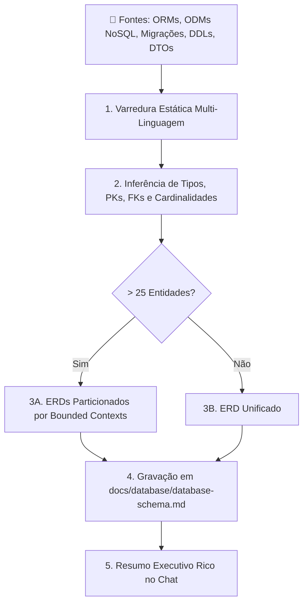
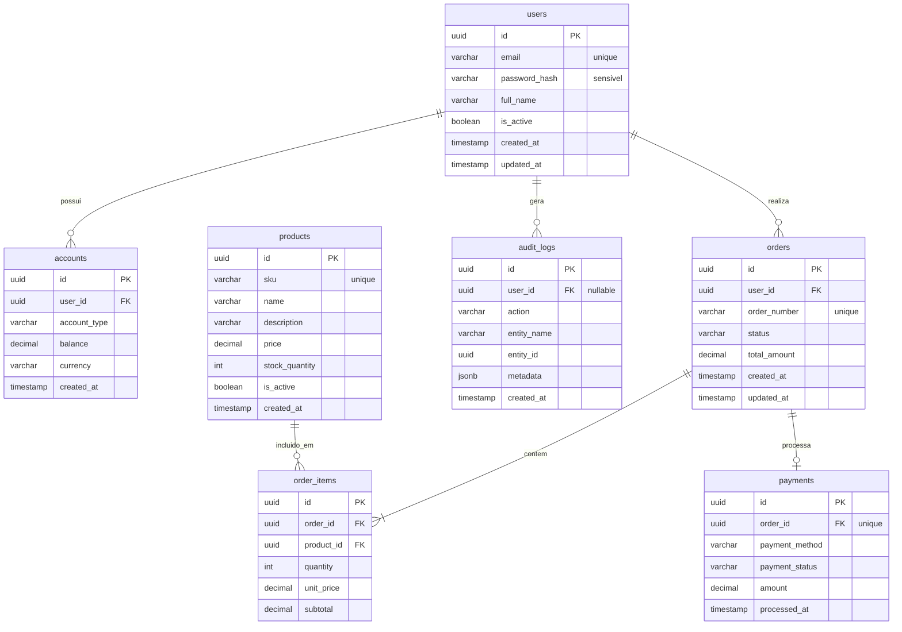

# DB Documentar (Universal Database Schema & ERD Mapper)

Esta skill transforma o agente em um **Engenheiro de Dados & Database Architect Sênior** especializado em engenharia reversa de bancos de dados a partir de análise estática poliglota de repositórios de software (Relacionais e NoSQL/Document Stores).

Ela analisa exaustivamente modelos ORM/ODM, migrações, DDLs, schemas/DTOs, contratos de tipagem e consultas SQL brutas para reconstruir com máxima precisão o esquema de dados, gerando um artefato canônico em `docs/database/database-schema.md` composto por diagramas **Mermaid `erDiagram`**, **Dicionário de Dados**, **Matriz de Integridade Referencial** e **Classificação de Segurança/Privacidade (LGPD/GDPR)**.



---

## ⚠️ Regras Críticas de Execução

### 1. Aplicação Direta no Disco (NUNCA Despejar no Chat)

- **Proibido Dump no Chat:** Jamais imprima o documento Markdown completo ou os blocos gigantes de Mermaid no chat.
- **Escrita em Arquivo:** O documento deve ser salvo ou atualizado diretamente no caminho padrão `docs/database/database-schema.md` (criando o diretório `docs/database/` caso não exista).
- **Resposta Concisa no Chat:** A resposta final no chat deve conter exclusivamente um sumário executivo de alto nível com métricas, entidades mapeadas, alertas de segurança e próximos passos.

### 2. Validade Estrita da Sintaxe Mermaid `erDiagram`

- **Tipos de Atributos Limpos:** Não utilize espaços, vírgulas ou parênteses nos tipos Mermaid.
  - ✅ **Correto:** `varchar`, `int`, `bigint`, `timestamp`, `decimal`, `uuid`, `boolean`, `jsonb`, `text`
  - ❌ **Incorreto:** `VARCHAR(100)`, `INT NOT NULL`, `DECIMAL(10,2)`, `TEXT[]`
- **Cardinalidades Válidas:**
  - `||--o{` : Exatamente um para zero ou muitos (1:N opcional)
  - `||--|{` : Exatamente um para um ou muitos (1:N obrigatório)
  - `||--||` : Exatamente um para exatamente um (1:1 obrigatório)
  - `||--o|` : Exatamente um para zero ou um (1:1 opcional)
  - `}o--o{` : Zero ou muitos para zero ou muitos (N:N via tabela associativa ou relação lógica)
- **Rótulos de Relacionamento:** Devem estar sempre entre aspas duplas: `users ||--o{ orders : "realiza"`
- **Nomes de Entidades:** Use identificadores alfanuméricos sem caracteres especiais (ex: `users`, `order_items`, `accounts`).

---

## 🔍 Fase 1: Varredura Estática Multi-Camada Poliglota

A skill inspeciona todas as fontes de verdade de dados no repositório de forma abrangente:

### 1. Modelos ORM e ODM NoSQL (Multi-Linguagem)

- **TypeScript / JavaScript:**
  - *Relacional:* Prisma (`schema.prisma`), TypeORM (`@Entity()`, `@Column()`), Drizzle ORM (`pgTable()`, `relations()`), MikroORM (`@Entity()`), Sequelize (`define()`, `Model.init()`), Objection.js / Knex.
  - *NoSQL / Document:* Mongoose (`new Schema({...})`, `mongoose.model()`, referências `ref:` e subdocumentos embutidos), Prisma MongoDB (`@map("_id")`, `@db.ObjectId`, tipos compostos `type Address { ... }`), Typegoose.
- **Python:**
  - *Relacional:* SQLAlchemy (`Base`, `Mapped`, `Column`, `relationship`, `ForeignKey`), Django Models (`models.Model`, `ForeignKey`, `ManyToManyField`), SQLModel (`SQLModel, table=True`), Tortoise ORM, Peewee.
  - *NoSQL:* Beanie / Motor (MongoDB ODM com Pydantic), MongoEngine, PynamoDB (Amazon DynamoDB).
- **PHP:** Laravel Eloquent (`Model`, `$table`, `$fillable`, `belongsTo`, `hasMany`, `belongsToMany`), Doctrine ORM (`#[ORM\Entity]`).
- **Java / Kotlin:** Hibernate / JPA (`@Entity`, `@Table`, `@Id`, `@ManyToOne`, `@OneToMany`, `@JoinColumn`), Spring Data JPA, Spring Data MongoDB (`@Document`, `@DBRef`).
- **C# / .NET:** Entity Framework Core (`DbContext`, `DbSet<T>`, `[Table]`, `[Key]`, `[ForeignKey]`, `modelBuilder.Entity<T>()`), MongoDB C# Driver (`BsonElement`, `BsonId`).
- **Go:** GORM (`gorm.Model`, tags `gorm:"foreignKey:..."`), Ent, SQLX, Mongo-Go-Driver.
- **Rust:** Diesel (`table!`, `#[derive(Queryable)]`), SeaORM (`DeriveEntityModel`), Mongo Rust Driver.

### 2. Scripts DDL, SQL e Gerenciadores de Migração

- Arquivos `.sql`, scripts DDL com `CREATE TABLE`, `ALTER TABLE ADD CONSTRAINT`, `CREATE INDEX`, `CREATE UNIQUE INDEX`, Stored Procedures, Views e Triggers.
- Migrações: Alembic (`alembic/versions/*.py`), Flyway (`db/migration/V*.sql`), Liquibase (`changelog.xml/yaml/sql`), Phinx, Prisma Migrations (`prisma/migrations/`), Django Migrations (`*/migrations/*.py`), Laravel Migrations (`database/migrations/*.php`), Goose, Golang-Migrate.

### 3. Camada de Acesso a Dados & Consultas Raw

- Módulos `repositories/`, `services/`, `dao/`, `db/`, `queries/`.
- Consultas SQL raw parametrizadas (`SELECT ... JOIN ... ON ...`, `INSERT INTO ...`, `UPDATE ... WHERE ...`, CTEs).
- Chamadas a drivers de banco de dados (`psycopg`, `asyncpg`, `pg`, `mysql2`, `better-sqlite3`, `sqlx`, `database/sql`, `pymongo`).

### 4. Contratos de Dados, Schemas e DTOs

- **Python:** Pydantic v1/v2 (`BaseModel`, `Field()`), Schemas FastAPI.
- **TypeScript / Frontend:** Zod (`z.object({...})`), Valibot, Yup, interfaces e types TypeScript (`types/`, `models/`, DTOs de API).
- **Go / Rust:** Structs com tags de serialização e persistência (`db:"..."`, `json:"..."`, `serde`).

---

## 🧩 Fase 2: Inferência de Schema, Tipos e Cardinalidades

1. **Chaves Primárias (PK):**
   - Identificadas explicitamente (`PRIMARY KEY`, `@id`, `_id`, `primary_key=True`, `id`, `uuid`).
   - Suporte a chaves compostas e identificadores substitutos (UUIDv4/v7, ULID, Snowflake, Auto-Increment, ObjectId).

2. **Chaves Estrangeiras (FK) e Integridade Referencial:**
   - **FKs Explícitas:** Declaradas via `FOREIGN KEY (...) REFERENCES ...`, decoradores ou métodos relacionais de ORM.
   - **FKs Implícitas (Integridade Lógica de Aplicação):** Em repositórios sem constraints físicas no banco ou em bancos NoSQL, inferir relacionamentos por:
     - Convenções canônicas de nomenclatura (`{entidade_singular}_id`, `{entidade_singular}_uuid`, `{tabela}_fk`).
     - Cláusulas `JOIN ... ON a.id = b.a_id` mapeadas nas consultas SQL dos repositories/services.
     - Referências de ODMs NoSQL (`type: Schema.Types.ObjectId, ref: 'User'`).

3. **Mapeamento NoSQL (Embutidos vs Referenciados):**
   - **Subdocumentos Embutidos:** Modelar como atributo de tipo estruturado (ex: `jsonb address` ou `jsonb metadata`) ou entidade separada com relacionamento 1:1 / 1:N forte de composição.
   - **Coleções Referenciadas:** Modelar como relação padrão com cardinalidade correspondente.

4. **Mapeamento de Cardinalidades e Nulabilidade:**
   - Avaliar nulabilidade (`nullable=False` / `nullable=True`, `NOT NULL`), constraints de unicidade (`UNIQUE`), coleções (arrays/listas denotam 1:N ou N:N) e referências escalares únicas (1:1 ou N:1).
   - Identificar tabelas associativas/pivô para relacionamentos N:N (ex: `order_items` intermediando `orders` e `products`).

5. **Classificação de Dados Sensíveis (LGPD / GDPR):**
   - Classificar colunas em: Dado Pessoal (PII), Segredo Crítico (senhas com hash, chaves de API), Dado Financeiro (cartão, conta, transações), Auditoria ou Dado Operacional Comum.

---

## 📐 Estratégia para Grandes Schemas (> 25 Tabelas / Bounded Contexts)

> [!TIP]
> Em monólitos ou sistemas extensos (mais de 25 tabelas), um único bloco Mermaid ERD fica ilegível ou excede os limites de renderização dos visualizadores Markdown.
>
> **Diretriz de Particionamento:**
>
> 1. Gere um **Diagrama Geral de Alto Nível** contendo apenas os Bounded Contexts e as conexões macro entre eles.
> 2. Crie **Sub-Diagramas ERD Modulares por Domínio** (ex: `2.1 Módulo Identidade & Acesso`, `2.2 Módulo Vendas & Cobrança`, `2.3 Módulo Logística & Estoque`).

---

## 📝 Fase 3: Template Determinístico do Arquivo de Saída

O arquivo gerado em `docs/database/database-schema.md` deve seguir a estrutura canônica abaixo:

````markdown
<!-- 
=================================================================================
LOG DE MANUTENÇÃO E ALTERAÇÕES DO DOCUMENTO
=================================================================================
Data       | Autor          | Descrição da Alteração
-----------|----------------|--------------------------------------------------
YYYY-MM-DD | db-documentar  | Mapeamento relacional e geração de ERD Mermaid.
=================================================================================
-->

# Documentação de Banco de Dados e Esquema Relacional

## 1. Visão Geral e Arquitetura de Dados
- **Mecanismo de Banco de Dados**: [ex: PostgreSQL 16 / MySQL 8.0 / MongoDB 7.0 / SQLite]
- **Origem dos Metadados**: [ex: Análise estática de modelos Prisma/SQLAlchemy, migrações DDL e DTOs Pydantic/Zod]
- **Resumo Quantitativo**: Total de X entidades mapeadas, Y relacionamentos (Z explícitos, W lógicos) e K atributos catalogados.

---

## 2. Diagrama Entidade-Relacionamento (Mermaid ERD)



---

## 3. Dicionário de Dados

### 3.1 Tabela: `users` (Usuários do Sistema)
**Descrição**: Armazena as contas principais dos usuários, credenciais de acesso e estado de ativação.

| Coluna | Tipo SQL | Tipo Aplicação | Nulo | Chave | Referência | Descrição / Regra de Negócio |
| :--- | :--- | :--- | :--- | :--- | :--- | :--- |
| `id` | `UUID` | `string` / `UUID` | Não | PK | - | Identificador universal único do usuário. |
| `email` | `VARCHAR(255)` | `string` | Não | UQ | - | E-mail do usuário (único, normalizado em minúsculas). |
| `password_hash` | `VARCHAR(255)` | `string` | Não | - | - | Hash criptográfico da senha. Nunca exposto em DTOs de leitura. |
| `full_name` | `VARCHAR(150)` | `string` | Não | - | - | Nome completo do usuário. |
| `is_active` | `BOOLEAN` | `boolean` / `bool` | Não | - | - | Flag indicando se a conta está ativa. Padrão: `true`. |
| `created_at` | `TIMESTAMP` | `Date` / `datetime` | Não | - | - | Data e hora de criação do registro (UTC). |
| `updated_at` | `TIMESTAMP` | `Date` / `datetime` | Não | - | - | Data e hora da última modificação do registro (UTC). |

*(Repetir subseção 3.X para todas as entidades identificadas no projeto)*

---

## 4. Matriz de Integridade Relacional e Foreign Keys

| Tabela Origem | Coluna Origem | Tabela Destino | Coluna Destino | Cardinalidade | Tipo FK | Regra de Negócio / Integridade |
| :--- | :--- | :--- | :--- | :--- | :--- | :--- |
| `accounts` | `user_id` | `users` | `id` | `N:1 (||--o{)` | Explícita (`ON DELETE CASCADE`) | Cada conta financeira pertence a um único usuário. |
| `orders` | `user_id` | `users` | `id` | `N:1 (||--o{)` | Explícita (`ON DELETE RESTRICT`) | O pedido deve estar vinculado a um usuário cadastrado. |
| `order_items` | `order_id` | `orders` | `id` | `N:1 (||--|{)` | Explícita (`ON DELETE CASCADE`) | O item compõe obrigatoriamente um pedido. |
| `order_items` | `product_id` | `products` | `id` | `N:1 (||--o{)` | Explícita (`ON DELETE RESTRICT`) | Produto catalogado inserido no pedido. |
| `payments` | `order_id` | `orders` | `id` | `1:1 (||--o|)` | Explícita (`ON DELETE RESTRICT`) | Cada transação de pagamento liquida um único pedido. |
| `audit_logs` | `user_id` | `users` | `id` | `N:1 (||--o{)` | Lógica / Implícita (Nulável) | Registra o autor da ação; nulo se ação automatizada. |

---

## 5. Índices, Chaves Únicas e Classificação de Segurança (LGPD / GDPR)

| Tabela | Coluna / Atributo | Classificação de Segurança | Tipo de Proteção / Índice | Observações |
| :--- | :--- | :--- | :--- | :--- |
| `users` | `email` | Dado Pessoal (PII) | `UNIQUE INDEX` | Identificador de login; indexado para consultas rápidas. |
| `users` | `password_hash` | Segredo Crítico | Hash Criptográfico | Proibida exposição em logs, traces ou serializações públicas. |
| `users` | `full_name` | Dado Pessoal (PII) | Mascaramento em Logs | Protegido conforme diretrizes de privacidade de dados. |
| `payments` | `payment_method` | Dado Financeiro | Tokenização / Criptografia | Dados protegidos conforme padrões PCI-DSS. |
| `audit_logs` | `metadata` | Rastreabilidade | Log Estruturado (JSONB) | Trilhas de auditoria imutáveis com retenção controlada. |

---

## 6. Padrões Arquiteturais e Diretrizes de Engenharia
- **Estratégia de Identificadores:** Identificadores universais (`UUIDv7` / `UUIDv4` / `ObjectId`) para desacoplamento e segurança contra enumeração.
- **Auditoria e Rastreabilidade:** Timestamps em UTC (`created_at`, `updated_at`) e logs de auditoria imutáveis.
- **Estratégia de Exclusão:** Exclusão lógica (*soft delete*) com flag `deleted_at` ou restrições rígidas de integridade referencial (*RESTRICT/CASCADE*).
- **Convenções de Nomenclatura:** Nomes de tabelas em `snake_case` no plural, colunas em `snake_case`, PKs em `id` e FKs no formato `{entidade_singular}_id`.
````

---

## ✅ Checklist de Validação Pré-Escrita

Antes de persistir o arquivo em disco, certifique-se de que:

- [ ] O diagrama Mermaid `erDiagram` possui sintaxe válida (sem parênteses ou tipos compostos nos atributos).
- [ ] Todas as relações têm rótulos entre aspas duplas (`"relacionamento"`).
- [ ] Se o projeto possuir > 25 tabelas, a documentação foi particionada em sub-diagramas por Bounded Context.
- [ ] Toda entidade possui sua respectiva subseção no Dicionário de Dados com tipos de aplicação e do banco.
- [ ] Colunas que armazenam dados pessoais, senhas ou tokens estão catalogadas na seção de Segurança (LGPD/GDPR).

---

## 📊 Fase 4: Formato de Resposta no Chat

Após gravar o arquivo em disco com sucesso, retorne **apenas** um sumário executivo no formato rico:

````markdown
# 🗄️ Mapeamento de Banco de Dados Concluído!

> [!NOTE]
> **Artefato Gerado:** [`docs/database/database-schema.md`](docs/database/database-schema.md)<br>
> **Mecanismo Identificado:** 🟢 PostgreSQL 16 (Relacional via Prisma ORM)<br>
> **Data de Atualização:** [Data atual em UTC]

---

### 📊 Métricas do Schema Mapeado

| Dimensão | Total Mapeado | Detalhes |
| :--- | :---: | :--- |
| **Entidades / Tabelas** | **X** | [ex: 7 tabelas relacionais + 1 view de relatórios] |
| **Relacionamentos** | **Y** | [ex: 6 explícitos via FK física, 2 lógicos via DTOs/queries] |
| **Atributos Catalogados** | **K** | [ex: 42 colunas mapeadas com tipos e regras de negócio] |
| **Campos Sensíveis (PII)** | **N** | [ex: 3 campos classificados sob diretrizes LGPD/GDPR] |

---

### 🔍 Destaques da Arquitetura de Dados

- **Entidade Central (`users`):** Gestão de identidade com autenticação segura e relacionamentos com `accounts` e `orders`.
- **Integridade Transacional (`orders` ↔ `order_items` ↔ `products`):** Relacionamentos fortes com exclusão em cascata controlada.
- **Rastreabilidade (`audit_logs`):** Estrutura desacoplada via `jsonb` para auditoria de operações críticas.

> [!IMPORTANT]
> **Atenção à Privacidade (LGPD/GDPR):** Identificados campos de PII (`email`, `full_name`) e segredo crítico (`password_hash`) na tabela `users`. Certifique-se de que os DTOs de serialização pública excluam esses campos.

---

## ⚡ Próximos Passos Sugeridos

- [ ] Executar auditoria de integridade arquitetural e gargalos de banco via `/architecture-review`.
- [ ] Documentar os repositórios e serviços de dados correspondentes via `/code-documentar`.
- [ ] Vincular as entidades do schema às regras de negócio de novas features usando `/product-spec`.
````

---

## 🚫 Diretrizes Estritas & Anti-Padrões

> [!CAUTION]
> - **NUNCA faça dump do arquivo completo no chat.** Apenas grave no caminho `docs/database/database-schema.md` e devolva o sumário executivo.
> - **Zero LaTeX:** Nunca utilize sintaxe matemática LaTeX (`$...$`).
> - **Anti-Alucinação de Constraints:** Se uma relação é puramente lógica (sem FK no banco de dados), marque-a explicitamente como "Lógica / Implícita" na Matriz de Integridade.
