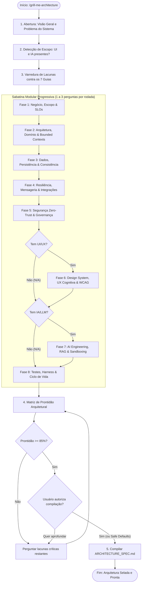
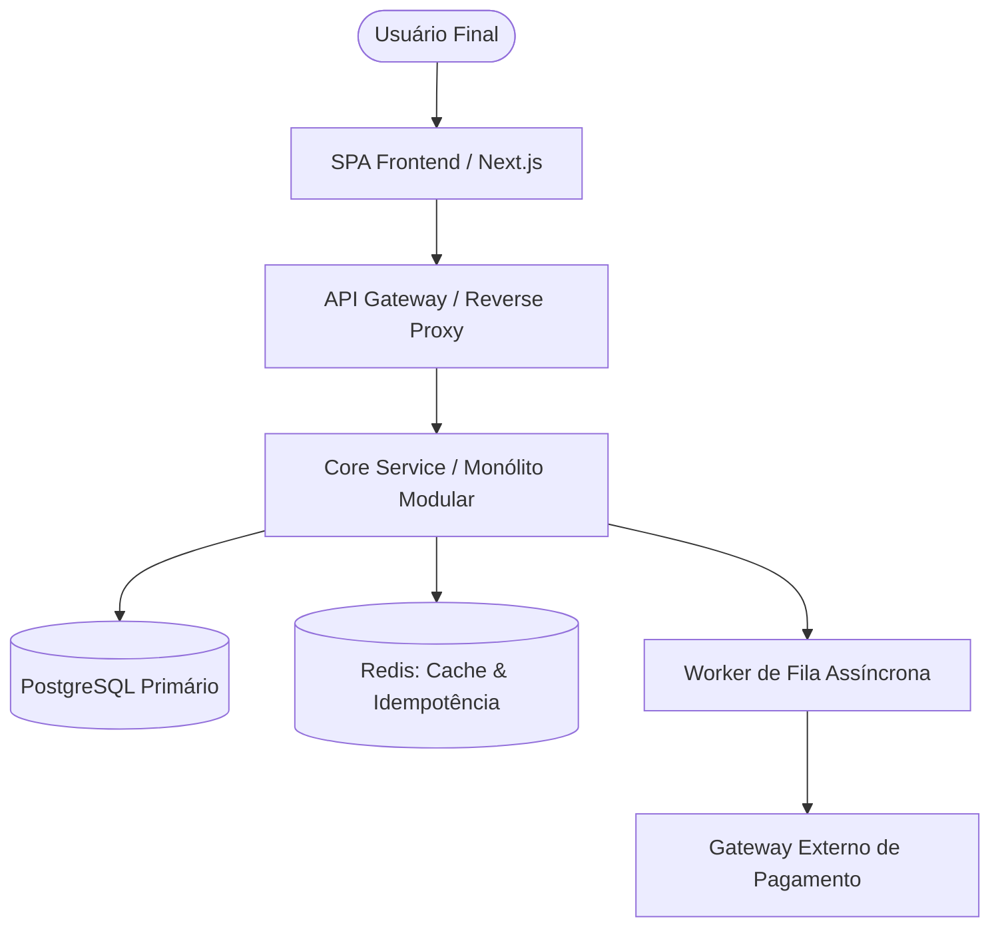
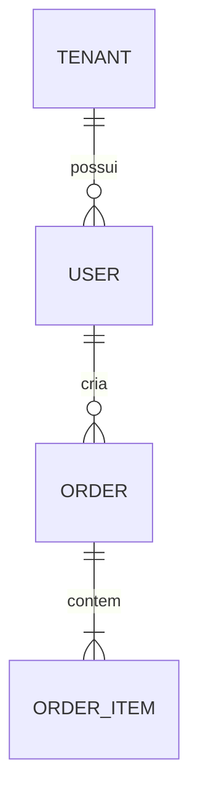

# Architecture Grill Orchestrator (`grill-me-architecture`)

Esta skill orquestra uma **sabatina técnica progressiva, estruturada e exaustiva** para conceber e blindar a arquitetura de sistemas, serviços ou aplicações antes de qualquer linha de código ser escrita. Seu objetivo é explorar todas as ramificações de decisão técnica, eliminar ambiguidades e produzir um documento consolidado de especificação arquitetural (`ARCHITECTURE_SPEC.md` ou `SYSTEM_OVERVIEW.md`).

A sabatina é estritamente orientada por 7 guias normativos do ecossistema:

1. **Harness, Memória & Ciclo de Vida**: `guides/essentials/guia-completo-harness-commit-memoria.md`
2. **Segurança Defensiva Zero-Trust**: `guides/architecture/guia-seguranca-defensiva-zero-trust.md`
3. **Padrão de Criação de ADRs**: `guides/essentials/guia-padrao-criacao-adrs.md`
4. **Estratégia & Pirâmide de Testes**: `guides/testing/README.md`
5. **Design UI/UX, Acessibilidade & Cognição**: `guides/design-ui-ux/README.md`
6. **Arquitetura de Software & System Design**: `guides/architecture/README.md`
7. **Engenharia de IA & Sandboxing**: `guides/ai-engineering/README.md`

---

## 🧭 Fluxo Operacional da Skill



---

## 🎯 Regras Canônicas de Condução da Sabatina

1. **Nunca inventar restrições sem perguntar**: Se escala, volume de dados, consistência, SLOs ou orçamentos não foram informados, pergunte diretamente.
2. **Cadência Progressiva (1 a 3 perguntas por rodada)**: Jamais despeje questionários gigantescos com dezenas de perguntas de uma vez só. Agrupe de 1 a 3 perguntas correlacionadas por rodada dentro da fase ativa.
3. **Respostas Recomendadas Fundamentadas (Safe Defaults)**: Toda pergunta deve vir acompanhada de uma opção recomendada baseada nas melhores práticas dos guias normativos.
4. **Detecção Condicional de Escopo**:
   - Se o sistema for uma API headless, CLI, biblioteca ou worker de dados, a **Fase 6 (UI/UX)** deve ser declarada `N/A`.
   - Se não envolver modelos generativos/LLMs, a **Fase 7 (AI Engineering)** deve ser declarada `N/A`.
5. **Critério de Parada Misto (Matriz de Prontidão)**:
   - Apresente o percentual matemático de cobertura das decisões.
   - Quando atingir **>= 85%**, ofereça ao usuário a opção de selar o documento assumindo os Safe Defaults documentados.
6. **Identificação Ativa de Gatilhos de ADR**: Durante a sabatina, catalogue decisões arquiteturais de Tipo 1 (difíceis ou caras de reverter) para registrar na matriz de ADRs.

---

## 📚 Roteiro das Fases Modulares & Safe Defaults

### Fase 1: Escopo, Negócio & Requisitos Não-Funcionais (SLOs)
- **Perguntas Chave:**
  - Qual o objetivo central de negócio e quem são os usuários primários?
  - Qual é a taxa estimada de requisições por segundo (QPS) de pico e média?
  - Qual a meta de disponibilidade (ex: 99.9%) e limites de latência p95/p99?
  - O perfil é Read-Heavy (ex: 80/20) ou Write-Heavy?
- 🛡️ **Safe Defaults (Caso não especificado):**
  - *Disponibilidade:* 99.9% (três noves).
  - *Latência:* p95 < 200ms para leituras, p99 < 500ms para escritas.
  - *Carga Inicial:* Read-heavy (85% leitura / 15% escrita), suportando até 100 QPS de pico no primeiro ano.

---

### Fase 2: Topologia, Domínio & Clean Architecture
- **Perguntas Chave:**
  - Qual a topologia: Monólito Modular, Clean/Hexagonal Architecture ou Microsserviços?
  - Quais são os Bounded Contexts principais (de 2 a 5 módulos)?
  - O domínio é estritamente isolado de frameworks, ORMs e transportes (DIP)?
- 🛡️ **Safe Defaults:**
  - *Topologia:* Monólito Modular estruturado segundo Clean Architecture (Domain -> Application -> Infrastructure).
  - *Isolamento:* Regra de dependência estrita; mappers dedicados entre DTOs e entidades de domínio.

---

### Fase 3: Persistência, Dados & Consistência
- **Perguntas Chave:**
  - Qual o modelo de banco: Relacional (PostgreSQL), Documentos (MongoDB) ou Híbrido?
  - O sistema exige consistência imediata (ACID) ou tolera consistência eventual (BASE)?
  - Qual a estratégia de Multi-Tenancy: banco dedicado, schema separado ou isolamento por linha com Row-Level Security (RLS)?
- 🛡️ **Safe Defaults:**
  - *Banco:* PostgreSQL relacional com schema estrito e migrations determinísticas.
  - *Consistência:* Forte (ACID) no core transacional; eventual apenas em projeções analíticas assíncronas.
  - *Multi-Tenancy:* Coluna `tenant_id` obrigatória indexada com RLS ativado.

---

### Fase 4: Resiliência Defensiva, Mensageria & Integrações
- **Perguntas Chave:**
  - Há timeouts rígidos e retries com Exponential Backoff e Full Jitter em todas as conexões externas?
  - Operações de escrita suportam idempotência com cabeçalho `Idempotency-Key`?
  - Eventos de domínio utilizam o Transactional Outbox Pattern para publicação segura?
- 🛡️ **Safe Defaults:**
  - *Timeouts:* 3.000ms para APIs externas e 1.500ms para queries de banco.
  - *Resiliência:* Retry de 3 tentativas com backoff exponencial + full jitter; Circuit Breaker com limiar de falha em 50%.
  - *Idempotência:* Deduplicação no Redis com chave de lock atômica e TTL de 24 horas.

---

### Fase 5: Segurança Zero-Trust & Governança de Acesso
- **Perguntas Chave:**
  - Qual o mecanismo de autenticação (JWT assimétrico RS256, OAuth2/OIDC)?
  - Qual o modelo de controle de acesso: RBAC (Role-Based) ou ABAC (Attribute-Based)?
  - Como os inputs são sanitizados na borda (Zod, Pydantic, Joi)?
- 🛡️ **Safe Defaults:**
  - *Auth:* OAuth2 com JWT assimétrico (RS256) e rotação regular de chaves.
  - *Autorização:* RBAC estrito validado em nível de Use Case / Application Service (Anti-IDOR).
  - *Validação:* Schemas tipados obrigatórios em todas as rotas com rejeição precoce (`400 Bad Request`).

---

### Fase 6: Design UI/UX, Acessibilidade & Cognição *(Condicional)*
*(Apenas se o escopo incluir interface com o usuário)*
- **Perguntas Chave:**
  - Atende às normas WCAG 2.2 nível AA (contraste mínimo de 4.5:1, navegação por teclado)?
  - Os 5 estados visuais (Idle, Loading/Skeleton, Empty, Error, Success) estão contemplados para cada componente?
- 🛡️ **Safe Defaults:**
  - *Acessibilidade:* WCAG 2.2 AA obrigatória com estados de foco visíveis (`:focus-visible`).
  - *Estados:* Implementação de Skeleton Loaders nativos e mensagens de erro contextuais e acionáveis.

---

### Fase 7: Engenharia de IA, RAG & Sandboxing *(Condicional)*
*(Apenas se o escopo incluir modelos generativos ou LLMs)*
- **Perguntas Chave:**
  - O código ou ferramentas geradas pela IA executam em sandbox isolado (Docker / WASM)?
  - Há segregação estrita entre instruções do sistema e dados não confiáveis de usuários (Anti-Prompt Injection)?
  - Qual a estratégia de chunking e busca vetorial para RAG?
- 🛡️ **Safe Defaults:**
  - *Sandboxing:* Execução de ferramentas em containers efêmeros sem acesso à rede de produção.
  - *Prompt Defense:* Input do usuário encapsulado em tags XML delimitadas; validação semântica de saída com guardrails.
  - *Orçamento:* Rate limit estrito de tokens por usuário com corte automático de contexto excedente.

---

### Fase 8: Testes, Harness & Ciclo de Vida
- **Perguntas Chave:**
  - Qual a meta de cobertura e estratégia de testes sem mocks frágeis (Testcontainers)?
  - Há testes E2E para as jornadas críticas?
- 🛡️ **Safe Defaults:**
  - *Pirâmide:* Mínimo 80% de cobertura no domínio; testes de integração com instâncias reais via Testcontainers.
  - *Harness:* Commits convencionais e validações obrigatórias antes do merge na branch principal.

---

## 📊 Matriz de Prontidão Arquitetural & Fórmula de Cobertura

O cálculo de prontidão técnica é executado matematicamente com base no estado de cada dimensão:

```text
Cobertura (%) = Somatório (Peso_da_Dimensão × Grau_de_Definição)
```

Onde o **Grau de Definição** assume:
- `1.0` (100%): Requisitos totalmente elucidados e confirmados pelo usuário.
- `0.5` (50%): Requisitos parcialmente definidos ou pendentes de confirmação fina.
- `0.0` (0%): Dimensão inexplorada ou com lacunas críticas não abordadas.

### Tabela de Distribuição de Pesos

| Dimensão Técnica | Peso Padrão | Peso (Sem UI/UX) | Peso (Sem IA) | Peso (Sem UI e Sem IA) |
| :--- | :---: | :---: | :---: | :---: |
| **1. Negócio & SLOs** | 15% | 15% | 15% | 20% |
| **2. Clean Architecture** | 15% | 20% | 15% | 20% |
| **3. Persistência & CAP** | 15% | 15% | 20% | 20% |
| **4. Resiliência & Falhas** | 15% | 15% | 15% | 20% |
| **5. Segurança Zero-Trust** | 15% | 15% | 15% | 20% |
| **6. UI/UX (se aplicável)** | 10% | *N/A (0%)* | 10% | *N/A (0%)* |
| **7. IA (se aplicável)** | 10% | 10% | *N/A (0%)* | *N/A (0%)* |
| **8. Testes & Harness** | 5% | 10% | 10% | *Redistribuído* |

> [!NOTE]
> Ao atingir **>= 85% de prontidão**, o agente deve apresentar a matriz semafórica e perguntar se o usuário deseja detalhar as pendências residuais ou gerar imediatamente o `ARCHITECTURE_SPEC.md` preenchendo as lacunas com os Safe Defaults.

---

## 📑 Template Canônico: `ARCHITECTURE_SPEC.md`

Ao término da sabatina, o arquivo deve ser gravado na raiz do repositório ou em `docs/architecture/ARCHITECTURE_SPEC.md`:

````markdown
# 🏛️ Especificação Arquitetural do Sistema: [Nome do Sistema]

> [!NOTE]
> **Data de Emissão:** YYYY-MM-DD  
> **Status:** 🟢 Aprovado para Implementação  
> **Conformidade Normativa:** `ai-guides` (Clean Architecture, Zero-Trust, Resiliência Defensiva, WCAG 2.2)

---

## 1. Visão Executiva & Requisitos Não-Funcionais (SLOs)
- **Problema de Negócio:** [Descrição clara do objetivo e público-alvo]
- **Metas de Engenharia:**
  - **Disponibilidade:** 99.9%
  - **Latência:** p95 < 200ms (Leitura) / p99 < 500ms (Escrita)
  - **Throughput Alvo:** [X] QPS médio / [Y] QPS pico
  - **Volume de Dados Ano 1:** [Z] GB/TB

---

## 2. Diagrama de Arquitetura C4 (Nível 2 - Contêineres)



---

## 3. Arquitetura de Software, Domínio & Bounded Contexts
- **Topologia:** Monólito Modular com Clean Architecture.
- **Bounded Contexts Identificados:**
  1. `Contexto A`: Responsabilidade principal e entidades core.
  2. `Contexto B`: Responsabilidade secundária e adapters.
- **Regras de Dependência (DIP):** Domínio isolado sem referências a frameworks ou banco de dados.

---

## 4. Persistência, Consistência & Modelo de Dados
- **Banco de Dados Primário:** PostgreSQL relacional.
- **Classificação CAP:** Sistema CP (Consistência e Tolerância a Particionamento no core transacional).
- **Modelo de Entidade e Relacionamento (ERD):**



---

## 5. Resiliência Defensiva & Padrões Distribuídos
- **Políticas de Rede:** Timeout de 3.000ms; retries com Exponential Backoff e Full Jitter.
- **Idempotência Garantida:** Header obrigatório `Idempotency-Key` com deduplicação atômica no Redis.
- **Mensageria Segura:** Transactional Outbox Pattern para garantia de entrega *At-Least-Once*.

---

## 6. Governança de Segurança Zero-Trust
- **Autenticação:** Tokens JWT assimétricos (RS256).
- **Autorização:** RBAC validado na camada de Application Service (prevenção anti-IDOR).
- **Validação de Entrada:** Schemas estritos com rejeição precoce de payloads malformadas.

---

## 7. Design UI/UX & Acessibilidade *(Se aplicável)*
- **Norma WCAG:** 2.2 AA (contraste mínimo de 4.5:1 e navegação por teclado).
- **Tratamento de Estados:** Idle, Skeleton Loader, Empty State, Error e Success.

---

## 8. Engenharia de IA & Sandboxing *(Se aplicável)*
- **Isolamento de Execução:** Sandbox Docker efêmero para execução de código.
- **Proteção contra Injection:** Delimitação estruturada de contexto e guardrails semânticos.

---

## 9. Estratégia de Observabilidade & Monitoramento
- **Logs Estruturados:** JSON com campos obrigatórios `timestamp`, `level`, `trace_id`, `tenant_id` e `message`.
- **Métricas RED:** Coleta contínua de Rate (taxa de requisições), Errors (taxa de erro 4xx/5xx) e Duration (latência).
- **Healthchecks:** Endpoints `/health/live` e `/health/ready` para orquestração de containers.

---

## 10. Matriz de Decisões Arquiteturais (ADRs Vinculadas)

| Decisão Arquitetural | Alternativas Avaliadas | Escolha Selecionada | Justificativa Técnica & Trade-offs | ADR ID |
| :--- | :--- | :--- | :--- | :---: |
| Banco Transacional | PostgreSQL vs MongoDB | PostgreSQL | Integridade referencial estrita e suporte maduro a JSONB | ADR-0001 |
| Estrutura do Sistema | Microsserviços vs Monólito Modular | Monólito Modular | Menor sobrecarga operacional inicial mantendo fronteiras limpas | ADR-0002 |

---

## 11. Pirâmide de Testes & Harness de Implementação
- **Cobertura Mínima:** 80% no core de domínio.
- **Testes de Integração:** Ambientes reais em memória ou Testcontainers.
- **Governança:** Micro-commits semânticos via `/commit-e-documentar`.
````

---

## ⚡ Próximos Passos Sugeridos

- [ ] Gerar as ADRs catalogadas na pasta `docs/adr/` utilizando o template normativo.
- [ ] Iniciar a estruturação do código das entidades de domínio aplicando `/code-documentar`.
- [ ] Agendar auditoria de conformidade pós-implementação do MVP com `/architecture-review`.
