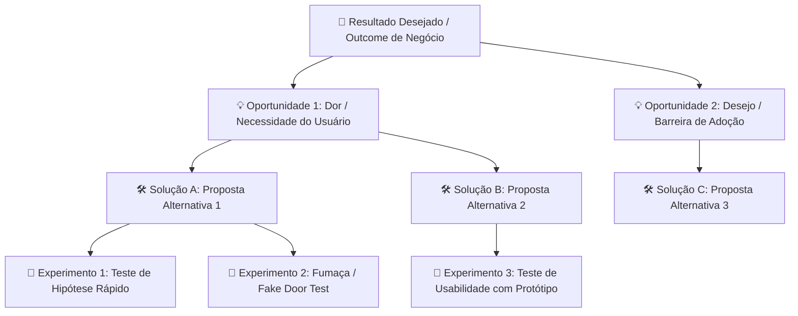
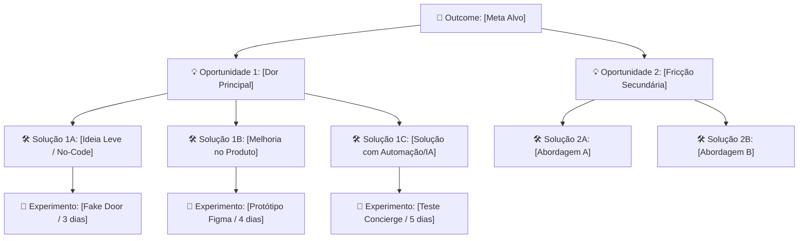

# Opportunity Solution Tree Orchestrator (`opportunity-tree`)

Esta skill orienta e constrói **Árvores de Oportunidade-Solução (Opportunity Solution Trees - OST)** com base no framework de Descoberta Contínua de **Teresa Torres** (_Continuous Discovery Habits_). Ela impede que equipes de tecnologia pulem diretamente de uma meta de negócio para a construção apressada de uma funcionalidade, forçando a exploração de múltiplas oportunidades e caminhos de teste.



---

## 🤝 Abordagem User-Friendly: Modos de Condução

Para tornar a experiência acolhedora e produtiva tanto para PMs experientes quanto para fundadores ou desenvolvedores que estão começando em Discovery, a skill adota **dois modos de atendimento**:

| Situação do Usuário | Modo Recomendado | Dinâmica de Resposta |
| :--- | :--- | :--- |
| **Ideia inicial ou vaga** (ex: _"Quero criar um dashboard financeiro"_) | 🌟 **Modo Co-Piloto Guiado** (Passo a Passo) | O agente faz 1 a 2 perguntas amigáveis por vez, oferecendo **opções pré-formatadas (A, B, C)** e sugestões para destravar o pensamento sem fricção. |
| **Contexto rico já fornecido** (ex: meta, métricas, dados de clientes e restrições) | ⚡ **Modo Expresso** (Árvore Direta) | Gera a árvore visual completa de imediato, a matriz de experimentos e adiciona 3 perguntas reflexivas para o refinamento do time. |

---

## 🧭 Roteiro Amigável de Perguntas por Fase (Co-Piloto de Discovery)

Quando o usuário estiver no **Modo Co-Piloto Guiado**, conduza o diálogo pelas 4 fases abaixo. **Nunca faça todas as perguntas de uma vez só**; agrupe no máximo 2 perguntas por resposta e ofereça opções sugeridas para que ele possa responder apenas com números ou letras se preferir.

---

### Fase 1: O Outcome de Negócio (Onde queremos chegar?)

> [!TIP]
> **Por que perguntamos isso?**
> Construir features sem uma meta clara de negócio gera esforço sem impacto. Precisamos saber qual ponteiro queremos mover antes de pensar no que programar.

#### Pergunta 1.1: Qual é o principal impacto que você deseja alcançar agora?

- `[A]` **Aquisição / Ativação:** Fazer novos usuários perceberem o valor no primeiro dia (Time-to-Value).
- `[B]` **Retenção / Engajamento:** Fazer clientes existentes voltarem com mais frequência ou continuarem pagando.
- `[C]` **Monetização / Expansão:** Aumentar ticket médio, conversão de checkout ou adesão a planos superiores.
- `[D]` **Eficiência / Redução de Churn:** Reduzir cancelamentos, custos operacionais ou volume de chamados de suporte.

#### Pergunta 1.2: Temos um número alvo ou prazo em mente?

- _Sugestão Rápida:_ "Aumentar de **X% para Y%** em **60 dias**" ou "Reduzir o tempo médio da tarefa de **A minutos para B minutos** neste trimestre".
- _Se o usuário não souber:_ Sugira um safe default (ex: _"Podemos assumir como meta inicial um ganho relativo de +20% na taxa de conversão nos próximos 90 dias?"_).

---

### Fase 2: As Dores e Necessidades Reais (O que trava o cliente?)

> [!NOTE]
> **Por que perguntamos isso?**
> A maioria das soluções falha porque resolve problemas que o cliente não tem ou não se importa. Aqui mapeamos dores sob o ponto de vista das pessoas, não da arquitetura.

#### Pergunta 2.1: O que os usuários dizem ou onde eles costumam desistir?

- _"Eles relatam que o fluxo é confuso?"_
- _"Têm medo de errar ou perder dados?"_
- _"Falta confiança ou transparência no valor/taxas?"_
- _Opção de ajuda rápida:_ O usuário pode pedir: _"Sugira 3 dores comuns para o meu segmento (ex: B2B SaaS / Fintech / E-commerce)"_.

#### Pergunta 2.2: Como o usuário resolve esse problema hoje (o contorno/workaround)?

- Usa planilhas Excel paralelas?
- Entra em contato com o suporte humano via WhatsApp/chat?
- Simplesmente desiste e fecha a aba?

---

### Fase 3: Ideação Divergente de Soluções (Evitando a solução única)

> [!IMPORTANT]
> **A Regra de Ouro de Teresa Torres:**
> Nunca compare uma solução contra "não fazer nada". Compare pelo menos **3 soluções diferentes para a mesma oportunidade**.

#### Pergunta 3.1: Quais caminhos diferentes podemos explorar para curar essa dor?

Estimule o time propondo 3 arquétipos de solução:

1. 💡 **Caminho Leve / Sem Código (Low-Tech):** Templates prontos, emails transacionais contextuais, onboarding humanizado ou mensagens no WhatsApp.
2. 🛠️ **Caminho de Produto / Interface:** Automações na UI, formulários simplificados, wizards guiados ou feedback visual instantâneo.
3. 🚀 **Caminho Inovador / Inteligente:** Preenchimento preditivo, IA contextual ou integrações nativas que eliminam passos manuais.

#### Pergunta 3.2: O time já tem uma ideia favorita?

- Pergunte abertamente: _"Existe alguma feature que vocês já estavam quase decididos a construir?"_. Se sim, coloque-a na árvore e crie 2 concorrentes viáveis para disputar com ela.

---

### Fase 4: Desconstrução de Incertezas & Experimentos (Validar antes de codar)

> [!CAUTION]
> **Por que testar antes de construir?**
> O código de produção é a forma mais cara de descobrir se uma ideia tem valor. Experimentos de 3 a 5 dias economizam semanas de engenharia.

#### Pergunta 4.1: Qual é a premissa mais arriscada dessa ideia?

- **Risco de Demanda:** Os clientes realmente querem isso ou apenas disseram que seria "legal ter"?
- **Risco de Usabilidade:** Eles conseguem usar sem ajuda externa?
- **Risco de Viabilidade Técnica:** Temos as APIs ou capacidade de entrega em tempo hábil?

#### Pergunta 4.2: Qual teste rápido podemos rodar em até 5 dias?

Apresente as opções amigáveis da tabela de experimentos:

| Tipo de Incerteza | Teste Recomendado | Tempo Médio | Exemplo Amigável |
| :--- | :--- | :---: | :--- |
| **Demanda / Interesse** | **Fake Door / Fumaça** | 2 a 4 dias | Um botão ou card "Novo Recurso" na tela que mede cliques e avisa: _"Estamos finalizando esta novidade! Deseja ser avisado?"_. |
| **Valor Real / Adoção** | **Concierge / Manual** | 3 a 7 dias | O time executa a tarefa manualmente pelos bastidores para 5 clientes selecionados antes de automatizar via software. |
| **Compreensão / UX** | **Protótipo Interativo** | 2 a 4 dias | Teste de 15 minutos com gravação de tela no Figma (Maze/UserTesting) pedindo para o usuário cumprir a tarefa. |
| **Viabilidade Técnica** | **Spike de Engenharia** | 2 a 3 dias | Script de teste isolado para checar latência de API externa ou viabilidade de banco de dados. |

---

## 🎨 Padrão de Apresentação da Árvore no Chat

Ao emitir o resultado consolidado da árvore, utilize o padrão visual enriquecido abaixo:

````markdown
# 🌳 Árvore de Oportunidade-Solução: [Nome do Produto / Desafio]

> [!NOTE]
> **🎯 Outcome de Negócio Primário:** [Meta mensurável com prazo, ex: Aumentar ativação D7 de 18% para 28% até fim do Q3]<br>
> **👥 Segmento Foco:** [Perfil do cliente alvo prioritário]<br>
> **🚦 Status do Discovery:** 🟢 Hipóteses Prontas para Teste

---

## 1. Mapeamento Visual da Árvore (Mermaid OST)



---

## 2. Matriz de Hipóteses & Experimentos Enxutos

| Oportunidade (Dor) | Solução Proposta | Premissa Mais Arriscada | Experimento Rápido (3-5 dias) | Critério de Sucesso (Go/No-go) |
| :--- | :--- | :--- | :--- | :--- |
| [Dor do usuário] | [Solução 1A] | [O que precisa ser verdade para a ideia não falhar] | [Fake door, Concierge, Protótipo] | [Ex.: Taxa de clique > 15% em 100 visitas] |
| [Dor do usuário] | [Solução 1B] | [Hipótese crítica de usabilidade ou valor] | [Teste de usabilidade não-moderado] | [Ex.: 4 de 5 usuários completam sem ajuda] |

> [!WARNING]
> **🚨 A Premissa Mais Perigosa:** [Destaque em uma frase qual é a hipótese que, se estiver errada, mata o projeto. É ela que deve ser testada primeiro].

---

## 💬 Perguntas Amigáveis para o Próximo Refinamento do Time

1. *Dentre os experimentos propostos, qual deles conseguimos colocar no ar já nesta semana com o menor esforço?*
2. *Alguma dessas soluções depende de fornecedores externos ou integrações arriscadas?*
3. *Se os dados do primeiro teste forem negativos, qual é a rota de aprendizado alternativa?*

---

## ⚡ Próximos Passos Sugeridos

- [ ] Escolher **1 único experimento** para rodar nos próximos 5 dias úteis.
- [ ] Quando os dados chegarem, usar a skill `/pm-prioritize` para priorizar as soluções validadas na esteira de desenvolvimento.
- [ ] Detalhar a solução vencedora no padrão BDD usando `/product-spec`.
````

---

## 🚫 Diretrizes Estritas & Anti-Padrões

> [!CAUTION]
> **Anti-Código Prematuro em Discovery:**
> - **NUNCA** gere código de backend, endpoints REST, schemas SQL ou controllers durante o uso desta skill. O papel do Discovery é evitar a construção do que não foi validado.
> - **Zero LaTeX:** Nunca utilize `$X$` ou sintaxe matemática LaTeX. Use texto e símbolos simples (`>=`, `<=`, `%`).
> - **Empatia e Linguagem Clara:** Evite jargões herméticos sem explicá-los. Sempre que usar termos como _Fake Door_, _Concierge_ ou _Spike_, inclua a explicação prática de 1 linha.
