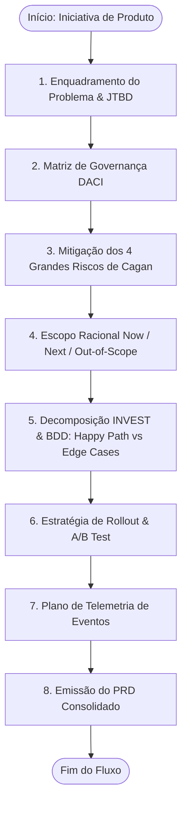

# Outcome-Driven PRD & User Story Creator (`product-spec`)

Esta skill orienta e gera **Especificações de Produto Canônicas (PRDs)** e **Histórias de Usuário BDD** focadas em _outcomes_ (resultados de negócio e valor para o cliente) em vez de simples _outputs_ (fábrica de features). Ela ancora-se nas metodologias de **Marty Cagan (Inspired/Empowered)**, na governança **DACI**, no padrão **INVEST** e na formulação de cenários de teste executáveis **BDD (Given/When/Then)**.



---

## As Fases de Elaboração da Especificação

### 1. Enquadramento do Problema & Job-to-be-Done (JTBD)

- **Declaração da Dor Real:**
  - _Quem_ sofre com o problema (Ator-alvo / Persona).
  - _Em que circunstância_ ela ocorre.
  - _Qual é a consequência negativa_ (custo, tempo, frustração).
- **Fórmula Canônica de JTBD:**
  > _"Quando [situação/contexto], Eu quero [motivação/ação], Para que [resultado esperado/valor gerado]."_

### 2. Governança DACI

Define com clareza a responsabilidade dos envolvidos para evitar atrasos em decisões:

- **Driver (D):** Quem conduz o projeto e orquestra a entrega (Geralmente o PM).
- **Approver (A):** Quem tem o poder final de veto ou aprovação (Liderança de Produto / Engenharia).
- **Contributors (C):** Especialistas consultados (Design, Tech Lead, Dados, Jurídico).
- **Informed (I):** Partes informadas sobre o progresso (Marketing, Suporte, Vendas).

### 3. Blindagem contra os 4 Grandes Riscos (Marty Cagan)

Toda especificação deve explicitar como cada risco foi previamente investigado:

1. **Risco de Valor (Value):** O cliente realmente usará/pagará por isso?
2. **Risco de Usabilidade (Usability):** O usuário consegue navegar sem atrito?
3. **Risco de Factibilidade (Feasibility):** Conseguimos construir com a stack e SLAs atuais?
4. **Risco de Viabilidade (Business Viability):** Viola compliance, LGPD ou regras de faturamento?

### 4. Critérios BDD: Happy Path vs Edge Cases (Resiliência)

Histórias de usuário devem atender ao critério **INVEST** e conter cenários tanto para o fluxo ideal quanto para estados defensivos:

- **Caminho Feliz (Happy Path):** Conclusão bem-sucedida da intenção do usuário.
- **Cenários de Borda / Erro Defensivo (Edge Cases):**
  - Falha de conexão ou timeout de API de terceiros.
  - Submissão de dados duplicados / duplo clique (idempotência).
  - Sessão expirada no meio do fluxo transacional.
  - Permissão de perfil insuficiente (RBAC).

### 5. Estratégia de Lançamento & Rollout Gradual

Para mitigar impacto em produção, especifique:

- **Feature Flag:** Chave de configuração (ex.: `enable_bulk_export_v2`).
- **Fases de Rollout:**
  - Fase 1: Funcionários internos / Dogfooding (100% interno).
  - Fase 2: Beta fechado com clientes selecionados (5% a 10% do tráfego).
  - Fase 3: Disponibilidade geral (General Availability - 100%).

---

## 🎨 Padrão de Apresentação e Saída no Chat

Ao acionar `/product-spec`, a skill gera um documento pronto para aprovação técnica e de negócio:

````markdown
# 📋 Product Requirements Document: [Nome da Funcionalidade]

> [!NOTE]
> **Status:** 🟡 Em Revisão Técnica
> **Driver (PM):** [Nome] | **Approver:** [Nome/Papel]
> **Target Release:** [Sprint / Versão / Trimestre]

---

## 1. Problema & Job-to-be-Done (JTBD)

- **Problema:** [Descrição concisa da dor validada com dados/entrevistas]
- **JTBD:** _Quando [contexto], Eu quero [ação], Para que [benefício mensurável]._

---

## 2. Metas de Sucesso & Métricas de Guarda

- 🎯 **Métrica Primária (Outcome):** [Ex.: Reduzir tempo de faturamento de 40 para 10 min]
- 📈 **Métrica Secundária:** [Ex.: Taxa de adesão da funcionalidade > 60% em D30]
- 🛡️ **Métrica de Guarda (Guardrail):** [Ex.: Taxa de erros 5xx na API < 0.1% e latência p95 < 400ms]

---

## 3. Matriz de Mitigação de Riscos (Marty Cagan)

| Risco             | Nível de Incerteza | Ação de Mitigação Realizada / Prevista                                        |
| :---------------- | :----------------: | :---------------------------------------------------------------------------- |
| **Valor**         |      🟢 Baixo      | Validado em 8 entrevistas com clientes piloto; 7 confirmaram alta prioridade. |
| **Usabilidade**   |      🟡 Médio      | Protótipo interativo no Figma testado com taxa de conclusão de 88%.           |
| **Factibilidade** |      🟢 Baixo      | Tech Lead validou viabilidade das queries e tempo de resposta assíncrono.     |
| **Viabilidade**   |      🟢 Baixo      | Revisado por Compliance; retenção de dados configurada em 90 dias (LGPD).     |

---

## 4. Escopo & Fronteiras

### 🟢 No Escopo (Now - MVP)

- [ ] [Requisito funcional obrigatório 1]
- [ ] [Requisito funcional obrigatório 2]

### 🔴 Fora do Escopo (Out of Scope)

- ❌ [O que deliberadamente NÃO será construído nesta release para manter o foco]

---

## 5. Histórias de Usuário & Cenários BDD (Given/When/Then)

### História 1: [Título da História INVEST]

**Como** [tipo de usuário],
**Quero** [realizar uma ação],
**Para que** [obter um resultado de valor].

#### Cenário A (Happy Path): Sucesso na operação

```gherkin
Dado que o usuário está autenticado com papel de "Financeiro"
E possui pelo menos 1 relatório gerado no mês
Quando clica em "Exportar Relatório Consolidado" e confirma o período
Então o sistema inicia o download do arquivo nos formatos selecionados
E emite o evento de tracking "report_exported" com sucesso
```

#### Cenário B (Edge Case): Falha de timeout ou serviço indisponível

```gherkin
Dado que o serviço de geração assíncrona está instável ou demorando mais de 10s
Quando o usuário solicita a exportação
Então o sistema não bloqueia a tela do usuário
E informa que o relatório será enviado por email assim que o processamento terminar
E registra o evento defensivo com o payload de latência
```

#### Cenário C (Recuperação): Devolução para correção sem perda de dados

```gherkin
Dado que o gestor ou auditor fiscal recusa um item por comprovante ilegível
Quando registra a recusa com justificativa obrigatória
Então o status do relatório transiciona para "DEVOLVIDO_PARA_AJUSTE"
E o colaborador é notificado com o link para substituir apenas a foto contestada
E os itens já aprovados são preservados sem re-digitação
```

---

## 6. Estratégia de Rollout & Telemetria

- **Feature Flag:** `feat_[nome_da_feature]_rollout`
- **Etapas de Rollout:** 10% (Canary) ➔ 50% ➔ 100%
- **Eventos Obrigatórios:**
  - `[feature]_started`: Início do fluxo.
  - `[feature]_completed`: Conclusão com sucesso do valor central.
  - `[feature]_failed`: Falhas com mensagem de erro amigável.

---

## ⚡ Próximos Passos Sugeridos

- [ ] Apresentar cenários BDD ao Tech Lead para refinamento de estimativas.
- [ ] Criar o plano completo de telemetria usando `/product-metrics`.
````

---

## 🚫 Diretrizes Estritas de Apresentação

> [!CAUTION]
> **Zero Arte ASCII Frágil:** Nunca tente desenhar caixas de texto com caracteres Unicode (`┌───┐`, `│`). Use listas markdown com badges (`* 🟢 **NOW (MVP 1.0):** ...`) ou diagramas Mermaid nativos.
> **Zero LaTeX:** Nunca utilize sintaxe LaTeX (`$...$`). Utilize sempre símbolos e operadores diretos (`>=`, `<=`, `%`).
