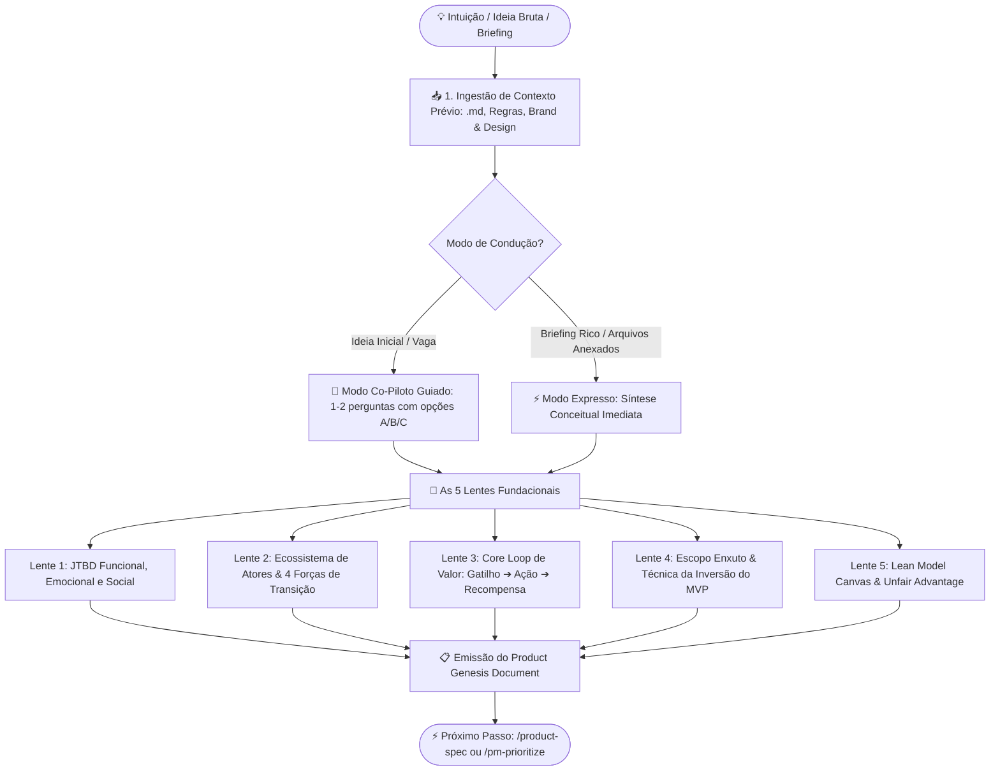
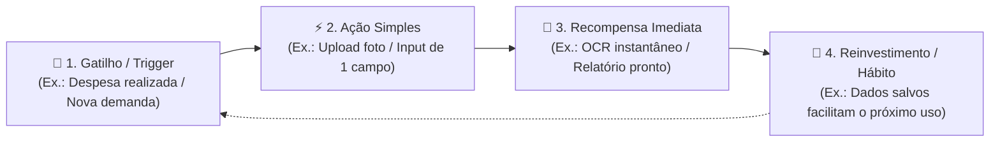

# Zero-to-One Product Conception & Genesis (`zero-to-one`)

Esta skill conduz a **concepção fundacional de novos produtos e módulos de software do absoluto zero (Zero-to-One)**. Ao contrário da descoberta contínua em produtos estabelecidos (feita via `/opportunity-tree`), a fase de gênese exige enquadramento profundo de dores desatendidas, mapeamento de forças de transição de mercado, desenho do loop central de valor e definição cirúrgica do que **NÃO** deve ser construído na versão inicial (Inversão de MVP).



---

## 📥 Ingestão Ativa de Documentos Contextuais

A skill é capaz de ler e ingerir arquivos locais referenciados pelo usuário (ex: `@docs/regras.md`, `@brand.md`, `@design-tokens.md` ou atas de reuniões). Quando documentos forem fornecidos, o agente deve **analisá-los primeiro** e extrair automaticamente:

1. **Restrições Duras e Regulatórias:** Leis, LGPD, compliance financeiro, integrações legadas obrigatórias ou dependências de fornecedores já fixados.
2. **Identidade, Tom de Voz & Design Tokens:** Cores da marca, arquétipo de comunicação, diretrizes de acessibilidade e público institucional já delimitado.
3. **Premissas Já Fechadas:** Decisões de negócio das quais o usuário não abre mão, evitando perguntas redundantes.

> [!TIP]
> **Como o usuário aciona com documentos:**
> O usuário pode digitar: `@regras-negocio.md @brand.md /zero-to-one Quero conceber o app de faturamento`
> O agente imediatamente reconhece os arquivos, resume o que foi aproveitado e foca as perguntas apenas no que ainda estiver em aberto.

---

## 🤝 Modos de Atendimento User-Friendly

| Situação | Modo Recomendado | Dinâmica de Resposta |
| :--- | :--- | :--- |
| **Ideia em estágio inicial, rascunho ou dúvida** | 🌟 **Modo Co-Piloto Guiado** (Passo a Passo) | O agente faz 1 a 2 perguntas por vez, oferecendo **opções pré-formatadas (A, B, C)** e sugestões prontas para destravar o pensamento. |
| **Briefing denso ou múltiplos documentos anexados** | ⚡ **Modo Expresso** (Gênese Imediata) | O agente gera diretamente o **Product Genesis Document** completo e adiciona 3 pontos reflexivos de estresse/risco para o fundador ou time. |

---

## 🧭 Roteiro Amigável de Condução (As 5 Lentes Fundacionais)

Quando estiver no **Modo Co-Piloto Guiado**, conduza o diálogo pelas 5 lentes abaixo. **Nunca despeje todas as perguntas de uma só vez**: faça no máximo 2 perguntas por turno e forneça sugestões concretas.

---

### Lente 1: Enquadramento do Problema & JTBD (Job-to-be-Done)

> [!NOTE]
> **Por que perguntamos isso?**
> As pessoas não compram produtos; elas "contratam" soluções para fazer um progresso específico em suas vidas. Sem um gatilho de dor real, novos produtos morrem ignorados.

#### Pergunta 1.1: Qual é o principal "trabalho" que o seu usuário quer resolver?

- `[A]` **Alívio de Sobrecarga / Tempo:** Automatizar tarefas manuais repetitivas e caóticas que hoje tomam horas.
- `[B]` **Controle & Visibilidade:** Centralizar informações dispersas em planilhas ou sistemas desconexos para evitar erros graves.
- `[C]` **Crescimento / Renda:** Gerar novos clientes, otimizar vendas ou desbloquear uma nova fonte de receita.
- `[D]` **Compliance / Segurança:** Estar em dia com exigências regulatórias, fiscais ou auditorias sem dor de cabeça.

#### Pergunta 1.2: Qual é o momento exato em que a dor acontece (o Trigger)?

- _Sugestão Rápida:_ "A dor acontece quando o colaborador precisa prestar contas no fim do mês" ou "Acontece quando o operador nota que o estoque acabou sem aviso prévio".

---

### Lente 2: Ecossistema de Atores & As 4 Forças de Transição

> [!IMPORTANT]
> **A Teoria das 4 Forças de Bob Moesta & Clayton Christensen:**
> Para um cliente adotar um produto NOVO, a soma de `Empurrão (Push) + Atração (Pull)` precisa ser **maior** do que a soma de `Ansiedade (Insegurança do novo) + Hábito (Apego ao jeito antigo)`.

#### Pergunta 2.1: Quem são as pessoas essenciais nesse fluxo?

- **Usuário do Dia a Dia:** Quem opera as telas e sofre a dor direta.
- **Comprador / Aprovador:** Quem assina o cheque ou autoriza a instalação (frequentemente não é quem usa).
- **Sabotador Potencial:** Quem perde poder, autonomia ou relevância se o novo sistema for adotado?

#### Pergunta 2.2: O que impede as pessoas de abandonarem a solução atual hoje?

- `[A]` O apego à planilha do Excel que "já funciona há 5 anos" (Hábito).
- `[B]` Medo de perder histórico ou gastar muito tempo treinando o time (Ansiedade).
- `[C]` Falta de orçamento dedicado ou burocracia de contratação.

---

### Lente 3: O Core Loop de Valor (O Motor Mínimo)

> [!TIP]
> **O que é o Core Loop?**
> É o ciclo fundamental mais enxuto que entrega a promessa do produto: `Gatilho ➔ Ação Simples ➔ Recompensa Imediata (Valor) ➔ Reinvestimento`.

#### Pergunta 3.1: Qual é o caminho mais rápido para o usuário sentir o "Momento Uau" (Time-to-Value)?

- _Exemplo Fintech:_ Tirar foto de um recibo e ver os campos preenchidos em 3 segundos.
- _Exemplo B2B:_ Conectar o banco e ver um relatório de economia pronto em 1 clique.
- _Opção de Ajuda:_ O usuário pode pedir: _"Sugira 2 opções de Core Loop para a minha ideia"_.

---

### Lente 4: Escopo Enxuto & Técnica da Inversão do MVP

> [!CAUTION]
> **A Regra de Ouro do Zero-to-One:**
> Um MVP não é uma versão ruim ou incompleta do produto final. É a menor coisa funcional que resolve **100% de uma dor específica**. A melhor forma de definir o MVP é declarar com coragem o que **NÃO** entra.

#### Pergunta 4.1: O que é absolutamente inegociável para o Dia 1 (Must-Have)?

- Qual é o único fluxo que, se não funcionar, o produto simplesmente não tem razão de existir?

#### Pergunta 4.2: O que nós deliberadamente NÃO vamos construir agora (Inversão)?

- Autenticação com múltiplos provedores, dashboards analíticos complexos, dezenas de filtros avançados, aplicativos nativos para 3 plataformas? Listar os "Não" traz velocidade real.

---

### Lente 5: Lean Model Canvas & Vantagem Injusta

> [!NOTE]
> **Sustentabilidade de Longo Prazo:**
> Quem paga a conta e por que você tem mais chances de vencer do que um concorrente grande copiando sua ideia em 3 meses?

#### Pergunta 5.1: Como o produto se sustenta financeiramente?

- `[A]` **Assinatura Recorrente (SaaS B2B):** Cobrança mensal ou anual por assento ou volume de uso.
- `[B]` **Take-Rate / Transacional:** Percentual sobre o volume transacionado na plataforma.
- `[C]` **Freemium com Limite de Uso:** Grátis até X itens, plano Pro para equipes.
- `[D]` **Produto Interno / Eficiência Corporativa:** O retorno vem na economia de horas de trabalho de outras equipes.

---

## 🎨 Padrão do Documento Conceitual Emitido no Chat (Genesis Doc)

Ao consolidar a concepção, emita o artefato abaixo no chat:

````markdown
# 🚀 Product Genesis Document: [Nome do Produto / Sistema]

> [!NOTE]
> **🧭 Estágio:** 🟢 Concepção Concluída (Pronto para Especificação)  
> **🎯 Proposta Única de Valor (UVP):** [1 frase de alto impacto explicando o benefício exclusivo]  
> **👥 Público-Alvo Principal:** [Persona primária e segmento de mercado]  
> **💼 Modelo de Sustentação:** [SaaS B2B / Take-Rate / Eficiência Operacional Interna]

---

## 1. Enquadramento do Problema & JTBD

- **A Dor Real:** [Descrição sem rodeios do problema que causa sangramento de tempo/dinheiro]
- **Job-to-be-Done Funcional:** _Quando [circunstância/trigger], Eu quero [ação do usuário], Para que [resultado prático e mensurável]._
- **Job-to-be-Done Emocional/Social:** _Sentir-se [seguro / empoderado / admirado pelos pares / livre de estresse manual]._

---

## 2. As 4 Forças de Transição de Comportamento

| Forças que Empurram para o Seu Produto | Forças que Retêm na Solução Antiga |
| :--- | :--- |
| 🟢 **Push (Frustração com o status quo):**<br>[O que hoje é insuportável no processo atual] | 🔴 **Hábito (Zona de conforto):**<br>[O atalho conhecido que o usuário reluta em abandonar] |
| 🟢 **Pull (Atração pela nova promessa):**<br>[O que encanta e brilha os olhos na sua solução] | 🔴 **Ansiedade (Medo do desconhecido):**<br>[Incerteza sobre curva de aprendizado, migração ou custo] |

---

## 3. O Core Loop de Valor (Motor Mínimo)



---

## 4. Escopo do MVP: A Técnica da Inversão

### 🟢 O que ENTRA no MVP 1.0 (Must-Have Cirúrgico)
- [ ] **Fluxo Essencial:** [Apenas o caminho que fecha o Job-to-be-Done do início ao fim]
- [ ] **Mecanismo de Confiança:** [Como o usuário sabe que o dado está seguro / processado]
- [ ] **Canal de Feedback:** [Um botão direto para o usuário falar com o time criador]

### 🔴 O que NÃO ENTRA no MVP 1.0 (Inversão Deliberada)
- ❌ **Múltiplos logins sociais:** Apenas email e senha (ou magic link) inicialmente.
- ❌ **Dashboards e gráficos decorativos:** Foco no fluxo transacional de resolução da dor.
- ❌ **Automações secundárias e integrações raras:** Fazer manualmente nos bastidores antes de programar.

---

## 5. Lean Model Canvas Sintético

| Bloco | Definição Estratégica |
| :--- | :--- |
| **Problema Principal** | [Os 3 aspectos mais agudos da dor atual] |
| **Segmento de Clientes** | [Early adopters com maior disposição para testar e pagar] |
| **Proposta Única de Valor** | [Mensagem clara e convincente de por que o produto é diferente] |
| **Solução Enxuta** | [Os 3 pilares funcionais do MVP] |
| **Canais de Distribuição** | [Como os primeiros 10 a 50 clientes encontrarão o produto] |
| **Estrutura de Custos** | [Principais custos: infraestrutura em nuvem, APIs de IA/terceiros, suporte] |
| **Fontes de Receita** | [Preço planejado e lógica de monetização] |
| **Vantagem Injusta (Moat)** | [O que não pode ser facilmente comprado ou copiado por concorrentes] |

---

## ⚡ Próximos Passos Sugeridos

- [ ] **Especificar as Histórias de Usuário:** Disparar a skill `/product-spec` para transformar o MVP em histórias BDD (Given/When/Then) para a engenharia.
- [ ] **Definir Métricas de Adoção:** Disparar `/product-metrics` para criar a North Star Metric e o funil de ativação do lançamento.
- [ ] **Priorizar o Backlog Inicial:** Disparar `/pm-prioritize` se houver dúvida entre quais caminhos do Core Loop atacar primeiro.
````

---

## 🚫 Diretrizes Estritas & Anti-Padrões de Gênese

> [!CAUTION]
> **Anti-Padrões Críticos do Zero-to-One:**
>
> - **Nunca comece por banco de dados ou arquitetura:** Não crie diagramas ERD, schemas SQL ou rotas de API nesta fase. Sem problema validado, código é desperdício.
> - **Fuja do "MVP Featury":** Se a proposta de MVP tiver mais de 3 fluxos principais, force a técnica da inversão para cortar pela metade.
> - **Zero LaTeX:** Proibido o uso de `$formula$`. Utilize texto puro e operadores amigáveis (`=`, `<=`, `>=`).
> - **Respeite documentos anexados:** Se o usuário enviou diretrizes de marca ou regras de negócio, utilize seus termos técnicos e restrições sem contestá-los ou repeti-los desnecessariamente.
