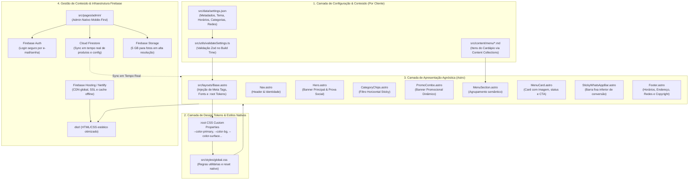
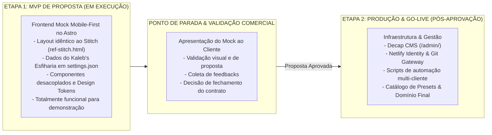

# Plano Geral de Implementação (Master Plan) — Cardápio Digital

> **Template de Cardápio Digital Jamstack Reutilizável (Astro + Decap CMS)**  
> **Caso de Referência Inaugural:** Kaleb's Esfiharia (`@kalebs_esfiharia`)  
> **Documentos de Referência Integrados:** [PRD.md](file:///Users/matheus.diniz_1/Documents/GitHub/menuDigital/docs/PRD.md) · [esqueleto.md](file:///Users/matheus.diniz_1/Documents/GitHub/menuDigital/docs/esqueleto.md) · [readme.md](file:///Users/matheus.diniz_1/Documents/GitHub/menuDigital/docs/readme.md) · [ADR 0001](file:///Users/matheus.diniz_1/Documents/GitHub/menuDigital/docs/adr/0001-template-reutilizavel-design-tokens-astro-decap.md) · [ref-stitch.html](file:///Users/matheus.diniz_1/Documents/GitHub/menuDigital/docs/ref-stitch.html)

---

## 1. Visão Geral & Alinhamento Estratégico

### 1.1 Objetivo do Produto
Construir e disponibilizar um **template de cardápio digital estático (SSG), mobile-first, ultra-performático e 100% gerenciável** pelo próprio estabelecimento através do **Decap CMS**. 
O sistema opera sem servidor dedicado e sem banco de dados tradicional (arquitetura Jamstack com hospedagem estática na Netlify e autenticação via Netlify Identity).

### 1.2 O Desafio de Dupla Finalidade
1. **Caso de Referência Específico:** Instanciar o cardápio de alta fidelidade para o **Kaleb's Esfiharia** (`@kalebs_esfiharia`), incorporando o design system artesanal "Artisanal Ember" (tons de brasa/forno a lenha, prova social, combos em destaque e fluxo de pedido via WhatsApp).
2. **Reutilização Universal Multi-Cliente:** O código-fonte dos componentes Astro e folhas de estilo deve ser **100% agnóstico de marca**. Novos clientes (hamburguerias, pizzarias, confeitarias, sushi bars) devem ser ativados em **menos de 10 minutos**, alterando apenas o arquivo `src/data/settings.json` e as coleções em `src/content/menu/*.md`.

### 1.3 Metas de Engenharia & Métricas de Sucesso
- **Core Web Vitals:** LCP < 1,2s (sob conexão móvel 4G), CLS = 0, INP < 100ms.
- **Google Lighthouse:** Score ≥ 95 em Performance, Acessibilidade, Melhores Práticas e SEO.
- **Custo Operacional:** R$ 0,00/mês de infraestrutura fixa por cliente (Netlify Free Tier com CDN global e SSL automático).
- **Acessibilidade:** Conformidade estrita com as diretrizes **WCAG 2.2 AA**.

---

## 2. Arquitetura do Sistema & Decisões Canônicas (ADR 0001)

O projeto é estruturado em quatro camadas estritamente desacopladas para evitar qualquer acoplamento de marca (*Brand Lock-in*):



### Contrato de Design Tokens (`:root`)
Os componentes visuais consomem variáveis semânticas que recebem os valores do `settings.json`:
- `--color-primary`: Ação primária, botões de pedido e bordas ativas.
- `--color-secondary`: Acentos secundários, estrelas de avaliação e badges promocionais.
- `--color-bg`: Fundo da página (dark mode imersivo ou light mode editorial).
- `--color-surface`: Superfície de contêineres e barras de navegação.
- `--color-surface-card`: Superfície dos cards de produto com contraste calibrado.
- `--color-text`: Texto principal de leitura (títulos e nomes).
- `--color-text-muted`: Texto secundário (descrições, horários e ingredientes).
- `--color-whatsapp`: Verde oficial de alta conversão do WhatsApp (`#25D366` / `#00A74C`).

---

## 3. Matriz de Auditoria, Melhorias & Otimizações

Abaixo estão consolidadas as 44 melhorias identificadas na auditoria pré-construção, integradas ao plano com suas respectivas ações corretivas:

### 3.1 Segurança (Security by Design)

| ID | Diagnóstico | Ação Mitigadora no Plano |
| :--- | :--- | :--- |
| **SEC-01** | `netlify-identity-widget.js` carregado no site público | **Remover do `Base.astro`**. Isolar o script de autenticação exclusivamente em `public/admin/index.html`. |
| **SEC-02** | `settings.json` sem tipagem estrita de entrada | Criar `src/utils/validateSettings.ts` com **Zod**, validando tipos, URLs, cores hexadecimais e prevenindo injeções de script no build. |
| **SEC-03** | Decap CMS via CDN sem integridade de pacote | Adicionar **Subresource Integrity (SRI) hash** na tag `<script>` do Decap CMS em `public/admin/index.html`. |
| **SEC-04** | Ausência de Content Security Policy (CSP) | Criar `netlify.toml` com política CSP estrita restringindo execução de scripts e origens de fontes/imagens. |
| **SEC-05** | Formatação do número de WhatsApp | Função utilitária `formatWhatsAppUrl(phone, msg)` sanitizando caracteres não numéricos antes de gerar o link `wa.me`. |
| **SEC-06** | Cabeçalhos HTTP de segurança ausentes | Implementar em `netlify.toml`: `X-Frame-Options: DENY`, `X-Content-Type-Options: nosniff`, `Referrer-Policy: strict-origin-when-cross-origin` e `Strict-Transport-Security (HSTS)`. |

### 3.2 Performance & Core Web Vitals

| ID | Diagnóstico | Ação Mitigadora no Plano |
| :--- | :--- | :--- |
| **PERF-01** | Bloqueio de renderização por fontes externas | Injetar `<link rel="preconnect">` para `fonts.googleapis.com` e `fonts.gstatic.com` com preload de estilo em `Base.astro`. |
| **PERF-02** | Otimização de imagens do cardápio | Utilizar `<Image>` nativo do Astro para imagens estáticas do template e implementar `loading="lazy"` + `decoding="async"` + dimensões explícitas (`width`/`height`) para uploads do CMS. |
| **PERF-03** | Overhead de JS na página pública | Com a remoção do script do Netlify Identity, a página pública passa a ter **0KB de JavaScript bloqueante**, entregando renderização estática instantânea. |
| **PERF-04** | LCP atrasado na Hero Image | Aplicar `fetchpriority="high"` e `loading="eager"` na imagem de destaque do Hero. |
| **PERF-05** | Lazy load indevido acima da dobra | O primeiro lote de cards (ou combo em destaque) carrega com prioridade padrão; apenas seções subsequentes usam `loading="lazy"`. |
| **PERF-06** | Minificação de saída | Configurar `compressHTML: true` no `astro.config.mjs`. |

### 3.3 Design System & Experiência Mobile-First

| ID | Diagnóstico | Ação Mitigadora no Plano |
| :--- | :--- | :--- |
| **DES-01** | Header textual simplificado | `Nav.astro` com suporte híbrido: exibe logo em imagem quando configurada, com fallback elegante para tipografia semântica. |
| **DES-02** | Navegação por categorias custosa | Criar `CategoryChips.astro`: barra deslizante horizontal (*scroll snap*) fixa no topo com destaque visual para a categoria ativa. |
| **DES-03** | Falta de destaque para combos e ofertas | Criar `PromoCombo.astro`: banner de alta conversão renderizado condicionalmente a partir de `settings.combo_destaque.ativo`. |
| **DES-04** | Imagens dos cards reduzidas (80x80px) | Aumentar área visual para proporção equilibrada (96x96px ou 112x112px em telas maiores), com acabamento arredondado e visual gastronômico atraente. |
| **DES-05** | Botão flutuante cobrindo conteúdo | Adicionar compensação de margem (`padding-bottom: 5rem`) no contêiner principal para garantir que os últimos itens permaneçam 100% visíveis. |
| **DES-06** | Micro-interações e feedback | Efeitos suaves de elevação ao toque/hover nos cards (`transform: translateY(-2px)`), transições de borda e feedback ao clicar em pedir. |

### 3.4 Resiliência & Acessibilidade (WCAG 2.2 AA)

| ID | Diagnóstico | Ação Mitigadora no Plano |
| :--- | :--- | :--- |
| **RES-01** | Imagens ausentes ou corrompidas | Implementar fallback SVG padronizado caso uma imagem de upload falhe ou não seja fornecida. |
| **RES-02** | Inconsistência de categorias | Script de validação que alerta em tempo de build se houver discrepância entre `settings.categorias` e as opções do `config.yml`. |
| **RES-03** | Tratamento de horários nulos | Renderização defensiva no rodapé evitando erros de renderização caso `horarios` seja vazio ou nulo. |
| **A11Y-01** | Acessibilidade nos botões de ação | `aria-label` descritivo incluindo o nome do estabelecimento nos botões de WhatsApp. |
| **A11Y-02** | Semântica de estrelas e badges | Badges de destaque recebem `role="img"` e texto acessível (`aria-label="Item em destaque"`). |
| **A11Y-03** | Landmarks de navegação | Seções de categoria estruturadas com `<section aria-labelledby="...">` e cabeçalhos ordenados (`<h1>` a `<h3>`). |
| **A11Y-04** | Contraste de cores calibrado | Presets de temas validados garantindo taxa de contraste mínima de 4.5:1 para leitura e 3:1 para elementos de interface. |

### 3.5 Reutilização Multi-Cliente

| ID | Diagnóstico | Ação Mitigadora no Plano |
| :--- | :--- | :--- |
| **REUSE-01** | Catálogo de Temas Prontos | Criar pasta `docs/presets/` com 4 temas canônicos documentados: `dark-brasa.json`, `light-editorial.json`, `neon-sushi.json` e `pastel-confeitaria.json`. |
| **REUSE-02** | Automação de Onboarding | Desenvolver script `scripts/setup-client.sh` para criação de nova instância a partir de preset com poucos comandos. |
| **REUSE-03** | Versionamento do Schema | Inclusão do metadado `"schema_version": "1.0.0"` no `settings.json` para suportar migrações estruturais futuras. |

---

## 4. Estrutura Canônica de Diretórios do Projeto

```text
menuDigital/
├── .agents/                      # Regras de engenharia e IA
│   └── rules/core.md             # Regras compartilhadas do repositório
├── astro.config.mjs              # Configuração Astro (sitemap, compressão)
├── netlify.toml                  # Headers de segurança (CSP, HSTS, cache)
├── package.json                  # Dependências e scripts
├── tsconfig.json                 # Configuração TypeScript rigorosa
├── scripts/
│   ├── setup-client.sh           # Automação de setup de novos clientes
│   └── validate-categories.mjs   # Validador de consistência CMS ↔ Settings
├── docs/
│   ├── PRD.md                    # Product Requirements Document
│   ├── PLAN.md                   # Este plano mestre consolidado
│   ├── esqueleto.md              # Especificação técnica original
│   ├── readme.md                 # Guia de implantação e handoff
│   ├── ref-stitch.html           # Protótipo de alta fidelidade de referência
│   ├── adr/
│   │   ├── README.md             # Índice do repositório de ADRs
│   │   └── 0001-template-reutilizavel-design-tokens-astro-decap.md
│   └── presets/                  # Presets de temas prontos para reuso
│       ├── dark-brasa.json       # Esfiharia / Hamburgueria / Churrasco
│       ├── light-editorial.json  # Café / Bistrô / Confeitaria clássica
│       ├── neon-sushi.json       # Restaurante Japonês / Contemporâneo
│       └── pastel-doceria.json   # Sorveteria / Doceria gourmet
├── public/
│   ├── favicon.svg               # Ícone do site
│   ├── admin/                    # Ponto de entrada do Decap CMS
│   │   ├── index.html            # UI do CMS com Netlify Identity Widget + SRI
│   │   └── config.yml            # Definição das coleções e campos editáveis
│   └── uploads/                  # Imagens institucionais e do cardápio
│       ├── logo.svg
│       ├── hero.jpg
│       └── ...
└── src/
    ├── content/
    │   ├── config.ts             # Schema das Content Collections (Zod)
    │   └── menu/                 # Itens individuais do cardápio em Markdown
    │       ├── esfiha-carne.md
    │       ├── esfiha-queijo.md
    │       ├── combo-familia.md
    │       └── ...
    ├── data/
    │   └── settings.json         # Fonte única da verdade (identidade e tema)
    ├── layouts/
    │   └── Base.astro            # Template HTML base, meta tags e CSS tokens
    ├── components/
    │   ├── Nav.astro             # Barra de navegação e identidade da marca
    │   ├── Hero.astro            # Apresentação do local, selo e prova social
    │   ├── CategoryChips.astro   # Navegação horizontal por categorias (sticky)
    │   ├── PromoCombo.astro      # Banner promocional do combo em destaque
    │   ├── MenuSection.astro     # Seção de categoria com grid semântico
    │   ├── MenuCard.astro        # Card gastronômico do produto com foto e preço
    │   ├── StickyWhatsAppBar.astro # Barra flutuante de checkout e WhatsApp
    │   └── Footer.astro          # Informações, horários, endereço e créditos
    ├── styles/
    │   └── global.css            # Folha de estilo agnóstica com variáveis nativas
    ├── utils/
    │   ├── validateSettings.ts   # Validador Zod do settings.json no build
    │   └── whatsapp.ts           # Formatador seguro de URLs wa.me
    └── pages/
        └── index.astro           # Página inicial do cardápio (One-page SSG)
```

---

## 5. Estratégia de Entrega: MVP de Proposta & Checkpoint

Conforme alinhamento estratégico, a execução é dividida em **duas grandes etapas**:



> [!IMPORTANT]
> **Ponto de Parada Estrito:** Ao concluir a **Etapa 1 (MVP de Proposta)**, o desenvolvimento será pausado para que o protótipo navegável seja apresentado na reunião comercial. Somente após a validação e continuidade confirmada pelo cliente, iniciaremos a **Etapa 2**.

---

## 6. Roadmap de Implementação em Fases

### ETAPA 1: MVP DE PROPOSTA COMERCIAL (FRONTEND ONLY)

#### Fase 1: Fundação & Setup Astro
1. Inicializar estrutura do Astro (`package.json`, `astro.config.mjs`, `tsconfig.json`).
2. Configurar estrutura de pastas: `src/layouts/`, `src/components/`, `src/styles/`, `src/data/`, `src/content/`.

#### Fase 2: Dados Mockados & Design Tokens
1. Criar `src/data/settings.json` com os dados completos do **Kaleb's Esfiharia** (`@kalebs_esfiharia`).
2. Criar `src/content/config.ts` (Zod) e arquivos Markdown em `src/content/menu/` (Salgadas, Doces, Bebidas, Combos).
3. Criar `src/styles/global.css` com Design Tokens nativos (`:root`) e reset responsivo.

#### Fase 3: Componentes Visuais & Página Principal (Mobile-First)
1. `src/layouts/Base.astro`: Layout base com injeção dos tokens e Google Fonts (`Plus Jakarta Sans`).
2. `src/components/Nav.astro`: Header com logo/nome e status "ABERTO AGORA".
3. `src/components/Hero.astro`: Banner hero gastronômico, prova social (4.9 ⭐, +500 pedidos).
4. `src/components/CategoryChips.astro`: Barra horizontal de categorias deslizante (*sticky scroll-snap*).
5. `src/components/PromoCombo.astro`: Banner promocional do Combo Kaleb's Família com preço e economia.
6. `src/components/MenuCard.astro`: Card gastronômico com foto, preço, tag ⭐ e CTA WhatsApp.
7. `src/components/MenuSection.astro`: Grid semântico por categoria.
8. `src/components/StickyWhatsAppBar.astro`: Barra flutuante inferior para conversão.
9. `src/components/Footer.astro`: Horários, endereço e redes sociais.
10. `src/pages/index.astro`: Montagem da página completa.

---

🛑 **CHECKPOINT DE APRESENTAÇÃO COMERCIAL (PARADA OBRIGATÓRIA)**
- Validação do protótipo no navegador e em dispositivo móvel (`npm run dev`).
- Apresentação ao cliente para fechamento da proposta.

---

### ETAPA 2: PRODUÇÃO, GESTÃO & ESCALA (PÓS-APROVAÇÃO)

#### Fase 4: Decap CMS & Autenticação
1. Configuração de `public/admin/index.html` (com SRI) e `public/admin/config.yml`.
2. Integração com Netlify Identity e Git Gateway.

#### Fase 5: Segurança Avançada & Netlify
1. Configuração de `netlify.toml` com CSP estrita, HSTS e headers de segurança.
2. Script de validação Zod no build (`validateSettings.ts`).

#### Fase 6: Reutilização Multi-Cliente & Handoff
1. Criação do catálogo em `docs/presets/` (Dark Brasa, Light Editorial, Sushi, Doceria).
2. Script `scripts/setup-client.sh`.
3. Execução do Checklist de Handoff e Go-Live.

---

## 7. Checklist de Handoff & Entrega por Cliente

---

### Fase 3: Design System Agnóstico & Layout Base
**Objetivo:** Estruturar o sistema de design tokens nativo via CSS Custom Properties sem frameworks pesados.
1. Criar `src/styles/global.css`:
   - CSS Reset moderno e fluido.
   - Definição dos tokens semânticos e valores de fallback no `:root`.
   - Classes utilitárias agnósticas de layout, espaçamento, grids e tipografia.
   - Estilizações de animações sutis (`fade-in`, hover elevation, pulse para badges).
2. Criar `src/layouts/Base.astro`:
   - Tags de acessibilidade e meta tags essenciais (SEO, Open Graph para WhatsApp/Instagram).
   - Preconnect e carregamento otimizado da fonte `Plus Jakarta Sans` via Google Fonts.
   - Injeção dinâmica dos tokens CSS do `settings.json` diretamente no `:root`.
   - **Exclusão total** do `netlify-identity-widget.js` das páginas públicas.
   - Inclusão de Schema.org JSON-LD (`Restaurant` / `FoodEstablishment`).

---

### Fase 4: Componentização da Interface (Mobile-First)
**Objetivo:** Portar o layout de alta qualidade visual de `docs/ref-stitch.html` para componentes Astro modulares e reutilizáveis.
1. **`Nav.astro`**:
   - Header fixo com suporte a logo em imagem ou nome do local.
   - Badge de status de funcionamento ("ABERTO AGORA") dinâmico ou configurável.
   - Botão de ação rápida para chamada direta ou link social.
2. **`Hero.astro`**:
   - Banner com imagem gastronômica otimizada (`fetchpriority="high"`, `loading="eager"`).
   - Selo de prova social ("Receita Ancestral", nota 4.9, pedidos no mês).
   - Título principal e slogan acolhedor.
3. **`CategoryChips.astro`**:
   - Navegação horizontal deslizante fixa no topo durante o scroll.
   - Suporte a ícones visuais e âncoras para as seções correspondentes.
4. **`PromoCombo.astro`**:
   - Card promocional destacado para a oferta da semana/combo familiar.
   - Preço original ("de"), preço com desconto ("por") e badge de economia.
5. **`MenuCard.astro`**:
   - Foto do prato com proporção adequada e tratamento de erro via fallback visual.
   - Nome, descrição de ingredientes, badge ⭐ para destaques.
   - Preço formatado em Real (`R$ XX,XX`).
   - Estado esgotado visualmente desativado (`opacity: 0.55`, tag "Esgotado").
   - Botão direto para adicionar ao pedido do WhatsApp.
6. **`MenuSection.astro`**:
   - Agrupamento semântico por categoria com cabeçalho com âncora de navegação.
   - Grid responsivo (1 coluna mobile, 2 colunas tablet/desktop).
7. **`StickyWhatsAppBar.astro` & `WhatsAppButton.astro`**:
   - Barra flutuante inferior com design de alto contraste e botão direto wa.me.
   - Mensagem personalizada pré-preenchida com os dados do restaurante.
8. **`Footer.astro`**:
   - Bloco completo com endereço legível, horários de atendimento, formas de pagamento aceitas e redes sociais.
   - Compensação de padding inferior no layout para não colidir com a barra fixa.
9. **`src/pages/index.astro`**:
   - Composição de todos os componentes alimentados pelas coleções e pelo `settings.json`.

---

### Fase 5: Admin Nativo Mobile-First & Ecossistema Firebase
**Objetivo:** Eliminar a dependência do Decap CMS e do Netlify Identity, construindo um painel administrativo proprietário, ultra-rápido, mobile-first e com sincronização de dados em tempo real via Firebase.

1. **Configuração da Infraestrutura Firebase**:
   - Inicializar projeto Firebase com plano Spark (gratuito perpétuo, sem risco de pausa por inatividade e sem cartão).
   - Criar `src/lib/firebase.ts` inicializando SDK modular (`firebase/app`, `firebase/auth`, `firebase/firestore`, `firebase/storage`).
   - Configurar `firebase.json`, `firestore.rules` (leitura pública, escrita autenticada) e `storage.rules` (upload autenticado com restrição de MIME type e tamanho).
2. **Autenticação Administrativa Nativa**:
   - Tela de login em `src/pages/admin/login.astro` com Firebase Auth por e-mail e senha.
   - Redirecionamento automático de sessão e proteção de rotas administrativas.
3. **Painel de Controle Mobile-First (`src/pages/admin/index.astro`)**:
   - **Controle de Disponibilidade em 1 Toque**: Toggle instantâneo (*Disponível / Esgotado*) por prato, refletindo no mesmo segundo no cardápio público sem esperar build.
   - **Gestão de Produtos**: Modal/formulário de edição de preços, nomes, descrições, categorias e flags de destaque (⭐).
   - **Upload Direto de Fotos**: Envio de imagens diretamente do celular/câmera para o Firebase Storage (5 GB de cota gratuita), atualizando a URL pública do prato no Firestore.
   - **Gestão de Estabelecimento**: Edição direta de horários de funcionamento, telefone do WhatsApp e mensagens padrão.
4. **Sincronização em Tempo Real no Cardápio Público**:
   - Conexão do `src/pages/index.astro` ao Firestore para carregar pratos atualizados com fallback estático offline nativo (`enableIndexedDbPersistence`).
5. **Suíte Multi-Cliente & Presets**:
   - Catálogo de presets em `docs/presets/` (`dark-brasa.json`, `light-editorial.json`, `neon-sushi.json`, `pastel-doceria.json`).
   - Script de bootstrap `scripts/setup-client.sh` configurado para instanciar novos estabelecimentos no Firebase em menos de 10 minutos.
6. **Hospedagem Unificada (Firebase Hosting)**:
   - Configuração de deploy em 1 comando (`firebase deploy`) aproveitando a CDN global do Google, ou mantendo deploy híbrido no Netlify.

---

### Fase 6: Otimização, Testes & Checklist de Handoff
**Objetivo:** Validar a qualidade da entrega, verificar métricas e homologar o cardápio.
1. Validação de build estático (`npm run build`).
2. Testes de acessibilidade por teclado e validação de contrastes WCAG 2.2 AA.
3. Auditoria de performance Lighthouse móvel visando scores ≥ 95.
4. Validação do fluxo completo de ponta a ponta:
   - Acesso via mobile → visualização do cardápio → clique no WhatsApp → abertura do chat com mensagem configurada.
   - Login no Admin Nativo (`/admin`) → alteração de disponibilidade de item → reflexo instantâneo no cardápio sem rebuild.
   - Upload de foto de prato direto do celular → armazenamento no Firebase Storage → renderização no cardápio.
5. Execução do checklist de handoff conforme formalizado no [readme.md](file:///Users/matheus.diniz_1/Documents/GitHub/menuDigital/docs/readme.md).

---

## 6. Checklist de Handoff & Entrega por Cliente

Cada novo cardápio gerado a partir deste template deve cumprir obrigatoriamente a seguinte lista de verificação antes de ser considerado concluído:

- [ ] **Identidade Visual:** `settings.json` preenchido com nome, slogan, logo e paleta de cores do cliente.
- [ ] **WhatsApp:** Número de telefone testado e mensagem padrão validada em dispositivo real.
- [ ] **Itens e Categorias:** Produtos cadastrados com fotos, descrições atraentes e preços conferidos com o cardápio impresso/físico do local.
- [ ] **Horários e Localização:** Endereço completo e horários de atendimento atualizados.
- [ ] **Admin Nativo & Firebase:** Usuário administrador criado no Firebase Auth e testado no `/admin/login`.
- [ ] **Regras de Segurança:** `firestore.rules` e `storage.rules` publicadas e validadas contra escrita anônima.
- [ ] **Domínio Próprio:** Domínio configurado no DNS com certificado SSL/HTTPS ativo e forçado.
- [ ] **Performance:** Teste no PageSpeed Insights confirmando LCP < 1,5s no mobile.
- [ ] **Treinamento:** Envio do guia rápido de 3 passos ao proprietário para alternar disponibilidade e fotos pelo celular.

---

## 7. Próximos Passos Imediatos

Com este plano aprovado, a ordem de execução recomendada é:
1. **Fases 1 a 4 (Base & Design System):** Concluir os componentes visuais do cardápio, Sacola de Pedidos WhatsApp e status Aberto/Fechado.
2. **Fase 5 (Admin Nativo + Firebase):**
   - Configurar o SDK do Firebase (`src/lib/firebase.ts`) e regras de segurança.
   - Desenvolver a interface do Admin Nativo (`/admin`) otimizada para smartphones.
   - Implementar persistência no Firestore e upload para Firebase Storage.
3. **Fase 6 (Handoff & Homologação):** Validar métricas Lighthouse, auditoria de segurança e homologação do Kaleb's Esfiharia.
