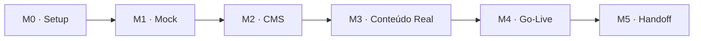

# PRD — Cardápio Digital (Astro + Decap CMS)

| Metadado | Valor |
| :--- | :--- |
| **Projeto** | Template de Cardápio Digital Reutilizável |
| **Stack** | Astro (SSG) + Decap CMS (Git-based) |
| **Status** | M1 — Mock de Demonstração |
| **Data** | 10 de Setembro de 2026 |
| **Alvo de Performance** | LCP < 1,5s (4G) · Lighthouse ≥ 90 |

---

## Sumário Executivo

Desenvolvimento de um template de cardápio digital reutilizável, 100% estático (SSG) e mobile-first, com gestão de conteúdo simplificada via **Decap CMS** para restaurantes e lanchonetes de pequeno e médio porte.

A primeira entrega consiste em um **mock navegável com dados demonstrativos**, estabelecendo o layout, sistema de design e modelo de dados. A personalização para cada novo cliente é realizada alterando apenas o arquivo de configuração (`settings.json`) e o conteúdo das coleções, sem necessidade de alterações no código-fonte.

---

## 1. Escopo

### 1.1. No Escopo (In Scope)
- Site *one-page* de cardápio para consulta rápida com foco *mobile-first*.
- Cardápio estruturado e dinâmico, editável pelo proprietário via Decap CMS (sem contato com código).
- Conversão direta via botão de WhatsApp (*wa.me*) flutuante e no cabeçalho com mensagem pré-configurada.
- Sistema de temas (nome, logo, cores primária/secundária, dados de contato) centralizado em arquivo de configuração único.
- Otimização para SEO básico e pré-visualização em redes sociais via Open Graph (WhatsApp, Instagram, Facebook).

### 1.2. Fora de Escopo (Out of Scope)
- Checkout, carrinho de compras, gateway de pagamento online ou autenticação de clientes finais.
- Sistema administrativo para gestão de comandas, estoques ou logística de entregas.
- Integração bidirecional com marketplaces (iFood, Rappi), suporte multi-idioma ou aplicativo nativo.

### 1.3. Personas e Usuários
- **Cliente Final:** Acessa pelo smartphone no salão (via QR code) ou em casa, consulta opções e valores, e inicia o pedido diretamente pelo WhatsApp.
- **Proprietário / Gerente:** Gerencia itens, preços, fotos e disponibilidade de produtos através do painel `/admin/` do Decap CMS.
- **Desenvolvedor:** Clona o repositório, ajusta o arquivo de configuração inicial, configura o domínio e entrega o projeto ao cliente.

---

## 2. Requisitos Funcionais (RF)

| ID | Requisito | Descrição |
| :--- | :--- | :--- |
| **RF1** | **Estrutura da Página** | Página única (*one-page*) com navegação ancorada fixa no topo: Hero (logo, nome, slogan, CTA WhatsApp) → Cardápio por Categoria → Informações/Horários/Endereço → Rodapé com redes sociais. |
| **RF2** | **Cardápio Dinâmico** | Renderização automática a partir de Content Collections tipadas do Astro, agrupadas por categoria e ordenadas. Cards com foto, título, descrição, preço formatado, badge de destaque (⭐) e suporte a estado de esgotado. |
| **RF3** | **CTA de Conversão** | Botão flutuante de WhatsApp fixo em toda a navegação e botão secundário no Hero, com número e mensagem padrão parametrizados via configuração. |
| **RF4** | **Edição pelo Dono** | Painel administrativo Decap CMS em `/admin/` com login seguro. Alterações geram commits automáticos que acionam novo build e deploy estático na Netlify. |
| **RF5** | **Tema Centralizado** | Personalização visual e textual parametrizada por cliente via `settings.json`. Cores alimentam CSS custom properties (`var(--color-primary)`, etc.). |
| **RF6** | **SEO e Metadados** | Meta tags completas (`title`, `description`, favicon, Open Graph para compartilhamento rico), sitemap automático (`sitemap.xml`) e suporte a Schema.org (`Restaurant`). |

---

## 3. Requisitos Não-Funcionais (RNF)

- **Performance:** Arquitetura 100% estática (SSG); imagens otimizadas em formato WebP responsivo; Largest Contentful Paint (LCP) < 1,5s sob rede 4G; pontuação no Google Lighthouse ≥ 90 em Performance e Acessibilidade.
- **Mobile-First:** Design concebido primariamente para viewport mobile (~375px), com adaptação fluida para tablets e desktops.
- **Acessibilidade (a11y):** Conformidade com diretrizes WCAG 2.2 nível AA, contraste mínimo de cores legível, atributos `alt` em todas as imagens e suporte integral à navegação por teclado.
- **Manutenibilidade:** Separação estrita entre layout/componentes e dados; processo de deploy e publicação totalmente automatizado via CI/CD.

---

## 4. Arquitetura da Solução

### 4.1. Stack Tecnológica
- **Gerador de Site Estático (SSG):** Astro com Content Collections validadas via Zod.
- **Gestão de Conteúdo (CMS):** Decap CMS montado em `public/admin/`.
- **Hospedagem e CI/CD:** Netlify com Netlify Identity e Git Gateway nativos.
- **Estilização:** CSS puro moderno utilizando Custom Properties para temas dinâmicos.

### 4.2. Fluxo de Autenticação
O Decap CMS opera via **Netlify Identity + Git Gateway**, permitindo que o cliente autentique-se por e-mail/senha com controle de convites (*Invite Only*), sem necessidade de manutenção de servidores de banco de dados ou provedores OAuth externos dedicados.

### 4.3. Estrutura de Diretórios e Componentes

| Caminho | Responsabilidade |
| :--- | :--- |
| `src/content/menu/` | Arquivos Markdown (`.md`) para cada item do cardápio com frontmatter. |
| `src/content/config.ts` | Definição dos schemas das coleções com validação de tipos (Zod). |
| `src/data/settings.json` | Configurações do estabelecimento, dados de contato e tokens visuais. |
| `src/components/` | Componentes reutilizáveis (`Hero`, `MenuSection`, `MenuCard`, `WhatsAppButton`, `Nav`, `Footer`). |
| `public/admin/` | Ponto de entrada do Decap CMS (`index.html` e `config.yml`). |
| `public/uploads/` | Armazenamento de ativos e imagens enviados pelo Decap CMS. |

---

## 5. Modelo de Dados

### 5.1. Item do Cardápio (`src/content/menu/*.md`)

| Campo | Tipo | Obrigatoriedade | Descrição |
| :--- | :--- | :--- | :--- |
| `nome` | `string` | Obrigatório | Nome comercial do prato/item. |
| `descricao` | `string` | Opcional | Descrição detalhada dos ingredientes/preparo. |
| `preco` | `number` | Obrigatório | Valor monetário em reais (R$). |
| `categoria` | `string` | Obrigatório | Categoria correspondente (ex.: Salgadas, Doces, Bebidas). |
| `foto` | `string` | Opcional | Caminho da imagem em `/uploads/`. |
| `destaque` | `boolean` | Opcional (def: false) | Ativa indicador visual de destaque (⭐). |
| `disponivel` | `boolean` | Opcional (def: true) | Indica se o item está ativo ou esgotado (esmaecido). |
| `ordem` | `number` | Opcional (def: 0) | Critério numérico de ordenação na seção. |

### 5.2. Configurações Globais do Estabelecimento (`src/data/settings.json`)

| Campo | Tipo | Descrição / Uso |
| :--- | :--- | :--- |
| `nome_local` | `string` | Nome da empresa para o Hero, cabeçalho e SEO (`title`). |
| `slogan` | `string` | Subtítulo do cabeçalho e descrição para `meta description`. |
| `logo` | `string` | Caminho do arquivo de logotipo. |
| `imagem_og` | `string` | Imagem destacada para Open Graph e previews de redes sociais. |
| `cor_primaria` | `string` | Hexadecimal da cor primária (injetada no `:root`). |
| `cor_secundaria` | `string` | Hexadecimal da cor de destaque/secundária. |
| `whatsapp` | `string` | Número telefônico com DDI e DDD sem pontuação para `wa.me`. |
| `mensagem_padrao`| `string` | Mensagem inicial pré-preenchida no WhatsApp. |
| `endereco` | `string` | Endereço físico exibido na seção de contato e rodapé. |
| `horarios` | `string[]` | Lista com os horários de funcionamento. |
| `instagram` | `string` | URL do perfil institucional no Instagram. |
| `facebook` | `string` | URL da página no Facebook. |
| `categorias` | `string[]` | Lista ordenada de categorias ativas no cardápio. |

### 5.3. Configuração do Decap CMS (`public/admin/config.yml`)
- **Coleção `cardapio`:** Folder collection vinculada a `src/content/menu/` com schema espelhado dos itens.
- **Coleção `config`:** File collection gerenciando diretamente o arquivo `src/data/settings.json`.
- **Media Folder:** `public/uploads` com caminho público `/uploads`.

---

## 6. Fases e Cronograma (Milestones)

- **M0 · Setup:** Repositório base inicializado no GitHub, projeto Astro configurado e pipeline CI/CD conectado à Netlify.
- **M1 · Mock Navegável (Fase Atual):** Estrutura completa de layout com dados demonstrativos, componentes responsivos, botão de WhatsApp funcional e injeção dinâmica de temas.
- **M2 · CMS Integrado:** Decap CMS configurado em `/admin/`, Netlify Identity e Git Gateway ativos, fluxo de edição, commit e rebuild validado.
- **M3 · Conteúdo Real:** Inclusão de fotos, descrições, preços e dados reais do restaurante parceiro.
- **M4 · Go-Live:** Configuração e apontamento de domínio próprio (DNS e SSL automático), conferência de SEO/Open Graph e geração de QR code de mesa.
- **M5 · Handoff e Suporte:** Entrega do vídeo tutorial de gestão ao cliente, liquidação do saldo financeiro e início da vigência de suporte.

---

## 7. Critérios de Aceite do Mock (Definition of Done — M1)

- [x] Layout *one-page* responsivo validado em viewport mobile (375px) e desktop.
- [x] Cardápio renderizado dinamicamente a partir das Content Collections do Astro, com agrupamento por categorias, flags de destaque e esgotado.
- [x] Botão de WhatsApp direcionando para API do `wa.me` com número e mensagem pré-preenchida.
- [x] Troca de cliente funcional alterando apenas `settings.json` sem necessidade de mexer em código de componentes.
- [x] Conformidade com metas de acessibilidade e pontuação Lighthouse ≥ 90.
- [x] Deploy público de demonstração operacional na Netlify.
