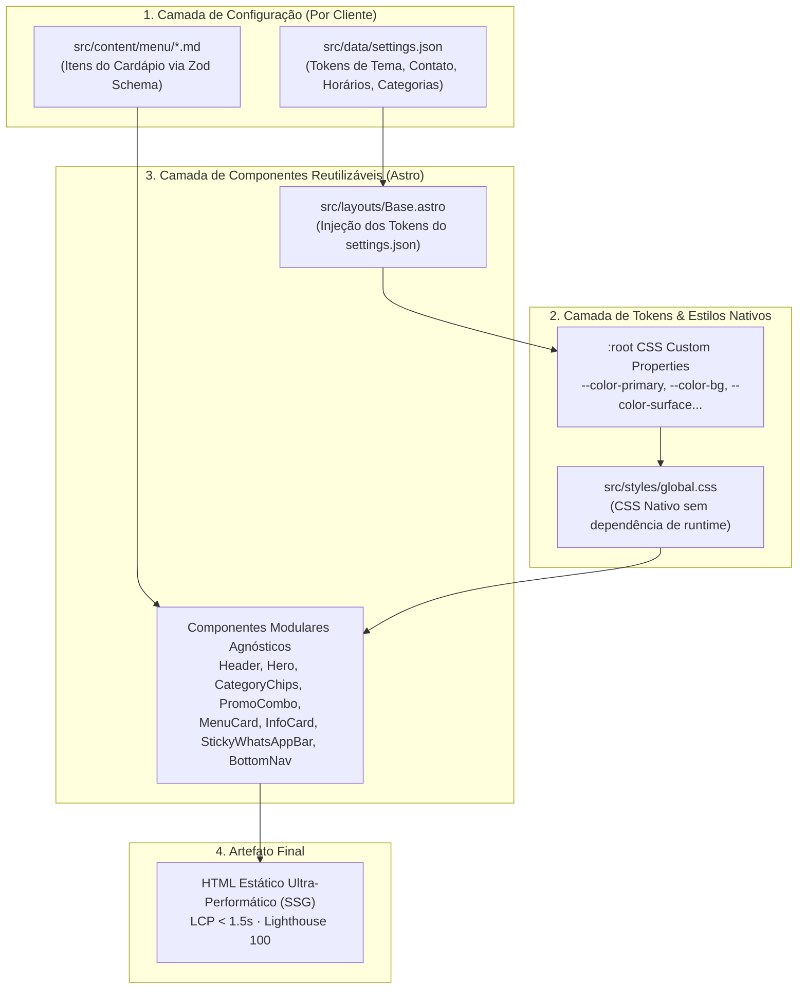

<!--
================================================================================
LOG DE MANUTENÇÃO DE DOCUMENTAÇÃO
--------------------------------------------------------------------------------
Data       | Autor          | Descrição
--------------------------------------------------------------------------------
2026-09-10 | Matheus Diniz  | Criação da ADR 0001 definindo a arquitetura de
           | (Antigravity)  | desacoplamento de dados via settings.json e design
           |                | tokens CSS nativos para reutilização multi-cliente.
================================================================================
-->

# ADR 0001: Arquitetura de Template Reutilizável com Design Tokens CSS e Desacoplamento de Dados para Cardápio Digital Multi-Cliente

| Metadado | Detalhe |
| :--- | :--- |
| **Status** | **Aprovada** (2026-09-10) |
| **Decisores** | Matheus Diniz, Engenharia de Software e Design System |
| **Tags** | `[architecture]`, `[design-system]`, `[css-custom-properties]`, `[astro]`, `[decap-cms]` |
| **Impacto Sistêmico** | Alto (Estrutura global do projeto, componentes e pipeline de entrega) |
| **ADRs Relacionadas** | N/A (Decisão inaugural) |

---

## Contexto

O projeto tem como objetivo entregar uma solução de cardápio digital estático (*Jamstack / SSG*), com foco estrito em *mobile-first*, performance extrema (LCP < 1,5s em redes móveis) e conversão direta via WhatsApp. 

O protótipo de alta fidelidade gerado no Stitch (`docs/ref-stitch.html`) foi instanciado utilizando a identidade visual do **Kaleb's Esfiharia** (`@kalebs_esfiharia`), contendo cores temáticas de brasa/forno (`#f66018`, `#19120e`), fontes específicas, produtos de gastronomia árabe e componentes ricos (hero com prova social, seletor de categorias em chips deslizantes, banner promocional de combo, cards com badges e barra flutuante de checkout).

Entretanto, o objetivo de negócio primordial do repositório — conforme estabelecido no [PRD.md](file:///Users/matheus.diniz_1/Documents/GitHub/menuDigital/docs/PRD.md) e no [core.md](file:///Users/matheus.diniz_1/Documents/GitHub/menuDigital/.agents/rules/core.md) — é operar como um **template reutilizável para múltiplos clientes**. A solução deve viabilizar a implantação de um novo cardápio (seja para uma hamburgueria, pizzaria, confeitaria, sushi ou cafeteria) em menos de 10 minutos, sem alteração estrutural nos componentes Astro e sem refatoração de código.

### Riscos Identificados e Problemas a Resolver:

1. **Acoplamento de Marca (*Brand Lock-in*) no Código-Fonte:** Manter classes de cores específicas (ex.: `#ea580c`, `#19120e`) ou textos e regras de negócio de um cliente no HTML/CSS impede a replicação ágil do template.
2. **Proliferação de Forks e Dívida Técnica (*Copy-Paste Drift*):** Duplicar o repositório inteiro e editar arquivos `.astro` manualmente a cada novo cliente geraria versões divergentes impossíveis de manter ou evoluir centralizadamente.
3. **Rigidez Visual vs. Decap CMS:** O cliente final gerencia o cardápio através do Decap CMS (`/admin/`). Se a identidade visual exigir recompilação de classes utilitárias ou regras estáticas, o cliente não conseguirá alterar cores e dados do local pelo painel sem intervenção do desenvolvedor.
4. **Sobrecarga de Frameworks CSS:** Depender de pipelines pesados de compilação CSS ou bibliotecas externas em tempo de execução contraria a regra de ouro de performance e simplicidade estabelecida no projeto.

---

## 1. Fundamentação Normativa & Padrões Técnicos

| Padrão / Diretriz | Aplicação Prática no Projeto |
| :--- | :--- |
| **W3C CSS Custom Properties (Level 1)** | Uso de variáveis nativas CSS no escopo `:root` para troca dinâmica de temas em tempo de compilação/execução sem overhead de JavaScript. |
| **JAMstack Architectural Principles** | Separação estrita entre camada de dados estáticos (JSON/Markdown), geração de páginas (SSG via Astro) e gestão de conteúdo (Git-based CMS). |
| **WCAG 2.2 AA (Accessibility)** | Garantia de contraste de cores mínimo (4.5:1 para texto normal e 3:1 para UI components) independente do tema de cores configurado. |
| **YAGNI & Ponytail Ultra (.agents/rules/core.md)** | Menor código correto, zero abstrações desnecessárias, priorizando CSS nativo e estruturas diretas. |

---

## 2. Decisão de Arquitetura

Decidiu-se pela **separação estrita em três camadas desacopladas**, eliminando qualquer acoplamento de marca dentro dos componentes visuais:



### Princípios da Decisão:

1. **Fonte Única da Verdade (`src/data/settings.json`):**
   Todos os dados institucionais (nome, slogan, logo, redes, horários, endereço, formas de pagamento) e os **tokens de cores primária, secundária, fundo e superfície** residem exclusivamente no `settings.json`. Trocar de cliente consiste unicamente em atualizar este arquivo.

2. **Tokens de Design via CSS Custom Properties no `:root`:**
   O layout base `Base.astro` consome as propriedades do `settings.json` e as injeta diretamente no elemento `:root`. Os componentes usam variáveis semânticas:
   - `--color-primary`: Cor de ação primária, botões de pedido e acentos.
   - `--color-secondary`: Cor de destaque secundário, avaliações ⭐ e badges.
   - `--color-bg`: Fundo da página (dark mode profundo ou light mode editorial).
   - `--color-surface`: Superfície de contêineres e barras de navegação.
   - `--color-surface-card`: Superfície de cards de itens com contraste calibrado.
   - `--color-text`: Cor do texto principal de leitura.
   - `--color-text-muted`: Cor de descrições, metadados e ingredientes.
   - `--color-whatsapp`: Cor canônica de alta conversão do WhatsApp (`#25d366`).

3. **Content Collections Tipadas com Zod (`src/content/menu/*.md`):**
   Cada item do cardápio é um arquivo Markdown individual contendo frontmatter validado (`nome`, `descricao`, `preco`, `categoria`, `foto`, `destaque`, `disponivel`, `ordem`).

4. **Componentes Agnósticos:**
   Componentes como `MenuCard.astro`, `CategoryChips.astro` e `StickyWhatsAppBar.astro` não possuem nenhuma menção a "esfiha", "árabe" ou códigos hexadecimais fixos. Eles renderizam puramente os dados recebidos via props e aplicam as variáveis CSS nativas.

---

### Matriz de Avaliação de Alternativas (Trade-off Matrix)

| Critério de Avaliação | Opção A: Tailwind com Configs Separadas | Opção B: CSS Custom Properties Nativas (Eleita) | Opção C: Multi-tenant com SSR e Banco de Dados |
| :--- | :--- | :--- | :--- |
| **Facilidade de Troca de Cliente** | Média (Exige rebuild de classes purgadas) | **Máxima (Altera apenas 1 arquivo JSON)** | Alta (Cadastro via banco) |
| **Performance (LCP em 4G)** | Boa (~1,2s) | **Excelente (< 1,0s, CSS estático minúsculo)** | Pior (Overhead de SSR e queries SQL) |
| **Custo de Hospedagem** | Zero (SSG na Netlify) | **Zero (SSG na Netlify)** | Alto (Servidor Node.js + Banco gerenciado) |
| **Edição via Decap CMS** | Complexa (CMS não edita `tailwind.config`) | **Perfeita (`settings.json` editável no Decap)** | Média (Exigiria painel próprio) |
| **Complexidade de Código** | Média (Dependência de build tools) | **Mínima (Zero abstração, YAGNI estrito)** | Altíssima |

---

## 3. Matriz de Implementação Técnica (*IN-CODE*)

### 3.1 Camada de Configuração (`src/data/settings.json`)

Contrato padronizado para parametrização integral do estabelecimento e do tema visual:

```json
{
  "negocio": {
    "nome": "Kaleb's Esfiharia",
    "ramo": "Artesanal Forno a Lenha",
    "slogan": "A autêntica esfiha árabe assada na hora",
    "descricao": "Massa fresca de fermentação lenta, recheios fartos preparados artesanalmente e o genuíno aroma da brasa.",
    "selo_hero": "Receita Ancestral",
    "nota": 4.9,
    "total_pedidos_mes": "+500 pedidos este mês",
    "logo": "/uploads/logo.svg",
    "hero_img": "/uploads/hero.jpg",
    "instagram": "https://instagram.com/kalebs_esfiharia",
    "instagram_user": "@kalebs_esfiharia"
  },
  "tema": {
    "modo": "dark",
    "cor_primaria": "#f66018",
    "cor_secundaria": "#ee9800",
    "cor_fundo": "#19120e",
    "cor_superficie": "#261e1a",
    "cor_superficie_card": "#211a16",
    "cor_texto": "#eee0d8",
    "cor_texto_muted": "#e2bfb2",
    "cor_whatsapp": "#00a74c"
  },
  "atendimento": {
    "horario": "Terça a Domingo: 18h às 23h30",
    "status_badge": "ABERTO AGORA",
    "tempo_entrega": "30-45 min",
    "endereco": "Rua das Esfihas, 450 - Centro",
    "whatsapp": "5511999999999",
    "mensagem_padrao": "Olá! Gostaria de fazer um pedido.",
    "pagamentos": "Pix (com 5% OFF), Débito, Crédito e VR / Sodexo"
  },
  "combo_destaque": {
    "ativo": true,
    "badge": "OFERTA DA SEMANA",
    "titulo": "Combo Kaleb's Família",
    "descricao": "10 Esfihas Salgadas à escolha + 2 Esfihas Doces Especiais + 1 Refrigerante 2L gelado.",
    "preco_de": 86.00,
    "preco_por": 69.90,
    "economia": "Economize R$ 16,10"
  },
  "categorias": [
    { "id": "mais-pedidos", "nome": "Mais Pedidos", "icone": "local_fire_department" },
    { "id": "salgadas", "nome": "Salgadas Clássicas", "icone": "restaurant" },
    { "id": "especiais", "nome": "Especiais & Queijos", "icone": "dinner_dining" },
    { "id": "doces", "nome": "Esfihas Doces", "icone": "cake" },
    { "id": "bebidas", "nome": "Bebidas", "icone": "local_bar" },
    { "id": "combos", "nome": "Combos", "icone": "local_offer" }
  ]
}
```

### 3.2 Camada de Layout e Injeção de Tema (`src/layouts/Base.astro`)

```astro
---
import '../styles/global.css';
import settings from '../data/settings.json';

const {
  title = `${settings.negocio.nome} — ${settings.negocio.ramo}`,
  description = settings.negocio.descricao,
} = Astro.props;
---
<!doctype html>
<html lang="pt-BR" data-theme={settings.tema.modo}>
  <head>
    <meta charset="utf-8" />
    <meta name="viewport" content="width=device-width, initial-scale=1.0" />
    <title>{title}</title>
    <meta name="description" content={description} />
    
    <!-- Design Tokens Injetados Nativamente -->
    <style set:html={`
      :root {
        --color-primary: ${settings.tema.cor_primaria};
        --color-secondary: ${settings.tema.cor_secundaria};
        --color-bg: ${settings.tema.cor_fundo};
        --color-surface: ${settings.tema.cor_superficie};
        --color-surface-card: ${settings.tema.cor_superficie_card};
        --color-text: ${settings.tema.cor_texto};
        --color-text-muted: ${settings.tema.cor_texto_muted};
        --color-whatsapp: ${settings.tema.cor_whatsapp};
      }
    `}></style>
  </head>
  <body class="theme-canvas">
    <slot />
  </body>
</html>
```

### 3.3 Camada de Componentes Modulares

Os componentes visuais mapeiam o layout refinado do `ref-stitch.html` utilizando as variáveis injetadas:

```css
/* src/styles/global.css - Excertos do Design System Reutilizável */
.theme-canvas {
  background-color: var(--color-bg);
  color: var(--color-text);
  font-family: 'Plus Jakarta Sans', system-ui, sans-serif;
  margin: 0;
  min-height: 100dvh;
}

.menu-card {
  background-color: var(--color-surface-card);
  border: 1px solid rgba(255, 255, 255, 0.08);
  border-radius: 0.75rem;
  padding: 0.75rem;
  display: flex;
  gap: 0.75rem;
  transition: transform 0.2s ease, border-color 0.2s ease;
}

.menu-card:hover {
  border-color: var(--color-primary);
  transform: translateY(-2px);
}

.menu-card--soldout {
  opacity: 0.55;
  filter: grayscale(0.8);
}

.btn-whatsapp {
  background-color: var(--color-whatsapp);
  color: #ffffff;
  border-radius: 0.75rem;
  font-weight: 700;
  display: inline-flex;
  align-items: center;
  justify-content: center;
  gap: 0.5rem;
  text-decoration: none;
}
```

---

## 4. Matriz de Ações de Governança & Operação (*OFF-CODE*)

| Ref | Ação Institucional / Operacional | Responsável | Entregável / Evidência |
| :--- | :--- | :--- | :--- |
| **OFF-01** | **Preservação de Presets Temáticos:** Manter catálogo de temas (Hamburgueria Dark, Pizzaria Rústica, Confeitaria Light, Sushi Minimal) em `docs/presets/` para agilizar novos setups. | Dev / Design | Arquivos de exemplo JSON prontos para uso. |
| **OFF-02** | **Governança do Decap CMS:** O arquivo `public/admin/config.yml` deve expor os campos do `settings.json` como coleções de arquivos para permitir que o cliente altere cores e textos sem risco de quebrar o schema. | Dev / CMS | Arquivo `config.yml` validado com campos de cor (`widget: color`). |
| **OFF-03** | **Guia de Handoff Multi-Cliente:** O checklist de entrega do [readme.md](file:///Users/matheus.diniz_1/Documents/GitHub/menuDigital/docs/readme.md) deve ser seguido à risca a cada novo cliente. | Operações | Checklist preenchido no fechamento de cada contrato. |

---

## 5. Matriz de Conformidade e Mitigação de Riscos

| Risco Mapeado no Contexto | Impacto Potencial | Mitigação Arquitetural e Técnica Adotada |
| :--- | :--- | :--- |
| **Acoplamento de Marca no Código** | Alto | Isolamento total de tokens e textos em `src/data/settings.json`. Zero menções a clientes em `.astro`. |
| **Inconsistência de Contraste (a11y)** | Médio | Definição de pares de cores validados em presets que asseguram conformidade estrita com WCAG 2.2 AA. |
| **Quebra de Schema por Cliente no CMS** | Médio | Tipagem e validação com Zod no build do Astro; o build falha de forma informativa antes do deploy se dados obrigatórios faltarem. |
| **Degradação de Performance por Imagens** | Médio | Orientação padronizada no CMS e documentação para fotos compactadas em ~1200px e servidas com `loading="lazy"`. |

---

## 6. Consequências e Resultados

### Positivas:
- **Replicação Instantânea de Clientes:** Criação de um novo cardápio para um novo restaurante em menos de 10 minutos (basta clonar, trocar `settings.json` e arquivos markdown em `src/content/menu/`).
- **Autonomia Total do Cliente:** O dono do restaurante pode gerenciar produtos, preços e dados institucionais pelo Decap CMS sem acionar o desenvolvedor.
- **Zero Overhead de Runtime:** Não há frameworks CSS em execução ou bibliotecas de runtime consumindo processamento no dispositivo móvel do cliente final.
- **Manutenibilidade Centralizada:** Qualquer melhoria implementada nos componentes Astro ou no sistema de sacola beneficia todos os clientes uniformemente.

### Mitigações e Desafios Aceitos:
- **Dependência de Alinhamento de Categorias:** As categorias cadastradas no `settings.json` devem manter estrita paridade com o seletor do `public/admin/config.yml`, devendo ser mantidas sincronizadas no setup inicial do cliente.
