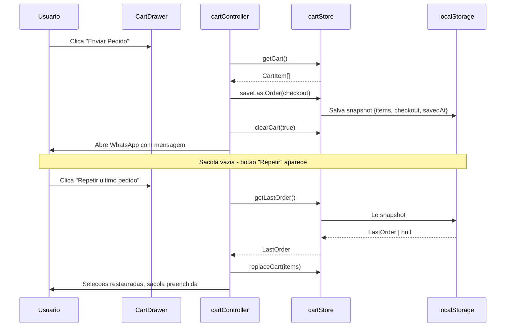

<!--
================================================================================
LOG DE MANUTENCAO DE DOCUMENTACAO
--------------------------------------------------------------------------------
Data       | Autor          | Descricao
--------------------------------------------------------------------------------
2026-09-13 | Matheus Diniz  | Registro consolidado de desenvolvimento da sessao.
================================================================================
-->

# Registro de Desenvolvimento — 2026-09-13

| Metadado | Detalhe |
| :--- | :--- |
| **Escopo Principal** | `<carrinho / ultimo-pedido>` |
| **Commits Gerados** | `2` |
| **Arquivos Modificados** | `4` |
| **ADRs Vinculadas / Geradas** | Nenhuma |

---

## 1. Visao Geral das Alteracoes

Implementacao completa da funcionalidade "Ultimo Pedido" no sistema de carrinho digital. A feature permite ao usuario salvar automaticamente um snapshot do pedido (itens + dados de checkout) no `localStorage` apos o envio via WhatsApp, e restaura-lo com um clique quando a sacola estiver vazia. Tambem inclui fix de XSS via `escapeHtml()` e melhoria na experiencia do textarea de observacoes.

---

## 2. Arquitetura Afetada & Decisoes (ADRs)

- **Decisoes Registradas:** Nenhuma ADR necessaria. A feature opera inteiramente no client-side usando `localStorage`, sem impacto na arquitetura existente.
- **Diagrama de Relacoes e Fluxos:**

---

## 3. Mapa de Arquivos Modificados

| Arquivo | Camada Tecnica | Resumo da Modificacao |
| :--- | :--- | :--- |
| `src/utils/cartStore.ts` | Store / Persistencia | Novas funcoes `saveLastOrder`, `getLastOrder`, `replaceCart`, `clearCart` imediato |
| `src/scripts/cartController.ts` | Controller / Logica | Handler do botao de restauracao, visibilidade, escapeHtml, textarea melhorado |
| `src/components/CartDrawer.astro` | UI / Componente | Botao de restauracao, CSS do botao e textarea |
| `docs/superpowers/plans/2026-09-13-ultimo-pedido.md` | Documentacao | Plano de implementacao detalhado |

---

## 4. Detalhamento por Commit

### `feat(carrinho): adicionar funcionalidade de repetir ultimo pedido`

- **Razao da alteracao:** Melhorar a experiencia do usuario permitindo repetir pedidos anteriores sem redescolher todos os itens e opcoes.
- **Comportamento atual:** Apos enviar pedido via WhatsApp, a sacola e limpa. Se existir um snapshot salvo, um botao "Repetir ultimo pedido" aparece no estado vazio. Ao clicar, restaura todos os itens e selecoes.
- **Decisoes tecnicas:**
  - Uso de `localStorage` para persistencia client-side (sem necessidade de backend).
  - `clearCart(true)` como modo imediato para limpar sem debounce (evita race condition com redirect para WhatsApp).
  - `escapeHtml()` para sanitizar nomes e observacoes antes de montar a mensagem (prevencao de XSS).
  - Remocao de emojis da mensagem do WhatsApp para melhor compatibilidade entre dispositivos.
- **Arquivos envolvidos:**
  - `src/utils/cartStore.ts`: Novas funcoes e interface `LastOrder`
  - `src/scripts/cartController.ts`: Logica de restauracao e limpeza
  - `src/components/CartDrawer.astro`: UI e estilos

### `docs(plans): adicionar plano de implementacao do ultimo pedido`

- **Razao da alteracao:** Documentar o plano de implementacao para futuras referencias e tracing de decisoes.
- **Comportamento atual:** Documento de plano disponivel em `docs/superpowers/plans/`.
- **Arquivos envolvidos:**
  - `docs/superpowers/plans/2026-09-13-ultimo-pedido.md`: Plano completo com tasks e especificacoes

---

## 5. Divida Tecnica & Proximos Passos

- [ ] Testar em dispositivos movveis para validar comportamento do `localStorage` em Safari iOS.
- [ ] Considerar expiracao automatica do snapshot (ex: 7 dias) para evitar dados obsoletos.
- [ ] Avaliar necessidade de feedback visual (toast/snackbar) ao restaurar pedido.
