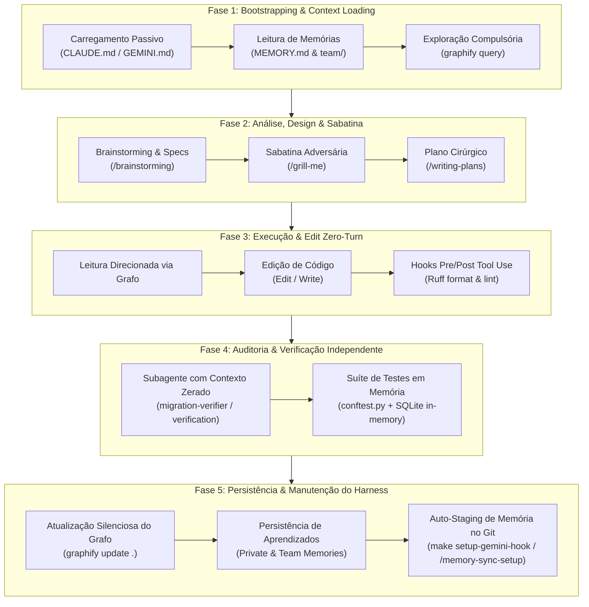
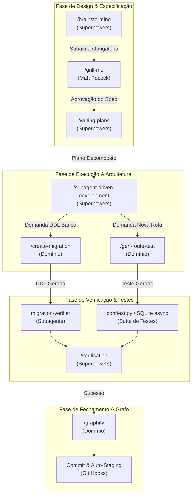
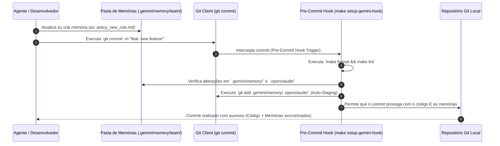

# 🚀 Guia Prático de Construção e Operação de Harness de Alta Maturidade para Agentes de IA

**Data**: 02 de Setembro de 2026
**Versão**: 1.2.0
**Status**: Aprovado / Guia Operacional
**Escopo**: Dual-Harness (OpenClaude / Claude Code & Gemini CLI)
**Autor**: Equipe de Engenharia de IA & Arquitetura de Sistemas

---

## ⚙️ Seção 0: Pré-Requisitos e Setup Inicial

> 💡 **Leia antes de começar.** Esta seção deve ser executada uma única vez em cada máquina de desenvolvimento. Ela garante que todas as ferramentas do Harness estejam instaladas e configuradas antes de qualquer interação com agentes de IA.

---

### 0.1 Ferramentas Obrigatórias

| Ferramenta                      | Propósito no Harness                                         | Instalação                                                     |
| :------------------------------ | :------------------------------------------------------------ | :--------------------------------------------------------------- |
| `make` (GNU Make)             | Automação de atalhos operacionais, setup de hooks e sandbox | Pré-instalado ou`brew install make` / `apt install make`    |
| `uv`                          | Gerenciador de pacotes Python (substitui pip/poetry)          | `curl -LsSf https://astral.sh/uv/install.sh \| sh`              |
| `ruff`                        | Linter e formatter Python (zero-turn via hooks)               | Instalado via`uv` no `pyproject.toml`                        |
| `graphify`                    | Navegação por Knowledge Graph (compulsória)                | `pip install graphify-cli` ou `uv tool install graphify-cli` |
| `docker` + `docker-compose` | Ambiente de dev isolado (SQL Server + API)                    | [docs.docker.com/get-docker](https://docs.docker.com/get-docker/) |
| `jq`                          | Parsing de JSON nos hooks de ciclo de vida                    | `brew install jq` (macOS) / `apt install jq` (Linux)         |
| `ai-jail` *(opcional)*      | Sandbox de segurança para isolar os agentes                  | `make jail-setup` (ver seção 0.4)                            |
| OpenClaude / Claude Code CLI    | Agente de IA principal (harness Claude)                       | [claude.ai/code](https://claude.ai/code)                          |
| Gemini CLI                      | Agente de IA auxiliar (harness Gemini)                        | `npm install -g @google/gemini-cli`                            |

---

### 0.2 Variáveis de Ambiente

O ecossistema de agentes (MCPs, Stitch, GitHub) requer tokens de acesso carregados no shell. O repositório possui um script dedicado para isso:

```bash
# 1. Copiar e preencher o arquivo de ambiente
make env

# 2. Carregar as variáveis no shell atual
source scripts/load-env.sh

# 3. Verificar se as variáveis estão disponíveis
make export-env
```

**Variáveis críticas que devem estar presentes no `.env`:**

| Variável                                       | Uso                                                        |
| :---------------------------------------------- | :--------------------------------------------------------- |
| `GITHUB_PERSONAL_ACCESS_TOKEN`                | MCP GitHub (criação de PRs, issues)                      |
| `STITCH_API_KEY`                              | MCP Stitch (Google UI design)                              |
| `FIGMA_TOKEN`                                 | MCP Figma (design assets)                                  |
| `GOOGLE_CLIENT_ID` / `GOOGLE_CLIENT_SECRET` | Autenticação OAuth2 da API                               |
| `DATABASE_URL` / `DB_*`                     | Configuração de conexão com SQL Server (ODBC Driver 18) |

---

### 0.3 Quick Start: Setup do Harness em 10 Passos (Novo Repositório)

Execute os comandos abaixo em sequência ao clonar o repositório pela primeira vez ou ao configurar um novo projeto para garantir que todo o ecossistema do agente esteja funcional:

```bash
# 1. Instalar dependências Python
uv sync

# 2. Carregar variáveis de ambiente (Tokens MCPs e BD)
make env
source scripts/load-env.sh

# 3. Subir o ambiente de desenvolvimento (Docker)
make dev
# A API estará disponível em http://localhost:8000

# 4. Verificar infraestrutura de testes em memória
make test

# 5. Gerar o Knowledge Graph inicial (OBRIGATÓRIO antes de usar agentes)
graphify extract . --force --code-only
# O grafo base será gerado em graphify-out/graph.json

# 6. Instalar o Git pre-commit hook (auto-staging de memória e validações)
make setup-gemini-hook

# 7. Sincronizar memória global do agente para o repositório local
make pull-memory

# 8. (Opcional) Instalar o sandbox de segurança AI Jail
make jail-setup

# 9. Testar conexão do Agente e MCPs no Sandbox
make jail-gemini
# No prompt do Gemini, digite: /mcp-status para verificar se o GitHub e Stitch MCP estão online

# 10. Realizar o commit inicial de setup
git add .
git commit -m "chore(harness): setup inicial do dual-harness, graphify e hooks"
# O pre-commit hook (Passo 6) validará Ruff, testes rápidos e sincronizará a memória
```

---

### 0.4 Setup do AI Jail (Sandbox — Opcional mas Recomendado)

O `ai-jail` isola os agentes de IA em um sandbox controlado, prevenindo acesso acidental a diretórios sensíveis fora do repositório:

```bash
# Instalar e configurar o ai-jail
make jail-setup

# Rodar OpenClaude isolado no sandbox
make jail-openclaude

# Rodar Gemini CLI isolado no sandbox
make jail-gemini
```

A configuração de isolamento do projeto segue o modelo detalhado no [Guia AI Jail Sandbox](guia-ai-jail-sandbox.md).

---

### 0.5 Sincronização de Memória entre Máquinas

Quando um desenvolvedor inicia em uma nova máquina ou após um clone fresh, o repositório local não possui as memórias acumuladas dos agentes. Para sincronizar:

```bash
# Puxar memórias do repositório para o sistema local (~/.gemini e ~/.claude)
make pull-memory

# Enviar memórias locais de volta ao repositório (após o agente criar novas)
make push-memory
```

O hook de pre-commit (`make setup-gemini-hook`) executa `pull-memory` automaticamente a cada commit, garantindo que o repositório sempre reflita o estado mais atual das memórias.

---

## 📖 Introdução e Visão Geral

À medida que o desenvolvimento orientado a agentes de IA evolui da geração simples de trechos de código para a engenharia autônoma de sistemas inteiros, a infraestrutura que envolve e apoia o agente torna-se tão crítica quanto o próprio modelo de linguagem. Essa infraestrutura de suporte, governança, validação e execução é chamada de **Harness de Desenvolvimento para Agentes de IA**.

Sem um Harness estruturado, o agente opera em um ambiente sem balizas: sofre de desvio de contexto (context drift), comete erros de estilo recorrentes que consomem múltiplos turnos de correção, gera alucinações arquiteturais, entra em loops de lint e invalida o histórico da janela de contexto com buscas brutas ineficientes.

### 📊 Níveis de Maturidade do Harness

A capacidade e confiabilidade do Harness de um repositório são classificadas em 3 níveis de maturidade:

1. **Nível 1 (Incipiente)**: Operação reativa do agente sem guardrails automatizados. Prompts manuais repetitivos, sem hooks de formatação zero-turn, buscas brutas via `Grep`/`Glob`, sem gestão de memória persistente e testes executados contra banco de dados físico local ou ausentes.
2. **Nível 2 (Intermediário)**: Convenções de projeto alinhadas (`CLAUDE.md`), hooks básicos de lint e scripts isolados de teste. Contudo, ainda padece de perda de contexto entre sessões, falta de orquestração de skills e buscas textuais custosas em bases de código grandes.
3. **Nível 3 (Maduro / Robusto - Target deste Guia)**: Estado da arte em engenharia de agentes. Apresenta paridade **Dual-Harness** (`CLAUDE.md` ↔ `GEMINI.md`), automação zero-turn de formatação (`Ruff`), navegação relacional compulsória por grafo de conhecimento (`Graphify`), orquestração encadeada de skills, subagentes auditores isolados, memória persistente com auto-staging no Git e suíte de testes em memória determinística (`SQLite async` + `conftest.py`).

Com uma estrutura de **Nível 3 (Maduro / Robusto)**, o Harness transforma o agente em um engenheiro de software de alta precisão. Ele fornece:

- **Execuções Determinísticas**: Regras arquiteturais injetadas e aplicadas compulsoriamente sem necessidade de repetição manual nos prompts.
- **Automação Zero-Turn**: Hooks de ciclo de vida que formatam e validam o código silenciosamente em tempo real antes e depois do uso das ferramentas.
- **Eficiência Extrema de Tokens**: Economia comprovada em produção de **~42.7% no consumo total de tokens**, alcançada substituindo buscas textuais cegas por navegação estruturada via grafo de conhecimento (`Graphify`) e eliminando turnos de correção de formatação.
- **Isolamento e Segurança**: Subagentes auditores com janela de contexto limpa e testes executados inteiramente em memória sem poluir o banco de dados de desenvolvimento.

---

## ☯️ Filosofia Dual-Harness (OpenClaude / Claude Code + Gemini CLI)

Projetos modernos de grande porte frequentemente utilizam múltiplos assistentes e CLIs de IA em um ecossistema multiplataforma. Este guia adota a **Filosofia Dual-Harness (Três Eixos)**, garantindo paridade funcional e simetria absoluta entre o **OpenClaude / Claude Code CLI** e o **Gemini CLI / Antigravity** no mesmo repositório de código, através de um diretório compartilhado (`.agents/`).

```
┌────────────────────────────────────────────────────────────────────────────────────────┐
│                                 REPOSITÓRIO DE CÓDIGO                                  │
├──────────────────────────┬─────────────────────────────┬───────────────────────────────┤
│         CLAUDE           │        COMPARTILHADO        │            GEMINI             │
├──────────────────────────┼─────────────────────────────┼───────────────────────────────┤
│ • .claude/               │ • .agents/                  │ • .gemini/                    │
│   ├── settings.json      │   ├── rules/core-skills.md  │   ├── settings.json           │
│   ├── skills/            │   ├── skills/               │   ├── skills/                 │
│   ├── agents/            │   ├── workflows/            │   ├── agents/                 │
│   ├── memory/            │   └── plugins/              │   └── memory/                 │
│   └── *.sh (Hooks)       │                             │   └── sync-memory.sh          │
│                          │ • Makefile (targets)        │                               │
│ • CLAUDE.md              │ • .ai-jail / .graphifyignore│ • GEMINI.md                   │
└──────────────────────────┴─────────────────────────────┴───────────────────────────────┘
```

A coexistência harmoniosa entre ambos os assistentes é garantida por:

1. **Paridade de Instruções**: O arquivo `CLAUDE.md` e o `GEMINI.md` compartilham a mesma paridade conceitual de regras de arquitetura (DDD, Vertical Slice), diretrizes de linguagem (documentação em pt-BR, commits em EN-US) e convenções de código.
2. **Camada Compartilhada (`.agents/`)**: Regras always-on (`core-skills.md`), workflows operacionais e a biblioteca principal de skills (marketplace/genéricas) vivem no `.agents/` para não serem duplicadas.
3. **Sincronização Cruzada de Memória**: O diretório `.gemini/memory/` e a estrutura `.claude/memory/team/` contêm decisões de equipe e padrões, protegidos de serem esquecidos por auto-staging no pre-commit hook.
4. **Respeito aos Guardrails**: Ambos os assistentes obedecem à mesma filosofia de exploração compulsória por grafo (`graphify`), isolamento em sandbox (`ai-jail`) e execução de scripts de validação (`Makefile` e hooks).

---

## 🏛️ Seção 1: Os 7 Pilares do Harness de Alta Maturidade

Um Harness de Nível 3 é sustentado por sete pilares fundamentais de engenharia, cada um responsável por resolver um gargalo específico na interação entre o agente e a codebase.

```
┌────────────────────────────────────────────────────────────────────────────────────────┐
│                          OS 7 PILARES DO HARNESS DE NÍVEL 3                            │
├────────────────────────────────────────────────────────────────────────────────────────┤
│  [Pilar 1] Instruções Paritárias ──► CLAUDE.md e GEMINI.md com convenções vivas       │
│  [Pilar 2] Formatação Zero-Turn ───► Hooks Pre/Post Tool Use (Ruff format & lint)      │
│  [Pilar 3] Partida Compulsória  ───► Diretriz "Graphify Before Grep/Glob"              │
│  [Pilar 4] Taxonomia de Skills  ───► Superpowers + Matt Pocock + Skills de Domínio     │
│  [Pilar 5] Subagentes Isolados  ───► Auditores dedicados (migration-verifier)         │
│  [Pilar 6] Memória & Git Hooks  ───► Auto-staging de memórias via pre-commit           │
│  [Pilar 7] Testes em Memória    ───► conftest.py async + SQLite in-memory determinístico │
└────────────────────────────────────────────────────────────────────────────────────────┘
```

---

### 1.1 Pilar 1: Instruções e Convenções Paritárias (`CLAUDE.md` / `GEMINI.md`)

O primeiro pilar consiste em centralizar a inteligência e o contexto arquitetural da codebase em arquivos de configuração que são carregados automaticamente no início de cada sessão.

- **Eliminação de Poluição de Prompt**: Em vez de repetir comandos de build, regras de commit ou padrões de pasta em cada requisição do usuário, o Harness injeta essas regras na raiz do projeto (`CLAUDE.md` e `GEMINI.md`).
- **Arquitetura Vertical Slice & DDD**: Define explicitamente que cada módulo do projeto (ex: `src/app/{modulo}/`) é uma fatia vertical contendo seus próprios `models.py`, `schemas.py`, `repository.py`, `service.py`, `use_cases.py` e `router.py`.
- **Política Rígida de Idioma**:
  - **Português do Brasil (pt-BR)**: Toda a documentação técnica, planos de execução (`specs`/`plans`), relatórios, ADRs e comentários explicativos.
  - **Inglês (EN-US)**: Todo o código fonte, identificadores, nomes de variáveis e mensagens de commit no padrão **Conventional Commits** (`<type>(<scope>): <subject>`).
- **Paridade Total**: Alterações de regras arquiteturais devem ser replicadas simultaneamente em `CLAUDE.md` e `GEMINI.md` para evitar divergência comportamental entre assistentes.

---

### 1.2 Pilar 2: Automações e Formatação Zero-Turn (Hooks)

O segundo pilar aborda a eliminação de turnos desnecessários de conversação (token waste) através da interceptação silenciosa no ciclo de vida das ferramentas.

- **O Problema da Correção Reativa**: Sem hooks automatizados, quando o agente edita um arquivo Python e viola uma regra de estilo (ex: PEP 8, ordenação de imports), o linter falha no pipeline de CI ou o usuário precisa solicitar manualmente "Rode o linter e corrija". Isso consome de 2 a 4 turnos de conversa e dezenas de milhares de tokens.
- **A Solução Zero-Turn**: O Harness utiliza hooks registrados no `.claude/settings.json` (ou scripts de interceptação equivalente):
  - **Hook `PreToolUse` / `PostToolUse`**: Sempre que a ferramenta `Edit` ou `Write` modifica um arquivo `.py`, o Harness executa automaticamente o comando `make format && make lint` (`Ruff`).
  - **Interceptação Transparente**: O código é ajustado, formatado e higienizado antes mesmo de retornar o controle ao agente ou ao usuário, garantindo 0 turnos gastos com ajustes superficiais de sintaxe.

---

### 1.3 Pilar 3: Ponto de Partida Compulsório (Graphify & Knowledge Graph)

O terceiro pilar transforma a forma como o agente navega pela codebase, substituindo a busca cega por palavras-chave por exploração relacional contextualizada.

- **Diretriz "Graphify Before Grep/Glob"**: O Harness estabelece uma regra mandatória: antes de executar qualquer busca por texto bruto via `Grep` ou varredura via `Glob`, o agente é obrigado a consultar o Grafo de Conhecimento (`graphify-out/graph.json`) através do comando `graphify query "<pergunta>"`, `graphify explain "<conceito>"` ou `graphify path "<A>" "<B>"`.
- **Economia de Tokens e Visão Holística**: O grafo abstrai nós de comunidade, dependências entre módulos, fluxos de chamadas e entidades críticas. Em vez de ler dezenas de arquivos inteiros para entender como um módulo funciona, o agente recebe o subgrafo exato com suas conexões.
- **Injeção Compulsória em Subagentes**: Qualquer subagente disparado pelo agente principal herda compulsoriamente a diretiva de consultar o Graphify como primeira ação de exploração.

---

### 1.4 Pilar 4: Orquestração e Taxonomia de Skills

O quarto pilar organiza as habilidades estendidas (Skills) do agente em uma taxonomia clara por origem e responsabilidade, permitindo seu encadeamento fluido durante o desenvolvimento.

1. **Skills do Framework Superpowers (`superpowers:*`)**:
   - *Proveniência*: Plugin oficial Superpowers.
   - *Foco*: Governança e execução do ciclo de vida da tarefa.
   - *Exemplos*: `/brainstorming`, `/writing-plans`, `/subagent-driven-development`, `/executing-plans`, `/verification`.
2. **Skills do Agentic Engineering / Matt Pocock (`agentic-engineering:*`)**:
   - *Proveniência*: Padrões de engenharia de agentes de Matt Pocock.
   - *Foco*: Desafio técnico e validação adversária de design.
   - *Exemplos*: `/grill-me`, `/test-driven-development`, `/refactoring`.
3. **Skills Compartilhadas de Domínio & Single Source of Truth (`.agents/skills/`)**:
   - *Proveniência*: Criadas sob medida para o projeto ou instaladas via marketplace/bibliotecas.
   - *Regra Canônica*: **Todas as skills do projeto são sempre criadas no diretório compartilhado `.agents/skills/<skill>/`**, que atua como a única fonte da verdade (Single Source of Truth).
   - *Acesso nos Harnesses via Symlinks*: Para que Claude Code e Gemini CLI acessem as skills sem duplicação de arquivos, os diretórios `.claude/skills/` e `.gemini/skills/` apontam para as skills em `.agents/skills/` via links simbólicos (`symlinks`).
   - *Exemplos*: `create-migration`, `gen-route-test`, `graphify`, `security-audit`, `api-endpoint-builder`, `bug-hunter`.

---

### 1.5 Pilar 5: Subagentes de Verificação com Contexto Isolado

O quinto pilar desacopla tarefas de auditoria complexas do processo principal, prevenindo a poluição do histórico de conversação (context bloat).

- **Janela de Contexto Limpa**: Quando o agente principal realiza uma alteração estrutural profunda (como criar uma migração de banco de dados ou refatorar um repositório), disparar auditorias dentro da mesma conversa sobrecarrega o histórico e induz alucinações.
- **Subagentes Especializados do Projeto**: O Harness define dois subagentes isolados, versionados em `.claude/agents/` e `.gemini/agents/`:
  - **`migration-verifier`**: Audita arquivos de migração Alembic, verificando idempotência, DDL defensivo (`has_table`/`has_column`), funções `upgrade()`/`downgrade()` simétricas e import no `models_registry`. Retorna `[APROVADO / REJEITADO]` com pontos de atenção.
  - **`knowledge-graph-curator`**: Respónsavel por inspecionar e reorganizar o grafo de conhecimento (`graphify-out/`) após refatorações estruturais grandes. Garante que nós orphãos sejam removidos e que a wiki do grafo (`graphify-out/wiki/`) esteja atualizada.

---

### 1.6 Pilar 6: Memória Persistente e Estratégia de Git Hooks

O sexto pilar garante que os aprendizados, decisões arquiteturais e incidentes superados pelo agente sejam salvos permanentemente e compartilhados entre toda a equipe de desenvolvimento.

- **Escopo Duplo de Memória**:
  - **Memória Privada**: Armazena preferências locais do desenvolvedor, configurações de ambiente e histórico pessoal. Localizada em `.claude/memory/` (arquivos não prefixados com `team`) e apenas local.
  - **Memória de Equipe**: Armazena decisões arquiteturais (ADRs), registros de bugs históricos, padrões de teste de rotas, convenções de schema e políticas de migração. Localizada em `.claude/memory/team/` (mais de 56 arquivos no projeto atual) e `.gemini/memory/`.
- **Automação via Git Pre-Commit Hooks**:
  - O comando `make setup-gemini-hook` instala o hook em `.git/hooks/pre-commit`.
  - **Auto-Staging Transparente**: O hook executa `.claude/sync-claude-memory.sh pull`, que usa `rsync` para atualizar `.claude/memory/` a partir do diretório global do assistente e faz `git add` automaticamente.

---

### 1.7 Pilar 7: Infraestrutura de Testes & Isolation em Memória

> 💡 **Nota de Referência**: Para as diretrizes e convenções detalhadas de escrita de testes (padrão AAA, nomenclatura e estratégias de mock), consulte os guias em [Padrões de Testes Backend](../testing/backend/test-writing-standards.md) e [Padrões de Testes Frontend](../testing/frontend/test-writing-standards.md).

O sétimo pilar fornece um ambiente de execução de testes rápido, determinístico e isolado de efeitos colaterais.

- **Isolamento de Banco e Fixtures de Teste**: As suítes de teste de integração e serviços utilizam banco em memória isolado (SQLite in-memory / transações atômicas `RefreshDatabase`) ou clientes mockados, permitindo testes determinísticos e rápidos sem poluir bancos de dados persistentes.
- **Isolamento de Dependências com Dependency Overrides / Service Container**: O Harness impõe a substituição de dependências externas (autenticação, gateways de terceiros, drivers de persistência) por fakes/mocks controlados.
- **Limpeza Obrigatória em Blocos de Teardown**: Todos os testes limpam explicitamente seu estado de mock e injeção de dependências após a execução para prevenir contaminação de estado entre casos de teste distintos.

---

## 🔄 2. O Ciclo de Vida do Agente & Workflow Cruzado

O desenvolvimento autônomo e assistido por IA opera através de um fluxo estruturado em **5 Fases Interconectadas**. Cada fase aciona artefatos específicos do Harness, garantindo que o agente navegue do entendimento do problema à persistência do resultado sem desvio de contexto, sem regressões de estilo e sem desperdício de tokens.

### 2.1 Visão Geral do Ciclo de Vida em 5 Fases

O diagrama abaixo ilustra a transição contínua entre as fases e o mapeamento com os componentes do Harness:

#### Diagrama Mermaid



#### Fluxo ASCII Estruturado

```
┌──────────────────────────────────────────────────────────────────────────────────┐
│ FASE 1: BOOTSTRAPPING & CONTEXT LOADING                                          │
│ ├─► Leitura passiva compulsória de CLAUDE.md / GEMINI.md                         │
│ ├─► Carregamento automático de MEMORY.md e memórias de equipe (.gemini/memory/)   │
│ └─► Execução OBRIGATÓRIA do Graphify Query (graphify query) antes de Grep/Glob   │
├──────────────────────────────────────────────────────────────────────────────────┤
│ FASE 2: ANÁLISE, DESIGN & SABATINA                                               │
│ ├─► Invocação da skill /brainstorming para especificação iterativa               │
│ ├─► Execução proativa e encadeada do /grill-me (sabatina adversária de design)   │
│ └─► Transição para /writing-plans (decomposição cirúrgica de tarefas)           │
├──────────────────────────────────────────────────────────────────────────────────┤
│ FASE 3: EXECUÇÃO & EDIT ZERO-TURN                                                │
│ ├─► Leitura direcionada de arquivos identificados no Grafo de Conhecimento       │
│ ├─► Chamada da ferramenta Edit / Write                                           │
│ └─► Interceptação Hooks PreToolUse/PostToolUse: make format && make lint (Ruff)  │
├──────────────────────────────────────────────────────────────────────────────────┤
│ FASE 4: AUDITORIA & VERIFICAÇÃO INDEPENDENTE                                     │
│ ├─► Disparo de subagente secundário com contexto zerado (migration-verifier)     │
│ └─► Execução de testes em memória (conftest.py + SQLite assíncrono in-memory)   │
├──────────────────────────────────────────────────────────────────────────────────┤
│ FASE 5: PERSISTÊNCIA & MANUTENÇÃO DO HARNESS                                     │
│ ├─► Atualização silenciosa incremental do grafo (graphify update .)              │
│ ├─► Registro de memórias aprendidas na sessão (Privadas e de Equipe)             │
│ └─► Git Pre-Commit Hook (make setup-gemini-hook): auto-staging de memórias       │
└──────────────────────────────────────────────────────────────────────────────────┘
```

---

### 2.2 Mapeamento Cruzado Detalhado das 5 Fases

#### 1. Fase 1: Bootstrapping & Context Loading

No início de qualquer sessão, o Harness força o alinhamento arquitetural do agente antes do envio da primeira mensagem do usuário ou do primeiro comando.

- **Leitura Passiva e Compulsória de Instruções**: O agente consome os arquivos `CLAUDE.md` e `GEMINI.md`, incorporando as regras do projeto (DDD Vertical Slice, política de linguagem pt-BR/EN-US, padrões de commit e linter).
- **Carregamento Automático de Memórias**: O histórico acumulado no `MEMORY.md` e em `.gemini/memory/team/` é injetado no contexto, garantindo que incidentes anteriores, decisões de design (ADRs) e convenções vigentes sejam imediatamente conhecidos.
- **Partida Compulsória por Grafo (`graphify query`)**: Antes de realizar qualquer busca genérica por arquivos ou strings brutas, o agente obrigatoriamente consulta o Grafo de Conhecimento (`graphify query "<pergunta>"`). Isso orienta a navegação reduzindo a varredura desnecessária de diretórios em até 90%.

#### 2. Fase 2: Análise, Design & Sabatina

Antes de escrever qualquer linha de código produtivo, a demanda passa pelo pipeline de validação de design.

- **Refinamento Iterativo via `/brainstorming`**: A skill de especificação orienta a criação do spec técnico em `docs/ai/specs/`, definindo requisitos, arquitetura afetada e critérios de aceite.
- **Sabatina Adversária com `/grill-me`**: O agente dispara proativamente o `/grill-me` para estressar o design proposto. A sabatina questiona premissas, riscos de segurança, gargalos de performance, falhas em schemas Pydantic/SQLAlchemy e compatibilidade de migrações.
- **Decomposição em Plano Cirúrgico via `/writing-plans`**: Com o spec aprovado e sabatinado, o plano de execução é gerado em `docs/ai/plans/`, dividindo a tarefa em etapas granulares e testáveis sob a perspectiva de TDD.

#### 3. Fase 3: Execução & Edit Zero-Turn

A fase de modificação de código é protegida por automações que impedem a contaminação do histórico de conversação com erros superficiais de estilo.

- **Leitura Direcionada de Código**: O agente lê exclusivamente os arquivos apontados pelas consultas ao grafo e pelo plano de execução.
- **Modificação via Ferramentas Rígidas (`Edit` / `Write`)**: O agente altera os arquivos necessários aplicando o mínimo de código viável e reutilizando abstrações já existentes na codebase.
- **Interceptação Zero-Turn via Hooks (`PreToolUse` / `PostToolUse`)**: Assim que a ferramenta de edição é executada, os hooks configurados em `.claude/settings.json` disparam silenciosamente `make format && make lint` (`Ruff`). Qualquer desvio de formatação, import não utilizado ou violação de estilo é corrigido automaticamente pelo ambiente sem gastar turnos do modelo de linguagem ou tokens de feedback.

#### 4. Fase 4: Auditoria & Verificação Independente

A validação das alterações é isolada do contexto principal para garantir imparcialidade e prevenir alucinações.

- **Disparo de Subagentes com Contexto Zerado**: Para alterações críticas (como migrações Alembic ou refatorações de segurança), um subagente especializado (ex: `migration-verifier`) é spawnado com uma janela de contexto limpa. O subagente inspeciona o diff de forma autônoma e emite um parecer sintético.
- **Execução de Testes Determinísticos em Memória**: A suíte de testes de integração é executada utilizando as fixtures de `tests/conftest.py`, rodando sobre SQLite assíncrono em memória. Os testes validam as rotas FastAPI e contratos Pydantic sem afetar o banco de dados de desenvolvimento.

#### 5. Fase 5: Persistência & Manutenção do Harness

Após a conclusão da tarefa, o estado do repositório e a memória do agente são sincronizados para sessões futuras.

- **Atualização Incremental do Grafo de Conhecimento**: O hook `PostToolUse` dispara o comando `graphify update .` em background, atualizando os nós, arestas e subgrafos modificados durante a edição.
- **Persistência de Aprendizados (`MEMORY.md`)**: Novos padrões arquiteturais ou soluções de bugs descobertos na sessão são documentados no diretório de memórias (dividos entre escopo privado e de equipe).
- **Auto-Staging de Memória no Git**: O script Git pre-commit hook (configurado via `make setup-gemini-hook` e `/memory-sync-setup`) intercepta o comando de commit e adiciona automaticamente os arquivos de memória atualizados (`.gemini/memory/` e `.openclaude/.../memory/`) ao staging do Git, garantindo que o conhecimento permaneça versionado e sincronizado com o time.

---

## 🕸️ 3. Ponto de Partida Compulsório: Graphify & Knowledge Graph

> 💡 **Nota de Referência**: Para o detalhamento completo de arquitetura, instalação, comandos e integração avançada do Graphify, consulte o [Guia Oficial de Graph Engineering](../essentials/guia-graph-engineering.md).

Em repositórios de médio e grande porte, a forma como o agente de IA navega pela estrutura de arquivos determina diretamente a eficiência de tokens, o tempo de resposta e a taxa de acerto nas implementações. O **Graphify** atua como o motor de navegação estruturada do Harness, substituindo a busca cega por texto bruto por consultas relacionais em um Grafo de Conhecimento (Knowledge Graph).

---

### 3.1 A Diretriz "Graphify Before Grep/Glob"

#### 1. Fundamentação Técnica e Ineficiência da Busca Textual Pura

Quando um agente utiliza ferramentas de busca por texto bruto (`Grep`) ou varredura de arquivos (`Glob`) no início de uma investigação, dois problemas graves ocorrem:

- **Alucinação de Escopo & Falsos Positivos**: A busca textual retorna ocorrências em arquivos de teste, fixtures, documentação obsoleta, variáveis locais ou logs, levando o agente a concluir incorretamente como o código opera ou a editar o arquivo errado.
- **Desperdício de Janela de Contexto (Token Waste)**: O agente lê múltiplos arquivos inteiros para mapear mentalmente dependências que poderiam ser compreendidas em uma única estrutura hierárquica. Em projetos reais, isso consome dezenas de milhares de tokens por turno.

#### 2. Extração de Topologia via AST (Abstract Syntax Tree)

O `graphify` resolve essa limitação analisando a árvore de sintaxe abstrata (AST) do código fonte e gerando um mapa relacional detalhado mantido em `graphify-out/graph.json`. Ele identifica automaticamente:

- **God Nodes**: Módulos ou classes centrais com alto grau de acoplamento e múltiplas dependências de entrada/saída (ex: `UnitOfWorkImpl`, `AbstractBaseRepository`).
- **Hierarquia de Comunidades**: Agrupamentos lógicos de componentes que colaboram estreitamente dentro de cada fatia vertical do domínio.
- **Relacionamentos Cross-File**: Mapeamento preciso de chamadas de funções, heranças de classes, importações de schemas DTO e injeções de dependência entre camadas.

#### 3. Comandos Fundamentais e Invocação Prática

| Comando                           | Escopo e Objetivo                                                                                         | Exemplo de Invocação                                                |
| :-------------------------------- | :-------------------------------------------------------------------------------------------------------- | :-------------------------------------------------------------------- |
| `graphify query "<pergunta>"`   | Busca contextual que retorna o subgrafo relevante focado na pergunta solicitada.                          | `graphify query "como funciona a autenticação OTP e JWT?"`        |
| `graphify path "<A>" "<B>"`     | Mapeia o caminho completo de dependências e chamadas entre dois nós ou componentes.                     | `graphify path "src/app/auth/router.py" "src/core/unit_of_work.py"` |
| `graphify explain "<conceito>"` | Fornece uma explicação focada nas abstrações, entidades de domínio e fluxos de dados de um conceito. | `graphify explain "politica de autorizacao abac"`                   |

---

### 3.2 Mecanismo de Hook-Guards de Interceptação

Para garantir que a diretriz de busca relacional seja respeitada deterministicamente pelo agente (e não apenas uma sugestão ignorada), o Harness utiliza um mecanismo de **Hook-Guards de Interceptação**.

1. **Interceptação no `PreToolUse`**:
   Sempre que o agente tenta disparar as ferramentas `Read`, `Grep` ou `Glob` para exploração de código, o evento `PreToolUse` intercepta a requisição e valida a existência do grafo em `graphify-out/graph.json`.
2. **Bloqueio Educativo via `system-reminder`**:
   Caso o agente tente realizar buscas puras sem ter consultado o Grafo de Conhecimento previamente, o sistema injeta um alerta contextual mandatório:

   ```
   PreToolUse:Read hook additional context: MANDATORY: graphify-out/graph.json exists. 
   You MUST run graphify before reading source files. Use: `graphify query "<question>"`, 
   `graphify explain "<concept>"`, or `graphify path "<A>" "<B>"`. 
   Only read raw files after graphify has oriented you, or to modify/debug specific lines.
   ```

   Este bloqueio força o agente a recuar, executar o `graphify query` e orientar sua busca apenas nos arquivos realmente relevantes identificados pelo subgrafo.

---

### 3.3 Diretiva Obrigatoriamente Injetada em Subagentes (Subagent Dispatch Directive)

Uma das maiores causas de desvio em arquiteturas multi-agente ocorre quando o agente principal é disciplinado, mas os subagentes que ele dispara voltam a usar `Grep`/`Glob` descontroladamente.

#### A Regra de Ouro da Injeção de Prompts

Sempre que o agente principal instanciar ou despachar qualquer subagente (via ferramenta `Agent` ou criação de prompts de subagentes), é **estritamente obrigatório** incluir a **Subagent Dispatch Directive** no prompt de inicialização do subagente.

#### Cláusula de Injeção Pronta para Uso em Prompts de Orquestração:

```markdown
### 🚨 MANDATORY DIRECTIVE FOR CODE EXPLORATION
You MUST run graphify (`graphify query "<question>"`, `graphify path "<A>" "<B>"`, 
or `graphify explain "<concept>"`) to orient yourself within the codebase architecture 
BEFORE invoking any `Grep` or `Glob` tool calls. Only use `Grep` or `Glob` after `graphify` 
has oriented you or when searching for exact literal code strings during edits.
```

Esta cláusula garante que o isolamento do subagente mantenha os mesmos padrões de eficiência de tokens e precisão do agente principal.

---

### 3.4 Sincronização Incremental Silenciosa & Manutenção do Grafo

O Grafo de Conhecimento só é útil se refletir o estado real e atualizado da codebase. O Harness automatiza a manutenção do grafo sem interromper o fluxo de trabalho do desenvolvedor ou do agente.

#### 1. Automação Incremental no `PostToolUse`

Após qualquer edição de código realizada pelas ferramentas `Edit` ou `Write`, o hook de `PostToolUse` dispara silenciosamente em segundo plano:

```bash
graphify update .
```

Este comando analisa apenas os arquivos modificados na sessão e atualiza incrementalmente os nós e arestas afetados no `graphify-out/graph.json`, sem a necessidade de reindexar todo o repositório.

#### 2. Reindexação Limpa em Mudanças no `.graphifyignore`

Quando novas regras de exclusão ou padrões de ignore são adicionados ao arquivo `.graphifyignore` (ex: ignorar pastas de relatórios temporários, diretórios de logs ou builds), o grafo local deve ser purificado para remover nós obsoletos. O Harness executa:

```bash
graphify extract . --force --code-only
```

Este comando força um escaneamento limpo e reconstrução integral do grafo focando exclusivamente no código-fonte, garantindo que arquivos descartados não poluam a visualização da arquitetura.

---

## ⚡ 4. Taxonomia e Orquestração Encadeada de Skills

As extensões de capacidade (Skills) expandem as habilidades nativas do agente de IA, fornecendo procedimentos padronizados, atalhos operacionais e fluxos metodológicos. Para evitar superposição de responsabilidades e garantir a máxima qualidade no código gerado, o Harness organiza as skills em uma **taxonomia de três origens lógicas**, permitindo seu encadeamento orquestrado durante todas as fases do ciclo de desenvolvimento.

---

### 4.1 Taxonomia de Origens e Responsabilidades

```
┌────────────────────────────────────────────────────────────────────────────────────────┐
│                          TAXONOMIA DE SKILLS NO HARNESS                                │
├────────────────────────────┬────────────────────────────┬──────────────────────────────┤
│ 1. FRAMEWORK SUPERPOWERS   │ 2. MATT POCOCK / AGENTIC   │ 3. SKILLS DE DOMÍNIO         │
│    (superpowers:*)         │    (agentic-engineering:*) │    (.claude/skills/)         │
├────────────────────────────┼────────────────────────────┼──────────────────────────────┤
│ • Processo & Rigor         │ • Validação Adversária     │ • Automação Local & DDLs     │
│ • /brainstorming           │ • /grill-me                │ • /create-migration          │
│ • /writing-plans           │ • /test-driven-development │ • /gen-route-test            │
│ • /subagent-driven-dev     │ • /refactoring             │ • /graphify                  │
│ • /systematic-debugging    │                            │ • /fullstack-cost-git-report │
│ • /executing-plans         │                            │                              │
│ • /verification            │                            │                              │
└────────────────────────────┴────────────────────────────┴──────────────────────────────┘
```

#### 1. Framework Superpowers (`superpowers:*`)

- **Origem e Propósito**: Plugin oficial Anthropic/Claude Code projetado para impor rigor metodológico, orquestração de subagentes isolados e controle estrito sobre o fluxo de desenvolvimento.
- **Principais Skills**: `/brainstorming`, `/writing-plans`, `/subagent-driven-development`, `/systematic-debugging`, `/executing-plans`, `/verification`.
- **Papel no Harness**: Atuar como a espinha dorsal de governança e execução. Garante que nenhuma linha de código seja produzida sem especificação e plano, e que a execução ocorra tarefa a tarefa por subagentes com contexto isolado (`/subagent-driven-development`).

#### 2. Matt Pocock / Agentic Engineering (`agentic-engineering:*`)

- **Origem e Propósito**: Padrões táticos e técnicas avançadas de engenharia de agentes desenvolvidos por Matt Pocock para estressar soluções, sabatinar premissas e aumentar a precisão técnica.
- **Principais Skills**: `/grill-me`, `/test-driven-development`, `/refactoring`.
- **Papel no Harness**: Prover validação adversária intensiva do design. Destaca-se o uso do `/grill-me` para sabatinar o agente, identificando falhas de premissa, vulnerabilidades de segurança e riscos arquiteturais antes da fase de implementação.

#### 3. Skills Customizadas de Domínio / Projeto (`.claude/skills/` / `.agents/skills/` / `.gemini/skills/`)

- **Origem e Propósito**: Skills desenvolvidas sob medida e versionadas no próprio repositório para automatizar tarefas específicas da arquitetura do projeto.
- **Principais Skills**: `/commit-e-documentar`, `/code-documentar`, `/graphify`, `/design-review`, `/security-audit`.
- **Papel no Harness**: Encodar regras de negócio e padrões de engenharia. Automatiza documentação de código e banco de dados, auditoria de segurança, extração do grafo de conhecimento e governança contínua.

---

### 4.2 Grafo de Encadeamento de Skills e Transições-Chave

O verdadeiro poder do Harness reside na capacidade de encadear skills de origens distintas em um pipeline contínuo, onde o output de uma skill alimenta compulsoriamente a entrada da próxima.

#### Diagrama Mermaid de Encadeamento Inter-Skills



#### Tabela de Transições-Chave entre Skills

| Origem ➔ Destino                                                                | Transição de Contexto           | Descrição do Fluxo e Benefício                                                                                                                                                                                          |
| :------------------------------------------------------------------------------- | :-------------------------------- | :------------------------------------------------------------------------------------------------------------------------------------------------------------------------------------------------------------------------- |
| **`/brainstorming` (Superpowers) ➔ `/grill-me` (Matt Pocock)**        | Design ➔ Sabatina Adversária    | A skill de brainstorming aciona obrigatoriamente a sabatina do`/grill-me` para encontrar falhas no design, riscos de segurança e gargalos de performance antes de consolidar o documento de especificação (`spec`). |
| **`/brainstorming` ➔ `/writing-plans` (Superpowers)**                 | Spec Aprovado ➔ Plano Cirúrgico | Transição direta após a aprovação do spec, onde o problema é decomposto em passos granulares e sequenciais de implementação em`docs/ai/plans/`.                                                                  |
| **`/writing-plans` ➔ `/subagent-driven-development` (Superpowers)**   | Plano ➔ Delegação Paralela     | O plano cirúrgico é executado através de subagentes isolados para cada tarefa, mantendo a janela de contexto limpa e isolada para cada modificação.                                                                   |
| **`/create-migration` (Domínio) ➔ `migration-verifier` (Subagente)** | DDL ➔ Auditoria em Background    | A skill de domínio gera a migração Alembic defensiva (checando`has_table`/`has_column`) e dispara o subagente auditor em background com contexto zerado para validação.                                           |
| **`/gen-route-test` (Domínio) ➔ `conftest.py` (Suíte de Testes)**   | Rota FastAPI ➔ Isolamento SQLite | A skill gera os testes de rotas acoplados às fixtures assíncronas do`conftest.py`, aplicando `dependency_overrides` no `get_uow` com SQLite in-memory determinístico.                                             |

---

## 🧠 5. Memória Persistente, Estratégias de Git Hooks e Dual-Harness

À medida que um repositório evolui e múltiplos agentes e desenvolvedores interagem com a codebase, o conhecimento sobre decisões arquiteturais, bugs superados, refinamentos de esquema e convenções de teste não pode ficar restrito a janelas de contexto temporárias ou à memória volátil do modelo de linguagem. A infraestrutura do Harness deve garantir a **persistência determinística de memória** e a **sincronização automática entre o time** via versionamento no Git.

---

### 5.1 Escopo Duplo de Memória: Privada vs. Equipe

O Harness divide o armazenamento de conhecimento em dois escopos lógicos fundamentais com propósitos e níveis de compartilhamento distintos:

#### 1. Memória Privada (`private`)

- **Propósito**: Registrar preferências individuais do desenvolvedor, estilo de comunicação, atalhos de ambiente, configurações personalizadas de IDE/CLI e atalhos operacionais locais.
- **Localização**: `.openclaude/projects/.../memory/` (específico por projeto/usuário) ou `.gemini/memory/local/`.
- **Compartilhamento**: Exclusiva do ambiente local do desenvolvedor; não deve ser commitada em repositórios públicos ou compartilhada globalmente para evitar contaminação do fluxo de trabalho dos demais membros do time.

#### 2. Memória de Equipe (`team`)

- **Propósito**: Armazenar o conhecimento arquitetural compartilhado, decisões de design (ADRs), lições aprendidas em incidentes de produção, regras rígidas de banco de dados (ex: migrações defensivas), políticas de isolamento de testes e convenções de rotas FastAPI.
- **Localização**: `.gemini/memory/team/` ou `.openclaude/.../memory/team/`.
- **Compartilhamento**: Versionada no repositório Git e compartilhada entre todos os desenvolvedores e assistentes de IA da organização.

#### 3. Estrutura de Arquivos de Memória e Formato Frontmatter

Para que o agente consiga indexar e consultar memórias com máxima eficiência, todos os arquivos de memória no Harness devem seguir um padrão rígido de cabeçalho YAML (frontmatter) e estrutura de corpo dividida em três seções mandatórias.

##### Exemplo de Arquivo de Memória (`.gemini/memory/team/policy_migration_defensiva.md`):

````markdown
---
name: policy_migration_defensiva
description: Exigência de validação defensiva com has_table e has_column em migrações Alembic
type: team
---

### Regra / Fato
Toda migração de banco de dados gerada via Alembic deve obrigatoriamente validar a existência prévia de tabelas e colunas antes de executar operações de DDL (`op.create_table`, `op.add_column`, `op.drop_column`).

### Motivo (Why)
Em ambientes de produção e staging, migrações anteriores podem ter sido aplicadas parcialmente ou esquemas de banco podem divergir ligeiramente. Executar DDLs cegas sem verificações defensivas pode resultar em falhas catastróficas de migração em produção (conforme registrado no Incidente de Julho de 2026).

### Como Aplicar (How to apply)
Utilizar a skill `/create-migration` ou inspecionar o objeto `op.get_bind()` com `sa.inspect()`. Exemplo:
```python
bind = op.get_bind()
inspector = sa.inspect(bind)
if not inspector.has_table("minha_tabela"):
    op.create_table(...)
```
````

---

### 5.2 Automação via Git Pre-Commit Hooks e Comandos do OpenClaude

A persistência de memória em um repositório distribuído corre o risco de falhar se depender da ação manual do desenvolvedor para adicionar (`git add`) os arquivos de memória atualizados pelo agente ao commit. O Harness resolve esse problema através da automação de Git Hooks.

#### 1. Instalação e Execução via `make setup-gemini-hook`

O comando de infraestrutura `make setup-gemini-hook` configura o script Bash no `.git/hooks/pre-commit` do repositório. O fluxo de execução do hook atua em duas frentes:

- **Validação & Formatação de Código**: Dispara `make format && make lint` (`Ruff`) para garantir zero desvios de código.
- **Auto-Staging Transparente de Memórias**: O hook varre os diretórios de memória (`.gemini/memory/` e `.openclaude/.../memory/`) em busca de modificações não estagiadas ou novos arquivos criados durante a sessão do agente e executa compulsoriamente `git add` nesses arquivos antes que o commit seja finalizado.

#### 2. Comando Nativo OpenClaude `/memory-sync-setup`

O OpenClaude fornece o comando nativo `/memory-sync-setup`, responsável por vincular o repositório local à memória global do assistente. Ao ser executado, ele:

- Registra os ganchos de sincronização de memória no arquivo de configuração do repositório.
- Garante que alterações feitas em memórias globais durante a sessão do assistente sejam imediatamente espelhadas na pasta de memórias do projeto local.
- Habilita o rastreamento automático de diffs nas memórias compartilhadas do time.

#### 3. Fluxo Sequencial de Auto-Staging de Memórias



---

### 5.3 Estratégia Dual-Harness (OpenClaude / Claude Code + Gemini CLI)

Projetos enterprise se beneficiam do uso complementar de múltiplos assistentes de IA (ex: OpenClaude / Claude Code para refinamento cirúrgico de código e agentes locais; Gemini CLI / Antigravity para auditorias de contexto longo e análises de grande escala). Para que múltiplos assistentes trabalhem no mesmo código sem conflitos, o Harness aplica a **Estratégia Dual-Harness**.

#### 1. Garantia de Paridade Funcional Absoluta

Nenhum assistente deve ter privilégios de conhecimento ou regras exclusivas que faltem ao outro. Se o OpenClaude exige o uso do Graphify ou a política de linguagem em pt-BR/EN-US, o Gemini CLI deve possuir compulsoriamente o mesmo alinhamento.

#### 2. Alinhamento Paritário de Instrução: `CLAUDE.md` ↔ `GEMINI.md`

O Harness mantém dois arquivos centrais de instruções na raiz do projeto com paridade conceitual (não textual):

- `CLAUDE.md`: Lido nativamente pelo OpenClaude / Claude Code CLI (inglês, foco em código).
- `GEMINI.md`: Lido nativamente pelo Gemini CLI / Antigravity (pt-BR, foco em workflows e MCPs).
- Ambos os arquivos compartilham a mesma definição da arquitetura Vertical Slice (DDD), as mesmas regras de Alembic (`models_registry.py`), a mesma exigência da diretriz "Graphify Before Grep/Glob" e o mesmo conjunto de scripts (`make dev`, `make test`, `make lint`, `make pull-memory`).

#### 3. Coexistência Limpa de Configurações (Três Eixos)

O repositório mantém **três eixos de configuração** com responsabilidades distintas:

```
┌──────────────────────────────────────────────────────────────────────┐
│                    REPOSITÓRIO DE CÓDIGO                              │
├─────────────────────┬──────────────────────┬─────────────────────────┤
│ .claude/            │ .gemini/             │ .agents/                │
├─────────────────────┼──────────────────────┼─────────────────────────┤
│ settings.json       │ settings.json        │ rules/core-skills.md   │
│ (Hooks Claude)      │ (Hooks+MCPs Gemini)  │ (regras always-on)      │
│                     │                      │                         │
│ skills/             │ skills/              │ skills/                 │
│ (Claude-specific)   │ (Gemini-specific)    │ (marketplace/genéricas) │
│                     │                      │                         │
│ agents/             │ agents/              │ workflows/              │
│ (Subagentes Claude) │ (Subagentes Gemini)  │ (audit, performance...) │
│                     │                      │                         │
│ memory/             │ memory/              │ plugins/                │
│ (Memória OpenClaude)│ (Memória Gemini)     │ (marketplace.json)      │
│                     │                      │                         │
│ protect-secrets.sh  │ sync-memory.sh       │                         │
│ verify-semver.sh    │                      │                         │
│ verify-docs.sh      │                      │                         │
│ sync-claude-mem.sh  │                      │                         │
└─────────────────────┴──────────────────────┴─────────────────────────┘
```

- **`.claude/`**: Configuração exclusiva do Claude Code CLI — hooks de segurança, governança e formatação, skills locais específicas, subagentes Claude, memória local do OpenClaude e scripts de sincronização.
- **`.gemini/`**: Configuração exclusiva do Gemini CLI — hooks `BeforeTool`/`AfterTool`, 7 servidores MCP configurados, skills específicas de padrões do projeto, subagente knowledge-graph-curator e memória do Gemini.
- **`.agents/`**: Configuração **compartilhada** entre ambos os assistentes — rules always-on (`core-skills.md`), biblioteca de 35+ skills genéricas (marketplace), 3 workflows operacionais (audit, performance, ui-polish) e plugins marketplace.

Ambos os ambientes compartilham os mesmos recursos do sistema (`make setup-gemini-hook`, o grafo em `graphify-out/`, e o `Makefile`), garantindo interoperabilidade sem conflitos no controle de versão.

---

## 📜 6. Blueprints e Modelos de Artefatos Prontos para Cópia

Nesta seção são disponibilizados 6 blueprints operacionais completos, testados e prontos para serem copiados diretamente para o seu repositório.

---

### 6.1 Blueprint 1: Configuração de Hooks JSON em `.claude/settings.json`

O arquivo `.claude/settings.json` define a interceptação determinística de ferramentas (`PreToolUse` e `PostToolUse`). O harness real opera com **quatro blocos de hooks** distintos: proteção de secrets, governança de release, guardrail do Graphify e formatação/lint automático.

> 📌 **Nota de Formato**: Os matchers usam strings separadas por pipe (`|`) e os hooks são objetos aninhados dentro de um array `hooks`. Este formato difere de exemplos simplificados de outros guias.

```json
{
  "hooks": {
    "PreToolUse": [
      {
        "matcher": "Read|Write|Edit|Grep",
        "hooks": [
          {
            "type": "command",
            "command": "for d in . .openclaude .claude .. ../.claude ../.openclaude; do [ -f \"$d/protect-secrets.sh\" ] && exec bash \"$d/protect-secrets.sh\"; done; exit 0"
          }
        ]
      },
      {
        "matcher": "Bash",
        "hooks": [
          {
            "type": "command",
            "command": "bash .claude/verify-semver.sh"
          },
          {
            "type": "command",
            "command": "bash .claude/verify-docs.sh"
          }
        ]
      },
      {
        "matcher": "Bash|Grep",
        "hooks": [
          {
            "type": "command",
            "command": "/Users/<SEU_USER>/.local/bin/graphify hook-guard search"
          }
        ]
      },
      {
        "matcher": "Read|Glob",
        "hooks": [
          {
            "type": "command",
            "command": "/Users/<SEU_USER>/.local/bin/graphify hook-guard read"
          }
        ]
      }
    ],
    "PostToolUse": [
      {
        "matcher": "Write|Edit",
        "hooks": [
          {
            "type": "command",
            "command": "(jq -r '.tool_response.filePath // .tool_input.file_path' | grep -E '\\.py$' && make format && make lint) || true",
            "statusMessage": "Formatando e corrigindo lint com Ruff..."
          }
        ]
      },
      {
        "matcher": "Write|Edit",
        "hooks": [
          {
            "type": "command",
            "command": "FILE=$(jq -r \".tool_response.filePath // .tool_input.file_path\"); if echo \"$FILE\" | grep -q \"\\.graphifyignore$\"; then /Users/<SEU_USER>/.local/bin/graphify extract . --force --code-only; elif echo \"$FILE\" | grep -qE \"\\.(py|md)$\"; then /Users/<SEU_USER>/.local/bin/graphify update .; fi || true",
            "statusMessage": "Atualizando grafo de conhecimento com Graphify..."
          }
        ]
      }
    ]
  }
}
```

> ⚠️ **Substituição Obrigatória**: Substitua `/Users/<SEU_USER>/` pelo caminho real do seu usuário. Para encontrar o path correto do graphify: `which graphify`.

---

#### Scripts de Governança do Harness (`.claude/`)

Além do `settings.json`, o diretório `.claude/` contém scripts Bash que são invocados pelos hooks acima. Eles devem ser criados na raiz de `.claude/` e ter permissão de execução (`chmod +x`):

**`.claude/protect-secrets.sh`** — Bloqueia leitura de arquivos sensíveis:

```bash
#!/bin/bash
input=$(cat)
file_path=$(echo "$input" | jq -r '.tool_input.file_path // .tool_input.filePath // .tool_input.path // empty' 2>/dev/null)

if [ -n "$file_path" ]; then
  if echo "$file_path" | grep -v "protect-secrets" | grep -q -i -E '\.env|/secrets/|key\.pem$|id_rsa$'; then
    echo '{"continue": false, "stopReason": "Acesso bloqueado em arquivos confidenciais (.env, secrets, chaves)."}'
    exit 0
  fi
fi

if echo "$input" | grep -v "protect-secrets" | grep -q -i -E '"(file_path|filePath|path)":\s*"[^"]*(\\.env|/secrets/|key\.pem|id_rsa)'; then
  echo '{"continue": false, "stopReason": "Acesso bloqueado em arquivos confidenciais (.env, secrets, chaves)."}'
  exit 0
fi

exit 0
```

**`.claude/verify-semver.sh`** — Garante que a versão SemVer seja atualizada antes de pushes ou merges na branch `main` / `develop` (suporta Python `pyproject.toml` e Node `package.json`, evitando falsos positivos):

```bash
#!/bin/bash
# verify-semver.sh
# Garante de forma automatizada que a versão SemVer seja atualizada antes de realizar merges ou pushes na branch main / develop

COMMAND=$(jq -r '.tool_input.command // empty' 2>/dev/null)

if [ -z "$COMMAND" ]; then
    exit 0
fi

# Verifica se estamos dentro de um repositório git válido
if ! git rev-parse --is-inside-work-tree >/dev/null 2>&1; then
    exit 0
fi

CURRENT_BRANCH=$(git branch --show-current 2>/dev/null)
ROOT_DIR=$(git rev-parse --show-toplevel 2>/dev/null || pwd)

# Determina se a operação é uma promoção para a branch main / develop
IS_PUSH_PROTECTED=false
IS_MERGE_INTO_PROTECTED=false
TARGET_MERGE_REF=""

# 1. Checa comandos de push
if echo "$COMMAND" | grep -qE "git push.*(\bmain\b|\bdevelop\b|HEAD:main|HEAD:develop)"; then
    IS_PUSH_PROTECTED=true
elif [ "$CURRENT_BRANCH" = "main" ] || [ "$CURRENT_BRANCH" = "develop" ]; then
    if echo "$COMMAND" | grep -qE "git push\b" && ! echo "$COMMAND" | grep -qE "git push.*(origin|upstream)[[:space:]]+(dev|feature|feat|fix|hotfix|chore|docs)"; then
        IS_PUSH_PROTECTED=true
    fi
fi

# 2. Checa comandos de merge quando estamos na branch protegida (main / develop)
if [ "$CURRENT_BRANCH" = "main" ] || [ "$CURRENT_BRANCH" = "develop" ]; then
    if echo "$COMMAND" | grep -qE "git merge\b" && ! echo "$COMMAND" | grep -qE "git merge[[:space:]]+(--abort|--continue|origin/main|origin/develop)"; then
        IS_MERGE_INTO_PROTECTED=true
        # Extrai o nome da branch/ref que está sendo mergeada
        TARGET_MERGE_REF=$(echo "$COMMAND" | grep -oE "git merge[[:space:]]+(\S+)" | awk '{print $3}')
    fi
fi

if [ "$IS_PUSH_PROTECTED" = true ] || [ "$IS_MERGE_INTO_PROTECTED" = true ]; then
    BASE_REF="origin/main"
    if ! git rev-parse --verify "$BASE_REF" >/dev/null 2>&1; then
        BASE_REF="origin/develop"
        if ! git rev-parse --verify "$BASE_REF" >/dev/null 2>&1; then
            BASE_REF="main"
        fi
    fi

    # Se estamos fazendo merge em main/develop, verificamos a versão da branch que está sendo mergeada
    REF_TO_CHECK="HEAD"
    if [ "$IS_MERGE_INTO_PROTECTED" = true ] && [ -n "$TARGET_MERGE_REF" ]; then
        if git rev-parse --verify "$TARGET_MERGE_REF" >/dev/null 2>&1; then
            REF_TO_CHECK="$TARGET_MERGE_REF"
        fi
    fi

    # Verifica se há commits novos entre BASE_REF e a ref sendo promovida
    COMMITS_AHEAD=$(git rev-list --count "${BASE_REF}..${REF_TO_CHECK}" 2>/dev/null || echo "0")
    if [ "$COMMITS_AHEAD" -eq 0 ] && git diff --quiet "${BASE_REF}" "${REF_TO_CHECK}" 2>/dev/null; then
        # Sem mudanças ou sem commits à frente, permite
        exit 0
    fi

    VERSION_LOCAL=""
    VERSION_BASE=""

    # 1. Python (pyproject.toml)
    if [ -f "$ROOT_DIR/pyproject.toml" ]; then
        # Lê a versão da branch que está sendo promovida/mergeada
        VERSION_LOCAL=$(git show "${REF_TO_CHECK}:pyproject.toml" 2>/dev/null | grep -E "^version =" | head -n 1 | cut -d'"' -f2)
        [ -z "$VERSION_LOCAL" ] && VERSION_LOCAL=$(git show "${REF_TO_CHECK}:pyproject.toml" 2>/dev/null | grep -E "^version =" | head -n 1 | cut -d"'" -f2)
        [ -z "$VERSION_LOCAL" ] && VERSION_LOCAL=$(grep -E "^version =" "$ROOT_DIR/pyproject.toml" 2>/dev/null | head -n 1 | cut -d'"' -f2)
        [ -z "$VERSION_LOCAL" ] && VERSION_LOCAL=$(grep -E "^version =" "$ROOT_DIR/pyproject.toml" 2>/dev/null | head -n 1 | cut -d"'" -f2)

        VERSION_BASE=$(git show "${BASE_REF}:pyproject.toml" 2>/dev/null | grep -E "^version =" | head -n 1 | cut -d'"' -f2)
        [ -z "$VERSION_BASE" ] && VERSION_BASE=$(git show "${BASE_REF}:pyproject.toml" 2>/dev/null | grep -E "^version =" | head -n 1 | cut -d"'" -f2)
    # 2. Node / Angular (package.json)
    elif [ -f "$ROOT_DIR/package.json" ]; then
        VERSION_LOCAL=$(git show "${REF_TO_CHECK}:package.json" 2>/dev/null | jq -r '.version // empty' 2>/dev/null)
        [ -z "$VERSION_LOCAL" ] || [ "$VERSION_LOCAL" = "null" ] && VERSION_LOCAL=$(jq -r '.version // empty' "$ROOT_DIR/package.json" 2>/dev/null)

        VERSION_BASE=$(git show "${BASE_REF}:package.json" 2>/dev/null | jq -r '.version // empty' 2>/dev/null)
    fi

    if [ -n "$VERSION_LOCAL" ] && [ -n "$VERSION_BASE" ] && [ "$VERSION_BASE" != "null" ] && [ "$VERSION_LOCAL" = "$VERSION_BASE" ]; then
        MSG="⚠️ [BLOQUEIO DE SEGURANÇA SEMVER]\n\nA versão ($VERSION_LOCAL) na branch '${REF_TO_CHECK}' é idêntica à versão existente na branch base '${BASE_REF}' ($VERSION_BASE)!\n\nDetectamos $COMMITS_AHEAD novo(s) commit(s) sendo integrados.\nAntes de fazer merge ou push na branch protegida, você DEVE atualizar a versão SemVer (Patch, Minor ou Major) em pyproject.toml ou package.json."
        echo "{\"continue\": false, \"stopReason\": \"$MSG\"}"
        exit 0
    fi
fi

exit 0
```

**`.claude/verify-docs.sh`** — Bloqueia merge/PR sem atualização de documentação quando há mudanças em `src/`:

```bash
#!/bin/bash
COMMAND=$(jq -r '.tool_input.command' 2>/dev/null)

if echo "$COMMAND" | grep -qE "git merge|git push.*main|git push.*develop|gh pr create"; then
    CURRENT_BRANCH=$(git branch --show-current)
    if [ "$CURRENT_BRANCH" != "main" ]; then
        BASE_COMMIT=$(git merge-base main HEAD 2>/dev/null)
        MODIFIED_FILES=$(git diff --name-only "$BASE_COMMIT"...HEAD 2>/dev/null)
        LOCAL_MODIFIED=$(git status --porcelain | awk '{print $2}')
        ALL_FILES=$(echo -e "${MODIFIED_FILES}\n${LOCAL_MODIFIED}" | sort -u)

        HAS_CODE_CHANGES=false
        HAS_DOCS_CHANGES=false
        echo "$ALL_FILES" | grep -qE "^src/" && HAS_CODE_CHANGES=true
        echo "$ALL_FILES" | grep -qE "^docs/|^\.claude/memory/|\.md$" && HAS_DOCS_CHANGES=true

        if [ "$HAS_CODE_CHANGES" = true ] && [ "$HAS_DOCS_CHANGES" = false ]; then
            MSG="⚠️ [BLOQUEIO DE DOCUMENTAÇÃO] Alterações em src/ detectadas sem atualização de docs/. Atualize a documentação antes do merge."
            echo "{\"continue\": false, \"stopReason\": \"$MSG\"}"
            exit 0
        fi
    fi
fi

exit 0
```

---

### 6.2 Blueprint 2: Instruções Paritárias do Repositório (`CLAUDE.md` / `GEMINI.md`)

> ⚠️ **Paridade Conceitual, Não Literal**: Os arquivos `CLAUDE.md` e `GEMINI.md` compartilham as **mesmas regras arquiteturais** (DDD, Vertical Slice, Graphify, idioma, Alembic) mas **não são textualmente idênticos**. O `CLAUDE.md` é escrito em inglês e focado em código e extensibilidade local (skills, agents, hooks). O `GEMINI.md` é escrito em pt-BR e focado em workflows, MCPs, memória e ADRs. A paridade está nas regras de comportamento, não no texto verbatim.

#### Conteúdo Mínimo Obrigatório em Ambos

Os seguintes blocos temáticos **devem estar presentes** nos dois arquivos, adaptados ao idioma e formato de cada CLI:

| Bloco                                    | CLAUDE.md                         | GEMINI.md                         |
| :--------------------------------------- | :-------------------------------- | :-------------------------------- |
| Arquitetura (DDD + Vertical Slice)       | ✅ (inglês)                      | ✅ (pt-BR)                        |
| Política de idioma pt-BR/EN-US          | ✅                                | ✅                                |
| Regras de Banco / Alembic                | ✅                                | ✅                                |
| Diretriz Graphify Before Grep/Glob       | ✅                                | ✅                                |
| Comandos de desenvolvimento (`make *`) | ✅                                | ✅                                |
| Skills e Agentes locais                  | ✅ (`.claude/`)                 | ✅ (`.agents/`)                 |
| Memória e KIs                           | Referência ao`.claude/memory/` | Referência ao`.gemini/memory/` |
| Conventional Commits                     | ✅                                | ✅ (tabela completa)              |
| ADRs obrigatórios                       | Referência                       | ✅ (explicitado como mandatório) |

#### Template Mínimo de `CLAUDE.md`

```markdown
# CLAUDE.md

## Commands Reference
- **Backend Run**: `cd backend && uvicorn main:app --reload --port 8000`
- **Backend Tests**: `cd backend && pytest -v`
- **Frontend Start**: `cd frontend && npm start`
- **Frontend Tests**: `cd frontend && npm test -- --watch=false --browsers=ChromeHeadless`
- **Frontend Typecheck**: `cd frontend && npx tsc --noEmit`
- **Multi-repo Sync**: `./sync-repos.sh`

## Architecture: Monorepo / Multi-Module
- `backend/app/api/v1/endpoints/` — Rotas REST (auth, billing, inventory, logs)
- `backend/app/crud/` — Operações de persistência e repositórios
- `backend/app/models/` — Schemas e modelos de dados
- `backend/app/services/` — Regras de negócio (auth, notification, audit, export)
- `frontend/src/app/pages/` — Telas e fluxos
- `frontend/src/app/components/` — Componentes de UI reutilizáveis

## Language Policy
- **Documentation** (`docs/`): Português BR (pt-BR)
- **Code & Commits**: Português BR / English, Conventional Commits format

## Database & Persistence
- Obrigatório o uso de consultas parametrizadas / ORM seguro
- Prevenção rigorosa de SQL Injection

## graphify (Knowledge Graph — Mandatory)
- **MANDATORY**: Run `graphify query "<question>"` BEFORE any `Grep` or `Glob`
- After code changes: `graphify update .`
- After `.graphifyignore` changes: `graphify extract . --force --code-only`
```

#### Template Mínimo de `GEMINI.md`

```markdown
# GEMINI.md — Diretrizes e Arquitetura do Projeto

## 1. Stack Técnica
- **Backend**: Python 3.12+ (FastAPI) ou PHP 8.3+ (Laravel)
- **Frontend**: TypeScript (Angular Standalone / React / Vue), Tailwind CSS
- **Autenticação**: OAuth2 / OIDC / JWT Bearer

## 2. Arquitetura do Projeto
- `backend/app/` (endpoints, crud, models, services, core)
- `frontend/src/app/` (components, pages, services, guards, interceptors)

## 3. Workflows de Desenvolvimento
- Backend: `pytest -v` | `php artisan test`
- Frontend: `npm test` | `npm run build`

## 4. graphify
- **MANDATORY**: `graphify query "<pergunta>"` ANTES de qualquer busca exaustiva
```

---

### 6.2.1 Blueprint Gemini `settings.json` (`.gemini/settings.json`)

O Gemini CLI utiliza seu próprio arquivo de configuração com nomenclatura diferente dos hooks Claude (`BeforeTool`/`AfterTool` em vez de `PreToolUse`/`PostToolUse`) e inclui a configuração dos **servidores MCP**:

```json
{
  "general": {
    "enableNotifications": true,
    "plan": {
      "directory": "docs/plans/*"
    }
  },
  "experimental": {
    "worktrees": true,
    "modelSteering": true,
    "contextManagement": true,
    "generalistProfile": true,
    "autoMemory": true
  },
  "mcpServers": {
    "sequential_thinking": {
      "command": "npx",
      "args": ["-y", "@modelcontextprotocol/server-sequential-thinking"]
    },
    "context7": {
      "command": "npx",
      "args": ["-y", "@upstash/context7-mcp"]
    }
  },
  "hooks": {
    "BeforeTool": [
      {
        "matcher": "read_file|list_directory|search_file_content|grep_search|run_shell_command",
        "hooks": [
          {
            "type": "command",
            "command": "graphify hook-guard gemini"
          }
        ]
      }
    ],
    "AfterTool": [
      {
        "matcher": "write_file|edit_file",
        "hooks": [
          {
            "type": "command",
            "command": "(jq -r \".tool_response.filePath // .tool_input.file_path\" | grep -E \"\\.(py|ts|html|md)$\" && graphify update .) || true",
            "statusMessage": "Atualizando grafo de conhecimento com Graphify..."
          }
        ]
      }
    ]
  }
}
```

---

### 6.3 Blueprint 3: Fixtures de Testes Backend (`backend/tests/conftest.py`)

Fixture para isolamento de testes de rotas backend com mocks de banco de dados e cliente de teste:

```python
import os
import pytest
from unittest.mock import MagicMock
from fastapi.testclient import TestClient

# Configurar ambiente de teste
os.environ["DEV_MODE"] = "True"
os.environ["SECRET_KEY"] = "test-secret-key-12345"

from main import app
from app.core.deps import get_db, get_current_active_user
from app.models.auth import TokenData


@pytest.fixture
def mock_db():
    """Mock de conexão e cursor/sessão de banco para testes unitários/integração."""
    conn = MagicMock()
    cursor = MagicMock()
    conn.cursor.return_value = cursor
    return conn


@pytest.fixture
def client(mock_db):
    """Cliente HTTP com override de get_db e cleanup obrigatório via try/finally."""
    app.dependency_overrides[get_db] = lambda: mock_db
    app.dependency_overrides[get_current_active_user] = lambda: TokenData(username="servidor.teste", is_admin=False)
    try:
        with TestClient(app) as c:
            yield c
    finally:
        app.dependency_overrides.clear()  # Limpeza obrigatória entre testes
```

---

### 6.5 Blueprint 5: Git Pre-Commit Hook e Scripts de Sincronização de Memória

> 💡 **Nota de Referência**: Para o guia completo de gestão de variáveis de ambiente, segredos e blindagem, consulte o [Guia de Segurança Defensiva Zero-Trust](../architecture/guia-seguranca-defensiva-zero-trust.md).

O hook real instalado via `make setup-gemini-hook` em `.git/hooks/pre-commit` é deliberadamente simples — delega toda a lógica de sincronização para os scripts especializados:

```bash
#!/bin/bash
# Sync OpenClaude memory before commit
./.claude/sync-claude-memory.sh pull
```

A sincronização real é feita pelos dois scripts abaixo, que usam `rsync` para mover memórias entre o repositório local e os diretórios globais dos assistentes.

#### `.gemini/sync-memory.sh` — Sincronização da Memória do Gemini CLI

```bash
#!/bin/bash

PROJECT_ROOT=$(git rev-parse --show-toplevel)
PROJECT_BASENAME=$(basename "$PROJECT_ROOT")

# O Gemini armazena memória em ~/.gemini/tmp/<nome-do-projeto>/memory/
CONFIG_HOME="$HOME/.gemini"
GLOBAL_MEM_PATH="$CONFIG_HOME/tmp/$PROJECT_BASENAME/memory/"
LOCAL_MEM_PATH="$PROJECT_ROOT/.gemini/memory/"

if [ "$1" == "pull" ]; then
  echo "Pulling memory from system Gemini to local..."
  mkdir -p "$LOCAL_MEM_PATH"
  if [ -d "$GLOBAL_MEM_PATH" ]; then
    rsync -av --include="*/" --include="*.md" --exclude="*" "$GLOBAL_MEM_PATH" "$LOCAL_MEM_PATH"
    git add "$LOCAL_MEM_PATH"  # Auto-staging para o commit
    echo "Memory pulled successfully."
  else
    echo "Error: Run 'make push-memory' first to initialize."; exit 1
  fi
elif [ "$1" == "push" ]; then
  echo "Pushing memory from local to system Gemini..."
  mkdir -p "$GLOBAL_MEM_PATH"
  rsync -av --include="*/" --include="*.md" --exclude="*" "$LOCAL_MEM_PATH" "$GLOBAL_MEM_PATH"
  echo "Memory pushed successfully."
else
  echo "Usage: ./.gemini/sync-memory.sh [pull|push]"
  exit 1
fi
```

#### `.claude/sync-claude-memory.sh` — Sincronização da Memória do OpenClaude

```bash
#!/bin/bash

PROJECT_ROOT=$(git rev-parse --show-toplevel)
# OpenClaude sanitiza o path: substitui caracteres especiais por hífen
SANITIZED_PATH=$(echo "$PROJECT_ROOT" | sed 's/[^a-zA-Z0-9]/-/g')

# Resolve diretório home do OpenClaude (~/.openclaude com fallback para ~/.claude)
CONFIG_HOME="$HOME/.openclaude"
if [ ! -d "$CONFIG_HOME" ] && [ -d "$HOME/.claude" ]; then
  CONFIG_HOME="$HOME/.claude"
fi

GLOBAL_MEM_PATH="$CONFIG_HOME/projects/$SANITIZED_PATH/memory/"
LOCAL_MEM_PATH="$PROJECT_ROOT/.claude/memory/"

if [ "$1" == "pull" ]; then
  echo "Pulling memory from global OpenClaude to local..."
  mkdir -p "$LOCAL_MEM_PATH"
  rsync -av --delete --include="*/" --include="*.md" --exclude="*" "$GLOBAL_MEM_PATH" "$LOCAL_MEM_PATH"
  git add "$LOCAL_MEM_PATH"  # Auto-staging para o commit
  echo "Memory pulled successfully."
elif [ "$1" == "push" ]; then
  echo "Pushing memory from local to global OpenClaude..."
  mkdir -p "$GLOBAL_MEM_PATH"
  rsync -av --delete --include="*/" --include="*.md" --exclude="*" "$LOCAL_MEM_PATH" "$GLOBAL_MEM_PATH"
  echo "Memory pushed successfully."
else
  echo "Usage: ./.claude/sync-claude-memory.sh [pull|push]"
  exit 1
fi
```

> 💡 **Fluxo completo**: `git commit` → hook `.git/hooks/pre-commit` → `.claude/sync-claude-memory.sh pull` → rsync da memória global para local → `git add .claude/memory/` → commit com código + memórias sincronizadas.

---

### 6.6 Blueprint 6: Sandbox e Filtros (`.ai-jail` e `.graphifyignore`)

> 💡 **Nota de Referência**: Para a especificação completa da sandbox de segurança, limites de acesso a arquivos e permissões do agente, consulte o [Guia de AI Jail e Sandbox Setup](guia-ai-jail-sandbox.md).

Configuração pronta dos arquivos de restrição de sandbox e exclusão de indexação do grafo de conhecimento.

#### 1. `.ai-jail` (Isolamento de Diretórios Sensíveis)

O `.ai-jail` usa formato **TOML** (não INI) e define quais diretórios o agente pode ler/escrever (`rw_maps`) e quais são somente leitura (`ro_maps`):

```toml
# ai-jail sandbox configuration
# https://github.com/akitaonrails/ai-jail
# Regenerar com: ai-jail --clean --init

command = ["openclaude"]
rw_maps = [
    "~/.openclaude",
    "~/.gemini",
    "~/.claude",
    "~/.cache",
    "~/.local",
]
ro_maps = ["~/.gitconfig"]
```

> 💡 O `command` define qual CLI é isolado. Para usar Gemini, substitua por `["gemini"]`. Instalar via `make jail-setup` e rodar via `make jail-openclaude` ou `make jail-gemini`.

#### 2. `.graphifyignore` (Exclusão de Indexação do Graphify)

```gitignore
# Logs de Chat, Planos Voláteis e Metadados de IA / Agentes
docs/ai/chats/
docs/ai/plans/
.agents/
.claude/
.gemini/
.openclaude/
.superpowers/

# Ambientes Virtuais e Dependências
.venv/
venv/
node_modules/

# Artefatos de Build, Caches e Bytecode
__pycache__/
*.pyc
.pytest_cache/
.ruff_cache/
dist/
build/
*.egg-info/
graphify-out/cache/
**/__init__.py

# Relatórios de Cobertura de Testes
.coverage
coverage/
htmlcov/

# Controle de Versão e Worktrees
.git/
.worktrees/
```

> ⚠️ **Diferença crítica do blueprint anterior**: Os diretórios `.agents/`, `.claude/`, `.gemini/`, `.openclaude/` e `.superpowers/` devem ser explicitamente ignorados para que o grafo indexe apenas código de produção. O arquivo usa sintaxe `gitignore`, não INI.

---

## 🛠️ 7. Playbook do Desenvolvedor, Matriz de Maturidade e Checklist

Esta seção consolida o guia prático operacional para novos desenvolvedores e agentes de IA, apresentando o playbook de extensibilidade, a matriz de maturidade em 3 níveis e a checklist de auditoria para certificação de Harness Nível 3.

---

### 7.1 Playbook Operacional para Desenvolvedores e Agentes

#### 1. Como Criar e Estruturar Novas Skills (Single Source of Truth em `.agents/skills/`)

As skills estendem o comportamento do agente com automações e procedimentos padronizados. Para garantir coerência total e evitar duplicação de arquivos entre assistentes:

1. **Regra de Ouro: Criação Compulsória em `.agents/skills/`**:
   - **Toda e qualquer nova skill deve ser criada exclusivamente em `.agents/skills/<nome-da-skill>/`** contendo seu respectivo `SKILL.md`.
   - O diretório `.agents/skills/` é a **única fonte da verdade (Single Source of Truth)** do repositório. Nunca crie cópias literais de pastas de skills em `.claude/skills/` ou `.gemini/skills/`.

2. **Vinculação Obrigatória nos Harnesses via Symlinks**:
   - Para que o Claude Code (`.claude/`) e o Gemini CLI (`.gemini/`) reconheçam a nova skill, crie links simbólicos (`symlinks`) apontando para a pasta canônica em `.agents/skills/`:
   ```bash
   # 1. Criar a pasta e o arquivo da skill na fonte canônica:
   mkdir -p .agents/skills/minha-skill
   touch .agents/skills/minha-skill/SKILL.md

   # 2. Criar os symlinks nos harnesses específicos:
   mkdir -p .claude/skills .gemini/skills
   ln -s "../../.agents/skills/minha-skill" ".claude/skills/minha-skill"
   ln -s "../../.agents/skills/minha-skill" ".gemini/skills/minha-skill"
   ```
   *(Alternativamente, é possível configurar o próprio diretório `.claude/skills` e `.gemini/skills` como um symlink geral apontando para `.agents/skills`: `ln -s ../.agents/skills .claude/skills && ln -s ../.agents/skills .gemini/skills`)*.

3. **Estrutura Obrigatória do Cabeçalho YAML (Frontmatter)**:
   - `name`: Identificador único da skill (kebab-case).
   - `description`: Descrição clara do propósito da skill e dos gatilhos precisos para sua invocação.

4. **Template Padrão de `SKILL.md`**:

````markdown
---
name: minha-skill
description: Descricao clara da finalidade e gatilhos para invocacao desta skill
---

# Titulo da Skill

## Contexto e Objetivo
Descricao detalhada do objetivo operacional.

## Passos de Execucao
1. Passo 1 de execucao.
2. Passo 2 de execucao.

## Exemplo de Comando ou Output Esperado
```bash
# Exemplo operacional
```
````

4. **Boas Práticas de Implementação**:
   - Mantenha o escopo focado em uma única responsabilidade.
   - Evite premissas implícitas; especifique caminhos de arquivo absolutos ou baseados no diretório raiz do projeto.
   - Teste a invocação da skill usando `/nome-da-skill` na conversa com o agente.

#### 2. Como Atualizar e Consultar Memórias Locais e de Equipe

A memória persistente previne regressões e garante a continuidade do conhecimento.

- **Memórias Privadas (`private`)**:

  - Armazenadas em `.openclaude/projects/.../memory/` ou `.gemini/memory/local/`.
  - Usadas para preferências de ambiente local, atalhos de ferramentas e configurações pessoais.
  - Não devem ser commitadas no Git.
- **Memórias de Equipe (`team`)**:

  - Armazenadas em `.gemini/memory/team/` ou `.openclaude/.../memory/team/`.
  - Usadas para regras de banco de dados, convenções de rotas FastAPI, incidentes superados e decisões de arquitetura (ADRs).
  - Devem conter o cabeçalho YAML com `type: team`, `name` e `description`.
  - **Consulta**: O agente lê automaticamente os arquivos `MEMORY.md` e o conteúdo das memórias de equipe na inicialização.
  - **Atualização**: Para registrar um novo aprendizado, crie ou edite um arquivo `.md` na pasta de memórias do time. O Git Pre-Commit Hook fará o auto-staging transparente no próximo commit (`make setup-gemini-hook`).

#### 3. Como Gerenciar Hooks e Interagir com o Harness

- **Visualização de Hooks Ativos**: Verifique o arquivo `.claude/settings.json` para inspecionar os hooks registrados para `PreToolUse` e `PostToolUse`.
- **Inativação Temporária / Bypassing**: Caso precise realizar um commit de emergência sem disparar a suíte completa de hooks, utilize a flag `--no-verify`:

  ```bash
  git commit -m "fix: emergency patch" --no-verify
  ```
- **Interação Fluida**: Lembre-se que o agente executa `make format && make lint` automaticamente a cada edição de código Python. Não solicite formatadores manualmente, pois o Harness faz isso de forma zero-turn.

---

### 7.2 Matriz de Maturidade do Harness

A matriz a seguir define os 3 Níveis de Maturidade do Harness para cada um dos 7 pilares de engenharia, servindo como modelo de diagnóstico e evolução para o repositório.

| Pilar do Harness                         | Nível 1: Incipiente                                                                      | Nível 2: Intermediário                                                                  | Nível 3: Maduro / Robusto (Target)                                                                                                                        |
| :--------------------------------------- | :---------------------------------------------------------------------------------------- | :---------------------------------------------------------------------------------------- | :--------------------------------------------------------------------------------------------------------------------------------------------------------- |
| **1. Instruções e Convenções** | Ausente ou prompt informal ad-hoc. Sem arquivo de instrução centralizado.               | Arquivo`CLAUDE.md` básico sem especificações lógicas de DDD ou política de idioma. | `CLAUDE.md` e `GEMINI.md` paritários, com DDD Vertical Slice, políticas rígidas pt-BR/EN-US e standards de infraestrutura.                          |
| **2. Formatação Zero-Turn**      | Manual. Erros de linter exigem múltiplos turnos de correção pelo agente.               | Scripts manuais de`make format` executados periodicamente pelo desenvolvedor.           | Interceptação determinística via Hooks JSON`PreToolUse`/`PostToolUse` rodando `Ruff` silenciosamente a cada edição.                             |
| **3. Navegação com Graphify**    | Varreduras puras via`Grep`/`Glob` consumindo dezenas de milhares de tokens por busca. | `Graphify` instalado, porém utilizado apenas manualmente a pedido do usuário.         | Diretriz mandatória "Graphify Before Grep/Glob" com hook-guard educativo e injeção compulsória em subagentes.                                          |
| **4. Skills Encadeadas**           | Sem skills configuradas ou usando apenas comandos isolados de CLI.                        | Skills de domínio isoladas sem integração metodológica com o ciclo de vida.           | Encadeamento orquestrado: Superpowers (`/brainstorming`, `/writing-plans`) + Matt Pocock (`/grill-me`) + Skills de Domínio (`/create-migration`). |
| **5. Subagentes de Verificação** | Auditorias e revisões executadas dentro do mesmo chat, poluindo o contexto.              | Subagentes criados pontualmente sem padronização de prompts ou isolamento.              | Subagentes especializados (ex:`migration-verifier`) com contexto zerado e saída sintética padronizada.                                                 |
| **6. Memória & Auto-Staging**     | Sem persistência de conhecimento. Reaprendizado constante a cada nova sessão.           | Memórias registradas em arquivos locais sem auto-staging no controle de versão.         | Arquitetura de memória dupla (Privada/Equipe) com auto-staging automático via Git Pre-Commit Hooks (`make setup-gemini-hook`).                         |
| **7. Testes em Memória**          | Testes acoplados a banco de dados físico de dev ou sem suíte de testes automáticos.    | Testes usando SQLite local em arquivo sem isolamento total de fixtures async.             | Fixtures em`conftest.py` usando SQLite `sqlite+aiosqlite:///:memory:`, FastAPI `dependency_overrides` e cleanup em `finally`.                      |

---

### 7.3 Checklist de Auditoria do Harness para Novos Projetos

Utilize esta checklist para auditar e certificar se um repositório ou novo projeto atingiu o Nível 3 de Maturidade do Harness antes de iniciar o desenvolvimento autônomo.

#### 📋 1. Instruções e Convenções Paritárias (Pilar 1)

- [ ] Arquivo `CLAUDE.md` presente na raiz do repositório.
- [ ] Arquivo `GEMINI.md` presente na raiz com conteúdo conceitualmente paritário ao `CLAUDE.md`.
- [ ] Especificação explícita da arquitetura (DDD e Vertical Slice) nos arquivos de instrução.
- [ ] Política de idiomas definida: documentação em **pt-BR**, código e commits em **EN-US** (Conventional Commits).

#### 📋 2. Formatação e Linting Zero-Turn (Pilar 2)

- [ ] Arquivo `.claude/settings.json` configurado com hooks `PreToolUse` e `PostToolUse`.
- [ ] Hook de interceptação de arquivos `.py` executando `make format && make lint` (`Ruff`) silenciosamente.
- [ ] Linter configurado e validado sem ruídos no terminal.

#### 📋 3. Navegação Estruturada por Grafo (Pilar 3)

- [ ] Ferramenta `graphify` instalada e funcional na máquina de desenvolvimento.
- [ ] Grafo inicial gerado em `graphify-out/graph.json`.
- [ ] Arquivo `.graphifyignore` configurado omitindo diretórios temporários, testes e relatórios.
- [ ] Hook `PostToolUse` configurado para executar `graphify update . &` em background após edições.
- [ ] Diretriz "Graphify Before Grep/Glob" presente nas instruções e pronta para ser injetada em subagentes.

#### 📋 4. Taxonomia e Encadeamento de Skills (Pilar 4)

- [ ] Skills do Framework Superpowers (`superpowers:*`) disponíveis no ambiente.
- [ ] Skill `/grill-me` (Matt Pocock / Agentic Engineering) disponível para sabatina de especificações.
- [ ] Skills de domínio criadas e versionadas em `.claude/skills/` (`create-migration`, `gen-route-test`, etc.).
- [ ] Fluxo de transição entre `/brainstorming` -> `/grill-me` -> `/writing-plans` testado e validado.

#### 📋 5. Subagentes de Verificação Isolados (Pilar 5)

- [ ] Diretório `.claude/agents/` criado e versionado.
- [ ] Subagente `migration-verifier.md` configurado com regras de DDL defensivas (`has_table`, `has_column`).
- [ ] Prompts dos subagentes configurados com contexto zerado e saída sintética de aprovação/rejeição.

#### 📋 6. Memória Persistente e Git Hooks (Pilar 6)

- [ ] Estrutura de memória de equipe inicializada em `.gemini/memory/team/`.
- [ ] Script de Git Pre-Commit Hook configurado em `.git/hooks/pre-commit` (instalável via `make setup-gemini-hook`).
- [ ] Auto-staging de memórias ativado e validado ao executar um commit no repositório.

#### 📋 7. Infraestrutura de Testes em Memória (Pilar 7)

- [ ] Arquivo `tests/conftest.py` configurado com SQLite assíncrono em memória (`sqlite+aiosqlite:///:memory:`).
- [ ] Fixture `client` utilizando `app.dependency_overrides[get_uow]` para isolamento total das rotas FastAPI.
- [ ] Bloco `try ... finally` garantindo `app.dependency_overrides.clear()` ao término de cada teste.
- [ ] Comando `make test` ou `pytest` executando a suíte de testes com sucesso e tempo total inferior a 5 segundos.
