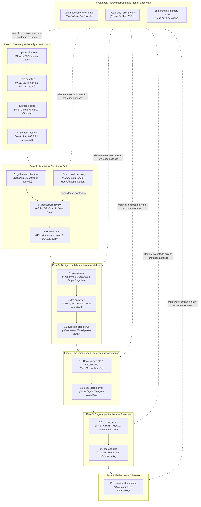
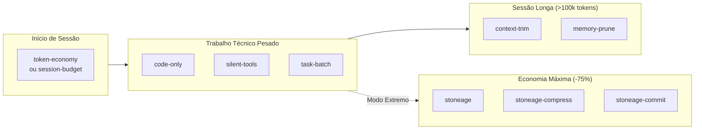

# 🧭 Guia Mestre de Orquestração do Ciclo de Vida: Do Zero ao Release com Skills

**Data**: 07 de Setembro de 2026
**Versão**: 1.0.0
**Status**: Aprovado / Padrão Normativo
**Escopo**: Dual-Harness (Claude Code / OpenClaude & Google Antigravity)
**Autor**: Equipe de Engenharia de IA & Arquitetura de Sistemas

---

## 🎯 1. Visão Geral & Filosofia de Execução

Agentes de inteligência artificial de alta maturidade não devem receber comandos soltos ou agir de maneira desordenada. Quando uma demanda é iniciada "do zero", pular etapas — como codificar antes de validar requisitos de negócio ou desenhar tabelas sem sabatina arquitetural — resulta em **alucinações arquiteturais, retrabalho massivo e queima desnecessária de tokens de contexto**.

A **Biblioteca de Skills de Engenharia** deste ecossistema foi construída para funcionar como um **Pipeline de Engenharia e Produto End-to-End**. Cada skill tem um escopo de atuação bem definido, consome artefatos gerados pela etapa anterior e entrega saídas estruturadas para a fase seguinte.

### ⚠️ O Risco da Desordem

- **Codificar antes de especificar (`product-spec` ausente)**: Gera código sem aderência a regras de negócio e sem testes BDD.
- **Codificar antes da sabatina (`grill-me-architecture` ausente)**: Leva a designs frágeis, problemas de concorrência e retrabalho de esquema de dados.
- **Codificar antes da auditoria de UX (`ux-reviewer` ausente)**: Resulta em telas sobrecarregadas, atrito cognitivo e quebra de WCAG.
- **Subir sem auditoria (`security-audit` ausente)**: Permite injeção de vulnerabilidades OWASP Top 10 e vazamento de segredos.

---

## 🗺️ 2. Mapa Geral do Ciclo de Vida



---

## 📊 3. Matriz Canônica de Execução por Fase

| Ordem  | Fase            | Skill / Comando                                                                                                                                     | Gatilho Típico                                  | Artefato / Saída Esperada                                    |
| :----: | :-------------- | :-------------------------------------------------------------------------------------------------------------------------------------------------- | :---------------------------------------------- | :----------------------------------------------------------- |
| **01** | **Produto**     | [`opportunity-tree`](../../skills/product-management/opportunity-tree/SKILL.md)                                                                     | _"Preciso resolver o problema X para a área Y"_ | Diagrama Mermaid de Árvore Oportunidade-Solução              |
| **02** | **Produto**     | [`pm-prioritize`](../../skills/product-management/pm-prioritize/SKILL.md)                                                                           | _"Temos várias ideias, qual fazer primeiro?"_   | Tabela RICE Score + Classificação Kano                       |
| **03** | **Produto**     | [`product-spec`](../../skills/product-management/product-spec/SKILL.md)                                                                             | _"Vamos detalhar o escopo dessa feature"_       | PRD estruturado em Markdown com BDD (`Given/When/Then`)      |
| **04** | **Produto**     | [`product-metrics`](../../skills/product-management/product-metrics/SKILL.md)                                                                       | _"Como vamos medir o sucesso disso?"_           | Plano de Telemetria e Matriz de Eventos de Produto           |
| **05** | **Arquitetura** | [`grill-me-architecture`](../../skills/software-engineering/grill-me-architecture/SKILL.md)                                                         | _"Questione minha proposta técnica"_            | Relatório de Riscos e Trade-offs estressados                 |
| **06** | **Arquitetura** | [`architecture-review`](../../skills/software-engineering/architecture-review/SKILL.md)                                                             | _"Valide a arquitetura proposta"_               | Arquitetura C4 + Registros de Decisão Arquitetural (ADRs)    |
| **07** | **Arqueologia** | [`forensic-adr-recovery`](../../skills/software-engineering/forensic-adr-recovery/SKILL.md)                                                         | _"Repositório legado sem ADRs documentadas"_    | Catálogo histórico de ADRs recuperado em `docs/adr/`         |
| **08** | **Dados**       | [`db-documentar`](../../skills/data-engineering/db-documentar/SKILL.md)                                                                             | _"Modele as entidades e tabelas"_               | Scripts DDL + Diagrama Entidade-Relacionamento (ERD)         |
| **09** | **UX/UI**       | [`ux-reviewer`](../../skills/design-ui-ux/ux-reviewer/SKILL.md)                                                                                     | _"Avalie a jornada e telas do usuário"_         | Auditoria comportamental (Fogg B=MAP, CREATE)                |
| **10** | **UX/UI**       | [`design-review`](../../skills/design-ui-ux/design-review/SKILL.md)                                                                                 | _"Verifique o Design System e WCAG"_            | Laudo de acessibilidade WCAG 2.2 AAA e tokens                |
| **11** | **UX/UI**       | [`table-review`](../../skills/design-ui-ux/table-review/SKILL.md) / [`liquid-glass-review`](../../skills/design-ui-ux/liquid-glass-review/SKILL.md) | _Se houver tabelas densas ou glassmorphism_     | Otimizações visuais e comportamentais específicas            |
| **12** | **Código**      | **Execução TDD**                                                                                                                                    | _"Implemente os módulos"_                       | Código fonte coberto por testes unitários/integrados         |
| **13** | **Código**      | [`code-documentar`](../../skills/software-engineering/code-documentar/SKILL.md)                                                                     | _"Documente as classes e métodos críticos"_     | Docstrings idiomáticas e type annotations sem ruído          |
| **14** | **Segurança**   | [`security-audit`](../../skills/governance-security/security-audit/SKILL.md)                                                                        | _"Audite a segurança antes de subir"_           | Relatório SAST, OWASP Top 10 e mitigação de vulnerabilidades |
| **15** | **SEO/AEO**     | [`seo-aeo-geo`](../../skills/seo-marketing/seo-aeo-geo/SKILL.md)                                                                                    | _Se for aplicação web/pública_                  | Schema.org, metadados semânticos e otimização para IA        |
| **16** | **Release**     | [`commit-e-documentar`](../../skills/software-engineering/commit-e-documentar/SKILL.md)                                                             | _"Finalize e comite a entrega"_                 | Commits atômicos (Conventional Commits) e Changelog          |

---

## 🔍 4. Detalhamento Passo a Passo

### 🚀 Fase 1: Discovery & Estratégia de Produto

> **Objetivo:** Definir com precisão matemática o problema de negócio, eliminar hipóteses inviáveis e criar especificações executáveis antes de gastar recursos de engenharia.

#### 1. `opportunity-tree`

- **Quando usar:** No momento zero, quando existe um objetivo de negócio amplo (ex: _"Aumentar a retenção de assinantes em 15%"_).
- **Ação do agente:** Mapeia a meta em oportunidades reais levantadas de clientes e soluções potenciais em formato visual Mermaid.
- **Critério de Saída:** Uma árvore de oportunidades validada com hipóteses claras a serem testadas.

#### 2. `pm-prioritize`

- **Quando usar:** Quando há mais de uma solução concorrente ou lista preliminar de histórias de usuário.
- **Ação do agente:** Conduz o ranqueamento por RICE Score ($Reach \times Impact \times Confidence / Effort$), cruza com os atributos Kano (Mandatórios vs. Delighters) e aplica a matriz dos 4 Riscos de Marty Cagan (Valor, Usabilidade, Viabilidade Técnica e Viabilidade de Negócio).
- **Critério de Saída:** Backlog ranqueado de forma determinística, com justificativas explícitas.

#### 3. `product-spec`

- **Quando usar:** Para a funcionalidade prioritária selecionada.
- **Ação do agente:** Produz um PRD canônico completo. Decompõe requisitos funcionais no padrão INVEST e escreve critérios de aceite em BDD Gherkin (`Dado / Quando / Então`).
- **Critério de Saída:** Documento de PRD aprovado pelo Product Manager e Engenharia.

#### 4. `product-metrics`

- **Quando usar:** Imediatamente após a conclusão da especificação funcional.
- **Ação do agente:** Modela a North Star Metric do módulo, seus direcionadores (inputs), projeta o impacto no funil AARRR e gera a tabela canônica de eventos (`event_name`, `properties`, `triggers`) pronta para PostHog, Mixpanel ou Amplitude.
- **Critério de Saída:** Plano de tracking pronto para ser implementado junto com o código.

---

### 🏛️ Fase 2: Arquitetura Técnica & Modelagem de Dados

> **Objetivo:** Garantir solidez estrutural, desacoplamento, resiliência a falhas e coerência do banco de dados antes da digitação do primeiro arquivo de código.

#### 5. `grill-me-architecture`

- **Quando usar:** Antes de fechar o design técnico.
- **Ação do agente:** O agente assume uma postura socrática e hostil, sabatinando o arquiteto/desenvolvedor sobre consistência eventual, pontos únicos de falha (SPOF), locks de banco, concorrência, latência e custos de nuvem.
- **Critério de Saída:** Registro de defesas arquiteturais e vulnerabilidades de design corrigidas.

#### 6. `architecture-review`

- **Quando usar:** Após superar a sabatina.
- **Ação do agente:** Consolida a especificação arquitetural formal: fronteiras de bounded contexts (DDD), diagramas C4 (Context, Container, Component), padrões aplicados (Ports & Adapters, Clean Architecture) e gera as **ADRs (Architecture Decision Records)** numeradas em `docs/adr/`.
- **Critério de Saída:** ADRs persistidas e arquitetura homologada.

#### 7. `forensic-adr-recovery`

- **Quando usar:** Ao assumir repositórios legados, sistemas com histórico no Git mas sem catálogo formal de ADRs, ou com débito documental arquitetural.
- **Ação do agente:** Minera cronologicamente commits, merges e tags, identifica pontos de inflexão estrutural e reconstrói retroativamente as ADRs no formato canônico v2.0.0 em `docs/adr/`, com índice automatizado e linter de CI.
- **Critério de Saída:** Catálogo cronológico de ADRs reconstituído e auditado em `docs/adr/`.

#### 8. `db-documentar`

- **Quando usar:** Logo após a definição de entidades de domínio.
- **Ação do agente:** Gera os scripts DDL ou migrações (SQL / NoSQL), define chaves primárias, índices compostos de alta performance, constraints de integridade e renderiza o diagrama ERD Mermaid.
- **Critério de Saída:** Esquema de banco de dados documentado e migrações geradas.

---

### 🎨 Fase 3: Design, Usabilidade & Acessibilidade

> **Objetivo:** Assegurar que a interface entregue reduza atrito cognitivo, respeite padrões visuais corporativos e atenda universalmente a todos os usuários.

#### 9. `ux-reviewer`

- **Quando usar:** Na prototipação ou validação de layouts e fluxos de navegação.
- **Ação do agente:** Analisa a jornada com base em psicologia comportamental: Fogg Behavior Model ($B = MAP$), framework CREATE (Cue, Reaction, Evaluation, Ability, Timing, Execution) e carga mental (Leis de Hick e Miller).
- **Critério de Saída:** Eliminação de gargalos cognitivos, redução de passos desnecessários e clareza de micro-copy.

#### 10. `design-review`

- **Quando usar:** Na definição ou inspeção dos componentes visuais.
- **Ação do agente:** Avalia o uso rigoroso de tokens de design (espaçamento, tipografia, elevação), paleta semântica e conformidade estrita com **WCAG 2.2 AAA** (contraste mínimo de 7:1, targets de toque de 44x44px, estados de foco).
- **Critério de Saída:** Interface 100% aderente a acessibilidade e anti-slop visual.

#### 11. Especialistas de UI (Contextuais)

- **`table-review`:** Aplicar quando houver grades de dados complexas para auditar ordenação, filtros em lote, pinned columns, paginação no servidor e virtualização de linhas.
- **`liquid-glass-review`:** Aplicar quando o estilo exigir interfaces contemporâneas com glassmorphism, profundidade e materiais translúcidos sem degradação de legibilidade.

---

### 💻 Fase 4: Implementação & Documentação Contínua

> **Objetivo:** Construir o software em ciclos ágeis de Red-Green-Refactor, garantindo código limpo e contratos de código autodocumentados.

#### 12. Construção TDD & Clean Code

- **Execução:** Desenvolvimento guiado a testes unitários e de integração (seguindo os guias de `guides/testing/`).
- **Boas Práticas:** Zero warnings de linter, tipagem estrita e resiliência defensiva (circuit breakers, timeouts).

#### 13. `code-documentar`

- **Quando usar:** Durante ou ao concluir a implementação de serviços, repositórios ou bibliotecas.
- **Ação do agente:** Insere docstrings idiomáticas (JSDoc, PEP 257, PHPDoc ou rustdoc) documentando exceções lançadas, invariantes, parâmetros e tipagem estrita, **sem jamais adicionar comentários redundantes ou óbvios**.
- **Critério de Saída:** Código totalmente autoexplicativo e pronto para inspeção de analisadores estáticos.

---

### 🛡️ Fase 5: Segurança, Auditoria & Presença Digital

> **Objetivo:** Blindar o sistema contra vetores de ataque e garantir que produtos públicos alcancem visibilidade máxima em motores tradicionais e generativos.

#### 14. `security-audit`

- **Quando usar:** Como gate obrigatório antes de qualquer merge ou release.
- **Ação do agente:** Executa auditoria estática SAST: varre o código contra o OWASP Top 10 (SQL injection, XSS, CSRF, IDOR, SSRF), verifica sanitização de inputs, validação de tokens JWT, exposição de segredos e conformidade com LGPD/GDPR.
- **Critério de Saída:** Zero vulnerabilidades críticas ou altas no relatório de auditoria.

#### 15. `seo-aeo-geo` _(Condicional para Frontends Públicos)_

- **Quando usar:** Para websites, landing pages, e-commerces ou plataformas indexáveis.
- **Ação do agente:** Audita e implementa marcações estruturadas JSON-LD (Schema.org), metadados OpenGraph/Twitter Cards, Core Web Vitals (LCP, INP, CLS) e otimização para motores de resposta com IA (AEO/GEO: Perplexity, ChatGPT Search, Gemini).
- **Critério de Saída:** Metadados estruturados e conformidade com indexadores generativos.

---

### 📦 Fase 6: Fechamento, Release & Governança

> **Objetivo:** Encerrar a sessão de trabalho de forma determinística, versionada e auditável.

#### 16. `commit-e-documentar`

- **Quando usar:** No encerramento da demanda.
- **Ação do agente:** Audita o workspace, separa alterações em micro-commits lógicos e atômicos seguindo **Conventional Commits** (`feat:`, `fix:`, `refactor:`, `docs:`), atualiza os arquivos `CHANGELOG.md` e `README.md` e prepara o branch para Pull Request.
- **Alternativa:** Caso a sessão esteja restrita por tokens, utilizar `stoneage-commit` para uma versão ultracompacta.

---

## ⚡ 5. Camada Transversal Contínua: Suíte Token Economy

A suíte de **Economia de Tokens** não deve ser vista como uma etapa no tempo, mas sim como a **gestão de recursos do agente** ao longo de todo o ciclo.



### Guia Rápido de Uso da Suíte de Tokens

- **Ao abrir o agente:** Chame `/token-economy` ou `/session-budget` para orientar o modelo a ser conciso e eliminar preâmbulos conversacionais.
- **Em refatorações ou tarefas de código puras:** Chame `/code-only` e `/silent-tools` para suprimir explicações em prosa e outputs intermediários de terminal.
- **Quando a janela de contexto estiver degradando ou lenta:** Invoque `/context-trim` ou `/memory-prune` para ejetar dados transitórios, logs de erro superados e manter apenas invariantes.
- **Em conexões lentas ou planos limitados de tokens:** Ative o modo `/stoneage` para respostas telegráficas e commits em formato ultra-resumido.

---

## 🚦 6. Cenários de Adoção Rápida

### Cenário A: Projeto Novo do Zero (Greenfield Completo)

> **Trilha:** `opportunity-tree` ➔ `pm-prioritize` ➔ `product-spec` ➔ `product-metrics` ➔ `grill-me-architecture` ➔ `architecture-review` ➔ `db-documentar` ➔ `ux-reviewer` ➔ `design-review` ➔ `Desenvolvimento TDD` ➔ `code-documentar` ➔ `security-audit` ➔ `seo-aeo-geo` ➔ `commit-e-documentar`.

### Cenário B: Nova Funcionalidade em Sistema Existente (Brownfield)

> **Trilha:** `product-spec` ➔ `grill-me-architecture` ➔ `db-documentar` _(se houver novas tabelas)_ ➔ `ux-reviewer` ➔ `Desenvolvimento TDD` ➔ `security-audit` ➔ `commit-e-documentar`.

### Cenário C: Refatoração Técnica / Débito Técnico

> **Trilha:** `code-only` ➔ `grill-me-architecture` ➔ `architecture-review` ➔ `Refatoração com Testes` ➔ `code-documentar` ➔ `security-audit` ➔ `commit-e-documentar`.

### Cenário D: Hotfix Emergencial de Segurança / Correção Rápida

> **Trilha:** `code-only` ➔ `Correção TDD` ➔ `security-audit` ➔ `commit-e-documentar` (ou `stoneage-commit`).

---

## ✅ 7. Checklist Canônico de Entrega (Copie para o PR)

```markdown
### 📋 Checklist de Qualidade do Ciclo de Vida

- [ ] **Produto**: PRD estruturado com cenários BDD (`product-spec`)
- [ ] **Métricas**: Plano de telemetria definido (`product-metrics`)
- [ ] **Arquitetura**: Sabatina arquitetural realizada (`grill-me-architecture`)
- [ ] **Decisões**: ADR registrada em docs/adr/ (`architecture-review`)
- [ ] **Banco de Dados**: DDL e ERD Mermaid sincronizados (`db-documentar`)
- [ ] **UX/Acessibilidade**: WCAG 2.2 AAA e fluxo sem atrito cognitivo (`design-review` & `ux-reviewer`)
- [ ] **Qualidade de Código**: Testes unitários passando e docstrings idiomáticas (`code-documentar`)
- [ ] **Segurança**: Auditoria SAST OWASP Top 10 aprovada sem vulnerabilidades críticas (`security-audit`)
- [ ] **SEO/AEO**: Metadados semânticos validados (`seo-aeo-geo`) [se aplicável]
- [ ] **Release**: Commits atômicos padronizados com Conventional Commits (`commit-e-documentar`)
```
