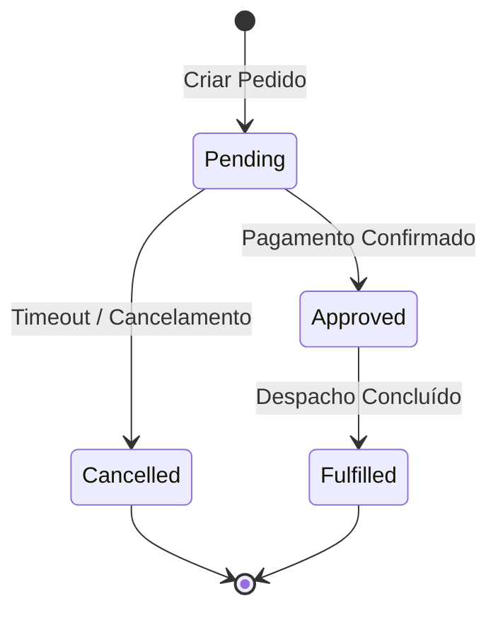

# Padrão Corporativo de Documentação de Domínio e Modelagem DDD (Domain Documentation Standards)

Esta especificação define o padrão normativo e os modelos estruturados para documentação de domínios de negócio, Bounded Contexts e serviços em projetos corporativos. Todos os times de engenharia, arquitetos e assistentes de desenvolvimento devem seguir as diretrizes e esqueletos canônicos deste guia.

---

## 1. Diretório e Estrutura de Pastas Escalável

Para garantir que a documentação técnica cresça de forma organizada junto com os domínios do sistema, os documentos **nunca** devem ser misturados com especificações temporárias ou relatórios soltos.

Toda documentação de domínio deve residir exclusivamente no seguinte padrão de caminho sob a raiz do projeto:

```
docs/domains/{nome_do_dominio_em_snake_case}/
├── overview.md         # Visão Geral do Domínio, Bounded Context e Entidades
├── business-rules.md   # Regras de Negócio, Validações e Matriz de Acesso (RBAC/ABAC)
└── tech-design.md      # Design Técnico, Arquitetura, Schemas e Contratos de API
```

*(Exemplos de domínios universais: `docs/domains/auth/`, `docs/domains/billing/`, `docs/domains/inventory/`, `docs/domains/notifications/`, `docs/domains/audit/`)*

---

## 2. Padrões de Conteúdo e Esqueletos

Cada um dos três arquivos possui um escopo e uma audiência específicos. Devem ser escritos em **Português BR (pt-BR)** e seguir rigidamente os esqueletos a seguir:

### 2.1. Modelo: `overview.md` (Visão Geral)

*   **Público-alvo:** Desenvolvedores, analistas de negócios, tech leads e novos membros da equipe.
*   **Foco:** O que o domínio faz, por que ele existe, problemas que resolve e como as entidades se relacionam no Bounded Context.

```markdown
# Domínio de [Nome do Domínio]: Visão Geral (Overview)

---

## 1. Propósito e Contexto de Negócio
[Descreva em 2-3 parágrafos o papel deste módulo no ecossistema da aplicação, o Bounded Context delimitado, os problemas de negócio que ele resolve e quem são os principais atores e personas impactadas.]

---

## 2. Entidades Principais e Relacionamentos
[Insira o diagrama ER ou de classes em formato ASCII ou Mermaid demonstrando a cardinalidade das entidades de persistência e agregados correspondentes ao domínio.]

### 2.1. [Nome da Entidade / Agregado 1] (ex: `users` / `orders`)
*   **Papel:** [O que esta entidade representa, ex: Usuário, Pedido, Fatura, Item de Inventário, Notificação, Evento de Auditoria]
*   **Atributos de Destaque:** [Identificadores únicos (UUID/ID), chaves estrangeiras, campos com restrição de unicidade e atributos sensíveis (PII/LGPD/GDPR)]

### 2.2. [Nome da Entidade / Agregado 2] (ex: `order_items` / `transactions`)
*   **Papel:** [Descrição da responsabilidade e ciclo de vida da entidade secundária]
*   **Atributos de Destaque:** [Chaves de associação, quantitativos e estados transitórios]

---

## 3. Fluxo de Trabalho Geral (Workflow)
[Descreva as etapas sequenciais de transição do fluxo do domínio, ex: Checkout de Pedido ➔ Reserva de Inventário ➔ Cobrança no Gateway ➔ Emissão de Recibo ➔ Notificação ao Cliente.]
```

### 2.2. Modelo: `business-rules.md` (Regras de Negócio)

*   **Público-alvo:** Product Owners, Engenheiros de Software, QAs e Auditores.
*   **Foco:** Regras de validação de dados, transições de estado permitidas, matriz de permissões (RBAC/ABAC) e conformidade regulatória (LGPD/GDPR).

```markdown
# Domínio de [Nome do Domínio]: Regras de Negócio (Business Rules)

---

## 1. Regras de Validação e Formatação
[Explique detalhadamente cada regra de validação de dados de entrada, restrições de formato, limites numéricos, regras temporais e obrigatoriedade de campos.]

### 1.1. Tabela de Validações
| Campo | Formato / Regra | Obrigatório | Mensagem de Erro |
| :--- | :--- | :--- | :--- |
| `email` | RFC 5322 / formato válido de e-mail | Sim | "E-mail em formato inválido" |
| `amount` | Valor decimal positivo > 0 | Sim | "O valor da transação deve ser superior a zero" |
| `sku` | Alfanumérico `[A-Z0-9-]{6,12}` | Sim | "Código SKU inválido" |

---

## 2. Máquina de Estados e Ciclo de Vida
[Descreva as transições de estado válidas para os agregados do domínio, incluindo condições de guarda e eventos disparados.]



---

## 3. Matriz de Permissões e Acessos (RBAC / ABAC)
[Explique os níveis de controle de acesso baseados em papéis (RBAC) ou atributos (ABAC): Usuário Leitor vs Operador vs Administrador vs Sistema / Service Account.]

| Papel / Perfil | Endpoint / Ação | Permissão | Regra de Escopo / Observação |
| :--- | :--- | :--- | :--- |
| **Cliente / Leitor** | `GET /api/v1/orders/` | Leitura | Restrito aos recursos pertencentes ao próprio `user_id` (Tenant/Ownership) |
| **Operador** | `POST /api/v1/orders/` | Criação | Permite submeter novos pedidos no contexto da organização |
| **Administrador** | `POST/PUT/DELETE /api/v1/*` | Escrita Total | Gestão irrestrita do módulo e parametrização |
| **Auditor / Compliance** | `GET /api/v1/audit-logs/` | Leitura | Acesso a trilhas de auditoria e relatórios de conformidade |

---

## 4. Auditoria, Rastreabilidade e Privacidade (LGPD / GDPR)
*   **Registro Obrigatório de Trilha de Auditoria:** Toda operação mutativa (Criação, Atualização, Exclusão de Estado) deve gerar log estruturado contendo `actor_id`, `action`, `resource_id`, `ip_address`, `timestamp_utc` e diff de dados anteriores vs novos (com dados sensíveis mascarados).
*   **Privacidade e Minimização de Dados (PII):** Atributos sensíveis (senhas, documentos pessoais, tokens de pagamento) devem ser cifrados em repouso e ofuscados em logs e respostas públicas.
*   **Políticas de Retenção e Exclusão:** Mecanismos de soft delete, anonimização e expiração programada conforme compliance do negócio.
```

### 2.3. Modelo: `tech-design.md` (Design Técnico)

*   **Público-alvo:** Engenheiros de Software, Arquitetos de Solução e Tech Leads.
*   **Foco:** Arquitetura em camadas (separação Frontend e Backend), contratos de API (OpenAPI 3.1 / JSON Schema), persistência transacional, resiliência e integradores externos.

```markdown
# Domínio de [Nome do Domínio]: Design Técnico (Tech Design)

---

## 1. Camada Frontend (Agnóstica de Framework)
[Descreva a arquitetura client-side do domínio, fluxo de dados e separação de responsabilidades na interface.]

*   **Arquitetura de Componentes de UI:** Separação estrita entre Componentes de Apresentação (Stateless / Presentational) e Componentes Contêiner (Stateful / Smart Components).
*   **Gerenciamento de Estado:**
    *   *Estado Local:* Dados efêmeros de UI e interação.
    *   *Estado Global da Aplicação:* Sessão, preferências e estados compartilhados entre módulos.
    *   *Cache de Servidor / Remote State:* Sincronização, invalidação e revalidação de dados remotos.
*   **Camada de Transporte e Cliente de API:** Abstração de cliente HTTP/WebSocket, interceptors de autenticação e normalização de DTOs para Entidades de Domínio de UI.
*   **Invariantes de Validação e Feedback ao Usuário:** Validação síncrona/reativa em formulários, estados de transição (loading/skeleton), feedback de erro contextual e recuperação graciosa.

---

## 2. Camada Backend (Agnóstica de Stack)
[Descreva a arquitetura server-side baseada em DDD e Clean Architecture.]

*   **Camada de Apresentação / Borda:** Controllers, Handlers de Mensagens/Eventos, definição de Rotas e Middlewares de validação/autenticação.
*   **Camada de Aplicação:** Casos de Uso (Use Cases), Application Services, orquestração de operações e comandos/consultas.
*   **Camada de Domínio:** Entidades de Negócio, Agregados, Value Objects, Regras e Invariantes Centrais, Domain Services e Domain Events.
*   **Camada de Infraestrutura e Persistência:** Implementações de Repositórios, Gateways, Adapters de Banco de Dados (SQL/NoSQL) e mensageria externa.
*   **Contratos e DTOs Tipados Formais:** Definição de contratos formais de entrada e saída via OpenAPI 3.1, Schemas JSON ou interfaces/tipos estritos da linguagem.

---

## 3. Acesso a Dados, Persistência e Transacionalidade
[Descreva a estratégia de queries parametrizadas (Prepared Statements / ORM seguro), índices necessários para performance e controle de transações ACID.]

---

## 4. Assinatura de Endpoints (API Layer)
*   **Caminho:** `MÉTODO /api/v1/{recurso}`
*   **Autenticação / Autorização:** `Bearer JWT`, validação de escopos/policies (RBAC/ABAC)
*   **Payload de Entrada (Input):** `SchemaIn` / DTO formal tipado
*   **Payload de Saída (Output):** `SchemaOut` / DTO formal tipado
*   **Códigos de Resposta HTTP Mapeados:**
    *   HTTP 200 / 201: Sucesso na operação
    *   HTTP 400 (`Bad Request`): Dados ou formato de requisição inválidos
    *   HTTP 401 (`Unauthorized`): Token ausente, inválido ou expirado
    *   HTTP 403 (`Forbidden`): Usuário autenticado sem permissão para o recurso
    *   HTTP 404 (`Not Found`): Registro ou entidade não encontrada
    *   HTTP 409 (`Conflict`): Violação de unicidade ou concorrência
    *   HTTP 422 (`Unprocessable Entity`): Falha de validação semântica de regras de negócio
    *   HTTP 500 (`Internal Server Error`): Erro inesperado interno

---

## 5. Resiliência, Filas e Eventos Assíncronos
[Descreva se o domínio publica/consome eventos assíncronos (Message Brokers / Queues), políticas de retry com backoff exponencial, chave de idempotência e timeouts.]
```

---

## 3. Diretrizes de Aplicação e Governança (Como Usar)

Sempre que engenheiros, arquitetos ou assistentes de desenvolvimento forem demandados para:

*   *"Documente o domínio X"*
*   *"Crie a especificação de regras de negócio de X"*
*   *"Explique como o módulo X está estruturado"*

Deve-se consultar este padrão normativo, criar o diretório correspondente em `docs/domains/{dominio}/` e instanciar os documentos seguindo rigorosamente os modelos definidos acima.
