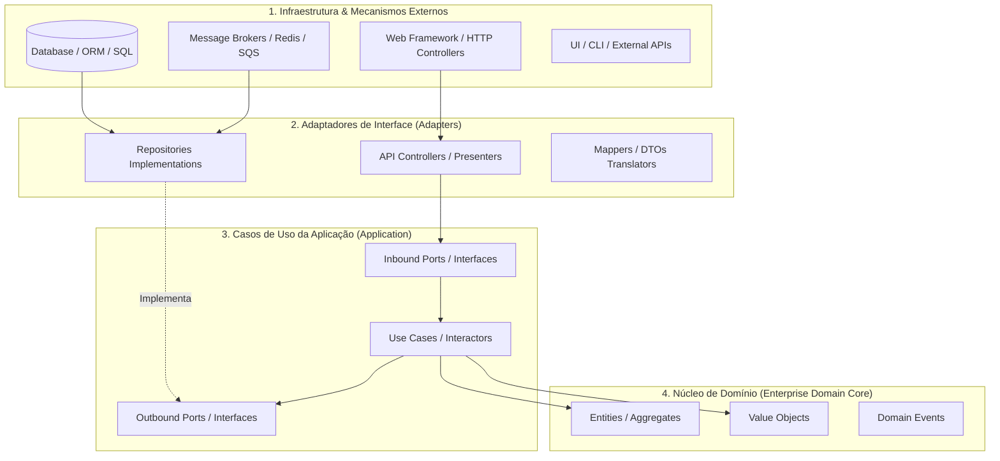
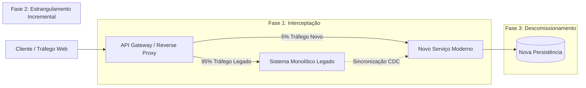

---

title: Guia Definitivo de Arquitetura de Software, Design Patterns e Clean Code
description: Manual técnico e framework de engenharia de software para arquiteturas resilientes, Clean Architecture, Hexagonal, Monólitos Modulares, princípios SOLID rigorosos, Clean Code e padrões de refatoração contínua.
version: 1.1.0
date: 2026-09-09
author: Comitê Corporativo de Arquitetura & Engenharia de Software
---

<!-- markdownlint-disable MD022 MD025 MD031 MD032 MD040 MD026 -->

<!--
LOG DE MANUTENÇÃO E ALTERAÇÕES DO DOCUMENTO

| Data          | Autor                                                      | Descrição da Alteração                                                                 |
| ------------- | ---------------------------------------------------------- | -------------------------------------------------------------------------------------- |
| 2026-09-04    | Comitê Corporativo de Arquitetura & Engenharia de Software | Criação do Guia Definitivo de Arquitetura de Software, Design Patterns e Clean Code    |
|               |                                                            | (v1.0.0) — Síntese exaustiva multi-paradigma, Clean/Hexagonal Architecture, SOLID,     |
|               |                                                            | GoF Patterns, Refatoração Strangler Fig, Anti-Padrões Fatais e Governança Técnica.    |
| 2026-09-09    | Comitê Corporativo de Arquitetura & Engenharia de Software | v1.1.0 — Padronização de governança institucional, delimitação explícita de Clean      |
|               |                                                            | Architecture para Frontend (Client-side) vs Backend (Server-side) e neutralização dos |
|               |                                                            | exemplos conceituais de código para formato não-normativo/poliglota.                  |

=================================================================================
-->

> **Manifesto de Engenharia de Software:** *Arquitetura de software não é um diagrama imutável em uma apresentação executiva, nem a busca dogmática por abstrações infinitas. Arquitetura é a disciplina contínua de tomar decisões estruturais deliberadas, gerenciar trade-offs sob incerteza e isolar a política de negócio dos detalhes voláteis de tecnologia. O bom design preserva a reversibilidade das escolhas, mantém o custo da mudança previsível e viabiliza que o software seja lido, compreendido e estendido por outros engenheiros ao longo de décadas.*

---

## 🧭 Relação com o Ecossistema de Guias Técnicos

Este documento compõe a tríade fundamental de engenharia de sistemas deste repositório:

1. **Guia de System Design & Sistemas Distribuídos:** Foco na macro-arquitetura, topologias físicas, particionamento horizontal, consistência distribuída (Teoremas CAP e PACELC), sharding de dados, balanceamento de carga e topologia de rede.
2. **Guia de Padrões de Resiliência Defensiva (`guia-padroes-resiliencia-defensiva.md`):** Foco na estabilidade em tempo de execução, falhas transitórias, circuit breakers, retries exponenciais, rate limiting, bulkheads, timeouts e transações assíncronas com Transactional Outbox.
3. **Guia de Arquitetura de Software, Design Patterns e Clean Code (Este Guia):** Foco na micro e meso-arquitetura, separação de conceitos (*Separation of Concerns*), isolamento de domínio, regras incondicionais de dependência, Ports & Adapters, SOLID profundo, modelos ricos contra anêmicos, catálogo crítico de GoF e refatoração incremental de legados.

---

## 📑 Sumário Executivo

1. [O Foco Fundamental da Arquitetura de Software](#1-o-foco-fundamental-da-arquitetura-de-software)
   - [1.1. Definições Formais e Operações Intelectuais da IEEE](#11-definições-formais-e-operações-intelectuais-da-ieee)
   - [1.2. Requisitos de Atributos de Qualidade (QARs / "-ilities")](#12-requisitos-de-atributos-de-qualidade-qars---ilities)
   - [1.3. Macro vs Micro: O Limiar da Arquitetura](#13-macro-vs-micro-o-limiar-da-arquitetura)
   - [1.4. O Custo de Reverter Decisões: Portas Unidirecionais vs Bidirecionais](#14-o-custo-de-reverter-decisões-portas-unidirecionais-vs-bidirecionais)
2. [Arquitetura Contínua e Decisões Técnicas (ADRs)](#2-arquitetura-contínua-e-decisões-técnicas-adrs)
   - [2.1. O Ciclo Empírico: Arquitetura como Hipótese e Teste](#21-o-ciclo-empírico-arquitetura-como-hipótese-e-teste)
   - [2.2. Capturando o "Porquê": O Modelo Canônico de ADR](#22-capturando-o-porquê-o-modelo-canônico-de-adr)
   - [2.3. Dívida Técnica Consciente vs Negligente: A Lição do Y2K](#23-dívida-técnica-consciente-vs-negligente-a-lição-do-y2k)
3. [Papel, Responsabilidades e Dimensões do Arquiteto](#3-papel-responsabilidades-e-dimensões-do-arquiteto)
   - [3.1. 50% Liderança Técnica / 50% Hands-On](#31-50-liderança-técnica--50-hands-on)
   - [3.2. A Arte da Tradução Técnico-Negócio e Negociação de Trade-offs](#32-a-arte-da-tradução-técnico-negócio-e-negociação-de-trade-offs)
   - [3.3. Níveis de Arquitetura: Application vs Solution vs Enterprise](#33-níveis-de-arquitetura-application-vs-solution-vs-enterprise)
4. [Modelagem, Visualização e Documentação Viva](#4-modelagem-visualização-e-documentação-viva)
   - [4.1. O Modelo 4+1 de Kruchten](#41-o-modelo-41-de-kruchten)
   - [4.2. C4 Model (Simon Brown): Zoom Arquitetural Estruturado](#42-c4-model-simon-brown-zoom-arquitetural-estruturado)
   - [4.3. Docs-as-Code, arc42 e Fitness Functions Automatizadas](#43-docs-as-code-arc42-e-fitness-functions-automatizadas)
5. [Estilos e Padrões Arquiteturais](#5-estilos-e-padrões-arquiteturais)
   - [5.1. Monólito Modular (Modular Monolith)](#51-monólito-modular-modular-monolith)
   - [5.2. Arquitetura em Camadas (Layered / N-Tier Architecture)](#52-arquitetura-em-camadas-layered--n-tier-architecture)
   - [5.3. Clean Architecture, Hexagonal (Ports & Adapters) e Onion Architecture](#53-clean-architecture-hexagonal-ports--adapters-e-onion-architecture)
     - [5.3.1. Clean Architecture no Backend (Server-side)](#531-clean-architecture-no-backend-server-side)
     - [5.3.2. Clean Architecture no Frontend (Client-side)](#532-clean-architecture-no-frontend-client-side)
     - [5.3.3. Matriz Comparativa: Simetria Hexagonal Frontend vs Backend](#533-matriz-comparativa-simetria-hexagonal-frontend-vs-backend)
     - [5.3.4. Exemplo Conceitual Ilustrativo: Hexagonal / Clean Architecture](#534-exemplo-conceitual-ilustrativo-não-normativo--poliglota-hexagonal--clean-architecture)
   - [5.4. Microsserviços e Sistemas Distribuídos](#54-microsserviços-e-sistemas-distribuídos)
   - [5.5. Event-Driven Architecture (EDA), CQRS e Event Sourcing](#55-event-driven-architecture-eda-cqrs-e-event-sourcing)
   - [5.6. Estilos Complementares: Microkernel, Space-Based e Blackboard](#56-estilos-complementares-microkernel-space-based-e-blackboard)
   - [5.7. Matriz Comparativa Definitiva de Estilos Arquiteturais](#57-matriz-comparativa-definitiva-de-estilos-arquiteturais)
6. [Princípios Fundamentais de Design de Software](#6-princípios-fundamentais-de-design-de-software)
   - [6.1. SOLID Exaustivo com Rigor Formal e Código Idiomático](#61-solid-exaustivo-com-rigor-formal-e-código-idiomático)
   - [6.2. Princípios Adicionais de Engenharia de Software](#62-princípios-adicionais-de-engenharia-de-software)
   - [6.3. Princípios de Coesão e Acoplamento de Componentes (REP, CCP, CRP, ADP, SDP, SAP)](#63-princípios-de-coesão-e-acoplamento-de-componentes-rep-ccp-crp-adp-sdp-sap)
7. [Clean Code e Engenharia de Código Prático](#7-clean-code-e-engenharia-de-código-prático)
   - [7.1. Nomenclatura Expressiva e Semântica](#71-nomenclatura-expressiva-e-semântica)
   - [7.2. Funções Pequenas e SLAP (Single Level of Abstraction Principle)](#72-funções-pequenas-e-slap-single-level-of-abstraction-principle)
   - [7.3. Banimento de Flag Arguments e Tratamento Rigoroso de Nulos](#73-banimento-de-flag-arguments-e-tratamento-rigoroso-de-nulos)
   - [7.4. Manter o Código de Framework Distante (Screaming Architecture)](#74-manter-o-código-de-framework-distante-screaming-architecture)
   - [7.5. Tratamento Defensivo de Erros e Domain Exceptions](#75-tratamento-defensivo-de-erros-e-domain-exceptions)
   - [7.6. Imutabilidade e Value Objects contra Primitive Obsession](#76-imutabilidade-e-value-objects-contra-primitive-obsession)
   - [7.7. A Filosofia dos Comentários: Apenas o "Porquê"](#77-a-filosofia-dos-comentários-apenas-o-porquê)
   - [7.8. Command Query Separation (CQS) de Bertrand Meyer](#78-command-query-separation-cqs-de-bertrand-meyer)
8. [Catálogo Prático de Design Patterns GoF e Seus Trade-offs](#8-catálogo-prático-de-design-patterns-gof-e-seus-trade-offs)
   - [8.1. Padrões Criacionais (Factory Method, Abstract Factory, Builder, Singleton Crítico)](#81-padrões-criacionais)
   - [8.2. Padrões Estruturais (Adapter, Decorator, Facade, Composite, Proxy)](#82-padrões-estruturais)
   - [8.3. Padrões Comportamentais (Strategy, Observer, Command, Template Method, State)](#83-padrões-comportamentais)
9. [Refatoração Contínua e Migração Arquitetural](#9-refatoração-contínua-e-migração-arquitetural)
   - [9.1. Strangler Fig Pattern: Migração Sem Big-Bang](#91-strangler-fig-pattern-migração-sem-big-bang)
   - [9.2. Branch by Abstraction: Evolução Contínua em Produção](#92-branch-by-abstraction-evolução-contínua-em-produção)
   - [9.3. Code Smells Críticos e Técnicas de Desmantelamento](#93-code-smells-críticos-e-técnicas-de-desmantelamento)
10. [Catálogo de Anti-Padrões Arquiteturais Fatais](#10-catálogo-de-anti-padrões-arquiteturais-fatais)
11. [Matriz Diagnóstica: Sintoma ➔ Causa Raiz ➔ Padrão Recomendado](#11-matriz-diagnóstica-sintoma--causa-raiz--padrão-recomendado)
12. [Checklist de Governança Arquitetural e Code Review](#12-checklist-de-governança-arquitetural-e-code-review)
13. [Referências Canônicas e Bibliografia](#13-referências-canônicas-e-bibliografia)

---

## 1. O Foco Fundamental da Arquitetura de Software

### 1.1. Definições Formais e Operações Intelectuais da IEEE

A definição clássica padronizada pela **IEEE Computer Society (IEEE 1471 / ISO/IEC/IEEE 42010)** estabelece a arquitetura como:

> *"A organização fundamental de um sistema incorporada em seus componentes, suas relações uns com os outros e com o ambiente, e os princípios que guiam seu projeto e evolução."*

A disciplina repousa fundamentalmente sobre três operações intelectuais centrais:

1. **Abstração:** Capacidade de omitir detalhes acidentais de implementação para focar exclusivamente nos aspectos essenciais do problema e do comportamento externo dos subsistemas.
2. **Decomposição:** Ato de particionar um problema complexo em subsistemas ou módulos menores e altamente coesos (*Separation of Concerns*), minimizando o acoplamento mútuo.
3. **Composição:** Coordenação estruturada, orquestração e protocolo de comunicação entre os módulos individuais para formar um sistema integrado que satisfaça os objetivos globais.

A arquitetura não se ocupa dos detalhes internos de uma função utilitária ou do nome de uma variável local; ela estabelece os limites estruturais que impedem que o sistema colapse sob a pressão de seu próprio crescimento. A engenharia reversa da arquitetura — tentar inferir a arquitetura original lendo apenas o código-fonte em produção — é amplamente desaconselhada pela literatura acadêmica: o código revela **o que** está rodando, mas apaga irremediavelmente as hipóteses, os trade-offs e o **porquê** das restrições impostas.

### 1.2. Requisitos de Atributos de Qualidade (QARs / "-ilities")

Requisitos funcionais definem o que o sistema realiza (ex.: *“O usuário transfere R$ 100 via PIX”*). Requisitos de Atributos de Qualidade (*Quality Attribute Requirements* - QARs), tradicionalmente conhecidos como requisitos não-funcionais ou as “-ilities”, ditam **quão bem** o sistema se comporta sob condições de estresse, concorrência, falha e evolução temporal:

```text
                                  ┌──────────────────────────┐
                                  │   ATRIBUTOS DE QUALIDADE │
                                  │      (Os "-ilities")     │
                                  └─────────────┬────────────┘
         ┌──────────────────┬───────────────────┼───────────────────┬──────────────────┐
         ▼                  ▼                   ▼                   ▼                  ▼
┌─────────────────┐┌─────────────────┐┌─────────────────┐┌─────────────────┐┌─────────────────┐
│ Escalabilidade  ││ Disponibilidade ││ Confiabilidade   ││ Manutenibilidade││ Segurança       │
│ - Vazão (RPS)   ││ - SLO / SLA     ││ - MTBF / MTTR    ││ - Coesão/Acopl. ││ - Confidencial. │
│ - Elasticidade  ││ - Redundância   ││ - Idempotência   ││ - Modularidade  ││ - Integridade   │
│ - Latência P99  ││ - Failover      ││ - Self-healing   ││ - Testabilidade ││ - Auditabilidade│
└─────────────────┘└─────────────────┘└─────────────────┘└─────────────────┘└─────────────────┘
```

Os principais QARs que guiam a arquitetura de software são:

- **Escalabilidade (Scalability):** Capacidade de sustentar volume crescente de trabalho adicionando recursos de hardware (escala vertical vs horizontal) sem degradação proporcional de latência.
- **Disponibilidade (Availability):** Percentual de tempo em que o sistema está operacional e apto a responder requisições válidas ($A = \frac{\text{MTBF}}{\text{MTBF} + \text{MTTR}}$).
- **Confiabilidade (Reliability):** Garantia de execução determinística e correta ao longo do tempo, mesmo na presença de falhas transitórias de infraestrutura.
- **Manutenibilidade (Maintainability):** Facilidade e custo temporal de introduzir novas capacidades, corrigir defeitos ou ajustar comportamentos sem efeitos colaterais catastróficos.
- **Testabilidade (Testability):** Grau em que o design permite isolar módulos em ambientes herméticos e simular estados determinísticos sem recorrer a infraestrutura externa complexa.
- **Segurança (Security):** Mecanismos de autenticação, autorização granular (RBAC/ABAC), cifra de dados em trânsito/repouso e integridade das fronteiras de confiança.

### 1.3. Macro vs Micro: O Limiar da Arquitetura

A linha demarcatória entre arquitetura e design de código é frequentemente mal compreendida:

| Dimensão | Macro-Arquitetura | Micro-Arquitetura / Design de Software |
| :--- | :--- | :--- |
| **Escopo** | Sistema global, fronteiras de domínios, protocolos de comunicação entre serviços. | Módulos internos, classes, funções, interfaces locais e estruturas de dados. |
| **Público** | Equipes de engenharia, CTO, Arquitetos Corporativos, Operações/DevOps. | Engenheiros atuando dentro do repositório ou Bounded Context específico. |
| **Foco Central** | Estilo arquitetural (Monólito vs Microsserviços vs EDA), topologia, persistência primária. | Aplicação de SOLID, Design Patterns GoF, encapsulamento, nomes e Clean Code. |
| **Impacto do Erro** | Meses de retrabalho, reescrita de subsistemas, migração de dados multimilionária. | Refatoração localizada em um sprint, revisão de PR e substituição de interface. |

Como sintetizou Martin Fowler: *"Arquitetura é tudo aquilo que é importante — e que é difícil de mudar mais tarde."*

### 1.4. O Custo de Reverter Decisões: Portas Unidirecionais vs Bidirecionais

Jeff Bezos popularizou a analogia de governança corporativa entre decisões de **Tipo 1 (Portas Unidirecionais)** e **Tipo 2 (Portas Bidirecionais)**, que se aplica diretamente à arquitetura de software:

- **Decisões Tipo 1 (Portas Unidirecionais / Irreversíveis):** Atravessar a porta significa que o custo financeiro, operacional ou técnico de retornar ao estado anterior é proibitivo. Exemplos: escolha do paradigma do banco de dados primário (Relacional ACID vs NoSQL de Documentos); particionamento de um monólito em dezenas de microsserviços; protocolo binário de comunicação entre sistemas legados. Devem ser tomadas metodicamente, com experimentação empírica (Spikes/PoCs) e ampla documentação.
- **Decisões Tipo 2 (Portas Bidirecionais / Reversíveis):** Atravessar a porta permite retornar facilmente caso a hipótese se mostre inválida. Exemplos: escolha de uma biblioteca de serialização JSON; implementação interna de um algoritmo com Strategy; estrutura de um DTO de entrada. Devem ser delegadas à equipe e decididas com extrema agilidade.

```text
                          ┌────────────────────────────────┐
                          │   PROPOSTA DE DECISÃO TÉCNICA  │
                          └───────────────┬────────────────┘
                                          │
                        O custo de desfazer é proibitivo?
                                 /                \
                             SIM /                  \ NÃO
                                ▼                    ▼
                    ┌───────────────────────┐   ┌───────────────────────┐
                    │ DECISÃO DE TIPO 1     │   │ DECISÃO DE TIPO 2     │
                    │ (Porta Unidirecional) │   │ (Porta Bidirecional)  │
                    ├───────────────────────┤   ├───────────────────────┤
                    │ - Spike / PoC empírica│   │ - Decisão rápida      │
                    │ - Avaliação de QARs   │   │ - Autonomia do time   │
                    │ - ADR obrigatória     │   │ - Refatoração se falha│
                    │ - Revisão colegiada   │   │ - Reversão barata     │
                    └───────────────────────┘   └───────────────────────┘
```

A maior meta de uma boa arquitetura de software é **preservar a reversibilidade**: desacoplar detalhes de modo que decisões de Tipo 1 sejam adiadas até o *Último Momento Responsável* (*Last Responsible Moment*), mantendo a flexibilidade estratégica pelo maior tempo possível.

---

## 2. Arquitetura Contínua e Decisões Técnicas (ADRs)

### 2.1. O Ciclo Empírico: Arquitetura como Hipótese e Teste

Historicamente, o modelo tradicional concebia a arquitetura como um processo *Up-Front* (Big Design Up Front - BDUF), no qual todas as interfaces, bancos e diagramas eram desenhados antes da primeira linha de código. Essa abordagem falha catastroficamente porque o software evolui em um ambiente de incerteza ontológica de negócio e tecnológica.

Pierre Pureur e Kurt Bittner (*Continuous Architecture*) reformularam a disciplina: software não é uma catedral estática; software é um ecossistema adaptativo vivo. O ciclo central de arquitetura contínua opera como um processo científico:

1. **Formular a Hipótese:** *“Adotar particionamento de leitura/escrita via CQRS reduzirá a latência P99 do catálogo para menos de 45ms sob 5.000 RPS.”*
2. **Construir a Menor Experiência (Spike/Benchmark):** Implementar um protótipo hermético instrumentado.
3. **Medir os Resultados:** Submeter o protótipo a testes de carga com dados reais.
4. **Decidir e Formalizar:** Se comprovado, registrar a decisão arquitetural; se refutado, descartar a hipótese sem que o sistema principal seja poluído.

### 2.2. Capturando o "Porquê": O Modelo Canônico de ADR

O código-fonte é excelente para revelar **o que** o software faz; ele é totalmente cego sobre **por que** foi feito daquela forma e **quais alternativas foram rejeitadas**. Quando um engenheiro encontra um trecho incomum de código sem justificativa, ocorrem duas tragédias: ou ele não mexe por medo (gerando paralisia), ou ele remove uma salvaguarda crítica acreditando ser lixo de legado.

O **Architecture Decision Record (ADR)** é o documento técnico imutável que registra uma decisão arquitetural relevante. O padrão oficial adotado neste repositório segue o formato estruturado a seguir:

```markdown
# ADR-0042: Adoção de Transactional Outbox Pattern para Notificação de Eventos de Cobrança

- **Status:** Aceito (Proposto | Aceito | Substituído | Depreciado)
- **Data:** 2026-09-04
- **Autor:** Comitê Corporativo de Arquitetura & Engenharia de Software
- **Stakeholders:** Time de Pagamentos, Time de Infraestrutura / Mensageria

## 1. Contexto e Declaração do Problema
O serviço de faturamento precisa debitar clientes e emitir eventos assíncronos no Apache Kafka para notificar os subsistemas de Nota Fiscal e Auditoria. Atualmente, a aplicação grava no PostgreSQL e, imediatamente a seguir, executa `kafkaProducer.send()`. Durante falhas de rede com o broker ou reinicializações do contêiner entre a escrita no banco e a emissão da mensagem, transações foram completadas financeiramente sem a emissão do evento correspondente, gerando inconsistência grave no balanço financeiro.

## 2. Direcionadores de Decisão (QARs & Restrições de Negócio)
- Consistência de Dados: Garantia estrita de que nenhum débito seja gravado sem a emissão garantida de seu evento (Consistência At-Least-Once).
- Latência de Checkout: O tempo de resposta HTTP do endpoint de pagamento não pode ultrapassar 300ms (P95).
- Resiliência a Particionamento de Rede: O checkout não pode abortar se o broker de mensagens estiver temporariamente inacessível.

## 3. Opções Consideradas
1. **Transações Distribuídas 2-Phase Commit (2PC / XA):**
   - *Vantagens:* Consistência imediata entre banco e mensageria.
   - *Desvantagens:* Kafka não suporta nativamente XA; alto bloqueio de threads de banco; latência proibitiva; risco de SPOF.
2. **Dual-Write com Retry Assíncrono em Memória:**
   - *Vantagens:* Simplicidade trivial de implementação.
   - *Desvantagens:* Perda de eventos se a instância morrer (SIGKILL / OOM); impossibilidade de garantir atomicidade sem persistência unificada.
3. **Transactional Outbox Pattern com Polling Debezium / CDC:**
   - *Vantagens:* Atomicidade perfeita (mesma transação relacional ACID do pagamento grava na tabela `outbox_events`); o Debezium lê o WAL do PostgreSQL sem onerar a aplicação; desacoplamento total da disponibilidade do Kafka.
   - *Desvantagens:* Complexidade adicional de infraestrutura (manutenção de conector Kafka Connect / Debezium); consistência eventual downstream.

## 4. Decisão Aprovada
Optamos pela Opção 3: Implementar o **Transactional Outbox Pattern** com tabela dedicada `outbox_events` na mesma base relacional do domínio financeiro, utilizando **Debezium CDC** para publicação no Kafka.

## 5. Consequências e Trade-offs
### Positivas
- Eliminação definitiva de "eventos fantasmas" e pagamentos não notificados.
- Resiliência total: o checkout funciona normalmente mesmo se o Kafka cluster estiver fora do ar por horas.
- Auditabilidade transacional completa via histórico da tabela de Outbox.

### Negativas / Custos Mitigados
- **Consistência Eventual:** Os consumidores devem tolerar pequenos atrasos na entrega dos eventos (latência média de CDC < 250ms).
- **Mensagens Duplicadas:** O conector Debezium garante entrega *at-least-once*, exigindo que todos os serviços consumidores implementem idempotência estrita via chave de deduplicação (`idempotency_key`).
```

### 2.3. Dívida Técnica Consciente vs Negligente: A Lição do Y2K

Dívida técnica não é sinônimo de "código mal escrito por desleixo". Martin Fowler categorizou a dívida técnica em quatro quadrantes: **Prudente vs Imprudente** e **Deliberada vs Inadvertida**.

```text
                           DELIBERADA (Consciente)
                     ┌──────────────────────────────────┐
                     │ "Precisamos lançar agora;        │
                     │  aceitamos as consequências e    │
                     │  refatoraremos no sprint X."     │
                     │  ➔ Dívida Técnica Prudente       │
                     └────────────────┬─────────────────┘
                                      │
           PRUDENTE                   │                   IMPRUDENTE
      ────────────────────────────────┼────────────────────────────────
                                      │
                     ┌────────────────┴─────────────────┐
                     │ "Não temos tempo para design;    │
                     │  apenas faça funcionar logo sem  │
                     │  testes ou padrões."             │
                     │  ➔ Dívida Técnica Negligente     │
                     └──────────────────────────────────┘
                          INADVERTIDA (Inconsciente)
```

O clássico incidente do **Bug do Milênio (Y2K)** exemplifica a dívida técnica consciente que degenerou por falta de documentação de premissas. Nos anos 1960 e 1970, armazenar o ano com 2 dígitos (`YY` em vez de `YYYY`) foi uma decisão de engenharia brilhante e econômica: cada byte em fitas magnéticas e cartões perfurados custava fortunas. O problema não foi a economia inicial, mas sim o **abandono da premissa**: não foi registrado que aquela decisão assumia um horizonte temporal que expiraria antes do ano 2000. Décadas depois, os sistemas ainda rodavam e ninguém compreendia o risco, culminando em custos globais astronômicos de correção de emergência.

A regra de ouro da arquitetura: **toda dívida técnica assumida conscientemente deve possuir uma ADR associada, uma premissa clara de expiração e uma issue de pagamento no backlog técnico.**

---

## 3. Papel, Responsabilidades e Dimensões do Arquiteto

### 3.1. 50% Liderança Técnica / 50% Hands-On

O anti-padrão mais nocivo na indústria é o *"Ivory Tower Architect"* (Arquiteto de Torre de Marfim) — o profissional que desenha caixas e flechas no Miro ou Visio, mas desconhece o atrito diário das ferramentas de build, os bugs das bibliotecas, as limitações do framework e o impacto de suas decisões no código real.

O modelo de excelência técnica preconiza a proporção **50/50**:
- **50% Liderança Técnica e Estratégia:** Definição de visões, elicitação de QARs com C-Levels e Product Managers, escrita de ADRs, desenho de limites de domínio (DDD), mitigação de riscos sistêmicos e governança.
- **50% Engenharia Hands-On:** Pareamento com desenvolvedores, implementação de Provas de Conceito (PoCs/Spikes), revisão de Pull Requests críticos, condução de post-mortems de incidentes e codificação dos frameworks internos ou bibliotecas de fundação.

Engenheiros respeitam arquitetos que conhecem o código. Decisões tomadas por quem sente a dor da compilação e do deploy são ordens de grandeza mais pragmáticas e eficazes.

### 3.2. A Arte da Tradução Técnico-Negócio e Negociação de Trade-offs

A competência mais rara de um Arquiteto Principal não é dominar álgebra relacional ou os algoritmos do Raft, mas atuar como **tradutor de impedâncias** entre o mundo dos negócios e a engenharia de software:

```text
┌────────────────────────────────────────┐       ┌────────────────────────────────────────┐
│           JARGÃO TÉCNICO               │       │           IMPACTO DE NEGÓCIO           │
├────────────────────────────────────────┤       ├────────────────────────────────────────┤
│ "Precisamos refatorar o núcleo para    │  ═══> │ "Esta mudança reduzirá o custo de      │
│ isolar os use cases em Hexagonal."     │       │ onboarding de novos canais de vendas de│
│                                        │       │ 6 semanas para 3 dias úteis."          │
├────────────────────────────────────────┤       ├────────────────────────────────────────┤
│ "Nosso gargalo é a contenção de locks  │  ═══> │ "No pico da Black Friday, 12% das      │
│ e isolamento Serializable no Postgres."│       │ compras falharão se não migrarmos para │
│                                        │       │ reserva assíncrona de estoque."        │
├────────────────────────────────────────┤       ├────────────────────────────────────────┤
│ "A cobertura de testes unitários hermé-│  ═══> │ "Reduziremos os incidentes em produção │
│ ticos no domínio é inferior a 30%."    │       │ pela metade, cortando o custo com time │
│                                        │       │ de suporte em chamados de clientes."   │
└────────────────────────────────────────┘       └────────────────────────────────────────┘
```

Negociação arquitetural exige tornar os trade-offs explícitos. Não existe *"solução perfeita"*; existem apenas combinações distintas de vantagens e desvantagens. Se o negócio exige redução drástica no tempo de lançamento (*Time-to-Market*), o arquiteto deve demonstrar formalmente quais QARs estão sendo comprometidos (ex.: flexibilidade futura ou manutenibilidade) e registrar o acordo em ata e ADR.

### 3.3. Níveis de Arquitetura: Application vs Solution vs Enterprise

A complexidade arquitetural opera em três níveis fundamentais:

```text
┌────────────────────────────────────────────────────────────────────────┐
│ ENTERPRISE ARCHITECTURE (Corporativa)                                  │
│ - Alinhamento entre TI e estratégia de negócios de longo prazo.        │
│ - Padrões de interoperabilidade entre dezenas de sistemas legados.     │
│ - Governança corporativa, conformidade regulatória (LGPD, SOX, PCI).   │
│ - Ciclo de vida de plataformas e portfólio tecnológico global.         │
└───────────────────────────────────┬────────────────────────────────────┘
                                    │
                                    ▼
┌────────────────────────────────────────────────────────────────────────┐
│ SOLUTION ARCHITECTURE (Solução)                                        │
│ - Design de sistemas ponta a ponta para resolver uma dor de negócio.   │
│ - Integração entre múltiplos produtos, serviços e APIs parceiras.      │
│ - Seleção de tecnologias (bancos, mensageria, nuvem) para a solução.   │
│ - Garantia do cumprimento dos SLAs globais do produto.                 │
└───────────────────────────────────┬────────────────────────────────────┘
                                    │
                                    ▼
┌────────────────────────────────────────────────────────────────────────┐
│ APPLICATION / TECHNICAL ARCHITECTURE (Aplicação)                       │
│ - Estruturação interna de um serviço ou código-base específico.        │
│ - Modularização interna, Clean/Hexagonal Architecture, SOLID.          │
│ - Resiliência local, pooling de conexões, concorrência e testes.       │
│ - Modelagem rica de entidades de domínio e refatoração de código.      │
└────────────────────────────────────────────────────────────────────────┘
```

---

## 4. Modelagem, Visualização e Documentação Viva

### 4.1. O Modelo 4+1 de Kruchten

Desenvolvido por Philippe Kruchten, o modelo **4+1 View Model** ensina que é impossível capturar a complexidade de um sistema moderno em um único diagrama. O modelo divide a arquitetura em 4 visões complementares, unificadas por cenários de uso:

1. **Visão Lógica (Logical View):** Focada nas entidades funcionais, classes, pacotes e Bounded Contexts. Mostra o que o sistema faz conceitualmente para os desenvolvedores e analistas de negócio.
2. **Visão de Processo (Process View):** Focada no comportamento em runtime: processos concorrentes, threads, latência, comunicação assíncrona e sincronização. Interessa a integradores e arquitetos de desempenho.
3. **Visão de Desenvolvimento (Development / Implementation View):** Organização física do código: estrutura de pastas, repositórios (Monorepo vs Polyrepo), bibliotecas compartilhadas e gestão de dependências. Interessa aos engenheiros no dia a dia.
4. **Visão Física / Implantação (Physical / Deployment View):** Topologia de nós, contêineres, clusters Kubernetes, zonas de disponibilidade de nuvem, balanceadores e redes. Interessa a SREs e DevOps.
5. **Cenários (+1 Scenarios / Use Cases):** Os casos de uso críticos que percorrem as 4 visões, servindo de teste de estresse para validar a consistência do design global.

### 4.2. C4 Model (Simon Brown): Zoom Arquitetural Estruturado

O C4 Model revolucionou a documentação arquitetural ao propor uma abordagem inspirada em mapas geográficos (Google Maps), com 4 níveis hierárquicos de zoom:

```text
┌────────────────────────────────────────────────────────────────────────┐
│ C1: CONTEXT (Contexto do Sistema)                                      │
│ Visão macro: Quem usa o sistema (Personas) e quais sistemas externos   │
│ interagem com ele. Adequado para executivos e stakeholders gerais.     │
└───────────────────────────────────┬────────────────────────────────────┘
                                    │ Zoom In
                                    ▼
┌────────────────────────────────────────────────────────────────────────┐
│ C2: CONTAINERS (Contêineres de Software)                               │
│ Blocos implantáveis e executáveis (ex: Single Page App, API Backend,   │
│ Base de Dados PostgreSQL, Cluster Kafka). Não confunda com Docker.    │
└───────────────────────────────────┬────────────────────────────────────┘
                                    │ Zoom In
                                    ▼
┌────────────────────────────────────────────────────────────────────────┐
│ C3: COMPONENTS (Componentes Internos)                                  │
│ Como um contêiner específico é decomposto internamente (ex: Use Cases, │
│ Repositórios, Controladores, Adaptadores de Mensageria).               │
└───────────────────────────────────┬────────────────────────────────────┘
                                    │ Zoom In
                                    ▼
┌────────────────────────────────────────────────────────────────────────┐
│ C4: CODE (Código e Classes)                                            │
│ O diagrama detalhado de classes ou interfaces. Usado esparsamente,     │
│ apenas para algoritmos matemáticos ou de alta criticidade.             │
└────────────────────────────────────────────────────────────────────────┘
```

### 4.3. Docs-as-Code, arc42 e Fitness Functions Automatizadas

A engenharia de ponta repudia documentações em wikis desatualizadas ou PDFs esquecidos em drives compartilhados. A documentação deve seguir a filosofia **Docs-as-Code**:

- **Versionamento no Git:** A documentação vive no mesmo repositório do código-fonte (em Markdown ou AsciiDoc), evoluindo no mesmo ciclo de vida dos Pull Requests.
- **Diagrams-as-Code:** Diagramas são declarados textualmente com ferramentas determinísticas (**Mermaid**, **PlantUML** ou **Structurizr DSL**), permitindo diffs limpos em code review.
- **arc42 Template:** Estrutura canônica de 12 seções (Introdução, Objetivos, Contexto/Escopo, Estratégia de Solução, Building Block View, Runtime View, Deployment View, Cross-cutting Concepts, Decisões de Design, Riscos e Glossário). Trate o arc42 como um armário: preencha apenas as gavetas relevantes para sua fase atual.
- **Fitness Functions Automatizadas:** O conceito de *Building Evolutionary Architectures* (Neal Ford, Rebecca Parsons, Patrick Kua) propõe que restrições arquiteturais não devem depender apenas da disciplina humana no Code Review; elas devem ser **testes unitários e de integração automáticos executados no pipeline de CI**.

**Exemplo Conceitual Ilustrativo (Não-Normativo / Poliglota):** Fitness Function automatizada para validação de regras de dependência (ilustrado em TypeScript/Node.js):

```typescript
// tests/architecture/dependency-rules.spec.ts
import { execSync } from 'node:child_process';

describe('Governança Arquitetural: Regras de Dependência Incondicional', () => {
  it('o núcleo de Domínio nunca deve importar módulos de Infraestrutura ou Web', () => {
    // Valida através de análise estática de AST no pipeline de CI
    const command = 'npx depcruise --validate .dependency-cruiser.json src/domain';
    expect(() => execSync(command, { stdio: 'pipe' })).not.toThrow();
  });
});
```

---

## 5. Estilos e Padrões Arquiteturais

### 5.1. Monólito Modular (Modular Monolith)

O monólito tradicional frequentemente degenera na famigerada "Grande Bola de Lama" (*Big Ball of Mud*). Em resposta precipitada, muitas equipes migram para microsserviços, sofrendo o pesado custo de rede e latência distribuída. O **Monólito Modular** é a solução de engenharia superior para 90% das organizações modernas:

- **Conceito:** Uma única unidade implantável (um único binário, contêiner ou código-base em produção), porém internamente particionada em módulos rígidos baseados em *Bounded Contexts* do DDD.
- **Isolamento Estrito:** A comunicação entre módulos ocorre estritamente através de interfaces públicas bem definidas ou barramento interno de eventos em memória. Módulo A **nunca** executa queries SQL diretamente nas tabelas de dados de propriedade do Módulo B.
- **Caminho de Migração Suave:** Se e quando um módulo demandar escalabilidade independente de hardware (ex.: processamento de IA ou streaming de vídeo), sua extração para um microsserviço isolado é trivial, pois as fronteiras lógicas já estão fisicamente demarcadas no código.

```text
┌────────────────────────────────────────────────────────────────────────┐
│                        MONÓLITO MODULAR                                │
│                                                                        │
│   ┌──────────────────────┐             ┌──────────────────────┐        │
│   │   MÓDULO DE VENDAS   │             │  MÓDULO DE COBRANÇA  │        │
│   │                      │             │                      │        │
│   │  [Domínio / Regras]  │             │  [Domínio / Regras]  │        │
│   │          ▲           │             │          ▲           │        │
│   │  [Contrato Público]  │             │  [Contrato Público]  │        │
│   └──────────┬───────────┘             └──────────▲───────────┘        │
│              │                                    │                    │
│              └──────────── EventBus Interno ──────┘                    │
│                        (In-Memory Dispatcher)                          │
│                                                                        │
│   ┌────────────────────────────────────────────────────────────────┐   │
│   │                  PERSISTÊNCIA RELACIONAL ÚNICA                 │   │
│   │  - Schema `sales` exclusivo         - Schema `billing` exclus. │   │
│   └────────────────────────────────────────────────────────────────┘   │
└────────────────────────────────────────────────────────────────────────┘
```

### 5.2. Arquitetura em Camadas (Layered / N-Tier Architecture)

O padrão em camadas organiza o sistema em estratos horizontais, onde cada camada oferece serviços dedicados para a camada superior:

```text
┌────────────────────────────────────────────────────────────────────────┐
│ 1. Camada de Apresentação (Presentation / UI / Controllers / API)       │
└───────────────────────────────────┬────────────────────────────────────┘
                                    │ Depende de
                                    ▼
┌────────────────────────────────────────────────────────────────────────┐
│ 2. Camada de Aplicação / Negócio (Business / Services / Use Cases)     │
└───────────────────────────────────┬────────────────────────────────────┘
                                    │ Depende de (No modelo clássico)
                                    ▼
┌────────────────────────────────────────────────────────────────────────┐
│ 3. Camada de Persistência / Dados (Data Access / Repositories / DAOs)  │
└───────────────────────────────────┬────────────────────────────────────┘
                                    │ Depende de
                                    ▼
┌────────────────────────────────────────────────────────────────────────┐
│ 4. Camada de Infraestrutura / Banco de Dados (Database / External APIs)│
└────────────────────────────────────────────────────────────────────────┘
```

- **Camadas Fechadas (Closed Layers):** Uma requisição deve transitar obrigatoriamente por cada camada sucessiva sem atalhos. A Apresentação nunca acessa a Persistência diretamente. Promove isolamento e testabilidade.
- **Camadas Abertas (Open Layers):** Uma camada pode ser ignorada por conveniência (ex.: requisição vai da Apresentação direto para um serviço compartilhado de auditoria). Deve ser usada com extrema parcimônia para evitar o anti-padrão de código espaguete.
- **Limitação Intrínseca do Layered Tradicional:** No modelo clássico em camadas, a camada de Negócio **depende** da camada de Banco de Dados. Isso viola a soberania do domínio, fazendo com que as tabelas e schemas do banco contaminem os objetos de negócio. Essa deficiência foi superada pelas arquiteturas concêntricas.

### 5.3. Clean Architecture, Hexagonal (Ports & Adapters) e Onion Architecture

Desenvolvidas respectivamente por Robert C. Martin (Uncle Bob), Alistair Cockburn e Jeffrey Palermo, estas abordagens compartilham uma meta unificada: **colocar o Domínio e as Regras de Negócio no centro absoluto do universo**, blindando-os contra qualquer dependência de bibliotecas externas, frameworks, bancos de dados, navegadores ou sistemas operacionais.

#### A Regra de Dependência Incondicional

> **A REGRA DE OURO:** O código fonte de uma camada interna JAMAIS deve mencionar o nome de qualquer classe, função, variável ou tipo de dado pertencente a uma camada externa. Todas as setas de dependência de código-fonte apontam incondicionalmente para o centro.



#### Arquitetura Hexagonal: Portas e Adaptadores

No padrão **Ports & Adapters**, o hexágono representa a aplicação em si. O mundo externo se divide em:
- **Lado Primário / Conduzente (Driving / Inbound Side):** Atores ou clientes que iniciam a ação no sistema (ex.: requisições HTTP REST, comandos CLI, mensagens de webhook, interações de UI do usuário). Eles usam **Portas de Entrada (Inbound Ports / Use Case Interfaces)** implementadas pela aplicação.
- **Lado Secundário / Conduzido (Driven / Outbound Side):** Tecnologias que a aplicação precisa acionar para completar sua missão (ex.: bancos de dados, gateways de cartão, serviços de e-mail, clientes HTTP de API externa, armazenamento local). A aplicação define as **Portas de Saída (Outbound Ports / Repository Interfaces)** que são implementadas por **Adaptadores de Infraestrutura**.

#### 5.3.1. Clean Architecture no Backend (Server-side)

No desenvolvimento de serviços de backend, a arquitetura concêntrica garante que a lógica corporativa sobreviva a migrações de bancos de dados, trocas de bibliotecas de transporte e evolução de frameworks:

- **Driving Adapters (Adaptadores Primários / Conducentes):** Controllers REST/GraphQL, handlers de filas e tópicos de mensageria (Apache Kafka, RabbitMQ, AWS SQS), servidores gRPC e comandos de linha de comando (CLI/Cron). Sua única atribuição é receber a requisição externa, desserializar e validar o payload de entrada contra um contrato de fronteira (DTO) e delegar a execução para o Caso de Uso apropriado.
- **Application Services / Use Cases:** Orquestram os fluxos de trabalho do negócio. Carregam agregados através de portas de persistência abstratas, invocam os métodos das entidades de domínio para aplicar regras, gerenciam transações atômicas e disparam eventos de domínio. Desconhecem HTTP, SQL, ORMs ou mecanismos de infraestrutura.
- **Domain Layer (Núcleo de Domínio):** Entidades de negócio, Agregados DDD, Value Objects, Domain Services e Invariantes. Contém as regras inegociáveis que regem a empresa. Esta camada é 100% pura: livre de anotações de ORM, decorators de frameworks e dependências externas.
- **Driven Adapters (Adaptadores Secundários / Conduzidos):** Repositórios concretos (PostgreSQL, DynamoDB, MongoDB), clientes de APIs externas (gateways de pagamento, bureaus de crédito), publicadores de mensageria e adaptadores de armazenamento de arquivos (S3). Implementam as portas abstratas (*Outbound Ports*) declaradas pela aplicação.
- **Isolamento Estrito de Persistência e Frameworks:** Tabelas relacionais, migrations e schemas de banco nunca vazam para o domínio. Adaptadores concretos realizam o mapeamento bidirecional explícito (*Mappers*) entre entidades do domínio e modelos ORM/tabelas.

```text
                           BACKEND (SERVER-SIDE)
                           LADO DRIVING (Inbound)
             ┌─────────────────────────────────────────────────┐
             │ REST Controller  /  gRPC Server  /  Kafka Handl │
             └────────────────────────┬────────────────────────┘
                                      │
                                  Invoca via
                                      ▼
                        ┌───────────────────────────┐
                        │   PORTA DE ENTRADA (In)   │
                        │  IProcessPaymentUseCase   │
                        └─────────────┬─────────────┘
                                      │
                        Implementado pelo Use Case
                                      ▼
             ╔═════════════════════════════════════════════════╗
             ║              HEXÁGONO DA APLICAÇÃO              ║
             ║                                                 ║
             ║     ┌─────────────────────────────────────┐     ║
             ║     │         CASO DE USO DA APLICAÇÃO    │     ║
             ║     │         ProcessPaymentService       │     ║
             ║     └──────────────────┬──────────────────┘     ║
             ║                        │                        ║
             ║                 Executa regras                  ║
             ║                        ▼                        ║
             ║     ┌─────────────────────────────────────┐     ║
             ║     │          ENTIDADES DE DOMÍNIO       │     ║
             ║     │   Order, Payment, Money (Pure Logic)│     ║
             ║     └──────────────────┬──────────────────┘     ║
             ║                        │                        ║
             ║            Consome abstração pura               ║
             ║                        ▼                        ║
             ║          ┌───────────────────────────┐          ║
             ║          │   PORTA DE SAÍDA (Out)    │          ║
             ║          │   IPaymentGatewayPort     │          ║
             ║          └─────────────▲─────────────┘          ║
             ╚════════════════════════╪════════════════════════╝
                                      │
                         Implementado pelo Adaptador
                                      │
             ┌────────────────────────┴────────────────────────┐
             │       ADAPTADOR DE SAÍDA (Infraestrutura)       │
             │           StripePaymentGatewayAdapter           │
             └─────────────────────────────────────────────────┘
                           LADO DRIVEN (Outbound)
```

#### 5.3.2. Clean Architecture no Frontend (Client-side)

No desenvolvimento client-side (SPAs, Mobile, Desktop ou MPAs ricas), a Clean Architecture desacopla a experiência de usuário (telas voláteis sujeitas a redesigns contínuos) das regras operacionais e dos contratos de integração com serviços remotos:

- **Fluxo Canônico Client-side:**
  $$\text{View / UI Component} \xrightarrow{\text{Ação}} \text{Use Case / Store} \xrightarrow{\text{Regras}} \text{Domain Entities} \xrightarrow{\text{Port}} \text{API Client / Storage}$$
- **View / UI Component (Adaptador Primário / Conducente):** Componentes visuais de interface gráfica (telas, formulários, tabelas, modais) e listeners de eventos do DOM ou gestos do usuário. Sua responsabilidade restringe-se estritamente à renderização declarativa baseada em View Models e ao repasse de intenções do usuário (submissões, cliques, filtros) para a camada de aplicação.
- **Use Case / State Store (Camada de Aplicação):** Gerenciadores de estado reativo (Stores) e interatores de casos de uso da interface. Orquestram transições de estado, gerenciam ciclo de vida de operações assíncronas (loading, sucesso, erro) e mediam a interação entre a UI e os serviços de domínio.
- **Domain Entity & Business Rules (Núcleo de Domínio Client-side):** Entidades do domínio no cliente, Value Objects (validação de CPF/CNPJ, máscara de moeda, checagem de regras de formato), cálculos locais (totais de carrinho, impostos parciais) e invariantes independentes de renderização. Podem ser integralmente testados em testes unitários puros, sem inicializar o DOM ou o navegador.
- **API Client & Storage Adapter (Adaptadores Secundários / Conduzidos):** Clientes HTTP (Fetch API, Axios, Apollo/GraphQL), adaptadores de armazenamento local (LocalStorage, IndexedDB, SessionStorage), clientes WebSocket/Server-Sent Events e SDKs de telemetria/analytics. Implementam as portas abstratas definidas pelo domínio da aplicação client-side.
- **Regra de Ouro do Frontend:**
  > **A REGRA DE OURO NO FRONTEND:** Componentes visuais JAMAIS acoplam chamadas HTTP diretas nem dependem dos formatos de payload brutos retornados pela API remota. Toda resposta de rede é interceptada, tratada e convertida pelo Adaptador Secundário e seus respectivos Mappers em Entidades de Domínio ou View Models limpos antes de alcançar qualquer componente de tela. Se o contrato da API do backend for alterado, apenas o Adaptador de API e o Mapper do frontend são modificados; nenhuma linha de código JSX, Template ou View deve ser tocada.

```text
                           FRONTEND (CLIENT-SIDE)
                           LADO DRIVING (Inbound)
             ┌─────────────────────────────────────────────────┐
             │ View / UI Component (Botão, Tela, Formulário)   │
             └────────────────────────┬────────────────────────┘
                                      │
                                 Dispara Ação
                                      ▼
                        ┌───────────────────────────┐
                        │   PORTA DE ENTRADA (In)   │
                        │   IAddToCartUseCase       │
                        └─────────────┬─────────────┘
                                      │
                        Implementado pelo Use Case / Store
                                      ▼
             ╔═════════════════════════════════════════════════╗
             ║              FRONTEND APPLICATION CORE          ║
             ║                                                 ║
             ║     ┌─────────────────────────────────────┐     ║
             ║     │     USE CASE / STATE STORE          │     ║
             ║     │     CartStore / AddToCartUseCase    │     ║
             ║     └──────────────────┬──────────────────┘     ║
             ║                        │                        ║
             ║                 Executa regras locais           ║
             ║                        ▼                        ║
             ║     ┌─────────────────────────────────────┐     ║
             ║     │   DOMAIN ENTITY & CLIENT RULES      │     ║
             ║     │   CartItem, Product, Money, Stock   │     ║
             ║     └──────────────────┬──────────────────┘     ║
             ║                        │                        ║
             ║            Consome contrato abstrato            ║
             ║                        ▼                        ║
             ║          ┌───────────────────────────┐          ║
             ║          │   PORTA DE SAÍDA (Out)    │          ║
             ║          │   ICartApiClientPort      │          ║
             ║          └─────────────▲─────────────┘          ║
             ╚════════════════════════╪════════════════════════╝
                                      │
                         Implementado pelo Adaptador
                                      │
             ┌────────────────────────┴────────────────────────┐
             │      ADAPTADOR DE SAÍDA (Secondary Adapter)     │
             │      HttpCartApiClient / IndexedDbStorageAdapter│
             └─────────────────────────────────────────────────┘
                           LADO DRIVEN (Outbound)
```

#### 5.3.3. Matriz Comparativa: Simetria Hexagonal Frontend vs Backend

| Camada Arquitetural | Frontend (Client-side) | Backend (Server-side) |
| :--- | :--- | :--- |
| **Adaptador Primário (Driving)** | Componentes visuais (UI Components, Views, Formulários, Event Listeners do DOM/Gestos). | Controllers REST/GraphQL, Servidores gRPC, Consumidores Kafka/SQS, Comandos CLI. |
| **Porta de Entrada (Inbound Port)** | Contratos de Casos de Uso invocados pela UI ou ações despachadas para Stores de Estado. | Interfaces de Casos de Uso / Interactors de aplicação (Commands & Queries). |
| **Camada de Aplicação (Application)** | State Stores (Signals, Vuex/Pinia, Redux), Presenters e Use Cases de interface gráfica. | Application Services, Interactors de Casos de Uso e Orquestradores de Transação. |
| **Núcleo de Domínio (Core Domain)** | Entidades Client-side, Value Objects, validações síncronas de regras de negócio locais. | Entidades de Negócio, Agregados DDD, Domain Services, Invariantes e Domain Events. |
| **Porta de Saída (Outbound Port)** | Interfaces abstratas de API Remota, Storage Local e Drivers de Dispositivo. | Interfaces de Repositório de Persistência, Interfaces de Provedores Externos e Brokers. |
| **Adaptador Secundário (Driven)** | Clientes HTTP (Fetch/Axios), IndexedDB, LocalStorage, SSE/WebSocket e SDKs de Analytics. | Repositórios concretos (PostgreSQL, ORM, Redis), Publicadores de Mensageria, SDKs de Terceiros. |

#### 5.3.4. Exemplo Conceitual Ilustrativo (Não-Normativo / Poliglota): Hexagonal / Clean Architecture

> **Nota de Neutralidade Tecnológica:** O exemplo a seguir utiliza TypeScript como sintaxe de referência estritamente para demonstração conceitual legível e tipada de forma não-normativa. A topologia de camadas, a inversão de dependência através de interfaces e a segregação de responsabilidades aplicam-se com rigor idêntico a qualquer linguagem ou ecossistema corporativo (TypeScript, Java, C#, Go, Python, Rust, PHP, etc.), tanto no Frontend quanto no Backend.

Vejamos a implementação demonstrando a separação estrita de camadas e a inversão de controle:

```typescript
// ============================================================================
// 1. CAMADA DE DOMÍNIO (src/domain/entities/order.ts)
// Independente de bibliotecas, decorators, ORMs ou frameworks externos.
// ============================================================================

export class DomainError extends Error {
  constructor(message: string) {
    super(message);
    this.name = 'DomainError';
  }
}

export class Money {
  constructor(public readonly amount: number, public readonly currency: string) {
    if (amount <= 0) {
      throw new DomainError('O valor monetário deve ser estritamente positivo.');
    }
  }

  public add(other: Money): Money {
    if (this.currency !== other.currency) {
      throw new DomainError('Não é permitido somar moedas distintas diretamente.');
    }
    return new Money(this.amount + other.amount, this.currency);
  }
}

export enum OrderStatus {
  PENDING = 'PENDING',
  PAID = 'PAID',
  CANCELLED = 'CANCELLED',
}

export class Order {
  private constructor(
    public readonly id: string,
    public readonly customerId: string,
    public readonly total: Money,
    private _status: OrderStatus
  ) {}

  public static create(id: string, customerId: string, total: Money): Order {
    return new Order(id, customerId, total, OrderStatus.PENDING);
  }

  public markAsPaid(): void {
    if (this._status === OrderStatus.PAID) {
      throw new DomainError(`O pedido ${this.id} já se encontra pago.`);
    }
    if (this._status === OrderStatus.CANCELLED) {
      throw new DomainError(`Não é permitido liquidar um pedido cancelado.`);
    }
    this._status = OrderStatus.PAID;
  }

  public get status(): OrderStatus {
    return this._status;
  }
}

// ============================================================================
// 2. PORTAS DA APLICAÇÃO (src/application/ports/)
// Contratos de entrada e saída. O domínio/aplicação dita o que precisa.
// ============================================================================

// Porta de Saída para Persistência (Driven)
export interface OrderRepositoryPort {
  findById(orderId: string): Promise<Order | null>;
  save(order: Order): Promise<void>;
}

// Porta de Saída para Gateway Externo de Pagamentos (Driven)
export interface PaymentGatewayPort {
  processCharge(customerId: string, money: Money): Promise<{ transactionId: string; success: boolean }>;
}

// DTOs de Entrada e Saída (Boundary DTOs)
export interface PayOrderCommand {
  orderId: string;
}

export interface PayOrderResult {
  orderId: string;
  status: string;
  transactionId: string;
}

// Porta de Entrada para Casos de Uso (Driving)
export interface PayOrderUseCasePort {
  execute(command: PayOrderCommand): Promise<PayOrderResult>;
}

// ============================================================================
// 3. CASO DE USO DA APLICAÇÃO (src/application/use-cases/pay-order.use-case.ts)
// Orquestra a lógica pura com as portas injetadas via DIP.
// ============================================================================

export class PayOrderUseCase implements PayOrderUseCasePort {
  constructor(
    private readonly orderRepository: OrderRepositoryPort,
    private readonly paymentGateway: PaymentGatewayPort
  ) {}

  public async execute(command: PayOrderCommand): Promise<PayOrderResult> {
    const order = await this.orderRepository.findById(command.orderId);
    if (!order) {
      throw new Error(`Pedido com ID ${command.orderId} não foi encontrado.`);
    }

    // Regra de negócio executada na própria entidade de domínio
    order.markAsPaid();

    // Comunicação com serviço externo através da porta abstrata
    const chargeResult = await this.paymentGateway.processCharge(order.customerId, order.total);
    if (!chargeResult.success) {
      throw new Error('Falha no processamento financeiro do pagamento.');
    }

    // Persistência através da porta abstrata
    await this.orderRepository.save(order);

    return {
      orderId: order.id,
      status: order.status,
      transactionId: chargeResult.transactionId,
    };
  }
}

// ============================================================================
// 4. ADAPTADORES DE INFRAESTRUTURA (src/infrastructure/adapters/)
// Tecnologias concretas que implementam as portas de saída.
// ============================================================================

export class StripePaymentGatewayAdapter implements PaymentGatewayPort {
  public async processCharge(customerId: string, money: Money): Promise<{ transactionId: string; success: boolean }> {
    // Chamada real ao SDK do Stripe ocorreria aqui
    return {
      transactionId: `tx_stripe_${Date.now()}`,
      success: true,
    };
  }
}

export class PostgresOrderRepositoryAdapter implements OrderRepositoryPort {
  public async findById(orderId: string): Promise<Order | null> {
    // Busca na tabela SQL e mapeia do Schema do Banco para a Entidade de Domínio
    return Order.create(orderId, 'cust_999', new Money(250.0, 'BRL'));
  }

  public async save(order: Order): Promise<void> {
    // Executa o UPDATE relacional no banco
  }
}
```

### 5.4. Microsserviços e Sistemas Distribuídos

Microsserviços são serviços implantáveis e executáveis de forma independente, modelados em torno de um domínio de negócio específico, comunicando-se através de protocolos de rede agnósticos (HTTP/REST, gRPC, Filas/Tópicos).

#### A Lei de Conway e o Princípio do Inverso de Conway

> *"Organizações que projetam sistemas de software são limitadas a produzir designs que são cópias das estruturas de comunicação dessas organizações."* — Melvin Conway (1967)

Tentar impor uma arquitetura de microsserviços distribuída sobre uma organização com times unificados ou divididos tecnicamente (time de DBAs separado do time de frontend e de backend) resultará invariavelmente no anti-padrão do **Monólito Distribuído**. Pelo **Inverso de Conway**, deve-se primeiro estruturar equipes multifuncionais (*Two-Pizza Teams*) verticalizadas por domínios de negócio para, somente então, alinhar os serviços a essas equipes.

#### As 8 Falácias da Computação Distribuída (Peter Deutsch)

Arquitetos juniores assumem ingenuamente que invocar uma API remota é equivalente a invocar uma função local na mesma memória. A computação distribuída opera sob as seguintes falácias:

1. A rede é confiável.
2. A latência é zero.
3. A largura de banda é infinita.
4. A rede é segura.
5. A topologia não muda.
6. Há apenas um administrador.
7. O custo de transporte é zero.
8. A rede é homogênea.

Ignorar essas falácias gera falhas em cascata, bloqueio de threads e corrupção silenciosa de dados. Toda chamada de rede deve ser protegida com padrões defensivos de resiliência.

### 5.5. Event-Driven Architecture (EDA), CQRS e Event Sourcing

Em sistemas de altíssima escala e concorrência, o modelo tradicional CRUD síncrono cria gargalos severos de banco de dados e acoplamento temporal.

```text
                  ┌────────────────────────────────────────────────────────┐
                  │                 COMANDO DE ESCRITA                     │
                  │              (CreateOrder / CancelOrder)               │
                  └───────────────────────────┬────────────────────────────┘
                                              │
                                              ▼
                             ┌─────────────────────────────────┐
                             │       WRITE MODEL / COMMAND     │
                             │       (Consistência ACID)       │
                             └────────────────┬────────────────┘
                                              │
                                    Grava e Publica Evento
                                              ▼
                             ┌─────────────────────────────────┐
                             │          EVENT BROKER           │
                             │         (Kafka / Pulsar)        │
                             └────────────────┬────────────────┘
                                              │
                         Projeção Assíncrona  │
                                              ▼
                             ┌─────────────────────────────────┐
                             │        READ MODEL / QUERY       │
                             │    (Elasticsearch / Read DB)    │
                             │     Otimizado para Leitura      │
                             └────────────────▲────────────────┘
                                              │
                  ┌───────────────────────────┴────────────────────────────┐
                  │                CONSULTA DE LEITURA                     │
                  │             (GetOrderDetails / Search)                 │
                  └────────────────────────────────────────────────────────┘
```

- **Command Query Responsibility Segregation (CQRS):** Separação arquitetural das estruturas de leitura e escrita. O *Command* trata as regras de negócio complexas e validações em um modelo otimizado para gravação (frequentemente normalizado em PostgreSQL). O *Query* consome projeções e disponibiliza visões desnormalizadas em bancos otimizados para leitura (Elasticsearch, DynamoDB, MongoDB), eliminando JOINs custosos.
- **Event Sourcing:** Em vez de armazenar o estado consolidado atual de uma entidade (ex.: `status = 'SHIPPED'`), o sistema persiste uma sequência imutável de eventos ordenados no tempo (`OrderCreated`, `PaymentReceived`, `ItemAdded`, `OrderShipped`). O estado atual é uma função fold/redução da cadeia de eventos: $\text{Estado Atual} = \sum \text{Eventos}$. Oferece auditoria perfeita, viagem no tempo (*time-travel debugging*) e reconstrução histórica determinística.
- **Sagas (Coreografada vs Orquestrada):** Padrão para manter a consistência transacional entre múltiplos serviços sem travas distribuídas de dois passos (2PC):
  - *Saga Coreografada:* Os serviços escutam eventos dos colegas e decidem autonomamente quando agir ou disparar compensações. Excelente para fluxos simples (2 a 4 serviços).
  - *Saga Orquestrada:* Um coordenador centralizado comanda explicitamente cada serviço participante, monitora o progresso e dispara as transações compensatórias em caso de falha. Essencial para fluxos corporativos complexos.

### 5.6. Estilos Complementares: Microkernel, Space-Based e Blackboard

- **Microkernel (Plugin Architecture):** O núcleo da aplicação (*Core System*) contém a lógica mínima necessária para operar e mecanismos de ciclo de vida. Recursos adicionais são acoplados dinamicamente através de módulos de plugin independentes. Exemplos clássicos: IDEs (VS Code, IntelliJ), ferramentas de build (Webpack, Vite) e sistemas operacionais.
- **Space-Based Architecture (Tuplespace):** Projetado para resolver picos massivos de concorrência que derrubariam qualquer banco relacional. Os dados residem inteiramente em memória distribuída compartilhada (*In-Memory Data Grid*). As gravações são sincronizadas assincronamente com a persistência de longo prazo. Utilizado por plataformas de apostas de alta liquidez e bolsas financeiras.
- **Blackboard Pattern:** Múltiplos subsistemas especializados e independentes (*Knowledge Sources*) colaboram de maneira não determinística compartilhando dados e hipóteses através de uma memória central (*Blackboard*), controlados por um coordenador. Padrão consagrado em sistemas de inteligência artificial simbólica, reconhecimento de voz e sistemas de fusão de sensores veiculares.

### 5.7. Matriz Comparativa Definitiva de Estilos Arquiteturais

| Estilo Arquitetural | Acoplamento | Testabilidade | Facilidade de Deploy | Custo Operacional | Escalabilidade | Adequado Para |
| :--- | :--- | :--- | :--- | :--- | :--- | :--- |
| **Monólito Modular** | Baixo a Médio | Alta | Altíssima | Mínimo | Alta (Vertical / Réplicas) | 90% das empresas, startups e sistemas em expansão. |
| **Clean / Hexagonal** | Mínimo | Máxima (Isolada) | Alta | Mínimo a Baixo | Alta | Domínios ricos, regras de negócio complexas, sistemas duráveis. |
| **Microsserviços** | Baixo (Lógico) | Média (Exige Mocks/E2E) | Complexa | Altíssimo | Extrema (Granular) | Múltiplas equipes grandes, cargas heterogêneas extremas. |
| **Event-Driven / EDA** | Mínimo (Temporal) | Desafiadora | Média a Complexa | Alto | Máxima | Processamento assíncrono, telemetria, streaming e IoT. |
| **Microkernel (Plugins)** | Baixo | Alta | Alta | Baixo | Média | Ferramentas de desenvolvedor, extensões de produtos SaaS. |

---

## 6. Princípios Fundamentais de Design de Software

### 6.1. SOLID Exaustivo com Rigor Formal e Código Idiomático

Os cinco princípios cunhados por Robert C. Martin formam a fundação do design orientado a objetos sustentável.

#### S — Single Responsibility Principle (SRP)

> *"Um módulo ou classe deve ter uma, e apenas uma, razão para mudar."*

O SRP não significa que uma classe deve conter apenas um único método. Uncle Bob esclarece formalmente: **a razão para mudar é um Ator humano ou stakeholder de negócio**. Se uma classe contém métodos que atendem ao CFO (Cálculo de Folha de Pagamento) e ao CTO (Persistência no Banco), ela viola o SRP.

**Exemplo Conceitual Ilustrativo (Não-Normativo / Poliglota):** Princípio da Responsabilidade Única (SRP) (sintaxe de referência em Python):

```python
# VIOLAÇÃO DO SRP: A classe atende ao time de Contabilidade e ao time de TI/Infraestrutura
class EmployeeReportBad:
    def __init__(self, name: str, salary: float):
        self.name = name
        self.salary = salary

    def calculate_net_salary(self) -> float:
        # Ator: Departamento Financeiro / Contábil
        return self.salary * 0.72

    def save_to_database(self) -> None:
        # Ator: DBA / Equipe de Infraestrutura
        print(f"Executando INSERT INTO employees VALUES ('{self.name}', {self.salary})")

    def generate_html_view(self) -> str:
        # Ator: Equipe de UI/UX
        return f"<div><h1>{self.name}</h1><p>{self.salary}</p></div>"


# ADERÊNCIA AO SRP: Separação estrita por atores de responsabilidade
from dataclasses import dataclass

@dataclass(frozen=True)
class Employee:
    name: str
    base_salary: float

class PayrollCalculator:
    """Responsabilidade exclusiva: Regras financeiras e de remuneração."""
    def calculate_net_salary(self, employee: Employee) -> float:
        return employee.base_salary * 0.72

class EmployeeRepository:
    """Responsabilidade exclusiva: Persistência técnica de dados."""
    def save(self, employee: Employee) -> None:
        print(f"Persistindo funcionário {employee.name} de forma segura.")

class EmployeePresenter:
    """Responsabilidade exclusiva: Formatação para apresentação de UI."""
    def to_html(self, employee: Employee) -> str:
        return f"<div><h1>{employee.name}</h1><p>Salário: {employee.base_salary}</p></div>"
```

#### O — Open/Closed Principle (OCP)

> *"Entidades de software (classes, módulos, funções) devem ser abertas para extensão, mas fechadas para modificação."*

Você deve ser capaz de alterar o comportamento de um sistema adicionando novo código, e não alterando o código antigo que já se encontra testado e operando confiavelmente em produção. O mecanismo primário para viabilizar o OCP é o **polimorfismo** através de interfaces ou classes abstratas.

**Exemplo Conceitual Ilustrativo (Não-Normativo / Poliglota):** Princípio Aberto/Fechado (OCP) (sintaxe de referência em PHP):

```php
<?php
declare(strict_types=1);

// VIOLAÇÃO DO OCP: Toda nova taxa exige alterar o método central com switch/if
class TaxCalculatorBad
{
    public function calculate(float $amount, string $country): float
    {
        if ($country === 'BR') {
            return $amount * 0.20;
        } elseif ($country === 'US') {
            return $amount * 0.08;
        } elseif ($country === 'DE') {
            return $amount * 0.19;
        }
        throw new InvalidArgumentException("País não suportado.");
    }
}

// ADERÊNCIA AO OCP: Aberto para extensão (novos países), fechado para alteração do motor
interface TaxStrategy
{
    public function applyTax(float $amount): float;
}

final readonly class BrazilTax implements TaxStrategy
{
    public function applyTax(float $amount): float
    {
        return $amount * 0.20;
    }
}

final readonly class UnitedStatesTax implements TaxStrategy
{
    public function applyTax(float $amount): float
    {
        return $amount * 0.08;
    }
}

final readonly class TaxCalculator
{
    public function calculate(float $amount, TaxStrategy $strategy): float
    {
        return $strategy->applyTax($amount);
    }
}
```

#### L — Liskov Substitution Principle (LSP)

> *"Se $S$ é um subtipo de $T$, então objetos do tipo $T$ podem ser substituídos por objetos do tipo $S$ sem alterar nenhuma das propriedades desejadas do programa (exatidão, tarefa desempenhada, etc.)."* — Barbara Liskov (1987)

O LSP estabelece restrições formais estritas sobre o comportamento da herança e polimorfismo:
1. **Pré-condições não podem ser fortalecidas na subclasse:** A subclasse não pode exigir parâmetros mais restritivos do que a classe pai exigia.
2. **Pós-condições não podem ser enfraquecidas na subclasse:** A subclasse deve garantir ao menos tudo o que a classe base prometia em seu retorno.
3. **Invariantes de classe devem ser integralmente preservadas:** As regras imutáveis de consistência interna da base não podem ser violadas.
4. **Restrição Histórica:** A subclasse não pode permitir mutações de estado proibidas pela classe base.

**Exemplo Conceitual Ilustrativo (Não-Normativo / Poliglota):** Princípio da Substituição de Liskov (LSP) (sintaxe de referência em TypeScript):

```typescript
// VIOLAÇÃO DO LSP: O Quadrado destrói a invariante comportamental do Retângulo
class Rectangle {
  constructor(protected _width: number, protected _height: number) {}

  public setWidth(w: number): void { this._width = w; }
  public setHeight(h: number): void { this._height = h; }

  public getArea(): number {
    return this._width * this._height;
  }
}

class Square extends Rectangle {
  public override setWidth(w: number): void {
    this._width = w;
    this._height = w; // Efeito colateral inesperado para quem esperava um Rectangle!
  }

  public override setHeight(h: number): void {
    this._width = h;
    this._height = h;
  }
}

function verifyRectangleInvariant(rect: Rectangle): void {
  rect.setWidth(5);
  rect.setHeight(4);
  // O cliente assume que a área é estritamente 5 * 4 = 20
  if (rect.getArea() !== 20) {
    throw new Error(`Violação brutal do LSP! Esperado 20, obtido ${rect.getArea()}`);
  }
}

// Se passarmos `new Square(0, 0)`, a verificação explode com erro (área resulta em 16).
// CORREÇÃO: Composição e segregação de interfaces puras (Shape com getArea()).
interface Shape {
  getArea(): number;
}
```

#### I — Interface Segregation Principle (ISP)

> *"Nenhum cliente deve ser forçado a depender de métodos que não utiliza."*

Interfaces "gordas" (*Fat Interfaces*) acoplam clientes a contratos dos quais eles não precisam. Se uma classe implementa uma interface ampla e uma parte dessa interface mudar devido a demandas de outro cliente, a classe será forçada a recompilar e redeployar desnecessariamente. Prefira interfaces finas, específicas e focadas em papéis (*Role Interfaces*).

**Exemplo Conceitual Ilustrativo (Não-Normativo / Poliglota):** Princípio da Segregação de Interfaces (ISP) (sintaxe de referência em TypeScript):

```typescript
// VIOLAÇÃO DO ISP: Interface ampla obriga implementações inúteis
interface WorkerFatInterface {
  work(): void;
  eat(): void;
  sleep(): void;
}

class RobotWorkerBad implements WorkerFatInterface {
  public work(): void { console.log('Robô processando peças...'); }
  public eat(): void { throw new Error('Robôs não comem!'); } // Violação!
  public sleep(): void { throw new Error('Robôs não dormem!'); } // Violação!
}

// ADERÊNCIA AO ISP: Segregação granular de contratos de papéis
interface Workable {
  work(): void;
}

interface Feedable {
  eat(): void;
}

class HumanWorker implements Workable, Feedable {
  public work(): void { console.log('Humano trabalhando...'); }
  public eat(): void { console.log('Humano em horário de almoço...'); }
}

class RobotWorker implements Workable {
  public work(): void { console.log('Robô trabalhando ininterruptamente.'); }
}
```

#### D — Dependency Inversion Principle (DIP)

> *"1. Módulos de alto nível não devem depender de módulos de baixo nível. Ambos devem depender de abstrações."*
> *"2. Abstrações não devem depender de detalhes. Detalhes devem depender de abstrações."*

No design clássico procedural, a lógica de negócio orquestrava diretamente as chamadas a bibliotecas e drivers de banco de dados. No DIP, essa hierarquia é invertida: a lógica de alto nível define o contrato abstrato que ela necessita para funcionar; o driver concreto de baixo nível é quem se curva e implementa esse contrato.

```text
FLUXO TRADICIONAL DE CONTROLE E DEPENDÊNCIA (Ruim):
[ Módulo de Negócio ] ─────── Depende de ───────> [ Módulo de Banco SQL ]

INVERSÃO DE DEPENDÊNCIA - DIP (Arquitetura Limpa):
[ Módulo de Negócio ] ──> [ Interface Abstrata ] <─── Implementa ─── [ Módulo de Banco SQL ]
```

### 6.2. Princípios Adicionais de Engenharia de Software

- **DRY (Don't Repeat Yourself):** Andy Hunt e Dave Thomas esclarecem: *“Cada porção de conhecimento deve ter uma representação única, não ambígua e autorizada dentro de um sistema.”* DRY não trata de duplicação mecânica de linhas de código; trata de duplicação de **conhecimento e regras de negócio**. Se duas funções possuem linhas de código idênticas, mas mudam por razões de negócio completamente distintas (duplicação incidental), unificá-las é um erro fatal que gera acoplamento espúrio.
- **KISS (Keep It Simple, Stupid):** O design mais elegante é o menor design suficiente que satisfaz os requisitos atuais com clareza. Evite construções exóticas, metaprogramação desnecessária e padrões reflexivos complexos quando uma estrutura linear resolve.
- **YAGNI (You Aren't Gonna Need It):** Não implemente funcionalidades, extensões ou camadas baseando-se em suposições especulativas de futuro. O futuro previsto quase nunca se materializa da forma esperada, e o código especulativo vira passivo de manutenção e débito técnico acumulado.
- **Lei de Demeter (Princípio do Menor Conhecimento):** Um objeto deve conversar apenas com seus amigos imediatos e nunca com estranhos. Evite cadeias de chamadas de métodos transitivos (*Train Wrecks*):

  **Exemplo Conceitual Ilustrativo (Não-Normativo / Poliglota):**

  ```typescript
  // VIOLAÇÃO DA LEI DE DEMETER: Conhece a estrutura interna de múltiplos objetos
  const street = customer.getProfile().getAddress().getStreet();

  // ADERÊNCIA: Tell, Don't Ask & Demeter
  const street = customer.getDeliveryStreet();
  ```
- **Tell, Don't Ask:** Em vez de interrogar continuamente o estado interno de um objeto para tomar decisões fora dele, instrua o objeto a executar a ação desejada com seus próprios dados. O encapsulamento une os dados ao comportamento que os opera.
- **Composition over Inheritance:** A herança estabelece a relação mais rígida e fortemente acoplada da orientação a objetos (*White-box Reuse*). Subclasses frequentemente quebram quando métodos da classe pai são refatorados. A composição (*Black-box Reuse*) através de interfaces preserva a blindagem de implementação e permite alterar comportamentos dinamicamente em runtime.
- **Encapsulate What Varies:** Identifique os aspectos da sua aplicação que sofrem alterações frequentes e separe-os daqueles que permanecem estáveis.

### 6.3. Princípios de Coesão e Acoplamento de Componentes (REP, CCP, CRP, ADP, SDP, SAP)

Robert C. Martin estendeu os princípios SOLID para a organização de componentes e bibliotecas compiláveis independentemente:

#### Princípios de Coesão de Componentes (O que empacotar junto)
1. **REP (Reuse/Release Equivalence Principle):** O grão de reúso é o grão de release. Classes empacotadas juntas devem ser versionadas juntas com tags semânticas e notas de release.
2. **CCP (Common Closure Principle):** Agrupe classes que mudam pelas mesmas razões e no mesmo momento. É a expressão do SRP no nível de componentes de software.
3. **CRP (Common Reuse Principle):** Não force usuários de um componente a dependerem de elementos que eles não usam. É a expressão do ISP no nível de pacotes.

#### Princípios de Acoplamento de Componentes (Como os pacotes se conectam)
1. **ADP (Acyclic Dependencies Principle):** O grafo de dependências entre componentes não pode conter ciclos ($A \to B \to C \to A$). Dependências circulares tornam compilações impossíveis e impedem testes isolados.
2. **SDP (Stable Dependencies Principle):** Dependa sempre na direção da estabilidade. Um componente volátil (que muda com facilidade) deve depender de um componente estável (que é difícil de mudar porque muitos dependem dele).
3. **SAP (Stable Abstractions Principle):** Um componente estável deve ser proporcionalmente abstrato. Pacotes no núcleo de um sistema devem ser compostos majoritariamente por interfaces e classes abstratas, permitindo sua extensão sem perda de estabilidade.

---

## 7. Clean Code e Engenharia de Código Prático

### 7.1. Nomenclatura Expressiva e Semântica

O código é escrito uma vez, mas lido centenas de vezes. Nomes de classes, funções e variáveis são a principal ferramenta de comunicação entre engenheiros:

- **Revele a Intenção:** O nome deve esclarecer por que existe, o que faz e como deve ser usado.

  **Exemplo Conceitual Ilustrativo (Não-Normativo / Poliglota):** Expressividade em nomes de variáveis e métodos:

  ```typescript
  // RUIM: Desinformativo e genérico
  const d = 86400; // tempo decorrido em segundos
  const list = db.fetch();

  // EXCELENTE: Autoexplicativo e semântico
  const SECONDS_IN_A_DAY = 86400;
  const activeSubscribedUsers = userRepository.findActiveSubscribers();
  ```
- **Evite Desinformação:** Não utilize termos técnicos reservados no nome a menos que eles sejam rigorosamente daquele tipo (ex.: não use `userList` se a coleção for um `Set` ou `Map`; prefira `users`).
- **Nomes Pronunciáveis e Buscáveis:** Evite acrônimos misteriosos (`genYmDhms()`). Use nomes que possam ser discutidos verbalmente em uma conversa técnica (`generateTimestamp()`).

### 7.2. Funções Pequenas e SLAP (Single Level of Abstraction Principle)

- **Faça Apenas Uma Coisa:** Se você precisa usar a palavra "e" para explicar o que uma função faz, ela deve ser dividida.
- **SLAP (Single Level of Abstraction):** Todas as instruções dentro de uma mesma função devem operar exatamente no mesmo nível de abstração.

  **Exemplo Conceitual Ilustrativo (Não-Normativo / Poliglota):** Alinhamento de níveis de abstração (SLAP):

  ```typescript
  // VIOLAÇÃO DO SLAP: Mistura orquestração de alto nível com parsing de bytes de baixo nível
  async function processOrderBad(orderId: string): Promise<void> {
    const order = await database.find(orderId); // Alto nível
    
    // Baixo nível intrusivo (manipulação de bytes / formatação de string)
    let checksum = 0;
    for (let i = 0; i < order.rawPayload.length; i++) {
      checksum = (checksum + order.rawPayload.charCodeAt(i)) & 0xFF;
    }
    
    await notificationService.send(order.customerEmail); // Alto nível
  }

  // ADERÊNCIA AO SLAP: Leitura como uma prosa de nível único
  async function processOrderClean(orderId: string): Promise<void> {
    const order = await orderRepository.getById(orderId);
    order.validateChecksum(checksumCalculator.compute(order.rawPayload));
    await notificationService.notifyCustomerOrderProcessed(order);
  }
  ```

### 7.3. Banimento de Flag Arguments e Tratamento Rigoroso de Nulos

Passar flags booleanas por parâmetro (`createUser(data, true)`) é um sintoma evidente de violação do SRP: a função declara abertamente que toma caminhos lógicos divergentes com base naquela flag. Em vez disso, separe em dois métodos expressivos:

**Exemplo Conceitual Ilustrativo (Não-Normativo / Poliglota):** Eliminação de Flag Arguments em favor de métodos intencionais:

```typescript
// RUIM: Flag argument que oculta a intenção e gera bifurcação interna
function renderElement(element: UIElement, isVisible: boolean): void {
  if (isVisible) {
    element.applyOpacity(1.0);
    element.enableEvents();
  } else {
    element.applyOpacity(0.0);
    element.disableEvents();
  }
}

// EXCELENTE: Dois métodos claros e declarativos
function renderVisible(element: UIElement): void {
  element.applyOpacity(1.0);
  element.enableEvents();
}

function renderHidden(element: UIElement): void {
  element.applyOpacity(0.0);
  element.disableEvents();
}
```

Para combater a praga do `null` e do `undefined` (o "erro de um bilhão de dólares" de Tony Hoare), utilize tipos opcionais explícitos ou o padrão **Null Object**:

**Exemplo Conceitual Ilustrativo (Não-Normativo / Poliglota):** Padrão Null Object para eliminação de verificações condicionais defensivas:

```typescript
// Padrão Null Object: Elimina checagens repetitivas de `if (user !== null)`
interface PlanSubscription {
  getDiscountPercentage(): number;
  hasAccessToPremiumFeatures(): boolean;
}

export class PremiumSubscription implements PlanSubscription {
  public getDiscountPercentage(): number { return 15; }
  public hasAccessToPremiumFeatures(): boolean { return true; }
}

export class NullGuestSubscription implements PlanSubscription {
  public getDiscountPercentage(): number { return 0; }
  public hasAccessToPremiumFeatures(): boolean { return false; }
}
```

### 7.4. Manter o Código de Framework Distante (Screaming Architecture)

A estrutura de diretórios do seu repositório deve evidenciar com clareza o **domínio de negócio da aplicação**, e não a tecnologia utilizada. Uma pasta de código não deve "gritar" `express`, `nestjs`, `django` ou `laravel`, mas sim `billing`, `inventory`, `subscriptions` e `identity`.

```text
ESTRUTURA RUIM (Tecnocêntrica / Framework-Centric):
src/
├── controllers/
├── models/
├── services/
└── views/

ESTRUTURA EXCELENTE (Screaming Architecture / Bounded Contexts):
src/
├── identity/
│   ├── domain/ (User, PasswordHash, DomainEvents)
│   ├── application/ (AuthenticateUserUseCase, RegisterUserUseCase)
│   └── infrastructure/ (BcryptHasher, PostgresUserRepository)
└── billing/
    ├── domain/ (Invoice, Money, PaymentGatewayPort)
    ├── application/ (ChargeInvoiceUseCase)
    └── infrastructure/ (StripeAdapter, PostgresInvoiceRepository)
```

### 7.5. Tratamento Defensivo de Erros e Domain Exceptions

- **Nunca engula exceções silenciosamente:** O anti-padrão do bloco `catch` vazio (`catch (e) {}`) oculta bugs catastróficos, destrói rastreabilidade e impede que alarmes de observabilidade sejam disparados.
- **Padronização RFC 7807 / RFC 9457:** Respostas HTTP de erro devem fornecer detalhes semânticos estruturados:

  **Exemplo Conceitual Ilustrativo (Não-Normativo / Poliglota):** Estrutura de erro semântico padronizado:

  ```json
  {
    "type": "https://api.empresa.com/errors/insufficient-funds",
    "title": "Saldo Insuficiente",
    "status": 422,
    "detail": "A conta 8472-1 possui saldo disponível de R$ 12,00, insuficiente para o débito de R$ 50,00.",
    "instance": "/accounts/8472-1/transfers/tx-994"
  }
  ```

### 7.6. Imutabilidade e Value Objects contra Primitive Obsession

O anti-padrão **Primitive Obsession** ocorre quando engenheiros utilizam tipos primitivos genéricos (`string`, `number`, `float`) para representar conceitos complexos de negócio (`Email`, `CPF`, `Dinheiro`, `Coordenadas Geográficas`). Isso espalha validações defensivas repetitivas por todo o código-base.

A solução canônica do DDD são os **Value Objects (Objetos de Valor)**: imutáveis, auto-validados na criação e comparados por valor estrutural e não por identidade referencial.

**Exemplo Conceitual Ilustrativo (Não-Normativo / Poliglota):** Modelagem de Value Object auto-validado e imutável (sintaxe de referência em Python):

```python
from dataclasses import dataclass
import re

class InvalidEmailException(ValueError):
    pass

@dataclass(frozen=True)
class Email:
    value: str

    def __post_init__(self):
        # Validação centralizada e inviolável no momento da instanciação
        regex = r"^[\w\.-]+@[\w\.-]+\.\w+$"
        if not re.match(regex, self.value):
            raise InvalidEmailException(f"'{self.value}' não é um endereço de e-mail corporativo válido.")

    def get_domain(self) -> str:
        return self.value.split("@")[1]

# Uso: Impossível que um Email inválido circule dentro da aplicação
try:
    user_email = Email("engenharia@empresa.com")
    print(user_email.get_domain()) # empresa.com
    invalid = Email("string-qualquer-invalida")
except InvalidEmailException as err:
    print(f"Erro capturado com rigor: {err}")
```

### 7.7. A Filosofia dos Comentários: Apenas o "Porquê"

> *"Não comente código ruim — reescreva-o."* — Brian Kernighan & P.J. Plauger

Comentários que apenas descrevem o que o código faz são **muletas técnicas** que rapidamente divergem da implementação real, transformando-se em mentiras documentadas.
- **O código deve explicar o que faz e como faz através de nomes expressivos.**
- **Comentários são reservados exclusivamente para explicar o "PORQUÊ":** razões regulatórias inesperadas, contornos de bugs conhecidos de bibliotecas de terceiros, otimizações algorítmicas não óbvias com justificativa de benchmark ou avisos de segurança críticos.

### 7.8. Command Query Separation (CQS) de Bertrand Meyer

O princípio estabelece que todo método deve se enquadrar em uma de duas categorias fundamentais:
- **Queries (Consultas):** Retornam um resultado e **não causam nenhum efeito colateral** observável no estado do sistema (idempotentes e seguras).
- **Commands (Comandos):** Alteram o estado interno do sistema e **não retornam valor** (retorno `void`).

A violação clássica ocorre quando uma função `getUser()` altera silenciosamente a data do último login ou incrementa contadores de acesso, gerando efeitos colaterais surpresa que tornam testes concorrentes impossíveis.

---

## 8. Catálogo Prático de Design Patterns GoF e Seus Trade-offs

Padrões de projeto da Gang of Four (GoF) são soluções comprovadas para problemas recorrentes de design de software. Eles **não** são metas a serem perseguidas por vaidade intelectual; são ferramentas que trazem custos reais de indireção e complexidade cognitiva.

### 8.1. Padrões Criacionais

#### Factory Method
- **Problema:** Desacoplar a criação de objetos da classe que os utiliza, permitindo que subclasses ou factories decidam qual classe concreta instanciar.
- **Quando Usar:** Quando o tipo exato do objeto a ser criado depende de dados em runtime ou configuração de ambiente.
- **Quando NÃO Usar:** Quando uma simples instanciação direta via operador `new` atende; criar fábricas para classes com apenas uma variação é super-engenharia (*Overengineering*).

#### Builder
- **Problema:** Resolver o anti-padrão do construtor telescópico (`new Client("A", "B", null, true, null, 10)`), permitindo a montagem controlada passo a passo de objetos complexos.
- **Quando Usar:** Criação de objetos compostos por múltiplos atributos opcionais ou que exigem validação de integridade em etapas sequenciais.

#### Singleton (Crítica ao Anti-Padrão)
- **Problema Histórico:** Garantir que uma classe tenha uma única instância global.
- **Aviso Crítico:** O Singleton é amplamente classificado como um **anti-padrão** no design moderno: introduz estado global compartilhado, acopla classes fortemente impedindo mocks em testes unitários e cria condições de corrida (*Race Conditions*) em sistemas multi-threaded. Utilize **Injeção de Dependência (DI) gerenciada por contêiner** com ciclo de vida Singleton ao invés de singletons estáticos codificados manualmente.

### 8.2. Padrões Estruturais

#### Adapter
- **Problema:** Converter a interface de uma classe incompatível em outra interface esperada pelo cliente, permitindo que classes trabalhem juntas sem alteração de seus códigos originais.
- **Exemplo Real:** Adaptar a resposta de um SDK proprietário de gateway bancário para a porta `PaymentGatewayPort` da sua Clean Architecture.

**Exemplo Conceitual Ilustrativo (Não-Normativo / Poliglota):** Padrão Estrutural Adapter para integração de SDK externo (sintaxe de referência em TypeScript):

```typescript
// Interface esperada pelo nosso domínio (Porta)
export interface ModernPaymentGateway {
  charge(amountCents: number): Promise<boolean>;
}

// Classe de biblioteca externa legada incompatível
export class LegacyBoletoSDK {
  public emitirBoletoBancario(valorReais: number, codigoCarteira: string): string {
    console.log(`Emitindo boleto legado de R$ ${valorReais}`);
    return 'BOL_SUCCESS_987';
  }
}

// O Adaptador resolve a incompatibilidade
export class BoletoAdapter implements ModernPaymentGateway {
  constructor(private readonly legacySdk: LegacyBoletoSDK) {}

  public async charge(amountCents: number): Promise<boolean> {
    const valorReais = amountCents / 100;
    const result = this.legacySdk.emitirBoletoBancario(valorReais, 'CARTEIRA_17');
    return result.includes('SUCCESS');
  }
}
```

#### Decorator
- **Problema:** Adicionar responsabilidades e comportamentos dinâmicos a um objeto em tempo de execução sem recorrer a uma explosão combinatória de subclasses.
- **Quando Usar:** Adição de Logging, Cache, Métricas de Telemetria e Retries defensivos em torno de clientes HTTP ou repositórios existentes.

#### Facade
- **Problema:** Disponibilizar uma interface unificada e simplificada para um subsistema complexo composto por dezenas de classes intrincadas.
- **Quando Usar:** Isolar módulos legados ou bibliotecas de baixo nível atrás de um contrato limpo e coeso.

### 8.3. Padrões Comportamentais

#### Strategy
- **Problema:** Definir uma família de algoritmos intercambiáveis, encapsular cada um deles e torná-los mutuamente substituíveis em runtime.
- **Quando Usar:** Eliminar condicionais imensas (`if/else` ou `switch`) baseadas em tipos de regras de negócio (cálculos de frete, algoritmos de compressão, provedores de autenticação).

**Exemplo Conceitual Ilustrativo (Não-Normativo / Poliglota):** Padrão Comportamental Strategy para substituição de algoritmos em runtime (sintaxe de referência em Python):

```python
from abc import ABC, abstractmethod

class CompressionStrategy(ABC):
    @abstractmethod
    def compress(self, file_path: str) -> bytes:
        pass

class ZipCompressionStrategy(CompressionStrategy):
    def compress(self, file_path: str) -> bytes:
        print(f"Comprimindo {file_path} utilizando algoritmo ZIP...")
        return b"ZIP_COMPRESSED_DATA"

class TarGzCompressionStrategy(CompressionStrategy):
    def compress(self, file_path: str) -> bytes:
        print(f"Comprimindo {file_path} utilizando algoritmo TAR.GZ...")
        return b"TARGZ_COMPRESSED_DATA"

class ArchiverContext:
    def __init__(self, strategy: CompressionStrategy):
        self._strategy = strategy

    def set_strategy(self, strategy: CompressionStrategy) -> None:
        self._strategy = strategy

    def create_archive(self, file_path: str) -> bytes:
        return self._strategy.compress(file_path)
```

#### Observer
- **Problema:** Notificar múltiplos objetos automaticamente quando o estado de um sujeito central for alterado, sem acoplamento rígido entre o sujeito e os ouvintes.
- **Quando Usar:** Publicação de Domain Events, sistemas reativos e notificações desacopladas em memória.

#### Command
- **Problema:** Encapsular uma requisição como um objeto autônomo contendo todos os dados necessários para executar a ação, permitindo enfileiramento, agendamento de tarefas e suporte a operações de desfazimento (*Undo/Redo*).

#### Template Method
- **Problema:** Definir o esqueleto estrutural de um algoritmo em uma classe base, delegando passos específicos para serem implementados por subclasses sem alterar a estrutura global.

---

## 9. Refatoração Contínua e Migração Arquitetural

### 9.1. Strangler Fig Pattern: Migração Sem Big-Bang

O maior erro em migrações de sistemas é o famigerado projeto de "Reescrita do Zero" (*Big Bang Rewrite*). Enquanto a equipe tenta reescrever o sistema por 2 anos, o sistema legado continua recebendo novas regras de negócio em produção, gerando um alvo móvel inatingível que culmina em orçamentos estourados e cancelamento executivo.

Martin Fowler formalizou o **Strangler Fig Pattern** (inspirado na figueira estranguladora que nasce sobre os galhos de uma árvore hospedeira até envolvê-la por completo):



#### Roteiro Operacional de Estrangulamento
1. **Instalar uma Fachada de Interceptação:** Coloque um API Gateway (ex.: Kong, Traefik, NGINX ou AWS CloudFront) à frente de todo o tráfego do monólito legado.
2. **Identificar a Menor Borda de Domínio:** Selecione uma funcionalidade periférica e pouco acoplada (ex.: Notificações ou Catálogo de Produtos).
3. **Construir a Nova Solução em Paralelo:** Implemente o novo componente respeitando rigorosamente a Clean Architecture.
4. **Desviar o Tráfego Gradualmente (Canary Release):** Configure o Gateway para rotear as requisições daquela funcionalidade específica para o novo serviço (1% $\to$ 10% $\to$ 50% $\to$ 100%).
5. **Repetir e Desligar o Legado:** Repita o ciclo até que o monólito antigo esteja reduzido a uma casca vazia e possa ser desligado com risco zero.

### 9.2. Branch by Abstraction: Evolução Contínua em Produção

Trabalhar em "feature branches de longa duração" para grandes alterações arquiteturais resulta no *"Merge Hell"*, onde unificar o código meses depois se torna matematicamente inviável.

O padrão **Branch by Abstraction** viabiliza grandes refatorações estruturais ocorrendo diretamente na branch `main`, com deploys contínuos e sem interrupção de produção:

1. **Criar uma Camada de Abstração:** Introduza uma interface na frente do componente legado que você deseja substituir.
2. **Refatorar o Código Atual:** Faça com que todos os consumidores usem exclusivamente a nova interface de abstração.
3. **Construir a Nova Implementação:** Crie a nova classe implementando a mesma interface, sem alterar o comportamento do sistema.
4. **Alternar via Feature Flag:** Utilize uma chave dinâmica de configuração (*Feature Toggle*) para direcionar o tráfego gradualmente da implementação legada para a nova.
5. **Remover a Implementação Antiga:** Quando a nova implementação atingir 100% de confiança em produção, delete a classe legada e retire a condicional da flag.

### 9.3. Code Smells Críticos e Técnicas de Desmantelamento

- **Feature Envy (Inveja de Recursos):** Um método acessa avidamente os dados de outro objeto mais do que os seus próprios. *Tratamento:* Mova o método para dentro do objeto que é o dono legítimo daqueles dados (*Move Method*).
- **Shotgun Surgery (Cirurgia por Espingarda):** A cada alteração de regra de negócio, você é forçado a fazer pequenas modificações em dezenas de arquivos diferentes do repositório. *Tratamento:* Os conceitos estão fragmentados; consolide as responsabilidades dispersas em um único módulo coeso.
- **Divergent Change (Mudança Divergente):** Uma única classe é frequentemente modificada por motivos completamente diferentes (violação clássica de SRP). *Tratamento:* Aplique *Extract Class* para particionar a classe em componentes com eixos únicos de alteração.
- **Data Clumps (Aglomerados de Dados):** Grupos de variáveis que sempre trafegam juntos pelos parâmetros de métodos (ex.: `rua`, `numero`, `cep`, `bairro`). *Tratamento:* Encapsule o grupo em um Value Object semântico (`Endereco`).

---

## 10. Catálogo de Anti-Padrões Arquiteturais Fatais

### 1. God Class / God Object
Uma única classe monopoliza todas as responsabilidades do sistema, contendo milhares de linhas de código e dezenas de dependências injetadas. Torna os testes impraticáveis e qualquer alteração gera quebras imprevisíveis.

### 2. Big Ball of Mud (Grande Bola de Lama)
Ausência total de estrutura arquitetural perceptível. Módulos comunicam-se de maneira anárquica, dependências circulares abundam e o acoplamento é onipresente. Sistemas nesse estado exigem congelamento de novas features para aplicação emergencial de Strangler Fig.

### 3. Spatula / Arquitetura Lasanha
Sistemas em camadas excessivas e puramente anêmicas, onde cada camada apenas repassa cegamente os parâmetros para a camada imediatamente inferior (`Controller -> Service -> Manager -> Handler -> Repository -> DAO`) sem agregar valor ou executar nenhuma regra de negócio. Introduz burocracia cognitiva inútil.

### 4. Golden Hammer (Martelo de Ouro)
Adoção cega da tecnologia ou padrão favorito de um arquiteto para resolver qualquer problema, independentemente do contexto. (Ex.: *“Vamos usar Apache Kafka para tudo, inclusive para uma fila simples de 10 mensagens por dia”* ou *“Vamos usar MongoDB para transações bancárias complexas que exigem joins multi-tabela”*).

### 5. Premature Abstraction (Abstração Prematura / Speculative Generality)
Criar estruturas complexas de herança, fábricas genéricas e classes abstratas antes que haja ao menos três casos concretos reais de uso (violação da Regra dos Três do AHA). Adiciona carga cognitiva massiva sem nenhum benefício prático.

### 6. Anemic Domain Model (Modelo de Domínio Anêmico)
Entidades de negócio são reduzidas a sacos passivos de dados contendo apenas *getters* e *setters*, enquanto toda a lógica e validações de negócio são sequestradas por classes monolíticas de "Serviço" (`OrderService` com 4.000 linhas). Viola os princípios básicos da orientação a objetos e destrói o encapsulamento.

### 7. Distributed Monolith (Monólito Distribuído)
Um sistema fragmentado em dezenas de microsserviços que compartilham o mesmo banco de dados relacional e dependem de cadeias síncronas de chamadas HTTP para completar qualquer transação. Reúne o pior dos dois mundos: toda a complexidade operacional da rede com todo o acoplamento do pior monólito.

---

## 11. Matriz Diagnóstica: Sintoma ➔ Causa Raiz ➔ Padrão Recomendado

Esta matriz atua como manual de diagnóstico rápido para Tech Leads identificarem e corrigirem patologias estruturais de código:

| Sintoma de Degradação | Diagnóstico / Causa Raiz | Padrão Arquitetural Recomendado |
| :--- | :--- | :--- |
| Pull Requests levam semanas gerando conflitos insolúveis de merge. | Feature branches de longa duração e código excessivamente acoplado. | **Branch by Abstraction** + Decomposição em módulos com contratos estáveis. |
| Alterar uma regra de imposto quebra o checkout e o relatório contábil. | Violação de SRP; classes atendendo a múltiplos atores de negócio. | **Single Responsibility Principle** + Criação de Casos de Uso isolados. |
| O sistema fica fora do ar sempre que o gateway parceiro de pagamento oscila. | Chamadas síncronas bloqueantes sem proteção defensiva. | **Circuit Breaker** + **Transactional Outbox** + Processamento Assíncrono. |
| Queries SQL lentas contendo mais de 10 JOINs cruzando múltiplos domínios. | Modelo único servindo simultaneamente para escrita transacional e relatórios analíticos. | **CQRS (Command Query Responsibility Segregation)** com Read Models dedicados. |
| Classes de serviço com blocos `switch/case` gigantescos avaliando tipos de dados. | Violação direta do Open/Closed Principle (OCP). | **Strategy Pattern** ou polimorfismo via Interfaces de Domínio. |
| Erros de "NullReferenceException" ou "TypeError: cannot read properties of undefined" frequentes em produção. | Ausência de validação em fronteiras e uso permissivo de valores nulos. | **Value Objects** auto-validados + **Null Object Pattern** + Tipos Opcionais. |
| Dificuldade extrema para escrever testes unitários sem levantar Docker e bancos reais. | Núcleo de domínio acoplado a frameworks e bibliotecas concretas de persistência (DIP violado). | **Hexagonal Architecture (Ports & Adapters)** com inversão de dependências. |
| Código monolítico legado inavegável, mas o negócio não pode parar as entregas. | Débito técnico acumulado e risco fatal de uma reescrita Big Bang. | **Strangler Fig Pattern** com roteamento gradual via API Gateway. |

---

## 12. Checklist de Governança Arquitetural e Code Review

Utilize este checklist em sessões de revisão de design técnico (RFCs) e aprovação de Pull Requests críticos:

### A. Soberania do Domínio e Fronteiras
- [ ] As entidades do domínio são puras e não dependem de decorators ou classes de ORMs (ex.: TypeORM, SQLAlchemy, Eloquent)?
- [ ] A regra de dependência incondicional está sendo preservada (as camadas internas desconhecem a infraestrutura externa)?
- [ ] Mapeadores de fronteira (Mappers) traduzem explicitamente os DTOs de entrada e modelos do banco para entidades de domínio?

### B. Rigor em Princípios de Design e Clean Code
- [ ] Cada classe ou use case possui um único ator como razão para mudar (SRP)?
- [ ] Não há flag arguments booleanos bifurcando a execução de métodos internos?
- [ ] O código adota Value Objects para combater Primitive Obsession (ex.: CPF, E-mail, Moeda)?
- [ ] Nenhum bloco `catch` engole exceções de forma silenciosa?
- [ ] Funções respeitam o princípio de nível único de abstração (SLAP)?

### C. Sustentabilidade e Governança
- [ ] Decisões estruturais irreversíveis (Tipo 1) foram formalizadas através de uma ADR aprovada?
- [ ] Há testes unitários herméticos garantindo a integridade dos Use Cases sem depender de rede ou banco de dados externo?
- [ ] A solução evita abstrações prematuras e obedece ao princípio YAGNI?
- [ ] As exceções lançadas são tipadas semanticamente dentro do domínio de negócio?

---

## 13. Referências Canônicas e Bibliografia

1. **IEEE Computer Society:** *IEEE Recommended Practice for Architectural Description of Software-Intensive Systems* (IEEE Std 1471-2000 / ISO/IEC/IEEE 42010).
2. **Robert C. Martin (Uncle Bob):**
   - *Clean Architecture: A Craftsman's Guide to Software Structure and Design* (Prentice Hall, 2017).
   - *Clean Code: A Handbook of Agile Software Craftsmanship* (Prentice Hall, 2008).
3. **Martin Fowler:**
   - *Patterns of Enterprise Application Architecture* (Addison-Wesley, 2002).
   - *Refactoring: Improving the Design of Existing Code* (2nd Edition, Addison-Wesley, 2018).
4. **Eric Evans:** *Domain-Driven Design: Tackling Complexity in the Heart of Software* (Addison-Wesley, 2003).
5. **Erich Gamma, Richard Helm, Ralph Johnson, John Vlissides (GoF):** *Design Patterns: Elements of Reusable Object-Oriented Software* (Addison-Wesley, 1994).
6. **Alistair Cockburn:** *Hexagonal Architecture (Ports and Adapters Pattern)* (2005).
7. **Pierre Pureur & Kurt Bittner:** *Continuous Architecture: Sustainable Architecture in an Agile World* (Morgan Kaufmann, 2015).
8. **Neal Ford, Mark Richards, Pramod Sadalage, Zhamak Dehghani:** *Software Architecture: The Hard Parts* (O'Reilly, 2021).
9. **Mark Richards & Neal Ford:** *Fundamentals of Software Architecture: An Engineering Approach* (O'Reilly, 2020).
10. **Michael Feathers:** *Working Effectively with Legacy Code* (Prentice Hall, 2004).
11. **Simon Brown:** *Software Architecture for Developers: The C4 Model* (Leanpub, 2018).
12. **Philippe Kruchten:** *Architectural Blueprints — The "4+1" View Model of Software Architecture* (IEEE Software, 1995).
