<!-- markdownlint-disable MD051 -->
<!--
LOG DE MANUTENÇÃO E ALTERAÇÕES DO DOCUMENTO

| Data          | Autor                                                      | Descrição da Alteração                                                                 |
| ------------- | ---------------------------------------------------------- | -------------------------------------------------------------------------------------- |
| 2026-09-04    | Comitê Corporativo de Arquitetura & Engenharia de Software | Criação do Guia Definitivo de System Design e Sistemas Distribuídos (v1.0.0)          |
|               |                                                            | cobrindo Fundamentos, CAP/PACELC, Sharding, Caching, Mensageria,                      |
|               |                                                            | Protocolos de Rede, Cloud Patterns, Casos Reais e Anti-Padrões.                        |
| 2026-09-09    | Comitê Corporativo de Arquitetura & Engenharia de Software | v1.1.0 — Padronização de governança institucional, neutralidade de provedores e nuvem, |
|               |                                                            | delimitação explícita das fronteiras arquiteturais: Frontend / Client Edge (CDN        |
|               |                                                            | Caching, stale-while-revalidate, edge headers, Edge Workers, Service Workers e        |
|               |                                                            | redes intermitentes) vs Backend Core (Sharding com Consistent Hashing,                |
|               |                                                            | Particionamento, Réplicas Leitoras/Escritoras, Consistência Eventual CAP/PACELC       |
|               |                                                            | e Barramentos de Mensageria).                                                          |
=================================================================================
-->

> **Manifesto de Sistemas Distribuídos:** _"Um sistema distribuído é aquele em que a falha de um computador que você nem sabia que existia pode tornar o seu próprio computador inutilizável" (Leslie Lamport). Projetar para escala de hipercrescimento não consiste em tentar eliminar falhas, mas em aceitar partições de rede, latência física de barramentos e heterogeneidade de hardware como leis imutáveis. O objetivo do arquiteto é projetar componentes fracamente acoplados que preservem a continuidade do negócio, degradem com elegância e escalem horizontalmente de maneira proporcional aos recursos investidos._

---

## 🎯 Escopo do Documento e Relações Arquiteturais

Este manual estabelece o **framework oficial de engenharia de sistemas de grande porte** do repositório. Enquanto os guias complementares detalham a implementação no código da aplicação e a governança de contratos:

1. **Relação com o [Guia Oficial de Padrões de Resiliência Defensiva](./guia-padroes-resiliencia-defensiva.md):** Foca nas garantias intra-serviço (timeouts em clientes HTTP, circuit breakers, retries com jitter, transactional outbox na camada de aplicação e interceptors de frontend). Este guia de System Design trata da camada macro: topologia de rede, particionamento de dados, consenso distribuído, estratégias de roteamento global, armazenamento em escala petabyte e assincronismo em pipelines de alta vazão.
2. **Relação com o Guia de Arquitetura de Software e Clean Code:** Trata da organização modular interna (DDD, Hexagonal, Clean Architecture, SOLID). O presente guia trata da orquestração de múltiplos serviços, particionamento funcional, escalabilidade horizontal e trade-offs sistêmicos.
3. **Delimitação Canônica de Fronteiras Arquiteturais:** Estabelece a separação estrita de responsabilidades entre:
   - **Frontend / Client Edge:** Execução em navegadores e dispositivos móveis, Service Workers (Cache Storage, background sync, resiliência offline), Caching em CDNs (`stale-while-revalidate`, edge headers) e Edge Computing / Workers para aceleração e georoteamento com latência sub-5ms.
   - **Borda de Ingress / BFF:** Gateways de API, balanceamento L4/L7, terminação TLS, controle de vazão (rate limiting) e Backends for Frontends (BFF) dedicados à modelagem e agregação de respostas específicas para cada cliente.
   - **Backend Core Distribuído:** Lógica de domínio invariante, particionamento de dados (horizontal, vertical, funcional), sharding com consistent hashing, orquestração de réplicas leitoras/escritoras, gestão de modelos de consistência sob teoremas CAP/PACELC e barramentos assíncronos de mensageria e event streaming.

---

## 🧭 Sumário Executivo

1. [Framework Estruturado de System Design (The 4-Step Blueprint)](#1-framework-estruturado-de-system-design-the-4-step-blueprint)
   - [1.1. Passo 1: Escopo e Requisitos Funcionais vs. Não-Funcionais](#11-passo-1-escopo-e-requisitos-funcionais-vs-não-funcionais)
   - [1.2. Passo 2: Estimativas de Grandeza (Back-of-the-Envelope)](#12-passo-2-estimativas-de-grandeza-back-of-the-envelope)
   - [1.3. Passo 3: Arquitetura de Alto Nível (High-Level Design)](#13-passo-3-arquitetura-de-alto-nível-high-level-design)
   - [1.4. Passo 4: Deep Dive Técnico e Análise de Gargalos](#14-passo-4-deep-dive-técnico-e-análise-de-gargalos)
2. [Desempenho vs. Escalabilidade e Métricas Fundamentais](#2-desempenho-vs-escalabilidade-e-métricas-fundamentais)
   - [2.1. Diagnóstico Diferencial: Latência vs. Throughput](#21-diagnóstico-diferencial-latência-vs-throughput)
   - [2.2. A Lei de Little e Filas de Espera](#22-a-lei-de-little-e-filas-de-espera)
   - [2.3. Amplificação de Latência de Cauda (Tail Latency Amplification)](#23-amplificação-de-latência-de-cauda-tail-latency-amplification)
3. [Teoria de Sistemas Distribuídos: Teoremas CAP e PACELC](#3-teoria-de-sistemas-distribuídos-teoremas-cap-e-pacelc)
   - [3.1. O Teorema CAP na Prática: A Ilusão do "CA"](#31-o-teorema-cap-na-prática-a-ilusão-do-ca)
   - [3.2. Teorema PACELC: O Regime Estacionário Fora da Partição](#32-teorema-pacelc-o-regime-estacionário-fora-da-partição)
   - [3.3. O Espectro de Modelos de Consistência](#33-o-espectro-de-modelos-de-consistência)
   - [3.4. Quóruns Configuráveis (N, R, W) e Consistência Ajustável](#34-quóruns-configuráveis-n-r-w-e-consistência-ajustável)
   - [3.5. Alta Disponibilidade em Números: Os "Nines" e Topologias](#35-alta-disponibilidade-em-números-os-nines-e-topologias)
4. [Camada de Borda, Frontend e Aceleração Global](#4-camada-de-borda-frontend-e-aceleração-global)
   - [4.1. DNS em Escala e Roteamento Anycast](#41-dns-em-escala-e-roteamento-anycast)
   - [4.2. CDNs (Content Delivery Networks), Caching de Borda e Edge Workers](#42-cdns-content-delivery-networks-caching-de-borda-e-edge-workers)
   - [4.3. Frontend e Client Edge: Service Workers e Redes Móveis Intermitentes](#43-frontend-e-client-edge-service-workers-e-redes-móveis-intermitentes)
   - [4.4. Load Balancers: Camada 4 vs. Camada 7 e Algoritmos de Distribuição](#44-load-balancers-camada-4-vs-camada-7-e-algoritmos-de-distribuição)
5. [Persistência e Estratégias de Bancos de Dados em Escala](#5-persistência-e-estratégias-de-bancos-de-dados-em-escala)
   - [5.1. Paradigmas de Armazenamento: SQL, NoSQL, NewSQL e Vetoriais](#51-paradigmas-de-armazenamento-sql-nosql-newsql-e-vetoriais)
   - [5.2. Topologias de Replicação: Réplicas Leitoras/Escritoras e Modelos de Líder](#52-topologias-de-replicação-réplicas-leitorasescritoras-e-modelos-de-líder)
   - [5.3. Particionamento e Sharding com Consistent Hashing e Nós Virtuais](#53-particionamento-e-sharding-com-consistent-hashing-e-nós-virtuais)
   - [5.4. Resharding ao Vivo e Mitigação de Hotspots](#54-resharding-ao-vivo-e-mitigação-de-hotspots)
6. [Arquitetura de Caching Distribuído](#6-arquitetura-de-caching-distribuído)
   - [6.1. Topologias de Cache e Hierarquia de Acesso](#61-topologias-de-cache-e-hierarquia-de-acesso)
   - [6.2. Estratégias de Atualização e Escrita](#62-estratégias-de-atualização-e-escrita)
   - [6.3. Políticas de Evicção de Memória](#63-políticas-de-evicção-de-memória)
   - [6.4. Patologias Críticas de Cache e Mitigações Defensivas](#64-patologias-críticas-de-cache-e-mitigações-defensivas)
7. [Assincronismo, Mensageria e Event Streaming](#7-assincronismo-mensageria-e-event-streaming)
   - [7.1. Filas de Mensagens (AMQP) vs. Logs de Eventos Distribuídos (Kafka)](#71-filas-de-mensagens-amqp-vs-logs-de-eventos-distribuídos-kafka)
   - [7.2. Semânticas de Entrega e Processamento Idempotente](#72-semânticas-de-entrega-e-processamento-idempotente)
   - [7.3. Padrões de Coordenação Assíncrona: Sagas e Transactional Outbox](#73-padrões-de-coordenação-assíncrona-sagas-e-transactional-outbox)
   - [7.4. Backpressure e Controle de Fluxo](#74-backpressure-e-controle-de-fluxo)
8. [Comunicação entre Serviços e Protocolos de Rede](#8-comunicação-entre-serviços-e-protocolos-de-rede)
   - [8.1. Camada de Transporte: TCP vs. UDP vs. QUIC (HTTP/3)](#81-camada-de-transporte-tcp-vs-udp-vs-quic-http3)
   - [8.2. Protocolos de Aplicação: REST vs. gRPC/Protobuf vs. GraphQL](#82-protocolos-de-aplicação-rest-vs-grpcprotobuf-vs-graphql)
   - [8.3. Comunicação Bidirecional: WebSockets vs. SSE vs. Webhooks](#83-comunicação-bidirecional-websockets-vs-sse-vs-webhooks)
9. [Cloud Design Patterns em Escala](#9-cloud-design-patterns-em-escala)
   - [9.1. Padrões Estruturais e de Borda (BFF, Gateway, Strangler Fig)](#91-padrões-estruturais-e-de-borda-bff-gateway-strangler-fig)
   - [9.2. Padrões de Isolamento e Infraestrutura (Sidecar, Ambassador, Bulkhead)](#92-padrões-de-isolamento-e-infraestrutura-sidecar-ambassador-bulkhead)
   - [9.3. Padrões de Acesso a Dados e Topologia Global (Valet Key, Stamps, Geodes)](#93-padrões-de-acesso-a-dados-e-topologia-global-valet-key-stamps-geodes)
10. [Catálogo de Anti-Padrões Fatais de Escalabilidade](#10-catálogo-de-anti-padrões-fatais-de-escalabilidade)
11. [Estudos de Caso Reais da Indústria](#11-estudos-de-caso-reais-da-indústria)
    - [11.1. Netflix: Arquitetura Microservices, Hystrix e CDN Open Connect](#111-netflix-arquitetura-microservices-hystrix-e-cdn-open-connect)
    - [11.2. Twitter / X: O Dilema do Fan-Out da Linha do Tempo](#112-twitter--x-o-dilema-do-fan-out-da-linha-do-tempo)
    - [11.3. Uber: Sharding Geoespacial com Hexágonos H3 e Ringpop](#113-uber-sharding-geoespacial-com-hexágonos-h3-e-ringpop)
    - [11.4. Amazon: O Carrinho de Compras em Alta Disponibilidade no Dynamo](#114-amazon-o-carrinho-de-compras-em-alta-disponibilidade-no-dynamo)
    - [11.5. Meta / Facebook: Escala Massiva de Memcached e Lease Tokens](#115-meta--facebook-escala-massiva-de-memcached-e-lease-tokens)
12. [Matriz Diagnóstica: Gargalo ➔ Causa Raiz ➔ Padrão de Escala](#12-matriz-diagnóstica-gargalo--causa-raiz--padrão-de-escala)
13. [Checklist de Homologação e Review de System Design](#13-checklist-de-homologação-e-review-de-system-design)
14. [Referências Canônicas e Bibliografia](#14-referências-canônicas-e-bibliografia)

---

## 🗺️ Visão Arquitetural Ponta a Ponta

A arquitetura de um sistema distribuído de grande escala integra componentes especializados organizados em camadas independentes, delimitando com clareza as fronteiras entre o cliente/borda e o núcleo transacional distribuído:

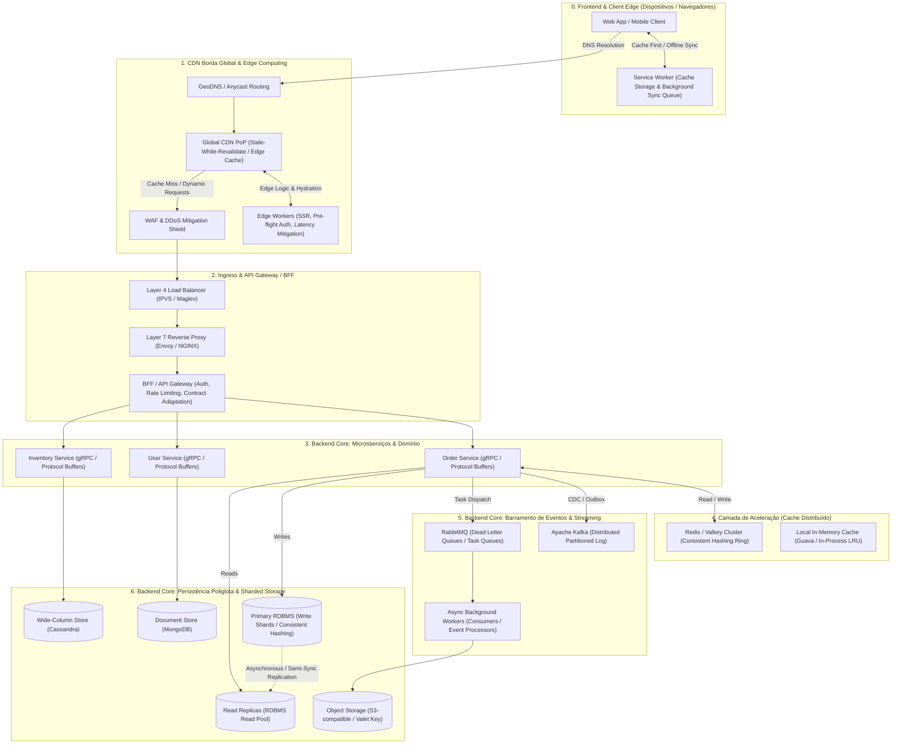

### Fronteiras Macro-Arquiteturais: Frontend / Client Edge vs. Ingress / BFF vs. Backend Core

Para assegurar escalabilidade sustentável e manutenibilidade em escala corporativa, os sistemas distribuídos devem respeitar fronteiras estritas de domínio técnico:

| Dimensão Arquitetural | Frontend / Client Edge | Borda de Ingress / BFF | Backend Core Distribuído |
| :--- | :--- | :--- | :--- |
| **Componentes Típicos** | Navegadores Web, Apps Nativos (iOS/Android), Service Workers, Cache Storage, IndexedDB, CDN PoPs, Edge Workers. | Load Balancers L4/L7, WAF, API Gateways, Backends for Frontends (BFF Web/Mobile). | Microsserviços de Domínio, Clusters de Cache, Message Brokers (AMQP), Event Streaming (Kafka), RDBMS Sharded, NoSQL. |
| **Responsabilidades Centrais** | Experiência do usuário, renderização, cache de assets e dados estáticos/revalidados, pré-processamento leve de borda e resiliência offline. | Terminação TLS, controle de vazão (rate limiting), autenticação inicial, roteamento inteligente e agregação de dados sob medida por canal. | Invariantes de negócio, transações, durabilidade de dados, coordenação distribuída (Sagas/Outbox), partições e particionamento em escala. |
| **Mitigação de Latência & Falhas** | CDN Caching (`stale-while-revalidate`), Service Workers com Cache Storage, background sync, atualizações otimistas e backoff exponencial com jitter. | Retries defensivos idempotentes, circuit breakers de borda, fallbacks graciosos e descarte de carga (load shedding). | Quóruns configuráveis ($W + R > N$), Consistent Hashing com Vnodes, réplicas leitoras desacopladas e processamento assíncrono via mensageria. |
| **Modelo de Estado & Consistência** | Estado efêmero de UI e cache local; consistência eventual com reconcile assíncrono contra o servidor. | Camada estritamente **stateless**; delegação de estado de sessão para caches distribuídos compartilhados. | Estado transacional perene; garantias ACID locais combinadas com consistência eventual sob o Teorema PACELC. |

---

## 📐 1. Framework Estruturado de System Design (The 4-Step Blueprint)

Projetar sistemas em cenários de alta pressão ou em ambientes corporativos de missão crítica requer um processo mental metódico e iterativo. O framework canônico organiza a discussão técnica em quatro etapas sequenciais:

```text
┌────────────────────────┐      ┌────────────────────────┐
│ Passo 1: Clarificação  │ ───► │ Passo 2: Back-of-the-  │
│ de Escopo & Requisitos │      │ Envelope Calculations  │
└────────────────────────┘      └────────────────────────┘
            │                               │
            ▼                               ▼
┌────────────────────────┐      ┌────────────────────────┐
│ Passo 3: High-Level    │ ───► │ Passo 4: Deep Dive &   │
│ Architecture Design    │      │ Bottleneck Resolution  │
└────────────────────────┘      └────────────────────────┘
```

### 1.1. Passo 1: Escopo e Requisitos Funcionais vs. Não-Funcionais

Nunca inicie o desenho de caixas ou seleção de bancos de dados antes de delimitar as fronteiras do problema.

#### Requisitos Funcionais (Core Use Cases)
- Quais ações exatas o usuário realiza no sistema? (Ex.: publicar um post, seguir um usuário, pesquisar conteúdo, transferir saldo).
- Quais casos de borda e comportamentos secundários devem ser explicitamente descartados do MVP?

#### Requisitos Não-Funcionais (As Leis Físicas do Sistema)
- **Disponibilidade:** Qual é a tolerância anual de indisponibilidade? (Ex.: 99.9% vs. 99.999%).
- **Consistência:** O domínio tolera consistência eventual (ex.: contagem de likes em redes sociais) ou requer linearizabilidade e ACID estrito (ex.: transações bancárias e reserva de inventário escasso)?
- **Latência:** Quais são os limites de p99 aceitáveis? (Ex.: leitura < 50ms, escrita < 200ms).
- **Durabilidade:** Os dados salvos podem ser perdidos em caso de desastre em um datacenter inteiro? (Ex.: RPO = 0, RTO < 1 minuto).
- **Custo Operacional e Regulatório:** Onde os dados residem por conformidade (LGPD, GDPR, HIPAA)?

---

### 1.2. Passo 2: Estimativas de Grandeza (Back-of-the-Envelope)

As estimativas rápidas fornecem a ordem de grandeza necessária para tomar decisões estruturais sobre particionamento, tamanho de memória e largura de banda de rede.

#### Tabela Canônica de Latências de Hardware (Jeff Dean / Peter Norvig)

Compreender a diferença de ordens de grandeza entre CPU, memória e rede é a premissa de qualquer arquitetura de computação distribuída:

| Operação | Latência Absoluta | Escala Humana Proporcional (1 ns = 1 segundo) |
| :--- | :--- | :--- |
| Ciclo de CPU (L1 cache reference) | 0.5 - 1.0 ns | 1 segundo |
| Branch mispredict | 3 - 5 ns | 3 a 5 segundos |
| L2 cache reference | 4 - 7 ns | 7 segundos |
| Mutex lock/unlock | 17 - 25 ns | 25 segundos |
| Acesso à Memória Principal (RAM) | 100 ns | 1.7 minuto |
| Compactar 1 KB com Snappy / ZSTD | 2,000 ns (2 µs) | 33 minutos |
| Ler 1 MB sequencialmente da RAM | 3,000 ns (3 µs) | 50 minutos |
| Enviar 2 KB sobre rede local (10 Gbps) | 10,000 ns (10 µs) | 2.8 horas |
| Leitura aleatória de SSD (NVMe) | 10,000 - 50,000 ns (10-50 µs) | 7 a 14 horas |
| Leitura sequencial de 1 MB de SSD | 200,000 ns (200 µs) | 2.3 dias |
| Seek em Disco Magnético Tradicional (HDD) | 10,000,000 ns (10 ms) | **4 meses** |
| Ida e volta (RTT) de pacote EUA ↔ Europa | 150,000,000 ns (150 ms) | **4.7 anos** |

> **Regra de Ouro:** Ler da memória é **100 vezes** mais rápido do que ler de um SSD NVMe e **100.000 vezes** mais rápido do que um seek em disco mecânico. Fazer uma chamada de rede transcontinental custa **1.5 milhão de vezes** mais tempo do que acessar a RAM local.

#### Fórmulas e Equações Estruturais

1. **Vazão Média de Requisições por Segundo (QPS / RPS):**
   $$\text{QPS}_{\text{médio}} = \frac{\text{DAU} \times \text{Ações por Usuário por Dia}}{86.400 \text{ segundos}}$$

2. **QPS de Pico (Peak QPS Factor):**
   $$\text{QPS}_{\text{pico}} = \text{QPS}_{\text{médio}} \times \text{Fator de Pico (geralmente entre 2.0 e 5.0)}$$

3. **Largura de Banda de Entrada (Ingress Bandwidth):**
   $$\text{Ingress} = \text{QPS}_{\text{escrita}} \times \text{Tamanho Médio do Payload de Escrita}$$

4. **Largura de Banda de Saída (Egress Bandwidth):**
   $$\text{Egress} = \text{QPS}_{\text{leitura}} \times \text{Tamanho Médio do Payload de Leitura}$$

5. **Armazenamento Cumulativo em 5 Anos:**
   $$\text{Storage}_{\text{5 anos}} = \text{QPS}_{\text{escrita}} \times \text{Tamanho do Registro} \times 86.400 \times 365 \times 5 \times (1 + \text{Overhead de Índices e Metadados})$$

6. **Capacidade da Camada de Cache (Regra de Pareto 80/20):**
   $$\text{Cache RAM} = (\text{Volume Diário de Leitura de Dados}) \times 0.20$$

---

### 1.3. Passo 3: Arquitetura de Alto Nível (High-Level Design)

Desenhe o diagrama de blocos conectando a entrada do cliente até o storage permanente:
1. **Clientes:** Mobile, Web, Dispositivos IoT.
2. **Camada de Borda:** DNS, CDN, WAF, API Gateway.
3. **Serviços de Aplicação:** Divisão de fronteiras de contexto de microsserviços (ex.: Feed Service, Auth Service, Billing Service).
4. **Camada de Dados:** Bancos relacionais com réplicas de leitura, instâncias de cache Redis e tópicos de mensageria assíncrona.

---

### 1.4. Passo 4: Deep Dive Técnico e Análise de Gargalos

Identifique e resolva os gargalos específicos que impediriam o sistema de crescer em ordens de magnitude:
- O que acontece se o banco primário falhar subitamente?
- Como o sistema se comporta sob uma partição de rede entre regiões de nuvem?
- O que ocorre quando um usuário com 100 milhões de seguidores posta uma mensagem?
- Os pools de conexão de banco suportam o volume máximo de workers assíncronos?

---

## ⚡ 2. Desempenho vs. Escalabilidade e Métricas Fundamentais

Um erro arquitetural recorrente é tratar **desempenho** e **escalabilidade** como sinônimos. Conforme articulado por Werner Vogels (CTO da Amazon) e Jonas Bonér:

```text
DESEMPENHO:
  Uma única requisição é executada rapidamente sob isolamento de laboratório.
  Problema de Desempenho: O sistema responde lentamente para um único usuário.

ESCALABILIDADE:
  O sistema preserva a mesma velocidade unitária quando a carga total cresce 100x.
  Problema de Escalabilidade: O sistema é rápido para 1 usuário, mas degrada exponencialmente sob 10.000 usuários simultâneos.
```

### 2.1. Diagnóstico Diferencial: Latência vs. Throughput

- **Latência:** Tempo decorrido para processar uma única transação individual (medido em milissegundos ou microssegundos).
- **Throughput (Vazão):** Volume absoluto de trabalho completado por unidade de tempo (transações por segundo, requisições por segundo, MB/s).

#### A Analogia da Linha de Montagem Industrial
Considere uma linha fabril de veículos:
- Montar um carro completo consome **8 horas** (esta é a **latência** de ponta a ponta).
- A linha entrega **120 carros prontos a cada dia** (este é o **throughput** = 5 carros por hora).
- Aumentar o throughput através do paralelismo (pipelining) muitas vezes **eleva a latência individual**, devido ao overhead de coordenação, filas e handoffs entre etapas.

---

### 2.2. A Lei de Little e Filas de Espera

A física do enfileiramento em computação distribuída é regida pela **Lei de Little**:

$$L = \lambda \times W$$

Onde:
- $L$: Número médio de requisições retidas no sistema simultaneamente (tamanho do backlog ou concorrência ativa).
- $\lambda$: Taxa média de chegada de requisições (chegadas por segundo).
- $W$: Tempo médio que cada requisição gasta no sistema (latência de serviço + tempo de espera em fila).

```text
Se a capacidade máxima de processamento do serviço for atingida e a taxa de chegada
(λ) continuar subindo, W (tempo na fila) cresce exponencialmente.
Resultado: Esgotamento de buffers, saturação de threads de workers e colapso de memória.
```

---

### 2.3. Amplificação de Latência de Cauda (Tail Latency Amplification)

Em arquiteturas orientadas a microsserviços, uma única requisição de usuário frequentemente dispara requisições concorrentes para dezenas ou centenas de serviços downstream (fan-out). A latência geral da requisição é ditada pelo componente **mais lento** da cadeia.

Se um serviço individual possui uma latência com probabilidade de 99% de responder abaixo de 10ms (p99 = 10ms, ou seja, 1% de chance de lentidão extrema):
- Se a requisição do usuário depender de **1 único serviço**: a chance de ter uma resposta rápida é de $99\%$.
- Se a requisição disparar chamadas paralelas para **100 nós de armazenamento** para montar a página:
  $$P(\text{Pelo menos um nó atrasar}) = 1 - (0.99)^{100} = 1 - 0.366 = 63.4\%$$

> **Conclusão de Engenharia:** Em sistemas com fan-out massivo, **63.4% de todas as requisições dos usuários sofrerão com a latência de cauda (p99)**, transformando a pior experiência de um nó secundário na experiência padrão do usuário final. Mitigações exigem timeouts agressivos, requisições com hedge (Hedged Requests), cancelamentos em cascata e quóruns de leitura.

---

## ⚖️ 3. Teoria de Sistemas Distribuídos: Teoremas CAP e PACELC

O alicerce conceitual de todo banco de dados ou cluster distribuído repousa sobre os limites fundamentais impostos por partições de rede.

### 3.1. O Teorema CAP na Prática: A Ilusão do "CA"

Formulado por Eric Brewer e formalmente provado por Seth Gilbert e Nancy Lynch, o Teorema CAP afirma que em um sistema distribuído que compartilha estado, é impossível garantir simultaneamente:
1. **Consistency (Consistência / Linearizabilidade):** Toda leitura retorna a escrita mais recente ou resulta em erro.
2. **Availability (Disponibilidade):** Toda requisição não-falha recebe uma resposta válida (sem garantia de ser a mais recente).
3. **Partition Tolerance (Tolerância a Partições de Rede):** O sistema opera mesmo sob perda ou atraso arbitrário de mensagens entre nós.

```text
                  ┌──────────────────────┐
                  │      Partição (P)    │
                  │   Inerente a redes   │
                  └──────────┬───────────┘
                             │
              Ao ocorrer uma partição de rede:
                             │
            ┌────────────────┴────────────────┐
            ▼                                 ▼
┌───────────────────────┐         ┌───────────────────────┐
│     Sistemas CP       │         │     Sistemas AP       │
│  Prioriza Consistência│         │ Prioriza Disponibilidade
│  Recusa ou atrasa     │         │ Retorna dados locais, │
│  respostas duvidosas  │         │ aceita divergência    │
│  Ex: etcd, ZooKeeper  │         │ Ex: Cassandra, Dynamo │
└───────────────────────┘         └───────────────────────┘
```

> **Axioma Arquitetural:** Não existe a opção de escolher "CA". As redes físicas inevitavelmente sofrem quebras de cabos, congelamentos de switches, flaps de BGP e latência extrema de GC. A tolerância a partição ($P$) é uma **lei física**, não uma escolha de engenharia. Portanto, em caso de partição, o arquiteto deve escolher estritamente entre **Consistência ($CP$)** ou **Disponibilidade ($AP$)**.

---

### 3.2. Teorema PACELC: O Regime Estacionário Fora da Partição

O Teorema CAP descreve apenas o comportamento do sistema durante um incidente de partição de rede. No entanto, 99.9% do tempo a rede está operando normalmente. Para cobrir o ciclo completo de vida, o professor Daniel Abadi formulou o **Teorema PACELC**:

$$\text{Se há } \mathbf{P} \text{artição: escolha entre } \mathbf{A} \text{vailability e } \mathbf{C} \text{onsistency;}$$
$$\mathbf{E} \text{lse (em operação normal): escolha entre } \mathbf{L} \text{atency e } \mathbf{C} \text{onsistency.}$$

#### Matriz de Classificação de Tecnologias Reais

| Sistema | Classificação PACELC | Comportamento na Partição ($P$) | Comportamento Normal ($E$) | Casos de Uso Típicos |
| :--- | :--- | :--- | :--- | :--- |
| **Apache Cassandra / Amazon DynamoDB** | **PA / EL** | Mantém escrita e leitura abertas localmente ($A$). | Otimiza para baixíssima latência ($L$) via replicação assíncrona. | Carrinho de compras, métricas de telemetria, feeds sociais. |
| **MongoDB / Apache HBase** | **PC / EC** | Bloqueia escritas até reeleger líder ($C$). | Espera confirmação síncrona de réplicas para manter integridade ($C$). | Catálogos de dados críticos, metadados de arquivos, dados de sessão restritos. |
| **Google Cloud Spanner / CockroachDB** | **PC / EC** | Requer consenso Paxos/Raft; recusa escritas sem quórum ($C$). | Sincronização via TrueTime / relógios híbridos para serializabilidade ($C$). | Ledgers bancários, sistemas financeiros globais, billing transacional. |
| **PostgreSQL / MySQL (Single Leader Asynchronous)** | **PC / EL** | Se o líder isola, escritas são interrompidas ($C$). | Em regime normal, réplicas assíncronas priorizam menor latência ($L$). | Aplicações corporativas convencionais, ERPs, CRMs. |

---

### 3.3. O Espectro de Modelos de Consistência

A consistência não é uma escolha binária. Existe um gradiente formal de garantias:

```text
[Mais Estrito / Maior Latência]                                [Mais Flexível / Menor Latência]
Linearizabilidade ──► Sequencial ──► Causal ──► Read-Your-Writes ──► Monotonic Reads ──► Eventual
```

1. **Linearizabilidade (Linearizability / Strong Consistency):** O sistema se comporta como se existisse apenas uma única cópia dos dados no universo. Uma leitura após uma escrita confirmada obrigatoriamente reflete esse novo valor instantaneamente para qualquer observador.
2. **Consistência Causal (Causal Consistency):** Se um evento A causa ou influencia o evento B, todos os nós do sistema verão o evento A antes de verem o evento B. Eventos concorrentes não-relacionados podem ser observados em ordens distintas.
3. **Consistência Read-Your-Writes (RYW):** Um usuário que atualiza seu próprio perfil ou publica um comentário visualiza imediatamente sua própria atualização ao recarregar a tela, mesmo que outros usuários ao redor do mundo vejam a atualização alguns segundos mais tarde.
4. **Leituras Monotônicas (Monotonic Reads):** Se um usuário ler o valor $v_1$ em um momento, leituras subsequentes feitas por ele jamais retornarão um estado anterior $v_0$ (impede a sensação visual de "viagem no tempo").
5. **Consistência Eventual (Eventual Consistency):** Na ausência de novas escritas, todas as réplicas convergentes eventualmente atingirão o mesmo estado.

---

### 3.4. Quóruns Configuráveis (N, R, W) e Consistência Ajustável

Em sistemas sem líder derivados da linhagem do Amazon Dynamo (como Apache Cassandra e ScyllaDB), a consistência é ajustada dinamicamente no nível de cada requisição através de três parâmetros fundamentais:
- $N$: Fator de replicação (número de nós que armazenam cópias do mesmo dado).
- $W$: Número de réplicas que devem confirmar uma **escrita** antes de retornar sucesso ao cliente.
- $R$: Número de réplicas que devem ser consultadas em uma **leitura**.

#### A Regra do Quórum Estrito

$$W + R > N$$

Quando a soma de $W$ e $R$ supera $N$, o conjunto de réplicas consultadas na leitura obrigatoriamente se sobrepõe ao conjunto de réplicas que confirmaram a última escrita (pelo Princípio da Casa dos Pombos). Pelo menos um nó responderá com a versão mais recente do dado:

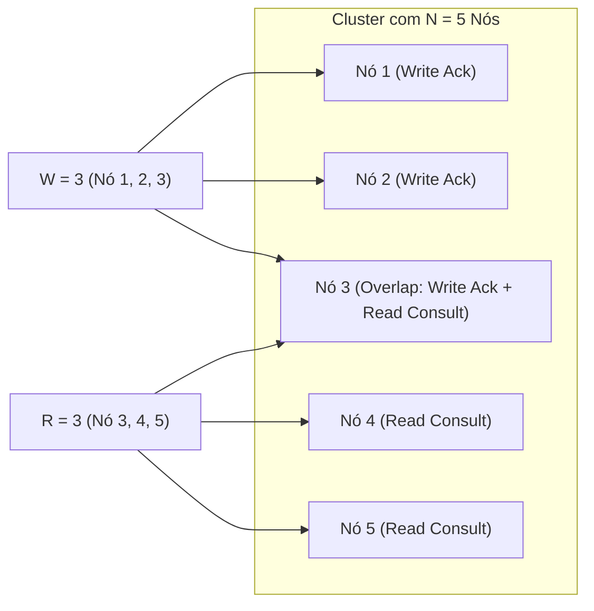

- **Configuração para Escritas Ultrarrápidas ($W = 1, R = N$):** Latência de escrita mínima, leitura custosa e sensível a falhas.
- **Configuração para Leituras Ultrarrápidas ($W = N, R = 1$):** Leitura de um único nó local, escritas exigem consenso total de todos os nós.
- **Configuração Equilibrada de Alta Disponibilidade ($N=3, W=2, R=2$):** Garante consistência forte ($2 + 2 > 3$), tolerando a falha total de 1 nó sem interromper leituras ou escritas.

---

### 3.5. Alta Disponibilidade em Números: Os "Nines" e Topologias

A disponibilidade de um sistema de software é quantificada pela métrica percentual de tempo de atividade (uptime) ao longo de um ano civil (365 dias = 8.760 horas):

| Nível de Disponibilidade | Apelido na Indústria | Downtime Anual Máximo | Downtime Mensal Máximo |
| :--- | :--- | :--- | :--- |
| **99%** | "Dois Noves" | 3 dias, 15 horas e 39 minutos | 7 horas e 18 minutos |
| **99.9%** | "Três Noves" | 8 horas, 45 minutos e 56 segundos | 43 minutos e 49 segundos |
| **99.99%** | "Quatro Noves" | 52 minutos e 35 segundos | 4 minutos e 22 segundos |
| **99.999%** | "Cinco Noves" | 5 minutos e 15 segundos | 26.3 segundos |
| **99.9999%** | "Seis Noves" | 31.5 segundos | 2.6 segundos |

#### Matemática de Topologias: Série vs. Paralelo

```text
1. COMPONENTES EM SÉRIE (A dependência multiplica e DEGRADA a disponibilidade):
   Se o Serviço A depende do Serviço B e do Banco C de forma síncrona:
   A_total = A_servico * A_auth * A_banco
   Exemplo: 0.999 * 0.999 * 0.999 = 0.997 (Caiu para 99.7% = 26 horas de downtime anual!)

2. COMPONENTES EM PARALELO (A redundância ELEVA drasticamente a disponibilidade):
   Dois balanceadores ou servidores idênticos operando com failover automático:
   A_total = 1 - (1 - A_1) * (1 - A_2)
   Exemplo: 1 - (1 - 0.999) * (1 - 0.999) = 1 - (0.001)^2 = 0.999999 ("Seis Noves"!)
```

---

## 🌍 4. Camada de Borda, Frontend e Aceleração Global

A camada de borda absorve o impacto inicial de todo o tráfego global antes que qualquer requisição atinja os servidores de aplicação internos, estendendo a capacidade de processamento até o próprio cliente.

### 4.1. DNS em Escala e Roteamento Anycast

O DNS (Domain Name System) atua como o catálogo de endereçamento primário da Internet, mas em System Design é utilizado como uma sofisticada ferramenta de engenharia de tráfego.

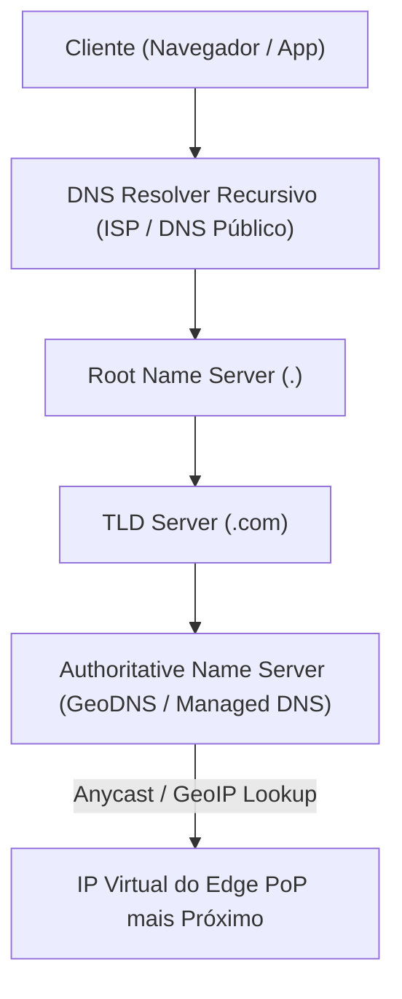

#### Estratégias Avançadas de Roteamento DNS
- **Anycast BGP Routing:** Múltiplos datacenters geograficamente dispersos no planeta anunciam exatamente o **mesmo endereço IP** via BGP. O protocolo de roteamento da Internet direciona os pacotes automaticamente para o ponto de presença (PoP) topologicamente mais próximo.
- **GeoDNS / Roteamento por Latência:** O nameserver autoritativo inspeciona o IP de origem do resolver e responde com o endereço IP do datacenter com menor RTT histórico.
- **Failover com Health-Checking:** O provedor de DNS remove automaticamente o IP de uma região em caso de degradação estrutural.

> **A Armadilha do DNS Caching e JVM Pinning:**
> Failover puramente por DNS **nunca é instantâneo**. Resolvers locais de provedores e sistemas corporativos frequentemente ignoram o TTL (Time-To-Live) configurado para economizar tráfego. Além disso, plataformas como a Java Virtual Machine (JVM) historicamente mantêm cache perpétuo de resoluções de DNS (`networkaddress.cache.ttl = -1`). Para failovers imediatos (sub-segundo), utilize IPs Anycast com roteadores BGP retirando as rotas da rede física.

---

### 4.2. CDNs (Content Delivery Networks), Caching de Borda e Edge Workers

As CDNs posicionam caches distribuídos a poucos milissegundos dos usuários finais através de centenas de Pontos de Presença (PoPs) dispersos globalmente:

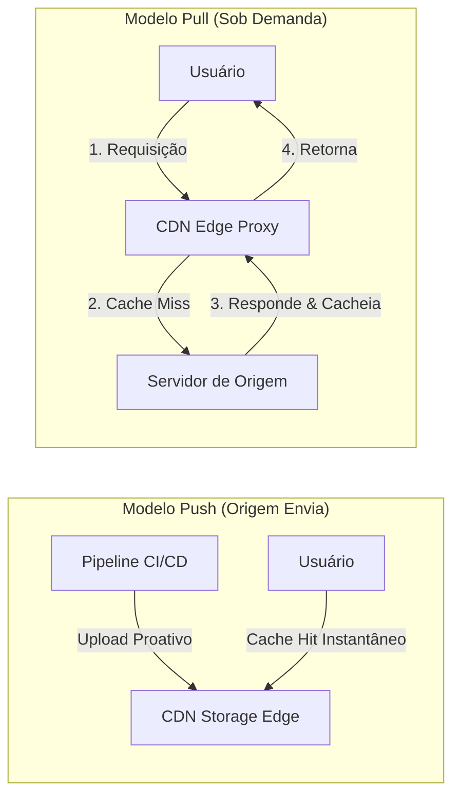

#### Comparativo de Modelos de CDN

| Característica | Push CDN | Pull CDN |
| :--- | :--- | :--- |
| **Mecanismo de Ingestão** | Servidor de origem faz upload explícito de arquivos para a CDN. | A CDN busca o asset na origem na primeira requisição (Cache Miss). |
| **Melhor Caso de Uso** | Sistemas com poucos arquivos gigantes que raramente mudam (jogos, patches de software). | Plataformas web dinâmicas com milhões de imagens, CSS e scripts que evoluem. |
| **Custo de Latência Inicial** | Nulo: O primeiro usuário já encontra o arquivo no edge. | Alto: A primeira requisição paga a penalidade do cache miss até a origem. |
| **Complexidade Operacional** | Alta: A aplicação deve orquestrar uploads e expurgos manuais. | Baixa: A sincronização ocorre automaticamente via cabeçalhos HTTP `Cache-Control`. |

#### Caching de Borda e Diretivas Avançadas de Cabeçalhos HTTP

A governança do ciclo de vida dos dados em trânsito pela borda é estabelecida por cabeçalhos HTTP padronizados:

1. **`Cache-Control: public, max-age=X, s-maxage=Y`:**
   - `max-age`: instrui o navegador do cliente sobre o tempo em que o dado é considerado fresco.
   - `s-maxage`: sobrepõe o `max-age` exclusivamente para intermediários compartilhados (CDNs e proxies reversos), permitindo reter conteúdo na borda por mais tempo do que no navegador.
2. **`stale-while-revalidate` (RFC 5861):**
   - Configuração canônica: `Cache-Control: public, max-age=60, stale-while-revalidate=600`.
   - **Mecânica Operacional:** Durante os primeiros 60 segundos, a CDN responde com Cache Hit imediato. Entre o segundo 61 e o segundo 660 (janela *stale*), a CDN **retorna a resposta cacheada instantaneamente ao usuário** (latência sub-5ms) e, de maneira concorrente e não-bloqueante em background, dispara uma requisição assíncrona à origem para renovar o cache.
   - **Benefício de Escala:** Elimina completamente a latência de round-trip para 99.9% dos usuários, blindando o servidor de origem contra picos de tráfego (thundering herd em expiração de chave).
3. **`stale-if-error` (RFC 5861):**
   - Configuração canônica: `Cache-Control: public, max-age=300, stale-if-error=86400`.
   - Se o servidor de origem falhar com status HTTP 5xx (500, 502, 503, 504) ou sofrer timeout de rede, a borda continuará servindo o conteúdo stale por até 24 horas, isolando os usuários da queda interna da aplicação.
4. **`CDN-Cache-Control` e `Surrogate-Control`:**
   - Permitem desacoplar com precisão as políticas da CDN daquelas enviadas aos navegadores finais, evitando que regras de borda interfiram indevidamente no cache privado do cliente.
5. **Surrogate Keys / Cache Tags (Invalidação Seletiva):**
   - Marcação de payloads com tags semânticas (ex.: `Surrogate-Key: product_1092 category_4 store_sp`).
   - Ao alterar o preço de um produto, o backend emite um comando de purge direcionado exclusivamente à tag `product_1092`, expurgando cirurgicamente apenas as páginas afetadas em todos os PoPs globais em menos de 150ms.

#### Edge Computing e Edge Workers

Os Edge Workers representam a descentralização do tempo de execução da aplicação para os PoPs da CDN, executando código sem estado com inicialização quase instantânea (sub-milissegundo via isolamento V8 ou WebAssembly):

- **Edge SSR e Streaming de HTML:** Renderização de fragmentos dinâmicos da interface no PoP mais próximo do usuário, enviando os primeiros bytes de HTML com latência mínima (TTFB reduzido).
- **Pré-Autenticação e Validação de Tokens Stateless:** Verificação de assinaturas criptográficas de tokens JWT diretamente na borda. Requisições adulteradas ou com tokens expirados são rejeitadas com HTTP 401 no edge, economizando conexões e recursos computacionais do Ingress e dos microsserviços centrais.
- **Normalização e Georoteamento:** Inspeção de geolocalização do cliente, cabeçalhos de dispositivo e cookies para direcionar requisições ao cluster regional ótimo ou aplicar variantes de testes A/B sem origin round-trips.
- **Proteção e Rate Limiting Distribuído:** Aplicação de cotas por IP e bloqueio de scraping abusivo na borda antes que o tráfego atinja o API Gateway corporativo.

---

### 4.3. Frontend e Client Edge: Service Workers e Redes Móveis Intermitentes

O cliente moderno (aplicação web em navegador ou app mobile nativo) não é um consumidor passivo de APIs, mas o nó mais abundante e geograficamente distribuído de todo o ecossistema. Integrá-lo formalmente à topologia arquitetural é indispensável para sistemas de alta disponibilidade.

#### Service Workers e Estratégias de Cache no Cliente

O Service Worker opera como um proxy reverso programável residente no dispositivo do cliente, interceptando todas as chamadas de rede emitidas via evento `fetch` em uma thread dedicada separada do motor de renderização da interface:

```mermaid
flowchart TD
    UI["Interface do Usuário (DOM / Native App)"] -->|fetch(request)| SW["Service Worker (Client Proxy)"]
    SW --> CacheCheck{"Verifica Cache Storage"}
    CacheCheck -->|Cache Hit| ReturnLocal["Retorna do Disco Local (0ms RTT)"]
    CacheCheck -->|Cache Miss / Revalidate| NetCheck{"Acessa Rede Externa"}
    NetCheck -->|Online| NetworkCall["CDN Edge / API Gateway"]
    NetCheck -->|Offline / Timeout| FallbackLocal["Fallback Gracioso (Offline Shell / Cached Data)"]
```

1. **Cache-First (Cache Falling Back to Network):**
   - O Service Worker consulta o `Cache Storage` local. Em caso de acerto, responde instantaneamente (0ms de latência de rede). Apenas em caso de miss busca na rede externa.
   - **Cenário de Aplicação:** Bundles JavaScript e CSS com hash imutável, web fonts, ícones SVG e imagens estruturais da casca da aplicação (Application Shell).
2. **Network-First (Network Falling Back to Cache):**
   - A requisição tenta a rede com um timeout agressivo (ex.: 2.5s). Se a rede responder com sucesso, armazena uma cópia no cache e responde à UI. Se falhar ou estiver sem sinal, recorre à última versão armazenada localmente.
   - **Cenário de Aplicação:** Feeds de notícias recentes, painéis financeiros e telas onde a versão mais atualizada é preferível, mas um dado ligeiramente defasado é tolerável perante uma tela em branco.
3. **Stale-While-Revalidate no Cliente:**
   - O Service Worker devolve a resposta local imediatamente para renderização rápida e, de forma assíncrona, faz a requisição de rede para atualizar o cache local para a próxima interação.

#### Tratamento de Latência de Rede e Conexões Móveis Intermitentes

Em redes celulares (3G, 4G e 5G em áreas de trânsito), variações de largura de banda, perda de pacotes e partições locais de rede ocorrem rotineiramente. A arquitetura de sistemas distribuídos deve incorporar defesas explícitas para esses cenários:

```mermaid
sequenceDiagram
    autonumber
    participant UI as Interface (UI State)
    participant Store as Local Store (IndexedDB)
    participant SW as Service Worker / Sync Manager
    participant API as Backend Core API

    UI->>Store: 1. Grava mutação local com UUIDv7 (Idempotency Key)
    UI->>UI: 2. Aplica Optimistic Update instantâneo na tela
    SW->>SW: 3. Registra tarefa via Background Sync API
    alt Conectividade Ativa
        SW->>API: 4. POST /orders (Idempotency-Key: uuid-123)
        API-->>SW: 5. 201 Created
        SW->>Store: 6. Marca mutação como sincronizada
    else Conexão Intermitente / Offline
        Note over SW,API: Conexão indisponível; mutação permanece enfileirada no IndexedDB
        SW->>SW: 7. Aguarda evento 'sync' do SO ao reconectar rede
        SW->>API: 8. Retry automático com Exponential Backoff + Jitter
        API-->>SW: 9. Confirmação recebida e reconciliada
    end
```

1. **Arquitetura Offline-First com Armazenamento Estruturado Local:**
   - Uso de bancos locais no cliente (como `IndexedDB` em navegadores ou SQLite/Room/CoreData em dispositivos móveis) como fonte primária de consulta e escrita temporária. O sistema continua operando mesmo sem qualquer conectividade ativa.
2. **Fila de Mutações Assíncronas e Background Sync API:**
   - Toda operação de escrita gerada offline (ex.: submeter pedido, enviar mensagem, alterar preferências) é empacotada com uma **chave de idempotência** imutável (`Idempotency-Key`) gerada no cliente e gravada na fila local.
   - Ao recuperar conectividade, a API de Background Sync do sistema operacional desperta o Service Worker em segundo plano para descarregar as mutações enfileiradas em ordem causal estrita, sem exigir que o usuário mantenha a aplicação aberta.
3. **Atualizações Otimistas de Interface (Optimistic UI Updates):**
   - A interface do usuário reflete a conclusão da ação no exato momento do clique, sem esperar o round-trip de rede (RTT).
   - **Mecanismo de Rollback e Compensação:** Caso o backend rejeite a operação (ex.: saldo insuficiente, produto esgotado após revalidação no backend core), a aplicação reverte suavemente o estado visual da tela e exibe uma notificação amigável com a ação corretiva necessária.
4. **Estratégias Defensivas de Retry no Cliente com Full Jitter:**
   - Clientes móveis devem obrigatoriamente aplicar algoritmo de **Exponential Backoff com Full Jitter** em retries para evitar o fenômeno de **Client Thundering Herd** (quando milhares de passageiros de um trem saem simultaneamente de um túnel sem sinal e bombardeiam o backend no mesmo milissegundo).
   - O cliente deve incorporar um **Client-Side Circuit Breaker** para cessar tentativas de rede assim que 3 a 5 falhas consecutivas apontarem queda geral de conectividade, economizando bateria e dados do usuário.
5. **Otimização Adaptativa de Payloads e Compressão:**
   - Detecção dinâmica de conexões lentas através da API de conexão (`navigator.connection.effectiveType`) e cabeçalho `Save-Data`.
   - Adaptação dinâmica: solicitar imagens com resolução comprimida, postergar requisições analíticas secundárias, aplicar compressão de transferência moderna (Brotli ou Zstandard) e limitar o tamanho de páginas em listagens.

---

### 4.4. Load Balancers: Camada 4 vs. Camada 7 e Algoritmos de Distribuição

O balanceador de carga impede a formação de filas assimétricas em nós individuais e isola instâncias falhas.

```text
┌────────────────────────────────────────────────────────────────────────┐
│               LAYER 4 LOAD BALANCING (Transporte / TCP/UDP)            │
│  - Roteia por pacote: IP Origem:Porta ➔ IP Destino:Porta               │
│  - Não lê HTTP, não descriptografa SSL, altíssimo throughput de pacotes │
│  - Implementações Canônicas: Linux IPVS, Maglev, L4 Network Proxies    │
└───────────────────────────────────┬────────────────────────────────────┘
                                    │ TCP Stream Roteada
                                    ▼
┌────────────────────────────────────────────────────────────────────────┐
│               LAYER 7 LOAD BALANCING (Aplicação / HTTP/gRPC)           │
│  - Descriptografa TLS (Terminação SSL)                                  │
│  - Inspeciona Path (/api/v1/orders), Headers, Cookies de Sessão         │
│  - Implementações Canônicas: Envoy Proxy, NGINX, HAProxy, L7 Proxies    │
└────────────────────────────────────────────────────────────────────────┘
```

#### Algoritmos Fundamentais de Balanceamento

1. **Round Robin & Weighted Round Robin:** Alterna requisições de forma linear ou ponderada pela capacidade computacional de cada nó. Ideal para cargas de trabalho homogêneas.
2. **Least Connections & Weighted Least Connections:** Direciona a requisição para o servidor com menor contagem de conexões TCP ativas no momento. Essencial para requisições de longa duração (ex.: streaming de vídeo, uploads de arquivos, WebSockets).
3. **Consistent Hashing / IP Hash:** Mapeia requisições do mesmo cliente sempre para o mesmo servidor de backend. Cria afinidade de cache, mas introduz risco de sobrecarga se um IP representar um proxy corporativo com milhares de usuários internos.
4. **Power of Two Random Choices (P2C):** O balanceador seleciona aleatoriamente dois servidores saudáveis do pool e encaminha a requisição para aquele que estiver com a menor fila. **Teorema:** Elimina o comportamento de manada e obtém desempenho quase idêntico ao Least Connections global com custo $O(1)$ de coordenação.

---

## 💾 5. Persistência e Estratégias de Bancos de Dados em Escala

A camada de dados é a mais complexa de escalar, pois ao contrário dos servidores de aplicação sem estado (stateless), dados possuem gravidade, histórico e requisitos de integridade.

### 5.1. Paradigmas de Armazenamento: SQL, NoSQL, NewSQL e Vetoriais

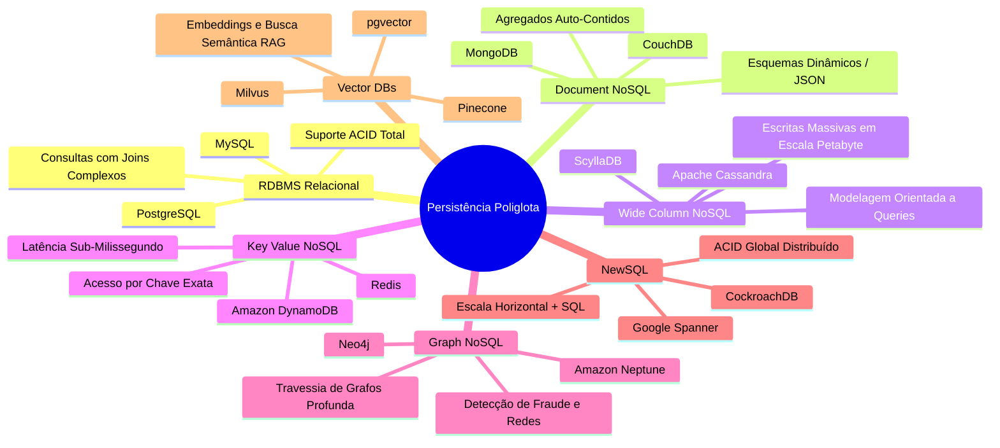

---

### 5.2. Topologias de Replicação: Réplicas Leitoras/Escritoras e Modelos de Líder

A replicação distribui cópias idênticas dos dados em múltiplos nós para prover tolerância a desastres físicos e escalar a vazão de leitura:

#### A Arquitetura de Réplicas Leitoras/Escritoras (Read/Write Replicas)

Em cargas de trabalho típicas da Internet, a proporção de leitura para escrita costuma variar entre 10:1 e 100:1. A topologia com separação entre nó escritor primário e réplicas leitoras é o padrão canônico de escala:

```mermaid
flowchart TD
    AppWrite["Serviços de Escrita (Mutações / Transações)"] -->|Writes (ACID)| Primary[("Nó Primário / Escritor (Líder)")]
    Primary -->|Write-Ahead Log (WAL)| SyncEngine["Mecanismo de Replicação"]
    SyncEngine -.->|Sincronização Assíncrona / Semi-Síncrona| Repl1[("Read Replica 1")]
    SyncEngine -.->|Sincronização Assíncrona / Semi-Síncrona| Repl2[("Read Replica 2")]
    SyncEngine -.->|Sincronização Assíncrona / Semi-Síncrona| Repl3[("Read Replica 3")]
    
    AppRead["Serviços de Leitura (Consultas / Relatórios)"] -->|Pool de Leitura Balanceado| ReplPool["Load Balancer de Banco / Proxy SQL"]
    ReplPool --> Repl1
    ReplPool --> Repl2
    ReplPool --> Repl3
```

1. **Separação Rígida de Fluxos de Dados:**
   - **Caminho de Escrita (Write Path):** Todas as mutações (`INSERT`, `UPDATE`, `DELETE`) e transações que exigem isolamento serializável são direcionadas exclusivamente ao nó Líder Primário (Primary/Master).
   - **Pool de Leitura (Read Pool):** Consultas com tolerância a leituras ligeiramente defasadas são balanceadas em um pool de Réplicas Leitoras (Followers/Slaves).
2. **Modalidades de Sincronização e Trade-offs:**
   - **Replicação Síncrona:** O líder só confirma a transação ao cliente após gravar no disco local e receber a confirmação de escrita de **todas** as réplicas. Garante consistência imediata ($CP$), mas amplia drasticamente a latência e interrompe escritas se uma única réplica travar.
   - **Replicação Semi-Síncrona:** O líder confirma a transação após a confirmação de gravação local e de pelo menos **uma réplica designada** (quórum mínimo). Equilibra durabilidade com menor latência.
   - **Replicação Assíncrona:** O líder confirma imediatamente após a gravação local; o envio dos registros do Write-Ahead Log (WAL) para as réplicas ocorre em segundo plano. Oferece a menor latência de escrita possível ($AP$), mas introduz o fenômeno do **Replication Lag**.
3. **Mitigação do Replication Lag e Leituras Inconsistentes:**
   - **Roteamento Read-Your-Writes (Consistência Causal de Sessão):** Quando um usuário submete uma alteração em seu perfil ou realiza uma compra, leituras disparadas pela mesma sessão nos primeiros $T$ segundos (ex.: 5 a 10s) são obrigatoriamente direcionadas ao nó primário ou a réplicas cujo LSN (*Log Sequence Number*) já tenha alcançado a transação executada.
   - **Roteamento Baseado em Criticidade:** Consultas com impacto financeiro ou de segurança (validação de limites de crédito, autenticação, idempotência) leem sempre do líder; consultas de catálogo público e relatórios leem das réplicas.

#### Modelos de Topologia: Single-Leader vs. Multi-Leader vs. Leaderless

```text
1. SINGLE-LEADER (Primary-Replica):
   [Cliente Escrita] ──► [Leader Primário] ──(Replicação WAL)──► [Read Replica 1]
                                                               └──► [Read Replica 2]
   - Prós: Simplicidade de isolamento transacional; sem conflitos concorrentes de escrita.
   - Contras: O líder é ponto único de gargalo de gravação; failover requer eleição de novo líder.

2. MULTI-LEADER (Active-Active Multi-Region):
   [Região A: Leader] ◄──────(Replicação Bidirecional Assíncrona)──────► [Região B: Leader]
   - Prós: Baixa latência de escrita local para usuários em continentes distintos; sobrevive à perda de uma região inteira.
   - Contras: Conflitos de escrita concorrentes inevitáveis (ex.: mesma linha editada em duas regiões). Exige CRDTs (Conflict-free Replicated Data Types) ou Last-Write-Wins (com perda inevitável de dados).

3. LEADERLESS (Dynamo-Style / Peer-to-Peer):
   [Cliente] ──(Escreve em Quórum W=2)──► [Nó A, Nó B, Nó C]
   - Prós: Alta disponibilidade e tolerância a nós caídos; sem gargalo de líder centralizador.
   - Contras: Leituras exigem quóruns estritos ($W + R > N$) e reconciliação contínua via Read Repair e Merkle Trees anti-entropia.
```

---

### 5.3. Particionamento e Sharding com Consistent Hashing e Nós Virtuais

Quando o volume de dados ou a taxa de I/O ultrapassa a capacidade de um único servidor (mesmo em instâncias bare-metal com múltiplos terabytes de RAM), o particionamento dos dados torna-se mandatória no Backend Core.

#### As Formas Fundamentais de Particionamento no Backend Core

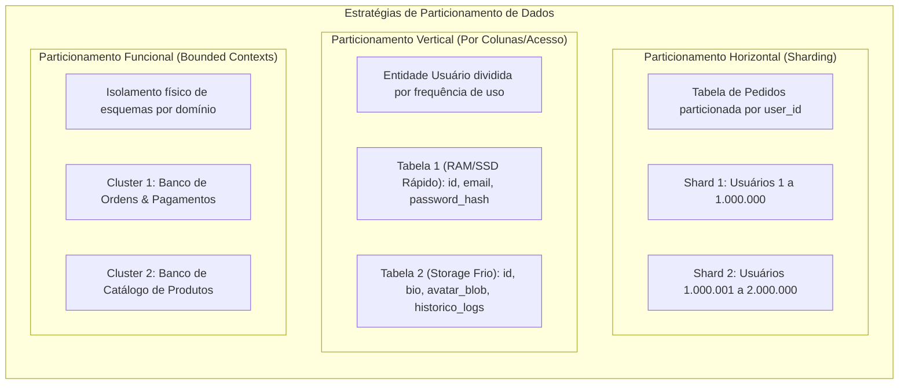

1. **Particionamento Horizontal (Sharding):**
   - As linhas de uma mesma tabela são divididas entre múltiplos nós ou instâncias de banco independentes compartilhando o mesmo esquema.
   - **Critérios de Sharding:**
     - **Range-Based (Por Intervalo):** As chaves são agrupadas por faixas contíguas (ex.: A-F no Shard 1, G-M no Shard 2). Facilita consultas ordenadas, mas cria hotspots gravíssimos se a chave for sequencial no tempo (ex.: auto-increment IDs ou timestamps).
     - **Hash-Based (Por Hash):** Uma função hash criptográfica ou determinística converte a chave em um número que define o shard de destino. Uniformiza a distribuição de dados, mas inviabiliza queries de intervalo sem consulta a todos os shards (scatter-gather).
     - **Directory-Based (Por Catálogo/Lista):** Um serviço de catálogo lookup mantém a tabela de mapeamento entre identificadores e o nó físico correspondente. Permite grande flexibilidade de movimentação de dados, ao custo de uma consulta extra com cache agressivo.
2. **Particionamento Vertical:**
   - Decomposição das colunas de uma tabela em tabelas distintas com ciclos de vida e volumes desiguais. Colunas pequenas e críticas consultadas em alta frequência ficam em armazenamentos de altíssima vazão em memória; colunas secundárias e blobs volumosos residem em discos mais lentos e econômicos.
3. **Particionamento Funcional (Domínio / Microsserviços):**
   - Segregação de esquemas e bancos de dados inteiros orientada aos limites de Bounded Context da organização (DDD). O banco de Checkout não compartilha disco nem processo com o banco de Recomendações, isolando falhas e permitindo dimensionar hardware de acordo com o padrão de acesso de cada domínio.

#### O Problema do Sharding Tradicional por Módulo ($\text{Hash}(K) \pmod N$)
Se distribuirmos chaves por $\text{Hash}(\text{Chave}) \pmod N$:
- Quando um novo nó é adicionado ($N \to N+1$) ou um nó cai ($N \to N-1$), **quase 100% de todas as chaves mudam de posição**, provocando invalidação total de caches e migração descontrolada de dados em massa.

#### A Solução: Consistent Hashing (Karger et al., MIT)
O Consistent Hashing projeta o espaço de chaves e os identificadores dos nós de armazenamento em um **anel matemático circular** unificado (usualmente entre $0$ e $2^{32}-1$ ou $2^{128}-1$).

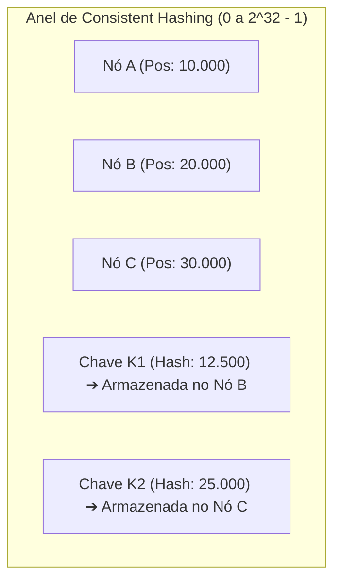

- Cada chave de dados é associada ao primeiro nó cujo hash for maior ou igual ao seu hash no sentido horário.
- **Vantagem:** Ao adicionar um novo nó, apenas uma fração de $\frac{K}{N}$ chaves precisa ser realocada.

#### Nós Virtuais (Virtual Nodes / Vnodes) para Eliminar Hotspots
Na prática, poucos nós físicos geram distribuição assimétrica de arcos no anel. Para garantir distribuição estocasticamente uniforme, cada nó físico é mapeado em **$V$ nós virtuais** (ex.: 100 a 256 posições distintas espalhadas no anel):

```python
import hashlib
import bisect

class ConsistentHashRing:
    """
    Implementação defensiva de Anel de Consistent Hashing com Nós Virtuais (Vnodes).
    Complexidade de busca: O(log(N * V)) via Binary Search (Bisect).
    """
    def __init__(self, replicas: int = 100):
        self.replicas = replicas  # Quantidade de vnodes por nó físico
        self.ring = []            # Lista ordenada de hashes dos vnodes
        self.vnode_to_node = {}   # Mapeamento: hash_vnode -> id_no_fisico

    def _hash(self, key: str) -> int:
        # MD5 / Murmur3 de 128-bits mapeado no anel circular
        return int(hashlib.md5(key.encode('utf-8')).hexdigest(), 16)

    def add_node(self, node: str) -> None:
        """Adiciona um nó físico criando múltiplos nós virtuais no anel."""
        for i in range(self.replicas):
            vnode_key = f"{node}#vnode_{i}"
            h = self._hash(vnode_key)
            bisect.insort(self.ring, h)
            self.vnode_to_node[h] = node

    def remove_node(self, node: str) -> None:
        """Remove um nó físico e expurga todos os seus nós virtuais do anel."""
        for i in range(self.replicas):
            vnode_key = f"{node}#vnode_{i}"
            h = self._hash(vnode_key)
            idx = bisect.bisect_left(self.ring, h)
            if idx < len(self.ring) and self.ring[idx] == h:
                del self.ring[idx]
                del self.vnode_to_node[h]

    def get_node(self, key: str) -> str:
        """Localiza o nó físico responsável por armazenar a chave fornecida."""
        if not self.ring:
            raise ValueError("O anel está vazio. Nenhum nó disponível.")
        
        h = self._hash(key)
        # Busca binária pelo primeiro vnode no sentido horário
        idx = bisect.bisect_right(self.ring, h)
        
        # Comportamento circular (wrap-around): volta para o índice 0 se ultrapassar o topo
        if idx == len(self.ring):
            idx = 0
            
        return self.vnode_to_node[self.ring[idx]]
```

---

### 5.4. Resharding ao Vivo e Mitigação de Hotspots

O problema do "Celebrity / Hotspot" ocorre quando uma única shard key (ex.: conta de uma celebridade mundial com 100 milhões de seguidores ou uma liquidação relâmpago de um único produto) satura a CPU e o disco de uma única partição.

#### Estratégias de Mitigação
1. **Salting de Shard Key:** Em vez de usar apenas `user_id`, a chave torna-se `user_id + "_" + random(0, 10)`. As escritas são espalhadas em 10 shards diferentes. Na leitura, o agregador consulta as 10 partições em paralelo e mescla os dados.
2. **Protocolo de Migração ao Vivo sem Downtime (The 4-Phase Cutover):**
   - **Fase 1 (Dual Write):** A camada de aplicação passa a escrever simultaneamente no cluster antigo e no cluster novo.
   - **Fase 2 (Backfill Histórico):** Um job batch copia os dados históricos do banco antigo para o novo com validação de checksum.
   - **Fase 3 (Shadow Read & Verification):** O sistema lê do banco antigo, lê em segundo plano do banco novo e valida divergências silenciosamente.
   - **Fase 4 (Cutover Final):** A chave de leitura é apontada para o cluster novo; o cluster antigo é desativado após período de observação.

---

## ⚡ 6. Arquitetura de Caching Distribuído

O cache é a ferramenta mais eficaz para converter operações custosas de I/O em leituras sub-milissegundo em memória RAM.

### 6.1. Topologias de Cache e Hierarquia de Acesso

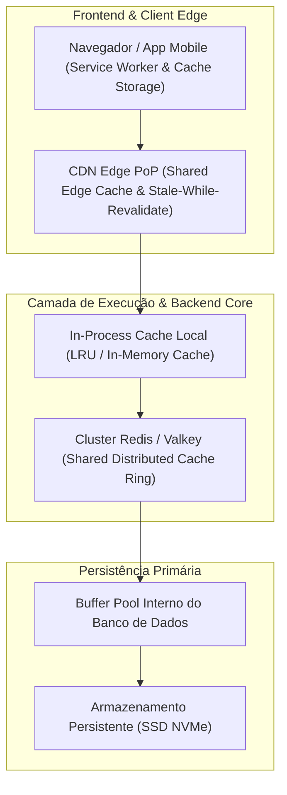

---

### 6.2. Estratégias de Atualização e Escrita

```text
1. CACHE-ASIDE (Lazy Loading):
   Leitura: Aplicação consulta o Cache. Se Cache Miss, busca no Banco e popula o Cache.
   Escrita: Aplicação escreve no Banco e INVALIDA (deleta) a chave no Cache.
   - Prós: Armazena apenas o que é efetivamente lido; tolera falha do cache sem parar escritas.
   - Contras: Cache miss inicial penaliza a latência.

2. WRITE-THROUGH:
   A aplicação escreve exclusivamente no Cache; o componente de Cache escreve no Banco sincronicamente.
   - Prós: Cache sempre consistente com a base.
   - Contras: Maior latência em cada escrita (paga dois sistemas).

3. WRITE-BACK (Write-Behind):
   A aplicação escreve no Cache e recebe confirmação imediata. O Cache descarrega no Banco de forma assíncrona em lote.
   - Prós: Altíssimo throughput de escrita; atenua picos de banco.
   - Contras: Risco de perda de dados permanente se o nó de cache queimar antes do flush.

4. WRITE-AROUND:
   A escrita vai direto para o Banco, sem tocar no cache. O dado só entra no cache se for lido posteriormente.
   - Prós: Evita poluir o cache com dados escritos que nunca serão consultados.
```

---

### 6.3. Políticas de Evicção de Memória

Quando a memória RAM alocada para o cache atinge 100%, o motor de cache deve descartar dados existentes para acomodar novos:
- **LRU (Least Recently Used):** Descarta o item que não é consultado há mais tempo. Padrão da indústria para cargas genéricas.
- **LFU (Least Frequently Used):** Descarta o item com menor contador cumulativo de acessos. Ideal para identificar conteúdos perenes contra picos pontuais.
- **FIFO (First In, First Out):** Fila simples por ordem cronológica de inserção.
- **ARC (Adaptive Replacement Cache):** Algoritmo patenteado que calibra dinamicamente o equilíbrio entre frequência e recência em tempo de execução.

---

### 6.4. Patologias Críticas de Cache e Mitigações Defensivas

```text
┌────────────────────────────────────────────────────────────────────────┐
│ 1. CACHE STAMPEDE (Thundering Herd)                                    │
│ Problema: Chave quente expira. Milhares de requisições concorrentes    │
│ sofrem miss ao mesmo segundo e sobrecarregam o banco simultaneamente.  │
│ Mitigação: Distributed Lock com Redis SETNX ou Mutex probabilístico    │
│ (Algoritmo XFetch de early refresh).                                   │
└────────────────────────────────────────────────────────────────────────┘

┌────────────────────────────────────────────────────────────────────────┐
│ 2. CACHE AVALANCHE                                                     │
│ Problema: Milhares de chaves foram salvas com exatamente o mesmo TTL.  │
│ No momento t + 3600s, todas expiram ao mesmo tempo; o banco colapsa.   │
│ Mitigação: Adicionar jitter pseudoaleatório ao TTL:                    │
│ TTL_Final = TTL_Base + Random(-Jitter, +Jitter).                       │
└────────────────────────────────────────────────────────────────────────┘

┌────────────────────────────────────────────────────────────────────────┐
│ 3. CACHE PENETRATION                                                   │
│ Problema: Atacante faz consultas por IDs inexistentes (ex: id=-9999).  │
│ O cache sempre dá miss; o banco é consultado repetidamente em vão.     │
│ Mitigação: Filtros de Bloom antes do cache ou cachear valores nulos    │
│ com TTL curto (ex: 60s).                                               │
└────────────────────────────────────────────────────────────────────────┘
```

#### Implementação de Cache-Aside Defensivo com Filtro de Bloom e Mutex

```python
import time
import random
from typing import Optional

class DefensiveCacheService:
    def __init__(self, redis_client, db_client, bloom_filter):
        self.redis = redis_client
        self.db = db_client
        self.bloom = bloom_filter

    async def get_entity(self, entity_id: str) -> Optional[dict]:
        # 1. Defesa contra Cache Penetration: Se o Bloom Filter garantir ausência, rejeite imediatamente
        if not self.bloom.contains(entity_id):
            return None  # Elemento comprovadamente não existe no banco

        cache_key = f"entity:{entity_id}"
        cached_data = await self.redis.get(cache_key)
        
        if cached_data is not None:
            if cached_data == "__NULL__":
                return None  # Null Object pattern em cache
            return cached_data

        # 2. Defesa contra Cache Stampede: Apenas 1 worker reconstrói o cache por chave
        lock_key = f"lock:{cache_key}"
        # Tenta adquirir lock distribuído não-bloqueante por 5 segundos
        acquired = await self.redis.set(lock_key, "locked", nx=True, ex=5)
        
        if not acquired:
            # Outro worker já está populando; aguarda brevemente e tenta ler do cache
            await asyncio.sleep(0.05)
            return await self.get_entity(entity_id)

        try:
            # 3. Consulta ao Banco de Dados (Fonte da Verdade)
            data = await self.db.query_entity(entity_id)
            
            if data is None:
                # Cacheia ausência com TTL curto (60s) para mitigar nova penetração
                await self.redis.set(cache_key, "__NULL__", ex=60)
                return None

            # 4. Defesa contra Cache Avalanche: Adiciona Jitter de 10% no TTL base
            ttl_base = 3600  # 1 hora
            jitter = random.randint(-300, 300)
            await self.redis.set(cache_key, data, ex=ttl_base + jitter)
            return data
            
        finally:
            # Libera o lock distribuído
            await self.redis.delete(lock_key)
```

---

## 📬 7. Assincronismo, Mensageria e Event Streaming

O processamento assíncrono remove operações lentas e transações periféricas do caminho crítico da requisição HTTP do usuário, desacoplando serviços e aumentando a resiliência sistêmica.

### 7.1. Filas de Mensagens (AMQP) vs. Logs de Eventos Distribuídos (Kafka)

A seleção da infraestrutura de mensageria no Backend Core depende fundamentalmente do padrão de consumo e do ciclo de vida dos dados:

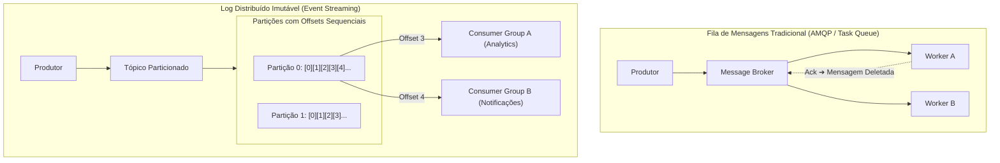

| Critério | Filas Tradicionais (ex.: RabbitMQ, Brokers AMQP) | Event Streams (ex.: Apache Kafka, Distributed Logs) |
| :--- | :--- | :--- |
| **Estrutura de Dados** | Filas efêmeras; mensagens são destruídas logo após o `ACK`. | Log ordenado, append-only e particionado gravado em disco. |
| **Modelo de Consumo** | Competing Consumers: Cada mensagem é consumida por apenas um worker. | Pub/Sub com Grupos de Consumidores: Múltiplos sistemas leem o mesmo log em offsets independentes. |
| **Capacidade de Replay** | Não suportado (a mensagem desaparece após o processamento). | Totalmente suportado: Consumidores podem retroceder o offset para reprocessar dias ou meses de dados históricos. |
| **Garantia de Ordem** | Frágil: Reenfileiramentos e retries facilmente quebram a ordem de chegada. | Estrita dentro de cada partição individual (garantida via `Partition Key`). |
| **Cenário Ideal** | Tarefas assíncronas pontuais (envio de e-mail, transcodificação de PDF). | Pipelines de dados analíticos em tempo real, Event Sourcing, integração corporativa de microsserviços. |

---

### 7.2. Semânticas de Entrega e Processamento Idempotente

Em redes distribuídas com falhas transitórias e reconexões, é impossível garantir entrega física exatamente uma vez sem coordenação transacional de custo proibitivo. As três semânticas reais são:
1. **At-Most-Once:** A mensagem é entregue 0 ou 1 vez. O produtor não repete envio se não receber confirmação. Risco de perda de dados.
2. **At-Least-Once:** A mensagem é entregue 1 ou mais vezes. O produtor insiste até receber `ACK`. Garante que nenhum dado seja perdido, mas provoca duplicidade inevitável quando o pacote de confirmação de rede se perde.
3. **Exactly-Once Processing:** Combinação de transporte **At-Least-Once** com **Consumo Idempotente** na ponta receptora.

```sql
-- Padrão Defensivo: Tabela de Deduplicação Transacional para Consumo Idempotente
CREATE TABLE processed_events (
    event_id VARCHAR(64) PRIMARY KEY,
    source_service VARCHAR(64) NOT NULL,
    processed_at TIMESTAMP WITH TIME ZONE DEFAULT CURRENT_TIMESTAMP
);

-- Execução atômica no consumidor
BEGIN TRANSACTION;
    -- Se o event_id já existir, aborta a transação imediatamente
    INSERT INTO processed_events (event_id, source_service) VALUES ('evt_9a8b7c6d', 'payment_gateway');
    
    -- Executa a alteração real de negócio
    UPDATE account_balances SET balance = balance + 500 WHERE account_id = 'acc_123';
COMMIT;
```

---

### 7.3. Padrões de Coordenação Assíncrona: Sagas e Transactional Outbox

Transações distribuídas tradicionais de Duas Fases (Two-Phase Commit / 2PC) bloqueiam recursos no banco e não escalam em ambientes de nuvem. O padrão moderno é a decomposição em **Sagas**.

#### Saga Coreografada vs. Saga Orquestrada
- **Coreografada:** Cada microsserviço emite um evento de domínio ao terminar sua tarefa local; o próximo serviço escuta e reage. Ideal para fluxos simples de até 3 ou 4 passos. Acima disso, gera acoplamento cíclico e dificulta a visualização do fluxo.
- **Orquestrada:** Um serviço orquestrador central (implementado com motores de workflow resilientes de longa duração como Temporal, Camunda ou engines similares) dita explicitamente a ordem dos passos e invoca ações compensatórias em caso de rejeição.

#### O Padrão Transactional Outbox
Evita o problema crítico de inconsistência onde a alteração no banco tem sucesso, mas a publicação subsequente no broker de mensageria falha (ou vice-versa):

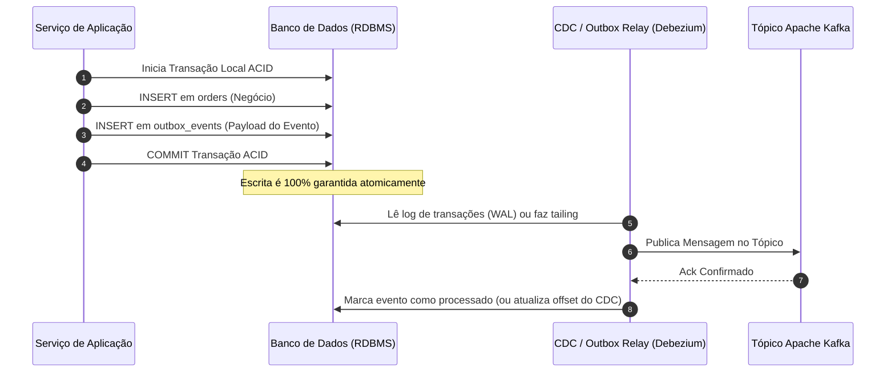

---

### 7.4. Backpressure e Controle de Fluxo

Quando os produtores geram dados a uma taxa superior à capacidade de ingestão dos consumidores, a ausência de mecanismos de controle resulta em falha por esgotamento de memória (OOM).

#### Táticas de Backpressure em Sistemas
1. **Pull-Based Consumer Loops:** O consumidor requisita explicitamente o volume de itens que é capaz de processar no momento (`prefetch_count` em AMQP ou polling manual com `max.poll.records` no Kafka).
2. **Rejeição com Código HTTP 429 e Load Shedding:** A camada de API rejeita novas entradas assim que o backlog ultrapassar o limiar de saturação, permitindo que os nós de processamento terminem o trabalho em andamento.
3. **Reactive Streams Specification:** Protocolo padronizado no nível de software (implementado em RxJS, Project Reactor, Akka Streams) onde o assinante sinaliza upstream exatamente quantas demandas pode receber (`request(n)`).

---

## 📡 8. Comunicação entre Serviços e Protocolos de Rede

A seleção dos protocolos de rede define a eficiência da serialização, a latência de handshake e o consumo de banda entre nós.

### 8.1. Camada de Transporte: TCP vs. UDP vs. QUIC (HTTP/3)

```text
TCP (Transmission Control Protocol):
  - Handshake de 3 vias (SYN, SYN-ACK, ACK) antes de enviar dados.
  - Confiabilidade garantida: Retransmissão de pacotes perdidos e controle de congestionamento.
  - Vulnerabilidade: Head-of-Line Blocking na camada de transporte (se 1 pacote atrasa, toda a stream aguarda).

UDP (User Datagram Protocol):
  - Sem conexão prévia, sem garantias de ordem ou retransmissão ("Fire and Forget").
  - Menor overhead possível de cabeçalho.
  - Uso: Streaming de áudio/vídeo em tempo real (WebRTC), jogos online competitivos, DNS.

QUIC / HTTP/3:
  - Protocolo moderno construído sobre UDP pelo Google e IETF.
  - Handshake criptográfico 0-RTT / 1-RTT consolidado com TLS 1.3 integrado.
  - Elimina o Head-of-Line Blocking entre streams multiplexadas.
```

---

### 8.2. Protocolos de Aplicação: REST vs. gRPC/Protobuf vs. GraphQL

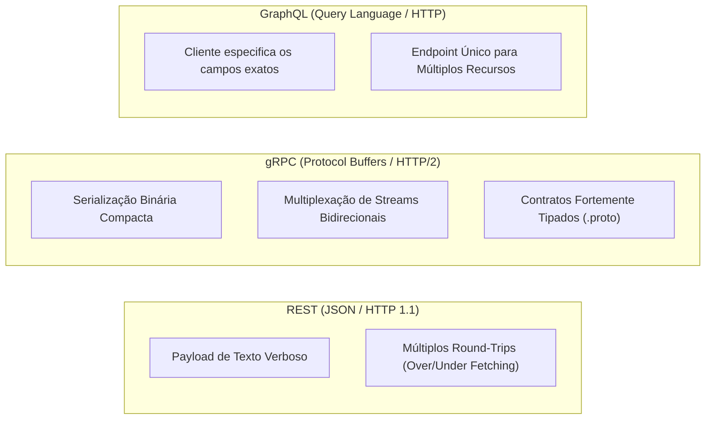

#### Comparativo de Desempenho e Aplicação

| Protocolo | Serialização | Transporte | Eficiência de Rede | Melhor Cenário de Aplicação |
| :--- | :--- | :--- | :--- | :--- |
| **gRPC** | Binário (Protobuf) | HTTP/2 | **Extrema** (até 7x a 10x mais rápido que REST) | Comunicação interna leste-oeste entre microsserviços de alto volume. |
| **REST** | Texto (JSON) | HTTP/1.1 ou HTTP/2 | Média | APIs públicas, integrações com terceiros, frontends web convencionais. |
| **GraphQL** | Texto (JSON) | HTTP | Variável (otimiza payload, mas tem custo de parsing) | BFFs atendendo clientes mobile com redes instáveis e layouts heterogêneos. |

---

### 8.3. Comunicação Bidirecional: WebSockets vs. SSE vs. Webhooks

```text
1. WEBSOCKETS:
   - Conexão TCP única, persistente, bidirecional e full-duplex sobre protocolo WS/WSS.
   - Ideal para: Dashboards de trading financeiro em tempo real, chats interativos, jogos multiplayer.
   - Desafio: Conexões stateful dificultam o balanceamento e exigem clusters de distribuição de sockets (ex: Redis Pub/Sub backplane).

2. SERVER-SENT EVENTS (SSE):
   - Conexão persistente unidirecional (Servidor ➔ Cliente) sobre protocolo HTTP padrão.
   - Reconexão automática embutida no navegador via EventSource API.
   - Ideal para: Streaming de respostas de LLMs (Generative AI), feeds de notificações unidirecionais, logs ao vivo.

3. WEBHOOKS:
   - Notificações orientadas a eventos via requisições HTTP POST convencionais disparadas entre servidores.
   - Ideal para: Integrações entre empresas distintas (ex: Stripe notificando o backend quando uma fatura for paga).
   - Requisito de Segurança: Assinatura de payload via HMAC-SHA256 para verificação de autenticidade.
```

---

## ☁️ 9. Cloud Design Patterns em Escala

Os padrões de nuvem encapsulam soluções consagradas para problemas estruturais de sistemas distribuídos modernos.

### 9.1. Padrões Estruturais e de Borda (BFF, Gateway, Strangler Fig)

#### Backends for Frontends (BFF)
Criação de serviços de backend especializados para cada classe de interface de usuário (um BFF para Mobile iOS/Android e um BFF para Web Desktop):
- Permite que a equipe mobile adapte respostas enxutas para conexões de baixa largura de banda sem impactar a interface desktop.

#### Strangler Fig Pattern (Estrangulamento de Monólitos)
Substituição gradual de funcionalidades de uma aplicação monolítica legada através de um roteador de borda:

```mermaid
flowchart LR
    Client["Requisição do Cliente"] --> Router["API Gateway / Reverse Proxy"]
    Router -->|Rotas Novas (/api/v2/orders)| NewService["Microsserviço Novo"]
    Router -->|Rotas Legadas (/api/v1/*)| Monolith["Monólito Legado"]
```

---

### 9.2. Padrões de Isolamento e Infraestrutura (Sidecar, Ambassador, Bulkhead)

- **Sidecar Pattern:** Executa componentes auxiliares (agentes de coleta de logs, proxy de telemetria, clientes de service mesh Envoy) no mesmo ciclo de vida e isolamento de rede do processo principal (como um container secundário no mesmo Pod do Kubernetes).
- **Ambassador Pattern:** Atua como um proxy local encarregado de criar túneis seguros, traduzir protocolos ou lidar com retries de forma transparente para serviços legados.
- **Bulkhead Pattern:** Isola partições de recursos (pools de threads de execução e pools de conexões de banco de dados) para que o colapso de uma integração secundária jamais consuma a capacidade dos serviços vitais.

---

### 9.3. Padrões de Acesso a Dados e Topologia Global (Valet Key, Stamps, Geodes)

#### O Padrão Valet Key
Evita que servidores de aplicação atuem como intermediários desnecessários no tráfego massivo de upload ou download de arquivos pesados (vídeos, imagens, relatórios):

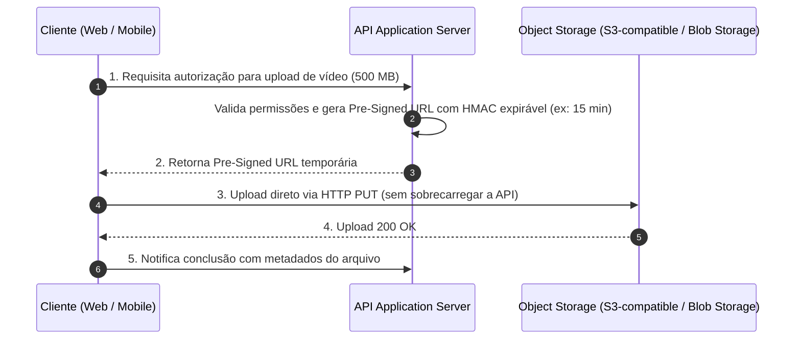

#### Deployment Stamps & Geodes Architecture
- **Deployment Stamps:** Provisionamento de cópias inteiras e autossuficientes da pilha da aplicação (serviço + banco) dedicadas a grupos isolados de clientes (ex.: 1 stamp por tenant corporativo ou 1 stamp a cada 100.000 usuários), limitando o raio de explosão (Blast Radius) de qualquer falha.
- **Geodes Architecture:** Implantação do sistema em múltiplos nós geográficos idênticos operando em modo **Active-Active** global, onde qualquer nó atende qualquer cliente com roteamento por proximidade.

---

## ⚠️ 10. Catálogo de Anti-Padrões Fatais de Escalabilidade

| Anti-Padrão | Descrição do Erro Arquitetural | Impacto em Produção | Solução Canônica Recomendada |
| :--- | :--- | :--- | :--- |
| **1. Synchronous Chain of Death** | Microsserviço A chama B, que chama C, que chama D, todos síncronos via HTTP/REST. | Latência aditiva acumulada; se um serviço oscilar, todos os callers esgotam threads de execução. | Quebrar cadeias com mensageria assíncrona, Event-Driven Architecture e replicação de dados via CQRS. |
| **2. Chatty I/O (N+1 Distribuído)** | A aplicação executa centenas de consultas granulares de rede em loop para montar um agregado. | Explosão de overhead de rede e serialização; degradação severa de p99. | Batching de APIs, paginação mandatória e consultas compostas via Dataloader ou GraphQL. |
| **3. Monolithic Persistence** | Dezenas de microsserviços acessando diretamente o mesmo banco de dados relacional compartilhado. | Acoplamento de esquema rígido, lock contention severo e impossibilidade de sharding independente. | Database-per-service; compartilhamento de dados exclusivamente via APIs ou eventos de domínio. |
| **4. Unbounded Queries** | Endpoints de consulta que realizam `SELECT * FROM orders` sem limite rígido de paginação. | Esgotamento súbito de memória (OOM) no servidor de backend ao consultar clientes antigos volumosos. | Paginação baseada em cursor (Keyset Pagination) mandatória na camada de dados; proibição de queries abertas. |
| **5. Improper Instantiation** | Criar um novo cliente HTTP (`HttpClient`) ou conexão de banco de dados a cada requisição entrante. | Esgotamento de portas TCP (TIME_WAIT socket exhaustion) e saturação de pools. | Reutilização estrita de instâncias via Singletons, Connection Pooling e keep-alive persistente. |
| **6. Retry Storm sem Jitter** | Dezenas de milhares de clientes retentam requisições com intervalos fixos após uma queda de serviço. | O serviço se recupera, mas é imediatamente derrubado de novo pelo tsunami de requisições retentadas. | Exponential Backoff com Jitter aleatório e Circuit Breakers na borda. |
| **7. Noisy Neighbor** | Um único cliente corporativo consome 80% do throughput de um cluster compartilhado multi-tenant. | Degradação inaceitável de performance e quebra de SLA para todos os demais clientes inocentes. | Rate limiting token-bucket por tenant, cotas duras de recursos e deployment stamps dedicados. |

---

## 🏢 11. Estudos de Caso Reais da Indústria

Analisar como os gigantes da tecnologia resolveram seus maiores desafios de escala fornece padrões comprovados em batalhas reais de produção.

### 11.1. Netflix: Arquitetura Microservices, Hystrix e CDN Open Connect

A Netflix opera como uma das maiores fontes de tráfego de Internet do mundo, respondendo por cerca de 15% de todo o tráfego global de downstream.

```text
                  ┌─────────────────────────────────────────┐
                  │          AWS CLOUD (Control Plane)      │
                  │  - Microsserviços e Catálogo            │
                  │  - Algoritmos de Recomendação           │
                  │  - Autenticação e Cobrança              │
                  └────────────────────┬────────────────────┘
                                       │ Metadados e URLs de Mídia
                                       ▼
                  ┌─────────────────────────────────────────┐
                  │      OPEN CONNECT (Data Plane / CDN)     │
                  │  - Servidores customizados (OCAs)       │
                  │  - Instalados dentro dos racks de ISPs  │
                  │  - Streaming de vídeo 100% local        │
                  └─────────────────────────────────────────┘
```

- **Separação Rígida entre Control Plane e Data Plane:** A infraestrutura na AWS gerencia apenas o plano de controle (navegação, recomendações e regras de negócio). O streaming dos arquivos de vídeo (Data Plane) nunca toca os servidores centrais da AWS.
- **Open Connect CDN:** A Netflix construiu sua própria infraestrutura de hardware (Open Connect Appliances - OCAs) e distribuiu gratuitamente esses servidores para serem instalados fisicamente dentro dos datacenters dos provedores de Internet (ISPs) locais ao redor do globo.
- **Cultura de Engenharia do Caos (Chaos Engineering):** Criação do *Chaos Monkey* e da suíte *Simian Army*, ferramentas automatizadas que desligam aleatoriamente instâncias de produção durante o horário comercial para forçar os engenheiros a desenharem sistemas intrinsecamente tolerantes a falhas parciais.

---

### 11.2. Twitter / X: O Dilema do Fan-Out da Linha do Tempo

O Twitter lida com uma assimetria extrema entre operações de leitura e escrita em escala de centenas de milhões de usuários.

#### A Batalha dos Modelos: Fan-out on Write vs. Fan-out on Read

```text
1. FAN-OUT ON WRITE (Push Model):
   - Ao postar um tweet: O sistema busca todos os seguidores do autor e insere o ID do tweet
     na Timeline Cache (Redis) de cada seguidor imediatamente.
   - Leitura da Linha do Tempo: Custo O(1) instantâneo (apenas lê a lista ordenada no Redis).
   - O Gargalo Fatal: Celebridades! Quando um usuário com 100 milhões de seguidores posta,
     o sistema precisa executar 100 milhões de escritas em cache simultâneas (Thundering Herd).

2. FAN-OUT ON READ (Pull Model):
   - Ao postar um tweet: O tweet é gravado apenas na tabela de tweets do autor.
   - Leitura da Linha do Tempo: No momento em que o usuário abre o app, o sistema busca quem
     ele segue, lê os últimos tweets de cada um e faz o merge-sort em tempo de execução.
   - O Gargalo Fatal: Leitura extremamente custosa e lenta para usuários comuns.
```

#### A Solução Híbrida em Produção
- Para **99.9% dos usuários normais**, o Twitter adota **Fan-out on Write** (as timelines dos amigos são pré-computadas na escrita).
- Para **usuários celebridades (Hot Users)** com mais de dezenas de milhares de seguidores, o sistema **interrompe o fan-out de escrita**. O tweet não é propagado para as caixas de entrada.
- Quando um seguidor abre o aplicativo, a engine busca a timeline pré-computada em cache e faz o merge em tempo real apenas com os tweets das celebridades que ele segue, eliminando o gargalo de escrita massiva.

---

### 11.3. Uber: Sharding Geoespacial com Hexágonos H3 e Ringpop

O modelo de negócio da Uber depende de emparelhar motoristas e passageiros com base em coordenadas físicas de latitude e longitude que mudam a cada fração de segundo.

- **O Problema da Busca Geoespacial Tradicional:** Índices relacionais padrão (B-Tree) são unidimensionais e não processam eficientemente buscas bidimensionais por proximidade (`ST_DWithin` em SQL causa table scans pesados sob dezenas de milhares de queries por segundo).
- **A Solução: H3 Spatial Indexing:** A Uber discretizou a superfície de todo o planeta Terra em uma malha contínua de **células hexagonais hierárquicas** de múltiplos tamanhos (resoluções). Cada hexágono possui um identificador numérico de 64 bits.
- **Roteamento com Ringpop:** A Uber implementou o Ringpop, um protocolo descentralizado baseado em Consistent Hashing e protocolo Gossip (SWIM). Quando um passageiro em São Paulo solicita uma corrida, o hash do hexágono geográfico daquele bairro roteia a requisição exatamente para o nó do cluster que detém o estado em memória dos motoristas disponíveis naquele hexágono específico.

---

### 11.4. Amazon: O Carrinho de Compras em Alta Disponibilidade no Dynamo

O clássico paper científico do Amazon Dynamo (2007) originou o movimento NoSQL a partir de uma regra de negócio inegociável formulada pela diretoria da Amazon: **"Um cliente jamais pode ser impedido de adicionar um item ao seu carrinho de compras."**

- **A Decisão CAP:** Entre Consistência ($C$) e Disponibilidade ($A$), a Amazon escolheu deliberadamente **Disponibilidade Máxima ($AP$)**.
- **A Solução Técnica:** Se o nó primário ou a rede estiverem particionados, a escrita é aceita por qualquer réplica saudável através de *Sloppy Quorum* e *Hinted Handoff*.
- **A Consequência:** Se duas réplicas divergirem durante uma partição de rede, o Dynamo utiliza *Vector Clocks* e joga a responsabilidade de resolução de conflitos para a aplicação. A regra de negócio do carrinho foi programada para aplicar a **União dos Conjuntos**: se houver conflito, o sistema prefere ressuscitar um item excluído a perder uma venda potencial.

---

### 11.5. Meta / Facebook: Escala Massiva de Memcached e Lease Tokens

O Facebook opera o maior deployment de cache em memória do planeta, servindo bilhões de requisições por segundo com clusters de milhares de servidores Memcached orquestrados pelo proxy customizado **Mcrouter**.

- **O Problema de Concorrência de Leitura e Escrita:** Sob tráfego brutal, a sequência clássica de Cache-Aside (Leitura Miss ➔ Busca no DB ➔ Grava no Cache) gera condições de corrida onde dados obsoletos sobrescrevem dados novos no cache.
- **A Solução: Lease Tokens:**
  - Quando ocorre um Cache Miss, o Memcached retorna um **Lease Token** (identificador único temporário de 64 bits) para aquele cliente específico.
  - O Memcached garante que apenas o cliente detentor do Lease válido tem permissão de gravar o dado reconstruído no cache nos próximos segundos.
  - Se outro cliente alterar o dado no banco enquanto o primeiro ainda está processando, o lease é invalidado internamente, impedindo a gravação de dados desatualizados no cache e resolvendo simultaneamente o problema de Cache Stampede.

---

## 🔍 12. Matriz Diagnóstica: Gargalo ➔ Causa Raiz ➔ Padrão de Escala

| Sintoma Observado no Sistema | Métrica Crítica Alterada | Provável Causa Raiz de Engenharia | Padrão Arquitetural de Correção |
| :--- | :--- | :--- | :--- |
| **Picos extremos de latência no p99** | Latência p99 > 2.000ms enquanto p50 < 30ms | Tail Latency Amplification em fan-out síncrono ou pausas longas de Garbage Collection. | Introduzir Hedged Requests com cancelamento de streams; adotar gRPC e tunar GC da runtime. |
| **Banco primário com CPU em 100% e conexões esgotadas** | Saturação de Conexões (Max Connections) e Disk IOPS | Aplicação fazendo leituras analíticas pesadas e consultas repetidas no nó de escrita primário. | Implantar Read Replicas com balanceamento de consultas; adicionar camada de Cache-Aside com Redis. |
| **Saturação de memória e crash OOM após expiração de chave** | Memória do App estoura; queries idênticas no banco | Cache Stampede (Thundering Herd) sobre chaves quentes de alto tráfego recém-expiradas. | Implementar Locks Distribuídos com Redis `SETNX` ou Early Refresh Probabilístico (Algoritmo XFetch). |
| **Timeout em cadeia entre múltiplos microsserviços** | Cascata de erros HTTP 504 em todos os endpoints | Dependência secundária lenta retendo pools de threads de serviços upstream por falta de limites. | Configurar Timeouts agressivos na raiz e isolar dependências em pools estanques via Bulkhead. |
| **Perda intermitente de dados após falha de nó de banco** | Discrepância entre nós primários e réplicas | Replicação assíncrona promovendo réplica com lag a líder primário (Failover com perda). | Configurar replicação semi-síncrona com quórum estrito ($W + R > N$) ou adotar Raft/Paxos. |
| **Acúmulo infinito de mensagens não processadas** | Consumer Lag crescente em tópicos Kafka ou RabbitMQ | Consumidores lentos, falta de paralelismo por chave ou mensagens venenosas (Poison Pills). | Aumentar partições do tópico e número de workers; isolar falhas em Dead Letter Queues (DLQ). |
| **Erros de conexão TCP esgotada (Cannot assign requested address)** | Conexões presas em estado `TIME_WAIT` | Aplicação instanciando e descartando clientes HTTP a cada requisição entrante. | Configurar HTTP Connection Pooling persistente com reaproveitamento de sockets TCP (Keep-Alive). |

---

## ✅ 13. Checklist de Homologação e Review de System Design

Utilize este checklist em sabatinas arquiteturais, sessões de design review e antes do go-live de qualquer sistema distribuído de grande porte:

### 1. Requisitos e Estimativas
- [ ] Os requisitos funcionais essenciais e os requisitos explicitamente descartados do escopo foram validados com o negócio?
- [ ] Os cálculos de ordem de grandeza (QPS de escrita, QPS de leitura, largura de banda e storage em 5 anos) foram formalizados matematicamente?
- [ ] A capacidade da memória RAM para cache foi estimada respeitando a Regra de Pareto (80/20)?

### 2. Teoria e Consistência de Dados
- [ ] O sistema foi explicitamente projetado como **CP** ou **AP** sob partição de rede?
- [ ] O modelo de consistência de dados (Linearizabilidade, Causal, Read-Your-Writes, Eventual) atende aos requisitos do domínio?
- [ ] Caso utilize quóruns ($N, R, W$), a regra de quórum estrito ($W + R > N$) foi respeitada para caminhos críticos?

### 3. Camada de Borda e Roteamento
- [ ] O balanceador de carga possui redundancy ativa e os health checks estão devidamente configurados?
- [ ] A terminação SSL/TLS foi posicionada na borda para aliviar a carga de processamento dos backends?
- [ ] Assets estáticos estão desacoplados em Object Storage servidos via CDN com estratégia de cache-busting imutável?

### 4. Persistência e Sharding
- [ ] O esquema de dados foi validado contra os padrões de acesso reais (evitando joins trans-partição em NoSQL)?
- [ ] A Shard Key selecionada distribui leituras e escritas de maneira uniforme, sem risco de criação de hot partitions?
- [ ] A topologia de replicação prevê tolerância a falhas sem perda de dados (RPO = 0) para transações financeiras?

### 5. Caching e Resiliência
- [ ] As patologias clássicas de cache (Stampede, Avalanche e Penetration) possuem mitigações ativas no código?
- [ ] Todos os clientes HTTP externos e chamadas de banco possuem timeouts rígidos e pools de conexão dimensionados?
- [ ] As operações repetíveis por retry possuem garantia matemática de idempotência através de chaves únicas?

### 6. Assincronismo e Observabilidade
- [ ] Operações lentas foram descarregadas para workers assíncronos desacoplados por filas ou event streams?
- [ ] Mensagens venenosas são isoladas em Dead Letter Queues (DLQ) com alertas automáticos para o time de plantão?
- [ ] O sistema implementa os 3 pilares da observabilidade (Logs estruturados, Métricas RED/USE e Distributed Tracing OpenTelemetry)?

---

## 📚 14. Referências Canônicas e Bibliografia

1. **Kleppmann, Martin.** *Designing Data-Intensive Applications: The Big Ideas Behind Reliable, Scalable, and Maintainable Systems.* O'Reilly Media, 2017. (A bíblia definitiva sobre modelos de dados, replicação, particionamento e consistência distribuída).
2. **Xu, Alex.** *System Design Interview – An Insider's Guide (Volumes 1 e 2).* ByteByteGo, 2020/2022. (Frameworks práticos e estudos de caso aplicados da indústria).
3. **Burns, Brendan.** *Designing Distributed Systems: Patterns and Paradigms for Scalable, Reliable Services.* O'Reilly Media, 2018. (Padrões de containerização, sidecars e deployment stamps).
4. **Hohpe, Gregor & Woolf, Bobby.** *Enterprise Integration Patterns: Designing, Building, and Deploying Messaging Solutions.* Addison-Wesley, 2003. (O catálogo canônico de padrões de mensageria assíncrona).
5. **Vogels, Werner.** *A Word on Scalability.* All Things Distributed, 2006. (Fundamentos conceituais sobre escalabilidade horizontal e proporcionalidade de recursos).
6. **DeCandia, Giuseppe et al.** *Dynamo: Amazon’s Highly Available Key-value Store.* SOSP '07: Proceedings of twenty-first ACM SIGOPS symposium on Operating systems principles, 2007. (O paper que fundou as bases dos sistemas AP e quóruns afináveis).
7. **Karger, David et al.** *Consistent Hashing and Random Trees: Distributed Caching Protocols for Relieving Hot Spots on the World Wide Web.* ACM STOC, 1997. (A formulação matemática original do Consistent Hashing).
8. **Dean, Jeff & Barroso, Luiz André.** *The Tail at Scale.* Communications of the ACM, Vol. 56 No. 2, 2013. (Amplificação de latência de cauda e técnicas de hedged requests no Google).
9. **Abadi, Daniel.** *Consistency Tradeoffs in Modern Distributed Database System Design: CAP is Only Part of the Story.* IEEE Computer, 2012. (Definição formal do Teorema PACELC).
10. **Newman, Sam.** *Building Microservices: Designing Fine-Grained Systems (2nd Edition).* O'Reilly Media, 2021. (Fronteiras de serviços, decomposição e comunicação distribuída).
