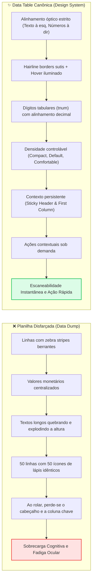
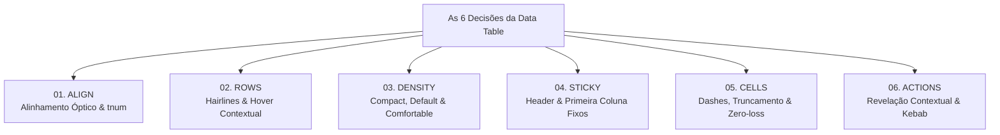
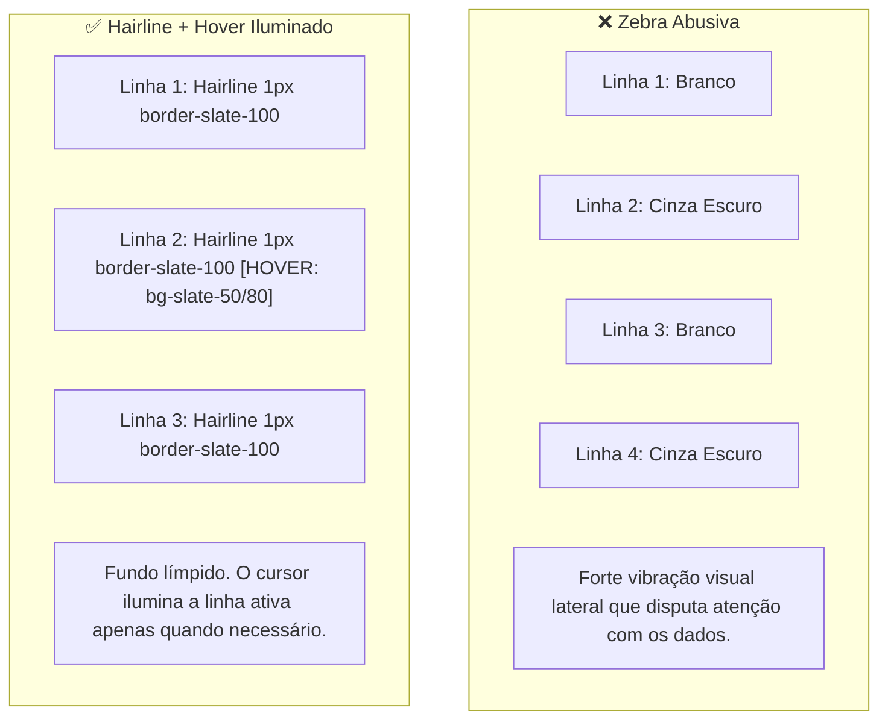
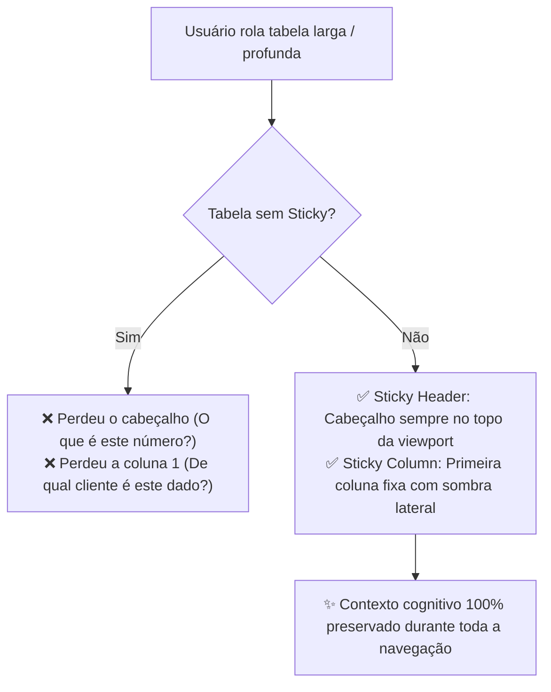
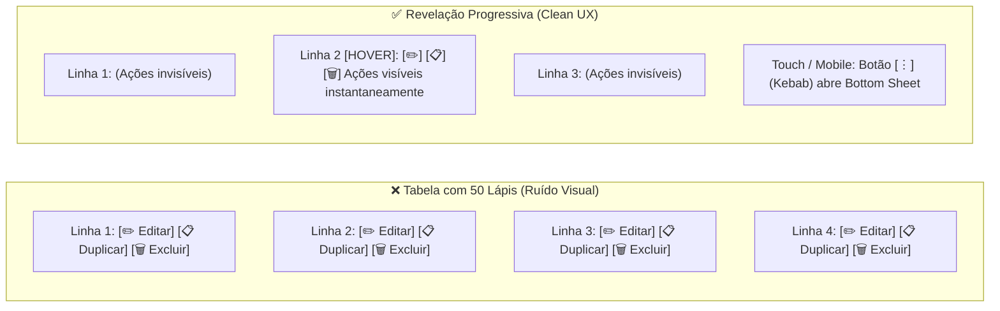
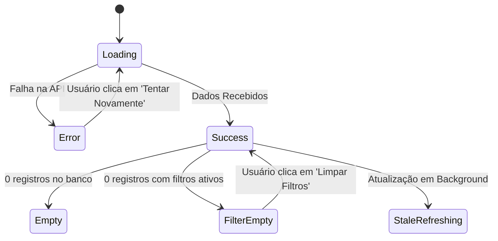
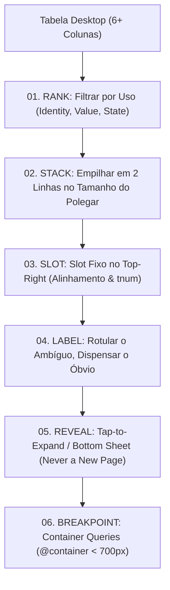
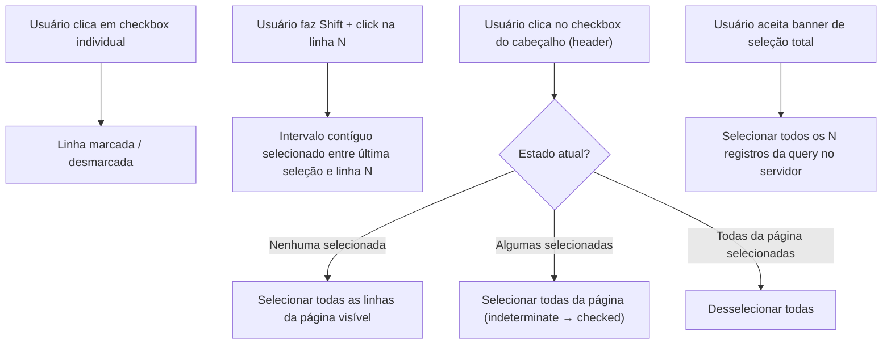

<!--
=================================================================================
LOG DE MANUTENÇÃO E ALTERAÇÕES DO DOCUMENTO
=================================================================================
Data       | Autor          | Descrição da Alteração
-----------|----------------|--------------------------------------------------
2026-09-07 | Matheus Diniz  | Criação do Guia Canônico de Componentes de Tabela
           | (Antigravity)  | (Data Tables) estabelecendo as 6 Decisões Arquiteturais
           |                | de UI/UX (Align, Rows, Density, Sticky, Cells, Actions),
           |                | padrões avançados de tipografia tabular (tnum),
           |                | virtualização, estados canônicos, conformidade WCAG 2.2
           |                | (AA/AAA) e implementações com Tailwind CSS e React/Angular.
=================================================================================
-->

# 📊 Guia Canônico de Componentes de Tabela (Data Tables) em UI/UX & Design Systems

> _"Sua tabela é uma planilha disfarçada. Seis decisões arquiteturais consertam isso."_  
> — Diretriz Canônica de Design de Sistemas de Dados

<div align="center">

[](../../README.md)
[](../../README.md)
[](../../README.md)

<p align="center">
  <b>Manual normativo e prescritivo para projetar e implementar tabelas de dados de alta densidade, escaneabilidade instantânea, micro-interações ergonômicas e conformidade estrita com acessibilidade e performance.</b>
</p>

</div>

---

## 🧭 Sumário Executivo

1. [O Manifesto: Por Que Tabelas Falham (Planilhas vs. Data Tables)](#-1-o-manifesto-por-que-tabelas-falham-planilhas-vs-data-tables)
2. [O Framework das 6 Decisões Fundamentais](#-2-o-framework-das-6-decisões-fundamentais)
   - [Decisão 01: Alinhamento Tipográfico & Numérico Rigoroso (Align)](#-decisão-01-alinhamento-tipográfico--numérico-rigoroso-align)
   - [Decisão 02: Estrutura Visual das Linhas & Hierarquia (Rows)](#-decisão-02-estrutura-visual-das-linhas--hierarquia-rows)
   - [Decisão 03: Densidade de Dados & Ergonomia Operacional (Density)](#-decisão-03-densidade-de-dados--ergonomia-operacional-density)
   - [Decisão 04: Persistência de Contexto & Navegação Sticky (Sticky)](#-decisão-04-persistência-de-contexto--navegação-sticky-sticky)
   - [Decisão 05: Anatomia e Tratamento Seguro de Células (Cells)](#-decisão-05-anatomia-e-tratamento-seguro-de-células-cells)
   - [Decisão 06: Economia Cognitiva nas Ações e Ordenação (Actions)](#-decisão-06-economia-cognitiva-nas-ações-e-ordenação-actions)
3. [Tipografia & Números Tabulares (`tnum`)](#-3-tipografia--números-tabulares-tnum)
4. [Acessibilidade Universal: Semântica, ARIA & Navegação por Teclado](#-4-acessibilidade-universal-semântica-aria--navegação-por-teclado)
5. [Os 6 Estados Canônicos de uma Data Table](#-5-os-6-estados-canônicos-de-uma-data-table)
6. [Tabelas Responsivas & Estratégias Mobile (O Framework das 6 Decisões Mobile)](#-6-tabelas-responsivas--estratégias-mobile-o-framework-das-6-decisões-mobile)
   - [Decisão 01: Priorização Rígida de Colunas (Rank)](#-61-decis%C3%A3o-01-prioriza%C3%A7%C3%A3o-r%C3%ADgida-de-colunas-rank)
   - [Decisão 02: Empilhamento Vertical em Altura de Toque (Stack)](#-62-decis%C3%A3o-02-empilhamento-vertical-em-altura-de-toque-stack)
   - [Decisão 03: Slot Fixo para Métricas Numéricas (Slot)](#-63-decis%C3%A3o-03-slot-fixo-para-m%C3%A9tricas-num%C3%A9ricas-slot)
   - [Decisão 04: Rotulagem Contextual do Ambíguo (Label)](#-64-decis%C3%A3o-04-rotulagem-contextual-do-amb%C3%ADguo-label)
   - [Decisão 05: Revelação Progressiva sem Perda de Contexto (Reveal)](#-65-decis%C3%A3o-05-revela%C3%A7%C3%A3o-progressiva-sem-perda-de-contexto-reveal)
   - [Decisão 06: Breakpoints Baseados no Componente (Breakpoint)](#-66-decis%C3%A3o-06-breakpoints-baseados-no-componente-breakpoint)
7. [Performance, DOM Bloat & Virtualização](#-7-performance-dom-bloat--virtualização)
8. [Implementação de Referência (Design Tokens & Código)](#-8-implementação-de-referência-design-tokens--código)
9. [Seleção Múltipla de Linhas & Bulk Actions](#-9-seleção-múltipla-de-linhas--bulk-actions)
10. [Matriz de Auditoria & Scorecard de Excelência](#-10-matriz-de-auditoria--scorecard-de-excelência)

---

## 🏛️ 1. O Manifesto: Por Que Tabelas Falham (Planilhas vs. Data Tables)

O erro mais endêmico em dashboards corporativos, sistemas de backoffice e interfaces analíticas é transpor cegamente um dump de banco de dados ou uma folha de cálculo do Excel para a tela da web.



### O Princípio Data-to-Ink Ratio (Edward Tufte)

Segundo Edward Tufte, uma boa apresentação gráfica maximiza a proporção de "tinta de dados" (a informação útil que o usuário precisa absorver) em relação à "tinta total" (linhas pesadas, fundos contrastantes, caixas de contorno e decorações).

> **A Regra de Ouro:** A estrutura da tabela deve ser quase invisível. O que deve chamar a atenção é o dado, não o grid que o sustenta.

---

## 🎯 2. O Framework das 6 Decisões Fundamentais



---

### 📐 Decisão 01: Alinhamento Tipográfico & Numérico Rigoroso (Align)

> _"Amounts centered. Digits never line up, so the eye can't compare. Numbers right, tabular figures on. Text left. A column of amounts now reads like a receipt."_

#### O Problema do Centro

Quando valores numéricos são centralizados, a posição da vírgula decimal e das ordens de grandeza (centenas, milhares, milhões) varia para cada linha. O cérebro humano é obrigado a fazer um zigue-zague visual para tentar comparar magnitudes, gerando lentidão e erros graves em auditorias ou operações financeiras.

#### As 4 Regras Canônicas de Alinhamento:

| Tipo de Dado                   |         Alinhamento         | Exemplo Visual                     | Racional Ergonômico                                                                                                  |
| :----------------------------- | :-------------------------: | :--------------------------------- | :------------------------------------------------------------------------------------------------------------------- |
| **Texto Descritivo / Nomes**   | **Esquerda** (`text-left`)  | `Maria da Silva`, `São Paulo - SP` | O padrão de leitura ocidental (L-to-R) tem sua âncora visual na borda esquerda.                                      |
| **Valores Numéricos & Moedas** | **Direita** (`text-right`)  | `R$ 1.450,20`<br>`R$    12,50`     | Alinha unidades, dezenas e casas decimais. Lê-se instantaneamente como um extrato bancário ou recibo fiscal.         |
| **Datas & Horários ISO**       | **Direita** ou **Esquerda** | `2026-09-07 14:30`                 | Se formato numérico de comprimento fixo (YYYY-MM-DD), alinha-se à direita; se texto com mês por extenso, à esquerda. |
| **Status / Badges / Checkbox** | **Centro** (`text-center`)  | `[Ativo]`, `[Pendente]`, `☑`       | Elementos atômicos com largura homogênea e sem necessidade de comparação decimal.                                    |

> [!IMPORTANT]
> **O Cabeçalho Segue a Coluna:** O título da coluna (`<th>`) deve rigorosamente espelhar o alinhamento dos seus dados (`<td>`). Se a coluna contém valores em Reais alinhados à direita, o título "Valor Total" deve estar **alinhado à direita**. Misturar cabeçalho à esquerda com números à direita cria desconexão visual.

```html
<!-- ❌ ANTI-PATTERN: Números centralizados sem dígitos tabulares -->
<td class="text-center font-sans">R$ 1.450,00</td>
<td class="text-center font-sans">R$ 95,30</td>

<!-- ✅ PADRÃO CANÔNICO: Alinhamento à direita + dígitos tabulares -->
<th
  class="text-right text-xs font-semibold text-slate-500 uppercase tracking-wider"
>
  Valor Bruto
</th>
<td
  class="text-right font-mono tabular-nums text-sm font-medium text-slate-900"
>
  R$ 1.450,00
</td>
```

---

### 🦓 Decisão 02: Estrutura Visual das Linhas & Hierarquia (Rows)

> _"Zebra stripes fight the content. Every other row screams for nothing. One hairline between rows. Hover lights the row you're on. Stripes earn their place on wide rows only."_

#### O Fim das Zebra Stripes Gratuitas

Listras zebradas alternadas (`bg-slate-50` em linhas pares) foram criadas na era do papel impresso contínuo (folhas de formulário com fita verde). Na web moderna, pintar 50% das linhas adiciona 50% de ruído de contraste. O cérebro gasta energia interpretando a faixa cinza em vez de focar no texto.



#### A Tríade da Linha Moderna

1. **Divisor Hairline Sutil:** Uma linha única de 1px com cor de baixíssimo contraste (ex: `border-b border-slate-200/60` no modo claro ou `border-zinc-800/80` no modo escuro).
2. **Hover Iluminado:** A linha sob o ponteiro do mouse ganha um realce sutil (`hover:bg-slate-50/70` ou `hover:bg-zinc-800/50`) com transição suave (`transition-colors duration-150`).
3. **Zebra Apenas por Exceção:** Linhas zebradas só têm justificativa funcional quando a tabela ultrapassa **12 a 15 colunas visíveis** simultaneamente e o usuário precisa rastrear a leitura horizontal através de uma tela ultrawide sem perder a linha-guia.

---

### 📏 Decisão 03: Densidade de Dados & Ergonomia Operacional (Density)

> _"Row height is a decision, not a padding. Compact: 40, default: 48, comfortable: 56. Three modes, one toggle. Dense for ops, airy for review."_

A altura das linhas não é um capricho acidental de `py-4`. Ela é um parâmetro arquitetural ditado pelo **tipo de tarefa cognitiva** do usuário.

```text
┌─────────────────────────────────────────────────────────────┐
│ COMPACT: 40px (h-10)   Operações, Triagem, Backoffice, ERPs │
├─────────────────────────────────────────────────────────────┤
│ DEFAULT: 48px (h-12)   SaaS Geral, Dashboards, CRM, Finanças│
├─────────────────────────────────────────────────────────────┤
│ COMFORTABLE: 56px (h-14) Análise Executiva, Células com 2 Linhas │
└─────────────────────────────────────────────────────────────┘
```

#### Tabela Comparativa de Densidade

| Modo de Densidade    |  Altura da Linha  | Padding Vertical | Casos de Uso Recomendados                                                                                | Target de Usuário                                                      |
| :------------------- | :---------------: | :--------------: | :------------------------------------------------------------------------------------------------------- | :--------------------------------------------------------------------- |
| **Compact**          | **40px** (`h-10`) |   `py-2` (8px)   | Telas de trading, conciliação fiscal, ERPs pesados, logs de sistema, inventários de 5.000 itens.         | Operadores que precisam ver 25+ linhas simultâneas sem rolar a página. |
| **Default** (Padrão) | **48px** (`h-12`) |  `py-3` (12px)   | Quase todos os produtos SaaS, faturamento, listagem de clientes, tabelas de pedidos.                     | Equilíbrio perfeito entre escaneabilidade e conforto tátil.            |
| **Comfortable**      | **56px** (`h-14`) |  `py-4` (16px)   | Linhas com células duplas (ex: Nome do Cliente + e-mail embaixo), telas de aprovação executiva, tablets. | Usuários com consumo contemplativo ou leitura detalhada.               |

#### O Seletor de Densidade (Density Toggle)

Disponibilize um controle na barra superior da tabela permitindo que o próprio operador alterne entre as densidades, persistindo a escolha no `localStorage`:

```tsx
// Exemplo conceitual de toggle com persistência
type TableDensity = "compact" | "default" | "comfortable";

const densityClasses: Record<TableDensity, string> = {
  compact: "h-10 py-2 text-xs",
  default: "h-12 py-3 text-sm",
  comfortable: "h-14 py-4 text-sm",
};
```

---

### 📌 Decisão 04: Persistência de Contexto & Navegação Sticky (Sticky)

> _"12 columns, the screen shows six. Scroll right and you lose the row's name. Pin the first column. Pin the header on vertical scroll. Context never leaves the screen."_

A perda de contexto é o maior destruidor de usabilidade em grandes tabelas. Ao rolar 100 linhas para baixo, o usuário esquece o significado daquela coluna com o número `34`. Ao rolar 10 colunas para a direita, ele esquece a quem pertence aquele valor.



#### Implementação de Sticky Duplo com CSS Nativo

1. **Sticky Header (Vertical):**

   ```css
   thead th {
     position: sticky;
     top: 0;
     z-index: 20;
     background-color: var(--color-surface);
     box-shadow: 0 1px 0 0 var(--color-border-subtle);
   }
   ```

2. **Sticky First Column (Horizontal):**
   ```css
   /* A primeira coluna identifica a entidade e não se move durante scroll lateral */
   tbody td:first-child,
   thead th:first-child {
     position: sticky;
     left: 0;
     z-index: 10;
     background-color: inherit;
   }

   /* Elevação visual quando o container tem scroll horizontal ativo */
   .table-scrolled tbody td:first-child::after,
   .table-scrolled thead th:first-child::after {
     content: "";
     position: absolute;
     top: 0;
     right: -8px;
     bottom: 0;
     width: 8px;
     pointer-events: none;
     background: linear-gradient(to right, rgba(0, 0, 0, 0.06), transparent);
   }
   ```

---

### 🔍 Decisão 05: Anatomia e Tratamento Seguro de Células (Cells)

> _"An empty cell is a question: missing, zero, or loading? Use a dash. Long text wraps and the row explodes. Truncate, tooltip on hover. Numbers never truncate."_

A célula individual é a unidade fundamental de informação. Três erros críticos destroem tabelas nesta camada:

#### 1. A Ambiguidade do Espaço Vazio

Um espaço em branco dentro de uma célula gera três dúvidas imediatas no usuário:

- _O dado está carregando?_
- _O valor é zero?_
- _O dado não existe / é desconhecido?_

**A Regra:** Use sempre um travessão tipográfico (en-dash `–` ou em-dash `—`) com cor atenuada (`text-slate-400`). Nunca deixe a célula em branco e nunca escreva `null` ou `undefined`.

> [!CAUTION]
> **Zero NÃO é Vazio:** `0` é um valor quantitativo factual. Se um cliente tem 0 transações, mostre `0`. Se o cliente nunca cadastrou o telefone, mostre `—`. Misturar zero com ausência de registro causa falhas graves em relatórios financeiros e contábeis.

#### 2. Truncamento com Reticências vs. Explosão de Altura

Quando uma descrição possui 3 parágrafos, permitir que o texto quebre linhas naturalmente faz a linha passar de 48px para 220px, quebrando o ritmo visual da tabela e desalinhando toda a página.

- **Para Textos Longos (Descrições, Notas):** Trunque em uma linha com `truncate` (`text-overflow: ellipsis; white-space: nowrap; overflow: hidden;`), e forneça o conteúdo integral via **Tooltip** no hover ou via clique para abrir um Drawer lateral.
- **Para Identificadores (UUIDs, Hashes):** Trunque no meio (`0x4A8F...91B2`) e forneça um botão de clique rápido para copiar (`Copy to clipboard`).

#### 3. A Regra Inegociável: NÚMEROS NUNCA TRUNCAM!

> [!WARNING]
> **Catástrofe Financeira do Truncamento Numérico:**  
> Se o valor financeiro for `R$ 1.500.000,00` e a coluna truncar com reticências virando `R$ 1.50...`, o usuário pode tomar decisões executivas acreditando que o valor é `R$ 1.500,00` ou `R$ 15,00`.  
> **Valores monetários, porcentagens, taxas, datas e quantidades jamais devem receber `text-overflow: ellipsis`.** Se o número não couber, a coluna inteira deve ter largura mínima fixa (`min-w-[140px]`) e forçar scroll lateral horizontal, nunca truncar a cifra.

---

### ⚡ Decisão 06: Economia Cognitiva nas Ações e Ordenação (Actions)

> _"An action column on every row is noise. 50 rows, 50 pencils. Reveal on hover or focus. Touch gets a kebab. Sort arrows only on the active column."_

#### O Problema dos "50 Lápis"

Renderizar 3 botões (Editar, Duplicar, Excluir) em cada uma das 50 linhas da tabela resulta em **150 botões coloridos** competindo pelo foco da visão periférica do usuário. O layout parece uma árvore de natal piscando em ruído estático.



#### Ações com Revelação Progressiva:

1. **Desktop com Mouse:** A coluna de ações rápidas permanece invisível (`opacity-0 pointer-events-none`) e surge suavemente (`group-hover:opacity-100 group-hover:pointer-events-auto`) quando a linha recebe hover.
2. **Acessibilidade por Teclado:** Se o usuário navegar com a tecla `Tab`, a ação deve se tornar visível imediatamente quando qualquer elemento filho da linha receber foco (`group-focus-within:opacity-100`).
3. **Dispositivos Touch / Mobile:** No celular ou tablet (onde `:hover` não existe), as ações são condensadas em um botão kebab universal de três pontos verticais (`⋮`), abrindo um Menu Dropdown ou uma Bottom Sheet.

#### Ordenação Inteligente (Sort Indicators):

Não exiba setas de ordenação cinzas duplas (`↕`) em todos os 10 cabeçalhos da tabela ao mesmo tempo.

- **Coluna Ativa:** Mostre a seta direcional (↑ Crescente ou ↓ Decrescente) com cor destacada apenas na coluna que está ativamente ordenando a tabela.
- **Colunas Inativas:** Deixe o cabeçalho limpo. Mostre um ícone translúcido de seta apenas quando o mouse passar por cima do cabeçalho daquela coluna, indicando que ela é clicável para ordenar.

---

## 🔢 3. Tipografia & Números Tabulares (`tnum`)

Em fontes tipográficas convencionais de proporção variável, o caractere `1` é consideravelmente mais estreito que o caractere `8` ou `0`. Como consequência, somas e tabelas financeiras sofrem oscilação lateral constante.

```text
SEM TABULAR-NUMS (Largura Proporcional):
11.111,11  <- Mais curto visualmente
88.888,88  <- Mais longo visualmente
(O olho não consegue bater a vírgula)

COM TABULAR-NUMS (Largura Fixa por Glifo Numérico):
11.111,11
88.888,88
(Alinhamento vertical milimétrico de cada dígito e da vírgula)
```

### Configuração CSS para Dígitos Tabulares:

```css
/* Ativação nativa em CSS moderno */
.tabular-nums {
  font-variant-numeric: tabular-nums;
  font-feature-settings: "tnum";
}

/* Em Tailwind CSS */
/* Basta aplicar a classe utilitária: 'tabular-nums' */
```

Fontes recomendadas com suporte de excelência a numerais tabulares: **Inter**, **Geist**, **Roboto**, **SF Pro**, **JetBrains Mono**.

---

## ♿ 4. Acessibilidade Universal: Semântica, ARIA & Navegação por Teclado

Uma tabela de dados profissional deve cumprir rigorosamente as diretrizes **WCAG 2.2 Níveis AA e AAA**.

### Matriz de Atributos Semânticos e ARIA:

```html
<table role="table" aria-label="Extrato Consolidado de Vendas">
  <caption class="sr-only">
    Listagem detalhada das transações comerciais do mês corrente
  </caption>

  <thead>
    <tr>
      <!-- Checkbox de seleção em massa -->
      <th scope="col" class="w-10">
        <input
          type="checkbox"
          aria-label="Selecionar todas as 50 linhas"
          aria-checked="mixed"
        />
      </th>

      <!-- Cabeçalho textual ordenável -->
      <th
        scope="col"
        aria-sort="ascending"
        aria-label="Cliente, ordenado de forma ascendente"
      >
        <button type="button" class="flex items-center gap-1">
          Cliente
          <span aria-hidden="true">↑</span>
        </button>
      </th>

      <!-- Cabeçalho numérico -->
      <th scope="col" class="text-right">Valor Transacionado</th>

      <!-- Cabeçalho de ações -->
      <th scope="col" class="w-16 text-right">
        <span class="sr-only">Ações Disponíveis</span>
      </th>
    </tr>
  </thead>

  <tbody>
    <tr class="group hover:bg-slate-50 focus-within:bg-slate-50">
      <td><input type="checkbox" aria-label="Selecionar transação 1024" /></td>
      <th scope="row" class="text-left font-medium">Acme Corp</th>
      <td class="text-right tabular-nums">R$ 12.450,00</td>
      <td class="text-right">
        <!-- Ações contextuais acessíveis via teclado -->
        <div
          class="opacity-0 group-hover:opacity-100 group-focus-within:opacity-100 transition-opacity"
        >
          <button type="button" aria-label="Editar transação Acme Corp">
            ✏️
          </button>
        </div>
      </td>
    </tr>
  </tbody>
</table>
```

### `role="table"` vs. `role="grid"`: Qual Escolher?

- **Use `role="table"`:** Quando o propósito da tabela for primariamente a **leitura sequencial de dados**, navegação com leitor de tela linha a linha e navegação nativa do navegador com `Tab`. Recomendado para 90% dos casos de dashboards.
- **Use `role="grid"`:** Quando a tabela for interativa estilo planilha editável (células que viram inputs inline com dois cliques), exigindo navegação bidirecional rápida via **setas do teclado** (ArrowUp, ArrowDown, ArrowLeft, ArrowRight) entre as células.

---

## 🔄 5. Os 6 Estados Canônicos de uma Data Table

Nenhum componente de tabela pode ser considerado pronto para produção se não contemplar com precisão cirúrgica os 6 estados de interface:



1. **Estado de Carregamento (Loading Skeleton):**  
   Renderize de 5 a 10 linhas falsas com shimmers de largura variada usando exatamente a mesma altura da densidade ativa (`h-10`, `h-12` ou `h-14`). Evite spinners giratórios isolados no meio de um retângulo branco gigante, que causam _Cumulative Layout Shift_ (CLS).
2. **Estado Vazio Absoluto (Zero Data / First Time):**  
   Quando o usuário ainda não possui nenhum registro cadastrado no sistema. Ilustração elegante, mensagem convidativa e um CTA proeminente ("Cadastrar Primeiro Pedido").
3. **Estado Sem Resultados de Filtro (Filtered Empty):**  
   Quando os filtros aplicados não encontram nenhuma correspondência. Não use a tela de "Primeiro Acesso"! Mostre: _"Nenhum resultado encontrado para o termo 'xyz'. Tente ajustar os filtros ou a data."_ acompanhado de um botão claro: **"Limpar Todos os Filtros"**.
4. **Estado de Erro (Network/Server Error):**  
   Feedback assertivo com código de rastreamento do erro e botão de ação imediata: **"Tentar Novamente"**.
5. **Estado de Atualização Parcial (Stale / Background Refresh):**  
   A tabela mantém os dados antigos visíveis com opacidade reduzida (`opacity-60`) e exibe uma barra de progresso linear fina no topo do cabeçalho enquanto traz os dados frescos, evitando flashes de tela.
6. **Estado Populado / Sucesso (Data Ready):**  
   Renderização completa com todas as 6 decisões ativas.

---

## 📱 6. Tabelas Responsivas & Estratégias Mobile (O Framework das 6 Decisões Mobile)

> _"Your table on a phone. Don't shrink it. Restructure it."_  
> — Diretriz de Engenharia de UX Mobile

Colocar uma tabela densa de 6 a 12 colunas em uma tela de smartphone (360px–420px) ou em um painel lateral retrátil (_side panel_) desktop não é uma questão de diminuir fontes ou espremer células. **Diminuir quebra a legibilidade. Reestruturar resolve a experiência.**

Para transformar uma tabela desktop em uma experiência mobile de primeira classe sem perder comparação analítica nem integridade dos dados, seguimos o **Framework das 6 Decisões Mobile**:



---

### 📱 6.1 Decisão 01: Priorização Rígida de Colunas (Rank)

> _"Six columns, three fit on one line. Which three? Not the leftmost. Rank by use: Identity, Value, State. The ID leaves first. Nobody reads it on a phone."_

Em mobile, você tem largura útil para exibir confortavelmente **duas a três informações primárias** sem estourar o viewport. A escolha de quais informações mantêm-se visíveis na listagem inicial não obedece à ordem da esquerda para a direita da tabela desktop: obedece à **tríade de valor de uso**:

1. **Identity (Identidade):** Quem ou o quê é este registro? (Ex.: Nome do cliente, Título do produto, Razão social).
2. **Value (Valor / Métrica Principal):** Qual o número que importa? (Ex.: Valor total em BRL, Pontuação, Quantidade de itens).
3. **State (Estado / Ciclo de Vida):** Em que pé está? (Ex.: Badge de Status: `Pendente`, `Pago`, `Recusado`).

> [!IMPORTANT]
> **O ID técnico é o primeiro a sair da visão principal:** Códigos como `INV-2026-98174` ou hashes UUID ocupam largura preciosa e não agregam significado imediato ao usuário no smartphone. Deixe o ID oculto no card base e visível apenas ao expandir (ver _Decisão 05: Reveal_).

---

### 📱 6.2 Decisão 02: Empilhamento Vertical em Altura de Toque (Stack)

> _"Horizontal scroll hides half the row. Stack instead. Two lines per row: name left, amount right. Status and due date underneath. The row reads as one unit, thumb-sized."_

O scroll horizontal de tabelas inteiras no mobile esconde metade do registro e força o usuário a um movimento descoordenado de swipe para a direita e para a esquerda a cada linha. A solução ergonômica é **empilhar os dados essenciais em duas linhas bem distribuídas**, compondo uma unidade de leitura de toque ergonômica (~56px–68px de altura):

- **Linha Superior (Primary Unit):** Identidade à esquerda (`font-medium text-slate-900`) e Valor no canto superior direito (`font-semibold tabular-nums text-slate-900`).
- **Linha Inferior (Metadata Unit):** Status/Badge à esquerda e Data/Vencimento à direita (ou vice-versa) com tipografia de apoio (`text-xs text-slate-500`).

```css
/* Estrutura visual do registro empilhado (Mobile Card Unit) */
.mobile-record-unit {
  display: flex;
  flex-direction: column;
  gap: 0.375rem;
  padding: 0.875rem 1rem;
  min-height: 3.5rem; /* Touch-friendly (~56px) */
  border-bottom: 1px solid var(--color-border);
}

.mobile-record-header {
  display: flex;
  justify-content: space-between;
  align-items: baseline;
}

.mobile-record-meta {
  display: flex;
  justify-content: space-between;
  align-items: center;
}
```

---

### 📱 6.3 Decisão 03: Slot Fixo para Métricas Numéricas (Slot)

> _"Cards kill comparison. Amounts drift under names. Nothing lines up. One slot for the amount: top right, every card, tabular figures. A list of cards is still a column of numbers."_

A maior desvantagem de transformar tabelas em cards arbitrários é que **cards matam a capacidade de comparação do cérebro**. Se o valor financeiro fica embaixo do nome em um card e no meio do parágrafo em outro, o olho do usuário precisa caçar o número em zigue-zague.

**A Regra do Slot:**
Reserve um **slot rígido e imutável no canto superior direito (`top-right`)** de todo card mobile para a métrica principal, sempre com largura controlada, alinhamento à direita e `font-variant-numeric: tabular-nums` (Tailwind: `tabular-nums`).

Dessa forma, ao fazer scroll vertical rápido com o polegar, a lista de cards se comporta visualmente como uma **coluna contínua de números alinhados**, permitindo a leitura e conferência financeira instantânea como em um extrato bancário.

```html
<!-- Exemplo de anatomia com slot fixo para métrica -->
<div class="flex justify-between items-baseline gap-2">
  <!-- Identidade: flex-1 com truncate para não invadir o slot -->
  <span class="text-sm font-semibold text-slate-900 truncate">
    Empresa de Transportes Silva Ltda.
  </span>

  <!-- Slot Fixo: não encolhe (shrink-0), alinhado à direita, números tabulares -->
  <span
    class="shrink-0 text-sm font-bold text-slate-900 tabular-nums text-right"
  >
    R$ 14.850,00
  </span>
</div>
```

---

### 📱 6.4 Decisão 04: Rotulagem Contextual do Ambíguo (Label)

> _"No header row on a card, so label the ambiguous. March 4th alone means nothing; 'Due March 4th' does. A dollar amount needs no label. Sorting moves to a control."_

No desktop, a célula herda o contexto do cabeçalho da coluna (`<th>`). Ao empilhar dados em um card mobile, não existe cabeçalho visível. A tentação comum é colocar rótulo em absolutamente tudo (`Data: 04/03`, `Valor: R$ 50,00`, `Nome: Fulano`), gerando poluição visual inútil.

**Diretrizes de Rotulagem Mobile:**

- **Dispensam Rótulo:** Dados autoexplicativos pela sintaxe. Um valor como `R$ 1.250,00` já se autoidentifica. Um endereço de e-mail ou o nome principal da entidade também não exigem `Nome:`.
- **Exigem Rótulo Contextual:** Dados temporais e relacionais ambíguos. Ver `04 de Março` isolado não informa se foi a _data de emissão_, de _pagamento_ ou de _vencimento_. Escreva: `Vencimento em 04 de Março` ou `Pago em 04/03`.
- **Controles de Ordenação Separados:** Como não há cabeçalho clicável, filtros e ordenação (`Sort by: Maior Valor, Data Recente`) migram para um botão/dropdown de controle de ordenação logo acima da lista.

---

### 📱 6.5 Decisão 05: Revelação Progressiva sem Perda de Contexto (Reveal)

> _"Hidden isn't deleted. Tap the row. Invoice ID, notes, actions slide in. Two fields expand in place. A full record bottom sheet. Never a new page for a glance."_

Ocultar colunas não significa deletar a informação. O usuário precisa acessar o número da nota fiscal, o centro de custo, o comprovante anexado ou as ações avançadas (Ex.: Cancelar, Estornar, Baixar PDF).

**O Paradigma: Nunca navegue para uma nova página apenas para uma consulta rápida:**

1. **In-place Accordion Expansion:** Para 2 a 3 campos adicionais (ex.: ID da Fatura e Categoria), um toque na linha expande suavemente uma gaveta logo abaixo dela.
2. **Bottom Sheet (Folha de Base Deslizante):** Para o registro completo com histórico, log de auditoria e botões de ação destrutiva, um toque na linha abre um modal bottom sheet (`drawer`) que sobe a partir da base da tela, mantendo o usuário ancorado no mesmo ponto do scroll.

```tsx
// Exemplo de Bottom Sheet nativo de visualização rápida de registro
<dialog
  id="record-sheet"
  className="fixed inset-x-0 bottom-0 m-0 w-full max-h-[85vh] rounded-t-2xl bg-white p-6 shadow-2xl backdrop:bg-slate-900/40"
>
  <div
    className="mx-auto mb-4 h-1.5 w-12 rounded-full bg-slate-200"
    aria-hidden="true"
  />
  <div className="flex justify-between items-start mb-4">
    <div>
      <span className="text-xs font-mono text-slate-500">INV-2026-0814</span>
      <h3 className="text-lg font-bold text-slate-900">Empresa Silva Ltda</h3>
    </div>
    <span className="text-lg font-bold tabular-nums text-slate-900">
      R$ 14.850,00
    </span>
  </div>
  {/* Detalhes completos e ações imediatas */}
</dialog>
```

---

### 📱 6.6 Decisão 06: Breakpoints Baseados no Componente (Breakpoint)

> _"The breakpoint belongs to the table, not the screen. Six columns need 700 pixels. Below that, cards. One container query. Same table in a desktop side panel, cards too."_

O erro clássico de responsividade é atrelar o layout da tabela ao viewport da janela inteira via `@media (max-width: 640px)`.

Se o usuário estiver em um monitor 4K ultrawide, mas a tabela estiver renderizada dentro de um **modal**, de uma **aba estreita de CRM** ou em um **painel lateral (side panel de 400px)**, a media query de tela continuará renderizando a tabela horizontal clássica, quebrando o layout e forçando scroll horizontal indesejado.

**A Regra da Tabela:**
O ponto de quebra pertence à **tabela**, e não à tela. Uma tabela típica de 6 colunas necessita de pelo menos **~700px de largura interna** para respirar com dignidade. Abaixo de 700px, ela deve se reorganizar automaticamente no layout de cards/registros empilhados através de **Container Queries CSS (`@container`)**:

```css
/* Definição do container de contexto na casca da tabela */
.table-responsive-wrapper {
  container-type: inline-size;
  container-name: data-table-container;
  width: 100%;
}

/* Modo Tabela Completa: Quando o container tiver 700px ou mais */
@container data-table-container (min-width: 700px) {
  .responsive-table {
    display: table;
    width: 100%;
  }
  .mobile-card-list {
    display: none;
  }
}

/* Modo Mobile / Painel Estreito: Quando o container tiver menos de 700px */
@container data-table-container (max-width: 699px) {
  .responsive-table {
    display: none;
  }
  .mobile-card-list {
    display: flex;
    flex-direction: column;
    gap: 0.5rem;
  }
}
```

Com uma única Container Query, o componente de tabela comporta-se de forma 100% responsiva tanto em um iPhone de 390px quanto em um widget de dashboard ou side panel desktop de 450px.

---

## 🚀 7. Performance, DOM Bloat & Virtualização

Uma tabela com 100 linhas e 15 colunas gera **1.500 elementos `<td>`**, cada um com seus event listeners, tooltips e wrappers. Em listas de 2.000 itens, o navegador engasga, o scroll perde taxa de quadros e o consumo de memória explode.

### Diretrizes de Performance

- **Até 50 itens por página:** Paginação tradicional do lado do servidor ou cliente. DOM extremamente leve e ágil.
- **Mais de 100 itens contínuos:** É obrigatório o uso de **Virtualização de Lista / Windowing** (ex: `@tanstack/react-virtual`, `cdk-virtual-scroll` no Angular ou `virtual-list`).
- **Princípio da Virtualização:** Renderiza no DOM apenas as linhas atualmente visíveis na janela de visualização do usuário mais um buffer de segurança de 3 a 5 linhas acima e abaixo (ex: 20 linhas no DOM no total, mesmo para uma lista de 50.000 registros).

---

## 💻 8. Implementação de Referência (Design Tokens & Código)

Abaixo apresentamos um componente de tabela completo integrando as 6 decisões arquiteturais em **Tailwind CSS** e **React/TypeScript**.

```tsx
import React, { useState } from "react";

// Tipagem dos dados
export interface Transaction {
  id: string;
  customerName: string;
  email: string;
  amount: number;
  status: "completed" | "pending" | "failed";
  date: string;
}

export type Density = "compact" | "default" | "comfortable";

interface DataTableProps {
  data: Transaction[];
  onEdit: (item: Transaction) => void;
  onDelete: (id: string) => void;
}

export const CanonicalDataTable: React.FC<DataTableProps> = ({
  data,
  onEdit,
  onDelete,
}) => {
  const [density, setDensity] = useState<Density>("default");
  const [sortAsc, setSortAsc] = useState<boolean>(true);

  // Mapeamento das 3 densidades canônicas
  const densityStyles: Record<
    Density,
    { row: string; padding: string; text: string }
  > = {
    compact: { row: "h-10", padding: "py-2 px-3", text: "text-xs" },
    default: { row: "h-12", padding: "py-3 px-4", text: "text-sm" },
    comfortable: { row: "h-14", padding: "py-4 px-4", text: "text-sm" },
  };

  const currentDensity = densityStyles[density];

  // Formatação monetária segura
  const formatCurrency = (val: number) => {
    return new Intl.NumberFormat("pt-BR", {
      style: "currency",
      currency: "BRL",
    }).format(val);
  };

  return (
    <div className="w-full bg-white dark:bg-zinc-950 border border-slate-200 dark:border-zinc-800 rounded-xl shadow-xs overflow-hidden">
      {/* Barra de Ferramentas / Seletor de Densidade */}
      <div className="flex items-center justify-between px-4 py-3 border-b border-slate-200 dark:border-zinc-800 bg-slate-50/50 dark:bg-zinc-900/40">
        <h3 className="text-sm font-semibold text-slate-800 dark:text-zinc-200">
          Transações Comerciais
        </h3>

        <div className="flex items-center gap-1 bg-white dark:bg-zinc-900 p-1 rounded-lg border border-slate-200 dark:border-zinc-800">
          <button
            type="button"
            onClick={() => setDensity("compact")}
            className={`px-2.5 py-1 text-xs font-medium rounded-md transition-colors ${
              density === "compact"
                ? "bg-slate-100 dark:bg-zinc-800 text-slate-900 dark:text-zinc-100 font-semibold shadow-2xs"
                : "text-slate-500 hover:text-slate-900 dark:hover:text-zinc-200"
            }`}
          >
            Compacta
          </button>
          <button
            type="button"
            onClick={() => setDensity("default")}
            className={`px-2.5 py-1 text-xs font-medium rounded-md transition-colors ${
              density === "default"
                ? "bg-slate-100 dark:bg-zinc-800 text-slate-900 dark:text-zinc-100 font-semibold shadow-2xs"
                : "text-slate-500 hover:text-slate-900 dark:hover:text-zinc-200"
            }`}
          >
            Padrão
          </button>
          <button
            type="button"
            onClick={() => setDensity("comfortable")}
            className={`px-2.5 py-1 text-xs font-medium rounded-md transition-colors ${
              density === "comfortable"
                ? "bg-slate-100 dark:bg-zinc-800 text-slate-900 dark:text-zinc-100 font-semibold shadow-2xs"
                : "text-slate-500 hover:text-slate-900 dark:hover:text-zinc-200"
            }`}
          >
            Confortável
          </button>
        </div>
      </div>

      {/* Container com scroll horizontal seguro */}
      <div className="overflow-x-auto">
        <table className="w-full text-left border-collapse" role="table">
          {/* Cabeçalho com Sticky vertical */}
          {/*
           * NOTA DE VERSÃO — backdrop-blur-xs:
           * Tailwind CSS v4+  → use `backdrop-blur-xs`  (blur: 4px)
           * Tailwind CSS v3   → use `backdrop-blur-sm`  (blur: 4px — equivalente funcional)
           * Verifique a versão do Tailwind do seu projeto antes de usar.
           * Referência: https://tailwindcss.com/docs/backdrop-blur
           */}
          <thead className="sticky top-0 z-20 bg-slate-50 dark:bg-zinc-900/90 backdrop-blur-xs border-b border-slate-200 dark:border-zinc-800">
            <tr>
              {/* Sticky First Column: Nome do Cliente */}
              <th
                scope="col"
                className={`sticky left-0 z-30 bg-slate-50 dark:bg-zinc-900 ${currentDensity.padding} text-xs font-semibold text-slate-600 dark:text-zinc-400 uppercase tracking-wider`}
              >
                <button
                  type="button"
                  onClick={() => setSortAsc(!sortAsc)}
                  className="flex items-center gap-1.5 focus:outline-hidden hover:text-slate-900 dark:hover:text-zinc-100"
                >
                  Cliente
                  {/* Seta visível apenas na coluna com ordenação ativa */}
                  <span
                    className="text-blue-600 dark:text-blue-400 font-bold"
                    aria-hidden="true"
                  >
                    {sortAsc ? "↑" : "↓"}
                  </span>
                </button>
              </th>

              <th
                scope="col"
                className={`${currentDensity.padding} text-xs font-semibold text-slate-600 dark:text-zinc-400 uppercase tracking-wider`}
              >
                Data
              </th>

              <th
                scope="col"
                className={`${currentDensity.padding} text-center text-xs font-semibold text-slate-600 dark:text-zinc-400 uppercase tracking-wider`}
              >
                Status
              </th>

              {/* Alinhamento à direita no header de números */}
              <th
                scope="col"
                className={`${currentDensity.padding} text-right text-xs font-semibold text-slate-600 dark:text-zinc-400 uppercase tracking-wider`}
              >
                Valor Bruto
              </th>

              {/* Coluna de ações */}
              <th
                scope="col"
                className={`${currentDensity.padding} w-20 text-right`}
              >
                <span className="sr-only">Ações</span>
              </th>
            </tr>
          </thead>

          {/* Corpo com Hairlines e Hover suave */}
          <tbody className="divide-y divide-slate-100 dark:divide-zinc-800/70 bg-white dark:bg-zinc-950">
            {data.map((row) => (
              <tr
                key={row.id}
                className={`group ${currentDensity.row} transition-colors duration-150 hover:bg-slate-50/80 dark:hover:bg-zinc-900/60 focus-within:bg-slate-50 dark:focus-within:bg-zinc-900/60`}
              >
                {/* Sticky First Column */}
                <th
                  scope="row"
                  className={`sticky left-0 z-10 bg-inherit ${currentDensity.padding} font-medium text-slate-900 dark:text-zinc-100 ${currentDensity.text}`}
                >
                  <div
                    className="truncate max-w-[220px]"
                    title={row.customerName}
                  >
                    {row.customerName}
                  </div>
                  {density === "comfortable" && (
                    <div className="text-xs text-slate-400 dark:text-zinc-500 font-normal truncate">
                      {row.email}
                    </div>
                  )}
                </th>

                {/* Data */}
                <td
                  className={`${currentDensity.padding} text-slate-600 dark:text-zinc-400 ${currentDensity.text} whitespace-nowrap`}
                >
                  {row.date ? (
                    row.date
                  ) : (
                    <span className="text-slate-300 dark:text-zinc-600 font-mono">
                      —
                    </span>
                  )}
                </td>

                {/* Status Badges (Centralizado) */}
                <td
                  className={`${currentDensity.padding} text-center whitespace-nowrap`}
                >
                  <span
                    className={`inline-flex items-center px-2 py-0.5 rounded-full text-xs font-medium ${
                      row.status === "completed"
                        ? "bg-emerald-50 text-emerald-700 dark:bg-emerald-950/40 dark:text-emerald-400 border border-emerald-200 dark:border-emerald-800/40"
                        : row.status === "pending"
                          ? "bg-amber-50 text-amber-700 dark:bg-amber-950/40 dark:text-amber-400 border border-amber-200 dark:border-amber-800/40"
                          : "bg-rose-50 text-rose-700 dark:bg-rose-950/40 dark:text-rose-400 border border-rose-200 dark:border-rose-800/40"
                    }`}
                  >
                    {row.status}
                  </span>
                </td>

                {/* Valor Numérico: À Direita + tabular-nums + SEM TRUNCAMENTO */}
                <td
                  className={`${currentDensity.padding} text-right font-medium text-slate-900 dark:text-zinc-100 tabular-nums ${currentDensity.text} whitespace-nowrap`}
                >
                  {formatCurrency(row.amount)}
                </td>

                {/* Ações Rápidas: Revelação Progressiva no Hover/Focus */}
                <td
                  className={`${currentDensity.padding} text-right whitespace-nowrap`}
                >
                  <div className="opacity-0 group-hover:opacity-100 group-focus-within:opacity-100 transition-opacity duration-150 flex items-center justify-end gap-1">
                    <button
                      type="button"
                      onClick={() => onEdit(row)}
                      aria-label={`Editar ${row.customerName}`}
                      className="p-1 text-slate-400 hover:text-blue-600 dark:hover:text-blue-400 rounded-md transition-colors"
                    >
                      ✏️
                    </button>
                    <button
                      type="button"
                      onClick={() => onDelete(row.id)}
                      aria-label={`Excluir ${row.customerName}`}
                      className="p-1 text-slate-400 hover:text-rose-600 dark:hover:text-rose-400 rounded-md transition-colors"
                    >
                      🗑️
                    </button>
                  </div>
                </td>
              </tr>
            ))}
          </tbody>
        </table>
      </div>
    </div>
  );
};
```

---

## ☑️ 9. Seleção Múltipla de Linhas & Bulk Actions

A seleção de linhas é um padrão crítico em ERPs, dashboards financeiros, ferramentas de backoffice e qualquer tabela onde o usuário precise operar sobre múltiplos registros simultaneamente (excluir em lote, exportar, mover, aprovar).

### Os 4 Comportamentos Canônicos de Seleção



### Anatomia da Barra de Bulk Actions

Quando há ao menos 1 linha selecionada, a toolbar normal da tabela é **substituída** pela barra de bulk actions. Ela persiste até que todas as seleções sejam removidas.

```text
┌─────────────────────────────────────────────────────────────────────────────────┐
│ [☑] 12 registros selecionados                [Exportar CSV] [Arquivar] [Excluir] │
└─────────────────────────────────────────────────────────────────────────────────┘
```

**Regras arquiteturais da barra de bulk:**

1. **Substituição total, não sobreposição:** Nunca exiba a toolbar normal e a barra de bulk simultaneamente — causam conflito de hierarquia visual.
2. **Contagem sempre visível:** "12 registros selecionados" — nunca omita a contagem. O usuário precisa de confirmação do escopo antes de agir.
3. **Ações destrutivas à direita com cor de perigo:** O botão `[Excluir]` deve ser vermelho (`text-rose-600`) e posicionado como última ação, separado das demais por espaço maior.
4. **Escape ou click fora deseleciona:** Pressionar `Esc` deve limpar a seleção e restaurar a toolbar.

### Seleção Total de Registros (Todos os N da Query)

Esse é o padrão mais delicado. Ao marcar o checkbox do cabeçalho, o usuário seleciona **as linhas visíveis na tela** (ex: 25 de 1.432 registros). Para selecionar todos os 1.432, ofereça um banner contextual:

```text
┌───────────────────────────────────────────────────────────────────────────────┐
│ ☑ As 25 linhas desta página estão selecionadas.                               │
│   Selecionar todos os 1.432 registros desta busca?  [Selecionar todos] [Não]  │
└───────────────────────────────────────────────────────────────────────────────┘
```

> [!CAUTION]
> **Nunca execute ações destrutivas em massa sem confirmação secundária.** Se o usuário selecionou "todos os 1.432 registros" e clicou em `[Excluir]`, exiba obrigatoriamente um modal de confirmação com o impacto explícito: _"Você está prestes a excluir permanentemente 1.432 transações. Esta ação é irreversível."_

### Acessibilidade da Seleção Múltipla

```html
<!-- ✅ Checkbox do cabeçalho com estado indeterminado acessível -->
<th scope="col" class="w-10">
  <input
    type="checkbox"
    id="select-all-checkbox"
    aria-label="Selecionar todas as linhas visíveis"
    aria-checked="mixed"  <!-- 'true' | 'false' | 'mixed' (indeterminate) -->
  />
</th>

<!-- ✅ Checkbox individual por linha -->
<td>
  <input
    type="checkbox"
    aria-label="Selecionar transação de Acme Corp — R$ 12.450,00"
    aria-checked="false"
  />
</td>

<!-- ✅ Barra de bulk actions acessível -->
<div
  role="toolbar"
  aria-label="Ações para 12 registros selecionados"
  aria-live="polite"
>
  <span aria-live="polite" aria-atomic="true">12 registros selecionados</span>
  <button type="button">Exportar CSV</button>
  <button type="button">Arquivar</button>
  <button type="button" class="text-rose-600">Excluir</button>
</div>
```

### Implementação do Estado Indeterminate em React

```tsx
// O estado 'indeterminate' não é um atributo HTML padrão — deve ser definido via ref
import { useEffect, useRef } from "react";

interface SelectAllCheckboxProps {
  selectedCount: number;
  totalCount: number;
  onSelectAll: (checked: boolean) => void;
}

export const SelectAllCheckbox: React.FC<SelectAllCheckboxProps> = ({
  selectedCount,
  totalCount,
  onSelectAll,
}) => {
  const ref = useRef<HTMLInputElement>(null);
  const isIndeterminate = selectedCount > 0 && selectedCount < totalCount;
  const isAllSelected = selectedCount === totalCount && totalCount > 0;

  useEffect(() => {
    if (ref.current) {
      // Propriedade DOM — não pode ser definida via atributo HTML
      ref.current.indeterminate = isIndeterminate;
    }
  }, [isIndeterminate]);

  return (
    <input
      ref={ref}
      type="checkbox"
      checked={isAllSelected}
      aria-checked={isIndeterminate ? "mixed" : isAllSelected}
      aria-label={`Selecionar todas as ${totalCount} linhas`}
      onChange={(e) => onSelectAll(e.target.checked)}
      className="h-4 w-4 rounded border-slate-300 text-blue-600 focus:ring-2 focus:ring-blue-500"
    />
  );
};
```

### Shift+Click para Seleção de Intervalo

```tsx
// Lógica de seleção por intervalo com Shift+Click
const [lastClickedIndex, setLastClickedIndex] = useState<number | null>(null);

const handleRowCheckboxClick = (
  event: React.MouseEvent<HTMLInputElement>,
  rowIndex: number,
  rowId: string,
) => {
  if (event.shiftKey && lastClickedIndex !== null) {
    // Selecionar intervalo entre lastClickedIndex e rowIndex
    const start = Math.min(lastClickedIndex, rowIndex);
    const end = Math.max(lastClickedIndex, rowIndex);
    const rangeIds = data.slice(start, end + 1).map((row) => row.id);
    setSelectedIds((prev) => new Set([...prev, ...rangeIds]));
  } else {
    // Toggle individual
    setSelectedIds((prev) => {
      const next = new Set(prev);
      next.has(rowId) ? next.delete(rowId) : next.add(rowId);
      return next;
    });
  }
  setLastClickedIndex(rowIndex);
};
```

---

## 📋 10. Matriz de Auditoria & Scorecard de Excelência

Antes de aprovar um pull request contendo uma tabela de dados, aplique o seguinte checklist:

| Critério de Avaliação                        | Requisito Esperado                                                                                                                      | Status |
| :------------------------------------------- | :-------------------------------------------------------------------------------------------------------------------------------------- | :----: |
| **1. Alinhamento de Números**                | Valores monetários e quantitativos alinhados à direita com `text-right` e `tabular-nums`. Cabeçalho numérico também alinhado à direita. |  [ ]   |
| **2. Alinhamento de Textos**                 | Nomes e descrições alinhados à esquerda (`text-left`).                                                                                  |  [ ]   |
| **3. Fim das Listras Zebradas**              | Fundo limpo com separadores sutis de 1px (`border-b border-slate-100`) e iluminação suave no `:hover`.                                  |  [ ]   |
| **4. Zero Truncamento em Números**           | Moedas, taxas e contagens têm largura suficiente e jamais recebem reticências (`ellipsis`).                                             |  [ ]   |
| **5. Células Vazias Semânticas**             | Ausência de dado tratada com travessão (`—`) e label acessível; nunca nulo, em branco ou `0`.                                           |  [ ]   |
| **6. Truncamento com Tooltip**               | Textos longos truncados graciosamente com tooltip acessível no hover/foco.                                                              |  [ ]   |
| **7. Persistência de Contexto (Sticky)**     | Cabeçalho fixo no topo da rolagem vertical e primeira coluna fixa na rolagem horizontal.                                                |  [ ]   |
| **8. Economia de Ações**                     | Ações de linha reveladas progressivamente no hover/focus (ou via botão kebab em dispositivos touch).                                    |  [ ]   |
| **9. Ordenação Limpa**                       | Setas de ordenação exibidas de forma clara apenas na coluna atualmente ordenada.                                                        |  [ ]   |
| **10. Controle de Densidade**                | Alturas canônicas respeitadas (40px compacta, 48px padrão, 56px confortável) com seletor ergonômico.                                    |  [ ]   |
| **11. Acessibilidade WCAG 2.2**              | Uso de tags semânticas (`<th>`, `scope="col"`, `scope="row"`), rótulos `aria-label` e contraste mínimo de 4.5:1.                        |  [ ]   |
| **12. Estado de Loading**                    | Esqueletos (skeletons) com alturas idênticas às linhas para evitar CLS (Cumulative Layout Shift).                                       |  [ ]   |
| **13. Seleção Múltipla**                     | Checkbox com estado `indeterminate` correto via `ref`, Shift+click funcional, barra de bulk actions que substitui a toolbar ao surgir.  |  [ ]   |
| **14. Confirmação antes de Bulk Destrutivo** | Ações de exclusão/irreversíveis em massa exigem modal de confirmação com contagem explícita do impacto.                                 |  [ ]   |

---

> **Dica de Engenharia:** Guarde este guia e compartilhe com seu time de produto, frontend e design system antes de projetar seu próximo dashboard de alta escala.
