<!--
=================================================================================
LOG DE MANUTENÇÃO E ALTERAÇÕES DO DOCUMENTO
=================================================================================
Data       | Autor          | Descrição da Alteração
-----------|----------------|--------------------------------------------------
2026-09-07 | Matheus Diniz  | Criação do Guia Canônico de Liquid Glass
           | (Antigravity)  | estabelecendo a superação do "blur simples",
           |                | arquitetura de filtros SVG (feTurbulence +
           |                | feDisplacementMap), iluminação óptica especular,
           |                | tokens de dispersão, performance de GPU, safety
           |                | checks de acessibilidade (prefers-reduced-transparency)
           |                | e implementação de referência em React/Tailwind.
=================================================================================
-->

# 🧪 Guia Canônico de Liquid Glass (Vidro Líquido & Refração Óptica Realista na Web)

> _"Este é o único vidro fosco que você deveria usar. Veja bem: vidro de verdade distorce o que está atrás dele. Todo mundo fica correndo atrás do visual 'estilo iOS' usando apenas `backdrop-filter: blur()` e se perguntando por que ainda parece um retângulo cinza e sem vida. Isso acontece porque borrão não é vidro. O borrão apenas tira a média dos pixels atrás do seu painel; o vidro de verdade os dobra."_  
> — Manifesto do Design de Materiais Físicos

<div align="center">

[](../../README.md)
[](../../README.md)
[](../../README.md)

<p align="center">
  <b>Manual normativo e prescritivo para transformar camadas translúcidas genéricas da web em objetos físicos tangíveis através de refração vetorial, mapas de deslocamento de ruído, compensação cromática e reflexos especulares.</b>
</p>

</div>

---

## 🧭 Sumário Executivo

1. [O Diagnóstico: A Ilusão Quebrada do "Blur Cinza" (Borrão vs. Vidro Físico)](#-1-o-diagnóstico-a-ilusão-quebrada-do-blur-cinza-borrão-vs-vidro-físico)
2. [A Tríade Óptica do Liquid Glass](#-2-a-tríade-óptica-do-liquid-glass)
   - [Pilar 1: O Motor de Refração Vetorial (Filtros SVG: `feTurbulence` & `feDisplacementMap`)](#pilar-1-o-motor-de-refração-vetorial-filtros-svg-feturbulence--fedisplacementmap)
   - [Pilar 2: A Composição Atmosférica no CSS (`backdrop-filter: url() blur() saturate()`)](#pilar-2-a-composição-atmosférica-no-css-backdrop-filter-url-blur-saturate)
   - [Pilar 3: A Iluminação Especular (Borda Interna de Incidência Superior)](#pilar-3-a-iluminação-especular-borda-interna-de-incidência-superior)
3. [Anatomia dos Filtros SVG de Refração](#-3-anatomia-dos-filtros-svg-de-refração)
4. [Design Tokens & Calibração de Índices de Refração](#-4-design-tokens--calibração-de-índices-de-refração)
5. [Acessibilidade Universal & Safety Checks Mandatórios](#-5-acessibilidade-universal--safety-checks-mandatórios)
6. [Performance, Custo de Renderização & Aceleração por GPU](#-6-performance-custo-de-renderização--aceleração-por-gpu)
7. [Implementação de Referência (Componente React + Tailwind CSS)](#-7-implementação-de-referência-componente-react--tailwind-css)
8. [Matriz de Auditoria & Checklist de Qualidade](#-8-matriz-de-auditoria--checklist-de-qualidade)

---

## 🔬 1. O Diagnóstico: A Ilusão Quebrada do "Blur Cinza" (Borrão vs. Vidro Físico)

O erro mais generalizado em interfaces digitais que tentam replicar o visual translúcido moderno (_Glassmorphism_ ou estilo visionOS/iOS) é aplicar unicamente:

```css
/* ❌ A abordagem ingênua que gera o "retângulo cinza lavado" */
.naive-glass {
  background: rgba(255, 255, 255, 0.2);
  backdrop-filter: blur(16px);
}
```

### Por que isso falha aos olhos humanos?

Na física óptica, a passagem da luz através de uma lâmina de vidro lapidado, acrílico ou quartzo obedece à **Lei de Snell-Descartes**: a luz muda de trajetória ao atravessar meios com diferentes índices de refração ($n$). Pequenas curvaturas, espessuras variáveis e microimperfeições da superfície desviam os raios luminosos, **distorcendo geometricamente o cenário atrás do objeto**.

Um desfoque gaussiano padrão (`blur()`) faz exatamente o oposto: ele realiza uma convolução matemática que calcula a média ponderada dos pixels vizinhos. O resultado não é vidro; **é névoa, vapor ou fumaça**. A interface perde contraste, adquire um tom esbranquiçado sem vida e parece uma folha de plástico fosco colada na tela.

```mermaid
graph TD
    subgraph Erro_Classico["❌ Abordagem Ingênua: Apenas Blur"]
        A1["Elemento de Fundo"] --> A2["Média Aritmética de Cores (Blur)"]
        A2 --> A3["Névoa Leitosa Homogênea"]
        A3 --> A4["Sensação: Retângulo Cinza sem Volume"]
    end

    subgraph Liquid_Glass["✨ Abordagem Liquid Glass: Refração Real"]
        B1["Elemento de Fundo"] --> B2["Ruído Fractal Perlin (feTurbulence)"]
        B2 --> B3["Distorção Geométrica Angular (feDisplacementMap)"]
        B3 --> B4["Desfoque Mínimo de Suavização (blur 3px)"]
        B4 --> B5["Ganho de Vibração Luminosa (saturate 180%)"]
        B5 --> B6["Reflexo Especular Lapidado (inset 0 1px 0 rgba)"]
        B6 --> B7["Sensação: Objeto Físico Tangível com Índice de Refração"]
    end
```



---

## 🏛️ 2. A Tríade Óptica do Liquid Glass

A arquitetura do **Liquid Glass** apoia-se em três pilares integrados:

### Pilar 1: O Motor de Refração Vetorial (Filtros SVG: `feTurbulence` + `feDisplacementMap`)

Em vez de carregar texturas pesadas em PNG/WebP com mapas de normais, utilizamos a **primitiva nativa de filtragem vetorial do SVG**. O navegador calcula a turbulência fractal via código direto na GPU/CPU, gerando um mapa procedural de perturbação de coordenadas:

- `<feTurbulence>`: Produz um padrão contínuo de ruído orgânico (Perlin noise).
- `<feDisplacementMap>`: Move fisicamente cada pixel da imagem subjacente (`SourceGraphic`) nas coordenadas $X$ e $Y$ com base na intensidade dos canais vermelho e verde do ruído.

### Pilar 2: A Composição Atmosférica no CSS (`backdrop-filter: url() blur() saturate()`)

Combinamos a distorção vetorial ao filtro de fundo do CSS:

1. `url(#liquid-glass)`: Dobra as formas do cenário em tempo real.
2. `blur(3px)`: Um desfoque extremamente leve (3px), suficiente apenas para eliminar arestas pontiagudas do ruído sem transformar o fundo em uma pasta opaca.
3. `saturate(180%)`: A difração de luz em meios densos naturalmente intensifica os comprimentos de onda cromáticos. Aumentar a saturação em 80% compensa a perda de energia luminosa e devolve riqueza de cores à cena subjacente.

### Pilar 3: A Iluminação Especular (Borda Interna de Incidência Superior)

Nenhum material físico existe sem iluminação ambiente. Uma lâmina de vidro suspensa no espaço reflete a fonte de luz zenital (luz vinda de cima).

- `box-shadow: inset 0 1px 0 rgba(255, 255, 255, 0.4)`: Uma linha de espessura de 1 pixel no topo do cartão simula a luz capturada pelo bisel lapidado da borda superior.

---

## 📐 3. Anatomia dos Filtros SVG de Refração

Para que o filtro SVG funcione de forma invisível no DOM sem ocupar espaço nem interceptar toques, ele deve ser injetado com dimensões nulas e posicionamento absoluto oculto:

```html
<svg
  width="0"
  height="0"
  aria-hidden="true"
  focusable="false"
  style="position: absolute; width: 0; height: 0; overflow: hidden; pointer-events: none;"
>
  <defs>
    <!-- Filtro de Refração Líquida Padrão -->
    <filter id="liquid-glass" x="0%" y="0%" width="100%" height="100%">
      <!-- 1. Geração de ruído procedural orgânico -->
      <feTurbulence
        type="fractalNoise"
        baseFrequency="0.05"
        numOctaves="2"
        result="noiseMap"
      />
      <!-- 2. Distorção de pixels do fundo com base no ruído -->
      <feDisplacementMap
        in="SourceGraphic"
        in2="noiseMap"
        scale="15"
        xChannelSelector="R"
        yChannelSelector="G"
      />
    </filter>
  </defs>
</svg>
```

### Decomposição dos Parâmetros Cruciais:

| Parâmetro              |  Valor Típico  | Impacto Visual                                                                                                                                                     |
| :--------------------- | :------------: | :----------------------------------------------------------------------------------------------------------------------------------------------------------------- |
| `type="fractalNoise"`  | `fractalNoise` | Gera transições suaves e contínuas entre cristas e vales (simulando água ou vidro soprado). Evite `turbulence` puro, que cria pontas agudas demais.                |
| `baseFrequency`        | `0.03 – 0.08`  | Controla o tamanho das "ondas" do vidro. Valores baixos (`0.02`) criam distorções amplas e suaves; valores altos (`0.2`) produzem granulação tipo vidro martelado. |
| `numOctaves`           |    `1 – 2`     | Camadas de detalhes do ruído. `1` ou `2` octaves são ideais para performance estrita de 60fps na web.                                                              |
| `scale`                |    `8 – 20`    | A força da refração em pixels. Quanto maior o valor, mais os objetos atrás do vidro parecem dobrados ou ondulados.                                                 |
| `xChannelSelector="R"` |   `R` (Red)    | Mapeia a intensidade do canal vermelho para o deslocamento horizontal ($X$).                                                                                       |
| `yChannelSelector="G"` |  `G` (Green)   | Mapeia a intensidade do canal verde para o deslocamento vertical ($Y$).                                                                                            |

---

## 🎨 4. Design Tokens & Calibração de Índices de Refração

Diferentes propósitos de interface exigem diferentes espessuras e comportamentos de material. Estabelecemos três variações canônicas de Liquid Glass para uso no Design System:

```css
:root {
  /* Tokens de Cor & Borda Especular */
  --liquid-glass-border-light: rgba(255, 255, 255, 0.45);
  --liquid-glass-border-dark: rgba(255, 255, 255, 0.15);
  --liquid-glass-specular-glow: inset 0 1px 0 rgba(255, 255, 255, 0.4);
  --liquid-glass-ambient-shadow:
    0 12px 32px -4px rgba(15, 23, 42, 0.12),
    0 4px 12px -2px rgba(15, 23, 42, 0.06);

  /* Superfície translúcida base */
  --liquid-glass-surface: rgba(255, 255, 255, 0.18);
}

.theme-dark {
  --liquid-glass-border-light: rgba(255, 255, 255, 0.2);
  --liquid-glass-border-dark: rgba(255, 255, 255, 0.05);
  --liquid-glass-specular-glow: inset 0 1px 0 rgba(255, 255, 255, 0.25);
  --liquid-glass-ambient-shadow:
    0 16px 40px -8px rgba(0, 0, 0, 0.45), 0 4px 16px -2px rgba(0, 0, 0, 0.3);
  --liquid-glass-surface: rgba(15, 23, 42, 0.35);
}
```

### Presets Canônicos:

```css
/* 1. Liquid Glass Sutil (Indicado para Headers, Toolbars e Cards de Dashboard) */
.liquid-glass-subtle {
  background-color: var(--liquid-glass-surface);
  backdrop-filter: url(#liquid-glass-subtle) blur(3px) saturate(160%);
  -webkit-backdrop-filter: blur(3px) saturate(160%);
  box-shadow:
    var(--liquid-glass-specular-glow), var(--liquid-glass-ambient-shadow);
  border: 1px solid var(--liquid-glass-border-light);
}

/* 2. Liquid Glass Médio (Indicado para Modais, Drawers e Hero Cards) */
.liquid-glass-medium {
  background-color: var(--liquid-glass-surface);
  backdrop-filter: url(#liquid-glass-medium) blur(4px) saturate(180%);
  -webkit-backdrop-filter: blur(4px) saturate(180%);
  box-shadow:
    var(--liquid-glass-specular-glow), var(--liquid-glass-ambient-shadow);
  border: 1px solid var(--liquid-glass-border-light);
}

/* 3. Liquid Glass Orgânico (Vidro Artesanal / Efeito Aquático Pronunciado) */
.liquid-glass-heavy {
  background-color: var(--liquid-glass-surface);
  backdrop-filter: url(#liquid-glass-heavy) blur(2px) saturate(200%);
  -webkit-backdrop-filter: blur(2px) saturate(200%);
  box-shadow:
    var(--liquid-glass-specular-glow), var(--liquid-glass-ambient-shadow);
  border: 1px solid var(--liquid-glass-border-light);
}
```

---

## ♿ 5. Acessibilidade Universal & Safety Checks Mandatórios

O Liquid Glass é visualmente espetacular, mas **não pode degradar a legibilidade tipográfica nem provocar desconforto cognitivo**.

> [!CAUTION]
> **A regra suprema do texto sobre vidro:** Nunca aplique texto de baixo contraste ou corpo tipográfico fino (`font-weight: 300` ou cinza claro) sobre Liquid Glass. O fundo distorcido requer tipografia de peso firme (`font-weight: 500` a `700`) e cores de altíssimo contraste contra o fundo base.

### Os Três Safety Checks de Acessibilidade:

```css
/* 1. Preferência por Transparência Reduzida: Solidificação Total */
@media (prefers-reduced-transparency: reduce) {
  .liquid-glass,
  .liquid-glass-subtle,
  .liquid-glass-medium,
  .liquid-glass-heavy {
    background-color: var(--surface-card, #ffffff) !important;
    backdrop-filter: none !important;
    -webkit-backdrop-filter: none !important;
    box-shadow: 0 4px 6px -1px rgba(0, 0, 0, 0.1) !important;
    border: 1px solid var(--color-border, #cbd5e1) !important;
  }
}

/* 2. Modo de Alto Contraste (WCAG AAA): Bordas Definidas e Sem Efeitos */
@media (prefers-contrast: more) {
  .liquid-glass,
  .liquid-glass-subtle,
  .liquid-glass-medium {
    background-color: var(--surface-card, #ffffff) !important;
    backdrop-filter: none !important;
    -webkit-backdrop-filter: none !important;
    border: 2px solid var(--color-text-primary, #0f172a) !important;
    box-shadow: none !important;
  }
}

/* 3. Modo de Cores Forçadas do SO (Windows High Contrast / Assistive Mode) */
@media (forced-colors: active) {
  .liquid-glass,
  .liquid-glass-subtle,
  .liquid-glass-medium {
    background-color: Canvas !important;
    color: CanvasText !important;
    backdrop-filter: none !important;
    -webkit-backdrop-filter: none !important;
    border: 1px solid ButtonText !important;
    box-shadow: none !important;
  }
}
```

---

## ⚡ 6. Performance, Custo de Renderização & Aceleração por GPU

Filtros SVG aplicados diretamente a `backdrop-filter` forçam a GPU a renderizar a área por trás do elemento em um buffer intermediário antes de desenhar a tela final. Em dispositivos móveis ou placas de vídeo integradas, o uso descuidado pode provocar quedas de taxa de quadros (_dropped frames_).

### Regras Mandatórias de Engenharia de Performance:

1. **Evite Animar a Posição com o Filtro Ativo:**  
   Não execute translações ou arrastos contínuos em um elemento gigante com `scale="20"` de `feDisplacementMap`. Durante um arraste gestual rápido (_drag_), desative a refração e mantenha apenas o desfoque leve (`blur`), reativando a refração quando o elemento repousar.
2. **`numOctaves="1"` ou `numOctaves="2"`:**  
   Cada oitava adicional em `<feTurbulence>` dobra o tempo computacional de amostragem do ruído. Nunca utilize `numOctaves="4"` ou superior em interfaces de produção.
3. **Limite o Uso a Painéis Delimitados:**  
   Aplique Liquid Glass em cabeçalhos, cartões flutuantes, menus de contexto ou painéis modais. **Nunca** aplique o filtro a um elemento que ocupe `100vw × 100vh` durante a rolagem contínua da página.
4. **Fallback Transparente com `@supports`:**  
   Browsers sem suporte adequado a referências SVG dentro de `backdrop-filter` devem degradar elegantemente para o desfoque padrão:

```css
/* Suporte padrão de fallback */
.glass-container {
  background-color: var(--liquid-glass-surface);
  backdrop-filter: blur(12px) saturate(180%);
  -webkit-backdrop-filter: blur(12px) saturate(180%);
}

/* Upgrade progressivo para browsers compatíveis com SVG backdrop filters */
@supports (backdrop-filter: url(#lg)) {
  .glass-container {
    backdrop-filter: url(#liquid-glass) blur(3px) saturate(180%);
    -webkit-backdrop-filter: url(#liquid-glass) blur(3px) saturate(180%);
  }
}
```

---

## 💻 7. Implementação de Referência (Componente React + Tailwind CSS)

Abaixo apresentamos a implementação de um componente de cartão pronto para produção com SVG Filter embutido, iluminação especular e safety checks em **React**, **TypeScript** e **Tailwind CSS**:

```tsx
import React from "react";

export interface LiquidGlassCardProps {
  children: React.ReactNode;
  className?: string;
  intensity?: "subtle" | "medium" | "heavy";
  id?: string;
}

/**
 * Componente canônico de cartão com Liquid Glass e refração óptica realista.
 */
export const LiquidGlassCard: React.FC<LiquidGlassCardProps> = ({
  children,
  className = "",
  intensity = "medium",
  id = "liquid-glass-filter",
}) => {
  // Configuração paramétrica dos índices de refração por intensidade
  const config = {
    subtle: {
      frequency: "0.04",
      scale: 8,
      blur: "blur(2px)",
      saturate: "saturate(150%)",
    },
    medium: {
      frequency: "0.05",
      scale: 14,
      blur: "blur(3px)",
      saturate: "saturate(180%)",
    },
    heavy: {
      frequency: "0.06",
      scale: 22,
      blur: "blur(4px)",
      saturate: "saturate(200%)",
    },
  }[intensity];

  return (
    <>
      {/* Definição do Filtro SVG de Refração Oculto no DOM */}
      <svg
        className="pointer-events-none absolute h-0 w-0 overflow-hidden"
        aria-hidden="true"
        focusable="false"
      >
        <defs>
          <filter id={id} x="0%" y="0%" width="100%" height="100%">
            <feTurbulence
              type="fractalNoise"
              baseFrequency={config.frequency}
              numOctaves="2"
              result="noiseMap"
            />
            <feDisplacementMap
              in="SourceGraphic"
              in2="noiseMap"
              scale={config.scale}
              xChannelSelector="R"
              yChannelSelector="G"
            />
          </filter>
        </defs>
      </svg>

      {/* Cartão de Vidro Líquido */}
      <div
        className={`
          relative overflow-hidden rounded-3xl
          border border-white/40 dark:border-white/15
          bg-white/20 dark:bg-slate-900/35
          p-6
          shadow-[inset_0_1px_0_rgba(255,255,255,0.45),0_12px_32px_-4px_rgba(15,23,42,0.15)]
          transition-all duration-300
          ${className}
        `}
        style={{
          // Combinação: Refração Vetorial + Suavização Mínima + Ganho Cromático
          backdropFilter: `url(#${id}) ${config.blur} ${config.saturate}`,
          WebkitBackdropFilter: `${config.blur} ${config.saturate}`,
        }}
      >
        {/* Linha sutil de brilho superior lapidado */}
        <div
          className="pointer-events-none absolute inset-x-0 top-0 h-[1px] bg-gradient-to-r from-transparent via-white/60 to-transparent"
          aria-hidden="true"
        />

        {/* Conteúdo com tipografia de alta legibilidade */}
        <div className="relative z-10 text-slate-900 dark:text-white">
          {children}
        </div>
      </div>
    </>
  );
};
```

---

## 📋 8. Matriz de Auditoria & Checklist de Qualidade

Antes de homologar qualquer componente ou superfície construída com Liquid Glass, certifique-se de cumprir os 6 critérios de aprovação técnica:

|   #   | Critério de Qualidade        | Verificação Obrigatória                                                                                                       | Status |
| :---: | :--------------------------- | :---------------------------------------------------------------------------------------------------------------------------- | :----: |
| **1** | **Refração vs. Névoa**       | O fundo sofre distorção vetorial perceptível (`feDisplacementMap`) e não apenas uma lavagem leitosa de cores.                 |  [ ]   |
| **2** | **Desfoque Equilibrado**     | O valor de `blur()` está limitado entre `2px` e `4px` para preservar a legibilidade das formas do fundo sem granulados secos. |  [ ]   |
| **3** | **Compensação de Saturação** | O filtro inclui `saturate(160% – 200%)` para compensar a perda luminosa da difração.                                          |  [ ]   |
| **4** | **Luz Especular Superior**   | O elemento conta com borda/sombra interna (`inset 0 1px 0 rgba(255,255,255,...)`) simulando reflexo zenital lapidado.         |  [ ]   |
| **5** | **Safety Check Sensorial**   | O componente possui `@media (prefers-reduced-transparency: reduce)` que substitui a refração por fundo 100% sólido.           |  [ ]   |
| **6** | **Legibilidade Tipográfica** | Os textos dentro da superfície possuem peso firme (`font-medium` ou superior) e taxa de contraste WCAG 2.2 AA (≥ 4.5:1).      |  [ ]   |
