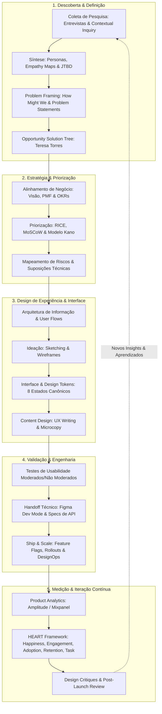

<!-- markdownlint-disable MD022 MD025 MD031 MD032 MD040 MD026 -->

<!--
=================================================================================
LOG DE MANUTENÇÃO E ALTERAÇÕES DO DOCUMENTO
=================================================================================
Data       | Autor          | Descrição da Alteração
-----------|----------------|--------------------------------------------------
2026-09-04 | Matheus Diniz  | Criação do Guia Canônico de Product Design (v1.0.0)
           | (OpenClaude)   | estruturado sobre o roadmap oficial do roadmap.sh,
           |                | cobrindo os 13 nós de ponta a ponta, alinhamento
           |                | negócio-tecnologia, árvore de oportunidade-solução,
           |                | priorização (RICE/MoSCoW/Kano), Figma Dev Mode,
           |                | métricas HEART/AARRR e design ético com IA.
=================================================================================
-->

# 🎨 Guia Canônico de Product Design: Da Descoberta ao Escalonamento

> **Manifesto de Product Design:** *Product Design não é embelezamento cosmético de telas ao final do ciclo de desenvolvimento — é a disciplina deliberada e estratégica de encontrar a interseção rigorosa entre a desejabilidade humana (o que as pessoas precisam), a viabilidade de negócio (o que sustenta a empresa) e a factibilidade técnica (o que a engenharia consegue construir e manter). O verdadeiro designer de produto apaixona-se pelo problema antes da solução, decide com base em evidências, colabora lado a lado com a engenharia e mede seu impacto não pelo volume de layouts entregues, mas pela mudança real no comportamento das pessoas e na saúde sustentável do negócio.*

---

## 🧭 Relação com o Ecossistema de Guias Técnicos

Este guia integra o **ecossistema canônico de Design, Experiência e Cognição** deste repositório, composto por 4 documentos complementares:

1. **Guia Universal de Design de Interface (UI) e Acessibilidade (`guia-universal-design-ui-ux-acessibilidade.md`):** Foco na superfície visual, acessibilidade estrita WCAG 2.2 AAA, arquitetura de Design Tokens Semânticos (Cores, Tipografia fluida com `clamp()`, Espaçamentos), componentes agnósticos, CSS moderno e eliminação de Anti-Slop Visual.
2. **Guia Oficial de Regras de UX, Psicologia Cognitiva e Arquitetura Comportamental (`guia-regras-ux-design-cognicao-comportamental.md`):** Foco na mente decisora: Teoria do Processo Dual (Sistema 1 vs. Sistema 2), modelos comportamentais (Fogg B=MAP, Funil CREATE de Steve Wendel), leis universais da cognição (Hick, Fitts, Miller, Jakob) e prevenção de dark patterns.
3. **Guia Canônico de Product Design (Este Guia):** Foco no ciclo de vida e na visão holística de ponta a ponta: pesquisa exploratória (*Discovery*), alinhamento com a estratégia de negócio, Opportunity Solution Trees (Teresa Torres), arquitetura da informação, ideação, prototipação, alinhamento técnico com engenharia (*Figma Dev Mode*, contratos de API, latência), validação, entrega progressiva (*Feature Flags*), DesignOps, métricas HEART e design ético assistido por inteligência artificial.
4. **Guia Canônico de Componentes de Tabela / Data Tables (`guia-componente-tabela-data-table-ui-ux.md`):** Extensão especializada focada em componentes de dados de alta densidade: as 6 Decisões Arquiteturais (Align, Rows, Density, Sticky, Cells, Actions), tipografia tabular (`tnum`), seleção múltipla de linhas, paginação, acessibilidade WCAG 2.2 AAA e implementação de referência em React/Tailwind CSS.

---

## 🔄 O Ciclo Contínuo de Product Design

---

## 📑 Sumário Executivo

1. [Introduction](#1-introduction)
   - [O que é Product Design](#11-o-que-é-product-design)
   - [Product Design vs UX (sub-nó)](#12-product-design-vs-ux)
   - [Product Design vs UI (sub-nó)](#13-product-design-vs-ui)
   - [Comparativo: Product Design vs UX vs UI](#14-comparativo-product-design-vs-ux-vs-ui)
2. [Discover](#2-discover)
   - [Gathering Information (Coletar Informação)](#21-gathering-information-coletar-informação)
   - [Mapping Context (Mapear o Contexto)](#22-mapping-context-mapear-o-contexto)
   - [Organizing Research (Organizar a Pesquisa)](#23-organizing-research-organizar-a-pesquisa)
   - [Synthesizing Research (Sintetizar a Pesquisa)](#24-synthesizing-research-sintetizar-a-pesquisa)
   - [Framing the Problem (Enquadrar o Problema)](#25-framing-the-problem-enquadrar-o-problema)
   - [Prioritizing Opportunities (Priorizar Oportunidades)](#26-prioritizing-opportunities-priorizar-oportunidades)
3. [Define](#3-define)
   - [Goal Setting (Definição de Metas)](#31-goal-setting-definição-de-metas)
   - [Defining Success (Definir o Sucesso)](#32-defining-success-definir-o-sucesso)
   - [Design Principles (Princípios de Design)](#33-design-principles-princípios-de-design)
4. [Strategy & Planning](#4-strategy--planning)
   - [Business Alignment (Alinhamento com o Negócio)](#41-business-alignment-alinhamento-com-o-negócio)
   - [Aligning Teams (Alinhando os Times)](#42-aligning-teams-alinhando-os-times)
   - [Managing Risk (Gestão de Risco)](#43-managing-risk-gestão-de-risco)
5. [User-Centered Design](#5-user-centered-design)
   - [O que é design centrado no usuário](#51-o-que-é-design-centrado-no-usuário)
   - [Functionality over Polish (Função acima do Polimento)](#52-functionality-over-polish-função-acima-do-polimento)
   - [Consistency & Coherence (Consistência e Coerência)](#53-consistency--coherence-consistência-e-coerência)
   - [Collaboration by Design (Colaboração por Concepção)](#54-collaboration-by-design-colaboração-por-concepção)
   - [Iteration over Perfection (Iteração acima da Perfeição)](#55-iteration-over-perfection-iteração-acima-da-perfeição)
6. [Prioritization Frameworks](#6-prioritization-frameworks)
   - [Por que priorizar com um framework](#61-por-que-priorizar-com-um-framework)
   - [RICE](#62-rice)
   - [MoSCoW](#63-moscow)
   - [Kano](#64-kano)
7. [Design the Experience](#7-design-the-experience)
   - [Information Architecture (Arquitetura de Informação)](#71-information-architecture-arquitetura-de-informação)
   - [Fluxos: User Flows e Task Flows](#72-fluxos-user-flows-e-task-flows)
   - [Ideation (Ideação)](#73-ideation-ideação)
   - [Content Design (Design de Conteúdo)](#74-content-design-design-de-conteúdo)
8. [Build the Interface](#8-build-the-interface)
   - [Visual Foundations (Fundamentos Visuais)](#81-visual-foundations-fundamentos-visuais)
   - [UI Patterns (Padrões de Interface)](#82-ui-patterns-padrões-de-interface)
   - [Components (Componentes)](#83-components-componentes)
   - [Design Tokens](#84-design-tokens)
   - [Interface States & Edge Cases (Estados e Casos de Borda)](#85-interface-states--edge-cases-estados-e-casos-de-borda)
   - [Design Systems](#86-design-systems)
   - [Motion & Interaction (Movimento e Interação)](#87-motion--interaction-movimento-e-interação)
   - [Multi-platform Design (Design Multiplataforma)](#88-multi-platform-design-design-multiplataforma)
9. [Validate](#9-validate)
   - [Testing Designs (Testar os Designs)](#91-testing-designs-testar-os-designs)
   - [Usability Testing (Teste de Usabilidade)](#92-usability-testing-teste-de-usabilidade)
   - [Expert Review (Avaliação por Especialista)](#93-expert-review-avaliação-por-especialista)
   - [A/B Testing (Teste A/B)](#94-ab-testing-teste-ab)
   - [Accessibility Testing (Teste de Acessibilidade)](#95-accessibility-testing-teste-de-acessibilidade)
   - [UX Benchmarking](#96-ux-benchmarking)
10. [Working with Engineering](#10-working-with-engineering)
   - [Engineering Collaboration (Colaboração com Engenharia)](#101-engineering-collaboration-colaboração-com-engenharia)
   - [Technical Constraints na Implementação (Restrições Técnicas)](#102-technical-constraints-na-implementação-restrições-técnicas)
11. [Ship & Scale](#11-ship--scale)
   - [Launch Readiness (Prontidão para Lançamento)](#111-launch-readiness-prontidão-para-lançamento)
   - [Feature Flags (Flags de Funcionalidade)](#112-feature-flags-flags-de-funcionalidade)
   - [Experimentation (Experimentação)](#113-experimentation-experimentação)
   - [Operating at Scale (Operar em Escala)](#114-operating-at-scale-operar-em-escala)
12. [Measure & Iterate](#12-measure--iterate)
   - [Measuring Quality (Medir a Qualidade)](#121-measuring-quality-medir-a-qualidade)
   - [Continuous Improvement (Melhoria Contínua)](#122-continuous-improvement-melhoria-contínua)
13. [Designing Responsibly & AI-Assisted Design](#13-designing-responsibly--ai-assisted-design)
   - [Designing Responsibly (Projetar com Responsabilidade)](#131-designing-responsibly-projetar-com-responsabilidade)
   - [AI-Assisted Design (Design Assistido por IA)](#132-ai-assisted-design-design-assistido-por-ia)
14. [Checklist de Governança e Homologação de Product Design](#14-checklist-de-governança-e-homologação-de-product-design)
15. [Referências Canônicas e Bibliografia](#15-referências-canônicas-e-bibliografia)

---

## 1. Introduction

Product design é a prática de moldar a experiência, a aparência e o comportamento de um produto para que ele resolva um problema real do usuário e, ao mesmo tempo, sustente os objetivos do negócio. Diferente de disciplinas que olham só para a tela, product design percorre todo o ciclo: pesquisa, estratégia, design de interação, design visual e a colaboração com engenharia até o lançamento e a iteração contínua. O eixo central não é "deixar bonito", e sim decidir **o que** construir, **por que** construir e **como** entregar isso de forma utilizável e viável.

### 1.1. O que é Product Design

Product design vive na interseção de três forças: **o que as pessoas precisam** (desejabilidade), **o que o negócio precisa** (viabilidade) e **o que a tecnologia permite** (factibilidade). O trabalho do product designer é encontrar a solução que equilibra as três — não a que maximiza apenas uma delas.

* **Foco no problema, não na solução:** o ponto de partida é entender profundamente o problema do usuário antes de desenhar qualquer interface. *Ex.:* antes de desenhar uma tela de "carrinho abandonado", o designer investiga *por que* as pessoas abandonam o carrinho (frete surpresa? cadastro obrigatório? falta de confiança?).

* **Responsabilidade de ponta a ponta:** vai da descoberta (pesquisa e definição do problema) até o acompanhamento pós-lançamento (métricas, iteração). O designer não "entrega a tela e some".

* **Decisão sob restrições:** quase toda decisão envolve trade-off entre tempo, escopo, qualidade e impacto. Product design é, em boa parte, priorizar o que **não** fazer.

* **Colaboração como pré-requisito:** o designer trabalha lado a lado com product managers, engenheiros, pesquisadores, marketing e dados. O output raramente é individual.

#### 1.1.1. Responsabilidades típicas do product designer

* **Pesquisar** usuários e contexto (entrevistas, testes, análise de dados).

* **Enquadrar o problema** com clareza (problem statements, "How Might We").

* **Priorizar** oportunidades e features (Kano, RICE, MoSCoW).

* **Desenhar** fluxos, wireframes, protótipos e a interface final.

* **Validar** com testes de usabilidade e revisões.

* **Entregar para engenharia** (handoff, specs) e acompanhar o resultado (analytics, A/B testing).

#### 1.1.2. Onde este roadmap vai te levar

Este guia percorre o ciclo completo na ordem em que ele costuma acontecer na prática: **descobrir** o problema → **definir** o sucesso → **planejar** a estratégia → **projetar** a experiência → **construir** a interface → **validar** → **trabalhar com engenharia** → **lançar e escalar** → **medir e iterar**. A "Introduction" existe para posicionar a disciplina antes de mergulhar nas etapas.

### 1.2. Product Design vs UX (sub-nó)

Product design cobre o ciclo de vida inteiro do produto — incluindo estratégia, alinhamento de negócio e decisões de o que lançar —, enquanto UX design foca de forma mais restrita em **como o usuário experimenta e interage** com o produto. Um product designer frequentemente decide *o que construir e por quê*, não apenas *como* deve parecer ou funcionar. As duas funções se sobrepõem muito na prática, e muitas empresas usam os títulos de forma intercambiável.

* **Amplitude do escopo:** UX se concentra na qualidade da experiência de uso (usabilidade, arquitetura de informação, fluxos). Product design engloba isso **e** a camada de negócio (métricas, receita, viabilidade, roadmap).

* **Natureza da decisão:** o UX designer costuma otimizar uma experiência já definida; o product designer também decide *se aquela experiência deveria existir*.

* **Métrica de sucesso:** UX tende a ser avaliado por satisfação e facilidade de uso; product design é cobrado também por impacto de negócio (retenção, conversão, receita).

* **Sobreposição real:** em muitas empresas, "UX designer" e "product designer" fazem o mesmo trabalho — a diferença é mais de cultura/senioridade da empresa do que de atividade.

*Cenário:* numa startup enxuta, a mesma pessoa que roda as entrevistas de usuário (UX) também argumenta no comitê de produto que a feature X deve entrar antes da Y por causa do impacto em retenção (product). Numa big tech, esses papéis podem estar em pessoas diferentes.

**Trade-offs de pensar "só UX" vs "product design":**

* **Prós de escopo de negócio (product):** decisões mais alinhadas ao impacto, mais influência, menos retrabalho por desenhar algo que não deveria existir.

* **Contras:** exige entender métricas, negócio e restrições técnicas — curva de aprendizado maior e risco de diluir o foco na experiência.

* **Prós de foco estrito em UX:** profundidade em pesquisa e usabilidade, artesania da experiência.

* **Contras:** risco de "polir" soluções para problemas que não movem o ponteiro do negócio.

### 1.3. Product Design vs UI (sub-nó)

Product design se preocupa com o problema geral sendo resolvido, a jornada do usuário e o impacto no negócio, enquanto UI design foca especificamente na **superfície visual e interativa** — layout, cor, tipografia e componentes. O product designer normalmente é dono das decisões sobre *o que o produto deve fazer*; o UI designer foca em *como ele parece e responde ao uso*. Em times pequenos, uma pessoa costuma fazer os dois.

* **Camada de atuação:** UI é a "pele" do produto (o que se vê e se toca); product design é o "esqueleto e o cérebro" (estrutura, lógica, propósito).

* **Entregáveis típicos de UI:** telas de alta fidelidade, especificação visual, estados de componentes, design system visual.

* **Entregáveis típicos de product design:** definição do problema, fluxos, protótipos, critérios de sucesso, além (muitas vezes) da própria UI.

* **Dependência mútua:** uma UI impecável sobre um produto que resolve o problema errado ainda fracassa; um ótimo enquadramento de problema com UI confusa também frustra o usuário.

*Ex.:* decidir que o app precisa de um onboarding em 3 passos para reduzir evasão é uma decisão de product design; escolher o espaçamento, os botões e a paleta desse onboarding é UI. *Cenário:* um designer júnior costuma entrar mais pela UI e, com o tempo, assume decisões de product design.

### 1.4. Comparativo: Product Design vs UX vs UI

| Dimensão | Product Design | UX Design | UI Design |
| :---- | :---- | :---- | :---- |
| **Pergunta central** | O que construir e por quê? | Como tornar a experiência útil e usável? | Como isso deve parecer e responder? |
| **Escopo** | Ciclo completo: problema → negócio → entrega | Experiência e interação de ponta a ponta | Superfície visual e interativa |
| **Foco principal** | Impacto no usuário **e** no negócio | Usabilidade, fluxos, arquitetura de informação | Layout, cor, tipografia, componentes |
| **Entregáveis** | Estratégia, fluxos, protótipos, métricas, UI | Pesquisa, personas, jornadas, wireframes | Telas de alta fidelidade, design system visual |
| **Métrica de sucesso** | Retenção, conversão, receita, satisfação | Facilidade de uso, satisfação | Consistência e clareza visual |
| **Em times pequenos** | Geralmente a mesma pessoa acumula os três papéis |  |  |

*Resumo prático:* UI é um subconjunto do trabalho de UX, e UX é um subconjunto do trabalho de product design. Quanto menor o time, mais esses três papéis colapsam em uma pessoa só; quanto maior, mais eles se especializam.  
---

#### Fontes desta seção

**Nós do roadmap.sh (Product Design) usados:**

* Introduction

* Product Design vs UX

* Product Design vs UI

**Links de referência seguidos:**

* What is product design? (Figma Resource Library): https://www.figma.com/resource-library/what-is-product-design/

* What EXACTLY is Product Design? (vídeo): https://www.youtube.com/watch?v=LckQ4VVjHDs

* Product Design Tutorials & Advice (playlist): https://www.youtube.com/playlist?list=PLDodijvPErk-0e-znq_4a2rtVW4BFF_wi

* Product design vs. UX design vs. UI design — Design Bootcamp/Medium: https://medium.com/design-bootcamp/product-design-vs-ux-design-vs-ui-design-2b281ba5f6c7

* UI/UX Design vs Product Design (vídeo): https://www.youtube.com/watch?v=S6maF4tICPs

* Roadmap dedicado de UX Design: https://roadmap.sh/ux-design

* Product Designer vs. UX Designer: The Difference Explained — Coursera: https://www.coursera.org/articles/product-designer-vs-ux-designer-the-difference-explained

* Intro to UX | Google UX Design Certificate (vídeo): https://www.youtube.com/watch?v=2QQQtiFwXjU\&list=PLTZYG7bZ1u6oHnGp4Ib3n0y-CmFQdTW6r

## 2. Discover

Discover ("descobrir") é a primeira grande fase do processo de product design: o momento de **entender profundamente o usuário e o problema antes de propor qualquer solução**. Em vez de partir de suposições, a equipe coleta dados reais, organiza-os num retrato coerente da experiência, extrai insights, enquadra o problema certo e decide quais oportunidades valem o investimento. Pular essa fase é a origem mais comum de produtos que resolvem o problema errado com competência. O roadmap divide o Discover em seis blocos encadeados: **coletar informação → mapear contexto → organizar a pesquisa → sintetizar → enquadrar o problema → priorizar oportunidades.** Cada etapa alimenta a seguinte — dados brutos viram contexto, contexto vira insight, insight vira um problema bem definido e, por fim, uma lista priorizada do que atacar.

### 2.1. Gathering Information (Coletar Informação)

Coletar informação é o primeiro passo do Discover: reunir **dados brutos sobre os usuários, seus comportamentos e seus problemas**. Usa-se um mix de métodos — entrevistas, contextual inquiry, surveys, heatmaps e session recordings — conforme o tipo de insight necessário. Esses dados são a fundação de tudo o que vem depois (mapeamento de contexto e enquadramento do problema). A regra-chave é combinar métodos **qualitativos** (profundidade, "por quê") com **quantitativos** (escala, "quantos") e **atitudinais** (o que as pessoas dizem) com **comportamentais** (o que elas fazem).

#### 2.1.1. Interviews (Entrevistas)

Entrevistas são **conversas individuais com usuários** desenhadas para revelar necessidades, motivações e dores nas *próprias palavras* deles. Permitem fazer perguntas de acompanhamento e aprofundar respostas inesperadas — algo que um survey não consegue. São usadas tipicamente **cedo** no processo de pesquisa, para gerar insights que outros métodos validam depois em escala.

* **Força:** profundidade e flexibilidade — dá para perseguir um "por quê" surpresa no meio da conversa.

* **Cuidado:** capturam o que a pessoa *diz*, que nem sempre é o que ela *faz* (viés de memória e de desejo de agradar).

* **Boa prática:** perguntas abertas e não indutoras. *Ex. ruim:* "Você não acha o cadastro confuso?" *Ex. bom:* "Me conta como foi a última vez que você criou uma conta aqui."

*Cenário:* antes de redesenhar um app financeiro, o designer entrevista 8 usuários e descobre que o medo de "errar e perder dinheiro" — não a interface — é o que trava o primeiro uso.

#### 2.1.2. Contextual Inquiry (Investigação Contextual)

Contextual inquiry é um método em que o pesquisador **observa e conversa com o usuário enquanto ele usa o produto ou executa a tarefa no seu ambiente real**. Observar o comportamento em contexto revela problemas e "gambiarras" que o usuário nunca pensaria em mencionar numa entrevista. É especialmente valioso para entender fluxos moldados pelo espaço físico, pelas ferramentas ou pela dinâmica de equipe.

* **Diferença para a entrevista:** aqui você *vê* a pessoa agir, não só a ouve relatar. Combina observação + perguntas no momento.

* **Revela o tácito:** atalhos, post-its na tela, planilhas paralelas — tudo que "virou hábito" e some numa conversa fora de contexto.

*Ex.:* observar uma enfermeira usando um sistema hospitalar revela que ela anota dados num papel antes de digitar, porque o sistema desloga sozinho — um problema invisível numa entrevista tradicional.

#### 2.1.3. Surveys (Questionários)

Surveys coletam **feedback estruturado de um grande número de usuários** por meio de perguntas predefinidas, muitas vezes com escalas ou múltipla escolha. São úteis para **medir o quão difundido** é um comportamento ou opinião na base de usuários, embora capturem menos profundidade que entrevistas. Times costumam usá-los para **validar em escala** padrões encontrados numa pesquisa qualitativa menor.

* **Força:** escala e comparabilidade — respondem "quantos?" e "com que frequência?".

* **Limite:** sem profundidade e sem follow-up; perguntas mal formuladas geram dados enganosos.

* **Boa prática:** usar depois de entrevistas, para quantificar hipóteses já levantadas. *Ex.:* uma entrevista sugere que "frete surpresa" causa abandono; o survey mede que isso afeta 68% dos usuários — priorizando o problema.

#### 2.1.4. Heatmaps (Mapas de Calor)

Heatmaps são **representações visuais da atividade do usuário na tela** — onde ele clica, move o cursor ou passa mais tempo olhando. Revelam padrões como conteúdo ignorado ou áreas de interesse inesperado que números crus de analytics não mostram com a mesma clareza. Designers os usam para **identificar pontos de fricção em páginas existentes sem precisar rodar um estudo completo**.

* **Tipos comuns:** de clique (onde clicam), de movimento (para onde o cursor vai) e de scroll (até onde rolam a página).

* **Força:** rápido e barato para diagnosticar uma página que já está no ar.

* **Limite:** mostra o "onde", não o "porquê" — precisa ser combinado com métodos qualitativos.

*Ex.:* um heatmap revela que ninguém rola até o CTA principal, que está abaixo da dobra — explicando a baixa conversão sem precisar de entrevista.

#### Comparativo dos métodos de coleta

| Método | Tipo | Captura | Melhor para | Limite principal |
| :---- | :---- | :---- | :---- | :---- |
| **Interviews** | Qualitativo / atitudinal | O que o usuário *pensa e diz* | Entender motivações e o "porquê" | Diz ≠ faz; não escala |
| **Contextual Inquiry** | Qualitativo / comportamental | O que o usuário *faz em contexto* | Fluxos reais, gambiarras, contexto | Caro; poucos participantes |
| **Surveys** | Quantitativo / atitudinal | Opiniões em *escala* | Medir quão difundido é algo | Sem profundidade nem follow-up |
| **Heatmaps** | Quantitativo / comportamental | *Onde* a atenção vai na tela | Diagnosticar páginas existentes | Mostra o "onde", não o "porquê" |

### 2.2. Mapping Context (Mapear o Contexto)

Mapear o contexto é o passo de **organizar a pesquisa coletada num retrato claro de como os usuários percorrem tarefas e situações ao longo do tempo**. Usa técnicas como journey mapping e task analysis para mostrar a sequência de passos, decisões e emoções envolvidos. Essa etapa transforma peças isoladas de pesquisa numa **compreensão estruturada da experiência geral** — em vez de fatos soltos, uma narrativa de como a jornada realmente acontece.

#### 2.2.1. Journey Mapping (Mapa de Jornada)

O journey mapping visualiza **toda a sequência de passos que um usuário dá para atingir um objetivo**, muitas vezes por vários pontos de contato e ao longo de um período prolongado. Captura tipicamente ações, pensamentos e emoções em cada estágio, destacando momentos de fricção ou de encantamento. Times o usam para **enxergar lacunas na experiência que seriam fáceis de perder olhando uma única tela isolada**.

* **O que mapeia:** fases da jornada × (ações, pensamentos, emoções, pontos de contato), com uma "curva emocional" ao longo do caminho.

* **Escopo amplo:** cobre a experiência de ponta a ponta, inclusive momentos fora do produto (um e-mail, uma ligação ao suporte).

*Cenário:* o mapa de jornada de um app de entrega mostra que a ansiedade é máxima *depois* do pedido feito (o famoso "cadê meu pedido?") — apontando o rastreamento em tempo real como a maior oportunidade, não a tela de compra.

#### 2.2.2. Task Analysis (Análise de Tarefa)

A task analysis **decompõe uma tarefa específica em seus passos e pontos de decisão individuais** para entender exatamente o que o usuário precisa fazer para concluí-la. Revela complexidade desnecessária, informação faltante ou passos confusos que podem fazer o usuário falhar ou desistir. Essa visão detalhada costuma ser usada para **redesenhar um fluxo específico**, e não a experiência geral do produto.

* **Diferença para o journey mapping:** o journey olha a *jornada ampla e emocional*; a task analysis dá *zoom* num único fluxo e sua lógica de passos.

* **Revela:** gargalos, passos redundantes e decisões onde o usuário empaca.

*Ex.:* analisar a tarefa "transferir dinheiro" mostra 9 passos, 2 dos quais pedem dados que o app já tem — cortá-los reduz o abandono.

#### Journey Mapping vs Task Analysis

| Dimensão | Journey Mapping | Task Analysis |
| :---- | :---- | :---- |
| **Escopo** | Jornada ampla, multi-touchpoint | Uma tarefa específica |
| **Foco** | Ações + emoções ao longo do tempo | Passos e pontos de decisão |
| **Pergunta** | "Como é a experiência inteira?" | "O que exatamente é preciso para fazer X?" |
| **Uso típico** | Achar oportunidades e vales emocionais | Redesenhar e simplificar um fluxo |

### 2.3. Organizing Research (Organizar a Pesquisa)

Organizar a pesquisa é o processo de **consolidar achados de múltiplos métodos num formato usável e compartilhado pela equipe**. Inclui sintetizar dados brutos em insights claros e armazená-los num repositório de pesquisa para que permaneçam acessíveis ao longo do tempo. Sem esse passo, pesquisa valiosa corre o risco de ser **esquecida ou repetida desnecessariamente** por diferentes membros do time.

#### 2.3.1. Research Repository (Repositório de Pesquisa)

Um repositório de pesquisa é um **armazém centralizado e pesquisável** de achados, gravações e insights passados, que a equipe pode consultar ao longo do tempo. Evita esforço de pesquisa duplicado e facilita que novos membros se atualizem sobre o que já se sabe dos usuários. Repositórios bem mantidos são **tagueados e organizados** por tópico, projeto ou segmento de usuário.

* **Valor central:** memória institucional — o conhecimento não sai junto quando alguém troca de time.

* **Boa prática:** tags consistentes e insights ligados à evidência bruta (a citação, o clipe, o dado que os sustenta).

*Ex.:* antes de rodar novas entrevistas, o time busca no repositório e descobre que a dúvida "os usuários entendem o termo 'rendimento'?" já foi respondida seis meses atrás — economizando semanas.

#### 2.3.2. Session Recordings (Gravações de Sessão)

Session recordings capturam as **interações reais de um usuário com o produto** — movimento do mouse, cliques e rolagem — reproduzidas como um vídeo. Deixam o designer observar exatamente onde os usuários hesitam, se confundem ou abandonam uma tarefa. Diferente de entrevistas, mostram o **comportamento real**, e não o que os usuários dizem que fazem.

* **Força:** flagram fricções que ninguém relata (cliques repetidos num elemento que não é botão, idas e voltas).

* **Cuidado ético:** exigem anonimização e cuidado com dados sensíveis — nunca gravar senhas ou dados pessoais.

*Cenário:* a gravação mostra dezenas de usuários clicando num ícone decorativo achando que é botão — um problema que nenhuma entrevista havia revelado.

### 2.4. Synthesizing Research (Sintetizar a Pesquisa)

Sintetizar a pesquisa significa **analisar os dados brutos de entrevistas, surveys e observações para identificar padrões, temas e insights-chave**. Transforma um grande volume de pontos de dados individuais num conjunto menor de achados claros e acionáveis. Essa etapa acontece **depois de coletar e antes de enquadrar o problema**, porque são os insights sintetizados que moldam como o problema será definido. As três ferramentas de saída mais comuns são personas, mapas de empatia e Jobs-to-be-Done.

#### 2.4.1. Personas

Personas são **perfis fictícios, porém baseados em pesquisa**, que representam os principais tipos de usuário que o produto atende — construídos a partir de padrões encontrados em pesquisa real, não de suposições. Cada persona reúne objetivos, frustrações e comportamentos relevantes ao produto. O time as consulta ao longo do design e da priorização para **manter as decisões ancoradas em necessidades reais**.

* **Fictícia, mas fundamentada:** nome e rosto para memorização, mas cada traço vem de evidência. Persona "no feeling" dá falsa confiança.

* **Ferramenta de decisão:** existe para ser usada em reuniões ("o que a Marina precisaria aqui?"), não para enfeitar um slide.

*Ex.:* "Marina, 29, autônoma, renda irregular, quer poupar mas nunca sobra, desconfia de banco" — acionável e memorável.

#### 2.4.2. Empathy Maps (Mapas de Empatia)

Um mapa de empatia é um **diagrama simples que captura o que um usuário diz, pensa, faz e sente** em relação a uma situação ou produto. Ajuda o time a entrar na perspectiva do usuário e a trazer à tona necessidades ou frustrações que não são ditas explicitamente. Costumam ser construídos **diretamente a partir de dados de entrevista ou observação** coletados antes.

* **Os quatro quadrantes:** *Says* (diz), *Thinks* (pensa), *Does* (faz), *Feels* (sente).

* **Revela contradições valiosas:** o gap entre o que a pessoa *diz* e o que *faz* costuma ser onde mora o insight.

*Ex.:* o usuário *diz* que "segurança é o mais importante", mas *faz* login com senha fraca e *sente* preguiça de 2FA — revelando a tensão a resolver no design.

#### 2.4.3. Jobs-to-be-Done (JTBD)

O Jobs-to-be-Done é um framework que enquadra um produto ou feature **em torno da tarefa ou objetivo subjacente que o usuário está tentando cumprir**, e não em torno de traços demográficos. Pergunta *qual "trabalho" o usuário está "contratando" o produto para fazer* — o que pode revelar concorrentes não óbvios (um app de notas competindo com um app de tarefas pelo mesmo "job"). Esse enquadramento ajuda a evitar projetar em cima de suposições rasas sobre *quem* é o usuário.

* **Foco no progresso, não no perfil:** "quero me sentir no controle das minhas finanças" (job) é mais útil que "mulher, 25-40" (demografia).

* **Formato clássico:** "Quando \\\[situação\\\], quero \\\[motivação\\\], para \\\[resultado esperado\\\]."

*Ex.:* as pessoas não "querem uma furadeira", querem "um furo na parede" — e, mais fundo, "uma prateleira montada". Enxergar o job real abre soluções que a demografia esconde.

#### Personas vs Empathy Maps vs JTBD

| Ferramenta | Pergunta central | Foco | Melhor para |
| :---- | :---- | :---- | :---- |
| **Personas** | Quem é o usuário-tipo? | Objetivos, contexto, comportamento | Alinhar o time num alvo comum |
| **Empathy Maps** | O que ele diz/pensa/faz/sente? | Estado interno e contradições | Gerar empatia e achar tensões |
| **JTBD** | Que "trabalho" ele quer resolver? | Progresso e motivação | Achar o problema e concorrentes ocultos |

### 2.5. Framing the Problem (Enquadrar o Problema)

Enquadrar o problema é o passo de **transformar achados de pesquisa num problema claro e bem definido que guia o trabalho de design**. Usa ferramentas como mapas de empatia, personas, JTBD e perguntas "How Might We" para traduzir insight bruto numa direção acionável. Um problema bem enquadrado mantém o time **focado em resolver a questão certa, em vez de pular direto para soluções** — o erro mais caro do design.

#### 2.5.1. Problem Statements (Declarações de Problema)

Uma problem statement é uma **descrição concisa e específica do problema que um esforço de design pretende resolver**, geralmente enquadrada em torno de um usuário particular e sua necessidade. Mantém o projeto delimitado e focado, impedindo que o time derive para ideias sem relação. Uma boa declaração **evita sugerir uma solução específica**, deixando espaço para múltiplas abordagens na ideação.

* **Formato útil (POV):** "\\\[usuário\\\] precisa de \\\[necessidade\\\] porque \\\[insight\\\]." *Ex.:* "A Marina precisa de uma forma de poupar sem esforço mental porque sua renda é irregular e ela adia decisões financeiras."

* **Regra de ouro:** descreva o problema, não a solução. "Precisa de um botão de poupança" já é solução disfarçada.

* **Boa prática (SMART):** específica, mensurável e delimitada — evita o problema vago que não orienta ninguém.

#### 2.5.2. How Might We Questions (Perguntas "Como Poderíamos")

As perguntas How Might We (HMW) **reformulam uma declaração de problema numa pergunta aberta que convida ao brainstorming** — por exemplo, transformar "usuários abandonam o cadastro" em "como poderíamos tornar o cadastro sem esforço". O fraseado é deliberadamente amplo o bastante para permitir muitas soluções possíveis, em vez de apontar para uma só. Times costumam usá-las como **prompt inicial no começo de uma sessão de ideação**.

* **Ponto de equilíbrio:** nem ampla demais ("como poderíamos melhorar o app?") nem estreita demais ("como poderíamos adicionar um botão verde?"). O ideal fica no meio.

* **Ponte para a ideação:** cada HMW vira o cabeçalho de uma rodada de brainstorming (nó 7).

*Ex.:* do problema "as pessoas têm medo de errar no primeiro uso" nasce "como poderíamos fazer o usuário se sentir seguro para experimentar sem risco?" — abrindo ideias como modo sandbox, desfazer fácil e valores de teste.

### 2.6. Prioritizing Opportunities (Priorizar Oportunidades)

#### 2.6.1. Product Sense (Senso de Produto)

Product sense é a **capacidade de um designer ou PM de julgar o que vai genuinamente funcionar bem para usuários e negócio**, construída a partir de experiência e reconhecimento de padrões — não de um processo fixo. Ajuda o time a tomar decisões rápidas e razoáveis quando pesquisa ou dados completos não estão disponíveis. Ainda que útil, o product sense costuma ser **combinado com frameworks estruturados e feedback de usuários** para checar pontos cegos.

* **De onde vem:** exposição a muitos produtos, usuários e resultados — é padrão reconhecido, não intuição mágica.

* **Risco:** sozinho, vira "achismo do sênior". Por isso se combina com dados e testes (nós 23-24).

#### 2.6.2. Business & User Needs (Necessidades de Negócio e do Usuário)

Equilibrar necessidades de negócio e do usuário significa **pesar o que beneficiaria o usuário contra o que a empresa precisa para se manter viável** — receita, metas estratégicas. Um design que ignora o negócio pode não sobreviver como produto sustentável; um que ignora o usuário pode não conquistar adoção. As decisões de priorização geralmente envolvem **encontrar a sobreposição** entre esses dois conjuntos de necessidades.

* **A zona de ouro:** a interseção onde a mesma feature serve usuário *e* negócio (ex.: reduzir fricção no checkout ajuda o usuário e aumenta a receita).

* **Sinal de alerta ético:** quando só o negócio ganha (dark patterns) ou só o usuário ganha sem retorno sustentável, a decisão está desbalanceada.

*Ex.:* remover anúncios agrada o usuário mas mata a receita; a solução equilibrada pode ser um tier gratuito com anúncios leves + um pago sem — atendendo aos dois lados.

#### 2.6.3. Opportunity Solution Trees (Árvores de Oportunidade-Solução)

Uma opportunity solution tree é um **framework visual que mapeia um resultado desejado no topo**, ramificando-se para baixo em diferentes oportunidades e, mais abaixo, em soluções e experimentos específicos para cada uma. Ajuda o time a **enxergar múltiplos caminhos possíveis para uma meta** em vez de se comprometer cedo com uma única solução. Essa estrutura facilita comparar e priorizar diferentes formas de resolver a mesma oportunidade subjacente.

* **Anatomia (de Teresa Torres):** *Outcome* (resultado de negócio) → *Opportunities* (necessidades/dores dos usuários) → *Solutions* (ideias) → *Experiments* (testes).

* **Valor:** força o time a explorar várias oportunidades antes de se apaixonar por uma solução — combatendo o viés de "solução favorita".

*Cenário:* resultado "aumentar retenção" ramifica em oportunidades ("usuários esquecem de voltar", "não veem valor na 1ª semana"); cada uma gera soluções distintas, que a árvore ajuda a comparar e priorizar.

#### Fontes desta seção

**Nós do roadmap.sh (Product Design) usados:**

* Discover (nó agrupador)

* Gathering Information · Interviews · Contextual Inquiry · Surveys · Heatmaps

* Mapping Context · Journey Mapping · Task Analysis

* Organizing Research · Research Repository · Session Recordings

* Synthesizing Research · Personas · Empathy Maps · Jobs-to-be-Done

* Framing the Problem · Problem Statements · How Might We Questions

* Prioritizing Opportunities · Product Sense · Business & User Needs · Opportunity Solution Trees

**Links de referência seguidos:**

* What it's like to interview as a product designer — Medium: https://medium.com/@yamilah/what-its-like-to-interview-as-a-product-designer-fcb7c88e75ca

* How To Conduct User Interviews Like A Pro (vídeo): https://www.youtube.com/watch?v=5tVbFfGDQCk

* Contextual Inquiry: Inspire Design by Observing and Interviewing Users — NN/g: https://www.nngroup.com/articles/contextual-inquiry/

* Contextual inquiry: A comprehensive guide — UserTesting: https://www.usertesting.com/blog/contextual-inquiry

* Contextual Enquiry (vídeo): https://www.youtube.com/watch?v=mOWeNnSY5M0

* How to use product development surveys — SurveyMonkey: https://www.surveymonkey.com/learn/product-development/

* How to Run Surveys at Every Stage of the Design Cycle — NN/g: https://www.nngroup.com/articles/surveys-design-cycle/

* Designing a Survey (vídeo): https://www.youtube.com/watch?v=mdVWbuffdNY

* Using heatmaps to improve your website's UX — Contentsquare: https://contentsquare.com/guides/heatmaps/ux/

* How to Use Website Heatmap Data to Improve Your Site (vídeo): https://www.youtube.com/watch?v=vfDhk62dSlo

* Journey Mapping 101 — NN/g: https://www.nngroup.com/articles/journey-mapping-101/

* Customer journey map explained — Miro: https://miro.com/customer-journey-map/what-is-a-customer-journey-map/

* Task Analysis: Support Users in Achieving Their Goals — NN/g: https://www.nngroup.com/articles/task-analysis/

* Task Analysis Made Easy with Examples (vídeo): https://www.youtube.com/watch?v=QuVNyuVOBi8

* What is a research repository, and why do you need one? — Dovetail: https://dovetail.com/research/what-is-a-research-repository/

* Research Repositories 101 (vídeo): https://www.youtube.com/watch?v=QQgm4VPJCdU

* User Recording: What it Is and How it Can Improve UX — UserExperior: https://www.userexperior.com/blog/user-recording-what-it-is-and-how-it-can-improve-user-experience

* An Overview of Session Recordings in Microsoft Clarity (vídeo): https://www.youtube.com/watch?v=AlSkWk-iWpg

* Synthesizing UX Research: Making What's "Mysterious" Clear — dscout: https://dscout.com/people-nerds/user-research-synthesis

* How to synthesise information — University of Sheffield: https://www.sheffield.ac.uk/study-skills/research/approaches/synthesise

* What are UX personas and what are they used for? — UX Design Institute: https://www.uxdesigninstitute.com/blog/what-are-ux-personas/

* What are personas and why should I care? (vídeo): https://www.youtube.com/watch?v=khLWLtxmMGM

* Empathy Mapping: The First Step in Design Thinking — NN/g: https://www.nngroup.com/articles/empathy-mapping/

* What is an Empathy Map? (vídeo): https://www.youtube.com/watch?v=QwF9a56WFWA

* Jobs-To-Be-Done Framework — ProductPlan: https://www.productplan.com/glossary/jobs-to-be-done-framework

* What is Jobs to be Done (vídeo): https://www.youtube.com/watch?v=RQjBawcU_qg

* Design Problem Statements: What They Are and How to Frame Them — Toptal: https://www.toptal.com/designers/product-design/design-problem-statement

* How to craft better product problem statements with the SMART framework (vídeo): https://www.youtube.com/watch?v=IKB2KnFmy6I

* Using "How Might We" Questions to Ideate on the Right Problems — NN/g: https://www.nngroup.com/articles/how-might-we-questions/

* How Might We statement builder (vídeo): https://www.youtube.com/watch?v=51SX9CpFBnc

* Product Sense: What is it, Why it's Needed, and How to Keep it Fresh — Medium: https://medium.com/@dianas/product-sense-what-is-it-why-its-needed-and-how-to-keep-it-fresh-ead3de52460a

* Product Sense — ProductPlan: https://www.productplan.com/glossary/product-sense

* Where does Product Sense come from? (vídeo): https://www.youtube.com/watch?v=ZZkT6nF3i64

* Balancing business needs and user needs in a product — UX Design Institute: https://www.uxdesigninstitute.com/blog/business-needs-and-user-needs/

* Navigating the User Needs vs. Business Needs Dilemma — Medium: https://medium.com/design-bootcamp/business-needs-vs-user-needs-2b62190b6a22

* Opportunity Solution Trees — Product Talk: https://www.producttalk.org/opportunity-solution-trees

* Opportunity Solution Tree — ProductPlan: https://www.productplan.com/glossary/opportunity-solution-tree

* What is an opportunity solution tree? (vídeo): https://www.youtube.com/watch?v=y7hfQ1V1N3M

## 3. Define

Define ("definir") é a fase em que a equipe **transforma o entendimento do problema (Discover) num alvo claro de sucesso** antes de projetar qualquer solução. É o momento de responder três perguntas que orientam todo o resto: *onde queremos chegar* (visão), *que valor entregamos e para quem* (proposta de valor e product-market fit), e *como saberemos que deu certo* (métricas de sucesso). Fecha-se com os **princípios de design** — as regras que garantem que dezenas de decisões independentes puxem para a mesma direção. Sem essa fase, o time projeta no escuro: constrói features que parecem boas mas não movem nenhum resultado que importe.

### 3.1. Goal Setting (Definição de Metas)

Goal setting significa **estabelecer objetivos específicos e mensuráveis que um produto ou feature deve atingir dentro de um prazo**. Metas claras dão ao time um alvo compartilhado para projetar e priorizar, em vez de depender de opiniões subjetivas sobre o que construir. As metas definidas aqui normalmente se conectam a métricas de negócio e OKRs mais amplos usados depois no planejamento (nó 4). Este bloco reúne os quatro artefatos que compõem uma boa definição de metas: a visão de longo prazo, a proposta de valor, o product-market fit e as métricas de sucesso.

#### 3.1.1. Product Vision (Visão de Produto)

* **Com prazo:** metas sem horizonte de tempo viram intenções vagas.

* **Ancora a priorização:** com a meta clara, cada feature candidata pode ser julgada por "isso nos aproxima do alvo?".

#### 3.1.2. Value Proposition (Proposta de Valor)

#### 3.1.1. Product Vision (Visão de Produto)

Uma visão de produto é uma **declaração concisa do que o produto pretende se tornar e por que isso importa**, geralmente olhando alguns anos à frente. Dá ao time uma direção consistente para alinhar decisões, mesmo quando features e prioridades individuais mudam ao longo do tempo. Uma visão forte é **específica o bastante para guiar escolhas, mas ampla o bastante para sobreviver a mudanças de estratégia**.

* **Horizonte longo:** descreve o destino (anos), não o próximo passo (sprint).

* **Estável, mas não engessada:** sobrevive a pivôs de estratégia; muda raramente.

*Ex.:* "Ser a forma mais simples de qualquer autônomo brasileiro construir uma reserva de emergência" — orienta anos de decisões sem prender a features específicas.

#### 3.1.3. Product-Market Fit (Ajuste Produto-Mercado)

#### 3.1.2. Value Proposition (Proposta de Valor)

* **Benefício, não feature:** "poupança automática" é feature; "junte uma reserva sem precisar pensar nisso" é valor.

* **Contra a alternativa:** inclui o "melhor que o quê?" — inclusive melhor que a inércia de não fazer nada.

*Ex.:* "Poupe sem esforço: guardamos o troco de cada compra automaticamente — sem planilhas, sem disciplina, sem pensar."

#### 3.1.4. Success Metrics (Métricas de Sucesso)

#### 3.1.3. Product-Market Fit (Ajuste Produto-Mercado)

* **Sinais de PMF:** retenção estável, crescimento orgânico (boca a boca), usuários "bravos" se o produto sumisse (o teste de Sean Ellis: 40%+ ficariam "muito decepcionados").

* **Muda a prioridade:** antes do PMF, o foco é *encontrar* o ajuste (iterar rápido); depois, é *escalar* (polir e crescer).

*Cenário:* um app com muitos downloads mas retenção despencando ainda não tem PMF — a prioridade é descobrir por que as pessoas não voltam, não adicionar features.

Métricas de sucesso são os **indicadores específicos e quantificáveis usados para julgar se um produto ou feature está atingindo seu objetivo** — como taxa de retenção, taxa de conversão ou tempo de conclusão de tarefa. Escolher as métricas certas cedo impede o time de otimizar números que parecem bons mas não refletem valor real (métricas de vaidade). Essas métricas são **revisitadas depois, na fase de medição e iteração** (nó 12), para julgar o desempenho real.

* **Métrica acionável vs de vaidade:** downloads totais é vaidade (só cresce); retenção D30 é acionável (reflete valor real).

* **Ligada à meta:** cada métrica deve mapear diretamente para o objetivo definido no goal setting.

*Ex.:* para a meta "poupar sem esforço", a métrica de sucesso pode ser "% de usuários com pelo menos uma poupança automática por semana" — não "número de cadastros".

#### Visão vs Proposta de Valor vs Métricas de Sucesso

| Artefato | Pergunta que responde | Horizonte | Muda com que frequência |
| :---- | :---- | :---- | :---- |
| **Product Vision** | Onde queremos chegar e por quê? | Anos | Raramente |
| **Value Proposition** | Que valor entregamos e por que somos melhores? | Médio prazo | Ocasionalmente (com aprendizado) |
| **Product-Market Fit** | O mercado realmente quer isso? | Estado a atingir | É um marco, não um número fixo |
| **Success Metrics** | Como sabemos que deu certo? | Curto/médio prazo | Revisadas por ciclo |

### 3.2. Defining Success (Definir o Sucesso)

Definir o sucesso é o **passo inicial de estabelecer metas claras, uma visão e resultados mensuráveis para um produto antes de o trabalho de design começar**. Inclui esclarecer a visão de produto, a proposta de valor e as métricas que vão indicar se o produto está funcionando. Sem esse passo, os times correm o risco de **construir features que parecem boas, mas não movem nenhum resultado significativo**.

* **É a síntese do Goal Setting:** amarra visão + proposta de valor + métricas num único acordo sobre "como é o sucesso aqui".

* **Feito antes de desenhar:** definir o sucesso *depois* de construir é racionalizar o resultado — não medir de verdade.

* **Alinha o time e os stakeholders:** todos concordam, por escrito, com o que contará como vitória — evitando o "gol movido" no fim do projeto.

*Cenário:* antes de iniciar o redesign do onboarding, o time registra: visão (poupar sem esforço), resultado esperado (mais gente ativando a poupança) e métrica (conclusão do onboarding de 40% → 65%). No fim, há um critério objetivo para dizer se funcionou — não uma discussão de opinião.

**Trade-off:** definir o sucesso cedo dá foco e honestidade, mas exige resistir à tentação de metas fáceis ("mais cliques") que inflam números sem refletir valor. Uma boa definição de sucesso mede o *resultado* (o usuário poupou), não a *atividade* (o usuário clicou).

### 3.3. Design Principles (Princípios de Design)

Princípios de design são as **regras que um time se compromete a seguir ao tomar decisões de design** — coisas como colocar o usuário em primeiro lugar, favorecer função sobre polimento e manter consistência ao longo do produto. Funcionam como uma **referência compartilhada** para que designers individuais tomem decisões parecidas mesmo trabalhando de forma independente. Princípios como esses são aplicados em todas as etapas seguintes, da pesquisa ao lançamento.

* **Escalam a coerência:** num time de 10 designers, princípios explícitos fazem 10 decisões independentes convergirem — sem eles, o produto vira uma colcha de retalhos.

* **Precisam ser acionáveis e, idealmente, "com trade-off embutido":** um bom princípio ajuda a *escolher* em situações de conflito. "Seja simples" é fraco; "quando em dúvida, remova" é acionável.

* **Aplicados de ponta a ponta:** guiam desde o enquadramento do problema até a UI final e o handoff.

*Ex. (princípios reais e conhecidos):*  
* **"Foco no usuário e em suas tarefas, não na tecnologia"** — decide a favor da necessidade real, não do que é técnicamente elegante.

* **"Função antes de polimento"** (nó 5\) — priorize que funcione antes de que fique bonito.

* **"Consistência e coerência"** — reutilize padrões conhecidos em vez de inventar novos a cada tela.

**Prós:** aceleram decisões, reduzem conflito, dão coerência e independência ao time. **Contras/cuidados:** princípios genéricos demais ("seja bom") não ajudam ninguém a decidir; princípios demais ninguém lembra (3 a 7 costuma ser o ideal); e princípios que ninguém usa no dia a dia são só decoração de slide.

\---

#### Fontes desta seção

**Nós do roadmap.sh (Product Design) usados:**

* Define (nó agrupador)

* Goal Setting · Product Vision · Value Proposition · Product-Market Fit · Success Metrics

* Defining Success

* Design Principles

**Links de referência seguidos:**

* Setting Product Goals: A Strategic Guide for Product Teams — Productboard: https://www.productboard.com/blog/setting-product-goals/

* What Is a Product Goal? Definition, Examples & Best Practices — Product School: https://productschool.com/blog/product-strategy/product-goal

* What is a Product Vision? — Airfocus: https://airfocus.com/glossary/what-is-product-vision/

* Product Vision — ProductPlan: https://www.productplan.com/glossary/product-vision

* Value proposition: the key to winning customers and driving business growth — Strategyzer: https://www.strategyzer.com/value-proposition

* How to Create a Compelling Value Proposition, With Examples — Investopedia: https://www.investopedia.com/terms/v/valueproposition.asp

* What is product-market fit? Examples and strategies to find it — Zendesk: https://www.zendesk.es/blog/customer-experience/customer-journey/product-market-fit/

* How to Find Product-Market-Fit as Fast as Possible (vídeo): https://www.youtube.com/watch?v=HVkfEXgH8QM

* Success metrics examples: How to choose KPIs by team — Asana: https://asana.com/resources/success-metrics-examples

* Product Success Metrics | A Complete Tutorial (vídeo): https://www.youtube.com/watch?v=1nsBdgVlE8w

* Product Success: 13 Metrics That Measure What Matters — Product School: https://productschool.com/blog/analytics/product-success

* Principles of Product Design — Principles.design: https://principles.design/examples/principles-of-product-design

* 5 Design Principles From The World's Most Product-Centric Companies — ProductPlan: https://www.productplan.com/learn/product-design-principles

* The Principles of Design | FREE COURSE (vídeo): https://www.youtube.com/watch?v=9EPTM91TBDU

## 4. Strategy & Planning

Strategy & Planning ("estratégia e planejamento") é a fase em que o design deixa de ser uma atividade isolada e se conecta ao **como a empresa ganha, decide e se organiza**. Depois de definir o sucesso (nó 3), o time precisa garantir três coisas antes de investir esforço pesado em design: que o trabalho está **alinhado ao negócio** (entender o modelo, a estratégia e as métricas), que as **pessoas estão alinhadas** (stakeholders, designers e engenheiros concordando sobre direção e processo) e que os **riscos estão mapeados** (suposições, restrições técnicas e viabilidade). Pular essa fase produz design bonito que a empresa não sustenta, que o time briga para aprovar, ou que a engenharia descobre tarde ser impossível de construir. O roadmap organiza tudo em três frentes: **alinhamento de negócio, alinhamento de times e gestão de risco.**

### 4.1. Business Alignment (Alinhamento com o Negócio)

Business alignment é o processo de **conectar decisões de design e produto aos objetivos, à estratégia e às métricas mais amplas do negócio**. Inclui entender como o negócio opera, moldar a estratégia de produto e acompanhar as métricas e OKRs relevantes. Sem esse alinhamento, o product design corre o risco de produzir um trabalho que **agrada usuários mas não sustenta os objetivos da empresa** — o caminho mais curto para ter um projeto cancelado por "não mover nenhum número".

#### 4.1.1. Business Understanding (Entendimento do Negócio)

Entendimento do negócio significa ter um **conhecimento prático de como a empresa ganha dinheiro, quem são seus clientes e quais restrições moldam suas decisões**. Esse contexto ajuda o designer a fazer escolhas realistas e alinhadas ao que o negócio consegue sustentar, em vez de puramente ideais da perspectiva do usuário. Costuma ser adquirido através de **conversas com stakeholders, vendas e liderança**, não só de pesquisa com usuário.

* **Business acumen:** entender receita, custos, margem, canais e concorrência dá ao designer "assento à mesa" nas decisões.

* **Fonte diferente da pesquisa de usuário:** aqui a informação vem de quem opera o negócio, não de quem usa o produto.

*Ex.:* saber que a empresa vive de assinatura anual (não de compra única) muda o foco do design: retenção de longo prazo passa a importar mais que a primeira conversão.

#### 4.1.2. Product Strategy (Estratégia de Produto)

A estratégia de produto é o **plano de alto nível de como um produto vai atingir sua visão e seus objetivos de negócio ao longo do tempo** — incluindo o que construir, para quem e em que ordem. Conecta a visão de produto (nó 3\) a decisões concretas sobre áreas de foco e trade-offs. Espera-se que as decisões de design de todas as etapas seguintes **sustentem essa estratégia, em vez de conflitar com ela**.

* **Ponte visão → execução:** traduz o "onde queremos chegar" em "o que fazemos primeiro e o que deixamos de fazer".

* **É feita de trade-offs:** estratégia é tanto sobre o que *não* fazer quanto sobre o que fazer.

*Ex.:* a estratégia "ganhar o público autônomo antes de mirar PMEs" define que o design prioriza simplicidade individual agora e adia recursos de equipe.

#### 4.1.3. Business Metrics & OKRs (Métricas de Negócio e OKRs)

Métricas de negócio e OKRs são as **medidas e objetivos específicos que uma empresa acompanha para julgar se está tendo sucesso** — receita, taxa de crescimento, retenção de clientes. Os **OKRs pareiam um objetivo com resultados-chave mensuráveis**, dando ao time uma forma clara de checar o progresso. Decisões de product design são frequentemente justificadas ou priorizadas com base em **quanto se espera que movam essas métricas**.

* **Anatomia do OKR:** *Objective* (qualitativo, inspirador, o "para onde") + *Key Results* (quantitativos, mensuráveis, o "como saberemos"). *Ex.:* Objetivo "tornar-se a forma mais fácil de poupar"; KRs: "elevar retenção D30 de 20% → 30%", "ativação de poupança de 40% → 60%".

* **Métrica de negócio vs métrica de produto:** receita/crescimento são de negócio; ativação/retenção são de produto — e o design conecta uma à outra.

* **Cuidado:** OKR não é lista de tarefas. "Lançar a feature X" é entrega, não resultado; o KR deve medir o *efeito* da feature.

#### 4.1.4. Stakeholder Alignment (Alinhamento de Stakeholders)

Alinhamento de stakeholders significa **garantir que os principais tomadores de decisão do negócio compartilhem um entendimento comum da direção e das prioridades do produto**. Envolve tipicamente comunicação regular, documentação compartilhada e reuniões estruturadas para **trazer discordâncias à tona cedo**, e não depois que o trabalho está feito. Sem esse alinhamento, um design pode enfrentar objeções de última hora que forçam retrabalho caro.

* **Alinhar cedo é barato; alinhar tarde é caro:** a discordância que aparece na revisão final custa semanas; a mesma discordância resolvida no início custa uma conversa.

* **Ferramentas:** documentos de decisão, mapas de stakeholders, check-ins regulares e demos frequentes.

*Cenário:* o designer envolve jurídico e vendas já no início de um redesign de checkout; descobre uma exigência regulatória que, se ignorada, teria invalidado o design pronto.

#### Métrica de negócio vs OKR

| Dimensão | Métrica de negócio | OKR |
| :---- | :---- | :---- |
| **O que é** | Um indicador acompanhado (ex.: receita) | Um objetivo + 2–5 resultados-chave |
| **Função** | Medir a saúde | Focar e alinhar o esforço num período |
| **Horizonte** | Contínuo | Ciclo (trimestre, semestre) |
| **Exemplo** | "Retenção D30 \= 22%" | "Obj: reter mais / KR: D30 20%→30%" |

### 4.2. Aligning Teams (Alinhando os Times)

Alinhar times é o **trabalho contínuo de fazer stakeholders, designers e engenheiros concordarem sobre direção, prioridades e processo**. Inclui práticas como o alinhamento de stakeholders (item 1.4), a adoção de métodos compartilhados como Agile UX ou Lean UX, e a condução de workshops ou sprints de design colaborativos. Um alinhamento forte **reduz a fricção e o retrabalho** causados, mais tarde, por mal-entendidos sobre objetivos ou abordagem.

#### 4.2.1. Agile UX / Lean UX

Agile UX e Lean UX são **abordagens de design que se encaixam em ciclos de desenvolvimento iterativos e rápidos**, em vez de longas fases de design feitas todas de uma vez no começo. Favorecem incrementos de design pequenos e testáveis, ciclos de feedback curtos e colaboração próxima com a engenharia ao longo de um sprint. São comuns em times que **lançam com frequência** e precisam que o design acompanhe o ritmo do desenvolvimento.

* **Lean UX:** foca em reduzir desperdício — trabalhar em hipóteses e MVPs, validar rápido, evitar entregáveis que ninguém usa (parte da mentalidade de Jeff Gothelf).

* **Agile UX:** foca em encaixar o trabalho de design no fluxo ágil (sprints, backlog), muitas vezes desenhando "um passo à frente" da engenharia.

* **Trade-off vs design upfront:** ganha-se velocidade e adaptação; arrisca-se perder visão de conjunto se ninguém cuidar da coerência (por isso design system e princípios importam tanto).

*Cenário:* em vez de entregar um documento de 40 telas, a designer valida um fluxo em wireframe com 5 usuários na segunda-feira e entrega a versão refinada para a engenharia na quinta — dentro do mesmo sprint.

#### 4.2.2. Design Workshops & Sprints (Workshops e Sprints de Design)

Workshops e sprints de design são **sessões estruturadas e com tempo limitado (time-boxed) em que um time colabora intensamente para resolver um problema específico**, muitas vezes ao longo de alguns dias. Costumam combinar atividades como sketching, priorização e prototipação para **sair rapidamente de um problema vago para uma ideia testável**. A abordagem é usada quando um time precisa de **alinhamento rápido e um output concreto** em pouco tempo.

* **Design Sprint (Google Ventures):** formato clássico de 5 fases (mapear → esboçar → decidir → prototipar → testar), em geral em 4–5 dias.

* **Valor:** comprime semanas de reuniões dispersas em dias de trabalho focado, com decisão e protótipo testado no fim.

* **Cuidado:** exige preparação e as pessoas certas na sala; sprint mal facilitado vira só "muita reunião".

*Ex.:* um sprint de 4 dias para decidir o novo onboarding termina com um protótipo clicável testado com 5 usuários — substituindo meses de debate por evidência.

#### Agile UX vs Lean UX vs Design upfront

| Dimensão | Design upfront (waterfall) | Agile UX | Lean UX |
| :---- | :---- | :---- | :---- |
| **Quando o design acontece** | Tudo no início | Ao longo dos sprints | Em ciclos de hipótese→teste |
| **Entregável central** | Especificação completa | Incrementos por sprint | MVP e aprendizado |
| **Feedback** | Tardio (no fim) | Contínuo | Contínuo e experimental |
| **Melhor para** | Escopo fixo e estável | Times que lançam sempre | Alta incerteza a validar |

### 4.3. Managing Risk (Gestão de Risco)

Gerir risco em product design significa **identificar suposições, restrições e incertezas que poderiam levar um projeto ao fracasso, e endereçá-las antes de comprometer recursos significativos**. Inclui assumption mapping, identificação de riscos e avaliação de restrições técnicas e viabilidade. Pegar riscos cedo é, em geral, **muito mais barato do que descobri-los depois que o produto foi lançado** — o custo de corrigir um erro cresce a cada etapa que ele passa despercebido.

#### 4.3.1. Assumption Mapping (Mapeamento de Suposições)

Assumption mapping é a prática de **listar as crenças subjacentes das quais uma ideia de produto depende e, então, ranqueá-las por quão arriscadas e quão incertas cada uma é**. Ajuda o time a enxergar quais suposições precisam ser testadas antes de avançar, em vez de tratar todas as crenças como igualmente sólidas. Esse passo costuma produzir uma **lista curta de experimentos** para validar primeiro as suposições mais arriscadas.

* **A matriz 2×2:** eixo *risco/importância* × eixo *incerteza/evidência*. O quadrante "alto risco + baixa evidência" são as **leap-of-faith assumptions** — teste-as primeiro.

* **Tipos de suposição:** desejabilidade (o usuário quer?), viabilidade (o negócio se sustenta?) e factibilidade (dá para construir?).

*Ex.:* a suposição "os usuários confiam em dar acesso à conta bancária" é alto risco e baixa evidência → vira o primeiro experimento, antes de construir qualquer coisa.

#### 4.3.2. Risk Identification (Identificação de Riscos)

Identificação de riscos é o processo de **detectar proativamente problemas potenciais** — limitações técnicas, requisitos pouco claros ou necessidades de usuário não validadas — **antes que descarrilem o projeto**. Apoia-se em input de design, engenharia e stakeholders de negócio para trazer à tona riscos que uma única perspectiva poderia deixar passar. Os riscos identificados são tipicamente **priorizados e endereçados** por meio de mais pesquisa, prototipação ou "technical spikes".

* **Multiperspectiva:** o que é óbvio para a engenharia pode ser invisível para o design, e vice-versa — por isso a identificação é coletiva.

* **Saída acionável:** cada risco vira uma ação (pesquisar, prototipar, investigar tecnicamente), não só um item numa lista.

*Cenário:* num kickoff, a engenharia levanta que a API de terceiros tem limite de requisições — um risco que muda o design do fluxo antes de ele ser desenhado.

#### 4.3.3. Technical Constraints (Restrições Técnicas)

Restrições técnicas são as **limitações impostas por sistemas existentes, infraestrutura ou capacidade de engenharia que moldam o que um design pode realisticamente alcançar**. Ignorá-las durante o design leva a ideias que parecem ótimas no papel mas são impossíveis ou muito caras de construir. Entendê-las cedo permite ao designer **fazer trade-offs de forma deliberada**, em vez de ser surpreendido depois no desenvolvimento.

* **De onde vêm:** stack tecnológico, sistemas legados, limites de plataforma, performance, orçamento de engenharia.

* **Restrição como aliada:** limites bem entendidos focam a criatividade — projetar *dentro* deles costuma gerar soluções melhores que ignorá-los.

*Ex.:* saber que o backend só atualiza dados a cada 15 min impede o designer de prometer um dashboard "em tempo real" — e leva a uma solução honesta ("atualizado há X min").

#### 4.3.4. Feasibility Assessment (Avaliação de Viabilidade)

A avaliação de viabilidade **avalia se um design ou feature proposto pode realisticamente ser construído** dadas as capacidades técnicas, o cronograma e os recursos do time. Envolve normalmente colaboração próxima com engenheiros para estimar esforço e identificar possíveis bloqueios. Costuma acontecer **junto com a gestão de risco**, já que ideias inviáveis representam um dos maiores riscos ao sucesso de um projeto.

* **Pergunta central:** "dá para construir isto, no prazo, com o time que temos?".

* **Feita com engenharia:** a estimativa de esforço e a detecção de bloqueios dependem de quem vai construir.

* **Liga-se às três lentes:** viabilidade técnica (factibilidade) é uma das três forças do product design (com desejabilidade e viabilidade de negócio — nó 1).

#### As três lentes de risco

| Lente | Pergunta | Como se testa |
| :---- | :---- | :---- |
| **Desejabilidade** | O usuário quer/precisa? | Pesquisa, protótipo, teste com usuário |
| **Viabilidade (negócio)** | A empresa se sustenta com isso? | Modelo de negócio, métricas, alinhamento |
| **Factibilidade (técnica)** | Dá para construir com o que temos? | Avaliação de viabilidade com engenharia |

**Como usar em conjunto:** mapeie as suposições (3.1), identifique os riscos de cada lente (3.2), cheque as restrições técnicas (3.3) e avalie a viabilidade (3.4). O objetivo não é eliminar todo risco — é **atacar primeiro o risco mais alto e mais incerto**, gastando pouco para aprender muito antes de comprometer o time.

\---

#### Fontes desta seção

**Nós do roadmap.sh (Product Design) usados:**

* Strategy & Planning (nó agrupador)

* Business Alignment · Business Understanding · Product Strategy · Business Metrics & OKRs · Stakeholder Alignment

* Aligning Teams · Agile UX, Lean UX · Design Workshops & Sprints

* Managing Risk · Assumption Mapping · Risk Identification · Technical Constraints · Feasibility Assessment

**Links de referência seguidos:**

* What Is Business Acumen? And How to Develop It — Coursera: https://www.coursera.org/articles/what-is-business-acumen

* What is Business Acumen? (vídeo): https://www.youtube.com/watch?v=pr12giEsBSk

* Product strategy: Definition, best practices & how to build one — Atlassian: https://www.atlassian.com/agile/product-management/product-strategy

* What Is Product Strategy (an overview) (vídeo): https://www.youtube.com/watch?v=ebwo_BX_VtU

* What are OKRs? A guide to objectives and key results — Asana: https://asana.com/resources/okr-meaning

* Objectives and Key Results explained (New OKR Crash Course) (vídeo): https://www.youtube.com/watch?v=1nEyzZnSsTg

* What is Business Alignment? — DealHub: https://dealhub.io/glossary/business-alignment/

* 7 Steps for Effective Stakeholder Alignment — Simply Stakeholders: https://simplystakeholders.com/stakeholder-alignment/

* How to Manage Difficult Stakeholders \[6 Common Challenges\] (vídeo): https://www.youtube.com/watch?v=NaGhBpfZLzg

* Lean UX & Agile: Study Guide — NN/g: https://www.nngroup.com/articles/lean-ux-agile-study-guide/

* Attributes of Effective Agile UX (vídeo): https://www.youtube.com/watch?v=XLvx-hCmKPk

* What is Lean UX? (vídeo): https://www.youtube.com/watch?v=Y_C9jKXUVnE

* How to create and run a design workshop — The Little Design Corner: https://thelittledesigncorner.com/blogs/news/design-workshop-guide

* A guide to understanding the 5 phases of design sprints — Atlassian: https://www.atlassian.com/en/agile/design/design-sprint

* How To Run a Design Thinking Workshop (2-hour Live Training) (vídeo): https://www.youtube.com/watch?v=J64VamE8LdE

* What is a Design Sprint? | Google UX Design Certificate (vídeo): https://www.youtube.com/watch?v=xVvVaIWTuck

* An introduction to assumptions mapping — Mural: https://www.mural.co/blog/intro-assumptions-mapping

* How to Get Started with Assumptions Mapping (vídeo): https://www.youtube.com/watch?v=PyCvsBrKO4w

* Design Risks: How to Assess, Mitigate, and Manage Them — NN/g: https://www.nngroup.com/articles/design-risk-management/

* What Is Risk Identification? Definition and Tools — Indeed: https://www.indeed.com/career-advice/career-development/risk-identification

* What are design constraints? — The power of limitations in design — LogRocket: https://blog.logrocket.com/ux-design/what-are-design-constraints/

* What is a Feasibility Study (during new product development)? — Quality Inspection: https://qualityinspection.org/what-a-feasibility-study-is/

* How to Conduct a Feasibility Study \- Project Management Training (vídeo): https://www.youtube.com/watch?v=WI6_snOjlm0

## 5. User-Centered Design

User-centered design ("design centrado no usuário", ou UCD) é a abordagem que coloca as **necessidades, os comportamentos e o feedback reais dos usuários no centro de cada decisão de design** — em vez de partir de restrições técnicas ou de suposições internas da equipe. Na prática, envolve pesquisa, teste e iteração contínuos, guiados por como pessoas de verdade de fato interagem com o produto. É o princípio que sustenta boa parte das atividades de pesquisa e validação de todo o processo de product design: se os nós anteriores definiram *o que* construir e *por quê*, o UCD define *a partir de quem* essas decisões devem ser tomadas. Este nó reúne quatro princípios operacionais que traduzem essa filosofia em postura de trabalho diária: **priorizar função sobre polimento, manter consistência e coerência, projetar de forma colaborativa e preferir iteração à perfeição.**

### 5.1. O que é design centrado no usuário

* **Ponto de partida invertido:** o UCD começa pelo usuário real (o que ele precisa, faz e sente), não pela tecnologia disponível nem pela opinião interna sobre o que "deveria" ser bom.

* **Ciclo contínuo:** entender → projetar → testar → aprender → ajustar. O design nunca é "terminado" de uma vez; ele evolui com evidência de uso.

* **Base das outras fases:** pesquisa (nó 2), validação (nó 9\) e medição (nó 12\) existem justamente para manter o usuário no centro ao longo do tempo.

*Ex.:* em vez de assumir "os usuários querem mais opções de configuração", o time observa que 90% nunca abrem as configurações — e simplifica a tela padrão em vez de adicionar controles.

*Nota:* UCD não significa fazer tudo o que o usuário pede. Significa decidir com base em evidência de comportamento e necessidade real, equilibrando isso com viabilidade de negócio e técnica (nó 4).

### 5.2. Functionality over Polish (Função acima do Polimento)

Este princípio prioriza **fazer o produto funcionar corretamente e resolver o problema do usuário antes de investir pesado em refinamento visual**. Uma funcionalidade que parece linda mas falha na sua tarefa central entrega pouco valor; já uma que é tosca visualmente mas funciona ainda pode ter sucesso. Times costumam aplicar isso **cedo no projeto**, guardando o polimento visual mais profundo para etapas posteriores, depois que a experiência central foi validada.

* **Valor mora na função:** o usuário volta porque o produto resolve o problema dele, não porque o botão tem a sombra perfeita.

* **Sequência certa:** primeiro provar que a solução funciona (com algo cru), depois refinar o acabamento. Polir algo que ninguém quer é desperdício.

* **Risco do exagero visual:** investir em beleza antes de validar a função esconde problemas reais e custa retrabalho quando o conceito muda.

*Cenário:* um protótipo funcional "feio" de um novo fluxo de pagamento valida que os usuários conseguem concluir a compra; só depois disso o time investe semanas no visual refinado.

### 5.3. Consistency & Coherence (Consistência e Coerência)

Consistência e coerência significam que o **estilo visual, a terminologia e os padrões de interação de um produto se comportam da mesma forma entre diferentes telas e funcionalidades**. Padrões inconsistentes obrigam o usuário a *reaprender* como as coisas funcionam em cada parte do mesmo produto, aumentando o esforço cognitivo. **Design systems e componentes compartilhados** são as ferramentas mais comuns para manter esse princípio em escala.

* **Consistência (o mesmo se parece e age igual):** o botão primário tem a mesma cor, posição e comportamento em todas as telas.

* **Coerência (o todo faz sentido junto):** a linguagem, o tom e a lógica de navegação formam uma experiência unificada, não um patchwork de telas que parecem de produtos diferentes.

* **Por que importa:** reduz carga cognitiva, acelera o aprendizado e gera confiança — o usuário transfere o que aprendeu de uma tela para a próxima.

* **Como se sustenta em escala:** design systems, bibliotecas de componentes e tokens (temas do nó 8\) garantem que dezenas de telas e vários times mantenham o mesmo comportamento.

*Ex.:* se "Excluir" fica à direita em uma tela e à esquerda em outra, o usuário erra por hábito. Padronizar a posição elimina esse erro.

| Aspecto | Consistência | Coerência |
| :---- | :---- | :---- |
| **Foco** | Elementos idênticos se repetem | O conjunto faz sentido como um todo |
| **Pergunta** | Isto se parece/age como o resto? | Tudo isto conta a mesma história? |
| **Exemplo** | Mesmo estilo de botão em todo lugar | Tom, fluxo e visual alinhados entre features |
| **Ferramenta típica** | Componentes e tokens | Princípios de design e visão de produto |

### 5.4. Collaboration by Design (Colaboração por Concepção)

Colaboração por concepção significa **tratar o design como uma atividade compartilhada e multifuncional** — envolvendo product managers, engenheiros e outros stakeholders — em vez de algo feito isoladamente por um designer. Workshops de design, revisões (critiques) e documentação compartilhada são práticas comuns que sustentam isso. Reflete a realidade de que **boas decisões de produto geralmente dependem do input de múltiplas disciplinas**, não só do designer.

* **Design não é esporte individual:** engenharia traz viabilidade, produto traz estratégia, dados trazem evidência, suporte traz a dor real do cliente.

* **Práticas que viabilizam:** workshops e sprints (nó 4), critiques e reviews, documentação e specs acessíveis a todos, decisões tomadas à vista de todos.

* **Benefício:** decisões mais robustas, menos retrabalho por surpresa e maior senso de dono compartilhado — quem participou da decisão defende a solução.

*Cenário:* ao envolver um engenheiro no rascunho de um fluxo, a designer descobre que uma abordagem alternativa é 3× mais barata de construir e igualmente boa para o usuário — economia que não apareceria num design feito sozinho.

### 5.5. Iteration over Perfection (Iteração acima da Perfeição)

Este princípio favorece **lançar uma versão funcional do design e melhorá-la com base em feedback real**, em vez de tentar aperfeiçoá-la antes que qualquer pessoa a use. Esperar por um design impecável costuma significar **adiar um aprendizado valioso** sobre como os usuários de fato reagem. Liga-se de perto a práticas como testes A/B e melhoria contínua (nó 12), que dependem de feedback ao vivo para guiar o refinamento.

* **Feito é melhor que perfeito (quando gera aprendizado):** cada versão real no mundo ensina algo que nenhuma quantidade de discussão interna ensinaria.

* **Perfeccionismo é um custo oculto:** o tempo gasto polindo em segredo é tempo sem feedback — e o "perfeito" imaginado quase nunca sobrevive ao contato com o usuário.

* **Como operacionalizar:** lançar em incrementos, medir, aprender e ajustar; usar feature flags, testes A/B e melhoria contínua para iterar com segurança.

*Ex.:* em vez de passar seis meses no onboarding "definitivo", o time lança uma versão simples, descobre em duas semanas onde as pessoas desistem, e corrige exatamente esse ponto.

*Nota:* iterar não é lançar coisas quebradas. É lançar algo **bom o suficiente e seguro**, com um plano deliberado de aprender e melhorar — o oposto de "largar e esquecer".

#### Como os quatro princípios se conectam

| Princípio | Pergunta que ele força | O que evita |
| :---- | :---- | :---- |
| **Função acima do polimento** | Isto resolve o problema? | Beleza inútil / polir cedo demais |
| **Consistência e coerência** | Isto combina com o resto? | Reaprendizado e carga cognitiva |
| **Colaboração por concepção** | Quem mais precisa opinar? | Decisões cegas e retrabalho |
| **Iteração acima da perfeição** | O que aprendemos ao soltar? | Atraso e perfeccionismo sem feedback |

Juntos, esses princípios descrevem uma postura: **decidir com base no usuário real, entregar cedo, manter tudo coerente e melhorar continuamente com quem constrói junto.** É a ponte entre a estratégia (nós 1–4) e o trabalho concreto de projetar experiências e interfaces (nós 7–8).

\---

#### Fontes desta seção

**Nós do roadmap.sh (Product Design) usados:**

* User-Centered Design (nó agrupador, com conteúdo próprio)

* Functionality over Polish

* Consistency & Coherence

* Collaboration by Design

* Iteration over Perfection

**Links de referência seguidos:**

* User Centered Design (UCD) — Interaction Design Foundation: https://ixdf.org/literature/topics/user-centered-design

* What is user-centred design (UCD)? (vídeo): https://www.youtube.com/watch?v=-f_nXBzaTPw

## 6. Prioritization Frameworks

Frameworks de priorização são **métodos estruturados para ranquear ideias ou funcionalidades concorrentes com base em critérios definidos**, em vez de depender puramente de opinião ("acho que isso é importante"). Exemplos comuns incluem **RICE, MoSCoW e Kano**, cada um pesando de forma diferente fatores como esforço, impacto ou satisfação do usuário. Usar um framework compartilhado torna as decisões de priorização mais **transparentes e mais fáceis de explicar aos stakeholders** — a discussão deixa de ser "quem grita mais alto" e passa a ser "o que o critério aponta". Depois de descobrir oportunidades (nó 2), defini-las (nó 3\) e alinhá-las ao negócio e ao risco (nó 4), a priorização decide **o que fazer primeiro** com recursos sempre limitados.

### 6.1. Por que priorizar com um framework

* **Substitui opinião por critério:** todos avaliam as ideias pelas mesmas dimensões, reduzindo viés e política.

* **Torna a decisão defensável:** dá uma justificativa clara ("este ficou acima porque tem mais alcance e menos esforço") que se explica para liderança e time.

* **Expõe trade-offs:** força a comparar impacto contra custo, essencial contra desejável — nem tudo pode ser "prioridade máxima".

* **Não é uma calculadora mágica:** o framework organiza o julgamento, não o substitui. Estimativas ruins geram rankings ruins ("garbage in, garbage out").

*Ex.:* diante de 20 ideias e capacidade para 4 no trimestre, o time aplica um framework para escolher as 4 com melhor relação valor/custo, em vez de seguir o pedido mais recente do chefe.

### 6.2. RICE

RICE é um framework que **pontua projetos potenciais com base em quatro fatores — Reach, Impact, Confidence e Effort — combinados em um único score comparável**. *Reach* e *Impact* estimam quantos usuários são afetados e o quanto; *Confidence* leva em conta a incerteza dessas estimativas; e *Effort* representa o custo de construir. O time usa o score resultante para ranquear features ou projetos em uma **base numérica consistente**.

* **Reach (Alcance):** quantas pessoas isso afeta em um período (ex.: usuários por trimestre). *Ex.:* "2.000 usuários/trimestre".

* **Impact (Impacto):** quanto isso afeta cada pessoa. Costuma usar uma escala (ex.: 3 \= massivo, 2 \= alto, 1 \= médio, 0,5 \= baixo, 0,25 \= mínimo).

* **Confidence (Confiança):** quão seguras são suas estimativas, em % (ex.: 100% \= alta, 80% \= média, 50% \= baixa). Penaliza chutes otimistas.

* **Effort (Esforço):** custo total de construir, em pessoa-mês (ou pessoa-semana). É o único fator que fica no **denominador** — mais esforço derruba o score.

* **Fórmula:** \`RICE \= (Reach × Impact × Confidence) ÷ Effort\`.

*Cenário:* uma feature com Reach 2.000, Impact 2, Confidence 80% e Effort 4 pessoa-mês → (2.000 × 2 × 0,8) ÷ 4 \= **800**. Outra com metade do alcance mas 1 pessoa-mês pode superá-la — é isso que o score revela.

### 6.3. MoSCoW

MoSCoW é um método de priorização que **classifica requisitos em quatro categorias: Must have, Should have, Could have e Won't have (por enquanto)**. Ele dá aos stakeholders um **vocabulário simples e compartilhado** para discutir o que é essencial versus opcional dentro de um determinado release. É frequentemente usado em discussões de planejamento em que o time precisa **concordar rapidamente sobre o escopo**.

* **Must have (Deve ter):** sem isso o release fracassa ou não faz sentido lançar. É o inegociável. *Ex.:* checkout funcional numa loja.

* **Should have (Deveria ter):** importante e de alto valor, mas o release sobrevive sem isso no curto prazo. *Ex.:* salvar cartão para próxima compra.

* **Could have (Poderia ter):** desejável, incluído se sobrar tempo/recurso; o primeiro a ser cortado sob pressão. *Ex.:* tema escuro.

* **Won't have (Não terá agora):** explicitamente fora deste ciclo — decisão importante para gerenciar expectativas, não um "não" definitivo.

*Cenário:* numa reunião de escopo de MVP, o time marca login e pagamento como *Must*, cupons como *Should*, gamificação como *Could* e app nativo como *Won't (agora)* — e todos saem com a mesma visão do que entra.

### 6.4. Kano

O modelo Kano **classifica funcionalidades em categorias com base em como elas afetam a satisfação do usuário** — incluindo expectativas básicas, funcionalidades de performance que escalam com a satisfação, e "delighters" que geram felicidade desproporcional quando presentes. Ajuda o time a distinguir entre **o que os usuários esperam por padrão** e **o que de fato os empolgaria**. Essa distinção orienta onde o investimento extra tende a compensar versus onde ele é apenas o necessário para atingir um patamar mínimo.

* **Básicas (Must-be / expectativas):** o usuário assume que existem. Presentes, não geram satisfação; ausentes, geram forte insatisfação. *Ex.:* o app não travar; o freio do carro funcionar.

* **Performance (lineares):** quanto mais/melhor, mais satisfação — e vice-versa. É onde a competição costuma acontecer. *Ex.:* velocidade de carregamento, autonomia da bateria.

* **Delighters (Attractive / encantadoras):** inesperadas; presentes, encantam; ausentes, ninguém sente falta. *Ex.:* um detalhe de onboarding divertido, um recurso surpresa.

* **Dinâmica no tempo:** delighters de hoje viram expectativas básicas de amanhã (câmera no celular já foi encanto, hoje é obrigação). Por isso é preciso reinvestir continuamente.

*Cenário:* ao pesquisar um app bancário, o time descobre que segurança é *básica* (só decepciona se falhar), rapidez de transferência é *performance* (quanto mais rápida, melhor) e um assistente de metas é *delighter* — e decide garantir o básico antes de investir no encanto.

*Nota:* Kano geralmente se apoia em uma pesquisa específica (perguntas na forma funcional/disfuncional) para classificar cada feature segundo a percepção real dos usuários, não o palpite do time.

#### RICE vs MoSCoW vs Kano — quando usar cada um

| Framework | Base de decisão | Saída | Melhor para | Limitação |
| :---- | :---- | :---- | :---- | :---- |
| **RICE** | Alcance, impacto, confiança, esforço | Score numérico ranqueável | Comparar muitas iniciativas objetivamente | Exige dados; falsa precisão se estimativas forem fracas |
| **MoSCoW** | Essencialidade para o release | 4 baldes qualitativos | Alinhar escopo rápido com stakeholders | Não ordena dentro do balde; abuso do "Must" |
| **Kano** | Efeito na satisfação do usuário | Categoria por feature | Decidir onde investir para encantar vs cumprir o básico | Precisa de pesquisa; categorias mudam com o tempo |

**Como combiná-los na prática:** use **Kano** para entender *que tipo* de valor cada feature entrega (básico, performance ou encanto), **MoSCoW** para fechar o escopo de um release com o time e os stakeholders, e **RICE** para ordenar objetivamente o que sobra dentro do "Should/Could". Eles não competem — respondem a perguntas diferentes: *que valor?* (Kano), *entra neste release?* (MoSCoW) e *nesta ordem?* (RICE).

#### Fontes desta seção

**Nós do roadmap.sh (Product Design) usados:**

* Prioritization Frameworks (nó agrupador)

* RICE

* MoSCoW

* Kano

**Links de referência seguidos:**

* Six product prioritization frameworks and how to pick the right one — Atlassian: https://www.atlassian.com/agile/product-management/prioritization-framework

* RICE Scoring Model — ProductPlan: https://www.productplan.com/glossary/rice-scoring-model

* What is the RICE Scoring Model? (vídeo): https://www.youtube.com/watch?v=pzyRafZJ-0M

* The MoSCoW prioritisation model, explained — BiteSize Learning: https://www.bitesizelearning.co.uk/resources/moscow-prioritisation-model

* What is MoSCoW Prioritization Method? Definition, Overview, and Best Practices (vídeo): https://www.youtube.com/watch?v=pm4GbSRMElc

* Kano Model — ProductPlan: https://www.productplan.com/glossary/kano-model

* The Kano Model (vídeo): https://www.youtube.com/watch?v=iFU_04VE5Os

## 7. Design the Experience

Design the Experience ("desenhar a experiência") é a fase em que as decisões abstratas dos nós anteriores viram estrutura concreta — mas **antes do visual final**. Aqui o designer define *como o produto é organizado*, *que caminhos o usuário percorre*, *quais ideias valem a pena explorar* e *quais palavras guiam a pessoa* ao longo do uso. É a ponte entre "sabemos o problema e a prioridade" (nós 1–6) e "vamos construir a interface polida" (nó 8). O trabalho se concentra em quatro frentes: **arquitetura de informação** (como o conteúdo se organiza), **fluxos** (os caminhos do usuário), **ideação** (gerar e materializar soluções, do rascunho ao protótipo) e **content design** (as palavras da experiência). O princípio que rege tudo é o da fase de baixa fidelidade: explorar barato e validar cedo, antes de investir em acabamento.

### 7.1. Information Architecture (Arquitetura de Informação)

Arquitetura de informação (IA) é a prática de **organizar e estruturar o conteúdo e as funcionalidades de um produto para que os usuários encontrem o que precisam e entendam como tudo se relaciona**. Inclui decisões sobre navegação, mapas do site (site maps) e como o conteúdo é agrupado e rotulado. Boa IA é **em grande parte invisível quando bem feita**, já que os usuários se movem pelo produto sem confusão — só percebemos a IA quando ela falha e nos perdemos.

* **O que ela resolve:** "onde estou, para onde posso ir e onde encontro X". É a planta baixa do produto.

* **Invisível quando funciona:** ninguém elogia uma boa IA; as pessoas simplesmente acham o que procuram. Uma IA ruim, ao contrário, é sentida como frustração constante.

*Ex.:* num app de banco, decidir se "Pix" fica dentro de "Transferências" ou como item próprio no menu principal é uma decisão de IA que afeta milhões de acessos.

#### 7.1.1. Content Organization (Organização do Conteúdo)

Organização de conteúdo é o processo de **agrupar e rotular informações dentro de um produto para que combinem com a forma como os usuários pensam e buscam**. Conteúdo mal organizado pode esconder informação útil atrás de categorias confusas ou rótulos pouco claros — mesmo que o conteúdo em si esteja bem escrito. Esse trabalho costuma se apoiar em **card sorting** ou técnicas de pesquisa semelhantes para validar que os agrupamentos fazem sentido para usuários reais.

* **Rótulo é decisão de design:** "Minha conta" vs "Configurações" vs "Perfil" — a palavra escolhida determina se a pessoa clica ou não.

* **Card sorting:** técnica em que usuários agrupam itens do jeito deles, revelando o modelo mental real (em vez do organograma interno da empresa).

*Cenário:* uma loja organiza produtos por departamento interno ("Linha A", "Linha B"); um card sorting mostra que clientes buscam por ocasião ("presente", "uso diário") — e a recategorização aumenta as vendas.

#### 7.1.2. Site Maps (Mapas do Site)

Um site map é um **diagrama que mostra a estrutura geral das páginas ou telas de um produto e como elas se relacionam em uma hierarquia**. Dá uma **visão aérea (bird's eye view)** do produto inteiro, útil para planejar a navegação e identificar lacunas ou seções redundantes. Site maps são tipicamente criados **cedo no processo de IA**, antes de as telas individuais serem desenhadas.

* **Visão de conjunto:** enxergar todas as telas de uma vez revela caminhos longos demais ou páginas órfãs.

* **Momento certo:** feito antes do design das telas, evita construir uma navegação incoerente por partes.

*Ex.:* um site map de um e-commerce mostra que a página "Ajuda" está a cinco cliques de distância — sinal para promovê-la ao rodapé global.

#### 7.1.3. Navigation (Navegação)

Navegação refere-se ao **sistema de menus, links e elementos estruturais que permitem aos usuários se moverem entre diferentes partes de um produto**. Uma navegação bem desenhada **reflete a arquitetura de informação subjacente**, tornando a estrutura do produto clara e previsível. Navegação ruim é uma **causa comum de frustração**, pois pode deixar as pessoas incapazes de encontrar conteúdos ou recursos que sabem que existem.

* **Navegação materializa a IA:** a IA é o mapa; a navegação são as placas e os caminhos que o usuário efetivamente usa.

* **Tipos comuns:** global (topo/menu principal), local (dentro de uma seção), utilitária (login, busca) e contextual (links no conteúdo).

*Cenário:* um usuário sabe que existe um relatório de gastos mas não o acha — não porque ele não existe, mas porque a navegação não reflete onde ele mentalmente esperava encontrá-lo.

### 7.2. Fluxos: User Flows e Task Flows

Depois de estruturar *onde* as coisas ficam, o designer mapeia *como* o usuário se move para atingir objetivos. Dois artefatos complementares fazem isso.

#### 7.2.1. User Flows (Fluxos de Usuário)

Um user flow é um **diagrama que mostra o caminho que um usuário percorre por um produto para completar um objetivo específico**, incluindo as telas e as decisões ao longo do caminho. Foca na **sequência e na lógica** de uma experiência, não nos detalhes visuais. Designers usam user flows cedo no processo para **validar que uma estrutura proposta faz sentido** antes de construir telas detalhadas.

* **Inclui ramificações:** contempla decisões e caminhos alternativos ("usuário logado?" → sim/não), refletindo a experiência real com suas bifurcações.

* **Barato de corrigir:** um fluxo errado em diagrama custa minutos; o mesmo erro em telas prontas custa dias.

*Ex.:* o user flow de "criar conta" revela que o app pede verificação de e-mail *antes* de mostrar valor — invertendo a ordem, mais gente conclui o cadastro.

#### 7.2.2. Task Flows (Fluxos de Tarefa)

Um task flow mapeia os **passos específicos necessários para completar uma única tarefa** dentro de um produto — semelhante a um user flow, mas tipicamente **mais estreito em escopo e sem caminhos alternativos ramificados**. É usado para examinar de perto e otimizar **uma interação específica**, como concluir um checkout ou redefinir uma senha. Essa visão detalhada ajuda a identificar **passos desnecessários ou fricção** dentro de uma tarefa.

* **Linear e único:** assume um único caminho "feliz", sem os "se/então" do user flow. Serve para enxugar uma tarefa concreta.

* **Foco em fricção:** cada passo é candidato a ser removido ou simplificado.

*Cenário:* o task flow do checkout tem 7 passos; ao mapeá-lo, o time percebe que 2 podem ser mesclados — reduzindo o abandono de carrinho.

#### User Flow vs Task Flow

| Aspecto | User Flow | Task Flow |  
| \----- | \----- | \----- |  
| Escopo | Objetivo amplo, várias telas | Uma tarefa específica |  
| Ramificações | Sim (decisões, caminhos alternativos) | Não (caminho único, linear) |  
| Pergunta | "Como as pessoas navegam até a meta?" | "Quais passos exatos essa tarefa exige?" |  
| Uso típico | Validar estrutura da experiência | Otimizar e enxugar uma interação |

### 7.3. Ideation (Ideação)

#### 7.3.1. Brainstorming

Brainstorming é uma **atividade em grupo em que os participantes geram o máximo de ideias possível para resolver um problema, tipicamente sem julgar ou filtrar no momento**. A ênfase em **quantidade sobre qualidade** no início ajuda a fazer emergir ideias não convencionais que, de outra forma, seriam descartadas cedo demais. As ideias geradas aqui são normalmente filtradas e refinadas em etapas posteriores da ideação.

* **Regra de ouro:** adiar o julgamento. Criticar durante a geração mata ideias arriscadas que poderiam evoluir.

* **Quantidade gera qualidade:** volume aumenta a chance de uma ideia excelente aparecer.

*Ex.:* uma sessão de 20 minutos gera 50 ideias para reduzir cancelamentos; três delas, aparentemente absurdas, viram os melhores experimentos.

#### 7.3.2. Mind Maps (Mapas Mentais)

Um mind map é um **diagrama que se ramifica visualmente a partir de um tópico central para ideias, temas ou subtópicos relacionados**. Ajuda o time a **explorar conexões entre ideias** que talvez não fossem óbvias se listadas em linha reta. Mind maps são comumente usados cedo na ideação para **organizar um brainstorm amplo em clusters relacionados**.

* **Pensamento associativo:** a estrutura radial espelha como a mente conecta conceitos, revelando relações inesperadas.

* **Ponte entre caos e ordem:** transforma uma lista solta de ideias em grupos temáticos acionáveis.

*Ex.:* a partir de "engajamento", ramos levam a "notificações", "recompensas" e "comunidade" — expondo que o time só vinha explorando um deles.

#### 7.3.3. Sketching (Esboço)

Sketching é a prática de **desenhar rapidamente representações visuais rústicas de uma ideia, muitas vezes à mão**, para explorar layout e conceitos de interação antes de se comprometer com uma ferramenta digital. Sua **baixa fidelidade** o torna rápido de produzir e fácil de descartar, o que **encoraja explorar muitas direções** em vez de superinvestir em uma ideia cedo demais. Esboços tipicamente alimentam wireframes mais refinados quando uma direção começa a tomar forma.

* **Descartável de propósito:** por ser tosco, não gera apego — facilita jogar fora e tentar de novo.

* **Democrático:** qualquer um da equipe consegue esboçar; não exige domínio de ferramenta.

#### 7.3.4. Wireframing

Wireframing é o processo de **criar layouts simplificados e de baixa fidelidade de uma tela que mostram a estrutura e o posicionamento dos elementos sem design visual detalhado**. Foca a atenção em **funcionalidade e fluxo** em vez de cor, tipografia ou imagens. Wireframes são frequentemente usados para obter **feedback e alinhamento cedo** antes de investir tempo em trabalho de design de fidelidade mais alta.

* **Cinza proposital:** a ausência de cor e imagem é uma escolha — força todos a discutirem estrutura, não "gostei do azul".

* **Nível intermediário:** mais concreto que o esboço, menos custoso que o protótipo de alta fidelidade.

*Cenário:* um wireframe da home é aprovado pelos stakeholders em termos de estrutura; só então o time investe em visual — evitando refazer telas polidas.

#### 7.3.5. Prototyping (Prototipação)

Prototipação é o processo de **construir uma representação interativa ou semi-interativa de um design para que possa ser testada e revisada antes de o desenvolvimento real começar**. Protótipos variam de **wireframes clicáveis simples** a **simulações detalhadas de alta fidelidade** do produto final. Eles permitem que designers e stakeholders **avaliem fluxo e interação** de uma forma que imagens estáticas não conseguem transmitir totalmente.

* **Interação de verdade:** só clicando dá para sentir se um fluxo é confuso — algo que uma tela estática esconde.

* **Fidelidade sob medida:** use baixa fidelidade para testar conceito e fluxo; alta fidelidade para validar detalhes finos e apresentar a stakeholders.

* **Testar antes de codar:** um problema encontrado no protótipo é ordens de magnitude mais barato que o mesmo problema em produção.

*Ex.:* um protótipo clicável do onboarding, testado com 5 usuários, revela que ninguém entende o terceiro passo — corrigido antes de a engenharia escrever uma linha.

### 7.4. Content Design (Design de Conteúdo)

| Artefato | Fidelidade | Velocidade | Melhor para |
| :---- | :---- | :---- | :---- |
| **Sketch** | Muito baixa | Segundos/minutos | Explorar muitas direções, descartar rápido |
| **Wireframe** | Baixa | Minutos | Alinhar estrutura e fluxo sem distração visual |
| **Protótipo** | Média a alta | Horas/dias | Testar interação real e apresentar |

Content design é a prática de **elaborar as palavras usadas ao longo de um produto — rótulos, instruções e mensagens — para que sejam claras e úteis aos usuários**. Inclui UX writing, definir uma voz e um tom consistentes, e escrever microcopy precisa para momentos específicos da interface. Bom content design **muitas vezes reduz a confusão de forma mais eficaz do que mudanças visuais sozinhas** — trocar uma palavra ambígua por uma clara pode resolver o que nenhum ajuste de cor resolveria.

* **Palavra é interface:** o texto guia tanto quanto o layout. Um botão escrito "Enviar" ou "Confirmar pagamento" muda a decisão do usuário.

* **Design, não decoração:** content design entra no processo junto com o layout, não como "preenchimento" no final.

#### 7.4.1. UX Writing

UX writing é a prática de **elaborar o texto dentro da interface de um produto — rótulos de botão, mensagens de erro e textos de onboarding — para que seja claro e acionável**. Exige **equilibrar brevidade com contexto suficiente** para que os usuários entendam o que fazer em seguida. UX writers frequentemente **trabalham lado a lado com designers** para garantir que texto e layout se apoiem mutuamente, em vez de trabalharem um contra o outro.

* **Claro e acionável:** cada texto deve dizer o que aconteceu e/ou o que fazer a seguir.

* **Brevidade com contexto:** curto demais confunde; longo demais ninguém lê. O ponto ideal é o mínimo que ainda orienta.

*Ex.:* trocar o erro genérico "Ocorreu um problema" por "Não conseguimos processar seu cartão — verifique o número e tente de novo" transforma frustração em ação.

#### 7.4.2. Voice & Tone (Voz e Tom)

Voz e tom **definem a personalidade e o estilo da escrita de um produto, e como esse estilo muda conforme a situação** — por exemplo, um tom brincalhão em uma mensagem de sucesso versus um tom sério em um erro sobre perda de dados. Uma **voz consistente** ajuda o produto a parecer coerente e confiável em diferentes pontos de contato. O **tom pode flexionar conforme a situação**, enquanto a voz subjacente geralmente permanece consistente.

* **Voz \= personalidade (constante):** quem o produto "é" ao escrever — amigável, direto, técnico.

* **Tom \= humor do momento (variável):** como essa personalidade se expressa em cada contexto — comemorativo num sucesso, sóbrio e empático num erro grave.

*Ex.:* a mesma voz "próxima e simples" usa tom leve ao confirmar uma compra ("Prontinho\! 🎉") e tom sério ao avisar sobre falha de segurança — sem parecer dois produtos diferentes.

#### 7.4.3. Microcopy

Microcopy refere-se aos **pequenos pedaços de texto espalhados por toda a interface**, como rótulos de botão, tooltips, texto de placeholder e mensagens de erro. Apesar de breve, a microcopy tem um **efeito desproporcional sobre quão fácil e confiante o usuário se sente** ao completar uma tarefa. Microcopy bem elaborada frequentemente **previne a confusão exatamente no momento** em que o usuário está prestes a tomar uma decisão ou executar uma ação.

* **Pequeno tamanho, grande impacto:** uma palavra num botão ou um placeholder bem escrito pode ser a diferença entre concluir e desistir.

* **No momento da decisão:** microcopy age no instante crítico — ao lado do campo, dentro do botão, no aviso de erro.

*Ex.:* um placeholder "ex.: (11) 98765-4321" ao lado do campo de telefone elimina dúvidas de formato antes que o erro aconteça.

#### Voz vs Tom — resumo

| Aspecto | Voz | Tom |
| :---- | :---- | :---- |
| **Natureza** | Constante | Variável conforme a situação |
| **Define** | A personalidade do produto | A emoção/registro de cada mensagem |
| **Exemplo** | "Sempre próximo e simples" | Festivo no sucesso, sério no erro grave |

Juntas, essas quatro frentes definem a experiência antes do polimento visual: **a IA organiza, os fluxos conectam, a ideação materializa e o content design guia com palavras.** O que sai daqui — sitemaps, fluxos, wireframes, protótipos e a linguagem do produto — é a base sobre a qual o nó 8 constrói a interface visível.

#### Fontes desta seção

**Nós do roadmap.sh (Product Design) usados:**

* Design the Experience (nó agrupador)

* Information Architecture · Content Organization · Site Maps · Navigation

* User Flows · Task Flows

* Ideation · Brainstorming · Mind Maps · Sketching · Wireframing · Prototyping

* Content Design · UX Writing · Voice & Tone · Microcopy

**Links de referência seguidos:**

* What is information architecture? — Figma: https://www.figma.com/resource-library/what-is-information-architecture/

* What Is Information Architecture? (UX Design Guide) (vídeo): https://www.youtube.com/watch?v=OJLfjgVlwDo

* Content organization at its finest — Kontent.ai: https://kontent.ai/learn/set-up/your-first-project/content-organization

* What is a Sitemap in UX Design? — Interaction Design Foundation: https://ixdf.org/literature/article/ux-sitemap

* What is a Sitemap? Let's Break it Down Simply (vídeo): https://www.youtube.com/watch?v=GjEIuy9s4is

* Navigation design: Almost everything you need to know — Justinmind: https://www.justinmind.com/blog/navigation-design-almost-everything-you-need-to-know/

* Information Architecture: 3 Key Models (vídeo): https://www.youtube.com/watch?v=v39z0JPeIc8

* What is a user flow? Why it's important in UX design — Figma: https://www.figma.com/resource-library/user-flow/

* User Flow Diagram Basics (vídeo): https://www.youtube.com/watch?v=cvYhuowazh0

* Task Flow and User Flow Explained — Built In: https://builtin.com/articles/task-flow

* User Flow vs Task Flow in UX Design (vídeo): https://www.youtube.com/watch?v=cGzIO4n03gY

* A Systematic Approach to New Product Ideation — EDEA: https://edea.design/a-systematic-approach-to-new-product-ideation/

* Stage 3 in the Design Thinking Process: Ideate — Interaction Design Foundation: https://ixdf.org/literature/article/stage-3-in-the-design-thinking-process-ideate

* The 6 Key Components of an Effective Product Brainstorming Session — Disher: https://www.disher.com/blog/brainstorming-session-components/

* How I Run Brainstorming Sessions (UX Framework) (vídeo): https://www.youtube.com/watch?v=9mOIgNml-eg

* Gray Matter: What Is a Mind Map in the Design Process? — Toptal: https://www.toptal.com/designers/product-design/what-is-a-mind-map

* Design Any Product with this Mind Map (vídeo): https://www.youtube.com/watch?v=VnIGd7R5zIU

* Start the development process right with product design sketching — Autodesk: https://www.autodesk.com/solutions/product-design-sketching

* What is wireframing? — Figma: https://www.figma.com/resource-library/what-is-wireframing/

* Figma Wireframe Tutorial for Beginners (vídeo): https://www.youtube.com/watch?v=iyrEStiTZh0

* What is prototyping — Figma: https://www.figma.com/resource-library/what-is-prototyping/

* UX Prototyping Tutorial \- What is a prototype? (vídeo): https://www.youtube.com/watch?v=zFBa7URT654

* Content Design and UI Mapping — Wolfram Nagel (Medium): https://wolframnagel.medium.com/content-design-and-ui-mapping-a35af8cac3f6

* What is content design? — UX Content Collective: https://uxcontent.com/content-design/

* What is UX Writing and Content Design? (vídeo): https://www.youtube.com/watch?v=K8bec9d9d78

* What is Content Design? (vídeo): https://www.youtube.com/watch?v=PsL5zHLiwWQ

* UX Writing: Study Guide — NN/g: https://www.nngroup.com/articles/ux-writing-study-guide/

* A Day in the Life of a UX Writer | Google UX Design Certificate (vídeo): https://www.youtube.com/watch?v=CxBL_QwyWjA

* How to Get Into UX Writing (vídeo): https://www.youtube.com/watch?v=1Yvu-i9H6lI

* Creating your product's tone and voice — UX Collective: https://uxdesign.cc/creating-your-products-tone-and-voice-758fdcd1f0b2

* Understanding Voice & Tone in UX Design — Design Bootcamp (Medium): https://medium.com/design-bootcamp/understanding-voice-tone-in-ux-design-making-your-product-speak-the-language-of-your-users-07940219e652

* What Is Microcopy? — Coursera: https://www.coursera.org/articles/microcopy

* Basics of Microcopy — UX Writing Hub: https://uxwritinghub.com/what-is-microcopy/

* Informative Microcopy: Titles, Headings, Cards, and More (vídeo): https://www.youtube.com/watch?v=nVKF8eS4EZM

## 8. Build the Interface

Build the Interface ("construir a interface") é a fase em que os wireframes, protótipos e a estrutura definidos no nó 7 se transformam em uma **interface visível, polida e pronta para desenvolvimento**. Aqui o designer trabalha o que o usuário efetivamente vê e toca: cores, tipografia, ícones, componentes, estados e movimento. Enquanto "Design the Experience" respondia *como o produto se organiza e flui*, esta fase responde *como ele se parece e reage*. O interface design **se apoia nos fundamentos visuais** (cor, tipografia, layout) e sobe até sistemas reutilizáveis — definindo padrões de UI, tokens, componentes e os diferentes estados de cada elemento. É a etapa que exige consistência em escala, e por isso quase tudo aqui acaba codificado em um **design system**.

### 8.1. Visual Foundations (Fundamentos Visuais)

Fundamentos visuais são os **blocos básicos de construção do design visual**, incluindo cor, sistemas de layout e grid, tipografia, ícones e hierarquia visual. Esses elementos estabelecem as **regras subjacentes que mantêm uma interface consistente e fácil de ler**. Praticamente todo o trabalho de interface design é construído em cima dessas escolhas fundamentais — errar aqui compromete tudo o que vem depois.

#### 8.1.1. Color (Cor)

Cor, no design de interface, é usada para **estabelecer hierarquia, comunicar significado** (como estados de erro ou sucesso) e **sustentar a identidade de marca** do produto. Uma paleta bem pensada também precisa considerar **acessibilidade**, garantindo contraste suficiente para usuários com deficiências visuais. As escolhas de cor são tipicamente definidas **uma vez em um design system** e reutilizadas de forma consistente.

* **Significado por convenção:** vermelho \= erro/perigo, verde \= sucesso, amarelo \= atenção. Usar cor com semântica consistente acelera a compreensão.

* **Acessibilidade não é opcional:** contraste insuficiente exclui usuários; padrões como WCAG definem razões mínimas de contraste.

* **Cor nunca sozinha:** informação transmitida só por cor exclui daltônicos — combine com ícone ou texto.

*Ex.:* um campo com borda vermelha *e* um ícone de alerta *e* a mensagem "e-mail inválido" comunica o erro a todos, não só a quem enxerga a cor.

#### 8.1.2. Typography (Tipografia)

Tipografia cobre a **escolha e o uso de fontes, tamanhos, pesos e espaçamento** para tornar o texto legível e estabelecer hierarquia visual. Escolhas ruins de tipografia podem fazer uma interface parecer poluída ou difícil de ler, **mesmo que o conteúdo em si esteja bem escrito**. Decisões tipográficas costumam ser **codificadas em um design system**, para que títulos, corpo de texto e rótulos permaneçam consistentes.

* **Escala tipográfica:** um conjunto definido de tamanhos (ex.: 12/14/16/24/32) cria ritmo e hierarquia previsíveis.

* **Legibilidade primeiro:** altura de linha, comprimento de linha e contraste importam tanto quanto a fonte escolhida.

*Ex.:* definir "H1 \= 32px bold, corpo \= 16px regular" no sistema garante que toda tela nova já nasça consistente.

#### 8.1.3. Layout & Grid (Layout e Grade)

Layout e grid são os **sistemas de colunas, espaçamento e alinhamento que organizam os elementos na tela de forma consistente e previsível**. Uma grade dá estrutura invisível ao design: define onde as coisas se alinham, quanto respiram e como se reorganizam em telas de tamanhos diferentes.

* **Grade de colunas:** ex.: 12 colunas no desktop dão flexibilidade para alinhar blocos de forma harmônica.

* **Espaçamento sistemático:** usar múltiplos de uma base (ex.: 4px ou 8px) evita margens aleatórias e cria ritmo visual.

* **Base para responsividade:** a grade define como o layout se adapta de telas grandes para pequenas.

*Ex.:* seguir um espaçamento base de 8px (8, 16, 24, 32…) faz telas de autores diferentes parecerem parte do mesmo produto.

#### 8.1.4. Icons (Ícones)

Ícones são **pequenos símbolos visuais que comunicam ações, objetos ou conceitos** de forma rápida e compacta — uma lixeira para excluir, uma lupa para buscar. Bons ícones priorizam **clareza e consistência** de estilo (traço, preenchimento, tamanho), e costumam ser padronizados em uma biblioteca do design system.

* **Reconhecimento instantâneo:** ícones convencionais (casa \= início, engrenagem \= configurações) aproveitam o repertório que o usuário já tem.

* **Consistência de estilo:** misturar ícones de traço fino com ícones preenchidos quebra a coerência visual.

* **Ícone + rótulo:** quando o significado não é universal, acompanhe o ícone de texto — ambiguidade custa cliques.

*Ex.:* um ícone de "compartilhar" varia entre plataformas (iOS vs Android); respeitar a convenção de cada uma evita confusão.

#### 8.1.5. Visual Hierarchy (Hierarquia Visual)

Hierarquia visual é o **arranjo dos elementos de design — tamanho, cor e posicionamento — para guiar a atenção do usuário à informação mais importante primeiro**. Uma hierarquia clara ajuda as pessoas a entenderem rapidamente o que importa mais em uma tela **sem precisar ler tudo**. Ela se apoia em princípios de cor, tipografia e layout para criar uma interface **escaneável e fácil de navegar**.

* **Tamanho e peso:** o maior/mais pesado é lido primeiro; use isso para o que importa mais.

* **Contraste e cor:** um elemento destacado (ex.: botão primário colorido) puxa o olhar em meio a elementos neutros.

* **Posição e espaço:** o topo e o que tem mais espaço ao redor ganham prioridade natural.

*Cenário:* numa tela de assinatura, o botão "Assinar agora" é grande e colorido, o preço é claro, e "cancelar a qualquer momento" é secundário — o olho segue exatamente a ordem pretendida.

### 8.2. UI Patterns (Padrões de Interface)

Padrões de UI são **soluções comuns e reutilizáveis para problemas recorrentes de design de interface** — como exibir um formulário, um modal ou um menu de navegação. Usar padrões estabelecidos ajuda os usuários a **aplicar a familiaridade de outros produtos** para navegar um novo com mais facilidade. Times tipicamente documentam os padrões escolhidos como parte de um design system, para manter o uso consistente.

* **Não reinvente a roda:** um padrão consagrado (busca com lupa, paginação, "puxar para atualizar") já foi validado por milhões de usuários.

* **Familiaridade reduz aprendizado:** quanto mais o produto se comporta como os outros que a pessoa já usa, menos esforço.

*Ex.:* usar o padrão de "modal de confirmação" antes de uma ação destrutiva ("Tem certeza que deseja excluir?") aproveita uma expectativa que o usuário já carrega.

### 8.3. Components (Componentes)

Componentes são **blocos de construção reutilizáveis da interface** — como botões, campos de formulário ou cards — que combinam **estilo visual e comportamento em uma unidade única e consistente**. Construir interfaces a partir de componentes compartilhados **acelera design e desenvolvimento** ao mesmo tempo em que mantém o produto visual e funcionalmente consistente. Componentes são uma **parte central da maioria dos design systems**, pois evitam reconstruir os mesmos elementos repetidamente.

* **Uma fonte de verdade:** o botão é definido uma vez; toda tela o reutiliza. Corrigir o componente conserta o produto inteiro.

* **Estilo + comportamento juntos:** um componente encapsula aparência *e* estados (hover, disabled, loading).

### 8.4. Design Tokens

Design tokens são **valores nomeados e reutilizáveis** — como uma cor específica, uma unidade de espaçamento ou um tamanho de fonte — que **armazenam decisões centrais de design em um único lugar**. Em vez de codificar um valor de cor manualmente em cada tela, o designer referencia um token como \`primary-color\`, que pode ser **atualizado em todos os lugares de uma vez**. Isso torna muito mais fácil manter consistência e fazer **mudanças visuais abrangentes** em um produto grande.

* **Abstração da decisão:** o token separa a *intenção* ("cor primária") do *valor* ("#2D6CDF"), permitindo trocar o valor sem caçar cada uso.

* **Ponte design–código:** o mesmo token vive no Figma e no código, sincronizando o que o designer decide e o que o engenheiro implementa.

* **Escala e temas:** tokens viabilizam temas (claro/escuro) e rebrandings trocando um conjunto central de valores.

| Token | Valor | Usado em |
| :---- | :---- | :---- |
| **color-primary** | #2D6CDF | Botões primários, links |
| **space-md** | 16px | Padding padrão de cards |
| **font-size-body** | 16px | Texto de corpo |

*Ex.:* um rebrand troca \`color-primary\` de azul para roxo em um token — e o produto inteiro muda sem editar cada tela.

### 8.5. Interface States & Edge Cases (Estados e Casos de Borda)

#### 8.5.1. Interface States (Estados de Interface)

Estados de interface descrevem as **diferentes condições em que um componente ou tela pode estar** — como padrão (default), hover, desabilitado, carregando (loading) ou erro. Desenhar para esses estados garante que o produto **se comporte de forma previsível e dê feedback claro** em situações além do caminho ideal. **Ignorar estados** como vazio ou erro é uma causa comum de experiências confusas ou com sensação de "quebrado".

* **Todo componente tem vários estados:** um botão não é só "botão" — é default, hover, pressionado, desabilitado, carregando.

* **Feedback é confiança:** um estado de loading avisa que a ação foi registrada; sem ele, o usuário clica de novo e duplica a ação.

| Estado | Quando ocorre | O que comunica |
| :---- | :---- | :---- |
| **Default** | Condição normal | Elemento pronto para uso |
| **Hover/Focus** | Ponteiro/foco sobre o item | Isto é interativo |
| **Loading** | Ação em processamento | Recebi seu comando, aguarde |
| **Disabled** | Ação indisponível | Não é possível agora (e por quê) |
| **Error/Empty** | Falha ou ausência de dados | O que houve e o próximo passo |

#### 8.5.2. Edge Cases & States (Casos de Borda)

Casos de borda e estados referem-se às **variações no design que contemplam cenários não ideais ou não padrão** durante a interação. Os *estados* definem como uma interface se parece ou se comporta sob condições específicas (loading, sucesso, erro, vazio), enquanto os *casos de borda* endereçam **ocorrências incomuns** — como textos excepcionalmente longos, perda de conexão com a internet ou entradas de dados inesperadas. Ao documentar esses cenários, o designer garante que a interface **permaneça funcional e dê feedback claro** mesmo quando a aplicação desvia do caminho principal.

* **O real é bagunçado:** nomes gigantes, listas vazias, zero resultado de busca, offline — o design precisa prever tudo isso.

* **Estado vazio é oportunidade:** uma tela "sem dados ainda" bem feita orienta o primeiro passo em vez de parecer um erro.

*Ex.:* uma lista de pedidos precisa de três telas — cheia (dados), vazia ("Você ainda não fez pedidos — que tal começar?") e erro ("Não conseguimos carregar; tentar de novo").

### 8.6. Design Systems

Um design system é uma **coleção compartilhada de componentes, padrões e diretrizes reutilizáveis** — incluindo fundamentos visuais como cor e tipografia — que **mantém um produto consistente à medida que ele cresce**. Dá a designers e engenheiros uma **linguagem comum e um conjunto de blocos de construção**, em vez de recriarem os mesmos elementos repetidamente. Design systems bem mantidos se tornam **especialmente valiosos quando um produto escala** por múltiplos times ou plataformas.

* **Junta tudo o que veio antes:** fundamentos + padrões + componentes + tokens + diretrizes de uso, em um só lugar governado.

* **Linguagem comum:** designer e engenheiro falam de "Botão Primário" ou \`space-md\` e entendem exatamente o mesmo.

* **Escala sem caos:** conforme times crescem, o sistema evita que cada um invente seu próprio botão levemente diferente.

*Cenário:* uma empresa com 5 squads e web + app mantém coerência porque todos consomem os mesmos componentes e tokens do design system, em vez de recriarem elementos.

### 8.7. Motion & Interaction (Movimento e Interação)

#### 8.7.1. Motion Principles (Princípios de Movimento)

Princípios de movimento são as **regras subjacentes que guiam como a animação é usada de forma consistente** em um produto — cobrindo aspectos como tempo (timing), easing e **quando o movimento deve ou não ser usado**. Ajudam a garantir que as transições pareçam **coesas em vez de arbitrárias** de uma tela para outra. Times frequentemente documentam esses princípios **junto aos outros elementos do design system**.

* **Timing e easing:** durações e curvas de aceleração consistentes fazem a animação parecer natural, não robótica.

* **Movimento com propósito:** animação deve explicar (de onde veio, para onde foi), não apenas enfeitar.

* **Rápido o bastante:** transições longas demais frustram; o movimento deve ajudar, nunca atrasar.

#### 8.7.2. Micro-interactions (Microinterações)

Microinterações são **pequenos e focados momentos de feedback** dentro de um produto — como um botão mudando de cor ao ser clicado ou um checkbox animando ao ser marcado. Elas **confirmam ao usuário que sua ação foi registrada** e adicionam uma sensação de responsividade à interface. Embora sutis, microinterações bem desenhadas podem **melhorar significativamente o quão polido e confiável** um produto parece.

* **Confirmam a ação:** o "like" que pulsa, o toggle que desliza — dizem "recebi, funcionou".

* **Sutis, não gratuitas:** a melhor microinteração é sentida, não notada; excesso vira distração.

*Ex.:* um botão de "salvar" que vira um check por um instante dá certeza imediata de que deu certo — sem precisar de uma mensagem.

### 8.8. Multi-platform Design (Design Multiplataforma)

Design multiplataforma é a prática de **criar uma experiência consistente para um produto entre diferentes plataformas** — como web, iOS e Android — **respeitando as convenções específicas de cada uma**. Exige equilibrar um **modelo de marca e interação unificado** contra as **expectativas específicas de plataforma** que os usuários já têm. Design systems frequentemente têm papel-chave em gerenciar essa consistência entre múltiplas plataformas ao mesmo tempo.

* **Consistente, não idêntico:** o produto deve ser reconhecível em todo lugar, mas seguir os padrões nativos de cada plataforma (ex.: navegação do iOS vs Android).

* **Respeitar o que o usuário já sabe:** forçar convenções de uma plataforma em outra gera atrito ("isto não parece um app de iPhone").

* **Design system como cola:** tokens e componentes adaptáveis mantêm a marca coesa enquanto cada plataforma respeita suas regras.

*Cenário:* um app usa a mesma paleta e voz nas duas lojas, mas adota os gestos e componentes nativos de cada sistema — parecendo, ao mesmo tempo, "o mesmo produto" e "um app nativo de verdade".

#### Como tudo se encaixa nesta fase

Fundamentos visuais (cor, tipografia, grid, ícones, hierarquia) formam a base → **padrões de UI** definem soluções recorrentes → **componentes** empacotam estilo e comportamento reutilizáveis → **tokens** guardam as decisões centrais → **estados e casos de borda** garantem robustez fora do caminho feliz → **movimento** dá feedback e vida → e o **design system** governa tudo isso, permitindo consistência **multiplataforma** em escala.

#### Fontes desta seção

**Nós do roadmap.sh (Product Design) usados:**

* Build the Interface / Interface Design (nó agrupador)

* Visual Foundations · Color · Typography · Layout & Grid · Icons · Visual Hierarchy

* UI Patterns · Components · Design Tokens

* Interface States · Edge Cases & States

* Design Systems

* Motion & Interaction · Motion Principles · Micro-interactions

* Multi-platform Design

**Links de referência seguidos:**

* What is UI design? A complete guide for 2025 — UX Design Institute: https://www.uxdesigninstitute.com/blog/what-is-ui-design/

* The Weird Future Of User Interfaces (vídeo): https://www.youtube.com/watch?v=f32W5BEzWN0

* What is UI design? — Figma: https://www.figma.com/resource-library/what-is-ui-design/

* Every UI/UX Concept Explained in Under 10 Minutes (vídeo): https://www.youtube.com/watch?v=EcbgbKtOELY

* How To Actually Implement Your UI Color Palette — Shannon Cabeen (Medium): https://medium.com/@shannon.cabeen/how-to-actually-implement-your-ui-color-palette-a5a7e266dc6f

* 100 color combinations to influence your next design — Figma: https://www.figma.com/resource-library/color-combinations/

* Color Theory — Design+Code: https://designcode.io/color-theory

* Guide: How to Define & Use Typography in UX/UI Design — Designlab: https://designlab.com/blog/what-is-typography-how-is-it-important-to-ux-ui-design

* Principles of Typography in UI Design — UX Planet: https://uxplanet.org/principles-of-typography-in-ui-design-bc28f1f9666d

* Understanding layout — Material Design: https://m2.material.io/design/layout/understanding-layout.html

* Complete Layout Guide (vídeo): https://www.youtube.com/watch?v=MlsV3hu84as

* The basics of iconography in UI design — Design Bootcamp (Medium): https://medium.com/design-bootcamp/the-basics-of-iconography-in-ui-design-a-comprehensive-guide-49076b88527f

* Design Principles for Perfect Icons: A Complete UI/UX Guide — Upslide Design Studio: https://upslidedesignstudio.com/blogs/design-principles-for-perfect-icons-a-complete-ui-ux-guide

* How to Design Better ICON (vídeo): https://www.youtube.com/watch?v=9At1yFg901Y

* Figma Design System: 09 Iconography (vídeo): https://www.youtube.com/watch?v=eobqYu7wliE

* What is visual hierarchy — Figma: https://www.figma.com/resource-library/what-is-visual-hierarchy/

* Principles of visual hierarchy in UI Design — UX Planet: https://uxplanet.org/principles-of-visual-hierarchy-in-ui-design-fbcd31f88088

* The ONLY Video On Visual Hierarchy ANY Graphic Designer Needs (vídeo): https://www.youtube.com/watch?v=4QNEDhrsRLo

* User Interface (UI) Design Patterns — Interaction Design Foundation: https://ixdf.org/literature/topics/ui-design-patterns

* Design-Pattern Guidelines: Study Guide — NN/g: https://www.nngroup.com/articles/design-pattern-guidelines/

* 5 Common UI Design Patterns | Part 1 (vídeo): https://www.youtube.com/watch?v=X6RRjByY5Nk

* What Are UI Components? Types, Benefits, Limitations & More — Magic UI: https://magicui.design/blog/what-are-ui-components

* UI Components Every Programmer Should Know (Probably) (vídeo): https://www.youtube.com/watch?v=cjSpnReY3Xw

* Design tokens explained (and how to build a design token system) — Contentful: https://www.contentful.com/blog/design-token-system/

* Design tokens: How to sync design and code in Figma — Figma: https://www.figma.com/resource-library/design-tokens/

* Introduction to Design Systems: Design Tokens (vídeo): https://www.youtube.com/watch?v=1O2sROtE3uI

* Tokens, variables, and styles — Introduction to design systems (vídeo): https://www.youtube.com/watch?v=JyCmacSyDY4

* UI states are important\!\! — Pakhi Mangal (Medium): https://medium.com/@pakhimangal/ui-states-are-important-74c2715cef0b

* Understanding button states in UI design — Figma: https://www.figma.com/resource-library/button-states/

* States — Material Design: https://m2.material.io/design/interaction/states.html

* Dealing with Edge Cases in Product Design — Nelson Joyce (Medium): https://medium.com/@nelsonjoyce/dealing-with-edge-cases-in-product-design-f90ecbf0dffd

* Designing for edge cases — UX Toast: https://www.uxtoast.com/ux-design/edge-cases

* Why Edge Cases are Important in UX | Google UX Design Certificate (vídeo): https://www.youtube.com/watch?v=eFbyaTdWxJI

* Design Handoffs — Interaction Design Foundation: https://ixdf.org/literature/topics/design-handoffs

* Build a Design System \- Full Course (vídeo): https://www.youtube.com/watch?v=opTANvl9G1g

* 20 Motion Design Principles with Examples for UI/UX Designers — Mockplus: https://www.mockplus.com/blog/post/20-motion-design-principles-with-examples

* Motion UI & Interactive Design: Creating Engaging Animations and User Interfaces — DEV: https://dev.to/arasosman/motion-ui-interactive-design-creating-engaging-animations-and-user-interfaces-4dfe

* Understanding motion — Material Design: https://m2.material.io/design/motion/understanding-motion.html

* When Motion Got Principled — Google Design: https://design.google/library/material-design-motion-sharon-harris

* 10 Motion Design Principles Every Animator Needs (vídeo): https://www.youtube.com/watch?v=Cz-GcIITNrs

* 12 Micro-Interaction Examples That Reshape User Behavior in 2026 — Userpilot: https://userpilot.com/blog/micro-interaction-examples/

* Microinteractions in User Experience — NN/g: https://www.nngroup.com/articles/microinteractions/

* Micro-interactions to delight your users: what, when and how (vídeo): https://www.youtube.com/watch?v=jgrkV_hJdJw

* An Introduction to Multi-Platform Design Systems — dbanks.design: https://dbanks.design/blog/multi-platform/

* Designing for Cross-Platform Consistency: Best Practices and Challenges — Design Systems Collective: https://www.designsystemscollective.com/designing-for-cross-platform-consistency-best-practices-and-challenges-a86ccb6adfe6

## 9. Validate

### 9.1. Testing Designs (Testar os Designs)

Testar designs é a prática de **avaliar um design com usuários reais ou especialistas para identificar problemas de usabilidade e questões de acessibilidade** antes ou depois do lançamento. Inclui métodos como teste de usabilidade e teste de acessibilidade, cada um focado em aspectos diferentes da experiência. Esse passo fornece **evidência direta de quão bem um design funciona**, em vez de depender apenas do julgamento interno.

* **Evidência acima de opinião:** o objetivo é descobrir a verdade sobre o design, não confirmar o que já se acredita.

* **Antes e depois do lançamento:** validação não é um evento único — acontece em protótipos, antes de codar, e em produto vivo.

* **Vários métodos, várias lentes:** nenhum método sozinho revela tudo; combiná-los dá o quadro completo.

*Ex.:* um fluxo que parecia óbvio para o time trava 4 de 5 usuários no teste — descoberta que só a observação real entrega.

### 9.2. Usability Testing (Teste de Usabilidade)

Teste de usabilidade envolve **observar usuários reais enquanto tentam completar tarefas com um produto**, para identificar pontos de confusão, fricção ou falha. Pode ser conduzido em **protótipos ou produtos ao vivo**, e pode ser **moderado** por um pesquisador ou feito **remotamente sem supervisão direta**. As descobertas tipicamente **alimentam diretamente as revisões de design**, antes ou depois de o produto ser lançado.

* **Observar, não perguntar:** o valor está em ver o que a pessoa *faz*, não só ouvir o que ela *diz* que faria.

* **Poucos usuários, muito aprendizado:** cerca de 5 participantes já revelam a maioria dos problemas graves de usabilidade (regra clássica da NN/g).

* **Tarefas realistas:** peça para a pessoa *completar um objetivo* ("compre um item"), não para "dar uma olhada" — comportamento real exige tarefa real.

| Aspecto | Moderado | Não moderado (remoto) |  
| \----- | \----- | \----- |  
| Presença do pesquisador | Sim, em tempo real | Não, usuário sozinho |  
| Vantagem | Pode sondar "por quê?" ao vivo | Escala, barato, rápido |  
| Desvantagem | Mais caro e lento | Sem follow-up nas dúvidas |  
| Melhor para | Explorar problemas em profundidade | Validar tarefas claras em volume |

*Cenário:* ao assistir cinco pessoas tentarem finalizar uma compra, o time vê todas hesitarem no mesmo campo confuso — e o corrige antes do lançamento.

### 9.3. Expert Review (Avaliação por Especialista)

Uma avaliação por especialista, também chamada de **avaliação heurística (heuristic evaluation)**, tem um designer experiente ou especialista em usabilidade **avaliando um produto contra princípios de usabilidade estabelecidos, sem envolver usuários reais**. Consegue **detectar muitos problemas comuns de forma rápida e a baixo custo** comparado a um teste completo com usuários. Avaliações por especialista são frequentemente usadas como um **filtro inicial** antes de investir em testes de usabilidade mais custosos.

* **Sem usuários, sem recrutamento:** por dispensar participantes, é rápida e barata — ótima para uma primeira varredura.

* **Baseada em heurísticas:** apoia-se em princípios conhecidos (ex.: as 10 heurísticas de Nielsen) para julgar a interface.

* **Complemento, não substituto:** especialistas preveem problemas prováveis, mas não capturam tudo que usuários reais fazem — por isso é filtro, não veredito final.

*Ex.:* um especialista aponta em uma hora que faltam mensagens de erro claras e que a navegação é inconsistente — corrigidos antes de gastar com um teste completo.

### 9.4. A/B Testing (Teste A/B)

O teste A/B **compara duas versões de um design, mostrando cada versão a um grupo separado de usuários**, para medir qual delas performa melhor contra uma **métrica específica**. Como tipicamente **apenas uma variável muda** entre as versões, o time pode atribuir qualquer diferença de resultado àquela mudança específica com **razoável confiança**. É uma das formas mais comuns de **validar decisões de design com dados reais** antes de lançá-las totalmente.

* **Uma variável por vez:** mudar só um elemento (ex.: cor do botão) permite isolar a causa do efeito.

* **Decisão por dados, não por gosto:** encerra debates de "azul vs verde" com números de conversão reais.

* **Precisa de volume:** exige tráfego suficiente para que a diferença seja estatisticamente significativa — não serve para produtos com poucos usuários.

*Cenário:* metade dos visitantes vê "Comprar agora" e a outra metade "Adicionar ao carrinho"; a versão vencedora aumenta a conversão em 8% e vira o padrão.

*Nota:* A/B testing responde *qual* versão é melhor, mas não *por quê* — combine com teste de usabilidade para entender a causa.

### 9.5. Accessibility Testing (Teste de Acessibilidade)

Teste de acessibilidade **avalia se um produto pode ser usado efetivamente por pessoas com deficiências**, incluindo aquelas que usam leitores de tela, navegação apenas por teclado ou outras tecnologias assistivas. Verifica coisas como **contraste de cor, texto alternativo e estrutura semântica adequada** contra padrões de acessibilidade estabelecidos. Esse teste é **essencial para garantir que um produto seja utilizável pela maior gama de pessoas possível**, e frequentemente é também uma **exigência legal**.

* **Além da cor:** contraste importa, mas também navegação por teclado, foco visível, rótulos para leitores de tela e estrutura semântica correta.

* **Padrões consolidados:** WCAG define critérios objetivos (ex.: razões de contraste, alternativas textuais) que orientam o teste.

* **Ético e legal:** excluir usuários com deficiência é injusto — e, em muitos países, ilegal.

*Ex.:* testar com um leitor de tela revela que os botões só têm ícones sem rótulo — invisíveis para quem não enxerga; adicionar \`aria-label\` resolve.

### 9.6. UX Benchmarking

UX benchmarking **mede a usabilidade de um produto contra um padrão definido, uma versão anterior ou um produto concorrente, usando métricas consistentes**. Dá ao time uma forma de **acompanhar se as mudanças de design estão de fato melhorando a experiência ao longo do tempo**, em vez de depender de impressões subjetivas. Os benchmarks são frequentemente **revisitados periodicamente** para monitorar tendências de longo prazo na qualidade do produto.

* **Ponto de referência:** sem uma linha de base, "melhoramos" é palpite. O benchmark transforma isso em número comparável.

* **Métricas consistentes:** taxa de sucesso em tarefas, tempo para completar, SUS (System Usability Scale), taxa de erro — medidas sempre da mesma forma.

* **Tendência ao longo do tempo:** medir a cada trimestre ou versão mostra se o produto evolui, estagna ou regride.

*Cenário:* o tempo médio para concluir o cadastro cai de 90s para 55s entre duas versões — prova objetiva de que o redesign funcionou, e não só "parece melhor".

#### Qual método de validação usar

| Método | Pergunta que responde | Usuários reais? | Tipo |
| :---- | :---- | :---- | :---- |
| **Teste de usabilidade** | Onde as pessoas travam e por quê? | Sim | Qualitativo |
| **Expert review** | Que problemas prováveis já dá para ver? | Não | Qualitativo (heurístico) |
| **Teste A/B** | Qual versão performa melhor? | Sim (em volume) | Quantitativo |
| **Teste de acessibilidade** | Todos conseguem usar? | Sim / assistivo | Conformidade |
| **UX benchmarking** | Estamos melhorando ao longo do tempo? | Sim | Quantitativo (tendência) |

**Como combinar:** use **expert review** como filtro barato inicial → **teste de usabilidade** para entender fricções em profundidade → **teste de acessibilidade** para garantir que ninguém fica de fora → **teste A/B** para escolher entre alternativas com dados em produção → e **benchmarking** para acompanhar, versão após versão, se a experiência realmente melhora. Qualitativo revela *por quê*; quantitativo revela *quanto* — juntos, fecham o ciclo de validação.

#### Fontes desta seção

**Nós do roadmap.sh (Product Design) usados:**

* Validate / Testing Designs (nó agrupador)

* Usability Testing

* Expert Review

* A/B Testing

* Accessibility Testing

* UX Benchmarking

**Links de referência seguidos:**

* Test Design: A Guide for Manual and Automated Testing — TestRail: https://www.testrail.com/blog/test-design-guide/

* Usability (User) Testing 101 — NN/g: https://www.nngroup.com/articles/usability-testing-101/

* Usability Testing Tips and Examples | Google UX Design Certificate (vídeo): https://www.youtube.com/watch?v=nYCJTea1AUQ

* UX Expert Reviews — NN/g: https://www.nngroup.com/articles/ux-expert-reviews/

* Expert review — UXtweak: https://www.uxtweak.com/ux-glossary/expert-review/

* A/B Testing — What it is, examples, and best practices — Adobe: https://business.adobe.com/blog/basics/learn-about-a-b-testing

* The complete guide to A/B testing in 2026 — Kameleoon: https://www.kameleoon.com/ab-testing

* What is A/B Testing in Design & User Experience Research? (vídeo): https://www.youtube.com/watch?v=R1jAoOvWRN0

* How To A/B Test a Product (vídeo): https://www.youtube.com/watch?v=jEpwNaHjD68

* Accessibility Testing: What Is It, And Why Does It Matter? — UXArmy: https://uxarmy.com/blog/accessibility-testing/

* If I Started Web Accessibility in 2026, This Is My Plan (vídeo): https://www.youtube.com/watch?v=5MWtL-I-XEc

* Benchmarking UX: Tracking Metrics — NN/g: https://www.nngroup.com/articles/benchmarking-ux/

* The secret power of Benchmarking | UX Benchmarking tips (vídeo): https://www.youtube.com/watch?v=zd7SYKxlFVA

## 10. Working with Engineering

Working with Engineering ("trabalhar com engenharia") é a fase que garante que **o que foi projetado seja de fato o que é construído**. Um design validado (nó 9\) só gera valor quando vira produto real — e a distância entre o arquivo no Figma e o código em produção é onde muitos projetos falham. Este nó cobre duas frentes: a **colaboração com engenharia** (como designers e desenvolvedores trabalham juntos, do início ao handoff, com specs e ferramentas claras) e as **restrições técnicas de implementação** (os limites de API/dados, performance e stack/plataforma que moldam o que é realisticamente construível). O princípio que rege tudo: envolver a engenharia **cedo e continuamente**, não apenas jogar o design "por cima do muro" no fim.

### 10.1. Engineering Collaboration (Colaboração com Engenharia)

Colaboração com engenharia cobre as **práticas que mantêm designers e desenvolvedores trabalhando juntos de forma efetiva** — incluindo preparar o lançamento, fazer o handoff dos designs com clareza e manter comunicação contínua durante o desenvolvimento. Uma colaboração forte **reduz a lacuna entre o que foi projetado e o que de fato é construído**. Esse relacionamento se torna especialmente importante à medida que um produto sai do design e entra em desenvolvimento ativo e lançamento.

* **Fechar a lacuna design–código:** o inimigo é a diferença entre a intenção do designer e o resultado implementado.

* **Colaboração > entrega:** não é sobre "entregar um arquivo perfeito", é sobre um relacionamento contínuo que evita surpresas.

#### 10.0.1. Developer Collaboration (Colaboração com Desenvolvedores)

Colaboração com desenvolvedores é a **comunicação contínua entre designers e engenheiros ao longo de um projeto, não apenas no momento do handoff**. Envolver desenvolvedores cedo pode **fazer emergir restrições técnicas ou melhores abordagens de implementação antes de o design ser finalizado**. Esse relacionamento contínuo ajuda a **prevenir surpresas de última hora** que forçam mudanças de design durante o desenvolvimento.

* **Cedo, não no fim:** o engenheiro consultado no rascunho aponta o que é caro ou inviável enquanto ainda dá para mudar barato.

* **Duas cabeças, melhor solução:** o dev muitas vezes conhece um caminho de implementação mais simples e igualmente bom para o usuário.

*Cenário:* ao mostrar um conceito à engenharia na primeira semana, a designer descobre que uma animação pretendida derrubaria a performance — e ajusta antes de investir no design final.

#### 10.0.2. Design Handoff (Entrega do Design)

Design handoff é o processo de **transferir o trabalho de design finalizado para os engenheiros em um formato claro e utilizável**, incluindo especificações de espaçamento, cores e comportamento. Um handoff bem executado **reduz o vai-e-vem de perguntas e o risco de a implementação não corresponder ao design pretendido**. Ferramentas que conectam diretamente aos arquivos de design, com specs e assets, tornaram esse processo **mais rápido do que escrever documentação manualmente**.

* **Clareza reduz retrabalho:** quanto mais preciso o handoff, menos perguntas e menos "não era isso que eu quis dizer".

* **Não é o fim do envolvimento:** entregar não significa desaparecer — o designer acompanha a implementação e revisa o resultado.

*Ex.:* um handoff que já traz espaçamentos, cores em hex, estados e comportamento de cada componente evita dezenas de mensagens de dúvida durante o desenvolvimento.

#### 10.0.3. Specs (Especificações)

Specs, abreviação de *specifications*, são **documentos detalhados ou anotações que descrevem os requisitos funcionais e visuais de um design**. Atuam como uma **ponte entre design e desenvolvimento**, fornecendo aos engenheiros informação precisa sobre dimensões, códigos de cor, tipografia, espaçamento e comportamentos de interação. As specs garantem que **a implementação final corresponda à visão de design pretendida**, reduzindo a ambiguidade durante o processo de codificação.

* **O que anotar:** dimensões, cores (hex), tipo, espaçamento, e — crucialmente — comportamento e interação (o que acontece ao clicar, ao errar, ao carregar).

* **Ambiguidade é inimiga:** o que não está especificado será adivinhado pelo dev — e nem sempre como o designer queria.

*Ex.:* a spec de um formulário define não só o visual, mas o que acontece em cada estado (vazio, erro, loading, sucesso) — eliminando adivinhação.

#### 10.0.4. Figma Dev Mode

Figma Dev Mode é o **modo do Figma voltado a desenvolvedores**, que oferece um ambiente dedicado para inspecionar designs: medir espaçamentos e tamanhos, obter valores de cores e tipografia, extrair trechos de código (CSS, iOS, Android) e baixar assets — tudo diretamente do arquivo de design. Ele **reduz o atrito do handoff** ao permitir que o engenheiro tire as próprias medidas e propriedades sem interromper o designer.

* **Inspeção autônoma:** o dev extrai o que precisa (medidas, cores, código) sem depender de anotações manuais.

* **Fonte única e viva:** como lê o arquivo real, reflete o design atual — evitando specs desatualizadas.

*Ex.:* em vez de perguntar "qual é o padding deste card?", o engenheiro abre o Dev Mode, seleciona o elemento e lê o valor exato na hora.

#### 10.0.5. Zeplin

Zeplin é uma **ferramenta de colaboração que faz a ponte entre designers e desenvolvedores**, gerando automaticamente especificações de design, assets e trechos de código a partir dos arquivos de design. Permite que designers façam upload do trabalho a partir de ferramentas como **Figma, Sketch ou Adobe XD**, dando aos desenvolvedores um **ambiente dedicado para inspecionar layouts, extrair paletas de cores e baixar assets individuais** — sem precisar de acesso ao software de design original.

* **Independente da ferramenta de origem:** funciona como camada de handoff sobre Figma, Sketch ou XD.

* **Ambiente próprio para dev:** organiza telas, specs e assets num espaço pensado para quem implementa, não para quem desenha.

#### Ferramentas de handoff — Figma Dev Mode vs Zeplin

| Aspecto | Figma Dev Mode | Zeplin |  
| \----- | \----- | \----- |  
| Onde vive | Dentro do próprio Figma | Ferramenta separada |  
| Fonte do design | Arquivo Figma ao vivo | Upload de Figma/Sketch/XD |  
| Forte em | Inspeção no arquivo real, código | Organização de entregas e specs |  
| Ideal quando | O time já trabalha todo no Figma | Há múltiplas ferramentas de origem |

### 10.2. Technical Constraints na Implementação (Restrições Técnicas)

Ao trabalhar com engenharia, o designer esbarra em limites técnicos concretos que moldam o que é realisticamente construível. Diferente da avaliação de risco do nó 4 (que decide *se vale a pena*), aqui o foco é *como projetar dentro* dessas fronteiras. Três tipos aparecem com frequência.

#### 10.2.1. API & Data Limitations (Limitações de API e Dados)

Limitações de API e dados referem-se às **fronteiras técnicas impostas pelos serviços de software que alimentam um produto digital** — como quanta informação pode ser recuperada de uma vez, com que rapidez ela pode ser atualizada, ou quais campos de dados específicos estão disponíveis. Essas restrições **ditam o realismo de um design**, pois definem se uma interface pode exibir informação em tempo real, lidar com grandes conjuntos de dados ou suportar certas funcionalidades interativas. Entender esses limites cedo ajuda o designer a **evitar criar experiências que o sistema subjacente não consegue tecnicamente sustentar** — ou que causariam problemas de performance sérios ao usuário final.

* **O dado disponível define o design:** só dá para mostrar o que a API entrega. Projetar um campo que os dados não têm é projetar uma ilusão.

* **Tempo real tem custo:** "atualizar ao vivo" depende de o backend suportar isso; muitas vezes o honesto é "atualizado há X min".

* **Volume importa:** listas enormes exigem paginação ou carregamento sob demanda, o que muda o design.

*Ex.:* a designer quer um feed em tempo real, mas a API só atualiza a cada 5 min; o design passa a mostrar o horário da última atualização em vez de fingir instantaneidade.

#### 10.2.2. Performance Constraints (Restrições de Performance)

Restrições de performance referem-se aos **limites técnicos de quão rapidamente uma aplicação carrega, responde à entrada do usuário e mantém interações suaves em um dispositivo**. Essas limitações são ditadas por fatores como **velocidade de rede, poder de processamento e disponibilidade de memória**. Designers precisam considerar essas fronteiras **otimizando tamanhos de arquivo, minimizando animações complexas e gerenciando o trabalho pesado com dados**, para garantir que a interface permaneça funcional e responsiva para todos os usuários — independentemente do hardware ou da conectividade.

* **Nem todo usuário tem o seu aparelho:** um design lindo que trava em celulares modestos ou em rede lenta falha para boa parte das pessoas.

* **Peso tem custo:** imagens pesadas, fontes múltiplas e animações caras degradam a experiência real.

* **Design é decisão de performance:** escolhas visuais (quantidade de dados por tela, tipo de animação) afetam diretamente a velocidade.

*Cenário:* uma transição elaborada roda liso no notebook do designer mas engasga no celular do usuário médio — a solução é simplificá-la, priorizando fluidez.

#### 10.2.3. Stack & Platform Constraints (Restrições de Stack e Plataforma)

Restrições de stack e plataforma referem-se às **limitações e capacidades técnicas específicas impostas pelas linguagens de programação, frameworks e sistemas operacionais escolhidos** para construir um produto. Essas fronteiras ditam **quais funcionalidades são tecnicamente viáveis, quão rapidamente podem ser renderizadas e como a interface se comporta** em diferentes ambientes — como iOS, Android ou a web.

* **A stack habilita e limita:** o que é trivial numa plataforma pode ser caro ou impossível em outra.

* **Comportamento varia por ambiente:** um mesmo componente pode se renderizar e reagir de formas diferentes entre iOS, Android e web.

* **Respeitar o nativo:** projetar contra as capacidades da plataforma gera atrito; projetar com elas gera fluidez (liga-se ao design multiplataforma do nó 8).

*Ex.:* um recurso que usa um gesto nativo do iOS não existe da mesma forma no Android; o design precisa de uma alternativa equivalente em cada plataforma.

#### Tipos de restrição técnica

| Tipo | Vem de | Impacto no design |  
| \----- | \----- | \----- |  
| API & Dados | Serviços/back-end | O que dá para exibir, com que frescor e volume |  
| Performance | Rede, CPU, memória | Peso visual, animações, carregamento |  
| Stack & Plataforma | Linguagens, frameworks, SO | Viabilidade de recursos e comportamento por ambiente |

**Como lidar na prática:** trate a engenharia como parceira desde o início (developer collaboration), descubra os limites de API/dados, performance e stack antes de finalizar o design, e entregue com clareza via specs e ferramentas de handoff (Figma Dev Mode, Zeplin). O resultado é um produto onde **o que chega ao usuário é fiel ao que foi projetado** — e tecnicamente sustentável.

#### Fontes desta seção

**Nós do roadmap.sh (Product Design) usados:**

* Working with Engineering / Engineering Collaboration (nó agrupador)

* Developer Collaboration

* Design Handoff · Specs · Figma Dev Mode · Zeplin

* Technical Constraints: API & Data Limitations · Performance Constraints · Stack & Platform Constraints

**Links de referência seguidos:**

* Design Handoff to Developers: How to Stay True to Your Original Vision — Qt: https://www.qt.io/software-insights/design-handoff-to-developers-how-to-stay-true-to-your-original-vision

* Design Handoffs — Interaction Design Foundation: https://ixdf.org/literature/topics/design-handoffs

* How to handoff your designs to Engineering (vídeo): https://www.youtube.com/watch?v=PK8dLpwSqbw

* What Is a Product Specification? A Complete Guide — Productboard: https://www.productboard.com/blog/product-specification-a-complete-guide/

* Creating Design Specs for Development — NN/g: https://www.nngroup.com/articles/creating-design-specs-for-development/

* 12 Senior Designers Show Their Engineering Handoff Process (vídeo): https://www.youtube.com/watch?v=CYPeIjgIfOE

* Figma Dev Mode — Figma: https://www.figma.com/dev-mode/

* Figma Tutorial: Master Figma Dev Mode in 8 Minutes (vídeo): https://www.youtube.com/watch?v=HH0ancOHSdc

* Zeplin: https://zeplin.io/

* Quick tour of Zeplin (vídeo): https://www.youtube.com/watch?v=qWqWx0dvXHw

* Everything I know about good API design — Sean Goedecke: https://www.seangoedecke.com/good-api-design/

* Understanding Data Design: The Key to Effective User Experiences — Pixso: https://pixso.net/articles/data-design/

* What Are Constraints in Engineering \- Overcoming Design Barriers — Neural Concept: https://www.neuralconcept.com/post/what-are-constraints-in-engineering-overcoming-design-barriers

* 15 Engineering Design Constraints that Product Design Companies & Engineering Firms Can't Avoid — Cad Crowd: https://www.cadcrowd.com/blog/15-engineering-design-constraints-that-product-design-companies-engineering-firms-cant-avoid/

* Architecture as a Product: Why Your Tech Stack is Your Biggest UX Constraint — Appibara (Medium): https://appibara.medium.com/architecture-as-a-product-why-your-tech-stack-is-your-biggest-ux-constraint-f4283eacc6ae

* Design Constraints: 7 Types Every UX Team Faces and How to Overcome Them — UXPin: https://www.uxpin.com/studio/blog/constraints-in-design/

## 11. Ship & Scale

Ship & Scale ("lançar e escalar") é a fase em que o produto vai ao ar **com segurança** e o design se sustenta **à medida que tudo cresce**. Depois de validar (nó 9\) e alinhar com a engenharia (nó 10), o time precisa de duas coisas: soltar o produto sem quebrá-lo — confirmando prontidão, controlando o rollout com feature flags e aprendendo com experimentos — e, depois, manter qualidade e consistência conforme o produto, o time e a empresa se expandem, o que exige operar em escala (DesignOps). O fio condutor é o gerenciamento de risco no lançamento e a criação de processos que impeçam o caos quando "um jeito improvisado" já não dá conta.

### 11.1. Launch Readiness (Prontidão para Lançamento)

Launch readiness é o processo de **confirmar que um design e sua implementação estão totalmente preparados para o lançamento**, incluindo checar casos de borda, conteúdo e estados de interface por todo o produto. Envolve tipicamente uma **revisão final para pegar problemas antes que cheguem a usuários reais**. Pular esse passo pode levar a **bugs evitáveis ou inconsistências** aparecendo imediatamente depois que o produto entra no ar.

* **A última rede de proteção:** é a checagem que separa "parece pronto" de "está pronto".

* **Cobre o que costuma escapar:** estados vazios/erro, textos, casos de borda (nó 8\) — justamente o que não aparece no caminho feliz.

* **Barato agora, caro depois:** um problema pego na revisão de lançamento custa uma correção; o mesmo problema em produção custa reputação e retrabalho às pressas.

*Ex.:* uma checklist de lançamento revela que a tela de "sem resultados" nunca foi desenhada — corrigida antes do go-live, evitando uma experiência quebrada no primeiro dia.

### 11.2. Feature Flags (Flags de Funcionalidade)

Feature flags são um **mecanismo técnico que permite aos times ligar ou desligar uma funcionalidade para usuários específicos sem fazer deploy de novo código**. Elas permitem **rollouts graduais, rollbacks rápidos** se algo der errado, e **experimentos controlados** como testes A/B. Feature flags dão aos times de produto **flexibilidade para gerenciar risco** ao lançar funcionalidades novas ou ainda não comprovadas.

* **Rollout gradual:** liberar para 1% → 10% → 100% dos usuários, observando se algo quebra antes de expor todos.

* **Rollback instantâneo:** se der problema, desliga a flag — sem esperar um novo deploy.

* **Separa deploy de release:** o código pode estar em produção "desligado", e o lançamento vira uma decisão de produto, não de engenharia.

*Cenário:* um novo checkout é liberado via flag para 5% dos usuários; métricas caem, o time desliga a flag em segundos e ninguém mais é afetado.

### 11.3. Experimentation (Experimentação)

Experimentação é a prática de **testar mudanças de design ou produto com usuários reais sob condições controladas para medir seu efeito real**, comumente por meio de métodos como **testes A/B e feature flags**. Ela **substitui o achismo por evidência** sobre se uma mudança específica melhora ou prejudica uma métrica escolhida. Essa abordagem é **central para um processo de melhoria contínua informado por dados**.

* **Evidência, não opinião:** a decisão de manter ou reverter uma mudança se baseia no efeito medido, não em quem defendeu a ideia.

* **Usa as ferramentas anteriores:** A/B testing (nó 9\) responde "qual versão"; feature flags controlam quem vê o quê; juntos viabilizam o experimento.

* **Ponte para a melhoria contínua:** cada experimento alimenta o ciclo de aprender e ajustar (nó 12).

*Ex.:* em vez de debater se o novo onboarding é melhor, o time o libera como experimento para metade dos novos usuários e compara a ativação — decidindo por dados.

#### Como lançar com segurança — o trio do rollout

| Ferramenta | Papel no lançamento | Benefício de risco |  
| \----- | \----- | \----- |  
| Launch readiness | Revisão final antes do go-live | Evita bugs e lacunas óbvias |  
| Feature flags | Liga/desliga por usuário sem deploy | Rollout gradual e rollback rápido |  
| Experimentation | Mede o efeito real da mudança | Decisão por evidência, não palpite |

### 11.4. Operating at Scale (Operar em Escala)

Operar em escala cobre as **práticas necessárias para manter o design consistente e eficiente à medida que um produto, time ou empresa cresce**. Inclui disciplinas como **DesignOps**, que gerencia os processos e ferramentas que apoiam um time de design, e o **design multiplataforma** (nó 8), que trata de manter uma experiência consistente entre dispositivos. Essas práticas **se tornam necessárias quando um único processo improvisado (ad hoc) não consegue mais acompanhar a complexidade crescente**.

* **O que funciona a 3 designers quebra a 30:** processos informais colapsam com o crescimento; escala exige estrutura deliberada.

* **Consistência como desafio de operação:** quanto mais gente e plataformas, maior o risco de o produto virar um patchwork — a menos que haja processo e sistema (design system, do nó 8).

#### 11.0.1. DesignOps

DesignOps refere-se às **práticas operacionais que apoiam a eficiência de um time de design** — incluindo fluxos de trabalho, ferramentas (tooling), contratação e processos que **permitem aos designers focarem no trabalho de design em vez de sobrecarga administrativa**. Desempenha para times de design um papel semelhante ao que o **DevOps** desempenha para times de engenharia. DesignOps se torna **especialmente importante à medida que uma organização de design cresce** e precisa de processos consistentes entre múltiplos times ou produtos.

* **Tira o atrito do caminho:** padroniza como o trabalho flui (revisões, arquivos, ferramentas, contratação) para o designer gastar energia desenhando, não administrando.

* **DevOps do design:** assim como o DevOps cuida da "máquina" que entrega software, o DesignOps cuida da máquina que entrega design.

* **Escala com qualidade:** processos consistentes evitam que cada time reinvente o próprio fluxo e comprometa a coerência.

*Ex.:* uma líder de DesignOps padroniza o processo de handoff, a biblioteca de componentes e o ritual de critique — e o time dobra de tamanho sem perder consistência nem velocidade.

Juntos, os dois lados desta fase se complementam: **lançar com segurança** (prontidão, flags, experimentação) tira o produto para o mundo minimizando risco, e **operar em escala** (DesignOps, design multiplataforma) garante que a qualidade e a consistência sobrevivam ao crescimento. O que vem a seguir é fechar o ciclo: medir o que aconteceu depois do lançamento e iterar (nó 12).

#### Fontes desta seção

**Nós do roadmap.sh (Product Design) usados:**

* Ship & Scale (nó agrupador)

* Launch Readiness

* Feature Flags

* Experimentation

* Operating at Scale · DesignOps (design multiplataforma tratado no nó 8\)

**Links de referência seguidos:**

* Product launch checklist: How to ensure a successful launch — Atlassian: https://www.atlassian.com/agile/product-management/product-launch-checklist

* Goals, Readiness and Constraints: The Three Dimensions of a Product Launch — Pragmatic Institute: https://www.pragmaticinstitute.com/resources/articles/product/goals-readiness-and-constraints-the-three-dimensions-of-product-launch/

* How To Have A Successful Product Launch: My 4-Step Process (vídeo): https://www.youtube.com/watch?v=a7wyiacasDA

* What Are Feature Flags? — LaunchDarkly: https://launchdarkly.com/blog/what-are-feature-flags/

* What are Feature Flags? (vídeo): https://www.youtube.com/watch?v=AJa2B-twtG4

* How To Build Feature Flags Like A Senior Dev In 20 Minutes (vídeo): https://www.youtube.com/watch?v=VBCYqp8l3Lc

* DesignOps – How to Improve Your Design Workflow and Operations — UXPin: https://www.uxpin.com/studio/blog/designops/

* What is DesignOps? How It Scales Design Teams and Speeds Delivery — NeuronUX: https://www.neuronux.com/post/what-is-designops

* DesignOps 101 (vídeo): https://www.youtube.com/watch?v=I-z1NCbQQ38

## 12. Measure & Iterate

Measure & Iterate ("medir e iterar") é a fase que fecha o ciclo do product design. Depois de lançar (nó 11), o trabalho não acaba — começa a parte de **descobrir o que realmente aconteceu** e **melhorar continuamente** com base nisso. Esta fase tem dois lados: **medir a qualidade e a performance** do produto no mundo real (com analytics, frameworks como o HEART e uma leitura honesta contra as métricas de sucesso definidas lá no nó 3\) e **melhorar de forma contínua** (agindo sobre os achados, revisando o design em critiques e tratando o produto como um ciclo que se repete, não um projeto que termina). É aqui que o design deixa de ser "entregue" e passa a ser **cultivado** — voltando, inclusive, às fases iniciais de pesquisa e teste sempre que os dados apontam uma nova oportunidade.

### 12.1. Measuring Quality (Medir a Qualidade)

Medir a qualidade é o processo de **avaliar quão bem um design performa contra padrões estabelecidos**, usando métodos como UX benchmarking e expert review (nó 9). Diferente do teste de usabilidade com usuários reais, esses métodos frequentemente se apoiam em **critérios estruturados ou avaliadores experientes** para julgar a qualidade. Esse passo ajuda os times a **acompanhar se a qualidade do design está melhorando ou piorando** ao longo do tempo e entre produtos.

* **Qualidade é acompanhável:** sem medir, "está bom" é opinião; com padrões e métricas, vira tendência observável.

* **Complementa o teste com usuário:** critérios e especialistas cobrem o que a amostra pequena de um teste não alcança.

#### 12.0.1. Product Analytics (Analytics de Produto)

Product analytics envolve **coletar e analisar dados sobre como os usuários realmente interagem com um produto** — como quais funcionalidades eles usam, com que frequência e onde abandonam (drop off). Esses dados **quantitativos complementam a pesquisa qualitativa** ao mostrar **padrões entre um grande número de usuários**, em vez de uma amostra pequena. Times usam product analytics para **identificar onde focar mais pesquisa ou melhorias de design**.

* **O que as pessoas fazem, em escala:** analytics mostra o comportamento real de milhares, não o relato de cinco.

* **Aponta o "onde", não o "porquê":** revela que 60% abandonam na etapa 3, mas não a razão — para isso, volte à pesquisa qualitativa (nó 2\) e ao teste (nó 9).

* **Guia a próxima investigação:** os números dizem onde vale investigar mais fundo.

*Ex.:* o funil mostra queda brusca na tela de pagamento; o time então roda um teste de usabilidade focado ali para entender a causa.

#### 12.0.2. HEART Framework

O framework HEART **mede a qualidade da experiência do usuário em cinco dimensões: Happiness (satisfação), Engagement (engajamento), Adoption (adoção), Retention (retenção) e Task success (sucesso na tarefa)**. Dá aos times uma **forma estruturada de escolher métricas relevantes para uma funcionalidade específica**, em vez de depender de uma única medida genérica. Cada dimensão pode ser vinculada a **sinais específicos e mensuráveis**, dependendo do que o time está tentando avaliar. Foi criado pelo Google como ponte entre metas de UX e métricas concretas.

| Dimensão | Mede | Exemplo de sinal |  
| \----- | \----- | \----- |  
| **Happiness** | Satisfação/atitude | Nota de satisfação (CSAT), NPS |  
| **Engagement** | Nível de envolvimento | Frequência de uso, ações por sessão |  
| **Adoption** | Adesão de novos usuários | % que ativa um novo recurso |  
| **Retention** | Permanência ao longo do tempo | Retenção D30, churn |  
| **Task success** | Eficácia em completar tarefas | Taxa de sucesso, tempo, taxa de erro |

* **Escolha o que importa:** nem toda dimensão se aplica a tudo — o valor está em selecionar as relevantes para o objetivo.

* **Do objetivo ao sinal:** o HEART costuma ser usado com o método Goals-Signals-Metrics (meta → sinal observável → métrica).

*Ex.:* para um novo recurso de colaboração, o time prioriza Adoption (quantos ativam) e Engagement (quantas ações por semana), ignorando dimensões menos relevantes agora.

#### 12.0.3. Product Performance (Performance do Produto)

Product performance **mede quão bem um produto está atingindo seus objetivos pretendidos depois do lançamento**, usando dados como product analytics e frameworks estruturados como o HEART. Esse passo **conecta de volta às métricas de sucesso definidas mais cedo no processo** (nó 3), mostrando **se o produto está de fato entregando o valor para o qual foi projetado**. A medição contínua aqui **alimenta diretamente as decisões sobre o que melhorar em seguida**.

* **Fecha o arco do sucesso:** as métricas prometidas lá no início (nó 3\) são cobradas aqui — o produto entregou ou não?

* **Combustível para priorizar:** a performance observada aponta o próximo alvo de melhoria.

*Cenário:* a meta era elevar a retenção D30 de 20% para 30%; a medição pós-lançamento mostra 26% — progresso real, e um sinal claro de onde ainda dá para melhorar.

### 12.2. Continuous Improvement (Melhoria Contínua)

Melhoria contínua é a **prática constante de usar dados, feedback e experimentação para fazer refinamentos incrementais em um produto após o lançamento**. Em vez de tratar um produto como pronto assim que é lançado, os times **continuam monitorando a performance e iterando com base no que aprendem**. Essa mentalidade **fecha o ciclo de volta às fases iniciais** como pesquisa e teste, tratando o design como um **ciclo que se repete, e não um projeto único**.

* **O produto nunca está "pronto":** cada versão é uma hipótese a ser refinada com o que os dados ensinam.

* **Incremental e constante:** pequenas melhorias contínuas, guiadas por evidência, superam grandes redesenhos esporádicos e no escuro.

* **Reabre o ciclo:** um achado aqui pode disparar nova pesquisa (nó 2), nova priorização (nó 6\) e novo design — o roadmap é circular, não linear.

#### 12.0.1. Improving Designs (Melhorar os Designs)

Melhorar os designs é o passo de **agir sobre os achados de testes e medição de qualidade para fazer revisões concretas no produto**. Inclui práticas estruturadas como critiques e reviews, em que designers **coletam feedback de colegas ou stakeholders sobre mudanças propostas**. Esse passo **fecha o loop entre validar um design e efetivamente torná-lo melhor** — sem ele, medir vira um relatório que ninguém aciona.

* **Medir sem agir é desperdício:** o valor da medição só se realiza quando vira mudança concreta.

* **Do dado à revisão:** transforma "descobrimos o problema X" em "mudamos Y para resolver X".

#### 12.0.2. Critiques & Reviews (Críticas e Revisões)

Critiques e reviews são **sessões estruturadas em que designers apresentam seu trabalho a colegas ou stakeholders para receber feedback antes de finalizar um design**. São feitas para **fazer emergir pontos cegos e perspectivas alternativas** que o designer original pode não ter considerado. Uma crítica bem conduzida **foca no problema que o design está resolvendo, e não apenas no gosto pessoal**.

* **Foco no problema, não no gosto:** a boa crítica pergunta "isto resolve o objetivo?", não "eu gosto dessa cor?".

* **Pontos cegos à mostra:** olhos externos enxergam o que quem está imerso no trabalho não vê mais.

* **Cultura segura:** critiques funcionam quando há confiança — feedback sobre o trabalho, não sobre a pessoa.

*Ex.:* numa critique, um colega aponta que o fluxo assume que o usuário já tem conta — um ponto cego que o autor não tinha percebido e que é corrigido antes de seguir.

#### O ciclo completo do product design

| Frente | Pergunta | Alimenta |  
| \----- | \----- | \----- |  
| Product analytics | O que as pessoas fazem, em escala? | Onde investigar e melhorar |  
| HEART / Product performance | Estamos entregando o valor prometido? | Decisão do que priorizar |  
| Improving designs | O que mudar concretamente? | Revisões no produto |  
| Critiques & reviews | Que pontos cegos existem? | Design mais robusto |

**O fechamento do roadmap:** medir a qualidade e a performance revela a verdade sobre o produto no mundo real; a melhoria contínua transforma essa verdade em ação. E o mais importante — este último nó **reabre o primeiro**: um achado de analytics vira uma nova pergunta de pesquisa (nó 2), uma nova oportunidade priorizada (nó 6), um novo design a experienciar e construir (nós 7–8). Product design não é uma linha que termina no lançamento; é **um ciclo que recomeça a cada aprendizado.**  
\---

#### Fontes desta seção

**Nós do roadmap.sh (Product Design) usados:**

* Measure & Iterate (nó agrupador)

* Measuring Quality · Product Analytics · HEART Framework · Product Performance

* Continuous Improvement · Improving Designs · Critiques & Reviews

**Links de referência seguidos:**

* What every product manager needs to know about product analytics — Atlassian: https://www.atlassian.com/agile/product-management/product-analytics

* Amplitude Guide to Product Analytics — Amplitude: https://amplitude.com/guides/product-analytics

* One-Hour Product Analytics Tutorial (vídeo): https://www.youtube.com/watch?v=5O4ST-R5ZVw

* How to Choose the Right UX Metrics for Your Product — HEART Framework: https://www.heartframework.com/

* Google's HEART framework: Choosing the right metrics for your product — UX Collective: https://uxdesign.cc/googles-heart-framework-choosing-the-right-metrics-for-your-product-112bd7300d55

* The HEART Framework | Key Business Metrics (vídeo): https://www.youtube.com/watch?v=YugESrDVHuo

* Continuous Improvement — ProductPlan: https://www.productplan.com/glossary/continuous-improvement

* Mastering design critique with a product team: why it matters and how to do it well — Design Bootcamp (Medium): https://medium.com/design-bootcamp/mastering-design-critique-with-a-product-team-why-it-matters-and-how-to-do-it-well-1148a9092ac7

* Design Critiques: Encourage a Positive Culture to Improve Products — NN/g: https://www.nngroup.com/articles/design-critiques/

## 13. Designing Responsibly & AI-Assisted Design

Este bloco cobre duas áreas transversais do roadmap de Product Design que atravessam todas as fases anteriores: **projetar com responsabilidade** — pensando no impacto das decisões de design sobre as pessoas e a sociedade, não só sobre as métricas de negócio — e o uso de **design assistido por IA**, cada vez mais presente no fluxo de trabalho do designer. As duas ganharam peso pela mesma razão: à medida que o design se torna mais capaz de moldar comportamento em escala (e mais automatizado por ferramentas), cresce também a responsabilidade sobre *como* e *para quem* projetamos.

### 13.1. Designing Responsibly (Projetar com Responsabilidade)

Projetar com responsabilidade significa **considerar o impacto mais amplo das decisões de design sobre os usuários e a sociedade**, para além de apenas métricas de negócio ou engajamento. Inclui práticas como **design ético**, que questiona se um padrão manipula os usuários de forma injusta, e **design inclusivo**, que garante que os produtos funcionem para pessoas com necessidades e origens diversas. Essa área **cresceu em importância** à medida que o design se tornou mais capaz de moldar o comportamento do usuário em escala.

* **Além da métrica:** a pergunta deixa de ser só "isto aumenta a conversão?" e passa a incluir "isto é justo e bom para a pessoa?".

* **Poder exige responsabilidade:** quanto mais o design influencia decisões de milhões, maior o dever de não abusar disso.

#### 13.0.1. Ethical Design (Design Ético)

Design ético envolve **avaliar se as escolhas de design manipulam ou enganam os usuários em benefício do negócio, em vez de servir genuinamente aos interesses deles**. Ele examina padrões como **falsa urgência, custos ocultos ou defaults enganosos** (os chamados *dark patterns*) que empurram os usuários a decisões que eles talvez não tomassem de outra forma. Praticar design ético significa **estar disposto a escolher um padrão menos lucrativo** quando um mais persuasivo prejudicaria a confiança do usuário.

* **Dark patterns são a linha vermelha:** falsa urgência ("só 1 restante\!"), custos que só aparecem no fim, caixas pré-marcadas, cancelamento propositalmente difícil.

* **Confiança é ativo de longo prazo:** um truque pode elevar a conversão hoje e destruir a relação com o usuário amanhã.

* **Escolha consciente:** ser ético às vezes custa conversão no curto prazo — e essa é justamente a decisão que define a prática.

| Padrão manipulativo (evitar) | Alternativa ética |
| :---- | :---- |
| "Apenas 1 restante\!" (falso) | Estoque real, sem pressão fabricada |
| "Custos revelados só no checkout" | Preço total claro desde o início |
| Opção cara pré-selecionada | Default neutro, escolha consciente |
| Cancelar escondido em 5 telas | Cancelar tão fácil quanto assinar |

*Ex.:* em vez de pré-marcar um seguro extra no carrinho (default enganoso), o time deixa a opção desmarcada e explicada — vende menos seguro, mas preserva a confiança.

#### 13.0.2. Inclusive Design (Design Inclusivo)

Design inclusivo é a prática de **criar produtos que funcionem bem para pessoas com uma ampla gama de habilidades, origens e circunstâncias**, em vez de projetar apenas para um usuário típico ou médio. Considera fatores como **deficiência, idioma, contexto cultural e acesso à tecnologia** ao tomar decisões de design. O **teste de acessibilidade** (nó 9\) é uma prática concreta que apoia o objetivo mais amplo do design inclusivo.

* **O "usuário médio" não existe:** projetar só para ele exclui quem foge da média — que somados são muita gente.

* **Vários eixos de diversidade:** não é só deficiência; é idioma, cultura, letramento digital, qualidade de conexão, tipo de dispositivo.

* **Acessibilidade ⊂ inclusão:** acessibilidade (conformidade técnica) é parte; inclusão é o objetivo maior de servir a todos.

*Ex.:* projetar para conexões lentas e aparelhos modestos, oferecer o produto em mais de um idioma e garantir navegação por teclado amplia quem consegue, de fato, usar o produto.

### 13.2. AI-Assisted Design (Design Assistido por IA)

Design assistido por IA refere-se ao **uso de ferramentas de inteligência artificial para apoiar partes do processo de design** — como gerar variações de layout, escrever rascunhos de texto ou produzir conceitos visuais rápidos. Essas ferramentas podem **acelerar a exploração inicial e reduzir trabalho manual repetitivo**, embora os designers ainda precisem **avaliar e refinar o resultado**. À medida que evoluem, elas são **cada vez mais integradas aos fluxos de design e prototipação existentes**, em vez de usadas como produtos isolados.

* **Acelera a divergência:** ótima para gerar muitas variações e rascunhos rápidos na fase de ideação (nó 7).

* **O designer continua no comando:** a IA propõe; o designer avalia, edita e decide — o julgamento humano segue essencial.

* **"Bom de longe, longe de bom":** o output de IA muitas vezes impressiona à primeira vista mas falha nos detalhes e no contexto real — daí a necessidade de refino crítico.

* **Integrada, não isolada:** o valor está em embutir a IA no fluxo (dentro do Figma, do protótipo), não em tratá-la como ferramenta à parte.

*Ex.:* a designer usa IA para gerar 10 variações de uma landing page em minutos, descarta 8, e refina manualmente as 2 promissoras — ganhando velocidade sem terceirizar a decisão de design.

Com este bloco bônus, o guia cobre **todo o roadmap de Product Design** — os 12 nós do fluxo principal (do Introduction ao Measure & Iterate) e a área transversal de design responsável e IA. O recado que amarra tudo: boas decisões de design equilibram **usuário, negócio e viabilidade técnica** (nó 1), e — cada vez mais — também o **impacto ético e a inclusão**, com a IA como aceleradora, nunca como substituta do julgamento do designer.

\---

#### Fontes desta seção

**Nós do roadmap.sh (Product Design) usados:**

* Designing Responsibly (nó agrupador)

* Ethical Design

* Inclusive Design

* AI-Assisted Design

**Links de referência seguidos:**

* Ethical Design: Building Responsible Products, Services, and Systems for a Better World — Coursera: https://www.coursera.org/articles/ethical-design

* Ethical design: principles, benefits and examples — Future Processing: https://www.future-processing.com/blog/ethical-design-principles-benefits-and-examples/

* What is Ethical Design? (vídeo): https://www.youtube.com/watch?v=HPMqyfOT-l8

* Inclusive Design — NN/g: https://www.nngroup.com/articles/inclusive-design/

* What is inclusive design? — Inclusive Design Toolkit: https://www.inclusivedesigntoolkit.com/whatis/whatis.html

* Accessibility vs. Inclusive Design (vídeo): https://www.youtube.com/watch?v=hE83Qn-PTGA

* Good from Afar, But Far from Good: AI Prototyping in Real Design Contexts — NN/g: https://www.nngroup.com/articles/ai-prototyping/

---

## 14. Checklist de Governança e Homologação de Product Design

Utilize este checklist normativo como portão de qualidade (*quality gate*) antes de aprovar designs para desenvolvimento ou lançamento em produção:

| Dimensão | Item de Verificação | Critério de Aceitação / Evidência | Status |
| :--- | :--- | :--- | :--- |
| **Discovery** | Problema Evidenciado | Declaração de problema validada com no mínimo 5 entrevistas ou dados quantitativos reais. | [ ] |
| **Discovery** | Alinhamento JTBD | Job principal e circunstância claramente documentados (Quando [X], Quero [Y], Para que [Z]). | [ ] |
| **Estratégia** | Árvore de Oportunidades | Mapeamento explícito de Outcome ➔ Opportunities ➔ Solutions com Teresa Torres OST. | [ ] |
| **Estratégia** | Priorização Racional | Score RICE ou Kano calculado para justificar a inclusão no ciclo atual de desenvolvimento. | [ ] |
| **UX & Fluxo** | Mapeamento de Estados | Cobertura explícita dos 8 estados em cada tela: Default, Hover, Active, Focus, Disabled, Loading, Empty, Error. | [ ] |
| **UI & Tokens** | Zero Hardcoded Values | Todas as cores, tipografias e espaçamentos usam tokens semânticos do Design System. | [ ] |
| **Acessibilidade**| Conformidade WCAG 2.2 | Relação de contraste mínima 4.5:1 (texto normal), suporte a navegação por teclado e rótulos ARIA. | [ ] |
| **Engenharia** | Specs de API & Dados | Designer e desenvolvedores revisaram payloads de API, tempos de resposta e comportamento offline/latência. | [ ] |
| **Engenharia** | Dev Mode Pronto | Frame organizado no Figma com variáveis, auto-layout, componentes variantes e notas de specs. | [ ] |
| **Release** | Rollout & Feature Flag | Plano de ativação gradual (Canary / Beta interno) com métricas de monitoramento e rollback. | [ ] |
| **Medição** | Instrumentação de Analytics | Eventos de tracking definidos no PRD para medir adoção, retenção e satisfação no framework HEART. | [ ] |
| **Ética & IA** | Anti-Dark Patterns | Ausência de confirmação humilhante (*confirmshaming*), custos ocultos ou armadilhas de cancelamento. | [ ] |

---

## 15. Referências Canônicas e Bibliografia

1. **Roadmap.sh:** *Product Design Roadmap (Open-Source Curriculum).* Disponível em: <https://roadmap.sh/product-design>.
2. **Torres, Teresa:** *Continuous Discovery Habits: Discover Products that Create Customer Value and Business Value.* Product Talk LLC, 2021.
3. **Cagan, Marty:** *Inspired: How to Create Tech Products Customers Love.* Wiley, 2ª Edição, 2017.
4. **Gothelf, Jeff; Seiden, Josh:** *Lean UX: Designing Great Products with Agile Teams.* O'Reilly Media, 3ª Edição, 2021.
5. **Norman, Don:** *The Design of Everyday Things.* Basic Books, Edição Revista, 2013.
6. **Rodden, Kerry; Hutchinson, Hilary; Fu, Xin:** *Measuring the User Experience on a Large Scale: The HEART Framework.* Google, CHI 2010.
7. **Google People + AI Research (PAIR):** *People + AI Guidebook: Designing Human-Centered AI Products.* Disponível em: <https://pair.withgoogle.com/guidebook/>.
8. **Nielsen Norman Group (NN/g):** *Articles, Usability Benchmarking, Heuristic Evaluation and DesignOps Series.* Disponível em: <https://www.nngroup.com/>.
9. **Kano, Noriaki:** *Attractive Quality and Must-be Quality.* The Journal of the Japanese Society for Quality Control, 1984.
