<!-- markdownlint-disable MD025 MD049 MD060 MD031 -->
<!--
=================================================================================
LOG DE MANUTENÇÃO E ALTERAÇÕES DO DOCUMENTO
=================================================================================
Data       | Autor          | Descrição da Alteração
-----------|----------------|--------------------------------------------------
2026-09-04 | Matheus Diniz  | Criação do Guia Oficial de Regras de UX Design,
           | (OpenClaude)   | consolidando psicologia cognitiva, economia
           |                | comportamental, modelos FBM, CREATE, Hook Model,
           |                | heurísticas de Nielsen, Leis de UX, métricas
           |                | atitudinais/comportamentais e filtro anti-dark patterns.
=================================================================================
-->

# 🧠 Guia Oficial de Regras de UX Design, Psicologia Cognitiva e Arquitetura Comportamental

> **Manifesto de Experiência do Usuário:** _Projetar uma interface não é desenhar telas — é projetar o ambiente cognitivo e contextual em que seres humanos tomam decisões sob escassez de tempo e atenção. A excelência em UX reside em reduzir o esforço mental a quase zero nas rotinas e injetar fricção deliberada e protetiva exatamente onde o erro custa caro._

Este guia estabelece as diretrizes normativas de **Experiência do Usuário (UX)**, **Ciência Comportamental** e **Psicologia Cognitiva** aplicadas ao desenvolvimento de produtos digitais modernos. Ele atua como complemento estratégico e cognitivo ao [Guia Universal de Design de Interface (UI) e Acessibilidade (a11y)](./guia-universal-design-ui-ux-acessibilidade.md): enquanto o guia de UI/a11y rege a forma, a tipografia fluida, o contraste WCAG e a estética visual, este documento rege a mecânica mental, o fluxo de tomada de decisão, os hábitos do usuário e a ética de intervenção comportamental.

---

## 🧭 Sumário Executivo

1. [Princípios Fundamentais &amp; A Mente Decisora](#1-princípios-fundamentais--a-mente-decisora)
   - [1.1. Teoria do Processo Dual: Sistema 1 vs. Sistema 2](#11-teoria-do-processo-dual-sistema-1-vs-sistema-2)
   - [1.2. Catálogo de Vieses Cognitivos Essenciais em UX](#12-catálogo-de-vieses-cognitivos-essenciais-em-ux)
   - [1.3. A Ética do Design Comportamental: Persuasão vs. Manipulação](#13-a-ética-do-design-comportamental-persuasão-vs-manipulação)
2. [Frameworks Operacionais de Mudança de Comportamento](#2-frameworks-operacionais-de-mudança-de-comportamento)
   - [2.1. O Modelo de Comportamento de Fogg (B = MAP)](#21-o-modelo-de-comportamento-de-fogg-b--map)
   - [2.2. O Funil de Ação CREATE (Steve Wendel)](#22-o-funil-de-ação-create-steve-wendel)
   - [2.3. O Grid de Comportamento de Fogg (15 Tipos de Ação)](#23-o-grid-de-comportamento-de-fogg-15-tipos-de-ação)
   - [2.4. Loops de Hábito: Hook Model (Eyal) vs. Gatilho-Rotina-Recompensa (Duhigg)](#24-loops-de-hábito-hook-model-eyal-vs-gatilho-rotina-recompensa-duhigg)
3. [O Espectro de Intervenções de Pensamento](#3-o-espectro-de-intervenções-de-pensamento)
   - [3.1. Quando Operar em Baixo Esforço vs. Alto Esforço](#31-quando-operar-em-baixo-esforço-vs-alto-esforço)
   - [3.2. Técnicas de &#34;Cheating&#34; e Redução Radical de Decisão](#32-técnicas-de-cheating-e-redução-radical-de-decisão)
   - [3.3. Apoio à Ação Consciente e Fricção Propositiva](#33-apoio-à-ação-consciente-e-fricção-propositiva)
4. [Engenharia de Hábitos no Produto](#4-engenharia-de-hábitos-no-produto)
   - [4.1. Instalação de Hábitos Novos (Tiny Habits &amp; Habit Stacking)](#41-instalação-de-hábitos-novos-tiny-habits--habit-stacking)
   - [4.2. Desconstrução e Modificação de Hábitos Existentes](#42-desconstrução-e-modificação-de-hábitos-existentes)
5. [Alinhamento Estratégico: Produto, Negócio e Usuário](#5-alinhamento-estratégico-produto-negócio-e-usuário)
   - [5.1. A Tríade Causal: Ator-Alvo ➔ Ação-Alvo ➔ Resultado-Alvo](#51-a-tríade-causal-ator-alvo--ação-alvo--resultado-alvo)
   - [5.2. Personas Baseadas em Pesquisa e Modelagem Comportamental](#52-personas-baseadas-em-pesquisa-e-modelagem-comportamental)
   - [5.3. Validação de Hipóteses de Negócio (BMC, Lean Canvas e SWOT)](#53-validação-de-hipóteses-de-negócio-bmc-lean-canvas-e-swot)
6. [Design Conceitual &amp; Arquitetura da Informação](#6-design-conceitual--arquitetura-da-informação)
   - [6.1. Mapeamento de Jornada e Curva Emocional (Customer Experience Maps)](#61-mapeamento-de-jornada-e-curva-emocional-customer-experience-maps)
   - [6.2. Modelagem de Processos: Flowcharts, EPC e BPMN com Swimlanes](#62-modelagem-de-processos-flowcharts-epc-e-bpmn-com-swimlanes)
   - [6.3. User Stories Orientadas a Comportamento (INVEST + Given/When/Then)](#63-user-stories-orientadas-a-comportamento-invest--givenwhenthen)
   - [6.4. Prototipação Racional: Low-Fi, Mid-Fi e High-Fi](#64-prototipação-racional-low-fi-mid-fi-e-high-fi)
7. [As Leis Fundamentais da Experiência e Cognição (Laws of UX)](#7-as-leis-fundamentais-da-experiência-e-cognição-laws-of-ux)
   - [7.1. Lei de Hick &amp; Sobrecarga de Escolha](#71-lei-de-hick--sobrecarga-de-escolha)
   - [7.2. Lei de Fitts &amp; Zonas de Ação Ergonômica](#72-lei-de-fitts--zonas-de-ação-ergonômica)
   - [7.3. Lei de Miller &amp; Chunking Cognitivo](#73-lei-de-miller--chunking-cognitivo)
   - [7.4. Lei de Jakob &amp; Padrões Mentais Consolidados](#74-lei-de-jakob--padrões-mentais-consolidados)
   - [7.5. Efeito Estético-Usabilidade &amp; Autenticidade](#75-efeito-estético-usabilidade--autenticidade)
   - [7.6. Efeito Zeigarnik, Dotated Progress &amp; Peak-End Rule](#76-efeito-zeigarnik-dotated-progress--peak-end-rule)
   - [7.7. As 10 Heurísticas de Usabilidade de Nielsen Aplicadas à Engenharia](#77-as-10-heurísticas-de-usabilidade-de-nielsen-aplicadas-à-engenharia)
8. [Regras Práticas de Implementação no Funil CREATE](#8-regras-práticas-de-implementação-no-funil-create)
   - [8.1. Cue &amp; Reaction: Priming, Prova Social e Autoridade](#81-cue--reaction-priming-prova-social-e-autoridade)
   - [8.2. Evaluation: Atenuação da Dor de Pagar e Transparência](#82-evaluation-atenuação-da-dor-de-pagar-e-transparência)
   - [8.3. Timing: Urgência Real, Escassez e Miopia Temporal](#83-timing-urgência-real-escassez-e-miopia-temporal)
   - [8.4. Ability &amp; Execution: Fricção Zero, Affordances e Fechamento Inequívoco](#84-ability--execution-fricção-zero-affordances-e-fechamento-inequívoco)
9. [Catálogo de Anti-Padrões &amp; Dark Patterns Proibidos](#9-catálogo-de-anti-padrões--dark-patterns-proibidos)
10. [Métricas, Experimentação e Ciclo de Aprendizado Contínuo](#10-métricas-experimentação-e-ciclo-de-aprendizado-contínuo)
    - [10.1. Métricas Comportamentais vs. Atitudinais (HEART, SUS, CES)](#101-métricas-comportamentais-vs-atitudinais-heart-sus-ces)
    - [10.2. Experimentação Controlada: A/B Incremental vs. Multivariado](#102-experimentação-controlada-ab-incremental-vs-multivariado)
    - [10.3. Loop de Integração: Coleta ➔ Priorização RICE ➔ Design](#103-loop-de-integração-coleta--priorização-rice--design)
11. [Checklist de Homologação e Auditoria de UX](#11-checklist-de-homologação-e-auditoria-de-ux)
12. [Referências Canônicas &amp; Bibliografia](#12-referências-canônicas--bibliografia)

---

## 1. Princípios Fundamentais & A Mente Decisora

### 1.1. Teoria do Processo Dual: Sistema 1 vs. Sistema 2

O cérebro humano não processa todas as informações de forma homogênea. Conforme formulado por Daniel Kahneman (*Thinking, Fast and Slow*), a cognição divide-se em dois sistemas interdependentes:

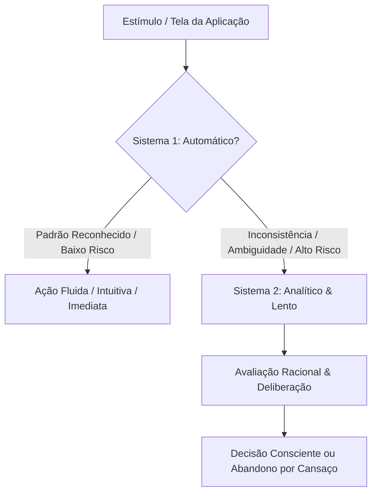

| Dimensão | Sistema 1 (Fast Thinking) | Sistema 2 (Slow Thinking) |
| :------------------------------ | :------------------------------------------------------------------------- | :------------------------------------------------------------------------------ |
| **Velocidade** | Milissegundos, instantâneo | Segundos a minutos, pausado |
| **Custo Metabólico** | Mínimo, quase zero esforço | Altíssimo, esgota a capacidade de atenção |
| **Modo Operacional** | Automático, baseado em hábitos e heurísticas | Deliberado, analítico, lógico |
| **Consciência** | Fora da percepção explícita | Foco consciente ativo |
| **Gatilho de Ativação** | Cores familiares, layouts padrão, ícones conhecidos | Formulários longos, cálculos, termos ambíguos, erros |
| **Regra de Ouro em UX** | **Maximize a aderência:** deixe fluxos rotineiros 100% no Sistema 1 | **Isole com cuidado:** acione o Sistema 2 apenas quando errar causar dano |

> **Regra de Arquitetura Cognitiva #1:** Toda vez que sua interface força o usuário a pensar "onde eu clico?", "o que este botão faz?" ou "qual é o cálculo deste imposto?", você arrancou o usuário do Sistema 1 e sobrecarregou o Sistema 2. Se isso ocorrer repetidas vezes em uma mesma sessão, a resposta biológica é o **abandono de fluxo por fadiga de decisão**.

---

### 1.2. Catálogo de Vieses Cognitivos Essenciais em UX

Vieses cognitivos são atalhos sistemáticos do Sistema 1. O designer técnico deve dominá-los para **prevenir enganos acidentais** e **construir caminhos intuitivos**:

1. **Viés de Ancoragem (Anchoring Bias):** O primeiro valor, texto ou opção apresentado torna-se a âncora de julgamento para tudo o que vier a seguir.
   - *Aplicação Provedora:* Em tabelas de precificação, posicionar o plano de maior valor à esquerda ou no topo estabelece uma âncora alta, tornando o plano intermediário ("Recomendado") cognitivamente vantajoso.
2. **Aversão à Perda (Loss Aversion):** A dor psicológica de perder R$ 100 é mensurada como sendo entre 2x a 2.5x mais intensa do que a satisfação de ganhar o mesmo montante (Tversky & Kahneman).
   - *Aplicação Ética:* Notificar o usuário com "Faltam 2 horas para expirar seu cupom de frete grátis" gera 80% mais urgência do que "Aproveite um novo cupom de frete grátis".
3. **Viés do Status Quo & Força do Padrão (Default Effect):** Os usuários permanecem massivamente com a configuração pré-selecionada. Alterar o padrão exige esforço deliberado do Sistema 2.
   - *Aplicação Mandatória:* Defaults devem sempre favorecer a segurança, a saúde financeira e a privacidade do usuário (ex.: backup ativado por padrão; opt-in explícito para telemetria de marketing).
4. **Efeito Chamariz (Decoy Effect / Assimetria de Dominância):** Ao introduzir uma terceira opção intencionalmente subótima em relação a uma opção-alvo, a percepção de valor da opção-alvo é inflacionada.
   - *Exemplo:* Assinatura Digital (R$ 30), Impressa (R$ 60), Digital + Impressa (R$ 60). A opção intermediária existe apenas para validar o combo.
5. **Prova Social (Social Proof):** Na incerteza, o ser humano replica o comportamento dos seus semelhantes.
   - *Aplicação:* Selos contextuais: *"84% dos engenheiros seniores escolhem a chave SSH em vez de senha"*.
6. **Miopia Temporal & Desconto Hiperbólico (Hyperbolic Discounting):** Tendência de supervalorizar recompensas imediatas em detrimento de recompensas de longo prazo, postergando o sacrifício presente.
   - *Aplicação:* Transformar metas de longo prazo ("Junte R$ 12.000 em 1 ano") em micro-ações imediatas ("Economize R$ 32 hoje").

---

### 1.3. A Ética do Design Comportamental: Persuasão vs. Manipulação

A linha entre Persuasão Tecnológica (Fogg Captology) e Manipulação Ilícita (Dark Patterns / Sludge) é puramente ética e baseia-se na **soberania dos objetivos do usuário**:

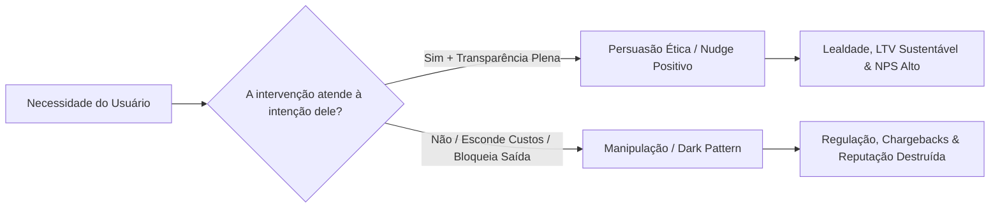

| Critério de Avaliação | Persuasão Ética (Nudge) | Coerção ou Mandato | Manipulação (Dark Pattern) |
| :--------------------------------- | :------------------------------------------------------------------------- | :---------------------------------------------- | :---------------------------------------------------------------------------- |
| **Liberdade de Escolha** | **Totalmente preservada.** O opt-out é tão fácil quanto o opt-in. | **Suprimida.** Não há rota alternativa. | **Aparente, mas minada.** O caminho de saída é escondido ou punitivo. |
| **Incentivo Financeiro** | Sem alteração material direta no preço. | Mandato legal ou barreira monetária. | Cobranças ocultas, armadilhas de renovação. |
| **Beneficiário Principal** | O usuário final em conformidade com suas metas declaradas. | O regulador ou o sistema. | O balanço da empresa às custas do usuário. |
| **Transparência Cognitiva** | Informação completa apresentada no momento da decisão. | Imposição autoritária explícita. | Letras miúdas, assimetria proposital de informação. |

---

## 2. Frameworks Operacionais de Mudança de Comportamento

### 2.1. O Modelo de Comportamento de Fogg (B = MAP)

Criado pelo Dr. B.J. Fogg no Stanford Behavior Design Lab, o modelo estabelece que **um comportamento ($B$) só ocorre quando três elementos convergem simultaneamente no tempo**:

$$
\mathbf{B = M \times A \times P}
$$

- $\mathbf{M}$ (*Motivation*): Nível de vontade (Prazer/Dor, Esperança/Medo, Aceitação/Rejeição).
- $\mathbf{A}$ (*Ability*): Facilidade física e mental de executar a tarefa.
- $\mathbf{P}$ (*Prompt* / Gatilho): O chamado imediato para a ação (*Call to Action*).

```text
  Motivação (M)
     Alto  ▲
           │          Curva da Linha de Ação
           │          (Action Line)
           │            \
           │             \   SUCESSO (Gatilhos funcionam aqui)
           │              \
           │               \
           │                \
     Baixo ┼─────────────────\────────────────────────► Habilidade (A)
          Difícil              Fácil (Menor Esforço)
```

#### As 6 Dimensões da Habilidade (Simplicidade de Fogg)

Fogg postula: **nunca tente aumentar a motivação se você pode tornar a tarefa mais fácil**. Aumentar a motivação é volátil e caro; aumentar a habilidade é permanente e barato. Avalie sua tela sob os 6 bloqueadores de facilidade:

1. **Tempo:** Quanto tempo a ação toma? (Cada minuto a mais reduz a conclusão em 20%).
2. **Dinheiro:** Qual o custo financeiro imediato percebido?
3. **Esforço Físico:** Quantos cliques, toques ou rolagens são necessários?
4. **Ciclos Mentais (Brain Cycles):** Quanta cognição/leitura é exigida?
5. **Desvio de Rotina:** O comportamento exige alterar o dia a dia habitual do usuário?
6. **Aceitabilidade Social:** A ação expõe o usuário ao julgamento público desfavorável?

#### Os 3 Tipos de Gatilho (Prompts)

- **Facilitador (Facilitator):** Use quando a **Motivação é Alta**, mas a **Habilidade é Baixa**. O gatilho entrega a ferramenta de simplificação (ex.: *"Clique para autenticar com Google em 1 toque"*).
- **Faísca (Spark):** Use quando a **Habilidade é Alta**, mas a **Motivação é Baixa**. O gatilho incorpora prova social, escassez ou aversão à perda para acender a ação.
- **Sinal (Signal):** Use quando **ambos (Motivação e Habilidade) são Altos**. O gatilho é um mero lembrete discreto (ex.: notificação sonora de nova mensagem).

---

### 2.2. O Funil de Ação CREATE (Steve Wendel)

Desenvolvido por Steve Wendel (*Designing for Behavior Change*), o funil CREATE audita o caminho cognitivo sequencial percorrido pelo usuário. A falha em qualquer elo quebra a conversão:

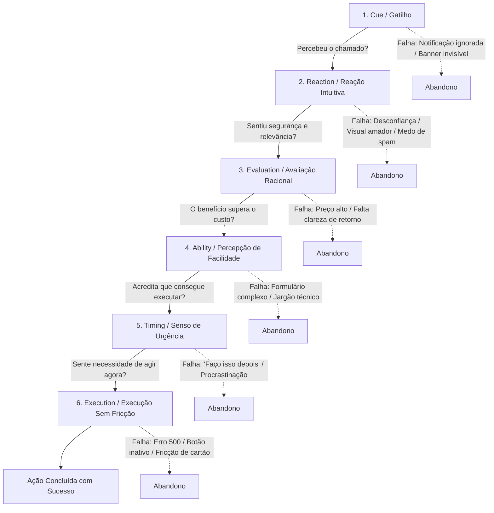

---

### 2.3. O Grid de Comportamento de Fogg (15 Tipos de Ação)

Classificar com precisão o comportamento desejado evita desperdício de engenharia. Cruzam-se 5 Tipos de Mudança com 3 Horizontes de Tempo:

| Tipo de Mudança | Dot (Pontual / 1 Única Vez) | Span (Duração Delimitada / Ex: 30 dias) | Path (Permanente / Hábito Eterno) |
| :------------------------------------------ | :-------------------------------------- | :-------------------------------------------- | :---------------------------------------- |
| **Verde (Comportamento Novo)** | Cadastro em serviço; aceite de termos. | Onboarding guiado; teste de 14 dias. | Migração definitiva de ferramenta. |
| **Azul (Comportamento Familiar)** | Re-login após expiração de sessão. | Atualizar extrato semanal durante auditoria. | Checar dashboard todas as manhãs. |
| **Roxo (Aumentar Intensidade)** | Fazer upgrade pontual para plano anual. | Ler 5 artigos a mais durante maratona. | Aumentar o aporte mensal fixo em 20%. |
| **Cinza (Reduzir Intensidade)** | Reduzir tempo de tela por 1 tarde. | Limitar refeições calóricas na quarentena. | Diminuir gasto em delivery em definitivo. |
| **Preto (Cessar / Parar Totalmente)** | Recusar um e-mail promocional. | Fazer "Detox Digital" por 7 dias. | Cancelar e desinstalar app de tabagismo. |

> **Diretriz de Design:** Tratar um comportamento **Verde-Path** (adotar hábito novo permanente) como se fosse um **Verde-Dot** (clique único) é a causa número 1 de churn pós-onboarding. Comportamentos permanentes exigem ancoragem contextual e feedback contínuo.

---

### 2.4. Loops de Hábito: Hook Model (Eyal) vs. Gatilho-Rotina-Recompensa (Duhigg)

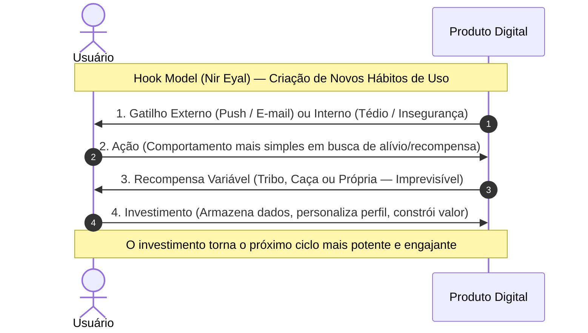

#### A Matriz Comparativa de Modelos de Hábito

| Dimensão | Loop de Hábito (Charles Duhigg) | Hook Model (Nir Eyal) |
| :------------------------------- | :--------------------------------------------------------------------------------- | :------------------------------------------------------------------------------------------------ |
| **Estrutura** | Tríade: Deixa (Cue) ➔ Rotina (Routine) ➔ Recompensa (Reward). | Ciclo Quádruplo: Gatilho ➔ Ação ➔ Recompensa Variável ➔ Investimento. |
| **Natureza da Recompensa** | Fixa ou variável; foca no alívio do anseio (_craving_). | **Obrigatoriamente Variável** (ativação de dopamina por imprevisibilidade). |
| **Papel do Investimento** | Implícito na consolidação neurológica do loop. | **Explícito:** o usuário armazena conteúdo/reputação, aumentando o _switching cost_. |
| **Melhor Aplicação** | **Diagnóstico e Substituição:** corrigir hábitos indesejados existentes. | **Criação de Produtos:** desenhar aplicações de engajamento diário e retenção. |

---

## 3. O Espectro de Intervenções de Pensamento

### 3.1. Quando Operar em Baixo Esforço vs. Alto Esforço

O designer deve escolher cirurgicamente o ponto do espectro em que cada tela se posicionará:

```text
Baixo Esforço Mental                                        Alto Esforço Mental
◄─────────────────────────────────────────────────────────────────────────────►
[Ponta Automática / Nudge]                         [Ponta Consciente / Deliberada]
• Defaults pré-selecionados                        • Modais com digitação do nome do recurso
• Ações incidentais (arredondar troco)             • Resumo financeiro consolidado
• Automação de repetição                           • Períodos de resfriamento (cooling-off)
• One-click checkout                               • Double-confirmation com checklists
```

---

### 3.2. Técnicas de "Cheating" e Redução Radical de Decisão

"Cheating" no design comportamental refere-se à engenharia de atalhos onde a ação correta acontece **sem depender da força de vontade volátil do usuário**:

1. **Defaulting Estrutural (A Força do Pré-Selecionado):**
   - *Regra:* Em formulários e configurações, defina como padrão a opção que atende a 90% dos usuários e que garante a maior segurança e preservação de dados.
   - *Exemplo de Código Semântico:*
     ```html
     <!-- Correto: Default seguro e transparente -->
     <div class="setting-option">
       <input type="checkbox" id="backup-auto" name="backup-auto" checked />
       <label for="backup-auto">Ativar backup em nuvem diário (Recomendado)</label>
       <span class="helper">Garante que seus arquivos fiquem protegidos contra perda.</span>
     </div>
     ```
2. **Tornar a Ação Incidental (Making it Incidental):**
   - *Conceito:* A ação-alvo ocorre como subproduto de uma tarefa que o usuário já está executando voluntariamente.
   - *Exemplo em Finanças:* "Poupança por Arredondamento": ao pagar um café de R$ 7,40, o sistema debita R$ 8,00 e transfere R$ 0,60 automaticamente para a reserva de emergência. O ato de poupar torna-se imperceptível e incidental.
3. **Automatizar o Ato de Repetição (Automating Repetition):**
   - *Conceito:* Uma decisão pontual ($Dot$) substitui centenas de decisões recorrentes ($Path$). O usuário autoriza a regra uma única vez, e o sistema gerencia a execução contínua (ex.: reinvestimento automático de dividendos).

---

### 3.3. Apoio à Ação Consciente e Fricção Propositiva

Em situações de alto impacto, velocidade é um defeito, não uma qualidade. Nesses pontos, a interface **deve injetar atrito defensivo intencional**:

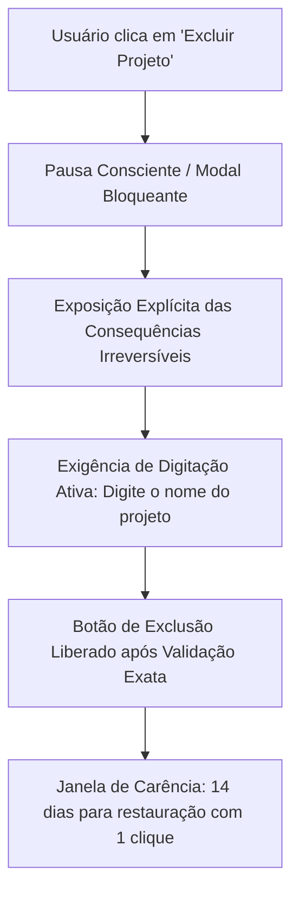

#### Diretrizes de Fricção Defensiva

- **Proibido usar "OK / Cancelar" genérico:** O botão afirmativo deve declarar o verbo do dano: `[Excluir Permanentemente 1.200 Registros]`.
- **Destrutividade Exige Digitação Exata:** Obrigue a digitação do identificador único (ex.: digite `producao-db-cluster` para confirmar a deleção).
- **Período de Resfriamento (Cooling-off / Grace Period):** Transações financeiras atípicas ou exclusões de conta devem operar com carência assíncrona (ex.: transação agendada para 12 horas depois, permitindo cancelamento com 1 toque).

---

## 4. Engenharia de Hábitos no Produto

### 4.1. Instalação de Hábitos Novos (Tiny Habits & Habit Stacking)

Para instalar um novo comportamento que ainda não possui raízes neurais no usuário:

1. **Ancoragem em Hábitos Pré-Existentes (Habit Stacking):**
   - Fórmula: *"Depois que eu fizer [Hábito Consolidado Atual], eu farei imediatamente [Novo Hábito de UX]"*.
   - *Exemplo em Software:* *"Após emitir a nota fiscal (ação consolidada), exiba um modal com 1 clique: 'Deseja conciliar o recebimento bancário agora?'"*.
2. **A Regra dos Tiny Habits (B.J. Fogg):**
   - Reduza a versão inicial do comportamento até que ela pareça trivial. Em vez de pedir "preencha seu perfil corporativo completo de 30 campos", solicite apenas: *"Qual é o nome da sua empresa?"*.
3. **Recompensa Imediata:**
   - A dopamina não responde a promessas a 30 dias. O feedback de sucesso precisa ser disparado nos primeiros **200 milissegundos** após a conclusão (animação fluida de check, som tátil, confirmação expressiva).

---

### 4.2. Desconstrução e Modificação de Hábitos Existentes

Conforme a Regra de Ouro de Charles Duhigg, **um hábito consolidado não pode ser erradicado — ele deve ser substituído**:

| Estratégia de Intervenção | Ponto do Loop Afetado | Ação de Design no Produto | Cenário Real |
| :---------------------------------------------- | :-------------------- | :------------------------------------------------------------------------------- | :---------------------------------------------------------------------------------------------------------------------------------------------------------------------- |
| **Evitar o Gatilho (Avoid the Cue)** | Deixa (Trigger) | Silenciar ou remover completamente o disparador ambiental. | Ocultar badges vermelhos de notificação e silenciar push fora do horário comercial. |
| **Substituir a Rotina (Replace Routine)** | Rotina (Routine) | Manter o gatilho e a recompensa final; oferecer uma nova ação de menor atrito. | O usuário abre o app por tédio (gatilho) ➔ em vez de feed infinito, exibe desafio de 1 minuto de vocabulário (nova rotina) ➔ sensação de progresso (recompensa). |
| **Crowd Out (Ocupação Competitiva)** | Rotina (Routine) | Inserir um comportamento novo que seja mutuamente exclusivo com o antigo. | Sugerir leitura em modo foco que bloqueia fisicamente a alternância de abas. |
| **Interrupção Consciente** | Elo Gatilho ➔ Rotina | Inserir prompt de consciência forçada que quebra o piloto automático. | Alerta: _"Você já gastou 45 minutos no painel. Gostaria de salvar o rascunho e pausar?"_. |

---

## 5. Alinhamento Estratégico: Produto, Negócio e Usuário

### 5.1. A Tríade Causal: Ator-Alvo ➔ Ação-Alvo ➔ Resultado-Alvo

Antes de projetar wireframes ou protótipos, toda equipe deve documentar explicitamente a cadeia de causalidade do produto:

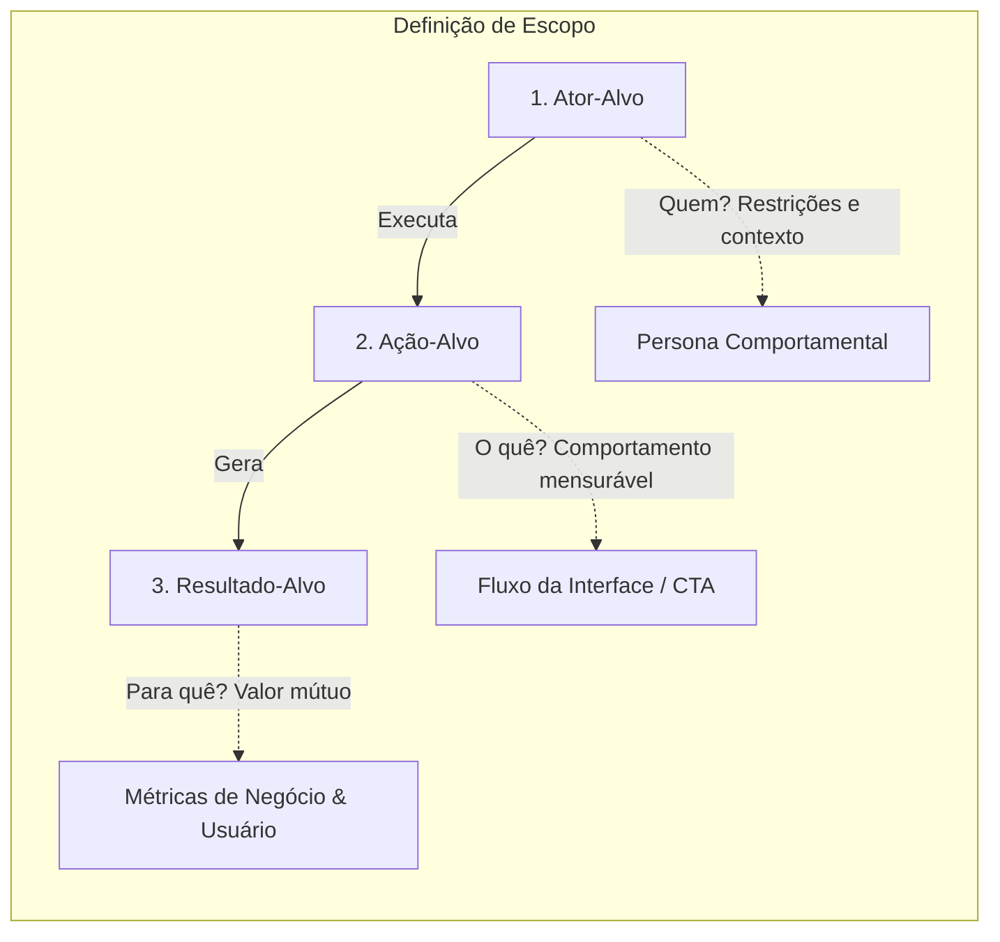

- **Ator-Alvo:** Não é "homem de 35 anos", mas sim *"Coordenador de TI sobrecarregado, com múltiplos chamados abertos e sem tempo para ler documentações extensas"*.
- **Ação-Alvo:** Um verbo operacional inequívoco: *"Autorizar a chave de API de integração com o ERP em 3 etapas"*.
- **Resultado-Alvo:** Valor para o usuário (*"Sistemas sincronizados sem erro manual"*) + Valor para o negócio (*"Aumento de ativação de planos Enterprise em 18%"*).

---

### 5.2. Personas Baseadas em Pesquisa e Modelagem Comportamental

Personas são instrumentos de tomada de decisão técnica, não galerias de fotos decorativas. Uma persona rigorosa deve conter:

```markdown
### 👤 Persona: Carlos Eduardo, 38 anos (Tech Lead / Arquiteto de Software)
- **Contexto Operacional:** Lidera 3 squads com alta pressão de entrega e SLA de 99.9%.
- **Objetivo Principal:** Garantir governança de segurança sem criar gargalos no fluxo de CI/CD dos desenvolvedores.
- **Dores Críticas (Pain Points):** Telas de configuração confusas onde um erro desconfigura o cluster; documentações desatualizadas.
- **Mentalidade Cognitiva:** Sistema 2 predominante em segurança, mas opera no Sistema 1 em tarefas rotineiras.
- **Frase-Guia:** *"Se a ferramenta me exigir mais de 3 passos para aprovar um deploy seguro, meus devs vão burlar o processo."*
- **Ação-Alvo Prioritária:** Configurar políticas de branch protection e assinar commits em lote.
```

---

### 5.3. Validação de Hipóteses de Negócio (BMC, Lean Canvas e SWOT)

- **Business Model Canvas (Osterwalder):** Use para mapear produtos já estabelecidos, auditando os 9 blocos e garantindo que o fluxo de canais e parcerias não colida com a proposta de valor do usuário.
- **Lean Canvas (Ash Maurya):** Mandatório para novas iniciativas e MVPs. Foca nos 4 quadrantes de risco: **Problema Real**, **Solução Mínima**, **Métricas-Chave (OMTM)** e **Vantagem Injusta**.
- **Matriz SWOT Cruzada em UX:**
  - *Força + Oportunidade:* Usar o fluxo de onboarding rápido (Força) para capturar o segmento mobile first insatisfeito com concorrentes lentos (Oportunidade).
  - *Fraqueza + Ameaça:* Marca nova sem histórico de segurança (Fraqueza) frente a regulação estrita de privacidade (Ameaça) ➔ Requisito de UX: Exibir certificações SOC2/ISO auditáveis em todas as telas de pagamento.

---

## 6. Design Conceitual & Arquitetura da Informação

### 6.1. Mapeamento de Jornada e Curva Emocional (Customer Experience Maps)

O mapa de experiência concebido por Mel Edwards sobrepõe as ações práticas do usuário com seus estados internos (pensamentos e emoções):

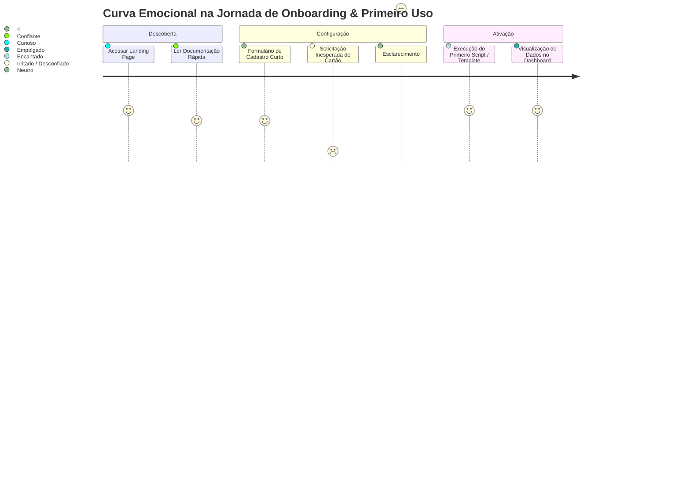

> **Regra de Arquitetura de Fluxo:** Todo vale emocional (queda na curva) identifica um atrito cognitivo ou desconfiança que deve ser sanado imediatamente via microcópia, eliminação de campos desnecessários ou garantias contextuais explícitas.

---

### 6.2. Modelagem de Processos: Flowcharts, EPC e BPMN com Swimlanes

Antes de desenhar telas no Figma ou prototipar, a lógica causal dos processos deve ser fixada formalmente:

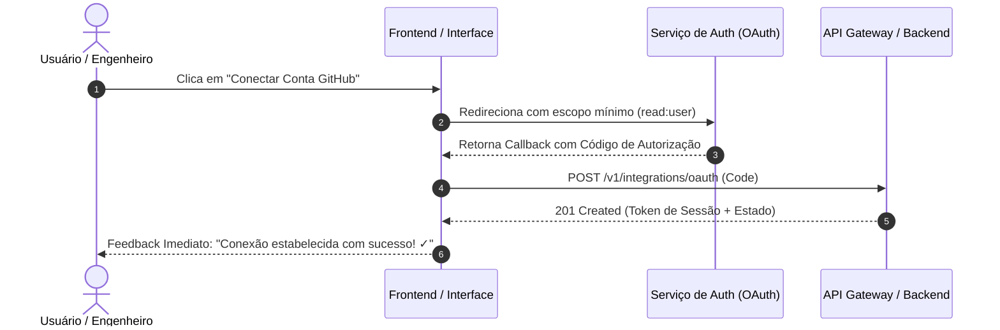

| Nível de Rigor | Notação Recomendada | Quando Empregar |
| :----------------------------- | :----------------------------------------- | :------------------------------------------------------------------------------------------------------- |
| **Conceitual / Rápido** | **Fluxograma Simples** | Alinhamento relâmpago de fluxo feliz com PMs e designers. |
| **Intermediário** | **EPC (Event-driven Process Chain)** | Mapeamento orientado a eventos (`Evento ➔ Função ➔ Evento Resultante`). |
| **Formal / Engenharia** | **BPMN 2.0 com Swimlanes** | Fluxos de pagamentos, conciliação e processos distribuídos entre Múltiplos Atores e Microsserviços. |

---

### 6.3. User Stories Orientadas a Comportamento (INVEST + Given/When/Then)

Toda história de produto deve refletir o benefício real de comportamento do ator:

```markdown
Como um [Ator-Alvo / Persona],
Eu quero [Ação-Alvo Operacional],
Para que eu consiga [Resultado-Alvo Mensurável].
```

#### Critérios de Aceitação em BDD (Behavior-Driven Development)

```gherkin
Cenário: Ativação bem-sucedida de chave SSH via fluxo rápido
  Dado que Carlos está logado no painel administrativo e possui uma chave pública RSA válida
  Quando ele colar o conteúdo da chave no campo de texto e clicar em "Adicionar Chave"
  Então o sistema deve validar a sintaxe da chave em menos de 100ms
  E persistir o registro exibindo o fingerprint "SHA256:..." com status visual verde "Ativa"
  E desabilitar o botão temporariamente para evitar duplo clique acidental.
```

---

### 6.4. Prototipação Racional: Low-Fi, Mid-Fi e High-Fi

- **Baixa Fidelidade (Balsamiq / Papel / Excalidraw):** Obrigatória para explorar layout, ordem de blocos e hierarquia estrutural. Proíba expressamente a discussão de cores, tipografia ou sombras nesta fase.
- **Média Fidelidade (Wireframes Estruturados):** Define espaçamento matemático (grid 8pt), conteúdo textual real (elimine o *Lorem Ipsum*) e validação de fluxos.
- **Alta Fidelidade Interativa (Figma):** Conecta tokens do Design System, transições reais (150ms-250ms), validação de formulários em tempo real e estados de erro/sucesso para testes com usuários finais.

---

## 7. As Leis Fundamentais da Experiência e Cognição (Laws of UX)

### 7.1. Lei de Hick & Sobrecarga de Escolha

> *O tempo necessário para tomar uma decisão aumenta logaritmicamente com o número e a complexidade das opções disponíveis:* $T = b \cdot \log_2(n + 1)$.

- **Regra Prática:** Limite listas de ações primárias a no máximo **3 a 5 opções**. Em menus ou dashboards com muitas funcionalidades, adote categorização hierárquica e **revelação progressiva** (*progressive disclosure*).

---

### 7.2. Lei de Fitts & Zonas de Ação Ergonômica

> *O tempo para alcançar um alvo com um dispositivo apontador é função da distância até o alvo e do tamanho do alvo:* $T = a + b \cdot \log_2(2D / W)$.

- **Alvos de Toque no Mobile:** Áreas clicáveis devem ter no mínimo **$48 \times 48\text{ px}$** ($44 \times 44\text{ pt}$ no iOS) com margens seguras entre si.
- **Posicionamento:** No mobile, as ações primárias devem residir na zona inferior da tela (*thumb zone*), onde o polegar atinge sem esforço motor.

---

### 7.3. Lei de Miller & Chunking Cognitivo

> *A memória de trabalho de um ser humano médio é capaz de reter apenas $7 \pm 2$ blocos (chunks) de informação por vez.*

- **Regra Prática:** Nunca apresente sequências contínuas de dígitos ou informações densas. Divida números de cartão de crédito em blocos de 4 dígitos, CPFs em `3-3-3-2` e cadastros longos em etapas nomeadas (Steppers).

---

### 7.4. Lei de Jakob & Padrões Mentais Consolidados

> *Os usuários passam a maior parte do tempo em outros produtos digitais; portanto, eles esperam que o seu produto funcione da mesma forma que os produtos que eles já conhecem.*

- **Regra Prática:** Não inove na gramática básica da web. Carrinho de compras no topo direito, logo retornando à home na esquerda, lupa indicando busca e engrenagem indicando configurações são padrões imutáveis.

---

### 7.5. Efeito Estético-Usabilidade & Autenticidade

> *Os usuários percebem interfaces visualmente atraentes e limpas como mais fáceis de usar e mais confiáveis, relevando pequenos atritos operacionais.*

- Um acabamento consistente com grid matemático, tipografia com alto contraste e microinterações elegantes transmite autoridade técnica imediata e relaxa o Sistema 1 do usuário.

---

### 7.6. Efeito Zeigarnik, Dotated Progress & Peak-End Rule

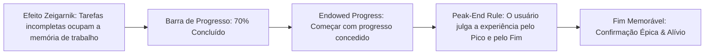

- **Efeito de Progresso Dotado (Endowed Progress Effect):** Se um processo tem 5 etapas, mostre ao usuário que a etapa 1 já está concluída (*"Passo 2 de 5: Conta criada com sucesso!"*). A percepção de progresso já iniciado reduz o abandono em 40%.
- **Regra Pico-Fim (Peak-End Rule - Kahneman):** Os seres humanos não avaliam uma experiência pela média aritmética de cada segundo, mas sim pela intensidade sentida no **ponto de pico** (o momento mais crítico ou alegre) e no **fim** (o desfecho do fluxo). Um encerramento triunfante apaga atritos intermediários da memória do usuário.

---

### 7.7. As 10 Heurísticas de Usabilidade de Nielsen Aplicadas à Engenharia

As 10 Heurísticas de Jakob Nielsen (NN/g) representam o benchmark universal para auditorias de interface e prevenção de erros:

| # | Heurística | Regra Técnica em Engenharia | Violação Crítica (Anti-Padrão) |
| :-: | :--- | :--- | :--- |
| **1** | **Visibilidade do Status do Sistema** | Sempre forneça feedback em tempo real para ações assíncronas (spinners com texto de estado, barras de progresso determinísticas, skeletons). Resposta visual $\le 100\text{ms}$. | Tela estática congelada sem indicar se a requisição está em andamento, induzindo o usuário a clicar repetidas vezes. |
| **2** | **Correspondência Sistema/Mundo Real** | Utilize a linguagem, termos e metáforas do universo de domínio do usuário final, evitando jargões internos de banco de dados ou backend. | Exibir mensagens cruas como `NullPointerException at line 402` ou `ORA-01403: no data found` para o usuário leigo. |
| **3** | **Controle e Liberdade do Usuário** | Forneça saídas de emergência claras: suporte incondicional a `Desfazer (Undo)`, `Cancelar` seguro e tecla `Escape` em modais e gavetas laterais. | Modais sem botão visível de fechar, com clique fora desabilitado e sem atalho de teclado `Esc`. |
| **4** | **Consistência e Padrões** | Mantenha consistência interna (mesmo design token, mesmo comportamento) e externa (convenções globais da plataforma e do SO). | Botão primário verde em uma tela e vermelho em outra; links com comportamento de botão de formulário. |
| **5** | **Prevenção de Erros** | Elimine condições propensas a erro antes que ocorram: desabilite opções inválidas, use máscaras de digitação restritivas e exiba confirmações prévias para ações irreversíveis. | Permitir que o usuário digite letras em campos numéricos de cartão para só acusar o erro após submeter o formulário. |
| **6** | **Reconhecimento em vez de Memorização** | Torne elementos, ações e opções visíveis. O usuário não deve ter que memorizar informações de uma tela para utilizá-las na tela seguinte. | Formulários de múltiplos passos onde o usuário precisa redigitar dados informados na etapa anterior. |
| **7** | **Flexibilidade e Eficiência de Uso** | Forneça aceleradores para usuários especialistas (atalhos de teclado como `Cmd+K`, macros, filtros avançados) sem poluir o fluxo do novato. | Forçar desenvolvedores seniores a navegar por 6 menus de mouse para executar uma ação diária sem suporte a atalho. |
| **8** | **Estética e Design Minimalista** | Cada unidade extra de informação visual em uma interface compete com as informações relevantes e diminui sua visibilidade relativa (relação sinal/ruído). | Dashboards abarrotados com 40 gráficos e cards decorativos onde os 3 KPIs críticos não se destacam. |
| **9** | **Ajuda para Reconhecer, Diagnosticar e Recuperar-se de Erros** | Mensagens de erro devem ser expressas em linguagem clara (sem códigos obscuros), apontar precisamente onde está o problema e sugerir a ação construtiva de correção. | Toast vermelho genérico: *"Erro inesperado. Tente novamente mais tarde"* sem indicar qual campo falhou nem como corrigir. |
| **10** | **Ajuda e Documentação Contextual** | A documentação deve ser fácil de pesquisar, focada na tarefa imediata do usuário e apresentada no ponto exato de necessidade (*tooltips*, links *in-situ*). | Exigir que o usuário saia da aplicação para ler um PDF externo de 120 páginas para entender um único campo de formulário. |

---

## 8. Regras Práticas de Implementação no Funil CREATE

### 8.1. Cue & Reaction: Priming, Prova Social e Autoridade

```html
<!-- Exemplo de Implementação de Reação Intuitiva Positiva (Cue + Reaction) -->
<section class="checkout-guarantee-card">
  <div class="security-badge">
    <svg class="icon-shield" aria-hidden="true"><!-- Ícone SVG de Cadeado Seguro --></svg>
    <span>Ambiente Seguro com Criptografia de Ponta a Ponta (TLS 1.3)</span>
  </div>
  
  <!-- Prova Social Contextual com Dados Auditáveis -->
  <div class="social-proof-snippet">
    <div class="avatars-group" aria-hidden="true">
      
      
      
    </div>
    <p>
      Utilizado por mais de <strong>14.200 empresas</strong> de engenharia em produção.
    </p>
  </div>
</section>
```

- **Regra de Priming:** Em ferramentas analíticas ou contábeis, use paletas de cores sóbrias (azul petróleo, cinza neutro, ardósia) e tipografia geométrica precisa para induzir o estado mental de rigor e segurança antes de o usuário ver o primeiro número.
- **Regra de Prova Social:** Prova social genérica (*"Somos os melhores"*) causa cinismo; prova social quantificada e com logos reais de pares industriais ativa a aceitação do Sistema 1.

---

### 8.2. Evaluation: Atenuação da Dor de Pagar e Transparência

- **Separar o Momento do Consumo do Momento do Pagamento:** Mecanismos de crédito em conta, carteiras pré-pagas e cartões salvos com faturamento consolidado minimizam o reflexo visceral de perda a cada transação individual.
- **Transparência Absoluta nos Custos:** Toda taxa de entrega, serviço ou imposto deve ser visível desde o primeiro momento. Exibir custos extras ocultos no último segundo de checkout é a causa número 1 de abandono de carrinho no comércio eletrônico mundial.

---

### 8.3. Timing: Urgência Real, Escassez e Miopia Temporal

| Tática Comportamental | Implementação Obrigatória (Ética) | Violação Proibida (Dark Pattern) |
| :-------------------------- | :----------------------------------------------------------------------------------------------------------------------- | :------------------------------------------------------------------------------------------------------- |
| **Escassez** | Exibir estoque real sincronizado via WebSocket:*"Restam apenas 2 unidades no depósito central"*. | Contadores falsos ou mensagens fixas*"Corra, restam poucas vagas!"* que nunca expiram. |
| **Aversão à Perda** | Destacar dados e históricos salvos do usuário:*"Ao suspender o plano, suas 42 automações ativas serão pausadas"*. | Confirmshaming: Botão de recusa com texto humilhante*"Não, eu prefiro continuar perdendo dinheiro"*. |
| **Miopia Temporal** | Desdobrar custos e ganhos em horizontes imediatos:*"Esta economia representa R$ 12 por dia na sua empresa"*. | Ocultar valor total de juros e exibir apenas o valor da parcela em letras garrafais. |

---

### 8.4. Ability & Execution: Fricção Zero, Affordances e Fechamento Inequívoco

```html
<!-- Exemplo de Formulário com Habilidade Máxima (Ability + Execution) -->
<form class="clean-payment-flow" novalidate>
  <!-- Autocompletar e Input Masking Nativos -->
  <div class="field-group">
    <label for="cep">CEP</label>
    <input 
      type="text" 
      id="cep" 
      name="postal-code" 
      autocomplete="postal-code" 
      inputmode="numeric" 
      placeholder="00000-000"
      required 
    />
    <!-- Endereço autopreenchido via API assim que o 8º dígito é digitado -->
    <p id="address-feedback" class="auto-resolved-hint" aria-live="polite">
      Av. Paulista, Bela Vista — São Paulo, SP
    </p>
  </div>

  <!-- Botão Primário com Ação Específica e Feedback de Carga -->
  <button type="submit" class="btn-primary-action" id="submit-btn">
    <span class="label">Pagar R$ 149,00 e Ativar Acesso Imediato</span>
    <span class="spinner" aria-hidden="true" hidden></span>
  </button>
</form>
```

#### Os 4 Mandamentos da Execução de Formulários

1. **Diga exatamente a ação e o custo no CTA:** Substitua `[Enviar]` por `[Pagar R$ 149,00 e Concluir Pedido]`.
2. **Elimine a Redigitação de Dados Conhecidos:** Se o CEP foi digitado, resolva automaticamente Logradouro, Bairro, Cidade e Estado via consulta em background.
3. **Affordance Visual Clara:** O botão primário deve ser o elemento com maior peso cromático e luminosidade da tela; botões secundários devem usar contorno (*outlined*) ou formato fantasma (*ghost*).
4. **Fechamento Inequívoco (Clear Completion):** Desabilite imediatamente o botão no clique para evitar duplo envio e redirecione para uma tela de sucesso com resumo completo, número de protocolo e confirmação por e-mail/push.

---

## 9. Catálogo de Anti-Padrões & Dark Patterns Proibidos

É expressamente proibida a implementação de quaisquer padrões manipuladores que subvertam a autonomia do usuário:

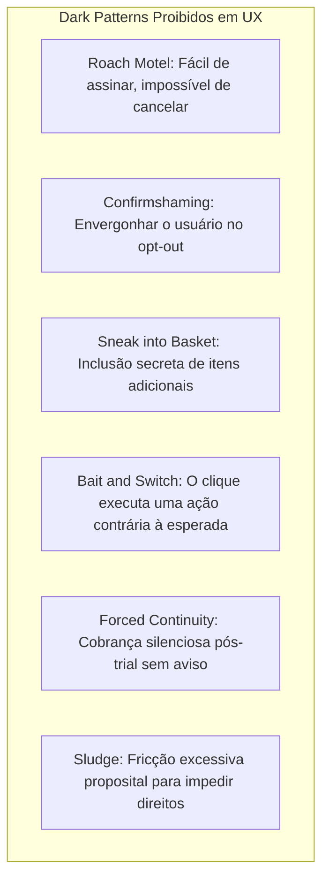

1. **Roach Motel (Armadilha da Barata):** Entrar em um serviço com 1 clique, mas exigir ligação telefônica, chat humano com tempo de espera ou formulários ocultos para cancelar. **Regra de Ouro:** O cancelamento deve exigir exatamente o mesmo número de cliques (ou menos) do que a adesão.
2. **Confirmshaming (Envergonhamento no Opt-Out):** Textos manipuladores em links de recusa: *"Não obrigado, prefiro pagar mais caro"* ou *"Não me importo em manter meus dados desprotegidos"*. O texto de opt-out deve ser neutro e respeitoso: *"Agora não"* ou *"Recusar oferta"*.
3. **Sneak into Basket (Itens Infiltrados no Carrinho):** Marcar checkboxes de seguros, doações ou produtos acessórios por padrão durante o checkout. Todo item acessório exige opt-in explícito e desmarcado por padrão.
4. **Bait and Switch (Isca e Troca):** Mudar o significado convencional de controles visuais (ex.: fazer o botão "X" superior de uma janela acionar a instalação de um software em vez de fechar a janela).
5. **Forced Continuity (Continuidade Forçada):** Iniciar cobranças no cartão após o término de um período de testes gratuito (*free trial*) sem enviar notificação com pelo menos **3 dias de antecedência**, permitindo cancelamento com 1 toque.
6. **Sludge Cognitivo:** A imposição proposital de atritos burocráticos, termos de uso incompreensíveis ou atrasos técnicos para desestimular o exercício de direitos de privacidade (ex.: LGPD/GDPR) ou reembolso.

---

## 10. Métricas, Experimentação e Ciclo de Aprendizado Contínuo

### 10.1. Métricas Comportamentais vs. Atitudinais (HEART, SUS, CES)

O design de UX apoia-se em evidência científica, combinando telemetria objetiva e percepção subjetiva:

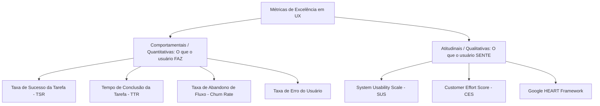

#### 1. System Usability Scale (SUS)

Questionário padronizado de 10 perguntas com pontuação de 0 a 100:

- $\ge \mathbf{80.3}$: Grau A (Excelente / World Class).
- $\mathbf{68.0}$: Média global histórica (Benchmark mínimo tolerável).
- $< \mathbf{50.0}$: Interface inaceitável; exige refatoração imediata.

#### 2. Customer Effort Score (CES)

> *"O quão fácil foi resolver o seu problema hoje?" (Escala de 1 a 7).*
> O CES correlaciona-se com lealdade de software com o dobro da precisão do NPS tradicional. Reduzir esforço gera retenção muito mais sustentável do que encantar com efeitos cosméticos.

#### 3. Google HEART Framework

- **Happiness (Felicidade):** Satisfação subjetiva, facilidade percebida.
- **Engagement (Engajamento):** Frequência de interação espontânea com o produto.
- **Adoption (Adoção):** Novos usuários ativados que atingem o momento "Aha!".
- **Retention (Retenção):** Usuários ativos na coorte de 30, 60 e 90 dias.
- **Task Success (Sucesso da Tarefa):** Eficiência, velocidade e ausência de erros.

---

### 10.2. Experimentação Controlada: A/B Incremental vs. Multivariado

```mermaid
graph LR
    subgraph Teste A/B Incremental
    AB_Base[Versão A: Controle] vs1[vs] AB_Var[Versão B: 1 Única Mudança de Botão]
    end

    subgraph Teste Multivariado MVT
    MVT_Base[Controle] vs2[vs] MVT_Grid[Combinações 3x2x2: Título + Imagem + CTA]
    end
```

| Critério Técnico | Teste A/B Incremental | Teste Multivariado (MVT) |
| :--- | :--- | :--- |
| **Variáveis Alteradas** | **Exatamente 1 variável por ciclo** (ex.: cor do botão ou texto do header). | Múltiplas variáveis combinadas simultaneamente. |
| **Causalidade Estatística** | **Cristalina:** a variação de métrica deve-se exclusivamente ao elemento alterado. | Difusa: reflete interações complexas entre elementos. |
| **Volume Mínimo de Amostra** | Médio (acessível para a maioria dos produtos B2B/B2C). | **Altíssimo:** exige centenas de milhares de sessões para atingir significância estatística de $p < 0.05$. |
| **Objetivo Primário** | Validação cirúrgica de hipóteses de design. | Otimização fina de landings de altíssimo tráfego. |

---

### 10.3. Loop de Integração: Coleta ➔ Priorização RICE ➔ Design

Nenhum resultado de teste tem valor se permanecer em silos de BI. Os dados devem alimentar o ciclo contínuo de design:

$$
\mathbf{RICE = \frac{Reach \times Impact \times Confidence}{Effort}}
$$

- **Reach (Alcance):** Quantos usuários serão afetados por sprint?
- **Impact (Impacto):** Efeito no comportamento ($3$ = maciço, $2$ = alto, $1$ = médio, $0.5$ = baixo).
- **Confidence (Confiança):** Grau de certeza baseado em dados reais ($100\%$ = teste A/B conclusivo, $80\%$ = pesquisa qualitativa, $50\%$ = intuição/achismo).
- **Effort (Esforço):** Semanas de trabalho de engenharia e design.

---

## 11. Checklist de Homologação e Auditoria de UX

Antes de promover qualquer tela ou fluxo para homologação e produção, o Tech Lead e o Designer devem validar os 12 critérios obrigatórios:

- [ ] **1. Mapeamento de Intenção do Sistema:** O fluxo prioriza o Sistema 1 (atalhos, reconhecimento, defaults) e reserva o Sistema 2 exclusivamente para momentos deliberados ou críticos?
- [ ] **2. Avaliação de Habilidade de Fogg:** A interface minimizou os 6 fatores de atrito (tempo, esforço físico, ciclos mentais, desvios de rotina)?
- [ ] **3. Auditoria do Funil CREATE:** O usuário possui um gatilho visível ($Cue$), reação segura ($Reaction$), custo transparente ($Evaluation$), facilidade técnica ($Ability$), senso de urgência autêntico ($Timing$) e fechamento inequívoco ($Execution$)?
- [ ] **4. Triagem do Espectro de Decisão:** Ações triviais possuem defaults inteligentes (*opt-out* ético); ações destrutivas ou de alto valor possuem fricção protetiva e períodos de resfriamento?
- [ ] **5. Cumprimento das Leis de UX:**
  - [ ] Lei de Hick: No máximo 3 a 5 opções primárias visíveis sem revelação progressiva.
  - [ ] Lei de Fitts: Alvos de toque $\ge 48\times 48\text{ px}$ com foco ergonômico na *thumb zone*.
  - [ ] Lei de Miller: Dados longos agrupados em *chunks* digeríveis (máximo $7 \pm 2$).
  - [ ] Lei de Jakob: Ícones e posições respeitam as convenções globais da indústria.
- [ ] **6. Inexistência de Dark Patterns:** Ausência total de Roach Motel, Confirmshaming, Sneak into Basket, contadores falsos de escassez ou armadilhas de cancelamento.
- [ ] **7. Paridade de Cancelamento:** Cancelar ou reverter a assinatura exige o mesmo número de etapas do que a adesão inicial.
- [ ] **8. Affordance e Contraste dos CTAs:** A ação primária domina visualmente a hierarquia da tela; seu texto declara explicitamente o verbo de ação e o objeto.
- [ ] **9. Tratamento Tolerante de Entrada:** Validação de formulário em tempo real (*inline feedback*) sem exigir recarregamento da página; formatos flexíveis para telefones e documentos.
- [ ] **10. Fechamento Inequívoco de Tarefas:** Feedback imediato de sucesso ($\le 200\text{ms}$) com resumo do que foi efetuado, prevenindo duplo clique acidental.
- [ ] **11. Transparência de Custos:** Valores totais, taxas e políticas de cobrança são comunicados antes do clique decisivo, sem surpresas ocultas.
- [ ] **12. Instrumentação e Telemetria:** O fluxo possui rastreamento de eventos de conversão, erros de validação e funil analítico para cálculo de TSR e TTR em produção.

---

## 12. Referências Canônicas & Bibliografia

1. **Kahneman, Daniel.** *Thinking, Fast and Slow.* Farrar, Straus and Giroux, 2011. (Base da Teoria do Processo Dual, Vieses Cognitivos e Peak-End Rule).
2. **Fogg, B.J.** *Tiny Habits: The Small Changes That Change Everything.* Houghton Mifflin Harcourt, 2019. (Fogg Behavior Model $B = MAP$, Behavior Grid).
3. **Wendel, Stephen.** *Designing for Behavior Change: Applying Psychology and Behavioral Economics.* O'Reilly Media, 2ª ed., 2020. (Funil de Ação CREATE, Espectro de Intervenções).
4. **Eyal, Nir.** *Hooked: How to Build Habit-Forming Products.* Portfolio/Penguin, 2014. (Hook Model: Trigger, Action, Variable Reward, Investment).
5. **Duhigg, Charles.** *The Power of Habit: Why We Do What We Do in Life and Business.* Random House, 2012. (Loop Deixa-Rotina-Recompensa e Substituição de Hábitos).
6. **Thaler, Richard H.; Sunstein, Cass R.** *Nudge: Improving Decisions About Health, Wealth, and Happiness.* Yale University Press, 2008. (Arquitetura de Escolhas, Paternalismo Libertário).
7. **Norman, Don.** *The Design of Everyday Things.* Basic Books, Edição Revisada, 2013. (Affordances, Signifiers, Modelos Conceituais e Mapeamento).
8. **Yablonski, Jon.** *Laws of UX: Using Psychology to Design Better Products & Services.* O'Reilly Media, 2020. (Leis de Fitts, Hick, Miller, Jakob e Zeigarnik).
9. **Nielsen Norman Group (NN/g).** *Heuristic Evaluation & Usability Engineering.* [nngroup.com](https://www.nngroup.com/)
10. **Interaction Design Foundation (IxDF).** *Behavioral Design and Cognitive Psychology for UX.* [interaction-design.org](https://www.interaction-design.org/)
