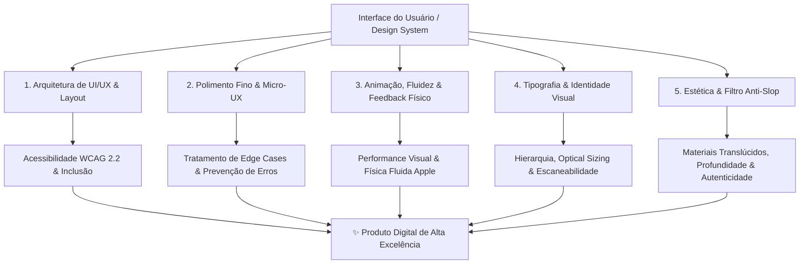
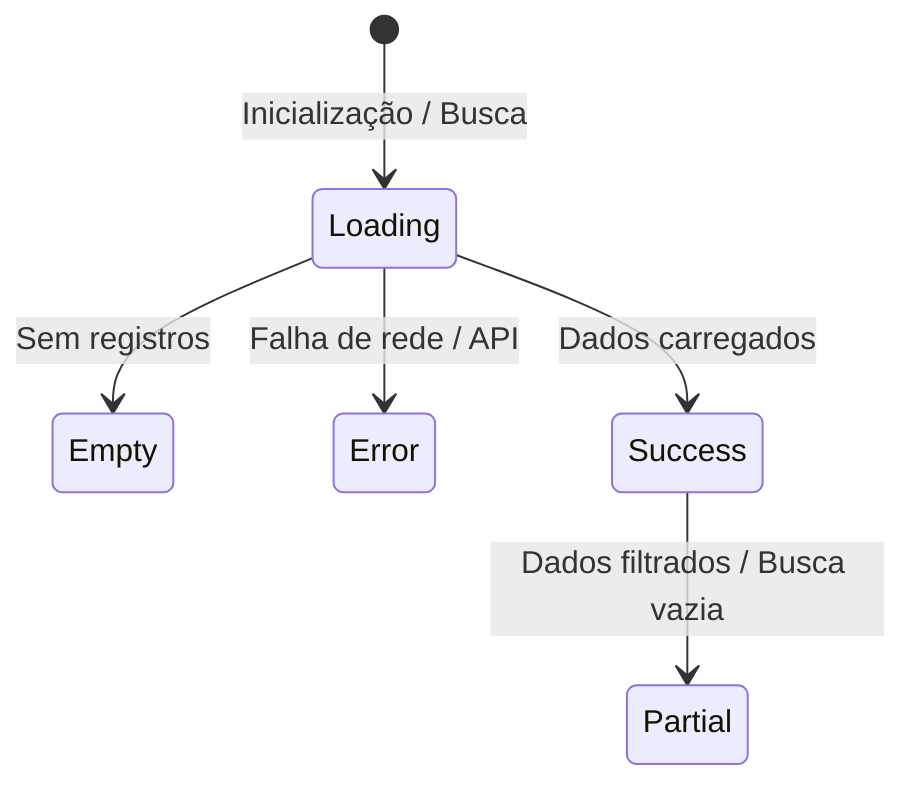
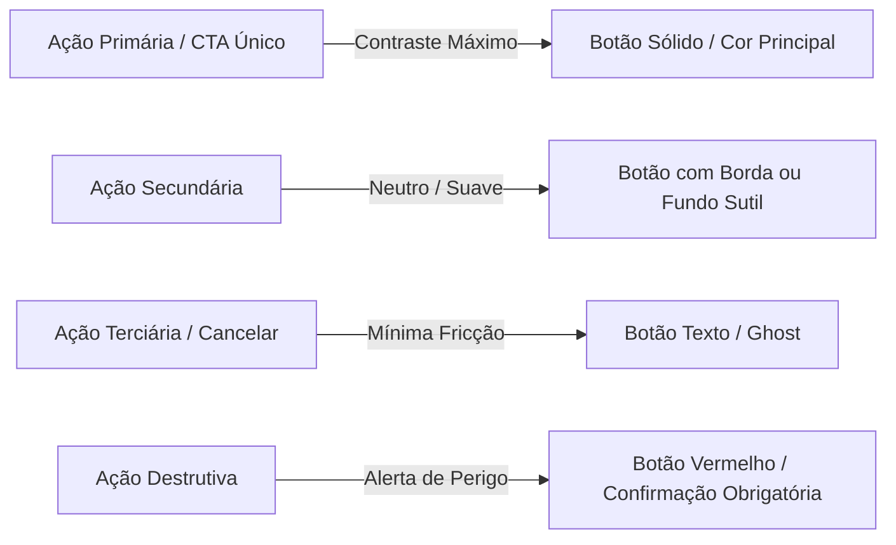

# <!--

# LOG DE MANUTENÇÃO E ALTERAÇÕES DO DOCUMENTO

| Data          | Autor                                                  | Descrição da Alteração                              |
| ------------- | ------------------------------------------------------ | --------------------------------------------------- |
| 2026-08-18    | Matheus Diniz                                          | Criação do Guia Universal de Design, UI/UX e        |
| (OpenClaude)  | Acessibilidade consolidando a skill /design-review     |
|               | e as 5 Lentes Fundamentais (Arquitetura, Micro-UX,     |
|               | Animação, Tipografia e Filtro Anti-Slop).              |
| 2026-08-18    | Matheus Diniz                                          | Inclusão de diretrizes mandatórias: componentes     |
| (OpenClaude)  | in-house próprios (Anti-Material/PrimeNG bloat),       |
|               | biblioteca padrão de ícones (Material Symbols/Icons)   |
|               | e definição da fonte padrão canônica (Inter).          |
| 2026-08-18    | Matheus Diniz                                          | Adição da política estrita de "Tailwind CSS First": |
| (OpenClaude)  | uso prioritário de classes utilitárias e restrição     |
|               | de CSS/SCSS personalizado apenas quando estritamente   |
|               | indispensável.                                         |
| 2026-08-18    | Matheus Diniz                                          | Inclusão do planejamento arquitetural mandatório    |
| (OpenClaude)  | para Tema Escuro (Dark Mode) e Tema de Alto            |
|               | Contraste (High Contrast / WCAG AAA).                  |
| 2026-09-01    | Matheus Diniz                                          | v2.0.0 — Expansão crítica: Z-Index e Stacking       |
| (Antigravity) | Contexts profundo (transform, filter, isolation,       |
|               | portais de overlay); proibição total de hex fora       |
|               | de tokens; tipografia 100% fluida com clamp();         |
|               | responsividade com Container Queries, svh/dvh,         |
|               | clamp() em espaçamentos; animações modernas            |
|               | (@starting-style, View Transitions, scroll-driven);    |
|               | glassmorphism com safety checks; nova seção de         |
|               | debugging e auditoria; scorecard expandido.            |
| 2026-09-07    | Matheus Diniz                                          | v2.1.0 — Integração canônica dos princípios de      |
| (Antigravity) | Apple Design & Fluid Interfaces (WWDC): física         |
|               | de molas (springs com damping/response), interrup-     |
|               | tibilidade em voo, tracking 1:1, projeção de momentum, |
|               | rubber-banding, materiais translúcidos com hierarquia  |
|               | de profundidade, tracking óptico e sensory feedback.   |

=================================================================================
-->

# 🎨 Guia Universal de Design de Interface (UI), Experiência do Usuário (UX) e Acessibilidade Digital (a11y)

> **Escopo do Documento:** Este guia é um manual **agnóstico a frameworks e tecnologias** (aplicável a Angular, React, Vue, Svelte, Next.js, Flutter, Tailwind CSS ou CSS Nativo). Ele estabelece os padrões institucionais de excelência visual, usabilidade ergonômica, conformidade estrita com acessibilidade (**WCAG 2.2 Níveis AA e AAA**), microinterações e qualidade estética contemporânea ("filtro anti-slop").

---

## 🧭 Visão Geral & O Framework das 5 Lentes

Concebido e auditado através de **5 Lentes Complementares** originadas da competência `/design-review`:



---

## 🏛️ 1. Filosofia de Design & Princípios Norteadores

### 1.1. Axiomas Institucionais de Engenharia de Interface

1. **Inclusão e Acessibilidade por Padrão (_Accessibility First_):** Uma interface não é bela se não puder ser operada por qualquer pessoa, em qualquer contexto, dispositivo ou condição sensorial/motora.
2. **Clareza sobre Decoração (_Function over Decoration_):** Cada cor, sombra, borda ou espaçamento deve ter uma função semântica e hierárquica clara. Se um elemento visual não comunica status, foco ou estrutura, elimine-o.
3. **Zero Fricção Cognitiva (_Don't Make Me Think_):** A jornada do usuário deve ser óbvia. Estados de espera, erros, ações primárias e caminhos de saída devem ser imediatamente reconhecíveis.
4. **Respeito ao Ritmo do Usuário (_Performance & Snappiness_):** Transições devem ser suaves e velozes (150ms a 300ms), nunca atrasando o fluxo de trabalho do usuário.
5. **Autenticidade e Fim do "AI Slop":** Interfaces corporativas modernas exigem sofisticação real — sombras em múltiplas camadas finas, tipografia com entrelinha precisa e contrastes calibrados, evitando clichês vazios como gradientes neon genéricos e cartões sem propósito.
6. **Componentes Próprios e Atômicos por Padrão (_In-House Design System First_):** Preferência mandatória por construir e manter nossos próprios componentes atômicos (UI in-house) em detrimento de bibliotecas pré-fabricadas e pesadas de terceiros (ex: Angular Material, PrimeNG, Bootstrap, Ant Design, MUI). Componentes próprios garantem controle total do DOM semântico, acessibilidade nativa sem hacks, ausência de CSS/JS bloating, bundle ultraleve e fidelidade visual absoluta à identidade do sistema.
7. **Tailwind CSS por Padrão (_Utility-First & Zero Arbitrary CSS_):** O desenvolvimento visual e estrutural deve ser realizado prioritariamente via classes utilitárias do Tailwind CSS. O uso de CSS/SCSS personalizado deve ser uma exceção rara, restrita apenas a casos estritamente indispensáveis (ex: animações `@keyframes` aceleradas por GPU, pseudo-elementos intrincados, variáveis CSS de temas globais ou regras de impressão).
8. **Planejamento Nativo Multi-Tema (Light, Dark e Alto Contraste):** Toda interface e componente deve ser concebido e validado desde o primeiro rascunho com suporte arquitetural aos 3 modos canônicos: **Tema Claro (Light)**, **Tema Escuro (Dark)** e **Tema de Alto Contraste (High Contrast / WCAG AAA)**. É expressamente vedado o uso de cores fixas ("hardcoded") que quebrem a inversão de luminosidade ou a distinção de bordas nos temas escuro e de alto contraste.
9. **Zero Valores Fixos em `px` para Tipo e Espaçamentos Significativos:** Tamanhos de fonte, alturas de linha e espaçamentos de layout devem sempre usar unidades relativas (`rem`, `em`, `ch`) ou valores fluidos (`clamp()`). O uso de `px` é permitido apenas para bordas (`1px`), sombras e offsets de foco — nunca para `font-size`.

### 1.2. Os 8 Princípios Fundamentais de Design (Apple Design Foundations)

> _"When we align the interface to the way we think and move, something magical happens — it stops feeling like a computer and starts feeling like a seamless extension of us."_
> — Apple WWDC: Designing Fluid Interfaces & Principles of Great Design

Para construir interfaces que pareçam uma extensão viva do usuário, integramos os **8 princípios basilares da Apple** aos nossos axiomas técnicos:

1. **Propósito (Purpose):** Crie com intenção deliberada. Decida conscientemente o que **não** construir. Cada nova funcionalidade cobra uma taxa no orçamento de tempo, atenção e confiança do usuário; gaste esse orçamento apenas onde houver retorno expressivo.
2. **Autonomia (Agency):** Mantenha o usuário no comando irrestrito da experiência. Ofereça opções sem forçar caminhos únicos e garanta tolerância a falhas (_forgiveness_) — desfazer (`undo`) simples para enganos, reservando diálogos modais de confirmação exclusivamente para ações genuinamente destrutivas e irreversíveis.
3. **Responsabilidade (Responsibility):** Atue intransigentemente no melhor interesse do usuário. Solicite dados e permissões apenas no momento exato de uso e de forma transparente. Em produtos com IA, antecipe erros críticos e mitigue riscos com pré-visualizações (_previews_) e confirmações claras.
4. **Familiaridade (Familiarity):** Ancore a interface em metáforas intuitivas que honrem a física do mundo real. Mantenha consistência absoluta: elementos visualmente idênticos devem se comportar de forma idêntica e residir em locais previsíveis. Apenas quebre um padrão consagrado se você puder provar empiricamente que a nova solução é superior.
5. **Flexibilidade (Flexibility):** Projete para contextos e capacidades heterogêneos. Adapte a densidade ao dispositivo (mobile = toques rápidos e zonas de polegar; desktop = fluxos profundos com precisão de ponteiro). Permita personalização quando um único layout não atender a todos.
6. **Simplicidade — Não Minimalismo Vazio (Simplicity):** Elimine o supérfluo para que o propósito central resplandeça. Ocultar tudo em menus misteriosos parece minimalista, mas destrói a simplicidade. Seja conciso na linguagem, claro na hierarquia e apresente o caminho principal primeiro, reservando opções avançadas para níveis mais profundos.
7. **Artesanato & Primor Técnico (Craft):** Atenção intransigente aos detalhes gera confiança duradoura. Nada na interface é acidental: espaçamentos matemáticos, alinhamentos ópticos, estados de foco calibrados e transições fluidas devem ser escolhas deliberadas e defensáveis. Scroll trêmulo, ícones desalinhados e quebras de layout transmitem desleixo.
8. **Encanto & Deleite (Delight):** O deleite não é confete cosmético colado sobre o produto; é a consequência natural da execução perfeita dos sete princípios anteriores. Decida a sensação emocional que o usuário deve experimentar (calma, clareza, confiança) e reforce-a em cada microinteração.

---

## 📐 2. Arquitetura de Layout, Grid e Espaçamento

O alinhamento matemático e o ritmo espacial são a espinha dorsal da ordem visual.

### 2.1. O Sistema de Grid Base de 4pt / 8pt

Todos os espaçamentos (`margin`, `padding`, `gap`), dimensões e alturas de linha devem ser múltiplos de **4px**, com preferência para saltos na escala de **8px**. Sempre expresse esses valores como `rem` ou `clamp()`, nunca como `px` em componentes:

| Token Semântico          | Valor (`rem`) | Valor fluido (`clamp`)      | Uso Recomendado                                                |
| :----------------------- | :------------ | :-------------------------- | :------------------------------------------------------------- |
| `space-1` / `space-xxs`  | `0.25rem`     | —                           | Micro-ajustes, gap entre ícone e texto curto                   |
| `space-2` / `space-xs`   | `0.5rem`      | —                           | Padding interno de botões compactos, gap de itens em dropdowns |
| `space-3` / `space-sm`   | `0.75rem`     | —                           | Padding de inputs, espaçamento entre campos compactos          |
| `space-4` / `space-md`   | `1rem`        | `clamp(0.75rem, 2vw, 1rem)` | Espaçamento padrão de cartões, padding de células de tabela    |
| `space-6` / `space-lg`   | `1.5rem`      | `clamp(1rem, 3vw, 1.5rem)`  | Gaps entre cartões, separação de blocos lógicos                |
| `space-8` / `space-xl`   | `2rem`        | `clamp(1.5rem, 4vw, 2rem)`  | Margens de seções, padding interno de modais e drawers         |
| `space-12` / `space-2xl` | `3rem`        | `clamp(2rem, 6vw, 3rem)`    | Separação entre grandes blocos de página, hero sections        |

```css
/* ✅ DO: Tokens semânticos com clamp() para espaçamentos fluidos */
:root {
  --space-md: clamp(0.75rem, 2vw, 1rem);
  --space-lg: clamp(1rem, 3vw, 1.5rem);
  --space-xl: clamp(1.5rem, 4vw, 2rem);
}

.card-container {
  padding: var(--space-lg);
  display: flex;
  flex-direction: column;
  gap: var(--space-md);
}

/* ❌ DON'T: Valores em px arbitrários que quebram o ritmo visual e escala */
.card-container-bad {
  padding: 19px; /* ← proibido */
  gap: 13px; /* ← proibido */
}
```

---

### 2.2. Camadas, Z-Index e Stacking Contexts

> **Esta é uma das áreas mais críticas de bugs visuais em sistemas complexos.** Dropdowns que ficam atrás de modais, tooltips cortados por `overflow: hidden` e menus que somem sob headers fixos são sintomas diretos de má gestão de stacking context.

#### 2.2.1. Escala Padronizada de Z-Index

Evite números mágicos como `z-index: 99999`. Utilize a escala semântica abaixo exclusivamente via tokens CSS:

```css
:root {
  --z-base: 0; /* Conteúdo plano padrão */
  --z-elevated: 10; /* Cards flutuantes, cabeçalhos de tabela fixos */
  --z-sticky: 100; /* Headers e sidebars coladas ao scroll */
  --z-drawer: 200; /* Painéis laterais deslizantes */
  --z-backdrop: 300; /* Máscara escura/translúcida de fundo de overlay */
  --z-modal: 400; /* Janelas de diálogo e modais centrais */
  --z-popover: 500; /* Dropdowns, selects, date pickers, popovers */
  --z-tooltip: 600; /* Tooltips — sempre acima de popovers */
  --z-toast: 1000; /* Notificações globais e alertas críticos */
}
```

> **Regra de ouro:** Nunca use um valor de `z-index` que não esteja mapeado nesta escala. Se um caso de uso não cabe na escala, discuta e expanda-a formalmente.

#### 2.2.2. Stacking Contexts Implícitos — A Armadilha Principal

**Um stacking context é criado automaticamente** por qualquer elemento que possua:

| Propriedade       | Valor que cria stacking context                                           |
| :---------------- | :------------------------------------------------------------------------ |
| `position`        | `relative`, `absolute`, `fixed`, `sticky` + qualquer `z-index` não `auto` |
| `opacity`         | Qualquer valor `< 1`                                                      |
| `transform`       | Qualquer valor diferente de `none`                                        |
| `filter`          | Qualquer valor diferente de `none`                                        |
| `backdrop-filter` | Qualquer valor diferente de `none`                                        |
| `will-change`     | `transform`, `opacity`, `filter`                                          |
| `isolation`       | `isolate`                                                                 |
| `mix-blend-mode`  | Qualquer valor diferente de `normal`                                      |
| `clip-path`       | Qualquer valor diferente de `none`                                        |

**Consequência prática:** Um dropdown com `z-index: var(--z-popover)` (500) que seja **filho de um container com `transform: translateZ(0)` ou `will-change: transform`** ficará preso dentro desse stacking context e **nunca** aparecerá acima de elementos de fora do grupo, mesmo com `z-index: 9999`.

```css
/* ❌ ARMADILHA COMUM: Animação no container prende z-index dos filhos */
.animated-card {
  transform: translateY(0); /* ← cria stacking context! */
  transition: transform 200ms;
}

/* Qualquer dropdown/tooltip filho de .animated-card fica confinado ao stacking context */
.animated-card .dropdown-menu {
  z-index: var(--z-popover); /* ← NÃO sobe acima de elementos externos! */
}
```

```css
/* ✅ SOLUÇÃO 1: Teleportar o overlay para o body (padrão obrigatório) */
/* Renderizar o dropdown fora do .animated-card via portal */

/* ✅ SOLUÇÃO 2: Usar isolation: auto para não criar contexto nesse elemento */
.animated-card {
  isolation: auto; /* Padrão — não cria stacking context isolado */
  transform: translateY(0);
  transition: transform 200ms;
}
```

#### 2.2.3. `isolation: isolate` — Isolamento Intencional de Grupos

Use `isolation: isolate` para criar um stacking context **explícito e intencional** que isola um grupo do resto da página, sem depender de `z-index` no contexto raiz:

```css
/* ✅ Isolar um card complexo com overlays internos */
.data-card {
  isolation: isolate; /* Cria stacking context controlado, sem transform */
  position: relative;
}

/* Os filhos usam z-index relativo ao .data-card, não ao documento */
.data-card__badge {
  position: absolute;
  z-index: 1; /* Relativo apenas ao contexto do .data-card */
}
```

**Quando usar `isolation: isolate`:**

- Em cards com badges ou ícones sobrepostos internos.
- Em seções de layout que não devem interferir nos overlays globais (modais, toasts).
- **Nunca use** em containers que são pais de dropdowns ou tooltips que precisam "escapar" para o DOM raiz.

#### 2.2.4. Portais e Teleport para Overlays — Padrão Obrigatório

Dropdowns, modais, tooltips e toasts **devem ser renderizados diretamente no `<body>` ou em um `#portal-root` dedicado**, nunca aninhados profundamente no DOM onde stacking contexts podem aprisioná-los.

```html
<!-- ✅ Estrutura recomendada do DOM -->
<body>
  <div id="app">
    <!-- Conteúdo da aplicação -->
  </div>

  <!-- Portal raiz: todos os overlays são renderizados aqui -->
  <div id="portal-root" aria-live="polite"></div>
</body>
```

| Framework | Mecanismo de Portal/Teleport                     |
| :-------- | :----------------------------------------------- |
| React     | `ReactDOM.createPortal(children, document.body)` |
| Vue 3     | `<Teleport to="body">...</Teleport>`             |
| Angular   | `Overlay` do CDK (`@angular/cdk/overlay`)        |
| Svelte    | `<svelte:body>` ou biblioteca `svelte-portal`    |
| JS puro   | `document.body.appendChild(overlayElement)`      |

> **Regra:** Nenhum componente de overlay (dropdown, modal, tooltip, select customizado, datepicker) deve ser filho de um elemento com `overflow: hidden`, `transform`, `filter` ou `will-change` sem ser teleportado para o body.

#### 2.2.5. Debugging de Z-Index & Stacking Contexts

**Fluxo de diagnóstico quando um overlay não aparece corretamente:**

```
Overlay não aparece / fica atrás de outros elementos?
  → 1. Abrir DevTools → aba "Layers": visualizar stacking contexts como camadas 3D
  → 2. Inspecionar ancestrais do overlay: procurar transform, filter, opacity < 1, will-change
  → 3. Verificar se o overlay está renderizado no portal root (#portal-root / body)
  → 4. Confirmar que z-index usa os tokens corretos da escala (--z-popover, --z-modal etc.)
  → 5. Verificar overflow: hidden em ancestrais — corta posicionados absolutos/fixos
```

```js
// ✅ Snippet de console para detectar todos stacking contexts na página
(function detectStackingContexts() {
  const all = document.querySelectorAll("*");
  const found = [];
  all.forEach((el) => {
    const s = getComputedStyle(el);
    const creates =
      s.transform !== "none" ||
      parseFloat(s.opacity) < 1 ||
      s.filter !== "none" ||
      s.isolation === "isolate" ||
      (s.willChange !== "auto" && s.willChange !== "");
    if (creates)
      found.push({ tag: el.tagName, class: el.className, id: el.id });
  });
  console.table(found);
})();
```

---

### 2.3. Diretriz de Estilização: Tailwind CSS First & Uso Restrito de CSS/SCSS

Para assegurar consistência visual, ausência de código duplicado, zero _CSS dead code_ e bundles ultracompactos gerados via compilador JIT:

1. **Tailwind CSS como Padrão Obrigatório:** Todo o estilo de componentes e páginas deve ser construído diretamente no template com classes utilitárias do Tailwind CSS.
2. **Quando é Permitido Escrever CSS/SCSS Customizado (Exceções Estritas):**
   - Definição de **Tokens Globais e Variáveis CSS** (`:root`, `.theme-dark`, `.theme-high-contrast`).
   - Animações complexas de aceleração por hardware (`@keyframes`) com múltiplos estágios ou curvas de Bezier não padronizadas.
   - Pseudo-elementos complexos (`::before`, `::after`) com camadas e geometrias intrincadas.
   - Regras específicas de mídia de impressão (`@media print`).
   - Customização de barras de rolagem nativas (`::-webkit-scrollbar`).
3. **Proibição de Estilos Paralelos Redundantes:** É expressamente proibido criar blocos ou arquivos `.scss`/`.css` paralelos apenas para replicar regras triviais já atendidas pelo Tailwind (ex: criar classes personalizadas com apenas `display: flex`, `padding: 1rem` ou `border-radius: 0.5rem`).

---

## 🔤 3. Tipografia & Hierarquia de Leitura

A tipografia é responsável por mais de 80% da comunicação em uma interface web.

### 3.1. Escala Tipográfica Fluida com `clamp()`

> **Regra absoluta: `font-size` nunca deve ser definido em `px` em componentes.** Use `rem` para valores fixos e `clamp()` para escalas fluidas que se adaptam ao viewport sem necessidade de breakpoints.

A função `clamp(mínimo, preferência, máximo)` garante que o texto cresça fluidamente entre os limites definidos:

```css
/* ✅ Escala Tipográfica Fluida — definida nos tokens globais (:root) */
:root {
  /* Display / H1 — de 1.75rem (28px base) a 2.5rem (40px) */
  --text-display: clamp(1.75rem, 4vw + 0.5rem, 2.5rem);

  /* Título 1 / H2 — de 1.375rem (22px) a 2rem (32px) */
  --text-h2: clamp(1.375rem, 3vw + 0.25rem, 2rem);

  /* Título 2 / H3 — de 1.125rem (18px) a 1.5rem (24px) */
  --text-h3: clamp(1.125rem, 2vw + 0.25rem, 1.5rem);

  /* Subtítulo / H4 — de 1rem (16px) a 1.25rem (20px) */
  --text-h4: clamp(1rem, 1.5vw + 0.1rem, 1.25rem);

  /* Corpo (Base) — fixo em 1rem — nunca abaixo de 16px em base 16 */
  --text-body: 1rem;

  /* Secundário / Small — de 0.8125rem a 0.875rem */
  --text-small: clamp(0.8125rem, 1vw + 0.1rem, 0.875rem);

  /* Legenda / Micro — de 0.6875rem a 0.75rem */
  --text-micro: clamp(0.6875rem, 0.8vw + 0.05rem, 0.75rem);
}
```

| Nível / Tag            | Token                 | Peso (Weight)    | Entrelinha (`line-height`) | Espaçamento (`letter-spacing`) |
| :--------------------- | :-------------------- | :--------------- | :------------------------- | :----------------------------- |
| **Display / H1**       | `var(--text-display)` | `700 (Bold)`     | `1.2`                      | `-0.025em`                     |
| **Título 1 / H2**      | `var(--text-h2)`      | `600 (Semibold)` | `1.25`                     | `-0.02em`                      |
| **Título 2 / H3**      | `var(--text-h3)`      | `600 (Semibold)` | `1.3`                      | `-0.015em`                     |
| **Subtítulo / H4**     | `var(--text-h4)`      | `600 (Semibold)` | `1.35`                     | `-0.01em`                      |
| **Corpo (Base)**       | `var(--text-body)`    | `400 (Regular)`  | `1.5`                      | `0em`                          |
| **Corpo Enfático**     | `var(--text-body)`    | `500 (Medium)`   | `1.5`                      | `0em`                          |
| **Secundário / Small** | `var(--text-small)`   | `400 (Regular)`  | `1.4`                      | `0em`                          |
| **Legenda / Micro**    | `var(--text-micro)`   | `500 (Medium)`   | `1.3`                      | `+0.01em`                      |

```css
/* ✅ DO: Tokens de tipo fluido nos componentes */
h1 {
  font-size: var(--text-display);
}
h2 {
  font-size: var(--text-h2);
}
.caption {
  font-size: var(--text-micro);
}

/* ❌ DON'T: Tamanhos fixos em px nos componentes */
h1 {
  font-size: 32px;
} /* ← proibido */
.caption {
  font-size: 12px;
} /* ← proibido */
```

### 3.2. Regras de Ouro de Tipografia & Optical Sizing (Apple Typography Guidelines)

1. **Comprimento de Linha de Leitura (_Measure_):** Parágrafos devem conter entre **45 e 75 caracteres por linha** (idealmente `max-w-prose` ou `max-width: 65ch`). A unidade `ch` é a ferramenta correta — adapta-se ao tamanho da fonte.
2. **Entrelinha Inversa ao Tamanho (_Leading / Line Height_):** Títulos display gigantes exigem entrelinhas comprimidas (`1.05` a `1.15`). Textos médios de título usam `1.2` a `1.3`. Textos de leitura contínua exigem entrelinha confortável (`1.5` a `1.6`). A regra de ouro é: **quanto maior o tamanho da fonte, menor deve ser a entrelinha proporcional**.
3. **Tracking Calibrado por Tamanho (Letter-Spacing Específico):**
   - **Display / Títulos Grandes:** Exigem tracking **negativo** (`-0.02em` a `-0.025em`) para evitar que as letras pareçam visualmente dispersas conforme a escala aumenta.
   - **Corpo de Texto:** Tracking neutro (`0em`).
   - **Micro-Tipografia / Legendas / Rótulos em Alta Densidade:** Exigem tracking **positivo** (`+0.01em` a `+0.02em`) para garantir distinção de glifos em tamanhos reduzidos.
   - _Nunca utilize um valor fixo único de `letter-spacing` para toda a aplicação._
4. **Dimensionamento Óptico Automático (_Optical Sizing_):** Sempre declare `font-optical-sizing: auto;` em fontes variáveis (como _Inter_ e _SF Pro_), permitindo que os glifos ajustem espessuras de haste e contrastes automaticamente de acordo com o tamanho renderizado.
5. **Hierarquia por Peso e Dimensão Conjunta:** Construa hierarquia combinando **peso + tamanho + entrelinha** como um conjunto unificado, e não apenas alterando `font-size`. Destaque com peso tipográfico (`500` / `600`) para conferir presença sem roubar espaço vertical.
6. **Respeito a Tamanhos Dinâmicos (Dynamic Type):** Todo layout deve escalar solidariamente com o texto do usuário (`rem`/`em`, nunca `px` rígido). Componentes que quebram com fontes ampliadas violam acessibilidade e usabilidade básica.
7. **Font Pairing:** Use no máximo duas famílias tipográficas — uma fonte com personalidade para títulos (ex: _Inter_, _Outfit_, _Plus Jakarta Sans_) e uma altamente legível e neutra para dados (_Inter_, _Geist_, _Roboto_). Priorize a fonte de sistema (`system-ui`) como base nativa quando viável.

### 3.3. Fonte Padrão Canônica do Sistema

Salvo especificação explícita em contrário, a família tipográfica padrão oficial é **Inter** (com `Roboto` como suporte auxiliar/fallback para dados):

```css
:root {
  --font-family-base:
    "Inter", ui-sans-serif, system-ui, -apple-system, BlinkMacSystemFont,
    "Segoe UI", Roboto, "Helvetica Neue", Arial, sans-serif;
  --font-family-mono:
    ui-monospace, SFMono-Regular, Menlo, Monaco, Consolas, monospace;
}

body {
  font-family: var(--font-family-base);
  font-size: 1rem; /* Herda o base-16px do navegador */
  line-height: 1.5;
  -webkit-font-smoothing: antialiased;
  text-rendering: optimizeLegibility;
  font-feature-settings:
    "kern" 1,
    "liga" 1,
    "tnum" 1; /* tnum para tabelas financeiras */
}
```

### 3.4. Iconografia & Biblioteca Padrão de Ícones

A consistência iconográfica é indispensável para reconhecimento visual e harmonia estética:

1. **Biblioteca Padrão Mandatória:** Utilize sempre a biblioteca de ícones padronizada do sistema — por padrão, **Material Symbols Outlined** (ou **Material Icons**).
2. **Proibição Estrita de Mistura (_No Icon Slop_):** É expressamente proibido mesclar diferentes bibliotecas de ícones na mesma aplicação ou tela (ex: misturar FontAwesome, Lucide e Material Symbols).
3. **Escala Padronizada de Tamanhos de Ícones** (use `em` ou tokens — nunca `px` em componentes):
   - **Micro (`1em`):** Badges, micro-tags, sufixos compactos de inputs.
   - **Padrão de Interface (`1.25em`):** Botões, itens de menu lateral, alertas de campos.
   - **Destaque / Ação (`1.5em`):** Títulos de cartões, botões de ação flutuantes, headers de modais.
   - **Hero / Empty States (`2.5em` a `3em`):** Ilustrações de estado vazio e feedbacks centrais.
4. **Acessibilidade em Ícones:**
   - **Ícone Decorativo:** Quando acompanhado de texto visível, declare sempre `aria-hidden="true"`.
   - **Ícone como Ação Isolada (Icon-only Button):** Exija `aria-label="Descrição da ação"` no botão ou `<span class="sr-only">Texto</span>`.

---

## 🎨 4. Cores, Contraste e Tokens Semânticos

Cores constroem significado e direcionam a atenção para o que realmente importa.

> **⚠️ Regra Crítica — Zero Hex Hardcoded em Componentes:**
> Valores hexadecimais e rgba literais são **permitidos exclusivamente** na definição dos tokens CSS no bloco `:root` / tema. **Nunca** copie um hex diretamente em um seletor de componente, classe utilitária customizada ou arquivo de estilo de módulo. Todo acesso a cor deve ser via `var(--nome-do-token)`. Isso garante que todos os temas funcionem automaticamente.

```css
/* ❌ DON'T: Hex hardcoded em componente — quebra dark mode e alto contraste */
.card-title {
  color: #0f172a; /* ← proibido */
  background: #f8fafc; /* ← proibido */
}

/* ✅ DO: Sempre via tokens semânticos */
.card-title {
  color: var(--text-primary);
  background: var(--surface-canvas);
}
```

### 4.1. A Regra 60-30-10 da Distribuição de Cor

- **60% Cor Dominante Neutra:** Fundos, telas, superfícies de cartões (`canvas`, `surface`, `card`).
- **30% Cor Estrutural / Secundária:** Tipografia principal, bordas, ícones neutros, tabelas (`ink`, `slate`, `border`).
- **10% Cor de Acento / Ação Principal:** Botões primários, links ativos, badges de status, indicadores de foco (`primary`, `brand`).

### 4.2. Tokens Semânticos de Superfície e Conteúdo

```css
/* ==========================================================================
   TEMA 1: CLARO (Light Theme - Padrão Corporativo Arejado)
   ========================================================================== */
:root,
.theme-light {
  /* Superfícies & Fundos */
  --surface-canvas: #f8fafc;
  --surface-card: #ffffff;
  --surface-subtle: #f1f5f9;
  --surface-overlay: rgba(15, 23, 42, 0.4);

  /* Textos & Conteúdo */
  --text-primary: #0f172a; /* Contraste ≥ 12:1 */
  --text-secondary: #475569; /* Contraste ≥ 4.5:1 */
  --text-muted: #64748b;
  --text-inverse: #ffffff;
  --text-on-primary: #ffffff;

  /* Linhas & Divisores */
  --border-subtle: rgba(0, 0, 0, 0.06);
  --border-default: #e2e8f0;
  --border-strong: #cbd5e1;
  --border-focus: #3b82f6;

  /* Ações & Semântica */
  --color-primary: #1e6ef4;
  --color-primary-hover: #1557c0;
  --color-primary-subtle: rgba(30, 110, 244, 0.08);
  --status-success: #10b981;
  --status-success-subtle: #ecfdf5;
  --status-warning: #f59e0b;
  --status-warning-subtle: #fffbeb;
  --status-danger: #ef4444;
  --status-danger-subtle: #fef2f2;
  --status-info: #0284c7;
  --status-info-subtle: #f0f9ff;

  /* Efeito Glass */
  --glass-bg: rgba(255, 255, 255, 0.82);
  --glass-border: rgba(226, 232, 240, 0.8);
  --glass-blur: blur(12px) saturate(160%);
}

/* ==========================================================================
   TEMA 2: ESCURO (Dark Mode - Conforto Visual & Profundidade)
   ========================================================================== */
@media (prefers-color-scheme: dark), [data-theme="dark"], .theme-dark {
  :root {
    /* Superfícies em Camadas — Elevação por Luminosidade, não por sombra */
    --surface-canvas: #0f172a;
    --surface-card: #1e293b;
    --surface-subtle: #334155;
    --surface-overlay: rgba(0, 0, 0, 0.6);

    --text-primary: #f8fafc; /* Contraste ≥ 13:1 */
    --text-secondary: #94a3b8; /* Contraste ≥ 5.2:1 */
    --text-muted: #64748b;
    --text-inverse: #0f172a;
    --text-on-primary: #ffffff;

    --border-subtle: rgba(255, 255, 255, 0.08);
    --border-default: #334155;
    --border-strong: #475569;
    --border-focus: #60a5fa;

    --color-primary: #3b82f6;
    --color-primary-hover: #2563eb;
    --color-primary-subtle: rgba(59, 130, 246, 0.12);
    --status-success: #34d399;
    --status-success-subtle: rgba(52, 211, 153, 0.12);
    --status-warning: #fbbf24;
    --status-warning-subtle: rgba(251, 191, 36, 0.12);
    --status-danger: #f87171;
    --status-danger-subtle: rgba(248, 113, 113, 0.12);
    --status-info: #38bdf8;
    --status-info-subtle: rgba(56, 189, 248, 0.12);

    --glass-bg: rgba(15, 23, 42, 0.82);
    --glass-border: rgba(255, 255, 255, 0.08);
    --glass-blur: blur(12px) saturate(180%);
  }
}

/* ==========================================================================
   TEMA 3: ALTO CONTRASTE (High Contrast - WCAG AAA & Baixa Visão)
   ========================================================================== */
@media (prefers-contrast: more),
  [data-theme="high-contrast"],
  .theme-high-contrast {
  :root {
    --surface-canvas: #000000;
    --surface-card: #090d16;
    --surface-subtle: #172033;
    --surface-overlay: rgba(0, 0, 0, 0.85);

    --text-primary: #ffffff; /* Contraste ≥ 15:1 */
    --text-secondary: #facc15; /* Amarelo de altíssima legibilidade */
    --text-muted: #fef08a;
    --text-inverse: #000000;
    --text-on-primary: #000000;

    --border-subtle: #facc15;
    --border-default: #facc15;
    --border-strong: #ffffff;
    --border-focus: #ffffff;

    --color-primary: #facc15;
    --color-primary-hover: #eab308;
    --color-primary-subtle: rgba(250, 204, 21, 0.2);
    --status-success: #4ade80;
    --status-success-subtle: rgba(74, 222, 128, 0.2);
    --status-warning: #facc15;
    --status-warning-subtle: rgba(250, 204, 21, 0.2);
    --status-danger: #f87171;
    --status-danger-subtle: rgba(248, 113, 113, 0.2);
    --status-info: #38bdf8;
    --status-info-subtle: rgba(56, 189, 248, 0.2);

    /* Glass completamente desabilitado no alto contraste */
    --glass-bg: var(--surface-card);
    --glass-border: var(--border-default);
    --glass-blur: none;
  }
}

/* ==========================================================================
   SUPORTE A CORES FORÇADAS DO SO (Windows High Contrast / macOS Increase Contrast)
   ========================================================================== */
@media (forced-colors: active) {
  :root {
    --color-primary: ButtonText;
    --border-focus: Highlight;
    --text-primary: CanvasText;
    --surface-canvas: Canvas;
    --glass-bg: Canvas;
    --glass-blur: none;
  }

  :focus-visible {
    outline: 2px solid Highlight !important;
  }
}
```

### 4.3. Diretrizes de Planejamento para Dark Mode e Alto Contraste

O suporte a múltiplos temas deve ser estrutural e não um ajuste cosmético tardio:

1. **Ergonomia do Dark Mode:**
   - **Nunca use preto puro para o fundo geral:** Utilize `--surface-canvas: #0f172a` (azul profundo) para mitigar fadiga ocular em sessões prolongadas.
   - **Elevação por Luminosidade:** No tema escuro, sombras tornam-se quase invisíveis. A hierarquia de modais, drawers e cartões deve ser comunicada clareando progressivamente a cor de fundo da superfície (`canvas → card → subtle`).
   - **Desaturação de Cores:** Os tokens de dark mode já refletem variações mais claras e suaves das cores primárias.
2. **Arquitetura do Tema de Alto Contraste (WCAG AAA):**
   - **Rácios Extremos de Contraste:** Todos os textos devem cumprir ou exceder o rácio de **7:1** (Nível AAA) contra o fundo.
   - **Bordas Obrigatórias:** Desative sombras difusas e substitua por bordas sólidas de contraste extremo.
   - **Eliminação de Transparências e Blurs:** Veja seção 4.4 abaixo.
   - **`@media (forced-colors: active)`:** Já incluído nos tokens acima para compatibilidade com Windows High Contrast e macOS Increase Contrast.

### 4.4. Efeitos Especiais: Materiais Translúcidos, Profundidade & Backdrop Filters (Apple Materials & Depth)

O efeito de material translúcido (`backdrop-filter: blur()`) atua como uma **camada funcional flutuante** que organiza a estrutura da página sem roubar o foco do conteúdo principal que corre por baixo.

#### Diretrizes de Materiais e Profundidade:

1. **O Peso do Material Codifica a Hierarquia:**
   - **Materiais Escuros e Densos:** Delimitam regiões estruturais estáveis (sidebars, painéis de navegação de fundo).
   - **Materiais Claros e Leves:** Chamam a atenção para elementos interativos imediatos (botões, barras de ferramentas flutuantes, chips).
   - **Proibição Expressa de Empilhamento Translúcido:** _Nunca empilhe uma superfície translúcida clara sobre outra superfície translúcida clara._ A legibilidade tipográfica colapsa imediatamente e o ruído visual se torna inaceitável.
2. **Superfícies Maiores Devem Parecer Mais Espessas:**
   - Telas amplas e sheets modais exigem maior raio de blur e sombras mais profundas do que pequenos menus ou tooltips.
   - Adote sombras sensíveis ao contexto: sombras mais densas sobre conteúdos ruidosos/textuais para assegurar separação óptica; sombras sutis sobre fundos homogêneos.
3. **Escurecimento para Foco vs. Separação sem Quebra de Fluxo:**
   - **Tarefas Modais:** Emparelhe a superfície com um scrim escurecido (`backdrop: bg-slate-900/40`) e empurre ligeiramente o plano de fundo para trás/baixo. Para sheets empilhadas (_stacked sheets_), escureça e recue progressivamente cada camada pai.
   - **Painéis Paralelos Não-Bloqueantes:** Utilize translucidez e offset vertical **sem scrim escuro**, preservando o fluxo de leitura ininterrupto da aplicação.
4. **Vibrância e Tipografia sobre Superfícies Translúcidas:**
   - Sobre vidro ou fundos com blur, não use texto cinza plano e fraco. Aplique tipografia com contraste reforçado, peso ligeiramente mais firme (`500` em vez de `400`) e um toque de tracking. Aplique a cor principal em uma camada sólida de base, nunca no plano translúcido frontal.
5. **Scroll Edge Effects em Vez de Divisores Rígidos:**
   - Em vez de traçar uma borda dura de `1px` sob o header sticky fixo, aplique uma máscara suave de gradiente/blur onde o conteúdo em scroll encontra a barra flutuante — ativando a translucidez somente quando o conteúdo rolar fisicamente sob o chrome da interface.
6. **Materialização Dinâmica na Entrada/Saída:**
   - Ao exibir ou recolher superfícies de vidro, anime o raio de blur simultaneamente com a escala e opacidade. Isso faz com que a superfície seja percebida como um **material físico chegando ao espaço**, em vez de um simples fade-in plano de pixels.

**✅ Quando Usar Glass/Blur:**

- Headers, navbars e toolbars flutuando sobre conteúdo scrollável.
- Sidebars deslizantes e bottom sheets.
- O fundo **atrás** do elemento deve ter contraste suficiente **sem** o blur para o caso de fallback.

**❌ Quando Não Usar Glass/Blur:**

- Em qualquer elemento dentro do alto contraste (`prefers-contrast: more`).
- Quando `forced-colors: active` está ativo (Windows High Contrast).
- Quando `prefers-reduced-transparency: reduce` está ativo.
- Sobre textos densos — o blur nunca deve comprometer a leitura.

```css
/* ✅ Barra de ferramentas com material translúcido refinado */
.apple-translucent-toolbar {
  background: rgba(255, 255, 255, 0.65);
  backdrop-filter: blur(20px) saturate(180%);
  -webkit-backdrop-filter: blur(20px) saturate(180%);
  border-top: 1px solid rgba(255, 255, 255, 0.4); /* Linha de luz capturada pela borda do material */
}

/* Materialização elegante: escala e blur animados juntos */
@keyframes materialize-surface {
  from {
    opacity: 0;
    transform: scale(0.96);
    backdrop-filter: blur(0px);
  }
  to {
    opacity: 1;
    transform: scale(1);
    backdrop-filter: blur(20px);
  }
}

/* Fallback mandatório para acessibilidade: prefers-reduced-transparency */
@media (prefers-reduced-transparency: reduce) {
  .apple-translucent-toolbar {
    background-color: var(--surface-card);
    backdrop-filter: none;
    -webkit-backdrop-filter: none;
    border-top: 1px solid var(--color-border);
  }
}

/* Forced colors: ignorar efeitos visuais e respeitar sistema operacional */
@media (forced-colors: active) {
  .apple-translucent-toolbar {
    background-color: Canvas;
    backdrop-filter: none;
    -webkit-backdrop-filter: none;
    border: 1px solid ButtonText;
  }
}
```

---

## ♿ 5. Acessibilidade Universal (WCAG 2.2 Níveis AA e AAA)

Acessibilidade não é opcional nem recurso para "depois". É um requisito básico de engenharia.

### 5.1. Regras de Contraste Cromático

- **Texto Normal (< 18pt / 24px regular):** Proporção de contraste mínima de **4.5:1** (Nível AA) ou **7.0:1** (Nível AAA) contra o fundo.
- **Texto Grande (≥ 18pt / 24px regular ou ≥ 14pt / 18.6px bold):** Proporção mínima de **3.0:1** (AA) ou **4.5:1** (AAA).
- **Componentes de Interface & Ícones Essenciais:** Proporção mínima de **3.0:1** contra elementos adjacentes.
- **Aviso:** Nunca transmita informação **apenas pela cor**. Sempre acompanhe com texto, ícone explicativo ou padrão gráfico.

### 5.2. Navegação Completa por Teclado & Gestão de Foco

1. **Foco Visível Obrigatório (`:focus-visible`):** Nunca use `outline: none` sem fornecer um anel de foco. Use `:focus-visible` (não `:focus`) para não mostrar o ring em cliques de mouse.

```html
<!-- ✅ Exemplo Canônico de Foco e Acessibilidade em Botão -->
<button
  type="button"
  class="btn-primary"
  aria-label="Exportar relatório de despesas em formato PDF"
  aria-busy="false"
>
  <svg aria-hidden="true" class="icon-md">...</svg>
  <span>Exportar PDF</span>
</button>
```

```css
/* ✅ Anel de Foco Acessível Universal */
:focus-visible {
  outline: 2px solid transparent;
  outline-offset: 2px;
  box-shadow:
    0 0 0 2px var(--surface-card),
    0 0 0 4px var(--border-focus);
}

:focus:not(:focus-visible) {
  outline: none;
  box-shadow: none;
}
```

2. **Ordem Lógica do DOM:** A navegação por tecla `Tab` deve seguir rigorosamente a ordem visual da tela.
3. **Trap de Foco em Modais com `inert`:** Use o atributo `inert` no conteúdo de fundo ao abrir modais — superior ao trap manual via JS.

```html
<!-- ✅ Gestão de foco com atributo inert (nativo, todos os browsers modernos) -->
<main id="app-content" inert>
  <!-- Conteúdo principal inacessível enquanto modal está aberto -->
</main>

<dialog id="confirm-modal" aria-labelledby="modal-title">
  <h2 id="modal-title">Confirmar exclusão</h2>
  <button autofocus>Cancelar</button>
  <button>Excluir</button>
</dialog>
```

4. **Prefira `<dialog>` nativo:** Gerencia trap de foco, `Esc` para fechar e `aria-modal` automaticamente.
5. **Skip Links:** Forneça atalho de pular para o conteúdo principal.

```html
<a href="#main-content" class="skip-link">Pular para o conteúdo principal</a>
```

```css
.skip-link {
  position: absolute;
  transform: translateY(-100%);
  transition: transform 150ms ease-out;
  padding: 0.5rem 1rem;
  background: var(--color-primary);
  color: var(--text-on-primary);
  border-radius: 0 0 0.5rem 0.5rem;
  z-index: var(--z-toast);
}

.skip-link:focus {
  transform: translateY(0);
}
```

6. **`aria-live` para Conteúdo Dinâmico:** Sempre que conteúdo mudar dinamicamente (toasts, resultados de busca, erros de validação), anuncie para leitores de tela:

```html
<!-- Anúncios polidos (não interrompem leitura atual) -->
<div
  aria-live="polite"
  aria-atomic="true"
  class="sr-only"
  id="status-announcer"
></div>

<!-- Alertas críticos (interrompem imediatamente) -->
<div
  role="alert"
  aria-live="assertive"
  class="sr-only"
  id="alert-announcer"
></div>
```

### 5.3. Acessibilidade Motora & Alvos de Toque (_Touch Targets_)

- **Tamanho Mínimo de Alvo Interativo:** Todo elemento clicável ou tocável deve ter área de pelo menos **`2.75rem` × `2.75rem`** (equivalente a 44px em base 16) — WCAG 2.5.5 / 2.5.8.
- **Espaçamento entre Alvos:** Pelo menos `0.5rem` (8px) entre elementos tocáveis adjacentes.
- **Para ícones pequenos:** Expanda a área de toque com padding, não o ícone em si:

```css
/* ✅ Área de toque 44px para ícone menor */
.icon-button {
  display: inline-flex;
  align-items: center;
  justify-content: center;
  min-width: 2.75rem; /* ~44px */
  min-height: 2.75rem; /* ~44px */
}
```

### 5.4. Acessibilidade Sensorial, Movimento Reduzido & Transparência (Apple Sensory Standards)

Movimento reduzido e mitigação sensorial não significam eliminar o feedback — significam oferecer um equivalente calmo, suave e não-vestibular. O sistema deve responder a **três sinais independentes do usuário**:

1. **`prefers-reduced-motion: reduce`:**
   - Substitua animações de deslizamento amplo, rotações e molas oscilantes por **cross-fades suaves de opacidade** (`transition: opacity 200ms ease`).
   - Remova o overshoot e o bounce de qualquer mola ativa.
   - Mantenha mudanças de cor, contorno e opacidade que auxiliem na compreensão do estado.
   - **Prevenção Vestibular Crítica:** Evite planos de fundo animados que ocupem a tela inteira, oscilações cíclicas lentas (~0.2 Hz) e saltos abruptos de luminosidade na troca de tema. Torne elementos grandes semitranslúcidos durante grandes reposicionamentos e use fade-out/fade-in ao mover grandes superfícies.
2. **`prefers-reduced-transparency: reduce`:**
   - Torne superfícies translúcidas sólidas ou foscas: aumente a opacidade do fundo para 100% e remova o `backdrop-filter: blur()`.
3. **`prefers-contrast: more`:**
   - Utilize fundos praticamente sólidos com bordas explícitas, espessas e de alto contraste.

```css
/* ✅ 1. Respeito estrito a prefers-reduced-motion: cross-fades em vez de translações/molas */
@media (prefers-reduced-motion: reduce) {
  *,
  *::before,
  *::after {
    animation-duration: 0.01ms !important;
    animation-iteration-count: 1 !important;
    transition-duration: 0.01ms !important;
    scroll-behavior: auto !important;
  }

  /* Transição de opacidade permitida: não afeta o sistema vestibular */
  .fade-transition,
  .sheet-surface,
  .modal-dialog {
    transition: opacity 200ms ease !important;
    transform: none !important;
  }
}

/* ✅ 2. Respeito a prefers-reduced-transparency: fundos sólidos e sem blur */
@media (prefers-reduced-transparency: reduce) {
  .translucent-chrome,
  .apple-translucent-toolbar {
    background-color: var(--surface-card) !important;
    backdrop-filter: none !important;
    -webkit-backdrop-filter: none !important;
  }
}

/* ✅ 3. Respeito a prefers-contrast: borda de alto contraste e fundos semitransparentes desativados */
@media (prefers-contrast: more) {
  .sheet-surface,
  .modal-dialog,
  .apple-translucent-toolbar {
    background-color: var(--surface-card) !important;
    border: 2px solid var(--color-text-primary) !important;
  }
}
```

---

## 💎 6. Micro-UX, Estados de Interface e Prevenção de Fricção

Uma interface madura brilha nos detalhes e no tratamento gracioso de todos os estados possíveis.

### 6.1. A Regra dos 5 Estados de Qualquer Componente/Tela

Todo componente de dados ou tela deve prever e desenhar explicitamente:



1. **Loading:** Use **Skeleton Screens** com as mesmas dimensões do conteúdo real. Previnem CLS e transmitem sensação de velocidade.
2. **Vazio (Empty State):** Nunca mostre uma tela em branco. Explique o que deveria estar ali e forneça um CTA claro.
3. **Erro (Error State):** Linguagem humana. Ofereça ação imediata de recuperação ("Tentar Novamente").
4. **Sucesso / Preenchido:** Dados organizados, tabelas com paginação limpa e cards bem delimitados.
5. **Desabilitado:** Explique **por que** via tooltip ou texto auxiliar. Use `aria-disabled="true"` para manter o elemento focável e anunciável por leitores de tela.

### 6.2. Formulários, Inputs e Validação sem Fricção

- **Labels Visíveis:** Nunca substitua `<label>` por `placeholder`. O placeholder desaparece ao digitar.
- **Validação Oportuna (_Inline Validation_):** Valide no evento `blur`, nunca enquanto o usuário digita. Limpe erros imediatamente no evento `input` após correção.
- **Prevenção de Perda de Dados:** Confirme antes de fechar formulários com dados não salvos.
- **Teclados Virtuais Adequados:** Use `type="email"`, `type="tel"`, `inputmode="numeric"`.
- **Associar erros com `aria-describedby`:**

```html
<!-- ✅ Input acessível com erro inline -->
<div class="field">
  <label for="email-input">E-mail</label>
  <input
    id="email-input"
    type="email"
    aria-describedby="email-error"
    aria-invalid="true"
    autocomplete="email"
  />
  <p id="email-error" role="alert">
    E-mail inválido. Use o formato usuario@dominio.com
  </p>
</div>
```

---

## ⚡ 7. Animação, Física de Molas & Fluidez Interativa (Apple Fluid Interfaces)

> _"When we align the interface to the way we think and move, something magical happens — it stops feeling like a computer and starts feeling like a seamless extension of us."_  
> — Apple Design Talk: _Designing Fluid Interfaces_ (WWDC)

Uma interface para a web moderna só parece verdadeiramente viva e orgânica quando **o movimento se origina no valor visual atual da tela, herda a velocidade do gesto do usuário, projeta o momentum para frente e pode ser agarrado e revertido a qualquer milissegundo.** As molas (_spring physics_) são a ferramenta canônica que torna isso físico e natural, porque são por natureza **sensíveis à velocidade e totalmente interruptíveis**.

### 7.1. Os 10 Mandamentos da Física Fluida de Interface (The Fluid Through-Line)

1. **Resposta Imediata — Elimine a Latência no Pressionar (Kill Latency):**
   - No momento em que a latência surge, a sensação de controle direto cai em um abismo.
   - **Responda no `pointerdown`, nunca no `click` ou no release:** Destaque o botão ou card no exato instante do toque. Esperar o mouse subir (`click`/`pointerup`) para iniciar feedback transmite lentidão.
   - Elimine debounces desnecessários, timers artificiais e o atraso de 300ms do mobile. O feedback deve ser **contínuo ao longo de toda a interação**, e não disparado apenas no desfecho.
2. **Manipulação Direta — Rastreamento 1:1 (Direct Manipulation):**
   - Conteúdo e dedo devem se mover juntos, colados.
   - Ao arrastar um elemento (drawer, slider, card), **respeite o deslocamento inicial (_grab offset_)** onde o usuário tocou. Se o elemento saltar para centralizar no dedo, a ilusão quebra imediatamente.
   - Utilize Pointer Events com `setPointerCapture` para manter o tracking mesmo quando o cursor/dedo escapar da área do elemento.
3. **Interruptibilidade Absoluta — O Princípio Mais Importante (Interruptibility):**
   - _"O pensamento e o gesto acontecem em paralelo."_
   - O usuário nunca deve esperar uma animação terminar para poder agir de novo. Um modal que está fechando deve poder ser agarrado no ar e puxado de volta.
   - **Nunca bloqueie a entrada de dados (`pointer-events: none`) durante uma transição.**
   - **Anime a partir do valor de apresentação (_current on-screen value_), nunca do valor alvo:** Se interrompido, leia a coordenada `getComputedStyle(el).transform` em tempo real e inicie o novo movimento a partir dali, evitando saltos visuais.
   - **Misture velocidades na reversão — evite a "parede de tijolos":** Trocar uma animação bruscamente no ponto de inversão causa descontinuidade de aceleração. A física da mola deve herdar a velocidade instantânea residual e redirecioná-la suavemente.
   - **Decomponha movimentos 2D em molas X e Y independentes:** Uma mola única em distância 2D dessincroniza quando X e Y possuem velocidades e distâncias distintas.
4. **Comportamento em Vez de Animação Estática — Use Molas (Springs):**
   - Animações CSS com `@keyframes` e durações fixas em milissegundos não conseguem dialogar com novos inputs. Molas conseguem: cada novo toque apenas altera o alvo (`target`), mantendo a física contínua.
   - Abandone o trio clássico de física acadêmica (massa/rigidez/atrito) e adote os **dois parâmetros cognitivos canônicos da Apple**:
     - **Damping Ratio (Taxa de Amortecimento):** Controla o overshoot. `1.0` = criticamente amortecido (sem oscilação, parada elegante e suave). `< 1.0` = oscilatório com bounce elástico.
     - **Response (Tempo de Resposta em segundos):** Rapidez com que o valor busca o alvo. Menor = mais veloz e estalado. _Isto não é uma duração fixa_; o tempo total de repouso é emergente da física.
5. **Passagem de Velocidade no Desprendimento (Velocity Handoff):**
   - Quando o dedo solta o elemento, a animação de mola deve **herdar a velocidade exata do movimento do dedo no instante do release**. Não pode haver nenhuma emenda ou degrau visível entre o arrasto manual e o voo autônomo.
6. **Projeção de Momentum (Momentum Projection):**
   - Não tome decisões de snap ou repouso baseando-se apenas na posição onde o usuário soltou o dedo. Calcule o **ponto projetado de repouso** com base na velocidade de lançamento (decaimento exponencial).
   - Equação canônica da Apple para projeção:
     $$\text{distância} = \frac{\text{velocidade}}{1000} \times \frac{d}{1 - d} \quad (d \approx 0.998)$$
   - Selecione o snap point mais próximo desse destino projetado e, em seguida, anime com a mola transferindo a velocidade inicial.
7. **Consistência Espacial e Origens Ancoradas (Spatial Consistency):**
   - Entradas e saídas devem percorrer caminhos simétricos: se um painel entra pela direita, deve fechar deslizando para a direita.
   - Ancore menus, popovers e diálogos no elemento gatilho (`transform-origin` orientado à fonte). Espelhe as curvas de easing em transições reversíveis.
8. **Resistência Elástica nas Bordas (Rubber-Banding):**
   - Ao puxar um elemento além dos seus limites permitidos, nunca dê uma parada seca (_hard stop_), que soa como travamento de sistema.
   - Aplique resistência progressiva logarítmica: quanto mais longe do limite o usuário arrasta, menor é a resposta do elemento.
9. **Harmonia Multimodal (Causalidade, Sincronia e Sobriedade):**
   - Combine feedback visual, tátil (Vibration API) e sonoro disparados no **mesmo frame de execução**.
   - Reserve haptics/áudio estritamente para eventos causais de peso (sucesso, erro, snap de chave, commit destrutivo).
10. **Aceleração por GPU e Suavidade de Frames:**
    - Anime exclusivamente `transform` e `opacity`. Mantenha as variações por frame abaixo do limiar de percepção para prevenir strobing.

---

### 7.2. Tabela Canônica de Parâmetros de Molas (Apple Spring Presets)

Para componentes web com bibliotecas de física modernas (ex: `motion`/`framer-motion` ou runners baseados em `requestAnimationFrame`):

| Interação / Componente                          | Damping Ratio |    Response     | Comportamento Físico                                    |
| :---------------------------------------------- | :-----------: | :-------------: | :------------------------------------------------------ |
| **Padrão de Sistema (Janelas, Menus, Modais)**  |     `1.0`     | `0.35s – 0.40s` | Criticamente amortecido, sem oscilação, resolução pura. |
| **Reposicionamento / Picture-in-Picture (PiP)** |     `1.0`     |     `0.40s`     | Firme, preciso, cola nas extremidades sem vibrar.       |
| **Rotação e Mudança de Orientação**             |     `0.8`     |     `0.40s`     | Leve overshoot elástico perceptível.                    |
| **Bottom Sheet / Drawer com Arrasto**           |     `0.8`     |     `0.30s`     | Reativo, acompanha o polegar e acomoda com energia.     |
| **Cards Lançados com Flick / Momentum**         | `0.75 – 0.80` |     `0.35s`     | Bounce controlado proporcional à força do arremesso.    |
| **Pressionar de Botão (Tap Feedback)**          |       —       |     `0.10s`     | Instantâneo no toque: `scale(0.97)` com transição ágil. |

```tsx
// ✅ Exemplo de implementação com Motion (Springs com física Apple)
import { animate } from "motion";

// 1. Movimento padrão criticamente amortecido (sem bounce)
animate(element, { y: 0 }, { type: "spring", bounce: 0, duration: 0.35 });

// 2. Movimento decorrente de arremesso (momentum com leve elasticidade)
animate(
  element,
  { y: targetPosition },
  {
    type: "spring",
    bounce: 0.18,
    duration: 0.35,
    velocity: pointerReleaseVelocity,
  },
);
```

---

### 7.3. Funções Utilitárias Canônicas: Projeção e Rubber-Banding

Ao implementar gestos manuais via Pointer Events, integre as seguintes funções físicas universais:

```typescript
/**
 * Projeta a posição final de repouso com base no decaimento exponencial de velocidade (Apple standard)
 * @param velocity Velocidade instantânea de liberação em px/s
 * @param decelerationRate Coeficiente de desaceleração (0.998 padrão; 0.99 para mais seco)
 */
export function projectMomentum(
  velocity: number,
  decelerationRate: number = 0.998,
): number {
  return ((velocity / 1000) * decelerationRate) / (1 - decelerationRate);
}

/**
 * Aplica resistência elástica progressiva além dos limites (Rubber-band physics)
 * @param overshoot Distância arrastada além da borda física em px
 * @param dimension Dimensão da tela ou componente (altura ou largura)
 * @param constant Constante elástica (padrão iOS = 0.55)
 */
export function rubberband(
  overshoot: number,
  dimension: number,
  constant: number = 0.55,
): number {
  return (
    (overshoot * dimension * constant) /
    (dimension + constant * Math.abs(overshoot))
  );
}
```

---

### 7.4. Padrões de Animação para Overlays

#### Drawer / Painel Lateral

```css
/* ✅ Drawer com animação GPU-only e easing orgânico */
.drawer-panel {
  transform: translateX(100%);
  opacity: 0;
  transition:
    transform 280ms cubic-bezier(0.16, 1, 0.3, 1),
    opacity 200ms ease-out;
  will-change: transform, opacity;
}

.drawer-panel.is-open {
  transform: translateX(0);
  opacity: 1;
}

/* Animação de saída — mais rápida que a entrada */
.drawer-panel.is-closing {
  transform: translateX(100%);
  opacity: 0;
  transition:
    transform 200ms cubic-bezier(0.4, 0, 1, 1),
    opacity 150ms ease-in;
}
```

#### Dropdown / Popover com `@starting-style`

```css
/* ✅ Dropdown com @starting-style — animação de entrada nativa sem JS */
.dropdown-menu {
  position: absolute;
  z-index: var(--z-popover);
  transform-origin: top center;
  opacity: 1;
  transform: scaleY(1) translateY(0);
  transition:
    opacity 150ms ease-out,
    transform 150ms cubic-bezier(0.16, 1, 0.3, 1);
}

/* Estado inicial antes de aparecer (Chrome 117+, Firefox 129+) */
@starting-style {
  .dropdown-menu {
    opacity: 0;
    transform: scaleY(0.92) translateY(-0.5rem);
  }
}

/* Animação de saída com display allow-discrete */
.dropdown-menu[hidden] {
  opacity: 0;
  transform: scaleY(0.92) translateY(-0.5rem);
  transition:
    opacity 120ms ease-in,
    transform 120ms ease-in,
    display 120ms allow-discrete;
}
```

#### Modal / Dialog Nativo

```css
/* ✅ Modal com elemento <dialog> nativo e @starting-style */
dialog {
  opacity: 0;
  transform: scale(0.95) translateY(0.5rem);
  transition:
    opacity 200ms ease-out,
    transform 200ms cubic-bezier(0.16, 1, 0.3, 1),
    overlay 200ms allow-discrete,
    display 200ms allow-discrete;
}

dialog[open] {
  opacity: 1;
  transform: scale(1) translateY(0);
}

@starting-style {
  dialog[open] {
    opacity: 0;
    transform: scale(0.95) translateY(0.5rem);
  }
}

dialog::backdrop {
  background: var(--surface-overlay);
  backdrop-filter: blur(4px);
  opacity: 1;
  transition:
    opacity 200ms ease-out,
    overlay 200ms allow-discrete,
    display 200ms allow-discrete;
}

@starting-style {
  dialog[open]::backdrop {
    opacity: 0;
  }
}
```

#### Toast / Notificação

```css
/* ✅ Toast com keyframes distintos de entrada e saída */
@keyframes toast-in {
  from {
    opacity: 0;
    transform: translateY(0.75rem) scale(0.97);
  }
  to {
    opacity: 1;
    transform: translateY(0) scale(1);
  }
}

@keyframes toast-out {
  from {
    opacity: 1;
    transform: translateY(0) scale(1);
  }
  to {
    opacity: 0;
    transform: translateY(-0.25rem) scale(0.97);
  }
}

.toast {
  animation: toast-in 250ms cubic-bezier(0.16, 1, 0.3, 1) forwards;
}

.toast.is-leaving {
  animation: toast-out 200ms ease-in forwards;
}
```

### 7.5. View Transitions API — Transições entre Páginas/Estados

A View Transitions API permite animações nativas de transição entre estados de UI sem bibliotecas externas:

```css
/* ✅ Transição suave entre páginas/rotas */
::view-transition-old(root) {
  animation: 200ms ease-in fade-out;
}

::view-transition-new(root) {
  animation: 250ms cubic-bezier(0.16, 1, 0.3, 1) fade-in;
}

/* Nomear elementos para transições coordenadas (hero animations) */
.product-card {
  view-transition-name: product-card; /* Deve ser único por página */
}
```

```js
// ✅ Disparar View Transition via JS com fallback
if (document.startViewTransition) {
  document.startViewTransition(() => updateDOM());
} else {
  updateDOM();
}
```

### 7.6. Scroll-Driven Animations

Animações ativadas pelo scroll sem JavaScript — puramente via CSS:

```css
/* ✅ Elemento que fadeia ao entrar no viewport via scroll */
@keyframes fade-slide-in {
  from {
    opacity: 0;
    transform: translateY(1.5rem);
  }
  to {
    opacity: 1;
    transform: translateY(0);
  }
}

.scroll-reveal {
  animation: fade-slide-in linear both;
  animation-timeline: view();
  animation-range: entry 0% entry 30%;
}

/* Desabilitar para prefers-reduced-motion */
@media (prefers-reduced-motion: reduce) {
  .scroll-reveal {
    animation: none;
    opacity: 1;
  }
}
```

---

## ✨ 8. Qualidade Estética & Filtro Anti-Slop

O design refinado é reconhecido pelo que elimina tanto quanto pelo que constrói.

```mermaid
graph LR
    subgraph AntiPattern[❌ Clichês Genéricos de IA (AI Slop)]
        A[Sombras Borradas Monolíticas]
        B[Gradientes Neon sem Contraste]
        C[Cartões Flutuantes sem Borda]
        D[Bordas Arredondadas Excessivas]
    end

    subgraph Craft[✅ Design Refinado & Profissional]
        E[Layered Shadows em Múltiplas Camadas]
        F[Cores Sólidas & Contrastes Acessíveis]
        G[Bordas Finas Translúcidas com RGBA]
        H[Escala de Raio Consistente em rem]
    end

    AntiPattern -.->|Refatoração & Elevação| Craft
```

### 8.1. Sombras em Múltiplas Camadas (_Layered Shadows_)

```css
/* ✅ Sombras Refinadas em Camadas — tokens globais */
:root {
  --shadow-sm:
    0 1px 2px 0 rgba(0, 0, 0, 0.04), 0 1px 3px 1px rgba(0, 0, 0, 0.02);
  --shadow-md:
    0 4px 6px -1px rgba(0, 0, 0, 0.05), 0 2px 4px -2px rgba(0, 0, 0, 0.03),
    0 0 0 1px rgba(0, 0, 0, 0.04);
  --shadow-lg:
    0 10px 15px -3px rgba(0, 0, 0, 0.06), 0 4px 6px -4px rgba(0, 0, 0, 0.04),
    0 0 0 1px rgba(0, 0, 0, 0.05);
  --shadow-xl:
    0 20px 25px -5px rgba(0, 0, 0, 0.08), 0 8px 10px -6px rgba(0, 0, 0, 0.04),
    0 0 0 1px rgba(0, 0, 0, 0.06);
}

/* No dark mode, sombras ficam invisíveis — elevar via borda */
@media (prefers-color-scheme: dark), [data-theme="dark"] {
  :root {
    --shadow-sm: none;
    --shadow-md: none;
    --shadow-lg: 0 0 0 1px var(--border-subtle);
    --shadow-xl: 0 0 0 1px var(--border-default);
  }
}
```

### 8.2. Escala Consistente de Arredondamento (`border-radius`)

Adote uma escala harmoniosa em `rem` (não `px` fixo em componentes):

- **Tags / Badges / Pílulas:** `border-radius: 9999px` (único uso convencional de `px` alto)
- **Inputs & Botões:** `border-radius: 0.5rem`
- **Cartões & Painéis:** `border-radius: 0.75rem` a `1rem`
- **Modais & Caixas Grandes:** `border-radius: 1rem` a `1.25rem`

---

## 📱 9. Responsividade, Adaptação e Mobile-First UX

Uma experiência web deve ser contínua em telas de 320px até 4K, sem nunca depender de tamanhos fixos.

### 9.1. Breakpoints Padrão Universais

| Breakpoint           | Prefixo | Largura Mínima       | Dispositivo Alvo                                  |
| :------------------- | :------ | :------------------- | :------------------------------------------------ |
| **Mobile Pequeno**   | `xs`    | `23.4375rem` (375px) | Smartphones padrão                                |
| **Mobile / Tablet**  | `sm`    | `40rem` (640px)      | Telefones grandes em paisagem / tablets compactos |
| **Tablet Médio**     | `md`    | `48rem` (768px)      | iPads e tablets                                   |
| **Desktop / Laptop** | `lg`    | `64rem` (1024px)     | Laptops comuns e telas médias                     |
| **Desktop Grande**   | `xl`    | `80rem` (1280px)     | Monitores de alta definição                       |
| **Ultra-Wide**       | `2xl`   | `96rem` (1536px)     | Telas ultra-largas (aplicar `max-w-7xl`)          |

> **Regra:** Defina breakpoints em `rem` — eles respeitam o `font-size` base do sistema operacional do usuário.

### 9.2. Tipografia Fluida e Espaçamentos com `clamp()`

Em vez de redefinir tamanhos em cada breakpoint, use `clamp()` para escala contínua (ver seção 3.1 para tokens completos):

```css
/* ✅ Espaçamentos de seção fluidos sem breakpoints */
:root {
  --section-gap: clamp(2rem, 6vw, 4rem);
  --card-padding: clamp(1rem, 3vw, 1.5rem);
}
```

**Fórmula para `clamp()` personalizado:**

```
clamp(MIN, slope * 100vw + intercept, MAX)

Para ir de MIN em 375px a MAX em 1280px:
  slope = (MAX_rem - MIN_rem) / (1280 - 375) × 100
  intercept = MIN_rem - slope * 3.75
```

### 9.3. Unidades de Viewport Modernas

Use as unidades de viewport dinâmicas — as antigas (`vh`, `vw`) não consideram a barra de endereços mobile:

| Unidade | Significado                                        | Quando Usar                         |
| :------ | :------------------------------------------------- | :---------------------------------- |
| `svh`   | Small Viewport Height — barra de endereços visível | Conteúdo above-the-fold em mobile   |
| `dvh`   | Dynamic Viewport Height — atualiza ao rolar        | Layouts full-screen exatos          |
| `lvh`   | Large Viewport Height — barra de endereços oculta  | Fallback para desktop               |
| `cqi`   | Container Query Inline — % do container pai        | Componentes em containers variáveis |

```css
/* ✅ Hero section que preenche a tela visível no mobile */
.hero {
  min-height: 100svh;
}

@supports not (height: 1svh) {
  .hero {
    min-height: 100vh;
  }
}
```

### 9.4. Container Queries — Responsividade por Componente

Container Queries permitem que um componente reaja ao **tamanho de seu container pai**, não do viewport. São superiores a media queries para componentes reutilizáveis:

```css
/* ✅ Container Query: card que adapta layout ao espaço disponível */
.card-wrapper {
  container-type: inline-size;
  container-name: card;
}

@container card (max-width: 30rem) {
  .card {
    flex-direction: column;
  }
  .card__image {
    width: 100%;
    aspect-ratio: 16 / 9;
  }
}

@container card (min-width: 30rem) {
  .card {
    flex-direction: row;
  }
  .card__image {
    width: 8rem;
    flex-shrink: 0;
  }
}
```

### 9.5. Adaptação de Padrões Interativos (Desktop vs Mobile)

- **Tabelas Complexas:**
  - _Desktop:_ Tabela completa com paginação e ordenação por colunas.
  - _Mobile:_ Cada linha vira um **Card de Resumo Expansível**.
  - 📊 **Guia completo:** Consulte [`guia-componente-tabela-data-table-ui-ux.md`](./guia-componente-tabela-data-table-ui-ux.md) para as **6 Decisões Arquiteturais** canônicas de tabelas (alinhamento, densidade, sticky, truncamento, ações e seleção múltipla).
- **Modais e Diálogos:**
  - _Desktop:_ Janela centralizada com backdrop escurecido.
  - _Mobile:_ **Bottom Sheet** com gesto de arraste para fechar (_swipe-to-dismiss_).
- **Áreas Seguras de Tela (_Safe Areas_):**

```css
/* ✅ Bottom bar com safe area para iOS */
.bottom-nav {
  padding-bottom: max(env(safe-area-inset-bottom), 0.5rem);
}
```

---

## 🛠️ 10. Formulários, Inputs e Design de Ações

Formulários são o ponto crítico de conversão e entrada de dados em qualquer sistema.

### 10.1. Hierarquia de Ações (Botões e CTAs)

Nunca coloque dois botões de ação primária lado a lado no mesmo bloco visual:



### 10.2. Ações Destrutivas & Confirmação em Duas Etapas

1. **Nunca execute exclusões permanentes com um único clique.**
2. Ações irreversíveis devem exigir:
   - Diálogo modal explícito com título claro da ação.
   - Resumo do impacto da exclusão.
   - Botão de confirmação em tom de perigo (`var(--status-danger)`).
   - Para altíssimo risco: solicitar que o usuário digite uma palavra de confirmação (ex: "EXCLUIR").

### 10.3. Componentes Próprios (In-House) vs. Bibliotecas de Terceiros

Para garantir máxima performance, acessibilidade e alinhamento visual, adotamos política estrita de **componentes próprios atômicos** (botões, inputs, selects, modais, datepickers, toasts, tabelas):

1. **Zero Bloat & CSS Puro:** Bibliotecas de terceiros trazem centenas de kB desnecessários + hacks de especificidade.
2. **Controle Total do DOM e Acessibilidade:** HTML semântico limpo, atributos `aria-*` diretos, foco nativo e conformidade WCAG 2.2.
3. **Harmonia e Fidelidade Visual 100%:** Todos os componentes compartilham os mesmos tokens semânticos.
4. **Independência e Facilidade de Manutenção:** Sem quebras por atualização de dependências de terceiros.

---

## 🔬 11. Debugging & Ferramentas de Auditoria

### 11.1. Debugging de Z-Index e Stacking Contexts

```
Overlay não aparece corretamente?
  → 1. DevTools → aba "Layers": visualizar stacking contexts como camadas 3D
  → 2. Inspecionar ancestrais: procurar transform, filter, opacity < 1, will-change
  → 3. Verificar se overlay está no portal root (#portal-root / body)
  → 4. Confirmar z-index via tokens da escala (--z-popover, --z-modal etc.)
  → 5. Verificar overflow: hidden em ancestrais — corta posicionados absolutos
```

Snippet de console para detectar stacking contexts:

```js
(function detectStackingContexts() {
  const found = [];
  document.querySelectorAll("*").forEach((el) => {
    const s = getComputedStyle(el);
    if (
      s.transform !== "none" ||
      parseFloat(s.opacity) < 1 ||
      s.filter !== "none" ||
      s.isolation === "isolate" ||
      (s.willChange !== "auto" && s.willChange !== "")
    ) {
      found.push({ tag: el.tagName, class: el.className, id: el.id });
    }
  });
  console.table(found);
})();
```

### 11.2. Ferramentas de Contraste e Acessibilidade

| Ferramenta                          | Uso                                                         |
| :---------------------------------- | :---------------------------------------------------------- |
| **Chrome DevTools → CSS Overview**  | Auditoria de cores, contraste e fontes usadas na página     |
| **Chrome DevTools → Accessibility** | Inspecionar árvore de acessibilidade, roles e estados ARIA  |
| **Lighthouse** (DevTools ou CLI)    | Pontuação de acessibilidade, performance e boas práticas    |
| **axe DevTools** (extensão)         | Detecção de violações WCAG com links para correção          |
| **WebAIM Contrast Checker**         | Verificar rácio de contraste de qualquer par de cores       |
| **Polypane / Responsively**         | Pré-visualizar layouts em múltiplos breakpoints simultâneos |

### 11.3. Simulações de Acessibilidade no Chrome DevTools

DevTools → **Rendering tab** → Emulate CSS media features:

1. `prefers-color-scheme` → Testar dark/light mode sem mudar o SO.
2. `prefers-reduced-motion` → Verificar se animações respeitam a preferência.
3. `prefers-contrast` → Testar alto contraste.
4. `forced-colors` → Simular Windows High Contrast Mode.
5. **Emulate vision deficiencies** → Simular daltonismo, visão borrada, etc.

---

## 📋 12. Scorecard e Checklist de Auditoria `/design-review`

Utilize esta matriz como roteiro compulsório de auditoria antes de lançar qualquer nova tela ou componente em produção:

### 📊 Matriz de Avaliação (0 a 10 Pontos por Dimensão)

| Dimensão                                    | Critérios de Avaliação                                                                                                                                                                                                                                                                      | Nota (0-10) |  Status  |
| :------------------------------------------ | :------------------------------------------------------------------------------------------------------------------------------------------------------------------------------------------------------------------------------------------------------------------------------------------ | :---------: | :------: |
| **1. Arquitetura & UX**                     | Grid 4/8pt via `rem`/`clamp()`, hierarquia visual, contraste WCAG 2.2 AA (≥ 4.5:1), Tailwind CSS First, componentes in-house sem libs pesadas                                                                                                                                               |   `__/10`   | 🟢/🟡/🔴 |
| **2. Polimento & Micro-UX**                 | 5 estados (Loading, Empty, Error, Success, Disabled), skeletons sem CLS, touch targets ≥ `2.75rem`, `aria-live` em atualizações dinâmicas                                                                                                                                                   |   `__/10`   | 🟢/🟡/🔴 |
| **3. Animação & Interação (Física Fluida)** | Molas com damping/response adequados, resposta imediata a pointerdown, tracking 1:1 sem travamento, interruptibilidade em voo a partir do valor atual, projeção de momentum, rubber-banding, GPU only (transform/opacity), `@starting-style`, `prefers-reduced-motion` e harmonia sensorial |   `__/10`   | 🟢/🟡/🔴 |
| **4. Tipografia & Identidade**              | Escala fluida com `clamp()`, optical sizing (`font-optical-sizing: auto`), tracking específico por tamanho (negativo em display, positivo em legendas), zero `font-size` em `px`, measure de 45-75ch, Inter, Material Symbols, zero hex hardcoded                                           |   `__/10`   | 🟢/🟡/🔴 |
| **5. Estética & Multi-Tema**                | 3 temas (Claro, Escuro, Alto Contraste AAA), elevação por luminosidade, materiais translúcidos com hierarquia de peso (proibido empilhar glass claro sobre claro), `forced-colors`, `prefers-reduced-transparency`, zero AI slop                                                            |   `__/10`   | 🟢/🟡/🔴 |
| **6. Z-Index & Overlays**                   | Escala de `--z-*` respeitada, overlays em portal root, sem stacking contexts inesperados, `isolation: isolate` onde necessário, `overflow:hidden` não corta                                                                                                                                 |   `__/10`   | 🟢/🟡/🔴 |
| **7. Responsividade Fluida**                | `clamp()` em tipo e espaçamento, Container Queries, `svh`/`dvh`, sem larguras/alturas fixas em `px`, safe areas mobile                                                                                                                                                                      |   `__/10`   | 🟢/🟡/🔴 |

> **Pontuação Geral do Componente/Tela:** `___ / 70 Pontos`
>
> - **63 a 70 Pontos:** 🟢 **Aprovado com Excelência (Pronto para Produção)**
> - **49 a 62 Pontos:** 🟡 **Aprovado com Ressalvas (Ajustes finos recomendados)**
> - **Abaixo de 49 Pontos:** 🔴 **Reprovado (Requer refatoração estrutural)**

---

## 🏁 Conclusão & Aplicação Inter-Projetos

Este guia deve ser adotado como a especificação de engenharia de frontend de referência para novos repositórios e produtos digitais.

Ao iniciar um novo projeto:

1. Copie os **Tokens Semânticos** dos **3 Temas** e a escala de **Espaçamentos 8pt em `rem`/`clamp()`**.
2. Configure a **escala tipográfica fluida** com `clamp()` e a fonte padrão **Inter**.
3. Configure a biblioteca unificada de ícones **Material Symbols Outlined**.
4. Construa os componentes atômicos próprios (**In-House Design System**), evitando bibliotecas de terceiros.
5. Adote **Tailwind CSS** para toda estilização utilitária, restringindo CSS/SCSS a casos estritamente indispensáveis.
6. Valide cada tela nos 3 modos: **Light**, **Dark** e **Alto Contraste**; simule `forced-colors` e `prefers-reduced-motion`.
7. Configure a escala de **`--z-*`** e garanta que todos os overlays sejam renderizados em **portais** no `<body>`.
8. Configure `aria-live` para regiões dinâmicas e alvos de toque mínimos de **`2.75rem`**.
9. Aplique a skill `/design-review` em cada PR ou componente para garantir conformidade contínua.
