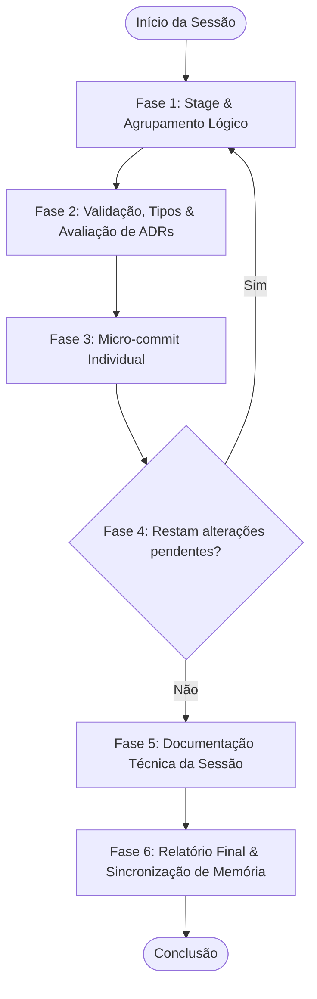
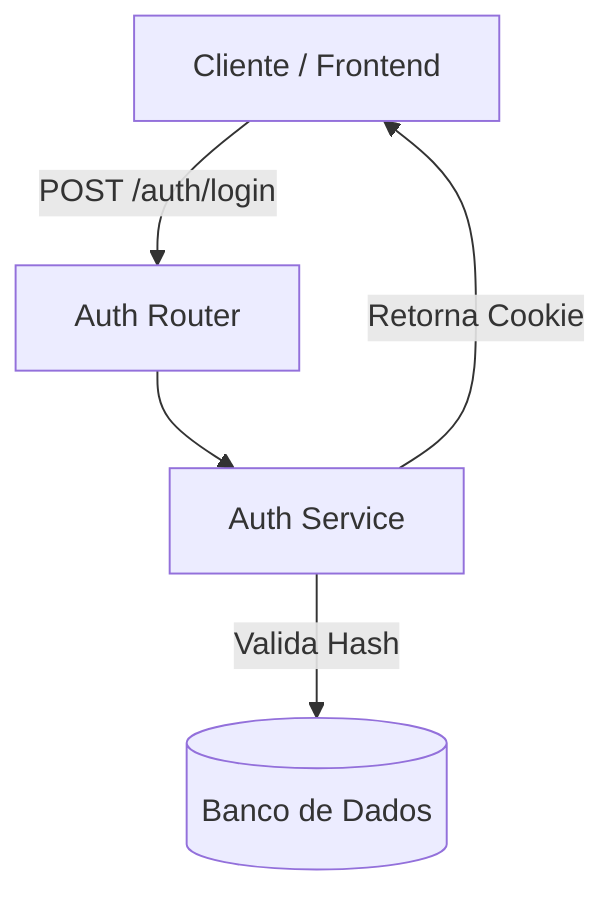

<!-- 
=================================================================================
LOG DE MANUTENÇÃO E ALTERAÇÕES DO DOCUMENTO
=================================================================================
Data       | Autor          | Descrição da Alteração
-----------|----------------|--------------------------------------------------
2026-08-06 | Matheus Diniz  | Criação do guia inicial cobrindo o fluxo de 6 fases
           |                | do /commit-e-documentar e Graphify.
2026-08-18 | Matheus Diniz  | Atualização e governança multi-repo e multi-agente.
           | (OpenClaude)   |
2026-08-31 | Matheus Diniz  | Integração da governança compulsória de ADRs (Architecture
           | (Antigravity)  | Decision Records) na Fase 2 conforme guia-padrao-criacao-adrs.md.
2026-08-31 | Matheus Diniz  | Generalização e desacoplamento arquitetural universal.
2026-09-09 | Eduardo Batista| v1.3.0 — Suprassumo autossuficiente dos fundamentais:
           |                | remoção de pastas voláteis e de convenções legadas; unificação
           |                | para arquitetura canônica Dual-Harness (.claude/, .gemini/,
           |                | .agents/); inclusão inline dos 6 Gatilhos de ADRs e
           |                | scripts de sincronização de memória prontos para uso.
=================================================================================
-->

# 📖 Guia Completo do Fluxo de Desenvolvimento, Commit, Documentação e Sincronização de Memórias

Este documento consolida o **suprassumo autossuficiente** da metodologia de engenharia de software e governança para desenvolvimento agêntico. Ele é desenhado para ser 100% independente e aplicável imediatamente por desenvolvedores e agentes de IA (Claude Code, OpenClaude e Gemini CLI / Antigravity), sem a necessidade de consultar múltiplos arquivos externos para operar o dia a dia.

---

## 📐 1. Estrutura Arquitetural do Projeto (Três Eixos Canônicos)

Todo repositório operado por agentes adota a arquitetura em três eixos, separando configurações específicas de cada assistente e compartilhando regras e artefatos globais:

```text
projeto-raiz/                            # Repositório Raiz (Governança, Código, Grafo e Memórias)
├── .claude/                             # Configurações do Claude Code / OpenClaude
│   ├── settings.json                    # Hooks de ciclo de vida (PreToolUse / PostToolUse)
│   ├── memory/                          # Memórias locais do Claude (team/ versionado, private local)
│   ├── skills/                          # Symlinks apontando para .agents/skills/
│   ├── agents/                          # Subagentes especializados (ex: migration-verifier)
│   └── sync-claude-memory.sh            # Script de sincronização de memória local <-> global
├── .gemini/                             # Configurações do Gemini CLI / Antigravity
│   ├── settings.json                    # Hooks (BeforeTool / AfterTool) e servidores MCP
│   ├── memory/                          # Memórias locais do Gemini (team/ versionado)
│   ├── skills/                          # Symlinks apontando para .agents/skills/
│   ├── agents/                          # Subagentes de auditoria do Gemini
│   └── sync-memory.sh                   # Script de sincronização de memória local <-> global
├── .agents/                             # Camada Compartilhada (Fonte Canônica de Skills e Rules)
│   ├── rules/                           # Regras globais always-on (core-skills.md)
│   ├── skills/                          # Single Source of Truth: TODAS as skills são criadas aqui
│   └── workflows/                       # Workflows operacionais (/plan, /test, /audit)
├── CLAUDE.md                            # Contexto passivo para Claude Code (inglês, foco em código)
├── GEMINI.md                            # Contexto passivo para Gemini CLI (pt-BR, foco em workflows)
├── backend/                             # API REST (FastAPI / Laravel / Node.js / Go)
│   ├── app/
│   │   ├── api/v1/endpoints/            # Rotas e controladores (auth, billing, logs)
│   │   ├── core/                        # Conexões de banco, segurança JWT, configurações
│   │   ├── crud/                        # Repositórios e persistência de dados
│   │   ├── models/                      # Entidades e modelos de banco
│   │   └── services/                    # Regras de negócio e orquestração
│   └── main.py                          # Ponto de entrada da API e middlewares
├── frontend/                            # Aplicação Web (Angular / React / Vue / Next.js)
│   └── src/app/
│       ├── components/                  # Componentes reutilizáveis (buttons, tables, modals)
│       ├── guard/                       # Guards de rota e autenticação
│       ├── interceptors/                # Interceptores HTTP (auth, logging, erros)
│       ├── models/                      # Interfaces e tipagens TypeScript
│       ├── pages/                       # Telas e fluxos de navegação
│       └── services/                    # Serviços HTTP e estado reativo
├── docs/                                # Documentação viva do ecossistema
│   ├── adr/                             # Architecture Decision Records (0001-slug.md)
│   ├── commits/                         # Relatórios consolidados por sessão de trabalho
│   ├── guides/                          # Guias de engenharia e padrões
│   ├── plans/                           # Planos de implementação cirúrgicos
│   └── specs/                           # Especificações técnicas e critérios de aceite
├── graphify-out/                        # Grafo de Conhecimento AST (graph.json, graph.html)
└── sync-repos.sh                        # Script de sincronização multi-repo via git subtree (opcional)
```

> 💡 **Regra de Ouro para Skills (Single Source of Truth)**:  
> Todas as skills são **compulsoriamente criadas em `.agents/skills/<nome-da-skill>/`** e consumidas pelos harnesses específicos (`.claude/skills/` e `.gemini/skills/`) através de links simbólicos (`ln -s ../../.agents/skills/<nome-da-skill> .claude/skills/<nome-da-skill>`). Nunca duplique arquivos de skills entre pastas.

---

## 🔄 2. O Ciclo Determinístico em 6 Fases (`/commit-e-documentar`)

O fluxo de commit e documentação é executado em um loop contínuo e determinístico. Nenhuma alteração de código deve ser consolidada sem agrupamento lógico, validação, checagem de ADRs e documentação.



---

### 🔹 Fase 1: Stage e Agrupamento Lógico por Afinidade

1. **Inspeção de Estado**: Obtenha o status completo e higienizado:
   ```bash
   git status --porcelain
   ```
2. **Agrupamento por Contexto Lógico**: Separe as alterações por componente funcional. Nunca misture escopos distintos no mesmo commit.
   - *Exemplo*: Arquivos de template HTML, componente TypeScript e seu model formam um único grupo de UI.
   - *Exemplo*: Migração de banco DDL, endpoint FastAPI e schemas Pydantic formam outro grupo no backend.
3. **Adição Seletiva**: Adicione ao staging area estritamente o grupo selecionado:
   ```bash
   git add caminho/do/arquivo1.ts caminho/do/arquivo2.html
   ```

---

### 🔹 Fase 2: Validação, Documentação & Avaliação de ADRs (Autossuficiente)

Antes de gerar o commit, execute o checklist triplo:

#### 1. Documentação Inline & Externa
- **Inline**: Funções, componentes e serviços novos devem possuir comentários explicativos em **pt-BR** (Docstrings/JSDoc) detalhando parâmetros, retornos e decisões técnicas.
- **Externa (`docs/`)**: Recursos estruturais devem atualizar os guias ou especificações correspondentes.

#### 2. Avaliação Compulsória dos 6 Gatilhos de ADR (Architecture Decision Records)
Avalie se o grupo de alterações ativa qualquer um dos **6 Gatilhos Arquiteturais Canônicos**:

| # | Gatilho Arquitetural | Critérios Práticos de Disparo |
| :---: | :--- | :--- |
| **1** | **Comunicação / Protocolos** | Criação ou alteração em Gateways, WebSockets, gRPC, APIs REST públicas, BFF, mensageria (Kafka/RabbitMQ) ou webhooks. |
| **2** | **Modelagem de Dados & Persistência** | Novas tabelas SQL, alterações de DDL, índices críticos, tabelas Append-Only, estratégias de particionamento ou migrações complexas. |
| **3** | **Segurança & Identidade** | Mecanismos de autenticação, RBAC/ABAC, cookies `httpOnly`, criptografia em repouso/trânsito, proteção anti-IDOR ou políticas CORS/CSP. |
| **4** | **Conformidade Regulatória & Privacidade** | Tratamento de dados sensíveis (LGPD/GDPR), conformidade fiscal, prazos de retenção/guarda de logs ou assinaturas eletrônicas. |
| **5** | **Resiliência & Engenharia Distribuída** | Implementação de Circuit Breakers, chaves de Idempotência, retentativas com Jitter exponencial, Dead Letter Queues (DLQs) ou cache distribuído. |
| **6** | **Adoção/Descontinuação de Tecnologias** | Adição ou remoção de frameworks, ORMs, drivers de banco, bibliotecas estruturais de estado ou infraestrutura base. |

**Se algum gatilho for disparado:**
Crie imediatamente a ADR em `docs/adr/[NUMERO_4_DIGITOS]-[slug-kebab-case].md` (ex: `docs/adr/0005-autenticacao-jwt-httponly.md`) contendo a estrutura essencial em 8 seções:
1. **Cabeçalho/Metadados**: Título, Data, Autor, Status (`Aceito`/`Proposto`), Versão.
2. **Contexto & Problema**: Descreva a motivação técnica e os riscos mapeados.
3. **Fundamentação & Normas**: Requisitos de negócio ou conformidades aplicáveis.
4. **Decisão de Arquitetura & Trade-offs**: O que foi decidido, alternativas descartadas e por quê.
5. **Matriz de Implementação Técnica (IN-CODE)**: Módulos, classes ou tabelas afetadas.
6. **Matriz de Governança Institucional (OFF-CODE)**: Ações operacionais, acessos ou infra.
7. **Prazos de Retenção & Políticas**: Tempo de guarda de dados e expiração (se aplicável).
8. **Consequências & Resultados**: Benefícios obtidos e compromissos assumidos.

Adicione a nova ADR ao stage:
```bash
git add docs/adr/0005-slug-da-decisao.md
```

#### 3. Checagem Estática de Tipos, Lint e Testes
- **Frontend**:
  ```bash
  cd frontend && npx tsc --noEmit
  ```
- **Backend**:
  ```bash
  cd backend && pytest -v
  ```
*Se houver qualquer falha ou quebra de tipos, interrompa o fluxo e corrija antes de commitar.*

---

### 🔹 Fase 3: Micro-commits Isolados (Conventional Commits)

Cada grupo validado deve ser commitado individualmente usando o padrão **Conventional Commits**:

- **Formato**: `<tipo>(<escopo>): <descrição curta em pt-BR>`
- **Tipos Permitidos**:
  - `feat`: Nova funcionalidade para o sistema ou usuário.
  - `fix`: Correção de bug.
  - `docs`: Modificações em documentação ou novas ADRs.
  - `style`: Formatação e ajustes visuais sem alteração lógica.
  - `refactor`: Refatoração interna que não altera comportamento externo.
  - `test`: Criação ou ajuste de testes automatizados.
  - `chore`: Tarefas de build, dependências ou manutenção de grafo/harness.

- **Comando Seguro com HEREDOC**:
  ```bash
  git commit -m "$(cat <<'EOF'
  feat(auth): implementar rotas de login com tokens jwt em cookies httponly

  Adiciona validacao de credenciais no endpoint /api/v1/auth/login, geracao de access token
  com expiracao configuravel e gravacao segura via cookie httpOnly com SameSite Strict.
  EOF
  )"
  ```

---

### 🔹 Fase 4: Repetição e Limpeza Completa

Repita as **Fases 1, 2 e 3** até que o comando abaixo retorne 100% limpo em todas as pastas do projeto:
```bash
git status --porcelain
```

---

### 🔹 Fase 5: Documentação Técnica da Sessão

Com os micro-commits concluídos, gere o relatório consolidado da sessão em `docs/commits/YYYY-MM-DD_<escopo-principal>.md`.

#### Modelo Completo de Relatório de Sessão:

````markdown
# Relatório de Sessão de Desenvolvimento: YYYY-MM-DD (<Escopo>)

## 1. Metadados da Sessão
- **Data**: YYYY-MM-DD
- **Escopo Principal**: `<escopo>`
- **Total de Commits**: X commit(s)
- **ADRs Vinculadas**: `docs/adr/0005-autenticacao-jwt-httponly.md` (ou "Nenhuma ADR exigida")

## 2. Visão Geral Executiva
Resumo em 2 a 4 frases das entregas e refatorações realizadas nesta sessão de trabalho.

## 3. Diagrama Arquitetural & Fluxo (Mermaid)


## 4. Mapa de Arquivos Modificados
| Arquivo | Tipo | Descrição da Alteração |
| :--- | :--- | :--- |
| `backend/app/api/v1/endpoints/auth.py` | Rota | Criação do endpoint de login e refresh |
| `backend/app/services/auth_service.py` | Serviço | Validação de credenciais e geração de JWT |

## 5. Detalhamento por Commit
- **`feat(auth): ...`**: Descrição detalhada do comportamento e testes.
- **`docs(adr): ...`**: Registro da decisão arquitetural tomada.

## 6. Status do Projeto
- **✅ O Que Está Funcionando**: Funcionalidades testadas e operacionais.
- **❌ O Que Está Pendente**: Débitos ou itens deixados para a próxima sessão.
- **⚠️ Dívida Técnica Identificada**: Oportunidades de refatoração futuras.
````

Após gerar o relatório, comite-o imediatamente:
```bash
git add docs/commits/YYYY-MM-DD_<escopo>.md
git commit -m "docs(commits): registra sessao de desenvolvimento de YYYY-MM-DD"
```

---

### 🔹 Fase 6: Relatório Final no Terminal

Exiba o resumo consolidado no terminal para ciência imediata do desenvolvedor:

```text
================================================================================
🚀 FLUXO DETERMINÍSTICO CONCLUÍDO COM SUCESSO
================================================================================
📦 Commits gerados:
- feat(auth): implementar rotas de login com tokens jwt em cookies httponly
- docs(adr): adiciona ADR 0005 sobre autenticacao jwt em cookies httponly
- docs(commits): registra sessao de desenvolvimento de YYYY-MM-DD

🏛️ Decisões Arquiteturais (ADRs):
- docs/adr/0005-autenticacao-jwt-httponly.md

📄 Documentação da Sessão:
- docs/commits/YYYY-MM-DD_auth.md

🔍 Dívidas técnicas encontradas: 0 item(ns)
📋 Próximos passos registrados: X item(ns)
================================================================================
```

---

## 🧭 3. Navegação por Grafo de Conhecimento (`graphify`)

Para garantir máxima economia de tokens e precisão cirúrgica de contexto, o ecossistema utiliza o **Graphify** (`graphify-out/`) em vez de varreduras manuais e lentas por texto.

### A Diretriz Mandatória: "Graphify Antes de Grep/Glob"
Antes de disparar buscas cegas de texto bruto (`Grep`) ou listas de arquivos (`Glob`), consulte o grafo relacional:

| Comando | Propósito | Exemplo |
| :--- | :--- | :--- |
| `graphify query "<pergunta>"` | Retorna o subgrafo relevante focado na pergunta. | `graphify query "como funciona o fluxo de login e tokens?"` |
| `graphify path "<A>" "<B>"` | Mapeia a cadeia de chamadas entre dois módulos/nós. | `graphify path "endpoints/auth.py" "services/auth_service.py"` |
| `graphify explain "<conceito>"` | Explica entidades e interações de uma funcionalidade. | `graphify explain "autenticacao jwt"` |

### Atualização do Grafo
Após criar ou modificar arquivos de código (`.py`, `.ts`, `.md`), atualize incrementalmente o grafo:
```bash
graphify update .
```

---

## 🧠 4. Sincronização e Governança de Memórias (Autossuficiente)

A memória persistente garante que convenções de projeto, lições aprendidas em incidentes e regras estritas nunca sejam esquecidas entre turnos ou sessões distintas.

---

### 4.1 Escopo Duplo de Memória: Privada vs. Equipe

1. **Memória Privada (`private`)**:
   - Preferências individuais, atalhos de terminal, comandos pessoais do desenvolvedor.
   - Localizada em `.claude/memory/` (não versionada, arquivos sem prefixo de equipe).
2. **Memória de Equipe (`team`)**:
   - Padrões arquiteturais, convenções de testes, regras de migrações e aprendizados críticos.
   - Localizada em `.claude/memory/team/` e `.gemini/memory/team/`.
   - **Compulsoriamente versionada no Git** para que todos os agentes e desenvolvedores compartilhem o conhecimento.

### 4.2 Formato Canônico de Arquivo de Memória

Todo arquivo de memória deve conter Frontmatter YAML e as 3 seções estruturadas:

```markdown
---
name: policy_convencao_exemplo
description: Descricao clara da regra para indexacao rapida
type: team
---

### Regra / Fato
Definição objetiva e inegociável da diretriz técnica.

### Motivo (Why)
Razão técnica, incidente histórico ou dependência que motivou a criação desta regra.

### Como Aplicar (How to apply)
Exemplo prático de código ou comando de validação.
```

---

### 4.3 Scripts Prontos de Sincronização de Memória

Para manter as memórias sincronizadas entre as pastas do repositório local e os diretórios globais dos assistentes (`~/.claude` ou `~/.openclaude` e `~/.gemini`), utilize os scripts abaixo:

#### 1. `.claude/sync-claude-memory.sh` (Claude Code / OpenClaude)

```bash
#!/bin/bash
PROJECT_ROOT=$(git rev-parse --show-toplevel)
SANITIZED_PATH=$(echo "$PROJECT_ROOT" | sed 's/[^a-zA-Z0-9]/-/g')

CONFIG_HOME="$HOME/.openclaude"
if [ ! -d "$CONFIG_HOME" ] && [ -d "$HOME/.claude" ]; then
  CONFIG_HOME="$HOME/.claude"
fi

GLOBAL_MEM_PATH="$CONFIG_HOME/projects/$SANITIZED_PATH/memory/"
LOCAL_MEM_PATH="$PROJECT_ROOT/.claude/memory/"

if [ "$1" == "pull" ]; then
  mkdir -p "$LOCAL_MEM_PATH"
  if [ -d "$GLOBAL_MEM_PATH" ]; then
    rsync -av --include="*/" --include="*.md" --exclude="*" "$GLOBAL_MEM_PATH" "$LOCAL_MEM_PATH"
    git add "$LOCAL_MEM_PATH"
  fi
elif [ "$1" == "push" ]; then
  mkdir -p "$GLOBAL_MEM_PATH"
  rsync -av --include="*/" --include="*.md" --exclude="*" "$LOCAL_MEM_PATH" "$GLOBAL_MEM_PATH"
else
  echo "Uso: ./.claude/sync-claude-memory.sh [pull|push]"
  exit 1
fi
```

#### 2. `.gemini/sync-memory.sh` (Gemini CLI / Antigravity)

```bash
#!/bin/bash
PROJECT_ROOT=$(git rev-parse --show-toplevel)
PROJECT_BASENAME=$(basename "$PROJECT_ROOT")

CONFIG_HOME="$HOME/.gemini"
GLOBAL_MEM_PATH="$CONFIG_HOME/tmp/$PROJECT_BASENAME/memory/"
LOCAL_MEM_PATH="$PROJECT_ROOT/.gemini/memory/"

if [ "$1" == "pull" ]; then
  mkdir -p "$LOCAL_MEM_PATH"
  if [ -d "$GLOBAL_MEM_PATH" ]; then
    rsync -av --include="*/" --include="*.md" --exclude="*" "$GLOBAL_MEM_PATH" "$LOCAL_MEM_PATH"
    git add "$LOCAL_MEM_PATH"
  fi
elif [ "$1" == "push" ]; then
  mkdir -p "$GLOBAL_MEM_PATH"
  rsync -av --include="*/" --include="*.md" --exclude="*" "$LOCAL_MEM_PATH" "$GLOBAL_MEM_PATH"
else
  echo "Uso: ./.gemini/sync-memory.sh [pull|push]"
  exit 1
fi
```

---

### 4.4 Automação via Git Pre-Commit Hook (Auto-Staging de Memórias)

Para que nenhuma memória criada durante a sessão do agente seja esquecida sem versionamento, configure o pre-commit hook em `.git/hooks/pre-commit`:

```bash
#!/bin/bash
# .git/hooks/pre-commit
# 1. Puxa as memórias mais recentes e faz git add automático
if [ -f "./.claude/sync-claude-memory.sh" ]; then
  ./.claude/sync-claude-memory.sh pull >/dev/null 2>&1 || true
fi

if [ -f "./.gemini/sync-memory.sh" ]; then
  ./.gemini/sync-memory.sh pull >/dev/null 2>&1 || true
fi

exit 0
```

Torne o script executável:
```bash
chmod +x .git/hooks/pre-commit
```

---

## 📋 5. Checklist Diário de Qualidade

Antes de concluir a sessão ou abrir um Pull Request, execute a validação final:

- [ ] Arquivos em `git status` 100% commitados via micro-commits organizados.
- [ ] Todos os micro-commits seguem o padrão `tipo(escopo): descrição`.
- [ ] Se houve impacto de protocolo, dados, segurança ou tecnologia, a ADR foi criada em `docs/adr/`.
- [ ] Checagens estáticas e testes automatizados executados com sucesso.
- [ ] Relatório consolidado gravado em `docs/commits/YYYY-MM-DD_<escopo>.md`.
- [ ] Grafo de Conhecimento atualizado via `graphify update .`.
- [ ] Memórias de equipe sincronizadas e estagiadas no commit.
