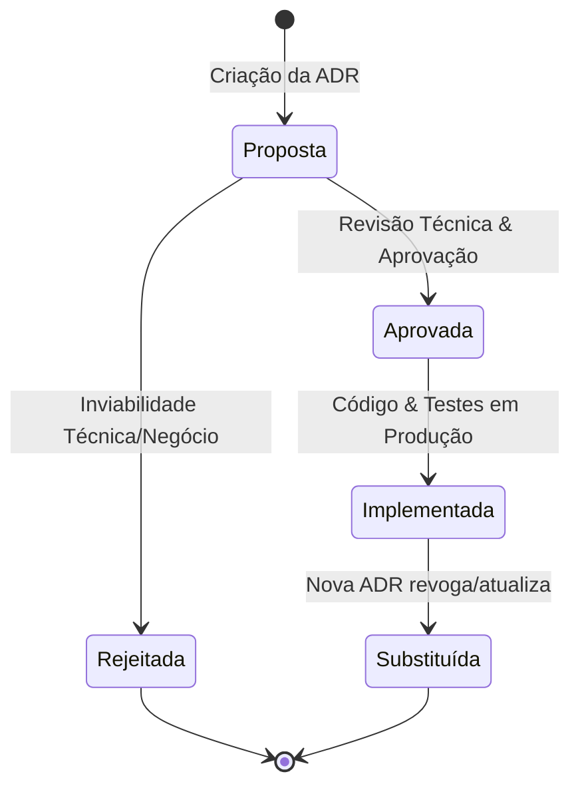

<!--
================================================================================
LOG DE MANUTENÇÃO DE DOCUMENTAÇÃO
--------------------------------------------------------------------------------
Data       | Autor          | Descrição
--------------------------------------------------------------------------------
2026-08-31 | Matheus Diniz  | Criação do Guia Canônico e Genérico de Criação de ADRs
           | (Antigravity)  | (Architecture Decision Records) em guides/essentials/,
           |                | padronizando a criação de decisões em docs/adr/.
2026-09-01 | Matheus Diniz  | v2.0.0 — Expansão abrangente de Governança Arquitetural:
           | (Antigravity)  | Gatilhos para IA, Agentes e LLMs; Matriz Comparativa
           |                | Formal de Trade-offs; Taxonomia de Tags e Metadados;
           |                | Protocolo Bidirecional de Superação (Superseding ADRs);
           |                | Scripts de Automação de Índice (README) e Validador de CI.
================================================================================
-->

# Guia Canônico e Genérico de Criação de ADRs (Architecture Decision Records)

| Metadado | Detalhe |
| :--- | :--- |
| **Versão** | 2.0.0 (SemVer) |
| **Status** | **Ativo / Normativo** |
| **Escopo** | Governança Arquitetural, Engenharia de Software, IA e Compliance |
| **Diretório Canônico de ADRs** | `docs/adr/` |
| **Formato Obrigatório** | `docs/adr/[NUMERO_4_DIGITOS]-[slug-em-kebab-case].md` |

---

> **Manifesto de Governança Arquitetural:**  
> _"Código-fonte explica o COMO; a arquitetura e as ADRs explicam o PORQUÊ. Decisões não documentadas tornam-se dívida técnica invisível, gerando custos de refatoração, vulnerabilidades de segurança e riscos de não-conformidade jurídica. Uma ADR bem estruturada é o contrato definitivo entre a engenharia, a segurança, a inteligência artificial e os objetivos estratégicos da organização."_

---

## Sumário Executivo

1. [Visão Geral e Propósito](#1-visão-geral-e-propósito)
2. [Quando Criar uma ADR (Gatilhos Arquiteturais e de IA)](#2-quando-criar-uma-adr-gatilhos-arquiteturais-e-de-ia)
3. [Localização e Convenções de Nomenclatura](#3-localização-e-convenções-de-nomenclatura)
4. [Ciclo de Vida, Estados e Protocolo de Superação](#4-ciclo-de-vida-estados-e-protocolo-de-superação)
5. [Anatomia Canônica em 8 Seções (Passo a Passo)](#5-anatomia-canônica-em-8-seções-passo-a-passo)
   - [5.1 Cabeçalho HTML, Metadados e Taxonomia](#51-cabeçalho-html-metadados-e-taxonomia)
   - [5.2 Contexto e Riscos Mapeados](#52-contexto-e-riscos-mapeados)
   - [5.3 Seção 1: Fundamentação Jurídica & Fontes Normativas](#53-seção-1-fundamentação-jurídica--fontes-normativas-diretas-se-aplicável)
   - [5.4 Seção 2: Decisão de Arquitetura, Trade-offs & Diagramas](#54-seção-2-decisão-de-arquitetura-trade-offs--diagramas)
   - [5.5 Seção 3: Matriz de Implementação Técnica (IN-CODE)](#55-seção-3-matriz-de-implementação-técnica-in-code)
   - [5.6 Seção 4: Matriz de Governança & Ações Institucionais (OFF-CODE)](#56-seção-4-matriz-de-governança--ações-institucionais-off-code-se-aplicável)
   - [5.7 Seção 5: Prazos Legais de Guarda e Políticas de Retenção](#57-seção-5-prazos-legais-de-guarda-e-políticas-de-retenção-se-aplicável)
   - [5.8 Seção 6: Matriz de Conformidade e Mitigação de Riscos](#58-seção-6-matriz-de-conformidade-e-mitigação-de-riscos)
   - [5.9 Seção 7: Consequências e Resultados](#59-seção-7-consequências-e-resultados)
6. [Regras de Ouro e Anti-Padrões](#6-regras-de-ouro-e-anti-padrões)
7. [Automação, Indexação e Validação em CI/CD](#7-automação-indexação-e-validação-em-cicd)
8. [Checklist de Homologação (Definition of Done)](#8-checklist-de-homologação-definition-of-done)
9. [Template Canônico "Copiar e Colar" (Markdown Raw)](#9-template-canônico-copiar-e-colar-markdown-raw)

---

## 1. Visão Geral e Propósito

Um **Architecture Decision Record (ADR)** é um documento curto, formal e estruturado que captura uma decisão arquitetural relevante tomada pela equipe de engenharia, acompanhada de seu contexto, justificativas, matriz de trade-offs, diagramas, impactos de implementação em código (_IN-CODE_), obrigações institucionais complementares (_OFF-CODE_) e consequências assumidas.

Este guia define o padrão metodológico obrigatório para a criação, revisão, evolução e manutenção de todas as ADRs do ecossistema de software.

---

## 2. Quando Criar uma ADR (Gatilhos Arquiteturais e de IA)

Uma ADR **DEVE** ser redigida sempre que uma mudança de arquitetura ou engenharia envolver um ou mais dos seguintes gatilhos:

- **Mudança Estrutural de Comunicação ou Protocolos**: Introdução ou alteração de gateways, mensageria assíncrona, WebSockets, gRPC, padrões REST ou BFF.
- **Modelagem de Dados e Persistência**: Criação ou refatoração profunda de tabelas no banco de dados, migração de esquemas DDL, introdução de estratégias _Append-Only_ ou particionamento de dados.
- **Segurança, Autenticação e Identidade (_Zero-Trust_)**: Políticas de autenticação corporativa, transporte seguro de credenciais, gestão de sessões, criptografia simétrica/assimétrica, controle de acesso baseado em funções (RBAC) ou prevenção a vulnerabilidades (IDOR, Tampering, Injeção).
- **Inteligência Artificial, Modelos LLM e Agentes Autônomos**:
  - Adoção ou troca de provedores de modelos fundacionais (OpenAI, Anthropic, Gemini, modelos locais via Ollama/vLLM).
  - Arquiteturas RAG (_Retrieval-Augmented Generation_), bancos vetoriais (pgvector, Qdrant, Pinecone) e estratégias de *Chunking/Embeddings*.
  - Concessão de permissões executáveis a ferramentas de agentes (_Tool Calling / Function Calling_) e isolamento em sandboxes.
  - Políticas de anonimização e *Context Scrubbing* de dados sensíveis antes do envio a provedores externos de IA.
- **Conformidade Regulatória e Privacidade**: Adequação a normas legais (Leis de Proteção de Dados como LGPD/GDPR, normas trabalhistas, regulamentos fiscais, assinaturas eletrônicas ou auditoria probatória).
- **Resiliência e Engenharia Distribuída**: Implementação de _Circuit Breakers_, controle de concorrência com _Idempotency Keys_, políticas de retentativa com _Jitter_, filas de mensagens mortas (_Dead Letter Queues - DLQ_) ou retenção em _Storage Object Lock_.
- **Adoção ou Descontinuação de Tecnologias**: Escolha de novas bibliotecas de infraestrutura, transição de paradigmas de gerenciamento de estado ou substituição de componentes estruturais.

> **Regra Prática**: Decisões cosméticas ou pontuais de implementação (como renomear uma variável ou refatorar uma função interna simples) **NÃO** exigem ADR. Decisões que impõem regras a outros desenvolvedores, introduzem novas dependências estruturais ou impactam a estabilidade e conformidade do sistema **SEMPRE** exigem ADR.

---

## 3. Localização e Convenções de Nomenclatura

Todas as ADRs do projeto residem obrigatoriamente no diretório centralizado `docs/adr/`.

```text
docs/
|-- guides/
|   `-- guia-padrao-criacao-adrs.md      # Este Guia Metodológico
`-- adr/                                 # Repositório Canônico de ADRs
    |-- README.md                        # Índice automatizado de decisões
    |-- 0001-escolha-padrao-api-gateway.md
    |-- 0002-arquitetura-autenticacao-jwt-httponly.md
    |-- 0003-modelagem-banco-dados-append-only.md
    |-- 0004-pipeline-rag-pgvector-embeddings.md
    `-- 0042-conformidade-assinatura-eletronica-documentos.md
```

### Regras Estritas de Nomenclatura

- **Prefixo Numérico Sequencial**: 4 dígitos preenchidos com zeros à esquerda (`0001`, `0002`, ..., `0042`).
- **Slug Semântico**: Expressão em português no padrão _kebab-case_, sem acentuação, sem letras maiúsculas e sem caracteres especiais.
- **Extensão**: `.md` (Markdown puro).

---

## 4. Ciclo de Vida, Estados e Protocolo de Superação

Toda ADR segue um fluxo formal de estados, garantindo transparência sobre quais decisões estão em vigor, quais estão sob avaliação e quais foram descontinuadas:



### Definição dos Estados

- **`Proposta`**: O documento foi redigido e encontra-se em fase de análise, discussão e validação pela equipe de engenharia e lideranças técnicas.
- **`Aprovada`**: A decisão foi formalmente aceita e validada. A equipe de desenvolvimento está autorizada a implementar o plano técnico.
- **`Implementada`**: Todas as alterações de código (_IN-CODE_), DDLs de banco de dados e testes associados foram integrados e validados em ambiente de produção.
- **`Substituída por ADR-XXXX`**: Uma decisão arquitetural posterior (explicitamente referenciada pelo número da nova ADR) anula, moderniza ou revoga a decisão original.
- **`Rejeitada`**: A proposta foi avaliada e descartada. O documento é mantido no repositório com as justificativas da rejeição para preservar o histórico e evitar discussões repetidas no futuro.

### Protocolo de Superação Bidirecional (Superseding ADRs)

Quando uma nova ADR (ex: `ADR-0045`) substitui uma ADR anterior (ex: `ADR-0012`):

1. **Na ADR Antiga (`ADR-0012`):**
   - Altere o status para: `**Substituída por [ADR-0045: ...]** (YYYY-MM-DD)`.
   - Insira um banner de aviso no topo:
     ```markdown
     > [!WARNING]
     > **ESTA DECISÃO FOI SUBSTITUÍDA:** Esta ADR foi revogada e superada pela `ADR-0045: Nova Arquitetura` (0045-nova-arquitetura.md).
     ```

2. **Na ADR Nova (`ADR-0045`):**
   - Declare nos metadados: `**Substitui:** ADR-0012: Arquitetura Anterior (0012-arquitetura-anterior.md)`.
   - Explique no Contexto o motivo pelo qual a decisão anterior se tornou obsoleta.

---

## 5. Anatomia Canônica em 8 Seções (Passo a Passo)

Uma ADR corporativa de alta maturidade deve ser autoexplicativa, precisa e exaustiva. Abaixo detalha-se o conteúdo exigido em cada seção.

### 5.1 Cabeçalho HTML, Metadados e Taxonomia

Toda ADR deve iniciar obrigatoriamente com o comentário HTML de log de manutenção:

```html
<!--
================================================================================
LOG DE MANUTENÇÃO DE DOCUMENTAÇÃO
--------------------------------------------------------------------------------
Data       | Autor          | Descrição
--------------------------------------------------------------------------------
YYYY-MM-DD | Nome do Autor  | Criação da ADR XXXX detalhando [tema principal].
================================================================================
-->
```

Em seguida, declarar o título principal, a tabela estruturada de metadados e a linha de status com a data de transição:

````markdown
# ADR 0042: Arquitetura de Assinatura Eletrônica e Não-Repúdio Probatório

| Metadado | Detalhe |
| :--- | :--- |
| **Status** | **Aprovada** (2026-08-31) |
| **Decisores** | Matheus Diniz, Tech Lead, SecOps, DPO |
| **Tags** | `[security]`, `[compliance]`, `[zero-trust]`, `[database]` |
| **Impacto Sistêmico** | Alto (Core Backend + Storage Imutável) |
| **ADRs Relacionadas** | Supersedes `ADR-0015` (0015-autenticacao-legada.md); Extends `ADR-0002` (0002-arquitetura-jwt.md) |
````

---

### 5.2 Contexto e Riscos Mapeados

Esta seção introduz a motivação da decisão. Deve responder:

- Qual é o problema enfrentado ou a necessidade do sistema?
- Quem são os atores e processos impactados?
- Quais são os riscos e impactos caso nada seja feito?

Exemplo de estrutura:

````markdown
## Contexto
O sistema necessita prover um mecanismo seguro de formalização documental entre colaboradores e a organização, garantindo a integridade dos artefatos digitais e a validade jurídica perante auditorias externas.

### Riscos Identificados e Problemas a Resolver:
1. **Vulnerabilidade de Adulteração**: Risco de alteração não autorizada de documentos após a assinatura.
2. **Fragilidade Probatória**: Ausência de metadados periciais (endereço IP, carimbo de tempo autoritativo, hash criptográfico), comprometendo a defesa em litígios.
3. **Inconformidade Regulatória**: Risco de penalidades por não atender aos requisitos de validade das assinaturas eletrônicas avançadas.
````

---

### 5.3 Seção 1: Fundamentação Jurídica & Fontes Normativas Diretas (Se aplicável)

Quando a decisão possuir impacto regulatório, trabalhista, fiscal ou de privacidade, deve-se incluir uma tabela com a fundamentação legal estrita:

````markdown
## 1. Fundamentação Jurídica & Fontes Normativas Diretas

| Diploma Legal / Normativo | Artigos / Dispositivos Principais | Aplicação Prática no Sistema |
| :--- | :--- | :--- |
| **Lei de Assinaturas Eletrônicas** | Art. 4º, Inciso II (Assinatura Avançada) | Exige associação unívoca ao signatário e integridade dos dados assinados. |
| **Lei Geral de Proteção de Dados** | Art. 6º (Princípios de Segurança e Prevenção) | Obriga a adoção de medidas técnicas eficazes para proteção de dados sensíveis. |
| **Marco Civil da Internet** | Art. 15 (Guarda de Registros de Acesso) | Guarda obrigatória de registros de conexão e autenticação com carimbo de tempo. |
````

---

### 5.4 Seção 2: Decisão de Arquitetura, Trade-offs & Diagramas

Nesta seção declara-se objetivamente a solução adotada, comparando-a com alternativas que foram consideradas e descartadas, acompanhada de **Matriz Formal de Trade-offs** e diagramas de arquitetura e fronteiras de confiança (_Trust Boundaries_).

````markdown
## 2. Decisão de Arquitetura

Optou-se pela implementação de um pipeline de assinatura eletrônica assíncrono em três camadas:
1. **Camada de Apresentação**: Coleta de manifestação de vontade, cálculo local de verificação e visualização de documento.
2. **Camada de Aplicação / API**: Geração de hash SHA-256 do documento original, captura de metadados de sessão via token seguro no servidor e orquestração de carimbo de tempo NTP autoritativo.
3. **Camada de Persistência**: Armazenamento imutável (_Append-Only_) no banco de dados relacional e custódia do arquivo em storage com bloqueio de exclusão (_Object Lock_).

### Matriz de Avaliação de Alternativas (Trade-off Matrix)

| Critério de Avaliação | Opção A: Assinatura Externa SaaS | Opção B: Assinatura Nativa em Hardware (Eleita) | Opção C: Certificado A1 Compartilhado |
| :--- | :--- | :--- | :--- |
| **Custo Recorrente** | Alto (Cobrança por assinatura) | Baixo (Custo zero por transação) | Médio |
| **Latência de Resposta** | Alta (Chamada externa síncrona) | Baixa (< 50ms local) | Média |
| **Segurança & Não-Repúdio** | Média (Chaves em nuvem terceira) | Máxima (Chave privada em Secure Enclave) | Baixa (Risco de extração da chave) |
| **Conformidade Regulatória** | Alta | Total (Atende ISO 27001 e MP 2.200-2) | Parcial |
| **Complexidade de Engenharia** | Baixa (Plug-and-play) | Média (Pipeline de criptografia + PyMuPDF) | Baixa |

```text
+------------------+         +------------------+         +----------------------+
|  Client / Front  | ------> |  API / Backend   | ------> |  Banco de Dados SQL  |
|  (Interação UX)  |         | (Orquestração)   |         | (Append-Only Audit)  |
+------------------+         +------------------+         +----------------------+
                                      |
                                      v
                             +------------------+
                             | Storage Imutável |
                             |  (Object Lock)   |
                             +------------------+
```
````

---

### 5.5 Seção 3: Matriz de Implementação Técnica (IN-CODE)

Detalhamento prescritivo de como a decisão deve ser implementada no código-fonte, dividida por camadas de responsabilidade:

````markdown
## 3. Matriz de Implementação Técnica (_IN-CODE_)

### 3.1 Camada de Backend / API Gateway
- **Contratos de Dados e Validação**: Definição de schemas rígidos que rejeitam payloads malformados ou dados não sanitizados.
- **Resolução de Identidade Server-Side**: Identificação unívoca do usuário autenticado exclusivamente via token de sessão validado no servidor, prevenindo ataques de enumeração ou manipulação de parâmetros (Anti-IDOR).
- **Trilha de Auditoria Transacional**: Gravação atômica de logs estruturados contendo metadados de rede, identificador de sessão e carimbo de tempo UTC.

### 3.2 Camada de Frontend / Client
- **Gerenciamento de Estado Reativo**: Controle visual de transições de estado, bloqueando submissões duplicadas na interface.
- **Proteção Criptográfica Local**: Criptografia de dados sensíveis transitórios no cliente via APIs criptográficas nativas da plataforma.
- **Acessibilidade e Usabilidade**: Conformidade de contraste, suporte a navegação por teclado e feedback visual claro para o usuário.

### 3.3 Camada de Persistência e Banco de Dados (ANSI SQL)
Modelagem física executável demonstrando integridade referencial, constraints e padrão _Append-Only_:

```sql
-- Tabela principal de auditoria de assinaturas (Imutável / Append-Only)
CREATE TABLE DocumentoAssinatura (
    idDocumentoAssinatura BIGINT IDENTITY(1,1) NOT NULL,
    idDocumento VARCHAR(64) NOT NULL,
    idUsuario VARCHAR(64) NOT NULL,
    hashDocumentoOriginal CHAR(64) NOT NULL, -- SHA-256
    hashAssinaturaFinal CHAR(128) NOT NULL,  -- SHA-512 com metadados
    enderecoIp VARCHAR(45) NOT NULL,
    dataHoraRegistro DATETIME2(7) NOT NULL,
    CONSTRAINT PK_DocumentoAssinatura PRIMARY KEY (idDocumentoAssinatura),
    CONSTRAINT CK_Hash_Valido CHECK (LEN(hashDocumentoOriginal) = 64)
);

CREATE NONCLUSTERED INDEX IX_DocAssinatura_Doc_User 
ON DocumentoAssinatura (idDocumento, idUsuario);
```
````

---

### 5.6 Seção 4: Matriz de Governança & Ações Institucionais (OFF-CODE) (Se aplicável)

A arquitetura de software corporativa frequentemente exige ações que extrapolam o código-fonte. Esta seção mapeia responsabilidades para os setores institucional, jurídico, de segurança e de operações:

````markdown
## 4. Matriz de Ações de Governança & Jurídicas (_OFF-CODE_)

| Ref | Ação Institucional Mandatória | Área Responsável | Base Legal / Normativa | Entregável / Evidência |
| :--- | :--- | :--- | :--- | :--- |
| **OFF-01** | Homologação do Termo de Adesão ao Peticionamento Eletrônico | Jurídico / RH | Código Civil, Art. 107 | Minuta assinada e arquivada nos dossiês dos colaboradores. |
| **OFF-02** | Configuração de Políticas de Bloqueio WORM no Storage | TI / Infraestrutura | Padrão ISO 27001 | Bucket de armazenamento com política _Object Lock_ ativada. |
| **OFF-03** | Registro de Operações no Relatório de Impacto (RIPD) | Segurança / DPO | LGPD, Art. 38 | Documento de RIPD aprovado pelo Comitê de Privacidade. |
````

---

### 5.7 Seção 5: Prazos Legais de Guarda e Políticas de Retenção (Se aplicável)

Mapeamento dos prazos prescricionais de custódia dos dados e ciclos de vida em banco e storage:

````markdown
## 5. Prazos Legais de Guarda e Políticas de Retenção

| Categoria Documental / Dado | Prazo de Guarda | Fundamento Legal | Política no Storage / Banco |
| :--- | :--- | :--- | :--- |
| **Recibos e Assinaturas Trabalhistas** | 5 anos pós-rescisão | CLT / Constituição Federal | Armazenamento ativo em banco; transição para Cold Storage após 2 anos. |
| **Registros de Auditoria e Logs de Acesso** | 6 meses | Marco Civil da Internet | Expiração automática e expurgo seguro após término do prazo legal. |
| **Termos de Consentimento e Acordos** | 20 anos | Código Civil (Prescrição) | _Object Lock_ definitivo sem permissão de deleção antecipada. |
````

---

### 5.8 Seção 6: Matriz de Conformidade e Mitigação de Riscos

Cruzamento explícito entre os riscos identificados no Contexto e as contramedidas adotadas:

````markdown
## 6. Matriz de Conformidade e Mitigação de Riscos

| Risco Mapeado | Impacto Potencial | Mitigação Arquitetural e Técnica Adotada |
| :--- | :--- | :--- |
| **Adulteração de Documento** | Alto (Invalidação probatória) | Armazenamento de hash criptográfico SHA-256 e validação a cada leitura. |
| **Enumeração de Recursos (IDOR)** | Alto (Vazamento de dados) | Resolução de identidade estritamente no backend via token de sessão autenticado. |
| **Exclusão Acidental por Administrador** | Médio (Perda de integridade) | Estrutura de banco _Append-Only_ com bloqueio de comandos `UPDATE` e `DELETE`. |
````

---

### 5.9 Seção 7: Consequências e Resultados

Balanço transparente entre benefícios alcançados e compromissos aceitos:

````markdown
## 7. Consequências e Resultados

### Positivas
- **Blindagem Probatória**: Rastreabilidade completa de todas as operações com hashes criptográficos e carimbo de tempo.
- **Segurança Reforçada**: Eliminação de pontos únicos de falha de segurança através de validação estrita em camadas (_Zero-Trust_).
- **Conformidade Regulatória**: Pleno alinhamento com as legislações vigentes e auditorias de governança.

### Mitigações e Desafios Gerenciados
- **Overhead de Processamento Criptográfico**: Cálculo de hashes em arquivos volumosos absorvido via processamento assíncrono.
- **Crescimento do Volume de Dados**: Estrutura _Append-Only_ exige monitoramento contínuo de volumetria e políticas programadas de arquivamento.
````

---

## 6. Regras de Ouro e Anti-Padrões

Ao redigir ou revisar uma ADR, certifique-se de seguir as regras abaixo:

### Regras de Ouro (O que SEMPRE fazer)

1. **Redigir em Português do Brasil (pt-BR)**: Toda a documentação e justificativas devem ser escritas em pt-BR claro e técnico.
2. **Preservar Termos Técnicos em Inglês**: Manter expressões consagradas da computação (_Backend_, _Frontend_, _Zero-Trust_, _Circuit Breaker_, _Append-Only_, _Object Lock_, _RAG_, _Prompt Injection_).
3. **Ser Autoexplicativo**: A ADR deve ser compreensível para novos integrantes da equipe sem necessidade de explicações verbais externas.
4. **Separar IN-CODE de OFF-CODE**: Sempre que uma decisão envolver conformidade ou operações institucionais, separar rigorosamente o que é código do que é governança.
5. **Incluir Modelagem DDL Real**: Não utilizar pseudocódigo genérico para persistência; fornecer DDLs ANSI SQL válidos com tipagens e constraints.
6. **Avaliar Riscos de IA e Privacidade**: Em ADRs envolvendo agentes ou LLMs, explicitar salvaguardas de mascaramento de PII e validação de saídas.

### Anti-Padrões (O que NUNCA fazer)

- ❌ **Documentar Decisões Efêmeras**: Não crie ADRs para escolhas triviais (ex: "Mudança de cor de botão", "Uso de linter local").
- ❌ **Omitir Riscos e Trade-offs**: Nenhuma decisão arquitetural possui apenas vantagens. Se não há consequências negativas ou mitigações descritas, a análise está incompleta.
- ❌ **Escrever ADRs Retroativas sem Contexto**: Criar uma ADR após o fato apenas como formalidade, sem detalhar as motivações reais que levaram à escolha.
- ❌ **Acoplar Decisões a Marcas ou Nomes Temporários**: Foque nos conceitos arquiteturais e responsabilidades de camada, garantindo a portabilidade da documentação.

---

## 7. Automação, Indexação e Validação em CI/CD

Para manter o repositório de ADRs organizado e consistente em escala, utilizam-se dois scripts utilitários de automação em Python:

### 7.1 Script de Geração Automática do Índice (`docs/adr/README.md`)

```python
# Script para gerar automaticamente o README.md consolidando todas as ADRs
import os
import re

ADR_DIR = "docs/adr"
README_PATH = os.path.join(ADR_DIR, "README.md")

def gerar_indice_adrs():
    arquivos = sorted([f for f in os.listdir(ADR_DIR) if re.match(r"^\d{4}-.*\.md$", f)])
    
    linhas = [
        "# 📚 Repositório de Architecture Decision Records (ADRs)",
        "",
        "> Índice gerado automaticamente com o status consolidado das decisões arquiteturais.",
        "",
        "| ADR | Título | Status | Data |",
        "| :---: | :--- | :---: | :---: |"
    ]

    for arq in arquivos:
        caminho = os.path.join(ADR_DIR, arq)
        with open(caminho, "r", encoding="utf-8") as f:
            conteudo = f.read()

        num = arq.split("-")[0]
        titulo_match = re.search(r"^# ADR \d{4}:\s*(.+)$", conteudo, re.MULTILINE)
        status_match = re.search(r"\*\*Status\*\*\s*\|\s*\*\*([^*]+)\*\*\s*\(([^)]+)\)", conteudo)
        
        titulo = titulo_match.group(1) if titulo_match else arq
        status = status_match.group(1) if status_match else "Desconhecido"
        data = status_match.group(2) if status_match else "-"

        linhas.append(f"| [{num}]({arq}) | **{titulo}** | `{status}` | {data} |")

    with open(README_PATH, "w", encoding="utf-8") as f:
        f.write("\n".join(linhas) + "\n")
    print("Índice docs/adr/README.md atualizado com sucesso!")
```

### 7.2 Validador de Conformidade em CI/CD (Linter de ADRs)

```python
# Validador de CI para garantir integridade e formato das ADRs
import os
import re
import sys

def validar_adrs():
    erros = []
    adrs = [f for f in os.listdir("docs/adr") if f.endswith(".md") and f != "README.md"]

    for adr in adrs:
        if not re.match(r"^\d{4}-[a-z0-9-]+\.md$", adr):
            erros.append(f"Nome inválido: {adr} (deve seguir 0000-kebab-case.md)")
            
        with open(os.path.join("docs/adr", adr), "r", encoding="utf-8") as f:
            texto = f.read()

        if "LOG DE MANUTENÇÃO" not in texto:
            erros.append(f"{adr}: Cabeçalho HTML de log de manutenção ausente.")
        if not re.search(r"^# ADR \d{4}:", texto, re.MULTILINE):
            erros.append(f"{adr}: Título principal não segue o padrão '# ADR 0000:'.")
        if "## 2. Decisão de Arquitetura" not in texto:
            erros.append(f"{adr}: Seção '## 2. Decisão de Arquitetura' ausente.")

    if erros:
        print("\n".join(erros))
        sys.exit(1)
    print("Todas as ADRs estão em conformidade!")
```

### 7.3 Recuperação Forense em Repositórios Existentes (Débito de ADRs)

Quando um repositório já possui um histórico no Git mas carece de governança formal (débito de documentação arquitetural), utilize a skill oficial **`/forensic-adr-recovery`** ([`skills/software-engineering/forensic-adr-recovery/`](../../skills/software-engineering/forensic-adr-recovery/README.md)).

Ela executa arqueologia de software automatizada no histórico do Git:
1. Minera commits, merges, tags e pontos de inflexão estrutural.
2. Reconstrói retroativamente as ADRs seguindo o template canônico deste guia.
3. Disponibiliza scripts autônomos prontos para indexação (`generate_adr_index.py`) e validação em pipelines de CI (`validate_adrs.py`).

---

## 8. Checklist de Homologação (Definition of Done)

Antes de alterar o status de uma ADR para **`Aprovada`**, a equipe de arquitetura deve validar:

- [ ] O arquivo está localizado em `docs/adr/[NUMERO_4_DIGITOS]-[slug-em-kebab-case].md`?
- [ ] O comentário HTML de log de manutenção está preenchido no topo com data, autor e descrição?
- [ ] A tabela de metadados contém **Status**, **Decisores**, **Tags**, **Impacto** e **ADRs Relacionadas**?
- [ ] O Contexto apresenta uma lista clara de riscos e problemas a serem resolvidos?
- [ ] A Seção 2 inclui a **Matriz de Avaliação de Alternativas (Trade-offs)** e diagrama de arquitetura?
- [ ] A Matriz Técnica (_IN-CODE_) especifica Backend, Frontend e Banco de Dados com DDL executável?
- [ ] Decisões envolvendo IA/LLMs especificam salvaguardas contra Prompt Injection e vazamento de PII?
- [ ] A Matriz Institucional (_OFF-CODE_) define áreas responsáveis e entregáveis (se aplicável)?
- [ ] As Consequências detalham tanto os ganhos positivos quanto as mitigações/trade-offs aceitos?
- [ ] Se esta ADR substitui outra anterior, o banner de superação foi inserido na ADR legada?
- [ ] O texto está 100% em pt-BR sem quebras de formatação Markdown?

---

## 9. Template Canônico "Copiar e Colar" (Markdown Raw)

Utilize o bloco abaixo como ponto de partida para a criação de qualquer nova ADR em `docs/adr/`:

````markdown
<!--
================================================================================
LOG DE MANUTENÇÃO DE DOCUMENTAÇÃO
--------------------------------------------------------------------------------
Data       | Autor          | Descrição
--------------------------------------------------------------------------------
YYYY-MM-DD | Nome do Autor  | Criação da ADR XXXX detalhando [assunto principal].
================================================================================
-->

# ADR [NUMERO_4_DIGITOS]: [Título Declarativo e Abrangente da Decisão]

| Metadado | Detalhe |
| :--- | :--- |
| **Status** | **[Proposta | Aprovada | Implementada | Substituída por ADR-XXXX | Rejeitada]** (YYYY-MM-DD) |
| **Decisores** | [Nome do Autor, Tech Lead, SecOps, Arquitetura] |
| **Tags** | `[ex: security]`, `[database]`, `[api-gateway]`, `[ai-agents]` |
| **Impacto Sistêmico** | [Alto / Médio / Baixo] ([Módulos/Serviços Impactados]) |
| **ADRs Relacionadas** | [Ex: Supersedes ADR-XXXX; Extends ADR-YYYY / N/A] |

## Contexto
[Descrição detalhada do cenário técnico e de negócio, atores impactados, estado atual do sistema e necessidades a serem atendidas.]

### Riscos Identificados e Problemas a Resolver:
1. **[Risco 1 / Problema 1]**: [Detalhamento do impacto operacional, técnico, de segurança ou de conformidade].
2. **[Risco 2 / Problema 2]**: [Detalhamento do impacto].
3. **[Risco 3 / Problema 3]**: [Detalhamento do impacto].

---

## 1. Fundamentação Jurídica & Fontes Normativas Diretas (Se aplicável)

| Diploma Legal / Normativo | Artigos / Dispositivos Principais | Aplicação Prática no Sistema |
| :--- | :--- | :--- |
| **[Norma / Legislação 1]** | [Artigos / Cláusulas aplicáveis] | [Impacto e comportamento exigido no sistema] |
| **[Norma / Legislação 2]** | [Artigos / Cláusulas aplicáveis] | [Impacto e comportamento exigido no sistema] |

---

## 2. Decisão de Arquitetura

[Explicação detalhada da solução eleita, premissas de engenharia e justificativa comparativa frente a outras alternativas descartadas.]

### Matriz de Avaliação de Alternativas (Trade-off Matrix)

| Critério de Avaliação | Opção A: [Solução A] | Opção B: [Solução B (Eleita)] | Opção C: [Solução C] |
| :--- | :--- | :--- | :--- |
| **Custo / Esforço** | [Alto / Médio / Baixo] | [Alto / Médio / Baixo] | [Alto / Médio / Baixo] |
| **Latência / Performance** | [Alto / Médio / Baixo] | [Alto / Médio / Baixo] | [Alto / Médio / Baixo] |
| **Segurança & Privacidade** | [Alto / Médio / Baixo] | [Alto / Médio / Baixo] | [Alto / Médio / Baixo] |
| **Complexidade Operacional** | [Alto / Médio / Baixo] | [Alto / Médio / Baixo] | [Alto / Médio / Baixo] |
| **Curva de Aprendizado** | [Rápida / Moderada / Longa] | [Rápida / Moderada / Longa] | [Rápida / Moderada / Longa] |

```text
[Diagrama de Arquitetura em ASCII Art ou Mermaid modelando o fluxo e fronteiras de confiança]
```

---

## 3. Matriz de Implementação Técnica (*IN-CODE*)

### 3.1 Camada de Backend / API Gateway
- **[Componente / Módulo 1]**: [Especificação de endpoints, contratos de validação, regras de negócio e middleware].
- **[Componente / Módulo 2]**: [Especificação de segurança, resolução server-side de identidade e logs de auditoria].

### 3.2 Camada de Frontend / Client
- **[Componente / Módulo 1]**: [Especificação de interface, reatividade, gerenciamento de estado e bloqueio de idempotência].
- **[Componente / Módulo 2]**: [Especificação de proteção local de dados, validações e acessibilidade].

### 3.3 Camada de Persistência e Banco de Dados (ANSI SQL)
```sql
-- DDL físico executável com constraints de integridade, índices e imutabilidade
CREATE TABLE ExemploTabelaDecisao (
    idExemplo BIGINT IDENTITY(1,1) NOT NULL,
    codigoEntidade VARCHAR(64) NOT NULL,
    hashIntegridade CHAR(64) NOT NULL,
    dataCriacaoUtc DATETIME2(7) NOT NULL,
    CONSTRAINT PK_ExemploTabela PRIMARY KEY (idExemplo)
);

CREATE NONCLUSTERED INDEX IX_Exemplo_Entidade 
ON ExemploTabelaDecisao (codigoEntidade);
```

---

## 4. Matriz de Governança & Ações Institucionais (*OFF-CODE*) (Se aplicável)

| Ref | Ação Institucional Mandatória | Área Responsável | Base Legal / Normativa | Entregável / Evidência |
| :--- | :--- | :--- | :--- | :--- |
| **OFF-01** | [Descrição da ação obrigatória fora do código] | [Jurídico / RH / Infra / DPO] | [Artigo / Resolução] | [Documento / Parecer / Configuração] |
| **OFF-02** | [Descrição da ação obrigatória fora do código] | [Área Responsável] | [Artigo / Resolução] | [Documento / Parecer / Configuração] |

---

## 5. Prazos Legais de Guarda e Políticas de Retenção (Se aplicável)

| Categoria Documental / Dado | Prazo de Guarda | Fundamento Legal | Política no Storage / Banco |
| :--- | :--- | :--- | :--- |
| **[Categoria 1]** | [Ex: 5 anos] | [Dispositivo legal] | [Retenção em banco / política de expurgo] |
| **[Categoria 2]** | [Ex: 20 anos] | [Dispositivo legal] | [Object Lock no Storage / WORM] |

---

## 6. Matriz de Conformidade e Mitigação de Riscos

| Risco Mapeado no Contexto | Impacto Potencial | Mitigação Arquitetural e Técnica Adotada |
| :--- | :--- | :--- |
| **[Risco 1]** | [Alto / Médio / Baixo] | [Contramedida técnica implementada no código ou banco] |
| **[Risco 2]** | [Alto / Médio / Baixo] | [Contramedida técnica implementada] |

---

## 7. Consequências e Resultados

### Positivas
- **[Benefício 1]**: [Ganho de performance, conformidade, segurança ou escalabilidade].
- **[Benefício 2]**: [Simplificação operacional ou alinhamento arquitetural].

### Mitigações e Desafios Gerenciados
- **[Desafio / Trade-off 1]**: [Complexidade adicional aceita e como ela é gerenciada].
- **[Desafio / Trade-off 2]**: [Impacto de performance ou armazenamento mitigado].
````
