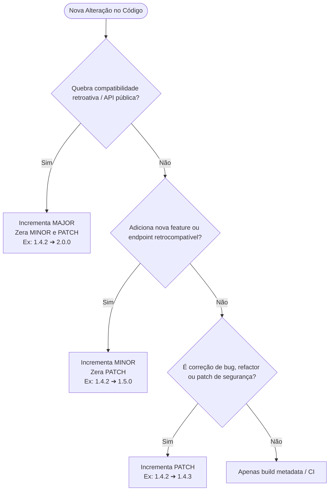

<!-- 
=================================================================================
LOG DE MANUTENÇÃO E ALTERAÇÕES DO DOCUMENTO
=================================================================================
Data       | Autor          | Descrição da Alteração
-----------|----------------|--------------------------------------------------
2026-08-31 | Matheus Diniz  | Padronização técnica completa do Guia de SemVer 2.0.0,
           | (Antigravity)  | integração com Conventional Commits, automação de tags
           |                | Git e padrão canônico de CHANGELOG.md.
=================================================================================
-->

# 🏷️ Guia Oficial de Versionamento Semântico (SemVer 2.0.0) e Gestão de Releases

| Metadado | Detalhe |
| :--- | :--- |
| **Versão** | 1.0.0 (SemVer) |
| **Data** | 2026-08-31 |
| **Status** | **Ativo / Normativo** |
| **Escopo** | Versionamento Semântico (SemVer 2.0.0), Conventional Commits, Tags Git e Releases |
| **Autor** | Matheus Diniz |

---

> **Manifesto de Versionamento:**  
> _"Em ecossistemas modernos e projetos assistidos por IA, números de versão não são estéticos: são contratos formais de compatibilidade entre serviços, bibliotecas e interfaces de usuário. Uma quebra de contrato sem incremento de versão MAJOR gera incidentes silenciosos de integração."_

---

## 🧭 Sumário Executivo

1. [Estrutura do SemVer 2.0.0](#1-estrutura-do-semver-200)
2. [Matriz de Decisão: Quando Incrementar Cada Dígito](#2-matriz-de-decisão-quando-incrementar-cada-dígito)
3. [Sufixos de Pré-Release e Metadados de Build](#3-sufixos-de-pré-release-e-metadados-de-build)
4. [Integração com Conventional Commits](#4-integração-com-conventional-commits)
5. [Padrão Canônico de CHANGELOG.md](#5-padrão-canônico-de-changelogmd)
6. [Fluxo de Release e Tags Git](#6-fluxo-de-release-e-tags-git)
7. [Boas Práticas para Monorepos e Microsserviços](#7-boas-práticas-para-monorepos-e-microsserviços)

---

## 1. Estrutura do SemVer 2.0.0

A especificação oficial do **Semantic Versioning 2.0.0** determina o formato:

$$\Large \text{MAJOR}.\text{MINOR}.\text{PATCH}[-\text{PRERELEASE}][+\text{BUILD}]$$

```text
       ┌───────────── MAJOR: Mudanças incompatíveis com versões anteriores (Breaking Changes)
       │ ┌─────────── MINOR: Novas funcionalidades retrocompatíveis
       │ │ ┌───────── PATCH: Correções de bugs e refatorações internas sem alteração de contrato
       │ │ │
       2.4.7-rc.1+20260831
             │    └─ BUILD METADATA (Opcional: timestamp, commit hash)
             └────── PRERELEASE (Opcional: alpha, beta, rc)
```

| Componente | Gatilho Técnico | Exemplo |
| :--- | :--- | :--- |
| **`MAJOR`** | Quebras de contrato de API, remoção de endpoints, alterações drásticas de schema ou regras de negócio que exigem migração manual do consumidor. | `1.5.2` ➔ `2.0.0` |
| **`MINOR`** | Adição de novos endpoints, novos componentes UI, novas entidades ou parâmetros opcionais retrocompatíveis. | `1.5.2` ➔ `1.6.0` |
| **`PATCH`** | Correções de bugs (*bugfixes*), melhorias de performance, ajustes de estilização ou refatoração interna sem alteração da interface pública. | `1.5.2` ➔ `1.5.3` |

---

## 2. Matriz de Decisão: Quando Incrementar Cada Dígito



### Exemplos Práticos por Camada

#### Backend (APIs / BFF)
- **PATCH**: Correção de bug no cálculo de juros sem mudar o payload retornado (`1.0.0` ➔ `1.0.1`).
- **MINOR**: Novo endpoint `GET /api/v1/relatorios/exportar-pdf` adicionado (`1.0.1` ➔ `1.1.0`).
- **MAJOR**: Campo obrigatório adicionado no request payload de `POST /api/v1/pedidos` (`1.1.0` ➔ `2.0.0`).

#### Frontend (Web / Mobile)
- **PATCH**: Ajuste de alinhamento CSS ou correção de validação visual de formulário (`1.2.0` ➔ `1.2.1`).
- **MINOR**: Nova tela de "Extrato Financeiro" integrada à barra de navegação (`1.2.1` ➔ `1.3.0`).
- **MAJOR**: Reescrita da camada de autenticação ou fluxo de checkout com novos passos obrigatórios (`1.3.0` ➔ `2.0.0`).

---

## 3. Sufixos de Pré-Release e Metadados de Build

Identificadores de pré-release indicam estágios de maturidade antes do release público estável:

| Sufixo | Significado | Destino de Deploy | Exemplo |
| :--- | :--- | :--- | :--- |
| **`alpha.N`** | Versão instável, em desenvolvimento ativo de novas features. | Ambiente Local / Dev | `2.0.0-alpha.1` |
| **`beta.N`** | Features completas, aberta para testes integrados e validação de QA. | Homologação / Staging | `2.0.0-beta.2` |
| **`rc.N`** | *Release Candidate*: candidata final à produção; apenas bugs críticos são aceitos. | Pré-Produção / Piloto | `2.0.0-rc.1` |
| **Sem sufixo** | Versão final estável e promovida para produção geral. | Produção (PROD) | `2.0.0` |

---

## 4. Integração com Conventional Commits

Recomenda-se correlacionar mensagens de commit ao SemVer de forma determinística:

| Prefixo do Commit | Efeito no SemVer | Descrição |
| :--- | :--- | :--- |
| `feat:` | `MINOR` | Nova funcionalidade para o usuário final |
| `fix:` | `PATCH` | Correção de bug em funcionalidade existente |
| `perf:` | `PATCH` | Melhoria de desempenho sem mudança de contrato |
| `refactor:` | `PATCH` (ou sem bump) | Refatoração de código que não altera comportamento |
| `docs:` / `style:` / `chore:` | Sem bump de release | Alteração de documentação, formatação ou tarefas internas |
| `BREAKING CHANGE:` ou `feat!:` | `MAJOR` | Qualquer alteração com quebra de contrato retrocompatível |

**Exemplo de Commit com Breaking Change:**
```git
feat(api)!: alterar formato de retorno do payload de autenticacao

BREAKING CHANGE: O campo `token` foi renomeado para `access_token` e 
passa a exigir o formato JWT Bearer no header Authorization.
```

---

## 5. Padrão Canônico de CHANGELOG.md

Mantenha um arquivo `CHANGELOG.md` na raiz do projeto baseado no padrão *Keep a Changelog*:

```markdown
# Changelog

Todas as alterações notáveis neste projeto serão documentadas neste arquivo.
O formato é baseado em [Keep a Changelog](https://keepachangelog.com/pt-BR/1.0.0/)
e este projeto adere ao [Semantic Versioning](https://semver.org/lang/pt-BR/).

## [Unreleased]
### Adicionado
- Endpoint para exportação de dados em CSV.

## [1.2.0] - 2026-08-31
### Adicionado
- Suporte a autenticação biométrica via 1Password CLI.
- Filtro por data e status na listagem de despesas.

### Modificado
- Otimização do pool de conexões do banco de dados (tempo médio reduzido em 40%).

### Corrigido
- Falha de concorrência ao atualizar status em lote.

## [1.1.0] - 2026-08-15
### Adicionado
- Módulo de relatórios gerenciais e exportação de PDF.

## [1.0.0] - 2026-08-01
### Adicionado
- Versão inicial estável (MVP) do sistema de gestão financeira.
```

---

## 6. Fluxo de Release e Tags Git

Toda release em produção deve estar atrelada a uma tag anotada no Git:

```bash
# 1. Certifique-se de que a branch principal está atualizada
git checkout main
git pull origin main

# 2. Crie a tag anotada com a versão SemVer
git tag -a v1.2.0 -m "Release v1.2.0: Módulo de relatórios e otimização de queries"

# 3. Envie a tag para o repositório remoto
git push origin v1.2.0
```

> [!TIP]
> Em pipelines de CI/CD (GitHub Actions, Cloud Build, GitLab CI), o disparo da tag `v*.*.*` deve acionar automaticamente a compilação do build de produção, execução dos testes automatizados e deploy no ambiente de destino.

---

## 7. Boas Práticas para Monorepos e Microsserviços

1. **Versionamento Unificado (Monorepo com Deploy Sincronizado):**  
   Todas as aplicações do repositório compartilham a mesma versão global (`v2.1.0`), facilitando auditorias e releases integradas.
2. **Versionamento Independente (Multi-pacotes / Microsserviços):**  
   Utilize tags prefixadas pelo nome do pacote quando as aplicações tiverem ciclos de vida separados:
   - `backend-v1.4.0`
   - `frontend-v2.0.1`
   - `shared-lib-v1.0.5`
