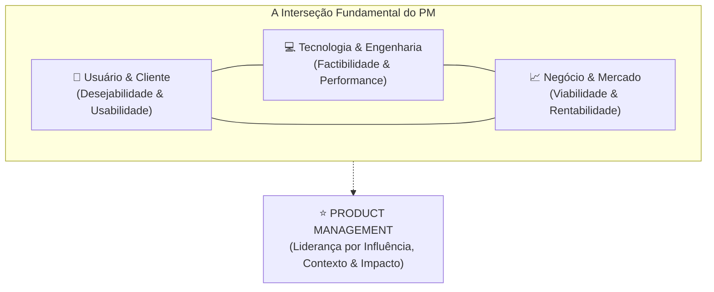
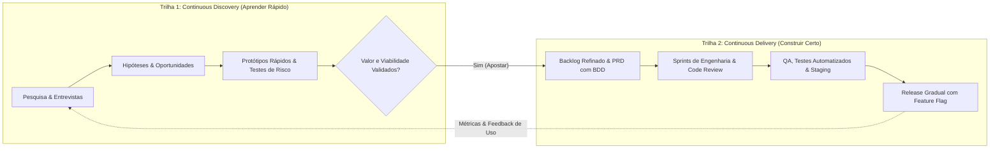
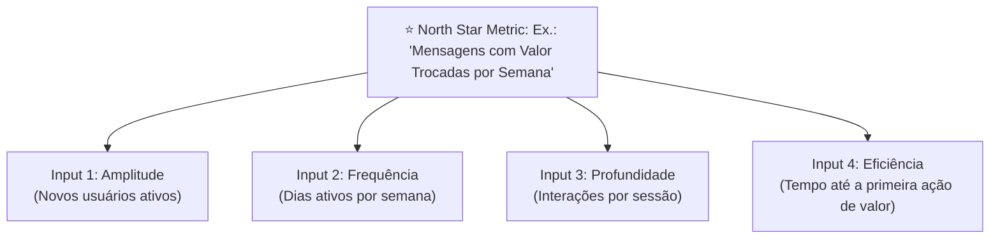
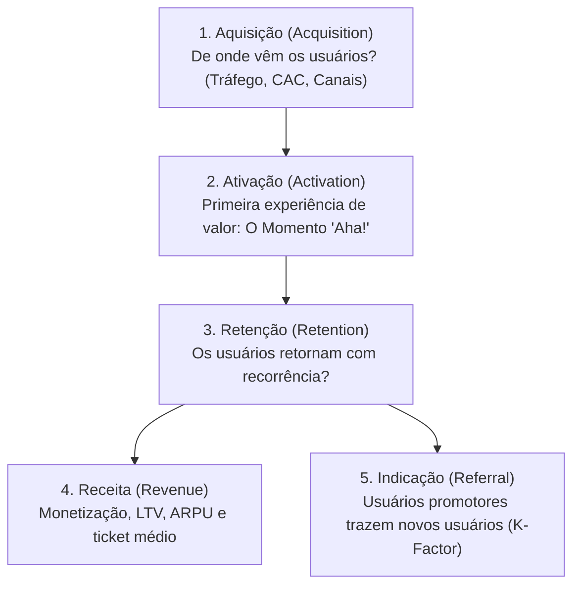

<!-- markdownlint-disable MD022 MD025 MD031 MD032 MD040 MD026 -->

<!--
=================================================================================
LOG DE MANUTENÇÃO E ALTERAÇÕES DO DOCUMENTO
=================================================================================
Data       | Autor          | Descrição da Alteração
-----------|----------------|--------------------------------------------------
2026-09-04 | Matheus Diniz  | Criação do Guia Canônico de Product Management (v1.0.0)
           | (OpenClaude)   | estruturado sobre o roadmap oficial do roadmap.sh,
           |                | cobrindo os 14 nós essenciais de PM, alinhamento
           |                | estratégico, Dual-Track Agile, métricas AARRR/North Star,
           |                | gestão dos 4 Riscos de Marty Cagan e Product-Led Growth.
=================================================================================
-->

# 🚀 Guia Canônico de Product Management: Da Visão ao Impacto

> **Manifesto de Product Management:** *Gestão de produto não é gerenciar tarefas, ditar prazos ou atuar como uma fábrica de funcionalidades (feature factory). O papel do Product Manager é descobrir o que construir, para quem e por quê, liderando times multifuncionais por influência e contexto para maximizar outcomes de negócio e valor real para o usuário. Construir rápido a coisa errada é o desperdício mais caro da engenharia.*

---

## 🧭 Relação com o Ecossistema de Guias Técnicos

Este documento inaugura a dimensão de **Gestão e Estratégia de Produto** do repositório, conectando-se aos demais pilares:

1. **Pilar de Engenharia & Arquitetura (`guides/architecture/`):** Alinha a visão de produto à viabilidade técnica, arquiteturas resilientes, débitos técnicos conscientes (ADRs) e contratos de API (Scalar / OpenAPI).
2. **Pilar de Design UI/UX (`guides/design-ui-ux/`):** Alinha os objetivos de negócio ao processo de descoberta de produto (*Discovery*), árvores de oportunidade-solução, testes de usabilidade e ergonomia cognitiva.
3. **Pilar de Governança & Segurança (`guides/essentials/`):** Assegura que o planejamento e o ciclo de vida do produto respeitem privacidade (LGPD/GDPR), conformidade Zero-Trust e padrões de versionamento semântico (SemVer 2.0.0).
4. **Pilar de Qualidade & Testes (`guides/testing/`):** Garante que os critérios de aceitação (Given/When/Then) das estórias de produto se desdobrem em suítes automatizadas de alta fidelidade.

---

## ⚖️ A Tríade Fundamental de Product Management



---

## 🔄 Dual-Track Agile: Discovery e Delivery Contínuos



---

## 📑 Sumário Executivo

1. [Fundamentos de Product Management](#1-fundamentos-de-product-management)
   - [O que é Product Management?](#11-o-que-é-product-management)
   - [Product Management vs Project Management](#12-product-management-vs-project-management)
   - [Papéis e Responsabilidades do Product Manager](#13-papéis-e-responsabilidades-do-product-manager)
   - [Habilidades-Chave (Key Skills)](#14-habilidades-chave-key-skills)
2. [Ciclo de Vida do Produto (Product Development Lifecycle)](#2-ciclo-de-vida-do-produto-product-development-lifecycle)
   - [Desenvolvimento (Development)](#21-desenvolvimento-development)
   - [Introdução (Introduction)](#22-introdução-introduction)
   - [Crescimento (Growth)](#23-crescimento-growth)
   - [Maturidade (Maturity)](#24-maturidade-maturity)
   - [Declínio (Decline)](#25-declínio-decline)
3. [Geração de Ideias (Idea Generation)](#3-geração-de-ideias-idea-generation)
   - [Técnicas de Brainstorming (Brainstorming Techniques)](#31-técnicas-de-brainstorming-brainstorming-techniques)
   - [Processo Iterativo (Iterative Process)](#32-processo-iterativo-iterative-process)
   - [Execução (Execution)](#33-execução-execution)
   - [Problem Framing (Enquadramento do Problema)](#34-problem-framing-enquadramento-do-problema)
4. [Pesquisa de Mercado e de Usuário / Identificação do Produto](#4-pesquisa-de-mercado-e-de-usuário--identificação-do-produto)
   - [Análise de Mercado (Market Analysis)](#41-análise-de-mercado-market-analysis)
   - [Pesquisa de Usuário (User Research)](#42-pesquisa-de-usuário-user-research)
   - [Posicionamento (Positioning)](#43-posicionamento-positioning)
   - [Estudos de Caso (Case Studies)](#44-estudos-de-caso-case-studies)
5. [Estratégia de Produto (Product Strategy)](#5-estratégia-de-produto-product-strategy)
   - [Visão e Missão](#51-visão-e-missão)
   - [Definição de Metas (Defining Goals)](#52-definição-de-metas-defining-goals)
   - [Proposta de Valor (Value Proposition)](#53-proposta-de-valor-value-proposition)
   - [Pensamento Estratégico e Estratégia Competitiva](#54-pensamento-estratégico-e-estratégia-competitiva)
   - [Parceiros Estratégicos (Strategic Partners)](#55-parceiros-estratégicos-strategic-partners)
6. [Planejamento de Produto (Product Planning)](#6-planejamento-de-produto-product-planning)
   - [Roadmap de Produto (Product Roadmap)](#61-roadmap-de-produto-product-roadmap)
   - [Priorização de Funcionalidades (Prioritising Features)](#62-priorização-de-funcionalidades-prioritising-features)
   - [Requisitos de Produto (Product Requirements)](#63-requisitos-de-produto-product-requirements)
   - [Histórias de Usuário (User Stories)](#64-histórias-de-usuário-user-stories)
7. [Design de Produto (Product Design)](#7-design-de-produto-product-design)
   - [Design Thinking](#71-design-thinking)
   - [Princípios de UX / UI Design](#72-princípios-de-ux--ui-design)
   - [Wireframing e Prototipagem (Wireframing and Prototyping)](#73-wireframing-e-prototipagem-wireframing-and-prototyping)
   - [Testes de Usabilidade (Usability Testing)](#74-testes-de-usabilidade-usability-testing)
8. [Desenvolvimento e Lançamento (Development and Launch)](#8-desenvolvimento-e-lançamento-development-and-launch)
   - [Metodologia Ágil (Agile Methodology)](#81-metodologia-ágil-agile-methodology)
   - [Gestão de Backlog e Cerimônias](#82-gestão-de-backlog-e-cerimônias)
   - [Trabalhando com Times de Engenharia (Working with Engineering Teams)](#83-trabalhando-com-times-de-engenharia-working-with-engineering-teams)
   - [Planejamento de Lançamento (Launch Planning)](#84-planejamento-de-lançamento-launch-planning)
   - [Estratégias de Release (Release Strategies)](#85-estratégias-de-release-release-strategies)
9. [Métricas de Produto (Product Metrics)](#9-métricas-de-produto-product-metrics)
   - [North Star Metric & Input Metrics](#91-north-star-metric--input-metrics)
   - [O Funil Pirata AARRR (Dave McClure)](#92-o-funil-pirata-aarrr-dave-mcclure)
   - [Métricas de Uso e Engajamento (DAU, WAU, MAU)](#93-métricas-de-uso-e-engajamento-dau-wau-mau)
   - [Retenção de Clientes e Análise de Coortes](#94-retenção-de-clientes-e-análise-de-coortes)
   - [Churn Rate e Net Dollar Retention (NDR)](#95-churn-rate-e-net-dollar-retention-ndr)
   - [Unit Economics: CAC, LTV e Período de Payback](#96-unit-economics-cac-ltv-e-período-de-payback)
   - [Cultura Analítica: Data-Driven vs Data-Informed vs Data-Inspired](#97-cultura-analítica-data-driven-vs-data-informed-vs-data-inspired)
   - [Armadilhas e Anti-Padrões de Métricas](#98-armadilhas-e-anti-padrões-de-métricas)
10. [Gestão de Stakeholders (Stakeholder Management)](#10-gestão-de-stakeholders-stakeholder-management)
   - [Identificação e Mapeamento de Stakeholders](#101-identificação-e-mapeamento-de-stakeholders)
   - [Gestão e Engajamento (Managing Stakeholders)](#102-gestão-e-engajamento-managing-stakeholders)
   - [Habilidades de Comunicação (Communication Skills)](#103-habilidades-de-comunicação-communication-skills)
   - [Influência e Demonstração de Impacto](#104-influência-e-demonstração-de-impacto)
11. [Ferramentas de Gestão de Produto (Product Management Tools)](#11-ferramentas-de-gestão-de-produto-product-management-tools)
   - [Ferramentas de Analytics (Analytics Tools)](#111-ferramentas-de-analytics-analytics-tools)
   - [Ferramentas de Roadmap (Roadmapping Tools)](#112-ferramentas-de-roadmap-roadmapping-tools)
   - [Ferramentas de Gestão de Projetos (Project Management Tools)](#113-ferramentas-de-gestão-de-projetos-project-management-tools)
   - [Ferramentas de Comunicação (Communication Tools)](#114-ferramentas-de-comunicação-communication-tools)
12. [Gestão de Riscos (Risk Management)](#12-gestão-de-riscos-risk-management)
   - [Identificação de Riscos (Identifying Risks)](#121-identificação-de-riscos-identifying-risks)
   - [Avaliação de Riscos (Risk Assessment)](#122-avaliação-de-riscos-risk-assessment)
   - [Mitigação de Riscos (Risk Mitigation)](#123-mitigação-de-riscos-risk-mitigation)
   - [Monitoramento e Controle (Monitoring and Controlling Risks)](#124-monitoramento-e-controle-monitoring-and-controlling-risks)
13. [Tópicos Avançados (Advanced Topics)](#13-tópicos-avançados-advanced-topics)
   - [Crescimento (Growth)](#131-crescimento-growth)
   - [Escala e Expansão](#132-escala-e-expansão)
   - [Estratégia Avançada](#133-estratégia-avançada)
   - [IA, ML e Analytics Avançada](#134-ia-ml-e-analytics-avançada)
14. [Continue Aprendendo (Keep Learning)](#14-continue-aprendendo-keep-learning)
   - [Emerging Market Trends (Tendências Emergentes de Mercado)](#141-emerging-market-trends-tendências-emergentes-de-mercado)
   - [Predictive Analytics como aprendizado contínuo](#142-predictive-analytics-como-aprendizado-contínuo)
   - [Case Studies (Estudos de Caso)](#143-case-studies-estudos-de-caso)
   - [Como manter a evolução constante](#144-como-manter-a-evolução-constante)

---

## 1. Fundamentos de Product Management

Product Management (gestão de produto) é a disciplina responsável por guiar o sucesso de um produto ao longo de todo o seu ciclo de vida, conectando as necessidades do cliente, os objetivos do negócio e as capacidades técnicas do time. O Product Manager (PM) não "manda" em ninguém por hierarquia: ele lidera por influência um time multifuncional (engenharia, design, marketing, vendas, suporte) para descobrir o que construir, por que construir e para quem, garantindo que o resultado gere valor real para usuários e para a empresa. Entender esses fundamentos importa porque tudo o que vem depois no roadmap — estratégia, pesquisa, planejamento, métricas — assume que você já sabe o que é o papel, onde ele começa e termina, e quais competências o sustentam.

### 1.1. O que é Product Management?

Product Management é uma disciplina multifacetada que funciona como a espinha dorsal de organizações de tecnologia. O PM é responsável por conduzir o sucesso de um produto e liderar o time multifuncional que o melhora continuamente. Isso exige entendimento de mercado, do cenário competitivo, da demanda e das preferências dos clientes, além da estratégia de negócio. As decisões do PM influenciam diretamente a direção estratégica, o design, a funcionalidade e o sucesso comercial do produto.

* **A "ponte" entre times:** o PM traduz necessidades de negócio em problemas de produto e problemas de produto em direção para engenharia e design. Ele garante uma transição fluida da concepção à entrega e à operação.

* **Foco no "porquê" e no "para quem", não só no "o quê":** um bom PM parte do problema do usuário e do objetivo de negócio antes de discutir solução. A entrega de features é meio, não fim.

* **Responsabilidade sobre resultado (outcome), não sobre esforço (output):** o sucesso do PM é medido pelo impacto gerado (retenção, receita, satisfação), não pela quantidade de funcionalidades lançadas.

* **Trabalho orientado por evidência:** decisões se apoiam em dados quantitativos (métricas de uso) e qualitativos (entrevistas, feedback), reduzindo a dependência de opinião.

*Ex.:* Ao notar que muitos usuários abandonam o cadastro na etapa de verificação de e-mail, o PM não parte para "adicionar login social" por palpite — ele investiga a causa (fricção, e-mails que não chegam, desconfiança) e prioriza a solução com maior impacto sobre a conversão.

*Cenário:* Numa fintech, o PM de "pagamentos" equilibra o pedido de vendas (mais métodos de pagamento para fechar contratos), o alerta de compliance (regras antifraude) e a capacidade de engenharia (dívida técnica no gateway), definindo uma sequência que atende ao objetivo de crescimento sem estourar risco ou prazo.

#### 1.1.1. O que Product Management não é

* **Não é apenas priorizar backlog:** priorização é uma atividade, não a função inteira. Sem descoberta e estratégia, prioriza-se a coisa errada com eficiência.

* **Não é "dono do produto" no sentido de decidir tudo sozinho:** a autoridade do PM vem de contexto e influência, não de comando. "CEO do produto" é metáfora sobre responsabilidade ampla, não sobre poder de mando.

* **Não é gestão de pessoas (na maioria dos casos):** o PM raramente é gestor direto de engenheiros e designers; ele coordena, não subordina.

### 1.2. Product Management vs Project Management

Os dois papéis são frequentemente confundidos porque compartilham a raiz "P.M." e colaboram de perto, mas resolvem problemas diferentes. **Project management** foca em planejar, executar e encerrar projetos específicos, com objetivos, prazos e entregáveis definidos — é um esforço temporário, com começo e fim claros, cujo sucesso é entregar no prazo e no orçamento. **Product management** é um processo contínuo que abrange todo o ciclo de vida do produto, da ideação e desenvolvimento ao lançamento e às melhorias contínuas; o PM define visão, estratégia e roadmap, garantindo que o produto atenda cliente e negócio ao longo do tempo.

Em resumo: o *project manager* se preocupa com a **execução de uma iniciativa**; o *product manager* se preocupa com o **sucesso de longo prazo e a evolução do produto**. Em muitas empresas os papéis coexistem — o PM define *o que* e *por quê*, e o project manager ajuda a garantir *como* e *quando* a entrega acontece.

| Dimensão | Product Manager | Project Manager |
| :---- | :---- | :---- |
| **Objetivo central** | Sucesso do produto (valor para cliente e negócio) | Conclusão do projeto (escopo, prazo, orçamento) |
| **Horizonte de tempo** | Contínuo, sem "fim" enquanto o produto existe | Temporário, com início e término definidos |
| **Pergunta-guia** | O que construir e por quê? Para quem? | Como entregar isto no prazo e no custo? |
| **Métrica de sucesso** | Outcomes: retenção, receita, adoção, satisfação | Outputs: entrega no prazo, dentro do escopo/orçamento |
| **Escopo** | Visão, estratégia, roadmap, priorização | Cronograma, recursos, riscos, dependências |
| **Foco principal** | "Fazer o produto certo" (eficácia) | "Fazer o produto do jeito certo" (eficiência) |
| **Relação com o time** | Liderança por influência, multifuncional | Coordenação de tarefas e recursos do projeto |

| Dimensão | Product Manager | Project Manager |

*Ex.:* Lançar um novo app de banco. O **PM** decide que o app deve priorizar abertura de conta em menos de 3 minutos porque isso ataca a maior barreira de aquisição. O **project manager** organiza sprints, dependências entre times e garante que o lançamento aconteça na data da campanha.

*Cenário:* Num projeto de migração de infraestrutura com prazo regulatório fixo, o project manager tende a liderar (escopo e data são rígidos). Já na evolução de um produto SaaS sem "data de término", o PM lidera continuamente, e projetos pontuais (ex.: uma integração) recebem apoio de project management quando necessário.

**Trade-off na prática:** empresas pequenas costumam fundir os dois papéis numa pessoa — ganha-se agilidade e contexto, mas corre-se o risco de a execução (prazos, coordenação) engolir o trabalho estratégico (descoberta, visão). Empresas maiores separam os papéis — ganha-se profundidade, mas exige-se coordenação constante para não criar silos.

### 1.3. Papéis e Responsabilidades do Product Manager

O Product Manager fica no cruzamento entre **negócio, tecnologia e experiência do usuário**. Combinando visão de negócio e sensibilidade técnica, ele influencia diretamente a aceitação do produto no mercado e o resultado financeiro da empresa. As responsabilidades típicas incluem:

* **Entender necessidades do cliente:** conduzir e sintetizar descoberta (entrevistas, dados, suporte) para identificar problemas reais que valem a pena resolver.

* **Definir e comunicar a estratégia do produto:** traduzir visão de longo prazo em direção acionável e mantê-la clara para todos os stakeholders.

* **Priorizar features e o backlog:** decidir o que entra, o que espera e o que não será feito, equilibrando impacto, esforço e risco.

* **Articular times multifuncionais:** alinhar engenharia, design, marketing, vendas e suporte para um desenvolvimento e lançamento sem atritos.

* **Monitorar e analisar o mercado:** acompanhar tendências, concorrência e comportamento de uso para ajustar a rota.

* **Conduzir o produto ao sucesso no mercado:** responsabilizar-se pelo resultado — adoção, retenção, receita — e não apenas pela entrega.

#### 1.3.1. Como a responsabilidade muda com a senioridade

* **PM Júnior / Associate:** foco em execução — refinamento de backlog, especificações, acompanhamento de entregas.

* **PM Pleno / Sênior:** dono de uma área ou fluxo do produto, responsável por descoberta, priorização e resultados de sua área.

* **Group PM / Head / VP / CPO:** foco em estratégia, portfólio, definição de metas e desenvolvimento de outros PMs.

*Ex.:* Um PM sênior de e-commerce é cobrado pela **taxa de conversão do checkout**; ele decide investir em pagamento com um clique, coordena engenharia e design, roda testes A/B e reporta o impacto na receita.

*Cenário:* Diante de um bug crítico em produção durante uma campanha, o PM prioriza a correção acima de novas features, comunica o impacto a vendas e suporte, e renegocia o roadmap da sprint — exercendo julgamento sob pressão em vez de seguir o plano cegamente.

### 1.4. Habilidades-Chave (Key Skills)

O PM é muitas vezes chamado de **"CEO do produto"**, o que exige um mix único de habilidades de negócio, técnicas e estratégicas. As competências centrais incluem pensamento estratégico, capacidade de influenciar times multifuncionais, proficiência técnica, entendimento das necessidades do cliente e das tendências de mercado, resolução de problemas e comunicação excepcional. Como a área é dinâmica, a capacidade de **aprender e se adaptar continuamente** é igualmente crucial.

#### 1.4.1. Habilidades "hard" (técnicas e analíticas)

* **Pensamento estratégico:** conectar decisões do dia a dia à visão e às metas de negócio.

* **Proficiência técnica:** entender o suficiente de arquitetura, APIs e limitações para dialogar com engenharia e avaliar viabilidade e trade-offs — sem necessariamente saber programar.

* **Análise de dados:** definir métricas, ler dashboards, interpretar testes A/B e tomar decisões orientadas por evidência.

* **Pesquisa de mercado e de usuário:** desenhar entrevistas, pesquisas e análises competitivas para embasar decisões.

#### 1.4.2. Habilidades "soft" (interpessoais e de liderança)

* **Comunicação excepcional:** adaptar a mensagem para engenheiros, executivos e clientes; escrever com clareza; contar a história do produto.

* **Influência sem autoridade:** conseguir alinhamento e comprometimento sem poder hierárquico direto.

* **Gestão de stakeholders:** equilibrar interesses conflitantes e manter todos alinhados.

* **Empatia e foco no usuário:** entender profundamente dores e contextos de quem usa o produto.

* **Resolução de problemas e adaptabilidade:** navegar ambiguidade e ajustar-se a mudanças rápidas.

| Categoria | Exemplos de habilidades | Como aparece no trabalho |
| :---- | :---- | :---- |
| **Estratégica** | Visão, priorização, pensamento de negócio | Definir roadmap e metas; decidir o que não fazer |
| **Analítica / técnica** | Dados, testes A/B, fluência técnica | Ler métricas, avaliar viabilidade com engenharia |
| **Interpessoal** | Comunicação, influência, empatia | Alinhar stakeholders; conduzir entrevistas |
| **Execução** | Organização, foco em outcome | Coordenar entregas e medir impacto |

*Ex.:* Um PM precisa que vendas adie a promessa de uma feature a um cliente grande. Sem autoridade sobre vendas, ele usa **influência**: mostra dados de que a feature beneficiaria só 2% da base e apresenta uma alternativa que resolve a dor do cliente mais rápido — obtendo adesão pelo argumento, não pela ordem.

*Cenário:* Numa reunião com engenharia, o PM ouve que a solução ideal levaria três meses. Com **fluência técnica** e **pensamento estratégico**, ele propõe uma versão enxuta que entrega 80% do valor em três semanas, validando a hipótese antes de investir no restante.

**Trade-off entre perfis de PM:** PMs muito técnicos dialogam melhor com engenharia e avaliam viabilidade com precisão, mas podem se apegar à solução e perder a visão de negócio; PMs muito "de negócio" enxergam oportunidades de mercado, mas correm o risco de prometer o que é inviável tecnicamente. Os melhores equilibram os dois lados e reconhecem qual perfil o contexto exige — um produto de infraestrutura pede mais profundidade técnica; um produto de consumo massivo pede mais sensibilidade de mercado e UX.

#### Fontes desta seção

**Nós do roadmap.sh (Product Manager) usados:**

* What is Product Management?

* Project vs Product Management

* Roles and Responsibilities of a Product Manager

* Key Skills for a Product Manager

**Links de referência seguidos:**

* What is Product Management? — ProductPlan: [https://www.productplan.com/learn/what-is-product-management/](https://www.productplan.com/learn/what-is-product-management/)

* What is Product Management? (vídeo) — Atlassian: [https://www.youtube.com/watch?v=kzMBIyzq9Ag](https://www.youtube.com/watch?v=kzMBIyzq9Ag)

* What Is Product Management? — Product School: [https://productschool.com/blog/product-fundamentals/what-is-product-management](https://productschool.com/blog/product-fundamentals/what-is-product-management)

* What, Exactly, Is a Product Manager? — Mind the Product: [https://www.mindtheproduct.com/what-exactly-is-a-product-manager/](https://www.mindtheproduct.com/what-exactly-is-a-product-manager/)

* Product vs Project Manager — Coursera: [https://www.coursera.org/gb/articles/product-manager-vs-project-manager](https://www.coursera.org/gb/articles/product-manager-vs-project-manager)

* Product Manager vs. Project Manager — Atlassian: [https://www.atlassian.com/agile/project-management/product-vs-project-management](https://www.atlassian.com/agile/project-management/product-vs-project-management)

* Product Manager Roles & Responsibilities — Productside: [https://www.productside.com/product-manager-roles-and-responsibilities-keytask/](https://www.productside.com/product-manager-roles-and-responsibilities-keytask/)

* Product Manager: Role and Best Practices — Atlassian: [https://www.atlassian.com/agile/product-management/product-manager](https://www.atlassian.com/agile/product-management/product-manager)

* What Does a Product Manager Actually Do? — Product School: [https://productschool.com/blog/career-development/what-does-product-manager-do](https://productschool.com/blog/career-development/what-does-product-manager-do)

* What Skills Does a Product Manager Need? — CareerFoundry: [https://careerfoundry.com/en/blog/product-management/product-manager-skills/](https://careerfoundry.com/en/blog/product-management/product-manager-skills/)

* Top Product Manager Skills for Success — Productboard: [https://www.productboard.com/blog/10-essential-product-management-skills-you-need-for-success/](https://www.productboard.com/blog/10-essential-product-management-skills-you-need-for-success/)

## 2. Ciclo de Vida do Produto (Product Development Lifecycle)

O ciclo de vida do produto é a jornada sistemática que um produto percorre da ideia à distribuição no mercado e, eventualmente, à sua retirada. Para o Product Manager, entender esse ciclo é o que permite antecipar desafios, prever oportunidades e escolher a estratégia certa para cada momento — porque o que faz sentido no lançamento (gerar consciência, atrair early adopters) é o oposto do que faz sentido no declínio (cortar custos, planejar a saída). O roadmap.sh trata o ciclo em cinco estágios de mercado — **Desenvolvimento, Introdução, Crescimento, Maturidade e Declínio** —, cada um com metas, riscos e táticas próprias. Dominá-los conecta os fundamentos do nó 1 (o que o PM faz) à execução prática: em qual fase o produto está agora define quais decisões o PM deve tomar.

Antes dos cinco estágios, vale a definição ampla da fonte: o ciclo compreende etapas como **ideação, design, desenvolvimento, testes e lançamento**. Os cinco estágios abaixo descrevem a vida do produto *no mercado*, do build à aposentadoria.

### 2.1. Desenvolvimento (Development)

A fase de desenvolvimento é o estágio crítico em que a ideia se transforma em um produto tangível. Para o PM, envolve coordenar times multifuncionais — engenharia, design e qualidade (QA) — para garantir que o produto atenda às suas especificações e aos requisitos de mercado. O foco é **construir, testar e refinar**, incorporando o feedback de testes iterativos e resolvendo os desafios técnicos que surgem. Uma gestão eficaz aqui é o que alinha o produto às suas metas estratégicas e o prepara para um lançamento bem-sucedido.

* **Coordenação multifuncional:** o PM é o ponto de convergência entre engenharia (viabilidade), design (usabilidade) e QA (qualidade). Cabe a ele manter todos apontando para o mesmo objetivo.

* **Iteração e feedback:** o produto é construído em ciclos — constrói-se, testa-se, aprende-se e ajusta-se —, não de uma vez só. Isso reduz o risco de descobrir tarde que algo não funciona.

* **Resolução de trade-offs técnicos:** decisões de escopo versus prazo versus qualidade acontecem o tempo todo; o PM decide o que corta, o que mantém e o que adia.

*Ex.:* durante o desenvolvimento de um app, o PM descobre que a integração ideal com um parceiro levaria dois meses a mais. Ele opta por uma versão manual temporária para não atrasar o lançamento, planejando a automação para depois.

*Cenário:* QA encontra um bug intermitente perto do fim da fase. O PM decide, com base no impacto e na frequência, se ele bloqueia o lançamento ou entra na lista de correções pós-lançamento — equilibrando qualidade e velocidade.

### 2.2. Introdução (Introduction)

A fase de introdução marca a transição do desenvolvimento para a entrada no mercado, quando o produto é lançado e disponibilizado aos clientes. Para o PM, envolve executar a estratégia de go-to-market (GTM), coordenar os esforços de marketing e vendas, e monitorar de perto o desempenho do produto. É um período crítico para **construir consciência de marca, atrair os primeiros adotantes (early adopters) e coletar o feedback inicial**. Uma boa gestão aqui garante um lançamento suave, ajuda a identificar e resolver problemas pós-lançamento e estabelece a base para o crescimento.

* **Execução do go-to-market (GTM):** posicionamento, mensagem, canais, preço e plano de lançamento se materializam aqui (o GTM em detalhe aparece no nó 8).

* **Foco em early adopters:** vendas ainda são baixas e o custo de aquisição, alto. O objetivo não é lucro imediato, e sim tração inicial e aprendizado.

* **Monitoramento intenso:** métricas de ativação, primeiros bugs e feedback qualitativo guiam ajustes rápidos.

*Ex.:* no lançamento de um SaaS, o PM acompanha diariamente a taxa de ativação (quantos que se cadastram chegam ao "momento aha") e corrige um passo confuso do onboarding na primeira semana.

**Trade-off:** lançar cedo (rápido no mercado, aprendizado real) versus lançar mais completo (melhor primeira impressão, mas mais lento). Muitos produtos preferem um lançamento enxuto para aprender com usuários reais antes de investir pesado.

### 2.3. Crescimento (Growth)

A fase de crescimento sucede o desenvolvimento e a introdução, marcada por um aumento significativo na aceitação de mercado e nas vendas. Para o PM, envolve **escalar operações, otimizar as estratégias de marketing e aprimorar o produto** com base no feedback dos clientes. O foco se desloca para expandir a participação de mercado (market share), melhorar funcionalidades e explorar novos canais de distribuição. Uma gestão eficaz aqui sustenta o momentum, responde à pressão competitiva e maximiza a lucratividade, consolidando a posição do produto.

* **Escala:** o que funcionava manualmente no lançamento precisa ser automatizado e robustecido para aguentar volume.

* **Pressão competitiva:** o sucesso atrai concorrentes; o PM investe em diferenciação e em fortalecer a proposta de valor.

* **Product-led growth (PLG):** muitas empresas usam o próprio produto como motor de aquisição e expansão (freemium, viralidade, expansão de uso).

* **Métricas de crescimento:** frameworks como AARRR (Aquisição, Ativação, Retenção, Receita, Indicação) — ou a variação RARRA, que prioriza retenção — ajudam a focar o que importa nesta fase.

*Cenário:* um app de produtividade cresce rápido, mas a retenção do 2º mês cai. O PM prioriza melhorias de retenção (onboarding, hábito) em vez de só acelerar aquisição — porque crescer com um "balde furado" desperdiça a aquisição.

### 2.4. Maturidade (Maturity)

A fase de maturidade sucede o crescimento e representa o período em que o produto alcançou ampla aceitação e vendas estabilizadas. Para o PM, o foco está em **manter a participação de mercado, otimizar a eficiência operacional e estender o ciclo de vida** por meio de melhorias e diversificação. As estratégias incluem gestão de custos, refino do marketing para reter clientes fiéis e busca por inovação incremental. Uma gestão eficaz aqui sustenta a lucratividade, contém a concorrência e prepara o produto para a eventual saturação ou evolução.

* **Defesa de mercado:** o crescimento desacelera; a prioridade passa a ser reter os clientes atuais e proteger a base contra concorrentes.

* **Eficiência e margem:** com o produto estável, otimizar custos e operação aumenta a lucratividade sem depender de novas vendas.

* **Inovação incremental e diversificação:** novos recursos, segmentos ou casos de uso ajudam a estender a vida do produto e adiar o declínio.

*Ex.:* um software maduro lança integrações e um plano enterprise para abrir um novo segmento, estendendo sua relevância sem reinventar o núcleo.

**Trade-off:** investir em inovação incremental (estende a vida, mas custa e pode não dar retorno) versus "ordenhar" o produto maximizando margem (lucro no curto prazo, mas acelera o declínio). A escolha depende do portfólio e das alternativas de investimento.

### 2.5. Declínio (Decline)

A fase de declínio vem após maturidade e é marcada por queda nas vendas e na relevância de mercado. Para o PM, envolve decisões estratégicas sobre o futuro do produto: **descontinuar, reposicionar ou reinventar**. O foco muda para redução de custos, gestão de estoque e extração do valor remanescente. Uma boa gestão aqui mitiga perdas, realoca recursos para produtos mais promissores e planeja uma saída ou transição suave — o chamado *end-of-life* (EOL) —, minimizando o impacto no portfólio e nos clientes.

* **Decisão de rota:** encerrar (EOL), reposicionar para um nicho ainda rentável, ou reinventar com uma mudança substancial.

* **Cuidado com o cliente:** um EOL bem conduzido comunica com antecedência, oferece caminhos de migração e preserva a confiança na marca.

* **Realocação:** recursos (pessoas, verba) saem do produto em declínio para iniciativas com mais potencial.

*Cenário:* uma funcionalidade legada tem poucos usuários, mas alto custo de manutenção. O PM define um plano de EOL com aviso de 6 meses, exportação de dados e migração para a alternativa — reduzindo custo sem queimar a relação com quem ainda usa.

#### Os cinco estágios lado a lado

| Estágio | Vendas / adoção | Foco do PM | Métrica típica | Risco principal |
| :---- | :---- | :---- | :---- | :---- |
| **Desenvolvimento** | Nenhuma (pré-lançamento) | Construir, testar, refinar com times multifuncionais | Marcos de entrega, qualidade | Escopo/prazo/qualidade |
| **Introdução** | Baixas, crescendo | Executar GTM, atrair early adopters | Ativação, feedback inicial | Lançamento fraco, baixa tração |
| **Crescimento** | Aceleração forte | Escalar, diferenciar, expandir canais | Aquisição, retenção, market share | "Balde furado", concorrência |
| **Maturidade** | Altas, estáveis | Reter, otimizar custos, inovação incremental | Margem, churn, LTV | Saturação, comoditização |
| **Declínio** | Em queda | Descontinuar / reposicionar / reinventar | Custo por usuário, receita residual | Perdas, dano à marca no EOL |

**Leitura estratégica:** o mesmo produto exige lideranças de decisão diferentes em cada fase. Saber em que estágio ele está evita o erro clássico de aplicar táticas de crescimento a um produto maduro (queima caixa sem retorno) ou de tratar um produto em introdução como se já devesse dar lucro (mata a tração cedo demais). Vale lembrar que nem todo produto percorre as fases na mesma velocidade, e reposicionamento ou reinvenção podem reiniciar o ciclo a partir da maturidade ou do declínio.

#### Fontes desta seção

**Nós do roadmap.sh (Product Manager) usados:**

* Product Development Lifecycle

* Development

* Introduction

* Growth

* Maturity

* Decline

**Links de referência seguidos:**

* Product Development Lifecycle — MailChimp: [https://mailchimp.com/resources/product-life-cycle/](https://mailchimp.com/resources/product-life-cycle/)

* The 7 Strategic Phases of the Product Development Lifecycle — ProductPlan: [https://www.productplan.com/learn/strategic-phases-product-planning-process](https://www.productplan.com/learn/strategic-phases-product-planning-process)

* Product Development Process: 10 Stages Every Team Should Follow — Aha\!: [https://www.aha.io/roadmapping/guide/stages-of-product-development](https://www.aha.io/roadmapping/guide/stages-of-product-development)

* What's Product Development? (vídeo): [https://www.youtube.com/watch?v=jLvMGnAYicY](https://www.youtube.com/watch?v=jLvMGnAYicY)

* What is Product Development? — Aha\!: [https://www.aha.io/roadmapping/guide/what-is-product-development](https://www.aha.io/roadmapping/guide/what-is-product-development)

* 4 Key Stages of the Product Development Process — Reforge: [https://www.reforge.com/blog/product-development-process](https://www.reforge.com/blog/product-development-process)

* What is a Go-to-Market Strategy? Complete GTM Guide — Product Marketing Alliance: [https://www.productmarketingalliance.com/your-guide-to-go-to-market-strategies/](https://www.productmarketingalliance.com/your-guide-to-go-to-market-strategies/)

* Go-to-Market (GTM) Strategy: Definition and 9-Step Guide — Asana: [https://asana.com/resources/go-to-market-gtm-strategy](https://asana.com/resources/go-to-market-gtm-strategy)

* Ultimate Guide to Product Launch — ProductPlan: [https://productplan.com/learn/product-launch](https://productplan.com/learn/product-launch)

* 7 Effective Growth Strategies and How to Apply Them — Product School: [https://productschool.com/blog/product-strategy/growth-strategy](https://productschool.com/blog/product-strategy/growth-strategy)

* Product-Led Growth Strategy for Product Managers — Product School: [https://productschool.com/blog/product-strategy/product-led-growth-strategy](https://productschool.com/blog/product-strategy/product-led-growth-strategy)

* AARRR vs RARRA: Pirate Metrics Explained — Mind the Product: [https://www.mindtheproduct.com/aarrr-vs-rarra-pirate-metrics-explained/](https://www.mindtheproduct.com/aarrr-vs-rarra-pirate-metrics-explained/)

* How to Manage the Maturity Stage of Product Life Cycle — ProdPad: [https://www.prodpad.com/blog/maturity-stage-product-life-cycle/](https://www.prodpad.com/blog/maturity-stage-product-life-cycle/)

* Product Lifecycle: What PMs and Teams Need To Know — Aha\!: [https://www.aha.io/roadmapping/guide/what-is-the-product-lifecycle](https://www.aha.io/roadmapping/guide/what-is-the-product-lifecycle)

* Product Management's Role at Every Phase of the Product Lifecycle — ProductPlan: [https://productplan.com/learn/product-management-role-product-lifecycle](https://productplan.com/learn/product-management-role-product-lifecycle)

* What Is an End-of-Life Product? — Product School: [https://productschool.com/blog/product-strategy/end-of-life-product](https://productschool.com/blog/product-strategy/end-of-life-product)

* A 10-Step Checklist For the End-of-Life of Your Product — ProductPlan: [https://www.productplan.com/learn/how-to-end-of-life-product](https://www.productplan.com/learn/how-to-end-of-life-product)

* Product Life Cycle Decline Stage: How to Handle It — Eleken: [https://www.eleken.co/blog-posts/decline-stage-of-product-life-cycle-overview-and-strategies](https://www.eleken.co/blog-posts/decline-stage-of-product-life-cycle-overview-and-strategies)

## 3. Geração de Ideias (Idea Generation)

Geração de ideias é a etapa em que o Product Manager produz, expande e refina possíveis soluções antes de comprometer recursos com o desenvolvimento. Ela importa porque a qualidade do que se constrói depende da qualidade e da diversidade das ideias que entram no funil — e porque ideia boa não basta: é preciso um processo para gerá-la, selecioná-la e validá-la antes de executar. O roadmap organiza o tema em quatro frentes: **técnicas de brainstorming** para gerar volume e diversidade de ideias, um **processo iterativo** (descobrir, selecionar, validar) para filtrar o que vale a pena, ferramentas de **execução** (Blue Ocean, TRIZ) para inovar de forma sistemática, e o **enquadramento do problema** (problem framing), que garante que se está resolvendo a questão certa. A regra de ouro que atravessa o nó: gerar muitas ideias é barato; escolher e validar a ideia errada é caro.

### 3.1. Técnicas de Brainstorming (Brainstorming Techniques)

Técnicas de brainstorming são métodos estruturados para estimular a criatividade, gerar volume de ideias e alinhar a visão do time — especialmente na fase inicial de identificação de produto. Em vez de esperar por inspiração, o PM usa técnicas como mapas mentais, SCAMPER, brainwriting, SWOT ou Six Thinking Hats para provocar pensamento divergente e colaboração multifuncional. Sessões eficazes revelam oportunidades de mercado, alinham o time e alimentam a estratégia de produto.

* **Divergir antes de convergir:** primeiro gerar o máximo de ideias sem julgar; só depois filtrar. Misturar as duas fases mata a criatividade.

* **Estruturar reduz o "efeito ruído":** técnicas evitam que as vozes mais altas dominem e que o grupo ancore cedo demais numa única ideia.

*Cenário:* antes de decidir o próximo grande investimento, o PM roda uma sessão combinando mapa mental (para explorar o problema) e SCAMPER (para transformar o produto atual), gerando dezenas de ideias que depois serão filtradas no processo iterativo (item 2).

#### 3.1.1. Mind Mapping (Mapa Mental)

Mapa mental é a representação gráfica de ideias ou tarefas que partem de um conceito central. Ajuda o PM a visualizar conceitos e relações complexas — na formulação de estratégia, na quebra de features, na comunicação com stakeholders. Ele estimula o brainstorming, favorece a associação de ideias e organiza os muitos elementos do ciclo de vida de um produto.

* **Do centro para fora:** um tema central se ramifica em subtemas e detalhes, tornando visíveis conexões que uma lista linear esconde.

* **Usos típicos:** explorar o espaço de um problema, mapear uma feature em suas partes, estruturar a comunicação de uma ideia.

*Ex.:* ao pensar "onboarding", o PM coloca isso no centro e ramifica em cadastro, primeiro valor, ativação, retenção — e cada ramo abre subideias, revelando lacunas.

#### 3.1.2. Brainwriting

Brainwriting é uma técnica de brainstorming estruturada em que cada participante **escreve suas ideias individualmente** e depois as passa adiante para que outros as desenvolvam e aprimorem. Valoriza a voz de todos, reduz a pressão do grupo e combate a "dominação de ideia" comum no brainstorming verbal tradicional.

* **Por que funciona:** ao escrever antes de falar, todos contribuem — não só os mais extrovertidos ou seniores. Reduz o viés de conformidade e a ancoragem na primeira ideia dita.

* **Variação 6-3-5:** 6 pessoas escrevem 3 ideias em 5 minutos e passam a folha adiante, gerando dezenas de ideias em pouco tempo.

*Cenário:* numa equipe onde o líder costuma dominar a discussão, o PM adota brainwriting para garantir que ideias dos membros mais quietos cheguem à mesa. **Trade-off vs brainstorming verbal:** brainwriting gera mais ideias e mais equânimes, mas perde a energia e o "construir em cima" em tempo real da conversa aberta.

#### 3.1.3. SCAMPER

SCAMPER é um acrônimo mnemônico com sete técnicas para desafiar o status quo e gerar ideias de produto de forma estruturada: **Substitute, Combine, Adapt, Modify/Magnify, Put to other uses, Eliminate, Reverse**. Serve para analisar o portfólio atual, achar áreas de melhoria e conceber novas features ou produtos inteiros.

| Letra | Técnica | Pergunta-gatilho | Ex.: aplicado a um app |
| :---- | :---- | :---- | :---- |
| **S** | Substituir | O que pode ser trocado por outra coisa? | Trocar senha por biometria |
| **C** | Combinar | O que pode ser unido? | Fundir chat e suporte num só lugar |
| **A** | Adaptar | O que pode ser ajustado de outro contexto? | Trazer "stories" de redes sociais |
| **M** | Modificar/Ampliar | O que aumentar, reduzir ou mudar? | Ampliar o plano grátis |
| **P** | Pôr em outro uso (Put to other uses) | Onde mais isto serviria? | Usar o motor de busca interno como API |
| **E** | Eliminar | O que remover para simplificar? | Cortar etapas do cadastro |
| **R** | Reverter (Reverse) | E se invertêssemos a ordem/lógica? | Deixar o usuário pagar depois de usar |

*Cenário:* diante de um produto estagnado, o PM roda um SCAMPER e a letra "E" (Eliminar) revela que remover três campos do cadastro pode ser a maior alavanca de conversão. **Trade-off:** SCAMPER é ótimo para inovação incremental sobre algo existente, mas é fraco para criar categorias totalmente novas — aí entram Blue Ocean e TRIZ (item 3).

### 3.2. Processo Iterativo (Iterative Process)

O processo iterativo é a abordagem fundamental de "criar, testar, refinar e repetir": o PM melhora o produto de forma incremental com base no aprendizado de cada ciclo. Isso torna o desenvolvimento mais flexível — essencial em ambientes dinâmicos, onde necessidades do usuário e condições de mercado mudam com frequência. Na geração de ideias, o processo iterativo é o funil que transforma muitas ideias em poucas apostas validadas, através de três momentos: **descoberta, seleção e validação**.

* **Iterar vence "acertar de primeira":** em vez de apostar tudo num grande lançamento, testa-se e ajusta-se em ciclos curtos, reduzindo o custo do erro.

* **Aprendizado como produto:** cada iteração gera conhecimento que melhora a próxima decisão.

#### 3.2.1. Discovery (Descoberta)

A descoberta é a fase de explorar, pesquisar e entender necessidades do cliente e oportunidades de mercado para definir claramente **o problema a resolver**. O PM coleta e analisa dados de clientes, concorrentes e mercado, comunicando os achados com artefatos visuais como jornadas do cliente, personas e protótipos. Os insights da descoberta são a fundação das decisões nas fases seguintes.

* **Foco no problema, não na solução:** descoberta bem-feita evita "apaixonar-se pela solução" antes de entender a dor.

* **Contínua, não pontual (Teresa Torres):** a boa descoberta é um hábito semanal de contato com usuários, não um projeto que acontece uma vez.

* **Discovery vs Delivery:** descoberta decide *o que vale a pena construir*; entrega (delivery) constrói bem *o que foi decidido*. Times maduros fazem as duas em paralelo, continuamente.

*Ex.:* antes de construir uma feature de relatórios, o PM entrevista 8 clientes e descobre que o problema real não é "falta de relatórios", mas "não confiar nos dados" — mudando completamente a solução.

#### 3.2.2. Selection (Seleção)

A seleção é o processo de decidir **quais features e projetos priorizar**, com base na direção estratégica, nos objetivos de negócio, nas necessidades do cliente e nas tendências de mercado. É o que garante uso eficiente de recursos e foco em tarefas de alto impacto. Apoia-se em ferramentas como roadmaps, matrizes de priorização, feedback do usuário e análise de dados.

* **Priorizar é dizer "não":** selecionar bem significa recusar boas ideias para focar nas melhores. Frameworks (RICE, valor-vs-esforço, MoSCoW, Kano) tornam essa decisão explícita e defensável.

* **Critérios múltiplos:** impacto, esforço, risco, alinhamento estratégico e urgência entram na conta — nunca um só.

*Cenário:* o PM tem 20 ideias validadas na descoberta. Usando uma matriz valor-vs-esforço, seleciona as 3 de alto valor e baixo esforço para o próximo trimestre, e adia as de alto esforço para depois de mais validação. (Técnicas de priorização são detalhadas no nó 6.)

#### 3.2.3. Validation (Validação)

Validação é o processo de garantir que um produto, feature ou conceito **atende às necessidades e expectativas do usuário-alvo** — feito *antes* do desenvolvimento para mitigar riscos e evitar erros caros. Ela responde se o problema vale a pena resolver, mede a demanda e valida a solução proposta, tipicamente via entrevistas, pesquisas, protótipos e pesquisa de mercado.

* **Validar cedo, no estágio certo:** validar a *ideia/problema* antes de validar a *solução*; validar a solução antes de escalar. Validar no estágio errado desperdiça esforço.

* **Reduz incerteza, não a elimina:** validação diminui o risco de construir algo que ninguém quer, mas nenhuma validação substitui o teste com o produto real no mercado.

*Ex.:* antes de construir um app, o time cria uma landing page descrevendo a solução e mede quantos se cadastram para a lista de espera — validando a demanda com poucos dias de trabalho em vez de meses de desenvolvimento.

| Fase | Pergunta central | Saída |
| :---- | :---- | :---- |
| **Discovery** | Qual é o problema real e para quem? | Problema bem definido |
| **Selection** | Quais ideias priorizar agora? | Lista curta e ordenada |
| **Validation** | Vale a pena e a solução funciona? | Aposta validada (ou descartada) |

### 3.3. Execução (Execution)

No contexto de geração de ideias, execução é a implementação prática dos planos estratégicos: transformar visão em produto, gerindo recursos, mitigando riscos e colaborando entre times. Habilidades sólidas de execução são vitais porque impactam diretamente o sucesso ou o fracasso do produto — "estratégia sem execução é alucinação". Nesta frente, o roadmap destaca duas metodologias que ajudam a *inovar de forma sistemática*, indo além do incremental: **Blue Ocean Strategy** e **TRIZ**.

#### 3.3.1. Blue Ocean Strategy (Estratégia do Oceano Azul)

Blue Ocean Strategy é uma teoria (do livro de 2005, de W. Chan Kim e Renée Mauborgne) que defende criar **nova demanda em espaços de mercado não disputados** ("oceanos azuis"), em vez de competir dentro de um setor saturado ("oceanos vermelhos"). Para o PM, significa buscar oportunidades e mercados potenciais onde a concorrência é irrelevante, desenvolvendo produtos únicos capables de gerar crescimento exponencial.

* **Oceano vermelho vs azul:** o vermelho é a competição sangrenta por clientes existentes; o azul é criar um espaço novo, tornando a concorrência irrelevante.

* **Inovação de valor:** o objetivo é buscar simultaneamente *diferenciação* e *baixo custo*, quebrando o trade-off tradicional entre os dois.

| Dimensão | Oceano Vermelho | Oceano Azul |
| :---- | :---- | :---- |
| **Mercado** | Existente, disputado | Novo, não disputado |
| **Concorrência** | Vencer os rivais | Tornar rivais irrelevantes |
| **Demanda** | Disputar a demanda atual | Criar demanda nova |
| **Trade-off valor/custo** | Escolher um | Buscar os dois juntos |

*Ex.:* o Cirque du Soleil não competiu com circos tradicionais (oceano vermelho); criou uma categoria nova entre circo e teatro (oceano azul), atraindo um público adulto disposto a pagar mais. **Trade-off:** oceanos azuis têm alto potencial, mas também alto risco e incerteza — demanda nova pode não existir; por isso a validação (item 2.3) é crítica.

#### 3.3.2. TRIZ (Teoria da Resolução Inventiva de Problemas)

TRIZ é uma ferramenta de resolução de problemas, análise e previsão derivada do **estudo de padrões de invenção na literatura global de patentes**. No produto, ajuda o PM a idear soluções inovadoras, acelerar o desenvolvimento, resolver problemas complexos e prever tendências tecnológicas. Ao oferecer abordagens sistemáticas, ajuda a superar vieses cognitivos e a romper padrões tradicionais de pensamento.

* **Inovação sistemática, não sorte:** a premissa do TRIZ é que problemas técnicos se repetem entre setores, e suas soluções já foram inventadas em algum lugar — basta aplicar o padrão certo.

* **Resolver contradições:** o coração do TRIZ é eliminar trade-offs aparentes (melhorar A sem piorar B), em vez de apenas equilibrá-los.

*Ex.:* querer um produto mais robusto (mais material) sem torná-lo mais pesado é uma "contradição"; o TRIZ oferece princípios inventivos (ex.: usar estruturas ocas) que resolvem os dois ao mesmo tempo. **Blue Ocean vs TRIZ:** Blue Ocean mira *onde* competir (novo espaço de mercado); TRIZ mira *como* resolver (a solução técnica inventiva). São complementares.

### 3.4. Problem Framing (Enquadramento do Problema)

Problem framing é o processo rigoroso de **entender, articular e definir claramente os problemas** que um produto pretende resolver. Exige pensamento crítico e criativo para identificar a causa-raiz de um problema, suas implicações, seus usuários e o impacto das soluções. Um problema bem enquadrado guia o PM por todo o design e desenvolvimento, garantindo que o produto final resolva a questão certa e entregue valor real.

* **A questão certa antes da solução certa:** enquadrar mal o problema leva a construir a coisa errada com perfeição. Framing é o antídoto contra "soluções à procura de problemas".

* **Chegar à causa-raiz:** técnicas como os "5 Porquês" e o "How Might We" ajudam a passar do sintoma à causa e a reabrir o espaço de soluções.

* **Amplo o suficiente, específico o bastante:** um problema enquadrado de forma ampla demais é intratável; estreito demais já embute uma solução e limita a criatividade.

*Ex.:* "os usuários querem um botão de exportar" é uma solução disfarçada de problema. Reenquadrado: "os usuários precisam levar seus dados para outra ferramenta rapidamente" — o que abre soluções melhores que um simples botão (integração, API, sincronização).

*Cenário:* antes de qualquer brainstorming, o PM escreve uma "declaração de problema" de uma frase e a valida com stakeholders. Isso alinha o time e evita que a sessão de ideias resolva o problema errado com eficiência. **Ligação com o nó:** o framing é logicamente o *primeiro* passo — enquadra-se o problema, gera-se ideias (item 1), filtra-se (item 2\) e inova-se sistematicamente (item 3).

#### Fontes desta seção

**Nós do roadmap.sh (Product Manager) usados:**

* Brainstorming Techniques for Product Identification

* Mind Mapping · Brainwriting · SCAMPER

* Iterative Process

* Discovery · Selection · Validation

* Execution

* Blue Ocean Strategy · TRIZ (Theory of Inventive Problem Solving)

* Problem Framing

**Links de referência seguidos:**

* Brainstorming Techniques for Product Builders — Aha\!: [https://www.aha.io/roadmapping/guide/brainstorming-techniques-for-product-builders](https://www.aha.io/roadmapping/guide/brainstorming-techniques-for-product-builders)

* What is Brainstorming? — Miro: [https://miro.com/brainstorming/what-is-brainstorming/](https://miro.com/brainstorming/what-is-brainstorming/)

* 10 Brainstorming Techniques for Idea Generation — Mural: [https://www.mural.co/blog/brainstorming-techniques](https://www.mural.co/blog/brainstorming-techniques)

* Mind Maps: How to Organize & Connect Your Ideas — Mural: [https://www.mural.co/blog/mind-mapping](https://www.mural.co/blog/mind-mapping)

* What are Mind Maps? — Interaction Design Foundation: [https://ixdf.org/literature/topics/mind-maps](https://ixdf.org/literature/topics/mind-maps)

* Mind Mapping Techniques — Miro: [https://miro.com/mind-map/mind-mapping-techniques/](https://miro.com/mind-map/mind-mapping-techniques/)

* What is Brainwriting — Interaction Design Foundation: [https://ixdf.org/literature/topics/brainwriting](https://ixdf.org/literature/topics/brainwriting)

* Using Brainwriting For Rapid Idea Generation — Smashing Magazine: [https://www.smashingmagazine.com/2013/12/using-brainwriting-for-rapid-idea-generation/](https://www.smashingmagazine.com/2013/12/using-brainwriting-for-rapid-idea-generation/)

* 6-3-5 Brainwriting — Wikipedia: [https://en.wikipedia.org/wiki/6-3-5_Brainwriting](https://en.wikipedia.org/wiki/6-3-5_Brainwriting)

* SCAMPER Design Thinking Technique — IMD: [https://www.imd.org/blog/innovation/scamper-method-design-thinking/](https://www.imd.org/blog/innovation/scamper-method-design-thinking/)

* SCAMPER: How to Use the Best Ideation Methods — Interaction Design Foundation: [https://ixdf.org/literature/article/learn-how-to-use-the-best-ideation-methods-scamper](https://ixdf.org/literature/article/learn-how-to-use-the-best-ideation-methods-scamper)

* A Guide to the SCAMPER Technique — Designorate: [https://www.designorate.com/a-guide-to-the-scamper-technique-for-creative-thinking/](https://www.designorate.com/a-guide-to-the-scamper-technique-for-creative-thinking/)

* Why Iteration is the Key to Creating Great Products — Product School: [https://productschool.com/blog/product-strategy/iteration-key-to-creating-great-products](https://productschool.com/blog/product-strategy/iteration-key-to-creating-great-products)

* What Is an Iterative Process? — Atlassian: [https://www.atlassian.com/work-management/project-management/iterative-process](https://www.atlassian.com/work-management/project-management/iterative-process)

* Agile Product Management — ProductPlan: [https://productplan.com/learn/agile-product-management](https://productplan.com/learn/agile-product-management)

* Introduction to Modern Product Discovery (Teresa Torres): [https://youtu.be/l7-5x0ra2tc](https://youtu.be/l7-5x0ra2tc)

* Product Discovery or Product Delivery: How do you Decide? — Mind the Product: [https://www.mindtheproduct.com/product-discovery-or-product-delivery-how-do-you-decide/](https://www.mindtheproduct.com/product-discovery-or-product-delivery-how-do-you-decide/)

* Deep Dive: How to Make Product Discovery a Habit — Mind the Product: [https://www.mindtheproduct.com/deep-dive-how-to-make-product-discovery-a-habit/](https://www.mindtheproduct.com/deep-dive-how-to-make-product-discovery-a-habit/)

* 9 Prioritization Frameworks & Which to Use — Product School: [https://productschool.com/blog/product-fundamentals/ultimate-guide-product-prioritization](https://productschool.com/blog/product-fundamentals/ultimate-guide-product-prioritization)

* Product Management Prioritization Frameworks — ProductPlan: [https://www.productplan.com/learn/product-management-frameworks](https://www.productplan.com/learn/product-management-frameworks)

* Product Prioritization Frameworks: The Complete Guide — Monday.com: [https://monday.com/blog/rnd/product-prioritization-frameworks/](https://monday.com/blog/rnd/product-prioritization-frameworks/)

* What is Product Validation? Overview and Guide — Productboard: [https://www.productboard.com/blog/understanding-product-validation/](https://www.productboard.com/blog/understanding-product-validation/)

* What is Product Validation — Optimizely: [https://www.optimizely.com/optimization-glossary/product-validation/](https://www.optimizely.com/optimization-glossary/product-validation/)

* How To Fix Validating Your Idea At The Wrong Stage — ITONICS: [https://www.itonics-innovation.com/blog/product-validation](https://www.itonics-innovation.com/blog/product-validation)

* Strategy vs. Execution — SVPG: [https://www.svpg.com/strategy-vs-execution/](https://www.svpg.com/strategy-vs-execution/)

* The Activities of a Strategic Product Manager — ProductPlan: [https://www.productplan.com/learn/activities-strategic-product-manager/](https://www.productplan.com/learn/activities-strategic-product-manager/)

* Scaling Product Delivery — Reforge: [https://www.reforge.com/blog/scaling-product-delivery](https://www.reforge.com/blog/scaling-product-delivery)

* How To Differentiate Your Business With Blue Ocean Strategy (vídeo): [https://www.youtube.com/watch?v=UKDxj6W7CXs](https://www.youtube.com/watch?v=UKDxj6W7CXs)

* What is Blue Ocean Strategy — Blue Ocean Strategy: [https://www.blueoceanstrategy.com/what-is-blue-ocean-strategy/](https://www.blueoceanstrategy.com/what-is-blue-ocean-strategy/)

* 7 Powerful Blue Ocean Strategy Examples — Blue Ocean Strategy: [https://www.blueoceanstrategy.com/blog/7-powerful-blue-ocean-strategy-examples/](https://www.blueoceanstrategy.com/blog/7-powerful-blue-ocean-strategy-examples/)

* What is TRIZ? — Oxford Creativity: [https://www.triz.co.uk/what-is-triz](https://www.triz.co.uk/what-is-triz)

* Unlocking Innovative Solutions with TRIZ — 6Sigma: [https://www.6sigma.us/six-sigma-in-focus/triz-inventive-problem-solving-methodology/](https://www.6sigma.us/six-sigma-in-focus/triz-inventive-problem-solving-methodology/)

* TRIZ \- Theory of Inventive Problem Solving — IAPM: [https://www.iapm.net/en/blog/triz/](https://www.iapm.net/en/blog/triz/)

* How to Use the Problem Framing Method — Atlassian: [https://www.atlassian.com/team-playbook/plays/problem-framing](https://www.atlassian.com/team-playbook/plays/problem-framing)

* What is Problem Framing? — Design Sprint Academy: [https://www.designsprint.academy/blog/what-is-problem-framing](https://www.designsprint.academy/blog/what-is-problem-framing)

* Framing The Problem — Productside: [https://productside.com/playbook/framing-the-problem/](https://productside.com/playbook/framing-the-problem/)

## 4. Pesquisa de Mercado e de Usuário / Identificação do Produto

Identificação de produto é o trabalho de descobrir *o que* construir e *para quem*, apoiado em duas frentes de pesquisa: **de mercado** (o cenário externo — necessidades, concorrência, tendências) e **de usuário** (as pessoas reais — suas dores, contextos e comportamentos). É a ponte entre gerar ideias (nó 3\) e definir estratégia (nó 5): sem entender mercado e usuário, a estratégia vira palpite. Este nó cobre a análise de mercado, os métodos de pesquisa de usuário, o posicionamento (como o produto ocupa um lugar único na mente do cliente) e os estudos de caso como forma de aprender com o que já deu certo (e errado). A regra que atravessa tudo: decisões de produto devem se apoiar em evidência sobre o mundo lá fora e as pessoas de verdade — não na intuição de quem está dentro do prédio.

### 4.1. Análise de Mercado (Market Analysis)

A análise de mercado é uma atividade central do PM: entender o tamanho, a dinâmica e as forças do mercado em que o produto compete. Envolve pesquisar demanda, concorrência e tendências para tomar decisões informadas sobre onde e como competir. Uma boa análise de mercado responde perguntas como "o mercado é grande e crescente o suficiente?", "quem já atende essa demanda?" e "para onde o mercado está indo?".

* **Dimensionar a oportunidade:** conceitos como TAM/SAM/SOM (mercado total, atendível e obtível) ajudam a avaliar se a oportunidade justifica o investimento.

* **Fontes múltiplas:** dados de clientes, relatórios de setor, concorrentes e sinais de comportamento se combinam para formar o quadro.

*Cenário:* antes de entrar num novo segmento, o PM analisa o tamanho do mercado, os 3 concorrentes dominantes e a tendência de adoção — e conclui que o mercado é pequeno demais para justificar o esforço, evitando uma aposta cara.

#### 4.1.1. Identificar Necessidades de Mercado (Identifying Market Needs)

Identificar necessidades de mercado é o processo fundamental de descobrir **problemas reais e não atendidos** que um produto pode resolver. Vai além do que os clientes pedem: busca as dores latentes, muitas vezes não verbalizadas. É a base da descoberta (nó 3\) aplicada ao mercado.

* **Necessidades declaradas vs latentes:** o cliente pede uma solução ("um cavalo mais rápido"); a necessidade real é outra ("chegar mais rápido"). O PM busca a segunda.

* **Necessidades não atendidas (unmet needs):** as maiores oportunidades estão onde a dor é forte e nenhuma solução atual resolve bem.

*Ex.:* pesquisando o mercado de gestão financeira, o PM percebe que autônomos não têm dor de "registrar despesas" (já existem apps), mas sim de "separar pessoa física de jurídica sem esforço" — uma necessidade mal atendida que vira a aposta do produto.

#### 4.1.2. Análise Competitiva (Competitive Analysis)

Análise competitiva é o estudo sistemático dos concorrentes — features, preço, posicionamento e experiência — para entender o cenário e achar lacunas de diferenciação. Entender o campo competitivo é crítico para posicionar o produto e decidir onde investir.

* **Concorrentes diretos e indiretos:** diretos resolvem o mesmo problema do mesmo jeito; indiretos resolvem a mesma dor de outra forma (inclusive "não fazer nada" ou uma planilha).

* **Matriz competitiva:** comparar features, preço e público lado a lado revela onde há espaço para se destacar.

* **Cuidado com a obsessão pelo concorrente:** copiar features do rival leva à comoditização; a análise serve para *diferenciar*, não para imitar.

*Cenário:* o PM monta uma matriz e descobre que todos os concorrentes miram grandes empresas com produtos caros e complexos — abrindo uma lacuna clara para uma solução simples e acessível para pequenos negócios.

#### 4.1.3. Tendências Emergentes de Mercado (Emerging Market Trends)

Entender tendências emergentes é acompanhar as mudanças de tecnologia, comportamento e regulação que vão moldar o mercado no futuro. Permite ao PM antecipar oportunidades e ameaças em vez de apenas reagir a elas.

* **Sinais fracos viram ondas:** tendências começam pequenas (novo comportamento de nicho, nova tecnologia) e podem redefinir o mercado — quem antecipa ganha vantagem.

* **Fontes:** relatórios de setor, mudanças de comportamento nos dados de uso, avanços tecnológicos (ex.: IA), movimentos regulatórios.

*Ex.:* um PM que percebeu cedo a tendência de trabalho remoto priorizou recursos de colaboração assíncrona antes dos concorrentes, capturando demanda que explodiu depois. **Trade-off:** apostar em tendência emergente pode gerar vantagem de pioneiro, mas também risco de investir numa "moda" que não se consolida — por isso combina-se com validação (nó 3).

### 4.2. Pesquisa de Usuário (User Research)

Pesquisa de usuário é a investigação sistemática de necessidades, comportamentos e motivações das pessoas que usam (ou usarão) o produto, por meio de métodos qualitativos e quantitativos. É o que garante que as decisões partam de evidência sobre usuários reais, e não de suposições. Melhora usabilidade, engajamento e satisfação.

* **Qualitativo vs quantitativo:** o qualitativo (entrevistas, etnografia) explica *o porquê* e o comportamento; o quantitativo (surveys, analytics) mede *quanto* e generaliza. Bons PMs combinam os dois.

* **Atitudinal vs comportamental:** o que as pessoas *dizem* (atitude) difere do que *fazem* (comportamento); observar o comportamento corrige o viés do autorrelato.

| Método | Tipo | Responde | Melhor para |  
| \----- | \----- | \----- | \----- |  
| Entrevistas | Qualitativo | Por quê? Motivações | Entender dores em profundidade |  
| Pesquisas (surveys) | Quantitativo | Quantos? Com que frequência? | Medir e generalizar |  
| Etnografia | Qualitativo (observação) | O que fazem no contexto real? | Descobrir necessidades latentes |  
| Personas | Síntese | Para quem projetamos? | Alinhar o time num alvo comum |

#### 4.2.1. Personas

Personas são perfis fictícios, porém baseados em pesquisa, que representam os principais tipos de usuário — reunindo objetivos, frustrações, comportamentos e contexto. São fundamentais na pesquisa de usuário porque dão ao time um **ponto de referência compartilhado** para decidir, trocando "eu acho" por "a persona precisa".

* **Fundamentada, não inventada:** cada traço vem de dados reais; uma persona "de feeling" dá falsa confiança.

* **Ferramenta de decisão:** existe para ser usada em reviews e priorização, não para enfeitar um slide.

*Ex.:* "Marina, autônoma, renda irregular, sem tempo, desconfia de banco" orienta decisões concretas de escopo e tom melhor que "mulheres de 25–40 anos".

#### 4.2.2. Entrevistas com Usuários (User Interviews)

Entrevistas são conversas individuais e semiestruturadas para entender em profundidade as necessidades, motivações e experiências do usuário. São um dos instrumentos mais valiosos do PM porque revelam o *porquê* por trás do comportamento.

* **Perguntas abertas, não sugestivas:** "conte-me sobre a última vez que…" gera histórias reais; "você gostaria de uma feature X?" induz respostas falsas.

* **Foco no passado e no comportamento:** o que a pessoa fez recentemente é mais confiável do que o que ela imagina que faria.

* **Roteiro leve:** um guia de entrevista mantém o foco sem engessar a conversa.

*Cenário:* em vez de perguntar "você usaria um app de orçamento?", o PM pergunta "como você controlou seus gastos no último mês?" — e descobre que a pessoa nem tenta, revelando a dor real. **Trade-off:** entrevistas trazem profundidade, mas são poucas e não generalizáveis; por isso se complementam com surveys.

#### 4.2.3. Pesquisas e Questionários (Surveys and Questionnaires)

Surveys coletam dados de um grande número de pessoas de forma estruturada, permitindo **quantificar e generalizar** achados. Ajudam o PM a medir a frequência de um comportamento, priorizar necessidades e validar hipóteses em escala.

* **Perguntas claras e neutras:** perguntas ambíguas ou tendenciosas contaminam os dados.

* **Fechadas vs abertas:** fechadas (escala, múltipla escolha) são fáceis de analisar em escala; abertas trazem riqueza, mas custam para tabular.

* **Quando (não) usar:** survey é ótimo para *medir* o que você já entende; é ruim para *descobrir* o desconhecido — para isso, entreviste primeiro.

*Ex.:* após entrevistas revelarem 3 dores, o PM roda um survey com 500 usuários para medir qual é a mais comum — e prioriza com base em dados representativos. **Trade-off:** surveys escalam e quantificam, mas não capturam nuance nem o "porquê"; respostas dependem do que as pessoas dizem, não do que fazem.

#### 4.2.4. Pesquisa Etnográfica (Ethnographic Research)

Pesquisa etnográfica, herdada da antropologia, é o estudo do usuário **no seu contexto real de uso**, observando o que ele de fato faz — não apenas o que relata. Revela necessidades latentes e problemas que o próprio usuário nem percebe que tem.

* **Observar no ambiente natural:** ver a pessoa usando o produto na sua rotina expõe atritos invisíveis em entrevista ou survey.

* **Corrige o viés do autorrelato:** as pessoas racionalizam e esquecem; a observação mostra a realidade.

*Ex.:* observando enfermeiros num hospital, o PM percebe que eles anotam dados em papel antes de digitar no sistema — uma fricção que nenhuma entrevista tinha revelado, e que redefine o design. **Trade-off:** etnografia gera insights profundos e únicos, mas é cara, lenta e difícil de escalar — reservada para momentos de descoberta de alto valor.

### 4.3. Posicionamento (Positioning)

Posicionamento é o lugar que o produto ocupa na mente do cliente em relação às alternativas — a resposta a "por que escolher este produto, e não outro?". Um bom posicionamento conecta a pesquisa (o que o mercado e os usuários precisam) à estratégia (como o produto se apresenta). Ele se apoia em três pilares: um diferencial único (USP), uma definição clara comunicada de forma consistente, e a segmentação do mercado para mirar o público certo.

#### 4.3.1. USP (Unique Selling Point / Proposition)

O USP é o **diferencial único** que faz o produto se destacar da concorrência — a razão convincente para o cliente escolhê-lo. Num mercado competitivo, sem um USP claro o produto vira commodity e compete só por preço.

* **Único e relevante:** o diferencial precisa ser algo que os concorrentes não oferecem *e* que o cliente valoriza. Único mas irrelevante não vende; relevante mas comum não diferencia.

* **Baseado em força real:** o USP deve refletir uma vantagem que o produto sustenta (tecnologia, experiência, modelo), não uma promessa vazia.

*Ex.:* o USP da Volvo é "segurança"; o de um app pode ser "o único que separa suas finanças PF e PJ automaticamente". Ambos são únicos, relevantes e sustentados por capacidade real.

#### 4.3.2. Definir e Comunicar (Defining & Communicating)

Não basta ter um bom posicionamento: é preciso **defini-lo com clareza e comunicá-lo de forma consistente** em todos os pontos de contato — site, onboarding, vendas, marketing. Um posicionamento claro na cabeça do time só gera valor quando chega igual à cabeça do cliente.

* **Definir:** condensar o posicionamento numa afirmação simples (para quem, qual dor, qual diferencial, contra quais alternativas).

* **Comunicar com consistência:** a mensagem precisa ser a mesma em todos os canais; incoerência confunde e enfraquece a percepção.

*Cenário:* o time define o posicionamento como "o app de finanças mais simples para autônomos". Se o marketing fala em "simplicidade", mas o onboarding pede 12 campos, a promessa quebra — a comunicação precisa ser coerente com a experiência.

#### 4.3.3. Segmentação de Mercado (Market Segmentation)

Segmentação é dividir o mercado em grupos com características, necessidades ou comportamentos semelhantes, para mirar e atender cada um de forma mais eficaz. Entender segmentação permite ao PM focar recursos no público de maior potencial em vez de tentar servir "todo mundo".

| Base de segmentação | Divide por | *Ex.:* |  
| \----- | \----- | \----- |  
| Demográfica | Idade, renda, cargo | Autônomos vs CLT |  
| Geográfica | Região, país | Brasil vs LATAM |  
| Comportamental | Uso, frequência, fidelidade | Usuários diários vs esporádicos |  
| Psicográfica | Valores, estilo de vida | Quem prioriza controle financeiro |  
| Por necessidade (JTBD) | Trabalho a ser feito | "Separar PF de PJ" |

* **Segmentar para focar:** escolher um segmento primário permite decisões de produto mais nítidas e um posicionamento mais forte.

* **Segmentação de mercado vs de usuário:** a de mercado orienta onde competir; a de usuário (dentro da base) orienta personalização e priorização de features.

*Ex.:* em vez de "todos que querem poupar", o PM foca no segmento "autônomos de renda irregular" — o que afina o USP, a mensagem e o roadmap.

### 4.4. Estudos de Caso (Case Studies)

Estudos de caso mostram, na prática, como decisões de produto levaram a sucessos (ou fracassos) reais. Têm papel central no aprendizado do PM: em vez de teoria abstrata, oferecem exemplos concretos de como problemas foram enquadrados, decisões foram tomadas e resultados foram alcançados. Analisá-los desenvolve o repertório e o julgamento do PM.

* **Aprender com o contexto, não copiar a receita:** o valor está em entender *por que* uma decisão funcionou naquele contexto, não em replicá-la cegamente no seu.

* **Sucessos e fracassos ensinam:** casos de produtos que falharam costumam ensinar tanto quanto os de sucesso — muitas vezes mais.

* **Base para entrevistas de PM:** estudos de caso são também formato clássico de avaliação em processos seletivos de product management.

*Cenário:* ao estudar como uma empresa reverteu uma queda de retenção reenquadrando o onboarding, o PM extrai um princípio — atacar o "momento aha" cedo — e o adapta ao seu próprio produto, em vez de copiar a solução específica.

\---

#### Fontes desta seção

**Nós do roadmap.sh (Product Manager) usados:**

* Product Identification

* Market Analysis · Identifying Market Needs · Competitive Analysis · Emerging Market Trends

* User Research · User Personas · User Interviews · Surveys and Questionnaires · Ethnographic Research

* Positioning · USP (Unique Selling Point) · Market Segmentation

* Case Studies

**Links de referência seguidos:**

* The Product Manager's Guide to Understanding the Market Landscape — Maven: https://maven.com/articles/product-managers-understand-market-landscape

* How Product Managers Should Do Market Research — Aha\!: https://www.aha.io/roadmapping/guide/marketing-strategy/market-research

* Product Management Skills: Market Research — Product School: https://productschool.com/blog/skills/product-management-skills-market-research

* Market Research Techniques: A Comprehensive Guide — Maven: https://maven.com/articles/product-managers-guide-market-research

* The Definitive Guide to Product Discovery — Product School: https://productschool.com/blog/product-fundamentals/what-is-product-discovery

* How to Identify Market Needs and Create Products to Meet Them — UXtweak: https://blog.uxtweak.com/market-needs/

* 6 Ways to Identify Unmet Customer Needs — Step Change: https://blog.hellostepchange.com/blog/6-ways-to-identify-unmet-customer-needs

* Product Manager's Power Move: Competitor Analysis — Product School: https://productschool.com/blog/skills/product-manager-competitive-analysis

* Conduct an Effective Competitive Analysis Every Time — ProductPlan: https://www.productplan.com/learn/competitive-analysis-how-to/

* The Role of Competitive Analysis in Effective Product Strategy — Airfocus: https://airfocus.com/blog/competitive-analysis-in-product-strategy/

* Competitive Analysis for Product Managers: A Complete Guide — Plane: https://plane.so/blog/competitive-analysis-for-product-managers-a-complete-guide

* Market Trend Analysis in Product Management — LaunchNotes: https://www.launchnotes.com/glossary/market-trend-analysis-in-product-management-and-operations

* Opportunity Assessment / Product Discovery — Product School: https://productschool.com/blog/product-fundamentals/opportunity-assessment

* How to Use Product Management Data for Discovery — Productboard: https://www.productboard.com/blog/the-architecture-of-analysis-how-to-use-product-management-data-for-discovery/

* Evaluating Ideas and Opportunities in Product Management — LaunchNotes: https://www.launchnotes.com/glossary/evaluating-ideas-and-opportunities-in-product-management-and-operations

* A Guide to Using User-Experience Research Methods — NN/g: https://www.nngroup.com/articles/guide-ux-research-methods/

* The Product Manager's Guide to User Research — Maze: https://maze.co/collections/product-development/user-research/

* Product Management Skills: User Research — Product School: https://productschool.com/blog/user-experience/product-management-skills-user-research

* Personas Make Users Memorable — NN/g: https://www.nngroup.com/articles/persona/

* A Guide to User Personas in UX — Maze: https://maze.co/guides/user-personas/

* How To Create a Persona in Five Steps — Figma: https://www.figma.com/resource-library/how-to-create-a-persona/

* User Interviews 101 — NN/g: https://www.nngroup.com/articles/user-interviews/

* How to Conduct User Interviews — Interaction Design Foundation: https://www.interaction-design.org/literature/article/how-to-conduct-user-interviews

* Writing an Effective Guide for a UX Interview — NN/g: https://www.nngroup.com/articles/interview-guide/

* How to Run Surveys at Every Stage of the Design Cycle — NN/g: https://www.nngroup.com/articles/surveys-design-cycle/

* Ask, Analyze, Action: Your Guide to UX Surveys — Maze: https://maze.co/guides/ux-surveys/

* Should You Run a Survey? — NN/g: https://www.nngroup.com/articles/should-you-run-a-survey/

* Ethnographic Research: UX Insights in Context — Maze: https://maze.co/collections/user-research/ethnographic-research/

* How to Use Ethnographic Research in Product Development — Koru UX: https://www.koruux.com/blog/ethnographic-research-in-product-development

* Ethnographic Research in Product Management — LaunchNotes: https://www.launchnotes.com/glossary/ethnographic-research-in-product-management-and-operations

* What are USPs (Unique Selling Points) in Product Management? — Product School: https://productschool.com/resources/glossary/unique-selling-point

* What is a Unique Selling Proposition? — Airfocus: https://airfocus.com/glossary/what-is-unique-selling-proposition/

* What is a Unique Selling Proposition? — Mailchimp: https://mailchimp.com/marketing-glossary/unique-selling-proposition/

* Product Positioning 101 — Product School: https://productschool.com/blog/product-fundamentals/product-positioning

* Product Positioning: Finding the Right Approach — Aha\!: https://www.aha.io/roadmapping/guide/product-strategy/what-is-product-positioning

* What Is Product Positioning Strategy? — Productside: https://productside.com/what-is-product-positioning-strategy/

* Market Segmentation Tips for Product People — Roman Pichler: https://www.romanpichler.com/blog/market-segmentation-tips-for-product-managers/

* How User Segmentation Helps PMs Improve Products — GoPractice: https://gopractice.io/skills/user-segmentation-in-product-management/

* Product Management 101: User Segmentation — Pendo: https://www.pendo.io/pendo-blog/product-management-101-user-segmentation/

* Product Management Case Studies — The Product Folks: https://www.theproductfolks.com/product-management-case-studies

* 7 Product Management Case Studies to Learn From — Airfocus: https://airfocus.com/blog/7-product-management-case-studies-to-live-and-learn-by/

* 4 Winning Product Management Case Study Examples — Hustlebadger: https://www.hustlebadger.com/what-do-product-teams-do/product-management-case-studies/

## 5. Estratégia de Produto (Product Strategy)

A estratégia de produto é a ponte entre a visão de longo prazo (aonde o produto quer chegar) e a execução do dia a dia (o que o time constrói neste trimestre). Ela responde a três perguntas: **para quem** criamos valor, **que valor** entregamos e **como venceremos** frente às alternativas. Sem estratégia, o roadmap vira uma lista de pedidos; com ela, cada decisão de priorização pode ser justificada por uma lógica maior. Este nó cobre os cinco blocos que formam uma estratégia de produto sólida: visão e missão, definição de metas, proposta de valor, pensamento estratégico/competitivo e parceiros estratégicos.

\---

### 5.1. Visão e Missão

Uma das responsabilidades centrais do Product Manager é **entender, definir e comunicar** a visão e a missão do produto. Elas são a base sobre a qual toda a estratégia é construída e o principal instrumento de alinhamento entre times, liderança e stakeholders.

* **Visão (Vision):** descreve o *estado futuro desejado* — o mundo que o produto quer ajudar a criar em 3, 5 ou 10 anos. É aspiracional, estável e raramente muda. *Ex.:* a visão do Google de "organizar a informação do mundo e torná-la universalmente acessível e útil".  
* **Missão (Mission):** descreve *como* a empresa avança em direção a essa visão hoje — o propósito operacional e o campo de atuação. É mais concreta que a visão e orienta o que o time faz no presente.

**Trade-off:** visão ambiciosa demais soa vazia e não guia decisões; visão tímida demais não inspira nem diferencia. O PM precisa calibrar entre inspiração e utilidade prática.

#### 5.1.1. Statement (Declaração de Visão)

A *declaração de visão* traduz a visão em uma frase memorável que comunica direção sem entrar em detalhes de execução. Uma boa declaração é curta, específica o suficiente para excluir caminhos que não interessam, e durável (não amarrada a uma tecnologia ou feature específica).

* **Boas práticas:** foque no cliente e no impacto, não na tecnologia; evite jargão; teste se a frase ajuda o time a dizer "não" a ideias fora do escopo.  
* *Ex.:* "Ser a forma mais confiável de qualquer pessoa enviar dinheiro para qualquer lugar" comunica público (qualquer pessoa), valor central (confiança) e escopo (transferências), tudo em uma linha.

#### 5.1.2. Proposition (Proposta / Value Proposition)

Dentro de visão e missão, a *proposition* conecta a aspiração ao valor concreto que o produto entrega. Ela articula **por que o cliente deveria escolher este produto** em vez de qualquer alternativa — incluindo não fazer nada.

* **Componentes:** o problema/necessidade do cliente, a solução oferecida, o benefício mensurável e o diferencial frente a concorrentes.  
* *Cenário:* um app de finanças pode declarar "veja todas as suas contas em um só lugar e economize 2 horas por mês" — benefício concreto e quantificado, não uma lista de features.

#### 5.1.3. Capabilities (Capacidades)

As *capacidades* são as competências e recursos que a organização precisa ter — ou desenvolver — para executar a visão. O PM mapeia o que o produto **precisa ser capaz de fazer** e o que a empresa **precisa ter** (tecnologia, dados, talento, distribuição) para chegar lá.

* **Uso prático:** ao definir a estratégia, listar as capacidades atuais versus as necessárias revela lacunas (gaps) que viram investimentos, contratações ou parcerias.  
* *Ex.:* se a visão exige recomendações personalizadas em tempo real, uma capacidade necessária é infraestrutura de machine learning e um pipeline de dados robusto.

#### 5.1.4. Solved Constraints (Restrições Resolvidas)

O papel do PM inclui **gerenciar e resolver restrições** (constraints) — limitações de tempo, orçamento, tecnologia, regulação ou mercado. "Solved constraints" são as restrições que o produto ou a empresa já superou e que, por isso, abrem espaço para novas oportunidades.

* **Por que importa:** entender o que já foi resolvido evita reabrir batalhas vencidas e ajuda a identificar vantagens acumuladas. Uma restrição resolvida por você mas ainda presente para o concorrente pode ser uma vantagem competitiva.  
* *Ex.:* uma fintech que já obteve licença bancária resolveu uma restrição regulatória que barra novos entrantes — isso vira parte da estratégia defensiva.

#### 5.1.5. Future Constraints (Restrições Futuras)

São as limitações que **provavelmente surgirão** à medida que o produto escala: gargalos técnicos, custos crescentes, saturação de mercado, novas regulações. Antecipá-las é parte do pensamento estratégico maduro.

* **Boas práticas:** ao planejar a estratégia, pergunte "o que quebra se tivermos 10x mais usuários?" e "que mudança externa poderia invalidar nossa vantagem?".  
* **Trade-off:** investir cedo demais contra restrições futuras desperdiça recursos; tarde demais gera dívida técnica e crises. O timing é uma decisão estratégica.

#### 5.1.6. Reference Materials (Materiais de Referência)

O PM se apoia em materiais de referência — livros, frameworks, benchmarks de mercado e cases — para embasar decisões estratégicas. Curar e compartilhar esse repertório eleva a qualidade das discussões do time.

* **Exemplos de fontes canônicas:** obras clássicas de gestão de produto, frameworks de estratégia (como o *Product Strategy Stack* da Reforge) e modelos organizacionais (SVPG). Ver a seção de fontes ao final para uma lista curada.

#### 5.1.7. Narrative (Narrativa)

A *narrativa* é a história que conecta visão, problema do cliente e solução em um todo coerente e persuasivo. O PM frequentemente atua como o "condutor" que liga times diferentes por meio de uma narrativa comum.

* **Por que importa:** dados convencem a razão, mas narrativas mobilizam pessoas. Uma boa narrativa alinha engenharia, design, marketing e liderança em torno do mesmo "porquê".  
* **Técnica:** estruture como história — contexto, tensão/problema, virada (sua solução) e futuro desejado. O documento de narrativa (*narrative*) da Amazon (memo de 6 páginas) e o "coaching tool" de narrativa da SVPG são referências úteis.

\---

### 5.2. Definição de Metas (Defining Goals)

Definir metas é aspecto crítico do papel do PM: metas claras e bem definidas dão foco, permitem medir progresso e alinham o time em torno de resultados (outcomes), não apenas entregas (outputs). O framework mais comum é **OKR** (Objectives and Key Results), mas o ponto essencial é distinguir *tipos* de metas conforme o que se quer alcançar.

* **Outcome vs. Output:** *output* é o que você constrói (uma feature); *outcome* é a mudança de comportamento ou resultado de negócio que ela gera (retenção maior, mais receita). Boas metas miram outcomes.

#### 5.2.1. Target-based Goals (Metas por Alvo)

Especificam um objetivo claro e quantificável a ser atingido. *Ex.:* "aumentar a taxa de conversão de trial para pago de 4% para 6% até o fim do trimestre". São ideais quando existe um número-alvo desejado e claro.

#### 5.2.2. Baseline-based Goals (Metas por Linha de Base)

Visam **manter ou melhorar** o nível atual de desempenho. *Ex.:* "manter o churn mensal abaixo de 2%". Exigem primeiro estabelecer a *baseline* — a medição inicial confiável do estado atual — antes de definir a meta.

* **Boas práticas:** uma baseline sólida vem de dados históricos limpos; sem ela, é impossível saber se você melhorou ou piorou.

#### 5.2.3. Trend-based Goals (Metas por Tendência)

Focam em **aproveitar ou reverter tendências** observadas. *Ex.:* "acelerar o crescimento de novos usuários de 5% para 10% ao mês" (aproveitar), ou "reverter a queda de engajamento dos últimos três meses" (reverter). Úteis quando o movimento (a direção) importa mais que um número absoluto.

#### 5.2.4. Timeframe-based Goals (Metas por Prazo)

Estabelecem um **prazo** para atingir resultados específicos. *Ex.:* "lançar a nova feature de pagamentos até 30 de junho". Amarram a meta a um marco temporal, o que ajuda em coordenação e senso de urgência.

#### 5.2.5. Goal Types — quando usar cada um (comparação)

| Tipo de meta | Quando usar | Exemplo | Risco |  
| \--- | \--- | \--- | \--- |  
| Target | Há um número-alvo claro | Conversão de 4%→6% | Meta arbitrária sem baseline |  
| Baseline | Proteger/melhorar o atual | Churn < 2% | Acomodação, pouca ambição |  
| Trend | A direção importa | Acelerar crescimento MoM | Ignorar sazonalidade |  
| Timeframe | Coordenação e urgência | Lançar até jun/30 | Sacrificar qualidade pelo prazo |

**Trade-off:** metas por prazo cobram velocidade e podem incentivar cortes de escopo/qualidade; metas por baseline dão estabilidade mas podem faltar ambição. Bons OKRs frequentemente combinam tipos (um objetivo qualitativo com key results de tipos diferentes).

\---

### 5.3. Proposta de Valor (Value Proposition)

A proposta de valor é a fundação da estratégia do PM: ela direciona o que construir, para quem e por quê. Define o valor único que o produto entrega e como ele resolve os problemas reais do cliente melhor que as alternativas.

#### 5.3.1. Defining Value Proposition (Definindo a Proposta de Valor)

A proposta de valor articula os benefícios que o cliente recebe e por que eles superam as alternativas. Uma definição forte é **específica, centrada no cliente e mensurável** — evita adjetivos vagos ("melhor", "mais fácil") sem prova.

* **Estrutura útil:** *Para* \[público\] *que* \[necessidade\], *o \[produto\]* é um \[categoria\] *que* \[benefício-chave\]. *Diferente de* \[alternativa\], *nós* \[diferencial\].

#### 5.3.2. Value Proposition Canvas (Canvas da Proposta de Valor)

Ferramenta essencial (criada pela Strategyzer) para garantir *fit* entre o que o cliente precisa e o que o produto oferece. Tem dois lados:

* **Perfil do Cliente (Customer Profile):** *jobs* (o que o cliente tenta realizar), *pains* (frustrações, riscos, obstáculos) e *gains* (resultados e benefícios desejados).  
* **Mapa de Valor (Value Map):** *products & services*, *pain relievers* (como você alivia as dores) e *gain creators* (como você gera os ganhos).  
* **Fit:** ocorre quando seus pain relievers e gain creators correspondem aos pains e gains mais importantes do cliente.

*Cenário:* para um freelancer que perde tempo emitindo notas fiscais (pain), uma ferramenta que automatiza a emissão em um clique é um pain reliever que produz o gain "menos burocracia, mais tempo faturável".

#### 5.3.3. Value vs Features (Valor vs. Funcionalidades)

Decisão central em produto: equilibrar **valor entregue** e **quantidade de funcionalidades**. Clientes não compram features — compram os resultados que elas produzem. Comunicar e priorizar por valor evita a armadilha de listar recursos que ninguém usa.

* **Regra prática:** para cada feature proposta, pergunte "que job do cliente isso realiza e que pain/gain endereça?". Se não houver resposta clara, provavelmente é output sem outcome.

#### 5.3.4. Finding Balance (Encontrando o Equilíbrio)

Sob "value vs features", o PM precisa equilibrar entregar valor suficiente sem sobrecarregar o produto. Isso passa por **priorização** disciplinada: frameworks como RICE, MoSCoW, matriz valor×esforço e o *feature prioritization matrix* ajudam a escolher o que entra e, principalmente, o que fica de fora.

* **Trade-off:** adicionar features aumenta o apelo percebido no curto prazo, mas cada uma adiciona complexidade, custo de manutenção e carga cognitiva ao usuário. O equilíbrio é entregar o *core value* de forma excelente antes de expandir.

#### 5.3.5. Feature Creep (Inchaço de Funcionalidades)

Também chamado de *scope creep* ou *requirements creep*, é o acúmulo gradual e não controlado de funcionalidades além do escopo original. Costuma nascer de boas intenções (atender cada pedido de cliente/stakeholder) e degrada usabilidade, performance e foco.

* **Causas comuns:** ausência de estratégia clara, dizer "sim" a todos os stakeholders, medo de perder clientes, falta de critérios de priorização.  
* **Como evitar:** ancorar decisões na proposta de valor e nas metas; ter um "não" bem fundamentado; usar critérios explícitos de priorização; revisar periodicamente features de baixo uso para depreciação.  
* *Ex.:* um app de notas que vira agenda, chat, gerenciador de tarefas e planilha ao mesmo tempo — e deixa de ser bom em qualquer coisa.

\---

### 5.4. Pensamento Estratégico e Estratégia Competitiva

Este bloco cobre a competência de pensar estrategicamente e as ferramentas para posicionar o produto frente à concorrência.

#### 5.4.1. Strategic Thinking (Pensamento Estratégico)

Competência crítica do PM: capacidade de pensar no longo prazo, enxergar o quadro completo, conectar decisões de produto a objetivos de negócio e antecipar consequências de segunda ordem. Envolve equilibrar o urgente (execução) com o importante (direção).

* **Como desenvolver:** dedicar tempo protegido para análise (não só reuniões); estudar mercado e concorrentes; questionar premissas; pensar em cenários ("e se…"); conectar toda decisão à visão e às metas.  
* **Comercial + estratégico:** bons PMs também pensam comercialmente — entendem economia unitária, margem, custo de aquisição e como o produto gera receita sustentável.

#### 5.4.2. Competitive Strategy (Estratégia Competitiva / Posicionamento)

Define **como o produto vai vencer** em seu mercado. O núcleo é o *posicionamento competitivo*: a percepção única que você quer ocupar na mente do cliente frente às alternativas.

* **Elementos:** segmento-alvo, categoria em que você compete, diferencial defensável e razão de acreditar (reason to believe).  
* **Boas práticas:** escolher onde competir (e onde *não* competir); posicionar-se em uma dimensão em que você é genuinamente forte e o concorrente é fraco.

#### 5.4.3. Five Forces Analysis (As Cinco Forças de Porter)

Framework de Michael Porter para analisar a atratividade e a dinâmica competitiva de um mercado, avaliando cinco forças:

* **Ameaça de novos entrantes:** quão fácil é para novos players entrarem? Barreiras (capital, regulação, marca, efeito de rede) reduzem a ameaça.  
* **Ameaça de substitutos:** existem outras formas de resolver o mesmo job do cliente?  
* **Poder de barganha dos compradores:** clientes concentrados ou com muitas opções pressionam preço e exigências.  
* **Poder de barganha dos fornecedores:** fornecedores concentrados ou críticos ditam custos e condições.  
* **Rivalidade entre concorrentes:** intensidade da competição atual (guerras de preço, inovação acelerada).

*Uso em produto:* mapear as cinco forças revela onde estão as pressões e onde há espaço para construir defensabilidade (ex.: aumentar custos de troca, criar efeito de rede).

#### 5.4.4. Competitive Advantage (Vantagem Competitiva)

É o conjunto de atributos que permite ao produto **superar consistentemente** os concorrentes e sustentar essa liderança ao longo do tempo. Uma vantagem só é estratégica se for **valiosa, difícil de imitar e defensável**.

* **Fontes comuns:** custo (operar mais barato), diferenciação (oferecer algo único), efeito de rede, dados proprietários, marca, custos de troca altos.  
* **Prática:** faça pesquisa contínua de concorrentes (monitorar releases, posicionamento e preços) para entender onde sua vantagem é real e onde está em risco.  
* **Trade-off:** vantagem por custo exige escala e eficiência; por diferenciação exige inovação contínua. Tentar as duas ao mesmo tempo, sem foco, costuma resultar em "meio-termo" que não vence em nenhuma.

\---

### 5.5. Parceiros Estratégicos (Strategic Partners)

Parte importante do papel do PM é gerenciar e orientar parcerias estratégicas — relações com outras empresas ou times que ampliam capacidades, alcance ou valor do produto sem que você precise construir tudo internamente.

#### 5.5.1. Identify Partners (Identificar Parceiros)

Processo de encontrar organizações cuja colaboração agrega valor ao produto. Bons parceiros preenchem lacunas de capacidade, abrem canais de distribuição ou complementam a proposta de valor.

* **Critérios de seleção:** alinhamento estratégico, complementaridade (não sobreposição), reputação, confiabilidade e capacidade de escalar junto.  
* *Ex.:* um app de delivery identifica uma processadora de pagamentos como parceira para oferecer checkout mais rápido — capacidade que seria cara construir internamente.

#### 5.5.2. Managing Partnerships (Gerenciar Parcerias)

O PM opera na interseção de negócio, tecnologia e experiência do usuário, e a gestão de parcerias exige coordenar expectativas, integrações técnicas e objetivos mútuos ao longo do tempo.

* **Boas práticas:** definir metas e responsabilidades claras desde o início; estabelecer canais de comunicação e cadência de revisão; alinhar métricas de sucesso compartilhadas; e gerenciar dependências técnicas (APIs, SLAs) com cuidado.  
* **Trade-off:** parcerias aceleram o alcance de capacidades, mas criam dependência externa e risco de desalinhamento. Quanto mais crítico o parceiro, maior o risco se a relação falhar — daí a importância de contratos claros e planos de contingência.  
* **Colaboração:** grande parte do trabalho é facilitar colaboração entre times (internos e do parceiro), reduzindo atrito e mantendo todos apontados para o mesmo resultado.

\---

#### Fontes desta seção

**Nós do roadmap.sh (Product Manager) usados:**  
* Product Strategy  
* Vision & Mission — Statement, Proposition, Capabilities, Solved Constraints, Future Constraints, Reference Materials, Narrative  
* Defining Goals — Target-based, Baseline-based, Trend-based, Timeframe-based, Goal Types  
* Value Proposition — Defining Value Proposition, Value Proposition Canvas, Value vs Features, Finding Balance, Feature Creep  
* Strategic Thinking, Competitive Strategy, Five Forces Analysis, Competitive Advantage  
* Strategic Partners — Identify Partners, Managing Partnerships

**Links de referência seguidos:**  
* https://www.mindtheproduct.com/deep-dive-crafting-your-product-vision-and-mission/  
* https://www.productboard.com/blog/write-product-vision/  
* https://productplan.com/glossary/product-vision  
* https://www.svpg.com/product-vision-vs-mission/  
* https://productschool.com/blog/product-strategy/product-vision  
* https://www.prodpad.com/blog/product-vision-examples/  
* https://productplan.com/learn/write-compelling-value-propositions  
* https://www.productleadership.com/blog/value-proposition-in-product-management/  
* https://www.strategyzer.com/value-proposition  
* https://www.productplan.com/learn/books-for-product-managers  
* https://www.productplan.com/learn/resources-for-product-managers  
* https://www.mindtheproduct.com/product-management-books-to-read-in-2024/  
* https://www.reforge.com/blog/product-manager-skills  
* https://www.aha.io/roadmapping/guide/product-strategy/what-is-product-vision  
* https://www.getproductpeople.com/blog/from-chaos-to-clarity-product-vision-strategy-blueprint  
* https://www.reforge.com/blog/the-product-strategy-stack  
* https://www.svpg.com/the-product-model-and-org-design/  
* https://www.svpg.com/product-ops-overview/  
* https://www.reforge.com/blog/product-strategy-guide  
* https://www.svpg.com/time-to-build/  
* https://productplan.com/blog/roadmap-framework-goals  
* https://www.reforge.com/blog/product-goal-setting-frameworks  
* https://productschool.com/blog/product-strategy/product-okrs  
* https://www.aha.io/roadmapping/guide/product-strategy/goals  
* https://www.svpg.com/coaching-tools-the-narrative/  
* https://www.mindtheproduct.com/the-importance-of-narrative/  
* https://monday.com/blog/rnd/okrs-for-product-management/  
* https://amplitude.com/blog/okr-product-management  
* https://www.productboard.com/blog/defining-objectives-and-key-results-for-your-product-team/  
* https://www.atlassian.com/agile/project-management/project-baseline  
* https://www.statsig.com/perspectives/baseline-metrics-ab-test  
* https://amplitude.com/blog/measure-metrics-that-matter  
* https://www.aha.io/blog/3-simple-ways-product-managers-track-their-competitors  
* https://www.mindtheproduct.com/product_management_2025/  
* https://www.mindtheproduct.com/tools-to-help-product-managers-think-strategically-and-commercially-state-of-product-meeting/  
* https://productplan.com/learn/product-roadmap-timeframes  
* https://www.mindtheproduct.com/what-makes-a-good-product-roadmap/  
* https://www.aha.io/roadmapping/guide/product-roadmap  
* https://www.strategyzer.com/library/the-value-proposition-canvas  
* https://ixdf.org/literature/topics/value-proposition-canvas  
* https://www.strategyzer.com/library/value-proposition-canvas-a-tool-to-understand-what-customers-really-want  
* https://www.mindtheproduct.com/how-to-get-the-most-value-out-of-your-product-roadmap/  
* https://railsware.com/blog/product-value/  
* https://userpilot.com/blog/feature-prioritization-matrix/  
* https://amoeboids.com/blog/craft-value-proposition/  
* https://www.qualtrics.com/articles/strategy-research/product-value-proposition/  
* https://www.salesforce.com/blog/sales/customer-value-proposition/  
* https://www.mindtheproduct.com/strategic-thinking-skills-for-product-managers/  
* https://www.ravi-mehta.com/strategic-thinking-for-product-managers/  
* https://www.productleadership.com/blog/strategic-thinking-skills-in-product-management/  
* https://productschool.com/blog/product-strategy/avoiding-feature-creep-tips-to-keep-your-product-focused  
* https://dovetail.com/product-development/what-is-feature-creep/  
* https://www.june.so/blog/feature-creep-causes-consequences-and-how-to-avoid-it  
* https://canny.io/blog/product-prioritization-frameworks/  
* https://www.launchnotes.com/blog/the-ultimate-guide-to-prioritizing-product-features-for-maximum-impact  
* https://hellopm.co/what-is-feature-prioritization/  
* https://www.launchnotes.com/glossary/competitive-positioning-strategy-in-product-management-and-operations  
* https://gotomarketalliance.com/focus-on-getting-your-competitive-positioning-right/  
* https://ktulrich.com/competition-and-product-strategy/  
* https://strategicmanagementinsight.com/tools/competitive-advantage/  
* https://blog.logrocket.com/product-management/what-is-competitive-advantage-strategy-examples/  
* https://www.aha.io/roadmapping/guide/product-strategy/how-should-product-managers-research-competitors  
* https://isc.hbs.edu/strategy/business-strategy/Pages/the-five-forces.aspx  
* https://cascade.app/blog/porters-5-forces  
* https://news.aakashg.com/p/porters-5-forces-for-product  
* https://www.forbes.com/sites/katevitasek/2023/08/31/why-product-managers-cant-skimp-on-strategic-partnerships-and-where-to-focus-your-energy/  
* https://www.untaylored.com/glossary/product-partnerships-product-management-explained  
* https://amycmitchell.substack.com/p/partnerships-for-product-managers  
* https://www.launchnotes.com/glossary/strategic-partnership-management-in-product-management-and-operations  
* https://partnershipleaders.com/post/why-you-should-get-a-product-manager-with-a-partner-ecosystem-perspective/  
* https://www.linkedin.com/pulse/mastering-partnership-management-key-skill-product-mercy-q6bxf  
* https://hbr.org/2024/10/how-great-product-managers-facilitate-collaboration  
* https://www.reforge.com/blog/product-manager-product-designer-collaboration  
* https://www.productleadership.com/blog/collaboration-product-managers-between-business-analysts/

## 6. Planejamento de Produto (Product Planning)

Se a estratégia define *aonde* o produto vai e *por que*, o planejamento define *o quê*, *em que ordem* e *quando* será construído. É a camada que traduz visão e metas em um plano executável: um roadmap que comunica direção, critérios de priorização que decidem o que entra primeiro, requisitos que descrevem o que precisa ser feito e histórias de usuário que mantêm o time focado no valor para quem usa. Este nó cobre quatro blocos: roadmap de produto, priorização de funcionalidades, requisitos de produto e histórias de usuário.

\---

### 6.1. Roadmap de Produto (Product Roadmap)

O roadmap de produto é um documento estratégico que dá uma visão detalhada da direção do produto ao longo do tempo. Ele conecta a visão de alto nível ao trabalho concreto, alinha times e stakeholders em torno das mesmas prioridades e comunica *para onde* o produto está indo — sem se comprometer com datas rígidas de features que ainda podem mudar.

* **O que é (e o que não é):** é um artefato de comunicação e alinhamento, não uma lista de tarefas nem um cronograma contratual. Um bom roadmap responde "que problemas vamos resolver e em que sequência", não "que features saem em que dia exato".  
* **Horizontes:** costuma ser organizado em faixas de tempo (ex.: *now / next / later*, ou por trimestre) que sinalizam prioridade e proximidade sem prometer datas exatas.

**Trade-off:** roadmaps muito detalhados e datados dão previsibilidade, mas engessam o time e quebram a confiança quando datas escorregam; roadmaps muito vagos preservam flexibilidade, mas frustram stakeholders que precisam planejar. O equilíbrio depende da maturidade e da cultura da organização.

#### 6.1.1. Creating a Roadmap (Criando um Roadmap)

O PM define a direção estratégica do produto ao construir o roadmap. Criá-lo é um processo que parte da visão e das metas e desce até os temas e iniciativas priorizadas.

* **Passos típicos:** (1) partir da visão/estratégia e metas; (2) reunir inputs (pesquisa, dados, pedidos de clientes, restrições técnicas); (3) agrupar em temas/objetivos; (4) priorizar; (5) organizar por horizonte de tempo; (6) validar com stakeholders.  
* *Boas práticas:* ancorar cada item em um objetivo/outcome, não em uma feature isolada; manter o roadmap vivo (revisão periódica).

#### 6.1.2. Communicating the Roadmap (Comunicando o Roadmap)

Papel essencial do PM: comunicar o roadmap. A forma de apresentá-lo muda conforme o público — liderança quer ver conexão com metas de negócio; engenharia quer entender escopo e sequência; vendas/clientes querem saber o que vem e quando (com cautela nas promessas).

* **Adapte a mensagem:** uma versão executiva (temas e outcomes), uma versão para o time (detalhe de escopo) e uma versão externa (mais conservadora, sem datas frágeis).  
* **Curva de confiança:** quanto mais você promete datas específicas publicamente, maior o risco de perder confiança se algo mudar. Comunique com o nível de certeza que você realmente tem.

#### 6.1.3. Outcome-Based Roadmaps (Roadmaps Baseados em Resultados)

Abordagem que organiza o roadmap em torno dos **resultados desejados** (ex.: "aumentar retenção no onboarding") em vez de uma lista de features. O time ganha liberdade para descobrir a melhor solução para cada outcome.

* **Vantagem:** foca o time no problema a resolver e no impacto, não em entregar uma solução pré-decidida que pode não funcionar.  
* **Trade-off:** exige cultura madura e stakeholders confortáveis com menos certeza sobre *qual* feature exata sairá — muitos stakeholders ainda querem ver features nomeadas.

#### 6.1.4. Continuous Roadmapping (Roadmap Contínuo)

No ambiente dinâmico de produto, o roadmap contínuo trata o roadmap como um documento vivo, atualizado continuamente conforme chegam aprendizados, dados e mudanças de mercado — em vez de um plano fixo revisado uma ou duas vezes por ano.

* **Por que importa:** alinha-se a métodos ágeis; reduz o desperdício de planejar em detalhe algo que mudará; mantém o roadmap sempre relevante.  
* *Cenário:* após uma release, os dados de uso reordenam as prioridades do próximo ciclo — o roadmap é ajustado sem um "grande replanejamento" anual.

\---

### 6.2. Priorização de Funcionalidades (Prioritising Features)

Priorizar é uma das tarefas mais frequentes (e difíceis) do PM: decidir o que construir primeiro quando há mais ideias do que capacidade. Boa priorização é transparente (o time entende o critério) e ancorada em valor e estratégia, não em quem gritou mais alto.

#### 6.2.1. Técnicas de Priorização (Prioritization Techniques)

Estratégias estruturadas para determinar a ordem de trabalho. As mais usadas:

* **RICE:** pontua cada item por *Reach* (alcance), *Impact* (impacto), *Confidence* (confiança) e *Effort* (esforço). Score \= (R × I × C) / E. Bom para comparar iniciativas de forma objetiva.  
* **MoSCoW:** classifica em *Must have*, *Should have*, *Could have*, *Won't have (now)*. Simples e ótimo para escopo de release e alinhamento com stakeholders.  
* **Kano:** classifica features por como afetam a satisfação — *básicas* (esperadas), *de desempenho* (quanto mais, melhor) e *de encantamento* (delighters inesperados). Ajuda a balancear o essencial com o que diferencia.  
* **Value vs Effort (Valor × Esforço):** matriz 2×2; priorize alto valor / baixo esforço ("quick wins") e planeje os grandes investimentos.  
* **Weighted Scoring / 4D Roadmapping:** pontuação ponderada por múltiplos critérios estratégicos.

| Técnica | Melhor para | Força | Limitação |  
| \--- | \--- | \--- | \--- |  
| RICE | Comparar muitas iniciativas | Objetividade, foco em alcance/impacto | Estimativas podem ser chutes |  
| MoSCoW | Escopo de release, alinhamento | Simplicidade, comunicação | Pouca granularidade |  
| Kano | Balancear básico × encantamento | Traz a voz do cliente | Exige pesquisa com usuários |  
| Valor × Esforço | Decisões rápidas | Visual e intuitivo | Simplifica demais |

**Trade-off:** métodos quantitativos (RICE, weighted scoring) parecem objetivos, mas dependem de estimativas frágeis e podem dar falsa precisão; métodos qualitativos (MoSCoW) são rápidos, mas suscetíveis a viés. O melhor PM usa o framework como apoio à decisão, não como substituto do julgamento.

\---

### 6.3. Requisitos de Produto (Product Requirements)

Requisitos são componente vital em produto: representam o que o produto **precisa fazer** e sob quais condições. Servem de ponte entre o "porquê" (estratégia) e o "como" (implementação), garantindo que engenharia e design construam a coisa certa.

* **Tipos:** *funcionais* (o que o sistema faz), *não-funcionais* (desempenho, segurança, escalabilidade, acessibilidade) e *restrições* (técnicas, legais, de negócio).  
* **Boas práticas:** requisitos claros, testáveis e sem ambiguidade; focados no problema e no resultado esperado, deixando espaço para o time propor a solução técnica.

#### 6.3.1. Writing PRDs (Escrevendo PRDs)

O *Product Requirements Document* (PRD) é o documento que consolida o que será construído e por quê. Um bom PRD alinha todos os envolvidos antes de a construção começar.

* **Seções típicas de um PRD:** contexto/problema, objetivos e métricas de sucesso, público/personas, escopo (o que está dentro e fora), requisitos funcionais e não-funcionais, fluxos/casos de uso, dependências e riscos, e critérios de aceitação.  
* **Boas práticas:** comece pelo *porquê* e pelo problema, não pela solução; defina claramente o que está **fora** de escopo; torne o sucesso mensurável; mantenha o documento enxuto e vivo. Templates de Notion, Reforge, Aha\! e Product School são pontos de partida úteis (ver fontes).  
* **Trade-off:** PRDs muito detalhados dão clareza mas engessam e envelhecem rápido; PRDs enxutos são ágeis mas podem deixar lacunas. Ajuste o nível de detalhe à complexidade e ao risco do que está sendo construído.

\---

### 6.4. Histórias de Usuário (User Stories)

Histórias de usuário mantêm o time focado em *quem* usa o produto e *que valor* recebe, em vez de apenas em requisitos técnicos. São a unidade de trabalho mais comum em times ágeis.

#### 6.4.1. User Stories (Histórias de Usuário)

Descrições curtas de uma funcionalidade sob a perspectiva de quem a usa. Formato clássico:

* **"Como \[tipo de usuário\], quero \[ação/objetivo\], para \[benefício/valor\]."**  
* *Ex.:* "Como cliente recorrente, quero salvar meus dados de pagamento, para finalizar compras mais rápido."  
* **Boas práticas — INVEST:** boas histórias são *Independent, Negotiable, Valuable, Estimable, Small, Testable*. Devem vir acompanhadas de **critérios de aceitação** que definem quando estão "prontas".

#### 6.4.2. Job Stories (Histórias de Trabalho / JTBD)

Alternativa às user stories, ancorada em *Jobs to Be Done*. Em vez de focar em um persona, foca na **situação, motivação e resultado esperado**:

* **"Quando \[situação\], quero \[motivação\], para \[resultado esperado\]."**  
* *Ex.:* "Quando estou com pressa no checkout, quero pagar em um clique, para não abandonar a compra."  
* **Vantagem sobre user stories:** remove a dependência de personas (que podem ser imprecisos) e enfatiza o *contexto* que dispara a necessidade. Útil quando o "quem" importa menos que o "quando/por quê".

#### 6.4.3. User Story Mapping (Mapeamento de Histórias)

Prática (frequentemente ligada à gestão de backlog) de organizar histórias em um mapa bidimensional que mostra a jornada do usuário na horizontal e o detalhamento/prioridade na vertical.

* **Como funciona:** o eixo horizontal representa a sequência de atividades do usuário (a "espinha dorsal"); o vertical empilha as histórias de cada atividade por prioridade. Fatiar horizontalmente define releases (ex.: o MVP é a primeira fatia).  
* **Por que importa:** dá uma visão holística da experiência, revela lacunas e dependências, e ajuda a definir o escopo de cada release em torno de uma jornada completa, não de features soltas.  
* *Cenário:* ao mapear "comprar um produto" (buscar → escolher → pagar → receber), o time percebe que falta a etapa de "acompanhar entrega" antes de lançar.

\---

#### Fontes desta seção

**Nós do roadmap.sh (Product Manager) usados:**  
* Product Roadmap — Creating a Roadmap, Communicating the Roadmap, Outcome-Based Roadmaps, Continuous Roadmapping  
* Prioritising Features — Prioritization Techniques  
* Product Requirements — Writing PRDs  
* User Stories, Job Stories, User Story Mapping

**Links de referência seguidos:**  
* https://www.productplan.com/learn/what-is-a-product-roadmap/  
* https://www.youtube.com/watch?v=BJR70jnpHog  
* https://productschool.com/resources/glossary/product-roadmap-term  
* https://www.productplan.com/learn/building-your-first-product-roadmap  
* https://productschool.com/blog/product-strategy/what-is-a-product-roadmap  
* https://www.productboard.com/product-roadmap-guide/  
* https://www.productplan.com/learn/communicate-roadmap-stakeholders  
* https://www.productplan.com/learn/roadmap-tips-align-stakeholders  
* https://www.productplan.com/blog/product-trust-communication-curve  
* https://www.romanpichler.com/blog/how-to-get-started-with-outcome-based-product-roadmaps/  
* https://productplan.com/learn/outcome-driven-roadmaps  
* https://productschool.com/blog/product-strategy/outcome-based-roadmap  
* https://cutlefish.substack.com/p/tbm-2152-continuous-roadmapping  
* https://www.planview.com/resources/articles/what-is-agile-product-roadmap-and-why-you-need-one/  
* https://productschool.com/blog/product-strategy/agile-roadmaps  
* https://www.aha.io/roadmapping/guide/release-management/prioritize-product-features  
* https://www.atlassian.com/agile/product-management/prioritization-framework  
* https://www.reforge.com/guides/prioritize-your-roadmap-with-4d-roadmapping  
* https://www.aha.io/roadmapping/guide/release-management/prioritization-framework  
* https://www.productplan.com/learn/strategies-prioritize-product-features  
* https://www.productboard.com/glossary/product-prioritization-frameworks/  
* https://www.aha.io/roadmapping/guide/requirements-management/what-is-a-prd-(product-requirements-document)  
* https://www.productplan.com/glossary/product-requirements-document  
* https://www.atlassian.com/agile/product-management/requirements  
* https://www.notion.com/blog/how-to-write-a-prd  
* https://www.reforge.com/blog/product-requirement-document-prd-templates  
* https://productschool.com/blog/product-strategy/product-template-requirements-document-prd  
* https://www.atlassian.com/agile/project-management/user-stories  
* https://productplan.com/glossary/user-story  
* https://www.mountaingoatsoftware.com/agile/user-stories  
* https://www.mindtheproduct.com/jobs-to-be-done-for-product-managers/  
* https://www.mountaingoatsoftware.com/blog/job-stories-offer-a-viable-alternative-to-user-stories  
* https://learningloop.io/glossary/job-stories-jtbd  
* https://productschool.com/blog/product-fundamentals/product-management-skills-user-story-mapping  
* https://www.aha.io/roadmapping/guide/release-management/what-is-user-story-mapping  
* https://productplan.com/glossary/story-mapping

## 7. Design de Produto (Product Design)

O Product Manager não desenha telas, mas precisa entender design profundamente: é o design que transforma requisitos e histórias de usuário em uma experiência que as pessoas realmente conseguem — e querem — usar. Um PM que fala a língua do design colabora melhor com designers, defende a experiência do usuário nas decisões de negócio e evita construir features tecnicamente corretas mas inutilizáveis. Este nó cobre quatro blocos: design thinking, princípios de UX/UI, wireframing e prototipagem, e testes de usabilidade.

\---

### 7.1. Design Thinking

Design Thinking é uma abordagem centrada no ser humano para resolver problemas: entender profundamente o usuário, questionar premissas, redefinir o problema e explorar soluções por meio de iteração rápida. Para o PM, é uma forma de garantir que o time resolva o problema *certo* antes de investir em construir a solução.

* **As 5 fases (modelo da d.school / IxDF):**  
  * **Empatizar:** entender o usuário, suas necessidades e contexto por meio de observação e conversa.  
  * **Definir:** sintetizar as descobertas em um enunciado claro do problema.  
  * **Idear:** gerar o máximo de ideias de solução, sem julgamento.  
  * **Prototipar:** criar versões baratas e rápidas para tornar as ideias tangíveis.  
  * **Testar:** validar com usuários reais e iterar com base no aprendizado.  
* **Característica-chave:** é *não-linear* e iterativo — descobertas em uma fase frequentemente fazem o time voltar a uma fase anterior.

**Trade-off:** o processo reduz o risco de construir a coisa errada, mas consome tempo na fase de descoberta. Em contextos de alta urgência, o PM precisa calibrar quanto de discovery é possível antes de agir.

\---

### 7.2. Princípios de UX / UI Design

UX (experiência do usuário) e UI (interface do usuário) são partes integrais da gestão de produto. **UX** é como a experiência inteira se sente (fluxo, facilidade, satisfação); **UI** é a camada visual e interativa (botões, tipografia, layout). Um bom produto precisa dos dois: uma UI bonita sobre uma UX ruim frustra; uma UX sólida com UI pobre não engaja.

#### 7.2.1. Princípios de UX Design (Principles of UX Design)

São as diretrizes que tornam um produto utilizável e agradável. As mais consagradas são as **10 heurísticas de usabilidade de Nielsen (NN/g)**:

* **Visibilidade do status do sistema** — o sistema informa o que está acontecendo (ex.: barra de progresso).  
* **Correspondência com o mundo real** — usar linguagem e conceitos familiares ao usuário.  
* **Controle e liberdade** — permitir desfazer/refazer, "saídas de emergência".  
* **Consistência e padrões** — mesmas ações levam aos mesmos resultados.  
* **Prevenção de erros** — evitar que o erro aconteça é melhor que boas mensagens de erro.  
* **Reconhecer em vez de lembrar** — reduzir carga de memória mostrando opções.  
* **Flexibilidade e eficiência** — atalhos para experientes, simplicidade para novatos.  
* **Design estético e minimalista** — não competir com informação irrelevante.  
* **Ajudar a reconhecer e recuperar-se de erros** — mensagens claras e soluções.  
* **Ajuda e documentação** — disponível quando necessária.

Além disso, princípios de **design visual** (hierarquia, contraste, alinhamento, proximidade, repetição) organizam a atenção do usuário.

#### 7.2.2. Interaction Design (Design de Interação)

Disciplina focada no design da **interação entre o usuário e o produto** — como o usuário age e como o sistema responde. Cuida de elementos como affordances (pistas visuais do que é clicável), feedback, fluxos e microinterações.

* **Foco do PM:** garantir que cada interação tenha propósito claro, feedback imediato e reduza o esforço do usuário para atingir seu objetivo.

#### 7.2.3. Service Design (Design de Serviço)

Processo de planejar e organizar os recursos de um negócio (pessoas, infraestrutura, processos) para melhorar tanto a experiência do cliente quanto a operação por trás dela. Vai além da tela: inclui os pontos de contato *não digitais* (suporte, entrega, atendimento).

* **Ferramenta típica:** o *service blueprint*, que mapeia a jornada do cliente junto com os processos de bastidores (backstage) que a sustentam.  
* **Por que importa ao PM:** muitos problemas de experiência não estão no produto, mas no serviço ao redor dele. Pensar em serviço evita otimizar a tela e ignorar o momento em que a experiência realmente quebra.

**Trade-off:** foco excessivo em UI polida pode mascarar falhas de serviço mais profundas; foco só em processo pode negligenciar a experiência imediata na interface. O PM equilibra as duas visões.

\---

### 7.3. Wireframing e Prototipagem (Wireframing and Prototyping)

Wireframes e protótipos tornam as ideias tangíveis *antes* de escrever código, permitindo testar e alinhar com baixo custo. São etapas essenciais entre a definição do problema e o desenvolvimento.

* **Wireframe:** esboço estrutural de baixa fidelidade — mostra layout, hierarquia e fluxo sem cores ou detalhes visuais. Serve para discutir estrutura e conteúdo rapidamente.  
* **Mockup:** versão de fidelidade média/alta com o visual aplicado (cores, tipografia), mas ainda estático.  
* **Protótipo:** versão interativa que simula o comportamento real — permite testar fluxos com usuários. *Rapid prototyping* significa iterar protótipos de forma rápida e barata.

| Artefato | Fidelidade | Serve para | Custo |  
| \--- | \--- | \--- | \--- |  
| Wireframe | Baixa | Estrutura, fluxo, alinhamento rápido | Muito baixo |  
| Mockup | Média/alta | Validar o visual | Médio |  
| Protótipo | Interativo | Testar comportamento e usabilidade | Médio/alto |

**Trade-off:** protótipos de alta fidelidade convencem stakeholders e permitem testes realistas, mas custam mais tempo e podem gerar apego prematuro a uma solução; wireframes de baixa fidelidade são rápidos e convidam a crítica honesta, mas exigem imaginação do observador. Comece baixo, suba a fidelidade conforme a ideia se prova.

\---

### 7.4. Testes de Usabilidade (Usability Testing)

Teste de usabilidade avalia o produto observando **usuários reais tentando realizar tarefas**. Revela onde as pessoas travam, se confundem ou desistem — problemas que o time, familiarizado com o produto, não enxerga sozinho. É uma das formas mais baratas e eficazes de reduzir risco.

#### 7.4.1. User Testing (Teste com Usuários)

Processo em que o PM (ou pesquisador) observa usuários interagindo com o produto para coletar insights sobre comportamento, dificuldades e percepções.

* **Moderado vs. não-moderado:** *moderado* tem um facilitador conduzindo em tempo real (mais rico, mais caro); *não-moderado* deixa o usuário fazer sozinho com uma ferramenta (mais barato, mais escalável).  
* **Qualitativo vs. quantitativo:** *qualitativo* foca no "porquê" (poucos usuários, insights profundos); *quantitativo* mede taxas de sucesso, tempo e erros (mais usuários, dados estatísticos).  
* **Regra prática:** poucos usuários já revelam a maioria dos problemas graves — testes qualitativos com \~5 participantes costumam expor a maior parte das falhas críticas de usabilidade.

#### 7.4.2. Remote User Testing (Teste Remoto)

Técnica que permite testar com usuários **à distância**, sem estarem no mesmo local que o facilitador. Ampliou muito o acesso a participantes diversos e reduziu custos.

* **Vantagens:** alcança usuários em seu ambiente real, reduz custo/logística, permite amostras maiores e mais diversas geograficamente.  
* **Limitações:** menos controle sobre o ambiente e sobre distrações; leitura de linguagem corporal e contexto mais difícil (especialmente no não-moderado); depende de ferramentas e conexão.  
* **Ferramentas comuns:** plataformas como Maze e ferramentas de gravação de sessão facilitam testes remotos moderados e não-moderados.

**Trade-off:** teste presencial dá observação rica e controle do ambiente, mas é caro e limitado geograficamente; teste remoto escala e é barato, mas perde nuance. A escolha depende da profundidade de insight necessária versus recursos disponíveis.

\---

#### Fontes desta seção

**Nós do roadmap.sh (Product Manager) usados:**  
* Design Thinking  
* UX / UI Design — Principles of UX Design, Interaction Design, Service Design  
* Wireframing and Prototyping  
* Usability Testing — User Testing, Remote User Testing

**Links de referência seguidos:**  
* https://www.nngroup.com/articles/design-thinking/  
* https://www.interaction-design.org/literature/topics/design-thinking  
* https://www.interaction-design.org/literature/article/5-stages-in-the-design-thinking-process  
* https://www.figma.com/resource-library/ux-for-product-managers/  
* https://www.nngroup.com/articles/pm-ux-different-views-of-responsibilities/  
* https://productschool.com/blog/user-experience/ux-essential-product-manager  
* https://www.nngroup.com/articles/ten-usability-heuristics/  
* https://www.nngroup.com/articles/principles-visual-design/  
* https://www.interaction-design.org/literature/topics/design-principles  
* https://www.mindtheproduct.com/product-design-fundamentals-every-product-manager-should-know/  
* https://www.nngroup.com/articles/the-product-triad-designs-role/  
* https://www.interaction-design.org/literature/article/difference-between-product-and-ux-designer  
* https://www.nngroup.com/articles/service-design-101/  
* https://www.interaction-design.org/literature/article/service-design-design-is-not-just-for-products  
* https://www.mindtheproduct.com/move-product-service-mindset/  
* https://www.figma.com/resource-library/what-is-wireframing/  
* https://www.interaction-design.org/literature/article/create-wireframes  
* https://www.figma.com/resource-library/what-is-rapid-prototyping/  
* https://www.nngroup.com/articles/usability-testing-101/  
* https://www.interaction-design.org/literature/topics/usability-testing  
* https://www.nngroup.com/articles/usability-test-checklist/  
* https://maze.co/guides/usability-testing/methods/  
* https://www.nngroup.com/articles/qual-usability-testing-study-guide/  
* https://maze.co/guides/usability-testing/tools/  
* https://www.nngroup.com/articles/remote-usability-testing-study-guide/  
* https://maze.co/guides/usability-testing/remote/  
* https://www.nngroup.com/articles/unmoderated-user-testing-tools/

## 8. Desenvolvimento e Lançamento (Development and Launch)

É aqui que o plano vira produto no mundo real. O PM não escreve código nem opera o deploy, mas orquestra o processo: garante que o time de desenvolvimento trabalhe de forma ágil e focada, que o backlog reflita as prioridades certas, e que o lançamento chegue ao mercado com uma estratégia de entrada e de release que reduza risco. Este nó cobre cinco blocos: metodologia ágil, gestão de backlog e cerimônias, colaboração com engenharia, planejamento de lançamento e estratégias de release.

\---

### 8.1. Metodologia Ágil (Agile Methodology)

Agile é uma abordagem **iterativa** para o desenvolvimento de produto: em vez de planejar tudo e entregar no fim (modelo cascata/waterfall), entrega-se em ciclos curtos, aprendendo e ajustando continuamente. O *Manifesto Ágil* prioriza indivíduos e interações, software funcionando, colaboração com o cliente e resposta à mudança.

**Trade-off:** Agile dá flexibilidade e reduz o risco de construir a coisa errada, mas exige disciplina, envolvimento constante e pode gerar imprevisibilidade de escopo/prazo. Waterfall dá previsibilidade, mas é frágil diante de mudanças.

#### 8.1.1. Scrum Basics (Fundamentos de Scrum)

Scrum é o framework ágil mais popular. Organiza o trabalho em **sprints** (ciclos de 1–4 semanas) com papéis e cerimônias definidos.

* **Papéis:** *Product Owner* (dono do "o quê" e da priorização do backlog — frequentemente o PM ou próximo dele), *Scrum Master* (facilita o processo e remove impedimentos), *Time de Desenvolvimento* (constrói o incremento).  
* **Artefatos:** Product Backlog, Sprint Backlog, Incremento.  
* **Cerimônias:** Sprint Planning, Daily Scrum, Sprint Review, Retrospective.

#### 8.1.2. Kanban Basics (Fundamentos de Kanban)

Kanban é um método visual de gestão de fluxo contínuo, sem sprints fixos. Trabalho flui por colunas em um quadro (ex.: *A fazer → Fazendo → Feito*).

* **Princípios:** visualizar o trabalho, **limitar o WIP** (work in progress) para evitar sobrecarga, gerenciar o fluxo, tornar as políticas explícitas e melhorar continuamente.  
* **Scrum vs. Kanban:** Scrum trabalha em ciclos com escopo fixo por sprint; Kanban é fluxo contínuo com foco em limitar trabalho simultâneo. Scrum é bom para times que se beneficiam de cadência; Kanban brilha em trabalho de fluxo variável (ex.: suporte, manutenção).

#### 8.1.3. Sprint Planning (Planejamento de Sprint)

Cerimônia que abre o sprint: o time define **o que** será entregue (meta do sprint) e **como**. O PO apresenta os itens prioritários do backlog, o time estima e se compromete com o que cabe na capacidade do sprint.

* **Boas práticas:** ter itens de backlog já refinados e claros; definir uma meta de sprint coesa; não sobrecarregar a capacidade.

\---

### 8.2. Gestão de Backlog e Cerimônias

#### 8.2.1. Backlog Management (Gestão de Backlog)

O backlog é a lista priorizada de tudo que pode ser feito no produto (features, correções, melhorias, débitos técnicos). Gerenciá-lo é responsabilidade central do PM/PO: manter itens claros, priorizados e prontos para o time puxar.

* **Boas práticas:** o topo do backlog deve estar sempre bem detalhado e priorizado; itens antigos e irrelevantes devem ser podados; cada item deve ter valor claro.

#### 8.2.2. Grooming Sessions / Backlog Refinement (Refinamento)

Sessões recorrentes para **refinar** o backlog: esclarecer itens, quebrar itens grandes, estimar, adicionar critérios de aceitação e reordenar. Mantêm o backlog "pronto" para o próximo planejamento.

* **Objetivo:** evitar que o Sprint Planning se perca discutindo itens mal definidos.

#### 8.2.3. Daily Standups (Reuniões Diárias)

Reunião curta e diária (idealmente \~15 min) em que o time sincroniza. Formato clássico: o que fiz ontem, o que farei hoje, o que está me bloqueando.

* **Boas práticas:** foco em impedimentos e alinhamento, não em relatório de status detalhado; discussões longas ficam para depois ("parking lot").

#### 8.2.4. Retrospectives (Retrospectivas)

Ao fim de cada ciclo, o time olha para trás para melhorar o processo: o que foi bem, o que não foi, o que mudar. É o motor da **melhoria contínua**.

* **Boas práticas:** ambiente seguro e sem culpa; sair com ações concretas e donos definidos; variar o formato para não virar rotina vazia.

#### 8.2.5. Iterative Process (Processo Iterativo)

Abordagem fundamental em produto: construir → medir → aprender → ajustar, em ciclos. Cada iteração entrega valor e gera aprendizado que informa a próxima, em vez de apostar tudo em um grande lançamento único.

* **Por que importa:** reduz risco, incorpora feedback cedo e permite corrigir rota antes de investir demais na direção errada.

\---

### 8.3. Trabalhando com Times de Engenharia (Working with Engineering Teams)

A colaboração eficaz com engenharia é uma das competências que mais diferencia bons PMs. O PM traz o "porquê" e o "o quê"; a engenharia domina o "como". A relação funciona quando há confiança mútua e comunicação clara.

* **Boas práticas:**  
  * Comunicar o *contexto e o problema*, não só a solução — engenheiros resolvem melhor quando entendem o porquê.  
  * Envolver engenharia cedo (na descoberta e no refinamento), não só na entrega.  
  * Respeitar estimativas e trade-offs técnicos (incluindo débito técnico).  
  * Proteger o time de mudanças de escopo no meio do sprint.  
* **Trade-off:** pressionar por velocidade pode acumular débito técnico que desacelera o time no futuro; excesso de zelo técnico pode atrasar valor ao usuário. O PM ajuda a equilibrar entrega e sustentabilidade.

\---

### 8.4. Planejamento de Lançamento (Launch Planning)

#### 8.4.1. Launch Planning (Planejamento do Lançamento)

O PM é central no planejamento do lançamento: coordenar todas as áreas (produto, engenharia, marketing, vendas, suporte) para que o produto chegue ao mercado com sucesso. Um bom lançamento é ensaiado, não improvisado.

* **Checklist típico:** critérios de "pronto para lançar", plano de comunicação, materiais de suporte/documentação, treinamento de vendas/suporte, métricas de sucesso definidas, plano de contingência/rollback.  
* **Tipos de lançamento:** *soft launch* (lançamento discreto para um público limitado, para aprender) vs. *hard launch* (lançamento amplo e divulgado).

#### 8.4.2. Go-to-Market Strategy (Estratégia de Entrada no Mercado)

O GTM é o plano de ação que define **como** o produto vai chegar ao cliente-alvo e vencer. Responde: para quem vendemos, qual a proposta de valor, por quais canais, a que preço e com que mensagem.

* **Componentes:** segmento/ICP (perfil de cliente ideal), posicionamento e mensagem, canais de distribuição, modelo de preço, e metas de lançamento.

#### 8.4.3. Marketing Strategies (Estratégias de Marketing)

O trabalho do PM vai além de construir: envolve apoiar o *product marketing* — como o produto é posicionado, comunicado e adotado. O PM colabora com marketing em mensagem, materiais e narrativa de valor.

* **Foco:** traduzir features em benefícios; alinhar a mensagem à dor real do cliente; munir vendas e suporte com o que precisam.

\---

### 8.5. Estratégias de Release (Release Strategies)

Definem **como** a nova versão chega aos usuários — e são cruciais para lançar com segurança. Separar "deploy" (código em produção) de "release" (feature visível ao usuário) dá ao PM enorme controle sobre risco.

#### 8.5.1. Phased Rollouts (Lançamentos Faseados)

Introduzir o produto/feature **gradualmente** — por porcentagem de usuários, região ou segmento — em vez de liberar para todos de uma vez.

* **Vantagem:** limita o impacto de bugs, permite monitorar métricas e reverter cedo. *Ex.:* liberar para 1% → 10% → 50% → 100% conforme a estabilidade se confirma.

#### 8.5.2. Dark Launches (Lançamentos Ocultos)

Liberar uma funcionalidade em produção de forma **invisível** ao usuário — o código roda e pode ser testado (inclusive sob carga real), mas a feature ainda não está exposta.

* **Uso:** validar desempenho e integração em produção antes de tornar a feature pública, separando o risco técnico do risco de produto.

#### 8.5.3. Feature Toggles / Feature Flags (Chaves de Funcionalidade)

Técnica que permite ligar/desligar funcionalidades **sem novo deploy**, via configuração. Dá ao PM controle fino sobre quem vê o quê e quando.

* **Usos:** rollouts graduais, testes A/B, "kill switch" para desligar uma feature problemática instantaneamente, e liberar código incompleto de forma segura (escondido atrás da flag).  
* **Cuidado:** flags acumuladas viram débito técnico — precisam ser removidas depois de consolidadas.

#### 8.5.4. A/B Testing (Teste A/B)

Ferramenta estatística central: comparar duas (ou mais) versões (A e B) mostrando cada uma a um grupo aleatório de usuários e medindo qual gera melhor resultado em uma métrica-alvo.

* **Como funciona:** definir hipótese e métrica; dividir o tráfego aleatoriamente; rodar até ter significância estatística; decidir com base nos dados.  
* **Boas práticas:** testar uma variável por vez; garantir tamanho de amostra suficiente; não parar o teste cedo demais (evitar falso positivo).  
* **Trade-off:** dá decisões baseadas em evidência, mas exige volume de tráfego e tempo; para produtos com poucos usuários, o teste pode nunca atingir significância — nesses casos, pesquisa qualitativa complementa.

\---

#### Fontes desta seção

**Nós do roadmap.sh (Product Manager) usados:**  
* Agile Methodology — Scrum Basics, Kanban Basics, Sprint Planning  
* Backlog Management — Grooming Sessions, Daily Standups, Retrospectives, Iterative Process  
* Working with Engineering Teams  
* Launch Planning — Go-to-Market Strategy, Marketing Strategies  
* Release Strategies — Phased Rollouts, Dark Launches, Feature Toggles, A/B Testing

**Links de referência seguidos:**  
* https://www.atlassian.com/agile/manifesto  
* https://www.atlassian.com/blog/development/tips-agile-product-management  
* https://productschool.com/blog/product-fundamentals/what-is-agile  
* https://scrumguides.org/scrum-guide.html  
* https://www.atlassian.com/agile/scrum  
* https://www.atlassian.com/agile/product-management/product-owner  
* https://www.atlassian.com/agile/kanban  
* https://www.atlassian.com/agile/project-management/kanban-principles  
* https://www.atlassian.com/agile/kanban/boards  
* https://www.atlassian.com/agile/scrum/sprint-planning  
* https://www.atlassian.com/agile/scrum/ceremonies  
* https://www.atlassian.com/agile/scrum/sprints  
* https://www.atlassian.com/agile/scrum/backlogs  
* https://www.aha.io/roadmapping/guide/release-management/what-is-a-product-backlog  
* https://productplan.com/glossary/what-is-a-backlog  
* https://www.atlassian.com/agile/project-management/backlog-grooming  
* https://www.atlassian.com/agile/scrum/backlog-refinement  
* https://productschool.com/blog/product-strategy/backlog-refinement  
* https://www.atlassian.com/agile/scrum/standups  
* https://www.atlassian.com/blog/loom/standup-meeting  
* https://www.mountaingoatsoftware.com/blog/ten-tips-for-more-effective-daily-scrums  
* https://www.atlassian.com/agile/scrum/retrospectives  
* https://productschool.com/blog/product-strategy/agile-retrospective  
* https://www.mindtheproduct.com/broken-retrospectives-and-how-to-fix-them/  
* https://productschool.com/blog/product-strategy/iteration-key-to-creating-great-products  
* https://www.atlassian.com/work-management/project-management/iterative-process  
* https://productplan.com/learn/agile-product-management  
* https://blog.logrocket.com/product-management/how-top-product-managers-work-engineers/  
* https://www.productboard.com/blog/the-6-key-ingredients-for-effective-product-collaboration/  
* https://hellopm.co/how-to-work-with-engineers-a-guide-for-product-managers/  
* https://productschool.com/blog/product-marketing/go-to-market-strategy  
* https://www.pragmaticinstitute.com/resources/articles/product/go-to-market-strategy-guide-for-product-managers/  
* https://www.mindtheproduct.com/how-solo-product-managers-can-own-go-to-market-strategy-in-lean-teams/  
* https://www.mindtheproduct.com/deep-dive-a-product-managers-guide-to-product-launches/  
* https://www.productboard.com/blog/product-launch-strategy-a-comprehensive-guide-for-success/  
* https://www.productplan.com/learn/product-marketing-for-product-managers  
* https://voltagecontrol.com/articles/product-management-in-marketing-strategies-best-practices/  
* https://www.productmarketingalliance.com/what-is-product-marketing/  
* https://www.atlassian.com/agile/product-management/product-release  
* https://launchdarkly.com/blog/4-software-release-management-best-practices/  
* https://www.planview.com/resources/articles/software-release-management-best-practices-tools-and-processes/  
* https://www.statsig.com/glossary/phased-rollout  
* https://www.abtasty.com/resources/release-management-guide-for-product-managers/  
* https://www.getunleash.io/blog/release-management-strategies  
* https://launchdarkly.com/blog/guide-to-dark-launching/  
* https://www.cloudbees.com/blog/when-dark-launch-right-release-strategy  
* https://www.launchnotes.com/glossary/dark-launch-in-product-management-and-operations  
* https://martinfowler.com/articles/feature-toggles.html  
* https://www.harness.io/blog/feature-flags-best-practices  
* https://docs.getunleash.io/guides/feature-flag-best-practices  
* https://nulab.com/learn/design-and-ux/guide-to-ab-testing-in-product-management/  
* https://www.dynamicyield.com/lesson/introduction-to-ab-testing/  
* https://figr.design/blog/a-b-testing-best-practices

## 9. Métricas de Produto (Product Metrics)

Métricas de produto são os **indicadores quantitativos e qualitativos que medem a saúde, o engajamento, a retenção e o valor econômico gerado por um produto**. Enquanto times imaturos focam em *outputs* (quantidade de tickets entregues ou velocidade de sprint), times de alta maturidade orientam-se estritamente por *outcomes* (impacto mensurável no comportamento do usuário e no balanço da empresa). Medir o que importa evita a armadilha mais perigosa de tecnologia: a "fábrica de features" (*feature factory*), onde software é produzido sem validação de impacto. Este nó aborda a definição de metas direcionadas (North Star Metric), o funil pirata AARRR, a dinâmica de coortes de retenção, a economia unitária e as salvaguardas cognitivas para não ser enganado por métricas de vaidade.

### 9.1. North Star Metric & Input Metrics

A **North Star Metric (Métrica da Estrela Guia)** é a métrica singular que melhor captura o valor essencial que o produto entrega aos seus clientes e prediz o sucesso financeiro sustentável de longo prazo da empresa.

* **Alinhamento e foco radical:** Serve como bússola para que engenharia, design, dados e negócios caminhem na mesma direção sem prioridades conflitantes.
* **Causalidade vs Correlação:** Uma boa North Star não é uma métrica de receita direta (receita é *lagging indicator* / efeito colateral atrasado), mas sim a frequência e a profundidade de valor percebido pelo usuário (*leading indicator*).
* **Decomposição em Input Metrics:** A North Star é sustentada por métricas de entrada manipuláveis pelas squads diárias.



| Empresa | North Star Metric | O que captura |
| :--- | :--- | :--- |
| **Spotify** | Tempo de escuta qualificado por usuário | Valor percebido no streaming e satisfação com recomendações |
| **Airbnb** | Noites reservadas com sucesso | Encontro de oferta e demanda com experiência concluída |
| **Slack** | Mensagens enviadas em equipes ativas | Adoção profunda da colaboração e superação do ponto de atrito |
| **Uber** | Viagens completadas por semana | Eficiência do marketplace e liquidez da plataforma |

*Ex.:* Definir "Faturamento mensal" como North Star pode levar o time a aumentar preços ou criar dark patterns de renovação forçada; definir "Contratos assinados sem erro" direciona o time a aprimorar o fluxo e gerar retenção orgânica.

### 9.2. O Funil Pirata AARRR (Dave McClure)

O framework **AARRR** estrutura a jornada completa do cliente em cinco etapas sequenciais, diagnosticando gargalos em cada estágio de conversão.



* **1. Aquisição (Acquisition):** Como os clientes descobrem o produto (SEO, mídia paga, tráfego orgânico, indicações). Métrica-chave: Custo por Lead, Visitantes Únicos, Taxa de Clique (CTR).
* **2. Ativação (Activation):** A velocidade e eficácia com que o novo usuário alcança o momento de iluminação (*Aha! Moment*). Métrica-chave: Taxa de Onboarding Concluído, Time to Value (TTV).
* **3. Retenção (Retention):** A métrica mais crítica de qualquer produto sustentável. Se a retenção for zero, o produto é um balde furado onde marketing desperdiça capital. Métrica-chave: Retenção D1, D7, D30 e Curva de Retenção de Coorte.
* **4. Indicação (Referral):** Coeficiente viral (*Viral Coefficient / K-Factor*). Acontece quando clientes satisfeitos convidam outros membros organicamente. Métrica-chave: K-Factor (> 1 = crescimento viral exponencial), NPS.
* **5. Receita (Revenue):** O modelo econômico do negócio. Métrica-chave: ARPU (Average Revenue Per User), MRR (Monthly Recurring Revenue), LTV.

### 9.3. Métricas de Uso e Engajamento (DAU, WAU, MAU)

Compreender o volume e a cadência com que usuários operam no produto permite identificar a ressonância do software no dia a dia do cliente.

* **DAU (Daily Active Users):** Quantidade de usuários únicos que executam uma ação de valor no intervalo de 24 horas.
* **WAU (Weekly Active Users):** Quantidade de usuários únicos ativos ao longo de 7 dias consecutivos.
* **MAU (Monthly Active Users):** Quantidade de usuários únicos ativos ao longo de 30 dias.
* **Stickiness Ratio (Aderência = DAU / MAU):** Percentual dos usuários mensais que utilizam o produto diariamente.

| Proporção DAU/MAU | Nível de Aderência | Tipo de Produto Típico |
| :--- | :--- | :--- |
| **> 50%** | Ultra Alta (Essencial) | Mensageiros (WhatsApp, Slack), Redes Sociais, Ferramentas de Trabalho |
| **20% - 50%** | Alta a Saudável | B2B SaaS diário, Gestão de Tarefas, Bancos Digitais |
| **10% - 20%** | Média | Ferramentas de Contabilidade, E-commerce recorrente |
| **< 10%** | Baixa / Ocasional | Viagens (Booking, Airbnb), Seguros, Declaração de Impostos |

*Cenário:* Um SaaS de contabilidade com DAU/MAU de 15% pode ser extremamente saudável se seu caso de uso for fechar notas fiscais quinzenalmente; já uma ferramenta de chat com DAU/MAU de 15% está em risco iminente de colapso. O contexto do caso de uso dita a régua de sucesso.

### 9.4. Retenção de Clientes e Análise de Coortes

Uma **coorte** é um grupo de usuários que iniciou o uso do produto no mesmo intervalo temporal (ex.: mesma semana ou mesmo mês). A análise de coortes acompanha a permanência desse grupo ao longo do tempo.

```text
Coorte      Mês 0    Mês 1    Mês 2    Mês 3    Mês 4    Mês 5
Jan 2026    100%     42%      35%      31%      30%      30%  ──> Estabilizou (Retenção Saudável)
Fev 2026    100%     38%      28%      20%      12%       4%  ──> Cai a zero (Balde Furado)
Mar 2026    100%     48%      40%      38%      39%      41%  ──> Smile Curve (Retenção Expansiva!)
```

* **Platô de Retenção (Retention Plateau):** O ponto em que a curva de retenção deixa de cair e se torna horizontal paralela ao eixo X. Sem platô de retenção, o produto **não possui Product-Market Fit**.
* **Smile Curve (Curva de Sorriso):** Ocorre quando usuários inativos retornam ou quando a expansão de valor na base supera as perdas, fazendo a curva subir após o platô inicial.
* **Retenção N-Day vs Bracketed Retention:** N-Day mede quantos voltam exatamente no dia N; Bracketed mede quantos usam ao menos uma vez dentro de uma janela (ex.: semana 2).

### 9.5. Churn Rate e Net Dollar Retention (NDR)

O **Churn** mede a taxa de atrito ou perda de clientes/receita ao longo de um determinado período.

* **Logo Churn (Perda de Clientes):** `(Clientes cancelados no período) / (Clientes no início do período) * 100`.
* **Gross Revenue Churn (Perda de Receita Bruta):** Percentual do MRR perdido exclusivamente por cancelamentos e downgrades.
* **Net Dollar Retention (NDR / Net Revenue Retention):** Percentual de receita retida da base existente após contabilizar cancelamentos, downgrades E expansões (upsells/cross-sells).

* **A Regra de Ouro do NDR:**
  * **NDR > 100% (Negative Net Churn):** A base existente gasta mais a cada ano mesmo com alguns cancelamentos. O produto cresce mesmo se a aquisição de novos clientes parar. (Top SaaS: 110% a 130%).
  * **NDR < 100%:** A empresa precisa constantemente captar novos clientes apenas para repor a perda de faturamento.

### 9.6. Unit Economics: CAC, LTV e Período de Payback

A economia unitária comprova se o modelo de negócio gera valor marginal positivo a cada cliente adquirido.

* **CAC (Customer Acquisition Cost):** `(Total de gastos em Vendas e Marketing) / (Total de novos clientes adquiridos)`.
* **LTV (Customer Lifetime Value):** Receita líquida média gerada pelo cliente ao longo de todo o seu relacionamento com a empresa.
* **Razão LTV / CAC:**
  * **< 1.0x:** O negócio perde dinheiro a cada venda. Rota para falência rápida.
  * **1.0x - 2.5x:** Rentabilidade frágil; margem engolida por custos operacionais.
  * **3.0x - 5.0x:** **Zona ideal** de equilíbrio entre rentabilidade e aceleração de crescimento.
  * **> 5.0x:** Subinvestimento em aquisição; a empresa poderia crescer muito mais rápido investindo mais agressivamente.
* **CAC Payback Period (Tempo de Recuperação):** Em quantos meses a margem gerada pelo cliente paga o custo de adquiri-lo. Em SaaS B2B, o padrão ouro é < 12 meses.

### 9.7. Cultura Analítica: Data-Driven vs Data-Informed vs Data-Inspired

| Modelo | Papel dos Dados | Risco Principal | Quando Usar |
| :--- | :--- | :--- | :--- |
| **Data-Driven** | Os dados decidem a ação diretamente sem intervenção humana | Otimização de máximos locais e perda de visão estratégica | Testes A/B pontuais, algoritmos de recomendação, precificação dinâmica |
| **Data-Informed** | Os dados são insumo essencial combinados com intuição, contexto e pesquisa | Paralisia por análise ou viés de confirmação se mal calibrado | Decisões de roadmap, priorização de funcionalidades, mudanças de UX |
| **Data-Inspired** | Dados exploratórios provocam novas hipóteses disruptivas | Falta de rigor se não houver validação empírica posterior | Concepção de produtos zero-to-one, abertura de novas categorias |

### 9.8. Armadilhas e Anti-Padrões de Métricas

1. **Métricas de Vaidade (Vanity Metrics):** Números cumulativos que sempre sobem mas não refletem engajamento real (ex.: "Downloads acumulados", "Cadastros totais"). Prefira sempre métricas de fluxo ativo (ex.: Usuários Ativos Semanais com Ação de Valor).
2. **Lei de Goodhart:** *"Quando uma métrica se torna uma meta, ela deixa de ser uma boa métrica."* Se o time é cobrado por "número de ligações feitas", fará chamadas inúteis de 3 segundos só para bater a meta.
3. **Efeito Cobra (Incentivo Perverso):** Recompensas atreladas a métricas isoladas que pioram o sistema geral (ex.: time de suporte que bate meta de fechamento de ticket encerrando chamados sem resolver a dúvida).
4. **Paradoxo de Simpson:** Uma tendência aparente em diferentes grupos agregados se inverte quando os dados são combinados, ou vice-versa, devido a variáveis de confusão não controladas.

#### Fontes desta seção

**Nós do roadmap.sh (Product Manager) usados:**
* Product Metrics (nó oficial)
* North Star Metric & OKRs
* Pirate Funnel (AARRR)
* Engagement & Retention (DAU/MAU, Cohorts, Churn)
* Unit Economics (CAC, LTV, Payback)

**Links de referência recomendados:**
* The Only Metric That Matters — Josh Elman (Greylock): <https://medium.com/@joshelman/the-only-metric-that-matters-ab24a585b5ea>
* Startup Metrics for Pirates: AARRR! — Dave McClure: <https://www.slideshare.net/dmc500hats/startup-metrics-for-pirates-long-version>
* Retention is King — Brian Balfour (Reforge): <https://brianbalfour.com/essays/retention-is-king>
* Finding Your North Star Metric — Lenny Rachitsky: <https://www.lennysnewsletter.com/p/finding-your-north-star-metric>
## 10. Gestão de Stakeholders (Stakeholder Management)

O PM raramente tem autoridade formal sobre as pessoas de quem depende — engenharia, design, vendas, marketing, jurídico, liderança e clientes. Ainda assim, precisa alinhar todos em torno da mesma direção. Por isso, gerir stakeholders e comunicar bem não são "habilidades interpessoais" acessórias: são o trabalho. Um PM tecnicamente brilhante que não consegue influenciar e alinhar entrega pouco. Este nó cobre quatro blocos: identificar e mapear stakeholders, gerir e engajar, comunicar com eficácia e influenciar sem autoridade.

\---

### 10.1. Identificação e Mapeamento de Stakeholders

#### 10.1.1. Identifying Stakeholders (Identificando Stakeholders)

Primeiro passo: identificar quem tem interesse direto ou indireto no produto. Stakeholders incluem clientes/usuários, liderança executiva, engenharia, design, vendas, marketing, suporte, jurídico, finanças e parceiros externos.

* **Por que importa:** deixar um stakeholder-chave de fora do processo cedo costuma gerar resistência, retrabalho ou bloqueios tardios.  
* **Boas práticas:** listar todos os afetados pela decisão e todos que podem afetá-la; não esquecer os "silenciosos" (ex.: compliance) que só aparecem quando algo dá errado.

#### 10.1.2. Stakeholder Mapping (Mapeamento de Stakeholders)

Processo de classificar stakeholders para decidir **quanto** e **como** engajar cada um. A ferramenta clássica é a matriz **Poder × Interesse**:

* **Alto poder / alto interesse:** *gerenciar de perto* — envolver ativamente, alinhar com frequência.  
* **Alto poder / baixo interesse:** *manter satisfeito* — informar o suficiente para não gerar surpresas.  
* **Baixo poder / alto interesse:** *manter informado* — são aliados e fonte de feedback.  
* **Baixo poder / baixo interesse:** *monitorar* — esforço mínimo.

* **Erros comuns:** tratar todos igual (desperdiça energia), mapear uma vez e nunca revisar (influência muda com o tempo), e confundir cargo com influência real.

\---

### 10.2. Gestão e Engajamento (Managing Stakeholders)

Gerir stakeholders é um dos aspectos mais essenciais e desafiadores do papel. Envolve alinhar interesses muitas vezes conflitantes, negociar prioridades e manter a confiança ao longo do tempo.

#### 10.2.1. Stakeholder Engagement (Engajamento)

Envolver stakeholders de forma contínua e proativa: identificar suas necessidades, comunicar-se regularmente e trazê-los para o processo de decisão no momento certo.

* **Boas práticas:** cadência de comunicação adequada a cada grupo; incluir stakeholders no planejamento (não só apresentar decisões prontas); negociar com transparência sobre trade-offs.

#### 10.2.2. Remote Stakeholders (Stakeholders Remotos)

Cada vez mais, o PM lida com stakeholders distribuídos por fusos e culturas. Isso exige adaptar a comunicação para funcionar de forma assíncrona e sem os sinais presenciais.

* **Estratégias:** documentar decisões por escrito (fonte única de verdade); usar comunicação assíncrona bem estruturada; respeitar fusos ao agendar; ser explícito onde o presencial permitiria implícito; considerar diferenças culturais na forma de dar/receber feedback.

#### 10.2.3. Alignment & Buy-In (Alinhamento e Adesão)

Não basta informar — o PM precisa conquistar **adesão genuína** às decisões. Buy-in significa que os stakeholders concordam e apoiam ativamente, não apenas toleram.

* **Como conquistar (baseado em Teresa Torres e outros):** justificar decisões com evidência (dados + pesquisa); conectar a decisão aos objetivos de cada stakeholder; envolvê-los na construção da solução (pessoas apoiam o que ajudaram a criar); comunicar o "porquê", não só o "o quê".  
* **Trade-off:** buscar consenso total paralisa; decidir sem nenhum buy-in gera sabotagem passiva. O PM calibra quanto alinhamento cada decisão realmente exige.

\---

### 10.3. Habilidades de Comunicação (Communication Skills)

Comunicação é a ponte entre todas as partes: o PM traduz entre negócio, tecnologia e usuário. É frequentemente citada como a habilidade que mais separa PMs medianos de excelentes.

#### 10.3.1. Communication Techniques (Técnicas de Comunicação)

* **Adapte a mensagem ao público:** dados e ROI para executivos; detalhe técnico para engenharia; benefícios para clientes.  
* **Lidere pelo essencial:** comece pela conclusão/decisão, depois o suporte (estrutura "bottom line up front").  
* **Escolha o canal certo:** decisões complexas pedem conversa; atualizações de status funcionam por escrito/assíncrono.  
* **Storytelling:** conectar dados a uma narrativa torna a mensagem memorável e persuasiva.

#### 10.3.2. Active Listening (Escuta Ativa)

Habilidade fundamental: ouvir para *entender*, não para responder. Bons PMs "pensam como terapeutas" — captam o problema real por trás do que é dito.

* **Práticas:** parafrasear para confirmar entendimento; fazer perguntas abertas; observar o não-dito; não interromper nem já formular a resposta enquanto o outro fala.  
* **Por que importa:** muito do trabalho do PM é descobrir a necessidade real por trás de um pedido — e isso só vem de ouvir bem.

#### 10.3.3. Difficult Conversations (Conversas Difíceis)

Dizer "não" a um pedido, dar feedback duro, comunicar um atraso ou mediar interesses opostos são parte inevitável do papel.

* **Boas práticas:** preparar-se com fatos; focar no problema, não na pessoa; ser direto e empático ao mesmo tempo; propor caminho adiante em vez de só apontar o problema.

#### 10.3.4. Conflict Resolution (Resolução de Conflitos)

Em times multifuncionais, conflitos de prioridade e visão são normais e até saudáveis. O PM frequentemente está "no meio" e precisa resolvê-los de forma construtiva.

* **Abordagens:** buscar o interesse comum por trás das posições; usar dados para despersonalizar a discussão; separar o problema das pessoas; quando necessário, escalar de forma transparente.  
* **EQ (inteligência emocional):** gerir as próprias emoções e ler as dos outros é o que permite conduzir conflito sem escalá-lo.

\---

### 10.4. Influência e Demonstração de Impacto

#### 10.4.1. Influencing without Authority (Influenciar sem Autoridade)

A competência que define o PM: fazer as coisas acontecerem por meio de pessoas que não se reportam a ele.

* **Fontes de influência:** *credibilidade* (histórico de acertos e conhecimento), *reciprocidade* (ajudar antes de pedir), *dados e lógica* (argumento sólido), *relacionamento* (confiança construída ao longo do tempo) e *visão* (inspirar em torno de um objetivo comum).  
* **Negociação:** boa parte da influência passa por negociar prioridades e recursos, buscando ganhos mútuos em vez de imposição.

#### 10.4.2. Showing Impact (Demonstrando Impacto)

O PM precisa tornar visível o valor que o produto — e seu trabalho — geram. Demonstrar impacto sustenta a credibilidade e facilita buy-in futuro.

* **Como:** ligar entregas a resultados de negócio (métricas de valor, sucesso e scorecards); comunicar wins de forma proativa; usar o impacto medido para justificar as próximas apostas.  
* **Trade-off:** focar só em impacto de curto prazo fácil de mostrar pode desviar de apostas grandes e demoradas. Equilibre "vitórias visíveis" com investimentos de longo prazo, comunicando o racional destes.

\---

#### Fontes desta seção

**Nós do roadmap.sh (Product Manager) usados:**  
* Identifying Stakeholders, Stakeholder Mapping  
* Managing Stakeholders — Stakeholder Engagement, Remote Stakeholders, Alignment & Buy-In  
* Communication Skills — Communication Techniques, Active Listening, Difficult Conversations, Conflict Resolution  
* Influencing without Authority, Showing Impact

**Links de referência seguidos:**  
* https://productschool.com/blog/skills/stakeholder-analysis  
* https://www.svpg.com/pledge-to-stakeholders/  
* https://www.aha.io/blog/how-product-managers-should-collaborate-with-business-stakeholders  
* https://www.mindtheproduct.com/stakeholder-mapping-avoid-these-3-mistakes/  
* https://mambo.io/blog/stakeholder-mapping  
* https://www.aha.io/roadmapping/guide/product-management/how-to-complete-a-stakeholder-mapping-exercise  
* https://mambo.io/blog/stakeholder-management  
* https://www.svpg.com/stakeholder-management/  
* https://www.productplan.com/glossary/stakeholder-management  
* https://productschool.com/blog/skills/product-management-skills-stakeholder-management  
* https://www.productplan.com/learn/include-stakeholders-in-product-planning  
* https://www.mindtheproduct.com/top-tips-negotiating-stakeholders/  
* https://www.mindtheproduct.com/navigating-time-zones-and-cultures-tips-for-effectively-managing-distributed-teams/  
* https://productplan.com/learn/product-manager-hybrid-work  
* https://productplan.com/learn/6-remote-product-management-strategies  
* https://www.mindtheproduct.com/justify-your-product-decisions-and-get-stakeholder-buy-in-by-teresa-torres/  
* https://productschool.com/blog/leadership/how-get-buy-in-from-stakeholders  
* https://www.aha.io/roadmapping/guide/product-management/how-product-managers-achieve-stakeholder-alignment  
* https://productplan.com/learn/product-management-communication-skills  
* https://productschool.com/blog/skills/communication-collaboration-product-management-skills  
* https://www.mindtheproduct.com/deep-dive-mastering-stakeholder-management-for-product-leaders/  
* https://www.mindtheproduct.com/why-great-product-managers-think-like-therapists/  
* https://www.aha.io/blog/wanted-product-manager-with-superb-listening-skills  
* https://www.mindtheproduct.com/why-listening-is-crucial-to-product-and-how-to-do-it-better/  
* https://www.mindtheproduct.com/the-most-common-skill-gap-in-product-managers-and-how-to-fix-it/  
* https://www.productplan.com/blog/product-team-communication  
* https://www.aha.io/roadmapping/guide/product-management/what-skills-are-required-to-be-a-product-manager  
* https://www.mindtheproduct.com/make-great-products-by-mastering-conflict-and-communication-by-shaun-russell/  
* https://www.mindtheproduct.com/stuck-in-the-middle-mastering-stakeholder-management-by-emily-tate/  
* https://www.mindtheproduct.com/so-long-stakeholder-problems-priscilla-nu-and-tamara-moona-share-their-advice/  
* https://productschool.com/blog/skills/influence-without-authority-product-manager  
* https://www.mindtheproduct.com/how-negotiation-skills-make-you-a-better-product-leader/  
* https://www.aha.io/blog/4-unexpected-people-skills-every-product-manager-needs  
* https://productschool.com/blog/product-strategy/conflict-resolution-cross-functional-teams  
* https://productschool.com/blog/leadership/product-leadership-skills-conflict-resolution  
* https://www.mindtheproduct.com/manage-conflict-building-your-product-eq/  
* https://productschool.com/blog/analytics/product-value  
* https://productschool.com/blog/analytics/product-success  
* https://productschool.com/blog/analytics/product-scorecard

## 11. Ferramentas de Gestão de Produto (Product Management Tools)

Nenhuma ferramenta faz o trabalho do PM, mas as certas amplificam quem já sabe o que quer. Elas dão ao PM visibilidade sobre o comportamento do usuário, um lugar para comunicar direção, um sistema para coordenar a execução e canais para manter todos alinhados. O erro comum é adotar ferramentas demais e virar refém do processo; o objetivo é montar um "stack" enxuto que sirva ao fluxo do time. Este nó cobre quatro categorias: analytics, roadmap, gestão de projetos e comunicação — com as ferramentas mais usadas em cada uma.

\---

### 11.1. Ferramentas de Analytics (Analytics Tools)

Como decisor central no ciclo de vida do produto, o PM precisa entender o comportamento do usuário com dados. Ferramentas de analytics de produto capturam eventos, funis, retenção e coortes, transformando uso bruto em insight acionável.

* **O que fazem:** rastrear eventos e jornadas, medir funis e conversão, analisar retenção por coorte, segmentar usuários e alimentar experimentos.

#### 11.1.1. Amplitude

Plataforma de analytics de produto focada em **comportamento do usuário**: funis, retenção, análise de coortes e caminhos de navegação. Forte para entender o que os usuários fazem e por que ficam ou saem.

#### 11.1.2. Heap

Analytics com **captura automática** de eventos (autocapture): registra interações sem precisar instrumentar cada evento manualmente antecipadamente, o que acelera a análise retroativa. Bom quando o time não quer depender de engenharia para rastrear tudo.

#### 11.1.3. Looker

Plataforma de **business intelligence** (BI) do Google Cloud, voltada a explorar e visualizar dados de múltiplas fontes via um modelo de dados (LookML). Mais orientada a BI/relatórios corporativos que a analytics comportamental — útil para o PM que precisa cruzar dados de produto com dados de negócio.

**Trade-off:** ferramentas comportamentais (Amplitude, Heap) respondem "como os usuários usam o produto"; BI (Looker) responde "como o produto se conecta ao negócio". Times maduros costumam usar as duas camadas.

\---

### 11.2. Ferramentas de Roadmap (Roadmapping Tools)

O roadmap é central para o sucesso do produto (Nó 6), e ferramentas dedicadas ajudam a criá-lo, priorizá-lo e comunicá-lo de forma viva e compartilhável — melhor que um slide estático que envelhece.

#### 11.2.1. Aha\!

Suíte robusta de roadmapping e estratégia: liga metas e iniciativas a features, oferece frameworks de priorização embutidos e múltiplas visões de roadmap para diferentes públicos. Forte em conectar estratégia → execução.

#### 11.2.2. Productboard

Ferramenta centrada em **feedback do cliente e priorização**: agrega inputs de várias fontes, ajuda a priorizar com base em valor para o usuário e comunica o roadmap. Boa para times orientados a discovery e à voz do cliente.

* **Aha\! vs. Productboard:** Aha\! tende a ser mais forte em planejamento estratégico e visões executivas; Productboard, em consolidar feedback e priorizar com base em necessidade do usuário.  
* **Roadmap ≠ Gantt:** roadmaps comunicam direção e prioridade (temas/outcomes); gráficos de Gantt detalham tarefas e dependências no tempo. Não confundir os dois.

\---

### 11.3. Ferramentas de Gestão de Projetos (Project Management Tools)

Vitais para acompanhar a execução: organizar tarefas, sprints, backlog e prazos, dando visibilidade sobre o que está em andamento e o que está bloqueado.

#### 11.3.1. Jira

Padrão de mercado para times ágeis, especialmente em engenharia. Gerencia backlog, sprints, boards (Scrum/Kanban) e relatórios. O módulo **Jira Product Discovery** adiciona priorização e roadmapping voltados ao PM. Poderoso e altamente configurável — às custas de complexidade.

#### 11.3.2. Linear

Ferramenta moderna e enxuta, valorizada por **velocidade e experiência de uso**. Segue o "Linear Method" (opinativo sobre boas práticas), com issues, ciclos e roadmap integrados. Popular em startups e times que priorizam agilidade sobre customização pesada.

#### 11.3.3. Trello

Baseada em **quadros Kanban** simples (cartões em colunas). Leve, visual e fácil de adotar — ótima para times pequenos, fluxos simples ou gestão pessoal de tarefas. Menos indicada para dependências complexas e relatórios avançados.

**Trade-off:** Jira oferece profundidade e controle ao custo de complexidade; Trello oferece simplicidade ao custo de escala; Linear busca o meio-termo entre velocidade e estrutura. A escolha depende do tamanho e da maturidade do time.

\---

### 11.4. Ferramentas de Comunicação (Communication Tools)

Comunicação é ferramenta vital do PM (Nó 10), e as plataformas certas mantêm stakeholders alinhados de forma síncrona e assíncrona — essencial em times distribuídos.

#### 11.4.1. Slack

Mensageria corporativa organizada em canais, com integrações a praticamente todas as ferramentas de produto (Jira, GitHub, analytics). Centraliza comunicação de times e stakeholders e permite automações que puxam atualizações para onde as decisões acontecem.

#### 11.4.2. Discord

Originalmente de comunidades/games, vem sendo adotado para **comunidades de produto e feedback de usuários**. Útil quando o PM quer um canal direto e informal com uma base engajada de usuários.

#### 11.4.3. Notion

Workspace tudo-em-um: wiki, docs, bancos de dados e projetos. Para o PM, funciona como fonte única de verdade — PRDs, notas de pesquisa, roadmaps leves e documentação vivem no mesmo lugar, com forte capacidade de organização e compartilhamento.

* **Observação:** Notion cruza categorias — é comunicação/documentação, mas também é usado como ferramenta de roadmap leve para times que não querem software dedicado.

\---

#### Fontes desta seção

**Nós do roadmap.sh (Product Manager) usados:**  
* Analytics Tools — Amplitude, Heap, Looker  
* Roadmapping Tools — Aha\!, Productboard  
* Project Management Tools — Jira, Linear, Trello  
* Communication Tools — Slack, Discord, Notion

**Links de referência seguidos:**  
* https://amplitude.com/blog/product-analytics-for-dummies-2nd-edition  
* https://amplitude.com/glossary/terms/product-analytics  
* https://www.statsig.com/perspectives/amplitude-guide-product-analytics  
* https://amplitude.com/guides/product-analytics  
* https://mixpanel.com/blog/product-management-metrics-and-analytics/  
* https://www.gainsight.com/essential-guide/product-analytics/  
* https://www.heap.io/topics/what-is-product-analytics  
* https://www.heap.io/topics/how-to-evaluate-implement-product-analytics-tools  
* https://www.heap.io/resource/product-management  
* https://cloud.google.com/looker  
* https://docs.cloud.google.com/looker/docs  
* https://improvado.io/blog/how-to-use-looker-studio-beginners-guide  
* https://www.aha.io/blog/aha-roadmaps-vs-productboard-how-to-choose-the-best-roadmap-software  
* https://www.productplan.com/learn/gantt-chart-vs-roadmap-whats-the-difference  
* https://www.aha.io/blog/the-product-roadmap-vs-the-project-roadmap  
* https://www.aha.io/roadmapping/guide/product-management  
* https://www.aha.io/roadmaps/overview  
* https://www.aha.io/roadmaps/prioritization  
* https://www.productboard.com/product/prioritization/  
* https://www.productboard.com/glossary/product-roadmap/  
* https://www.productboard.com/blog/how-to-organize-customer-feedback/  
* https://www.productboard.com/glossary/product-management-tools/  
* https://www.wrike.com/project-management-guide/faq/what-are-project-management-tools/  
* https://airfocus.com/blog/best-product-management-tools-compared/  
* https://www.atlassian.com/software/jira/product-discovery  
* https://www.atlassian.com/agile/product-management  
* https://www.atlassian.com/software/jira/product-discovery/features/roadmaps  
* https://linear.app/method/introduction  
* https://linear.app/features  
* https://linear.app/plan  
* https://trello.com/templates/product-management  
* https://trello.com/teams/product  
* https://trello.com/templates/product-management/product-roadmap-template-trello-FrbAJsbH  
* https://slack.com/solutions/project-management  
* https://slack.com/blog/transformation/how-our-own-chief-product-officer-uses-slack  
* https://slack.com/blog/productivity/project-management-best-practices  
* https://www.productplan.com/learn/product-management-tools  
* https://productschool.com/blog/product-fundamentals/product-management-tools  
* https://productplan.com/learn/the-best-tools-for-remote-product-management-teams  
* https://docs.discord.com/developers/quick-start/overview-of-apps  
* https://discord.com/community  
* https://hi.ducalis.io/customer-feedback-management/discord-integration  
* https://www.notion.so/help/guides/using-notion-for-product-roadmaps  
* https://www.notion.so/product/projects  
* https://www.notion.so/teams

## 12. Gestão de Riscos (Risk Management)

Todo produto avança em meio à incerteza: features podem falhar, prazos escorregam, concorrentes surpreendem, tecnologia não escala, regulação muda. Gerir riscos não é eliminar a incerteza — é antecipá-la, entender seu impacto e estar preparado. Um PM que gere risco de forma proativa evita crises; um que só reage vive apagando incêndios. Este nó cobre o ciclo completo: identificar, avaliar, mitigar e monitorar riscos.

\---

### 12.1. Identificação de Riscos (Identifying Risks)

Primeiro passo do ciclo: determinar **o que pode dar errado**. Riscos de produto abrangem várias categorias — de mercado (ninguém quer), técnicos (não dá para construir), de usabilidade (não conseguem usar), de negócio/viabilidade (não sustenta o negócio), regulatórios, e de execução (prazo, recursos).

* **Por que importa:** um risco não identificado não pode ser gerenciado. Quanto mais cedo aparece, mais barato e fácil de tratar.

#### 12.1.1. Risk Identification Techniques (Técnicas de Identificação)

Ferramentas para antecipar riscos de forma sistemática, em vez de contar com memória ou sorte:

* **Brainstorming e checklists:** reunir o time para levantar riscos; usar listas de riscos comuns como ponto de partida.  
* **Pre-mortem:** imaginar que o projeto já falhou e listar os motivos — poderoso para trazer à tona riscos que ninguém quer mencionar.  
* **Entrevistas e opinião de especialistas:** consultar quem já passou por situações semelhantes.  
* **Análise de premissas:** cada premissa forte do plano é um risco potencial se estiver errada.  
* **SWOT e análise de cenários:** mapear ameaças externas e fraquezas internas.

\---

### 12.2. Avaliação de Riscos (Risk Assessment)

Depois de identificar, é preciso **priorizar**: nem todo risco merece a mesma atenção. A avaliação estima duas dimensões — **probabilidade** (quão provável é) e **impacto** (quão grave se acontecer) — para focar energia no que importa.

* **Matriz de risco:** cruza probabilidade × impacto; riscos de alta probabilidade e alto impacto exigem ação imediata.

#### 12.2.1. Qualitative Risk Assessment (Avaliação Qualitativa)

Classifica riscos de forma **descritiva** (ex.: baixo/médio/alto) com base em julgamento e experiência. Rápida, barata e boa para uma primeira triagem.

* **Vantagem:** ágil e não exige dados numéricos.  
* **Limitação:** subjetiva; depende da qualidade do julgamento de quem avalia.

#### 12.2.2. Quantitative Risk Assessment (Avaliação Quantitativa)

Atribui **valores numéricos** a probabilidade e impacto (ex.: custo esperado, probabilidade em %), permitindo cálculos como valor monetário esperado. Técnicas incluem a **análise de Monte Carlo** (simulação de milhares de cenários).

* **Vantagem:** objetiva e comparável; útil para decisões de alto valor.  
* **Limitação:** exige dados confiáveis e mais esforço; falsa precisão se os dados de entrada forem ruins.

| Abordagem | Base | Quando usar | Risco |  
| \--- | \--- | \--- | \--- |  
| Qualitativa | Julgamento (baixo/médio/alto) | Triagem rápida, dados escassos | Subjetividade |  
| Quantitativa | Números (custo, %, simulação) | Decisões críticas com dados | Falsa precisão |

\---

### 12.3. Mitigação de Riscos (Risk Mitigation)

Mitigar é decidir **o que fazer** com cada risco priorizado. As quatro respostas clássicas:

* **Evitar (avoid):** eliminar o risco mudando o plano (ex.: não usar uma tecnologia imatura).  
* **Reduzir (reduce/mitigate):** diminuir probabilidade ou impacto (ex.: rollout faseado, testes extras).  
* **Transferir (transfer):** passar o risco a um terceiro (ex.: seguro, terceirização, SLA de fornecedor).  
* **Aceitar (accept):** conviver com o risco quando o custo de tratá-lo supera o impacto.

#### 12.3.1. Mitigation Strategies (Estratégias de Mitigação)

Ações concretas para reduzir riscos ao longo do desenvolvimento: prototipar e validar cedo, lançar em fases, usar feature flags (Nó 8), rodar testes de usabilidade, manter buffers de prazo, e reduzir o escopo do MVP para limitar exposição.

#### 12.3.2. Contingency Planning (Planejamento de Contingência)

Enquanto a mitigação reduz o risco *antes*, a contingência prepara **o que fazer se ele acontecer mesmo assim**. É o "plano B".

* **Componentes:** gatilhos claros (quando ativar o plano), ações definidas, responsáveis e recursos reservados.  
* *Ex.:* plano de rollback pronto caso a nova versão gere erros críticos em produção.  
* **Trade-off:** planejar contingência para tudo consome tempo; foque nos riscos de maior impacto. Nem todo risco precisa de plano B — só os que doeriam de verdade.

\---

### 12.4. Monitoramento e Controle (Monitoring and Controlling Risks)

Risco não é estático: novos surgem, outros mudam de gravidade, alguns deixam de existir. Monitorar continuamente garante que o plano permaneça relevante e que respostas sejam acionadas no momento certo.

#### 12.4.1. Risk Register (Registro de Riscos)

Documento central que **cataloga** todos os riscos identificados, com seu impacto, probabilidade, responsável (owner) e estratégia de resposta. É a fonte única de verdade sobre riscos.

* **Benefício:** promove abordagem proativa em vez de reativa; permite priorizar e alocar recursos com clareza; mantém o histórico do que foi decidido.

#### 12.4.2. Risk Audits (Auditorias de Risco)

Revisões periódicas e estruturadas para checar se os riscos estão sendo geridos como planejado e se as respostas estão funcionando. Diferem da revisão informal por serem sistemáticas e documentadas.

* **Foco:** eficácia das respostas, riscos negligenciados e qualidade do próprio processo de gestão de risco.

#### 12.4.3. Risk Monitoring Tools (Ferramentas de Monitoramento)

Softwares que ajudam a identificar, rastrear e visualizar riscos, com alertas e dashboards. Dão insight baseado em dados sobre o status de cada risco e o progresso da mitigação.

* **Exemplos de uso:** dashboards de risco, alertas automáticos, e integração com ferramentas de gestão de projeto (Nó 11\) para acompanhar riscos junto ao trabalho.

**Trade-off:** processos pesados de risco podem burocratizar e desacelerar o time; processos leves demais deixam passar ameaças reais. O nível de formalidade deve ser proporcional à complexidade e ao que está em jogo — uma startup enxuta e uma empresa regulada precisam de rigores muito diferentes.

\---

#### Fontes desta seção

**Nós do roadmap.sh (Product Manager) usados:**  
* Identifying Risks — Risk Identification Techniques  
* Risk Assessment — Qualitative Risk Assessment, Quantitative Risk Assessment  
* Risk Mitigation — Mitigation Strategies, Contingency Planning  
* Monitoring and Controlling Risks — Risk Register, Risk Audits, Risk Monitoring Tools

**Links de referência seguidos:**  
* https://projectmanagementacademy.net/resources/blog/identify-risk-in-project-management/  
* https://safetyculture.com/topics/risk-management/project-risk-management  
* https://productschool.com/blog/product-fundamentals/product-risk  
* https://www.simplexitypd.com/11-steps-to-performing-a-robust-product-risk-analysis-copy/  
* https://www.mindtheproduct.com/deep-dive-navigating-uncertainties-as-a-product-manager-by-lara-kulesh/  
* https://www.mindtheproduct.com/trust-in-product-management/  
* https://projectmanagementacademy.net/resources/blog/risk-assessment-in-project-management/  
* https://safetyculture.com/topics/risk-analysis  
* https://hyperproof.io/resource/it-risk-assessment/  
* https://projectmanagementacademy.net/resources/blog/qualitative-risk-analysis-for-the-pmp-exam/  
* https://safetyculture.com/topics/qualitative-and-quantitative-risk-analysis/qualitative-risk-analysis  
* https://riskonnect.com/operational-resilience/quantitative-risk-management-vs-qualitative-risk-analysis/  
* https://projectmanagementacademy.net/resources/blog/quantitative-risk-analysis-for-the-pmp-exam/  
* https://safetyculture.com/topics/qualitative-and-quantitative-risk-analysis/quantitative-risk-analysis  
* https://projectmanagementacademy.net/resources/blog/understanding-the-monte-carlo-analysis-in-project-management/  
* https://www.reforge.com/guides/mitigate-feature-development-risk  
* https://productschool.com/blog/product-fundamentals/product-management-launch-risks  
* https://www.atlassian.com/work-management/project-management/risk-mitigation  
* https://safetyculture.com/topics/risk-mitigation/risk-mitigation-strategies  
* https://projectmanagementacademy.net/resources/blog/strategies-for-risk-response/  
* https://riskonnect.com/project-risk-management/top-tips-project-risk-management/  
* https://www.reforge.com/artifacts/pre-mortem-creation-guide-at-meta  
* https://www.atlassian.com/work-management/project-management/risk-management-plan  
* https://www.mindtheproduct.com/leadership-lessons-from-decommissioning-a-product/  
* https://projectmanagementacademy.net/resources/blog/how-to-monitor-risks/  
* https://safetyculture.com/topics/risk-monitoring  
* https://safetyculture.com/topics/project-management-system/project-monitoring-and-control  
* https://projectmanagementacademy.net/resources/blog/risk-audits-in-project-management/  
* https://projectmanagementacademy.net/resources/blog/risk-audit-vs-risk-review/  
* https://hyperproof.io/resource/risk-management-audit-best-practices-and-guidelines/  
* https://www.atlassian.com/work-management/project-management/risk-register  
* https://hbr.org/2012/06/managing-risks-a-new-framework  
* https://asana.com/resources/risk-register  
* https://www.projectmanager.com/blog/risk-management-tools-techniques  
* https://www.wrike.com/blog/project-risk-management-software/  
* https://projectmanagementacademy.net/resources/blog/risk-management-plan/

## 13. Tópicos Avançados (Advanced Topics)

Depois de dominar o essencial, o PM se depara com desafios de outra ordem: acelerar o crescimento de forma deliberada, escalar produto e organização sem quebrar, expandir para novos mercados, pensar em plataformas e portfólios em vez de features isoladas, e incorporar IA, machine learning e analytics avançada. Estes temas separam o PM competente do PM sênior/estratégico. Este nó cobre quatro blocos: crescimento, escala e expansão, estratégia avançada, e IA/ML/analytics avançada.

\---

### 13.1. Crescimento (Growth)

#### 13.1.1. Growth Strategies (Estratégias de Crescimento)

Estratégias deliberadas para escalar a base de usuários e a receita de forma sustentável. Um framework útil é o **funil AARRR** ("métricas pirata"): Aquisição, Ativação, Retenção, Receita (Revenue) e Indicação (Referral) — cada etapa é uma alavanca de crescimento.

* **Loops de crescimento:** modelos em que o output de um ciclo alimenta o próximo (ex.: usuários convidam usuários), mais sustentáveis que funis lineares.  
* **Tipos:** crescimento orientado a produto (PLG), a vendas, a marketing ou viral — a escolha depende do produto e do mercado.

#### 13.1.2. Growth Hacking

Abordagem experimental e criativa para crescimento rápido, combinando produto, marketing e dados. Foca em experimentos de baixo custo e alta velocidade para encontrar alavancas de crescimento não óbvias.

* **Método:** ciclo rápido de hipótese → experimento → medição → aprendizado, priorizando ideias por impacto potencial × facilidade.  
* **Trade-off:** growth hacking pode gerar picos de curto prazo que não retêm (ex.: táticas virais sem valor real). Crescimento saudável exige que a retenção sustente a aquisição — do contrário, é balde furado.

\---

### 13.2. Escala e Expansão

#### 13.2.1. Scaling Products (Escalando Produtos)

Otimizar produto, time e processos para suportar crescimento sem perder qualidade nem velocidade. Escalar traz problemas novos: dívida técnica, complexidade organizacional, comunicação mais difícil e necessidade de especialização de papéis.

* **Dimensões:** escalar a *tecnologia* (arquitetura que aguenta 10x), o *time* (de generalistas para especialistas), e os *processos* (do informal ao estruturado).

#### 13.2.2. Internationalization (Internacionalização)

Preparar e adaptar o produto para múltiplos mercados, idiomas e culturas.

* **i18n vs. l10n:** *internacionalização* (i18n) é projetar o produto para ser adaptável (suporte a idiomas, formatos, moedas); *localização* (l10n) é a adaptação concreta a um mercado específico (tradução, ajustes culturais, conformidade local).  
* **Considerações:** requisitos legais/regulatórios locais, meios de pagamento, fusos, direção de texto (RTL), e nuances culturais que afetam adoção.

#### 13.2.3. Platform Thinking (Pensamento de Plataforma)

Ir além de gerir produtos isolados para construir **plataformas** que outros (times internos, parceiros, desenvolvedores externos) constroem em cima. Cria efeitos de rede e escala além do que features individuais permitem.

* **Ex.:** APIs, marketplaces, ecossistemas de apps. O valor cresce com a participação de terceiros, não só com o esforço da empresa.

#### 13.2.4. Portfolio Management (Gestão de Portfólio)

Gerir um **conjunto** de produtos/linhas em vez de um só, equilibrando investimento entre eles conforme estágio de maturidade, risco e retorno.

* **Ferramentas:** matrizes tipo BCG (estrelas, vacas leiteiras, pontos de interrogação, abacaxis) para decidir onde investir, manter ou desinvestir.  
* **Foco:** maximizar o valor do portfólio como um todo, não otimizar cada produto isoladamente.

\---

### 13.3. Estratégia Avançada

#### 13.3.1. Blue Ocean Strategy (Estratégia do Oceano Azul)

Metodologia (de W. Chan Kim e Renée Mauborgne) que propõe criar mercados **novos e não disputados** ("oceanos azuis") em vez de competir em mercados saturados ("oceanos vermelhos", tingidos pela concorrência sangrenta).

* **Como:** em vez de vencer os concorrentes nos mesmos atributos, redefinir o espaço — eliminar, reduzir, aumentar e criar fatores de valor (framework ERRC) para abrir demanda nova.  
* *Ex.:* o Cirque du Soleil não competiu com circos tradicionais; criou uma nova categoria entre circo e teatro, tornando a concorrência irrelevante.  
* **Trade-off:** oceanos azuis oferecem alta margem e pouca concorrência, mas envolvem mais incerteza (mercado não provado) que competir em um oceano vermelho conhecido.

\---

### 13.4. IA, ML e Analytics Avançada

#### 13.4.1. AI in Product Management (IA na Gestão de Produto)

A IA impacta o PM em duas frentes: **construir produtos com IA** (features inteligentes) e **usar IA no próprio trabalho** (acelerar pesquisa, análise e priorização).

* **Ao construir com IA:** o PM precisa entender capacidades e limites (dados de treino, viés, incerteza probabilística), definir métricas de qualidade do modelo, e desenhar a experiência para lidar com erros do modelo.

#### 13.4.2. ML in Product Management (Machine Learning)

ML é o subcampo que permite sistemas aprenderem com dados. PMs de produtos de ML gerenciam particularidades: dependência de dados de qualidade, ciclos de treino/avaliação, e o fato de o comportamento ser probabilístico, não determinístico.

* **Fundamentos úteis ao PM:** diferença entre aprendizado supervisionado e não-supervisionado; métricas como precisão/recall; e por que "mais dados" e "melhor modelo" nem sempre resolvem o problema de produto.

#### 13.4.3. Predictive Analytics (Analytics Preditiva)

Uso de dados históricos, estatística e ML para **prever resultados futuros** — churn provável, valor de um cliente, demanda. Permite ao PM agir de forma proativa (ex.: intervir antes de o cliente cancelar).

#### 13.4.4. Advanced Analysis (Análise Avançada)

Métodos sofisticados — modelagem preditiva, análise estatística, algoritmos de ML — para extrair insights profundos sobre comportamento do usuário, tendências de mercado e desempenho do produto.

* **Aplicações:** segmentação avançada, previsão de tendências, otimização de experiência e estratégias data-driven.  
* **Trade-off:** análise avançada dá poder preditivo, mas exige dados de qualidade e cuidado interpretativo — modelos complexos podem ser "caixas-pretas" difíceis de explicar a stakeholders, e correlações espúrias enganam. O PM precisa saber quando a sofisticação agrega e quando uma análise simples basta.

\---

#### Fontes desta seção

**Nós do roadmap.sh (Product Manager) usados:**  
* Growth Strategies, Growth Hacking  
* Scaling Products, Internationalization, Platform Thinking, Portfolio Management  
* Blue Ocean Strategy  
* AI in Product Management, ML in Product Management, Predictive Analytics, Advanced Analysis

**Links de referência seguidos:**  
* https://contentsquare.com/guides/growth-product-management/strategy/  
* https://www.productplan.com/learn/product-strategy-framework  
* https://www.reforge.com/blog/growth-strategy-templates  
* https://productschool.com/blog/product-strategy/product-managers-growth-hackers  
* https://gopractice.io/skills/growth_hacking/  
* https://blog.logrocket.com/product-management/growth-hacking-definition-guide/  
* https://productschool.com/blog/product-strategy/scaling-product-management  
* https://www.reforge.com/blog/product-specializations  
* https://www.mindtheproduct.com/scaling-product-organizations-a-strategic-blueprint-for-sustainable-growth/  
* https://productschool.com/blog/career-development/product-management-international-markets  
* https://www.getblend.com/blog/experts-guide-how-to-successfully-launch-a-multimarket-product/  
* https://localizejs.com/articles/what-is-internationalization-an-essential-guide  
* https://www.productleadership.com/blog/unlocking-platform-thinking-product-management/  
* https://www.masteringproducthq.com/p/platform-thinking-building-products  
* https://www.bain.com/insights/solution-spotlight/platform-strategy/  
* https://www.mindtheproduct.com/product-portfolio-management-success-scale/  
* https://www.aha.io/blog/the-product-manager-vs-the-product-portfolio-manager  
* https://www.mindtheproduct.com/the-product-management-crossroads-skills-to-shape-your-product-journey/  
* https://www.youtube.com/watch?v=UKDxj6W7CXs  
* https://www.blueoceanstrategy.com/what-is-blue-ocean-strategy/  
* https://www.blueoceanstrategy.com/blog/7-powerful-blue-ocean-strategy-examples/  
* https://productschool.com/blog/artificial-intelligence/guide-ai-product-manager  
* https://www.productplan.com/learn/ai-for-product-managers  
* https://scaledagile.com/blog/ai-ml-product-managers-guide/  
* https://productschool.com/blog/artificial-intelligence/great-machine-learning-product-management-google  
* https://fibery.com/blog/product-management/machine-learning-product-management/  
* https://www.coursera.org/learn/machine-learning-foundations-for-product-managers  
* https://amplitude.com/blog/predictive-analytics  
* https://www.ibm.com/think/topics/predictive-analytics  
* https://productplan.com/glossary/product-analytics  
* https://gopractice.io/data/the-product-managers-guide-to-statistical-analysis/  
* https://productplan.com/learn/product-roadmap-analytics-quantitative-and-qualitative-data  
* https://productschool.com/blog/analytics/data-science-product-managers

## 14. Continue Aprendendo (Keep Learning)

Gestão de produto é uma disciplina que nunca "termina": mercados mudam, tecnologias surgem, usuários evoluem e as melhores práticas de hoje viram o básico de amanhã. O PM que para de aprender fica obsoleto rápido. Este nó final não é sobre um novo conjunto de técnicas, e sim sobre o hábito de continuar evoluindo — acompanhando tendências de mercado, usando dados para antecipar o futuro e aprendendo com casos reais de outros produtos.

\---

### 14.1. Emerging Market Trends (Tendências Emergentes de Mercado)

Entender tendências emergentes é parte crítica do papel. O mercado está em fluxo constante — novas tecnologias, mudanças de comportamento do consumidor, movimentos de concorrentes e mudanças regulatórias criam oportunidades e ameaças. O PM que enxerga tendências cedo posiciona o produto à frente; o que ignora, corre atrás.

* **Como acompanhar:** monitorar publicações e comunidades da área, análises de mercado, movimentos de concorrentes, relatórios setoriais e sinais nos próprios dados de uso.  
* **Análise de tendências:** distinguir *modismos* passageiros de *mudanças estruturais* é a habilidade-chave — apostar no modismo errado custa caro; ignorar a mudança estrutural, mais ainda.  
* *Cenário:* perceber cedo a adoção de IA generativa pelos usuários e incorporar capacidades relevantes antes que o concorrente o faça.

\---

### 14.2. Predictive Analytics como aprendizado contínuo

Entre as estratégias analíticas, a analytics preditiva é uma das que mais evoluem e merece acompanhamento constante. Usando dados históricos, estatística e ML, ela ajuda o PM a **antecipar** comportamentos e tendências — não só a explicar o passado.

* **Aplicação a tendências:** ML e analytics preditiva ajudam a identificar padrões emergentes e a priorizar features com base no que provavelmente vai importar, não só no que já importou.  
* **Por que entra em "continue aprendendo":** as ferramentas e técnicas nessa área mudam rápido; manter-se atualizado é o que mantém a vantagem analítica do PM afiada. (Fundamentos cobertos no Nó 9 e no Nó 13.)

\---

### 14.3. Case Studies (Estudos de Caso)

Aprender com casos reais — sucessos e fracassos de outros produtos e times — acelera muito o desenvolvimento do PM. Cases mostram *como* decisões foram tomadas em contexto, não apenas a teoria.

* **O que extrair de um case:** qual era o problema, que opções existiam, o que decidiram e por quê, o que deu certo/errado, e o que você faria diferente.  
* **Como usar:** estudar cases de empresas admiradas e da própria indústria; praticar com "product teardowns" (analisar um produto real e propor melhorias); e transformar os próprios projetos em cases documentados para reflexão.  
* **Benefício:** desenvolve o julgamento de produto — a capacidade de reconhecer padrões e tomar boas decisões sob incerteza, que é o que mais distingue PMs experientes.

\---

### 14.4. Como manter a evolução constante

* **Comunidades e conteúdo:** acompanhar fontes de referência (Mind the Product, Reforge, SVPG, Product School, Lenny's Newsletter e afins) e participar de comunidades de PMs.  
* **Prática deliberada:** aplicar frameworks em problemas reais, pedir feedback e iterar sobre o próprio processo (o PM também tem seus loops de feedback).  
* **Aprender fazendo:** cada lançamento, cada métrica que sobe ou desce, cada conversa difícil é material de aprendizado — o roadmap.sh é um mapa, mas a experiência real é o território.  
* **Curiosidade sobre o cliente:** a fonte inesgotável de aprendizado é o próprio usuário; manter contato direto com ele nunca sai de moda.

\---

#### Fontes desta seção

**Nós do roadmap.sh (Product Manager) usados:**  
* Emerging Market Trends  
* Predictive Analytics  
* Case Studies

**Links de referência seguidos:**  
* https://maven.com/articles/product-managers-understand-market-landscape  
* https://www.aha.io/roadmapping/guide/marketing-strategy/market-research  
* https://www.launchnotes.com/glossary/market-trend-analysis-in-product-management-and-operations  
* https://hellopm.co/product-analytics-the-ultimate-guide-for-product-managers/  
* https://snowplow.io/blog/ultimate-guide-product-analytics  
* https://digitalcxo.com/article/how-machine-learning-and-predictive-analytics-can-help-product-managers-identify-trends-and-prioritize-features/  
* https://www.theproductfolks.com/product-management-case-studies  
* https://airfocus.com/blog/7-product-management-case-studies-to-live-and-learn-by/  
* https://www.hustlebadger.com/what-do-product-teams-do/product-management-case-studies/


---

## 15. Checklist Canônico de Lançamento e Homologação de Produto (GTM & Release)

Utilize este checklist executivo antes de liberar qualquer nova funcionalidade ou produto no mercado:

| Dimensão | Item de Verificação | Critério de Aceitação / Evidência | Status |
| :--- | :--- | :--- | :--- |
| **Risco de Valor** | Problema Real Validado | Pelo menos 5 clientes demonstraram interesse real ou pré-aderiram à solução. | [ ] |
| **Risco de Usabilidade** | Teste de Usabilidade | Taxa de sucesso de tarefas > 80% em testes moderados ou remotos sem auxílio. | [ ] |
| **Risco de Factibilidade** | Avaliação de Engenharia | Arquitetura revisada, contratos de API acordados e sem blockers de infraestrutura. | [ ] |
| **Risco de Viabilidade** | Compliance, Legal & Finanças | Em conformidade com LGPD/GDPR, modelo de precificação testado e aprovado. | [ ] |
| **Documentação & PRD** | Critérios de Aceitação BDD | Histórias de usuário documentadas no padrão Given/When/Then e sem ambiguidades. | [ ] |
| **Instrumentação** | Telemetria & Analytics | Eventos de tracking do funil (Acquisition ➔ Activation ➔ Retention) homologados em staging. | [ ] |
| **Go-To-Market** | Capacitação de Times | Vendas, Suporte ao Cliente e Marketing treinados com FAQ e documentação interna. | [ ] |
| **Estratégia de Release** | Feature Flags & Rollout | Lançamento faseado configurado (Ex.: 5% internal ➔ 25% beta ➔ 100% público geral). | [ ] |
| **Observabilidade** | Monitoramento de Erros | Dashboards de logs, taxa de erro HTTP 5xx e latência p99 configurados com alertas. | [ ] |
| **Plano de Rollback** | Reversibilidade Garantida | Procedimento documentado e testado para desativar a feature flag em < 2 minutos em caso de anomalia. | [ ] |

---

## 16. Referências Canônicas e Bibliografia

1. **Roadmap.sh:** *Product Manager Roadmap (Open-Source Curriculum).* Disponível em: <https://roadmap.sh/product-manager>.
2. **Cagan, Marty:** *Inspired: How to Create Tech Products Customers Love.* Wiley, 2ª Edição, 2017.
3. **Cagan, Marty:** *Empowered: Ordinary People, Extraordinary Products.* Wiley, 2020.
4. **Perri, Melissa:** *Escaping the Build Trap: How Effective Product Management Creates Real Value.* O'Reilly Media, 2018.
5. **Torres, Teresa:** *Continuous Discovery Habits: Discover Products that Create Customer Value and Business Value.* Product Talk LLC, 2021.
6. **Kim, W. Chan; Mauborgne, Renée:** *Blue Ocean Strategy: How to Create Uncontested Market Space and Make the Competition Irrelevant.* Harvard Business Review Press, 2005.
7. **Ries, Eric:** *The Lean Startup: How Today's Entrepreneurs Use Continuous Innovation to Create Radically Successful Businesses.* Crown Business, 2011.
8. **Ellis, Sean; Brown, Morgan:** *Hacking Growth: How Today's Fastest-Growing Companies Drive Breakout Success.* Currency, 2017.
9. **Altshuller, Genrich:** *And Suddenly the Inventor Appeared: TRIZ, the Theory of Inventive Problem Solving.* Technical Innovation Center, 1996.
